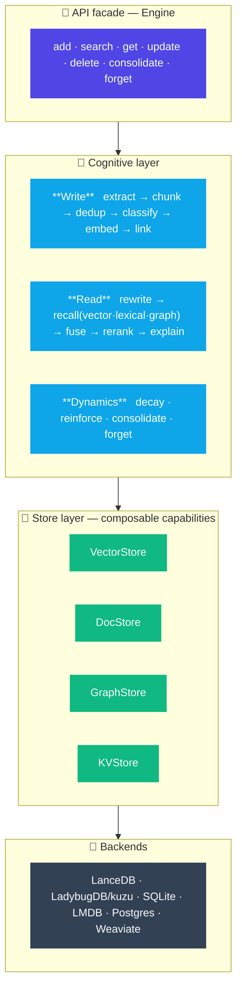
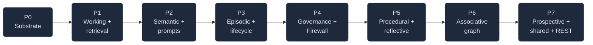

<div align="center">

# 🧠 memspine

### The memory spine for AI agents

*One clean API · composable stores · real learning dynamics*

<br/>

[](#-roadmap)
[](https://www.python.org/)
[](./LICENSE)
[](https://github.com/astral-sh/uv)
[](https://github.com/astral-sh/ruff)
[](./CONTRIBUTING.md)

<br/>

**memspine** turns raw agent interactions into a **structured, typed, self-maintaining memory** — with a real write pipeline, hybrid + graph retrieval, and background consolidation & forgetting — behind a small, stable API. It's the *engine*, not a product: the backbone something else plugs into.

[**Quickstart**](#-quickstart) · [**Architecture**](#-architecture) · [**Features**](#-what-makes-it-a-memory-system) · [**Defaults**](#-defaults--swap-ins) · [**Roadmap**](#-roadmap)

</div>

---

> [!NOTE]
> **Status: design-complete, pre-alpha.** The blueprint, decision register (D-01…D-43), and phase plan are finalized. Implementation lands phase by phase. The [`docs/`](./docs) folder is the single source of truth.

---

## ✨ Why memspine?

Most "memory" libraries are a thin `add / search` wrapper over a vector store. memspine is a **memory *system***.

<table>
<tr>
<th align="left">🗄️ A storage facade…</th>
<th align="left">🧠 …vs a memory system</th>
</tr>
<tr>
<td valign="top">

- dumps raw text into one backend
- vector **or** keyword search, pick one
- flat strings + metadata
- no lifecycle — memories never change
- no provenance, no audit
- you wire the graph yourself

</td>
<td valign="top">

- **write pipeline**: extract → chunk → dedup → classify → embed → link
- **hybrid recall**: vector **+** lexical **+** graph, fused with RRF, *explained*
- **typed model**: episodic · semantic · procedural · working · …
- **dynamics**: decay · reinforce · consolidate · forget
- **provenance + bitemporal facts** on every record
- **composable stores** — compose capabilities, don't pick one

</td>
</tr>
</table>

---

## 🏗️ Architecture

A **four-layer engine** over a pluggable store abstraction. The API surface stays tiny; the internals are a real pipeline.



Everything is **event-sourced**: an append-only log is the source of truth, and vector / graph / FTS / cache are rebuildable projectors.

---

## 🚀 Quickstart

```bash
# Core: a working brain with zero heavy deps
pip install memspine

# Add capabilities as extras:
pip install "memspine[lance,graph,lmdb]"        # LanceDB · LadybugDB · LMDB
pip install "memspine[ingest,ner,structured]"   # markitdown+chonkie · gliner2 · instructor
pip install "memspine[local]"                   # full offline stack
```

```python
from memspine import Engine

# Start from an archetype template; override anything.
mem = Engine.from_template("personal")

mem.remember("User prefers dark mode and lives in Berlin", user_id="alice")

hits = mem.recall("what are the user's preferences?", user_id="alice", explain=True)
for h in hits:
    print(h.content, "→ why:", h.trace)     # ✅ explainable retrieval
```

<details>
<summary><b>Config-driven usage</b> (defaults → template → your YAML → env → kwargs)</summary>

```python
from memspine import Engine

mem = Engine.from_config("memspine.yaml")
mem.describe()        # effective world: enabled types, services, policies, runner
mem.consolidate()     # run the sleep cycle now: consolidate → decay → compress
mem.forget(policy=...)  # policy-driven, compress-first, auditable
```

</details>

---

## 🧩 What makes it a memory system

|  | Feature | What it does |
|---|---------|--------------|
| 🧠 | **Typed memory model** | episodic · semantic · procedural · working · reflective · associative · prospective · shared · resource — each with its own lifecycle *(optional; `simple` profile collapses to flat semantic)* |
| 🔧 | **Real write pipeline** | extract → chunk → **dedup** (MinHash-LSH) → **classify** → embed → **link**, with provenance & versioning per record |
| 🔍 | **Hybrid + explainable recall** | vector + lexical (BM25/FTS) + graph traversal, fused with **RRF**, optional rerank, and a *"why recalled"* trace |
| ⏳ | **Learning dynamics** | Ebbinghaus **decay**, **reinforcement**-on-recall, background **consolidation** (sleep cycle), policy-driven **forgetting** |
| 🕰️ | **Bitemporal facts** | `valid_at` / `invalid_at` — invalidate-on-contradiction instead of destructive update |
| 🛡️ | **Memory Firewall** | trust scoring, quarantine & write-path anomaly detection vs memory poisoning *(OWASP ASI06)* |
| 📝 | **Customizable prompts** | every internal LLM call runs off a named, **versioned, override-able** prompt (YAML pack + registry + config layering) |
| 🧾 | **Auditable** | retrieval traces, full provenance, `forget --verify`, `audit taint` blast-radius tooling |

---

## 🎛️ Templates

Each template is a partial overlay on the default policy pack — enable the memory types and tune the policies that fit a use case.

| Template | Enables | Tuned for |
|----------|---------|-----------|
| 🎙️ `voice` | working + semantic + prospective; LMDB hot buffer | low-latency (< 200 ms) voice agents |
| 💻 `coding` | + procedural + reflective + episodic; skills verified via tests | coding agents with reusable skills |
| 🧑 `personal` | + prospective; medium decay | personal assistants |
| 🏦 `regulated_financial` | graph on; strict source authority; forgetting off; dry-run mandatory | audited / compliant deployments |
| 👥 `multi_agent` | + shared memory; agent source authority | multi-agent teams |

---

## 🔌 Defaults & swap-ins

Every capability is a port with a manifest — the engine plans against capabilities, degrades gracefully, and hard-fails with a clear *"install `memspine[graph]`"* when a required service is missing.

| Capability | 🟢 Default *(embedded, offline)* | 🚀 Production swap-in |
|------------|----------------------------------|-----------------------|
| **Vector** | **LanceDB** (+ built-in Tantivy FTS) | Weaviate |
| **Graph** | **LadybugDB** *(kuzu supported alt)* | Neo4j |
| **Cache / KV** | **LMDB** | Valkey / Redis |
| **Relational / event log** | **SQLite** (SQLAlchemy Core + Alembic) | Postgres |
| **Lexical** | **FTS5 / Tantivy** (BM25) | tsvector+GIN · VectorChord-BM25 |
| **Embeddings** | **fastembed** (ONNX, CPU) | Bedrock Titan / Cohere |
| **LLM** | **local**: Ollama · vLLM · llama.cpp · LM Studio · any OpenAI-compatible | AWS Bedrock |
| **Workers** | **inline** | DBOS (durable) · taskiq (brokered) |

---

## 🤖 Working with Claude Code

Building on memspine with Claude Code? [`CLAUDE.md`](./CLAUDE.md) + `.claude/` ship the project context, slash commands (`/phase`, `/decision`, `/scaffold`, `/check`) and subagents.

---

## 🗺️ Roadmap

Each phase ships independently and keeps `profile="simple"` behavior stable.



- [ ] **P0** substrate — event log · records · policies · SQLite *(next)*
- [ ] **P1** working memory + retrieval
- [ ] **P2** semantic + write pipeline + prompts
- [ ] **P3** episodic + lifecycle dynamics
- [ ] **P4** governance + Memory Firewall
- [ ] **P5** procedural + reflective
- [ ] **P6** associative graph
- [ ] **P7** prospective + shared + REST

---

## 🤝 Contributing

Contributions welcome — start with [`CONTRIBUTING.md`](./CONTRIBUTING.md) and the golden rules in [`CLAUDE.md`](./CLAUDE.md).

```bash
uv sync --all-extras
just check        # ruff + mypy + pytest
```

<div align="center">

---

**Built as an engine, not a black box.** 🧠

Apache-2.0 · [techiewonk/memspine](https://github.com/techiewonk/memspine)

</div>
