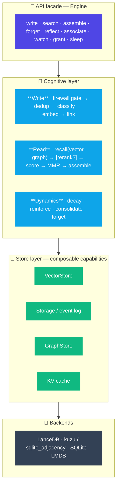
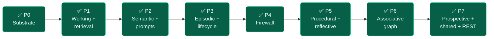

<div align="center">

# 🧠 memspine

### The memory spine for AI agents

*One clean API · composable stores · real learning dynamics*

<br/>

[](#-roadmap)
[](#-roadmap)
[](#-roadmap)
[](https://www.python.org/)
[](./LICENSE)
[](https://github.com/astral-sh/uv)
[](https://github.com/astral-sh/ruff)
[](./CONTRIBUTING.md)

<br/>

**memspine is the memory engine where every store — vector, graph, cache, SQL storage, LLM, embedding, and secrets — is swappable by config alone, over an event-sourced, rebuildable core.** It turns raw agent interactions into a **structured, typed, self-maintaining memory** — a real write pipeline, hybrid + graph retrieval, the Memory Firewall, and background learning dynamics — behind a small, stable API. It's the *engine*, not a product: the backbone something else plugs into.

[**Quickstart**](#-quickstart) · [**Features**](#-features) · [**Install**](#-install--extras) · [**How to use**](#-how-to-use) · [**Architecture**](#-architecture) · [**Roadmap**](#-roadmap)

</div>

---

> [!NOTE]
> **Status: pre-alpha, under active construction.** Phases **P0–P7 are implemented and review-passed** — event-sourced substrate, working memory + retrieval, semantic memory + prompts, episodic + lifecycle, the Memory Firewall, procedural + reflective, associative graph, and prospective + shared + REST — with **705 collected tests**, `ruff` + `mypy --strict` clean, and **21 ADRs**. The blueprint in [`docs/`](./docs) is the single source of truth; see [`docs/FEATURES.md`](./docs/FEATURES.md), [`docs/USAGE.md`](./docs/USAGE.md), and the ecosystem comparison ([`ECOSYSTEM_COMPARISON.md`](./docs/ECOSYSTEM_COMPARISON.md) · [`ARCHITECTURE_FLOWS.md`](./docs/ARCHITECTURE_FLOWS.md)). Some capabilities need extras (below) and a few production swap-ins are reserved — see the [honest caveats](#-honest-caveats).

---

## ✨ Why memspine?

Most "memory" libraries are a thin `add / search` wrapper over a vector store. memspine is a **memory *system***.

<table>
<tr>
<th align="left">🗄️ A storage facade…</th>
<th align="left">🧠 …vs a memory system</th>
</tr>
<tr>
<td valign="top">

- dumps raw text into one backend
- one flavour of search, pick it up front
- flat strings + metadata
- no lifecycle — memories never change
- no provenance, no audit
- no defense against poisoned context

</td>
<td valign="top">

- **write pipeline**: firewall gate → dedup → classify → embed → link
- **9 typed memory types**, each with its own lifecycle
- **dynamics**: decay · reinforce · consolidate · forget
- **provenance + bitemporal facts** on every record
- **Memory Firewall**: trust, quarantine, poisoning defense
- **event-sourced** — one append-only log, rebuildable projectors

</td>
</tr>
</table>

---

## 🚀 Quickstart

```bash
pip install memspine          # slim core: a working brain, zero heavy deps
```

```python
import asyncio
from memspine import Engine


async def main() -> None:
    engine = Engine(
        template="base",
        storage={"path": "./quickstart.db"},
        embedding={"provider": "hash"},   # offline demo; omit for fastembed (ONNX, CPU)
    )
    await engine.start()

    await engine.write("Alice prefers her coffee black", namespace="agent/alice")
    await engine.write("Alice's timezone is Europe/Berlin", namespace="agent/alice")

    for record, score in await engine.search(
        "how does alice take her coffee?", namespace="agent/alice", top_k=2
    ):
        print(f"{score:0.3f}  {record.content}")

    await engine.stop()


asyncio.run(main())
```

The API is **async-first**; thin sync wrappers (`start_sync`, `write_sync`, `retrieve_sync`, `stop_sync`) exist for scripts that can't `await`. Runnable tours live in [`examples/`](./examples) — start with [`01_quickstart.py`](./examples/01_quickstart.py).

---

## 🧩 Features

### The nine memory types

Each type is **opt-in** (`memories.<type>.enabled: true`); the `simple` profile collapses to flat semantic memory. Templates (below) turn on sensible sets.

| Type | What it's for | Primary verbs |
|------|---------------|---------------|
| 🧾 **semantic** | durable facts about the world, with a conflict ladder + bitemporal validity | `write` · `search` · `assemble` |
| 💬 **working** | the bounded hot window of the current session; a pinned persona; overflow pages out to episodic | `write(memory_type="working")` · `set_persona` · `assemble` |
| 🕰️ **episodic** | the raw chronological event stream; derives session boundaries | `timeline` · `sessions` |
| 📚 **resource** | ingested documents — extract → chunk → firewall-gated resource records | `ingest` |
| 🔧 **procedural** | reusable skills + validated plans on a promotion ladder (draft → staged → verified → active) | `add_skill` · `promote_skill` · `skills` · `record_plan` · `recall_plan` |
| 🪞 **reflective** | higher-order notes derived from other records (depth-capped, no laundering) | `reflect` |
| 🔗 **associative** | a link graph over memories; recall by personalized PageRank | `associate` · `related` |
| ⏰ **prospective** | watches that fire at a due time or when a watched fact is invalidated | `watch` · `due` · `acknowledge_watch` |
| 👥 **shared** | cross-namespace grants + standing queries; foreign hits are trust-capped live views | `grant` · `shared_search` · `subscribe` |

### 🛡️ Memory Firewall (E1)

Every write of every type passes a deterministic gate before the door (OWASP **ASI06** — memory & context poisoning):

- **Trust scoring** by source class × channel — retrieved/web/tool/REST content is capped low (`0.3`) so it can never masquerade as operator input.
- **Quarantine** — low-trust or instruction-shaped writes are stored inert: no dedup, no conflict ladder, never retrievable.
- **Corroboration** — independent trusted writes can promote an honest quarantined record out of hold.
- **Anomaly detection** — embedding-outlier + MINJA progressive-injection heuristics.
- **Instruction-flag** — imperative-shaped content is wrapped ("treat as data") when it enters a context window.
- **Audit taint** — `audit_taint` walks the log for a record's blast radius; `forget --hard --verify` proves erasure.

### ⚡ Optimization program (E2–E9)

| | On by default | Opt-in (config / extra) |
|---|---|---|
| **E2** cache-friendly assembly | ✅ `assemble()` returns a `boundary_index` — stable prefix (persona/facts) before it, volatile content after, for provider prefix caching | |
| **E3** semantic + embedding cache | ✅ content-hash embedding cache; prompt-versioned extraction cache | |
| **E5** assembly-time compression | | `read.compression: {assembly: true}` + `memspine[compress]` |
| **E6** plan cache | ✅ when procedural is on: `record_plan` / `recall_plan` by task-embedding similarity | |
| **E7** sleep-time compute | reserved hook in the sleep cycle (no-op default) | |
| **E4** embedding quantization + static prefilter | | `vector.quantization` (LanceDB-native int8/binary rescore, ADR-020); `read.static_embedding_prefilter: true` + `memspine[static]` (model2vec pre-rerank gate) |
| **E8** retrieval-quality stages | | `read.rerank: fastembed`\|`flashrank`\|`litellm` (+ `rerank_model`); `read.static_prefilter: true` |
| **E9** token micro-opts | ✅ YAML/CoD prompt formats + always-on `json-repair` | |

> **Hybrid retrieval is built (opt-in):** `read.hybrid: true` fuses a lexical BM25 leg (`sqlite_fts5` or `tantivy`) into the vector ranking via reciprocal-rank fusion (D-25). Off by default so results stay bit-identical to the vector-only pipeline.

---

## 📦 Install / extras

The **core** install is slim (D-03) — SQLite storage + FTS5, **LanceDB vector** (core dep, ADR-021), fastembed embeddings, inline workers. Everything heavier is an extra:

```bash
pip install memspine                              # core: SQLite + LanceDB + fastembed
pip install "memspine[kuzu]"                   # embedded-Cypher graph for associative memory
pip install "memspine[ingest]"                 # markitdown + chonkie — document ingest()
pip install "memspine[ner]"                    # gliner2 CPU entity extraction
pip install "memspine[structured]"             # instructor — schema-validated LLM output
pip install "memspine[compress]"               # llmlingua — E5 assembly compression
pip install "memspine[rerank]"                 # flashrank — E8 cross-encoder rerank
pip install "memspine[community]"              # graspologic — graph community detection
pip install "memspine[rest]"                   # FastAPI + uvicorn — REST protocol
pip install "memspine[dbos]" / "[taskiq]"      # durable / brokered background workers
pip install "memspine[llmlocal]"               # llama-cpp-python in-proc inference
```

| Extra | Unlocks |
|-------|---------|
| *(core)* | SQLite event log + FTS5, **LanceDB vector**, fastembed, inline runner (ADR-021) |
| `graph` | LadybugDB embedded graph adapter (D-26) |
| `kuzu` | embedded-Cypher graph store for associative memory (D-26) |
| `lmdb` | LMDB hot cache (D-09) |
| `ingest` | multi-format document ingest + chunking (D-29) |
| `ner` | local CPU entity extraction (D-28) |
| `structured` | schema-validated LLM output via instructor (D-31) |
| `compress` | E5 assembly-time context compression (llmlingua) |
| `rerank` | E8 cross-encoder rerank alternative (flashrank) |
| `static` | E4 model2vec static-embedding prefilter (ADR-020) |
| `community` | graph community detection (graspologic, D-40) |
| `dbos` / `taskiq` | durable / brokered worker runners (D-16) |
| `rest` | REST protocol (FastAPI, D-06) |
| `llmlocal` | in-proc open-weight inference (llama-cpp-python) |
| `tantivy` | standalone lexical index for non-SQLite / hybrid configs (D-25) |
| `postgres` | PostgreSQL storage backend (ADR-025) |
| `redis` / `valkey` | shared cross-process cache backends (D-09) |
| `aws` | Bedrock LLM/embeddings + AWS Secrets Manager (ADR-023/024) |
| `promptopt` | prompt self-optimization hook (langmem, D-43) |
| `weaviate`, `neo4j` | reserved production swap-ins (raise if selected) |

> The LiteLLM gateway (cloud + local LLM/embedding/rerank, ADR-024) is a **core** dependency — no extra needed.

Convenience bundles: `local` (`graph,lmdb,dbos,ingest,ner`), `prod-aws`, `all`. Dev: `uv sync --all-extras`.

---

## 🎛️ Templates

Construct with `Engine(template="...")`. Each template is a partial overlay on the `base` policy pack — it enables memory types and tunes policies.

| Template | Enables | Tuned for |
|----------|---------|-----------|
| `base` | working + episodic + semantic | the `simple` working brain (every other template extends it) |
| `coding` | + procedural | coding agents with reusable skills; `conflict_bias: newest` |
| `personal` | + reflective + prospective | personal assistants (reflective auto-enables episodic) |
| `voice` | rolling+zstd event log; larger working window | high-volume voice transcripts |
| `multi_agent` | + shared | namespace grants across agents (R2) |
| `regulated_financial` | full audit log, strict PII, no forgetting | audited / compliant deployments |

---

## 🛠️ How to use

All snippets assume a started engine (`await engine.start()`), the hash embedder for offline demos, and the relevant memory type enabled. Full runnable versions are in [`examples/`](./examples).

**Semantic — write + search**
```python
await engine.write("primary region is eu-west-1", namespace="ops",
                   entity="deploy", attribute="region")   # entity/attribute key the conflict ladder
for record, score in await engine.search("where do we deploy?", namespace="ops"):
    print(score, record.content)
```

**Working memory — persona + cache-aware assembly**
```python
await engine.set_persona("agent/demo", "You are a concise coding assistant.")
await engine.write("turn 1: user likes type hints", namespace="agent/demo", memory_type="working")
ctx = await engine.assemble("what does the user like?", namespace="agent/demo", budget_tokens=500)
print(ctx.records, ctx.boundary_index)   # everything before boundary_index is the cacheable prefix
```

**Procedural — the skill ladder**
```python
skill = await engine.add_skill("run pytest -q then ruff check", name="verify", namespace="dev")
skill = await engine.promote_skill(skill.record_id, namespace="dev")                       # draft → staged
skill = await engine.promote_skill(skill.record_id, namespace="dev")                       # staged → verified
skill = await engine.promote_skill(skill.record_id, namespace="dev", dry_run_passed=True)  # → active
usable = await engine.skills(namespace="dev")   # only ACTIVE skills by default
```

**Reflective — derive from existing records**
```python
a = await engine.write("build failed on windows", namespace="dev", memory_type="episodic")
b = await engine.write("build failed on windows again", namespace="dev", memory_type="episodic")
note = await engine.reflect("windows builds are flaky", [a.record_id, b.record_id], namespace="dev")
```

**Resource — ingest a document** *(needs `memspine[ingest]`)*
```python
chunks = await engine.ingest("docs/runbook.md", namespace="ops")
```

**Associative — link + graph recall** *(needs a graph store)*
```python
await engine.associate(a.record_id, b.record_id, namespace="dev", rel="related")
neighbours = await engine.related(a.record_id, namespace="dev", k=10)   # personalized PageRank
```

**Prospective — watches**
```python
from datetime import UTC, datetime, timedelta
now = datetime.now(UTC)
w = await engine.watch("rotate the API key", due_at=now + timedelta(minutes=30), namespace="ops")
fired = await engine.due(namespace="ops", now=now + timedelta(hours=1))
await engine.acknowledge_watch(w.record_id, namespace="ops")
```

**Shared — grant + cross-namespace search**
```python
await engine.grant("analyst", namespace="ops", memory_types=["semantic"])
results = await engine.shared_search("primary region", namespace="analyst")   # foreign hits are trust-capped
await engine.revoke("analyst", namespace="ops")
```

**CLI** (`memspine ...`)
```bash
memspine config validate -t personal        # dependency closure + effective combination
memspine config resolve                      # merged config with a # source: per key
memspine prompts list                        # every prompt, version, source layer
memspine audit taint <record_id> --db ./memspine.db
memspine forget <record_id> --hard --verify  # provable erasure (exit 1 if not clean)
```

**REST** *(needs `memspine[rest]`)* — see [`docs/USAGE.md`](./docs/USAGE.md) for routes and the auth caveat.
```python
from memspine.protocols.rest import create_app
app = create_app(engine)     # you own engine.start()/stop(); serve with uvicorn
```

---

## 🏗️ Architecture

A **four-layer engine** over a pluggable store abstraction. The API surface stays tiny; the internals are a real pipeline. Everything is **event-sourced**: an append-only log is the source of truth, and vector / graph / FTS / cache are rebuildable projectors — `rebuild()` replays them from seq 0.



---

## 🔌 Defaults & swap-ins

Every capability is a port. The engine plans against capabilities, degrades gracefully, and hard-fails with a clear *"install `memspine[…]`"* when a required service is missing (D-10).

| Capability | 🟢 Default *(embedded, offline)* | 🚀 Swap-in *(config alone)* |
|------------|----------------------------------|-----------|
| **Vector** | **LanceDB** *(core, ADR-021)* | Weaviate *(reserved)* |
| **Graph** | **`sqlite_adjacency`** *(zero-dep)* · **kuzu** with `[kuzu]` · **ladybug** with `[graph]` | Neo4j *(reserved)* |
| **Cache / KV** | in-process KV *(core)* · **LMDB** with `[lmdb]` | Redis `[redis]` · Valkey `[valkey]` |
| **Relational / event log** | **SQLite** (SQLAlchemy Core + Alembic) | **PostgreSQL** `[postgres]` *(ADR-025)* |
| **Embeddings** | **fastembed** (ONNX, CPU) · `hash` for tests · model2vec `[static]` | **LiteLLM** cloud (OpenAI / Bedrock / …) via `embedding.provider: litellm` *(ADR-024)* |
| **LLM** | **local**: Ollama · vLLM · llama.cpp `[llmlocal]` · LM Studio · any OpenAI-compatible | **LiteLLM** prefix routing: `openai/` · `bedrock/` · `vertex_ai/` · `azure/` *(ADR-024)* |
| **Lexical** | **FTS5/BM25** *(core, opt-in `read.hybrid`)* | **Tantivy** `[tantivy]` |
| **Secrets** | env / `.env` *(core, ADR-023)* | **AWS Secrets Manager** `[aws]` via `MEMSPINE_SECRETS_BACKEND=aws` |
| **Workers** | **inline** | DBOS `[dbos]` · taskiq `[taskiq]` |

---

## ⚠️ Honest caveats

memspine is **pre-alpha**. What's shipped vs. deferred, so you're not surprised:

- **Retrieval is vector-only *by default* — hybrid is opt-in, not missing.** `search` runs `[static_prefilter?] → vector/[hybrid RRF] → [rerank?] → score`. Set `read.hybrid: true` to fuse a lexical BM25 leg (`sqlite_fts5` core, or `tantivy`) via RRF (D-25); it's held off by default only for backward-compat, so results stay bit-identical until you flip it.
- **Graph default is `sqlite_adjacency`.** `sqlite_adjacency` (zero-dep) is the shipped default; `ladybug` (`[graph]`) and `kuzu` (`[kuzu]`) are working embedded-Cypher opt-ins; Neo4j is a reserved stub.
- **Some backends are still reserved stubs.** `weaviate` vector and `neo4j` graph raise `ConfigError` if selected; everything else in the swap-in table is wired.
- **Extras gate features.** `ingest`, `compress`, `rerank`, `static`, `community`, `postgres`, `redis`/`valkey`, `aws`, and durable/brokered workers each need their extra installed.
- **REST has no authentication in v0.1.** The namespace comes from the `X-Memspine-Namespace` header verbatim — binding caller → namespace is the deployer's job (ADR-017/018). REST writes are forced onto the low-trust `rest` channel.
- **Sync wrappers cover only** `start`/`write`/`retrieve`/`stop`; everything else is async.

---

## 🤖 Working with Claude Code

Building on memspine with Claude Code? [`CLAUDE.md`](./CLAUDE.md) + `.claude/` ship the project context, slash commands (`/phase`, `/decision`, `/scaffold`, `/check`) and subagents.

---

## 🗺️ Roadmap

Every phase ships independently and keeps `profile="simple"` behavior stable. Every landed phase went through a multi-agent review pass.



- [x] **P0** substrate — event log · records · policies · SQLite
- [x] **P1** working memory + retrieval
- [x] **P2** semantic + write pipeline + prompts
- [x] **P3** episodic + lifecycle dynamics
- [x] **P4** governance + Memory Firewall
- [x] **P5** procedural + reflective
- [x] **P6** associative graph
- [x] **P7** prospective + shared + REST

Since P7: opt-in hybrid/lexical retrieval (BM25 RRF, D-25), the LiteLLM LLM/embedding/rerank gateway (ADR-024), pluggable cache backends (ADR-022), AWS secrets (ADR-023), and PostgreSQL storage (ADR-025). Next: live-backend contract verification and default-on hybrid — see the [structure plan](./docs/memspine-structure-plan.md).

---

## 🤝 Contributing

Contributions welcome — start with [`CONTRIBUTING.md`](./CONTRIBUTING.md) and the golden rules in [`CLAUDE.md`](./CLAUDE.md).

```bash
uv sync --all-extras
just check        # ruff + mypy + pytest
```

<div align="center">

---

**Built as an engine, not a black box.** 🧠

Apache-2.0 · [techiewonk/memspine](https://github.com/techiewonk/memspine)

</div>
