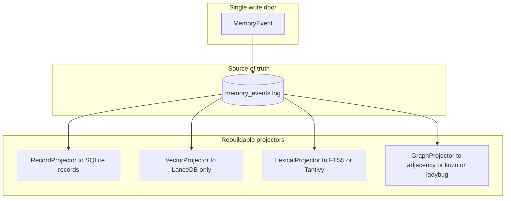
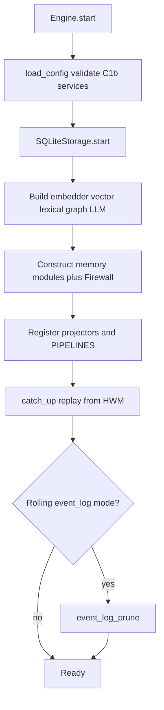
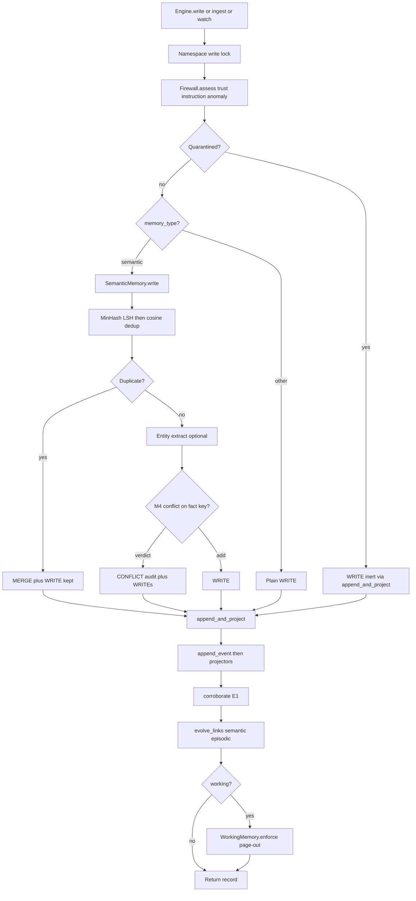
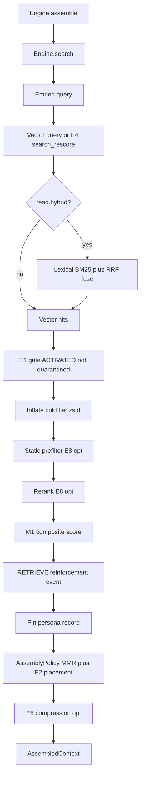
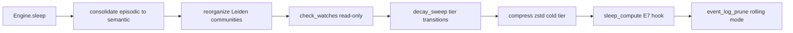
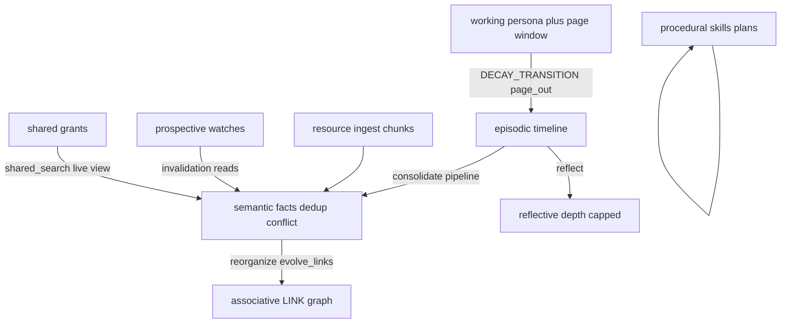
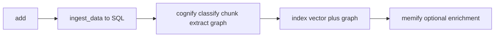
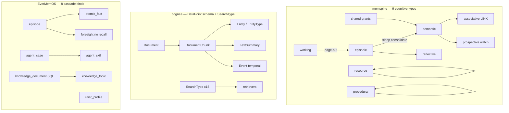
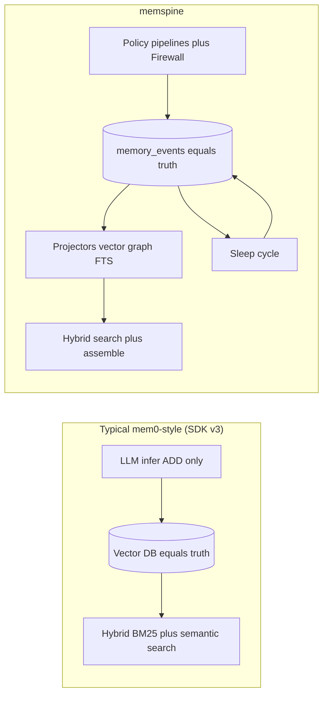

# memspine — Architecture Flows (Ecosystem)

**Status:** Evidence document · **Last verified:** 2026-07-10 (pass **#4** — final confirmation, 18 dedicated agents)  
**Prior passes:** 2026-07-09 initial · 2026-07-10 pass #2 architecture · pass #3 stage/package/prompt/I/O · **pass #4** final doc confirmation.

**Companion:** [`ECOSYSTEM_COMPARISON.md`](./ECOSYSTEM_COMPARISON.md) — matrices, novelty scorecard, §3.10–§3.14 stage/package/prompt/memory-I/O tables, reviewer log §8. **Pass #5 deep methodology / full prompts / algorithms:** [`ECOSYSTEM_METHODOLOGY.md`](./ECOSYSTEM_METHODOLOGY.md) · [`ECOSYSTEM_PROMPTS.md`](./ECOSYSTEM_PROMPTS.md) · [`exports/ECOSYSTEM_ALGORITHMS.csv`](./exports/ECOSYSTEM_ALGORITHMS.csv). **Exports:** [`exports/ECOSYSTEM_PEER_TRACE.csv`](./exports/ECOSYSTEM_PEER_TRACE.csv) · [`exports/ECOSYSTEM_WRITE_STAGES.csv`](./exports/ECOSYSTEM_WRITE_STAGES.csv) · [`exports/ECOSYSTEM_REPO_SYNC.csv`](./exports/ECOSYSTEM_REPO_SYNC.csv).

Code-traced flow reference for **memspine** and **16 peer engines** under `D:\mem`. Every diagram maps to cited entry points; "none" backgrounds include grep evidence.

---

## 1. How to read this document

### Legend

| Symbol | Meaning |
|--------|---------|
| Solid arrow | Synchronous hot path |
| Dashed arrow | Async / scheduled / optional |
| `[opt]` | Config-gated stage |
| `SoT` | Source of truth store |

### Repos in scope

| ID | Repo | Package | Primary facade |
|----|------|---------|----------------|
| MS | memspine | `memspine` | `Engine` |
| CG | cognee | `cognee` | `add` / `cognify` / `search` |
| GT | graphiti | `graphiti-core` | `Graphiti` |
| M0 | mem0 | `mem0ai` | `Memory` |
| MO | MemOS | `MemoryOS` | `MOS` (`MOSCore` engine) |
| HN | honcho | `honcho` | FastAPI + SDK `Session` |
| OM | OpenMemory | `openmemory-py` | `Memory` |
| RM | ReMe | `reme-ai` | `ReMe.run_job` |
| UM | unimem | `unimem` | `Memory` |
| LM | LightMem | `lightmem` | `LightMemory` |
| PM | powermem | `powermem` | `Memory` |
| MB | MemoryBear | `api` | LangGraph write/read graphs |
| MM | MemMachine | `memmachine-server` | `MemMachine` |
| LG | langmem | `langmem` | LangGraph store tools |
| AM | A-mem | upstream: `agentic-memory` / telemem baseline | `AgenticMemorySystem` |
| EO | EverMemOS | `everos` | `memorize` / `search` |
| HS | hindsight | `hindsight-api-slim` | `MemoryEngine` |
| SM | SimpleMem | (root) | `SimpleMemSystem` / `CrossMemOrchestrator` |

---

## 2. memspine reference flows

### 2.1 Storage model

**Citations:** `core/events.py:EventKind` · `engine.py:Engine._append_and_project` · `services/storage/sqlite/engine.py:SQLiteStorage.append_event` · vector projector: LanceDB only ([ADR-021](./adr/ADR-021-lancedb-core-vector.md))

### 2.2 Startup

**Citations:** `engine.py:Engine._start_inner` · `core/replay.py:catch_up` · `workers/pipelines.py:PIPELINES`

### 2.3 Write path

**Citations:** `engine.py:Engine.write` · `engine.py:Engine._write_locked` · `memories/semantic/store.py:SemanticMemory.write` · `core/firewall.py:Firewall.assess`

### 2.4 Search and assemble

**Citations:** `engine.py:Engine.search` · `engine.py:Engine.assemble` · `core/policies/assembly.py:AssemblyPolicy.assemble`

### 2.5 Sleep cycle

**Citations:** `workers/schedule.py:SLEEP_CYCLE_ORDER` · `workers/schedule.py:run_sleep_cycle` · `workers/pipelines.py:consolidate|reorganize|decay_sweep|compress`

### 2.6 Nine-type spill and derivation

### 2.7 Cross-namespace read

**Path:** `Engine.shared_search` → own `search()` → `SharedMemory.grants_to` → per-grantor **vector-only** query (no hybrid/rerank on foreign leg) → `grant_allows` → trust cap `TRUST_RETRIEVED_CAP` → merge truncate (no RETRIEVE on foreign hits).

**Citations:** `engine.py:Engine.shared_search` · `core/namespace.py:grant_allows` · `memories/shared/grants.py`

### 2.8 Stage technology, prompts, and memory I/O (pass #3)

Cross-repo stage names: [`ECOSYSTEM_COMPARISON.md`](./ECOSYSTEM_COMPARISON.md) §3.11.

| Stage | Module:function | Package | Hot path? |
|-------|-----------------|---------|-----------|
| firewall | `Firewall.assess` | internal | yes |
| dedup | `DedupPolicy` + semantic store | datasketch, fastembed | semantic writes |
| entity_extract | `LLMEntityExtractor` / `GlinerEntityExtractor` | gliner2 `[ner]`, LLM | opt-in |
| conflict | `_resolve_conflict` | internal M4 | semantic keyed facts |
| event_append | `_append_and_project` | sqlalchemy, lancedb projectors | yes |
| vector_search | `LanceDBVectorStore.query` | lancedb, fastembed | yes |
| bm25 + rrf | `SQLiteFTS5Lexical` + `rrf_fuse` | FTS5 / tantivy | opt-in hybrid |
| rerank | `fastembed_rerank` / flashrank | E8 extras | opt-in |
| mmr_assembly | `AssemblyPolicy.assemble` | llmlingua E5 opt | assemble() |
| sleep pipelines | `consolidate` → `reorganize` → `decay_sweep` → `compress` | graspologic `[community]`, zstandard | `Engine.sleep()` |

**Prompt hot path:** `extract.yaml` (entity LLM) · `summarize.yaml` (consolidate) · reserved: `query_rewrite`, `judge`, `consolidate`, `reflect`.

**Nine types I/O:** see [`ECOSYSTEM_COMPARISON.md`](./ECOSYSTEM_COMPARISON.md) §3.14 memspine row; spill diagram §2.6 above.

### 2.9 Traced symbol index (memspine)

| Flow | Entry |
|------|-------|
| Write | `engine.py:Engine.write` → `_write_locked` |
| Semantic write | `memories/semantic/store.py:SemanticMemory.write` |
| Search | `engine.py:Engine.search` |
| Assemble | `engine.py:Engine.assemble` |
| Sleep | `engine.py:Engine.sleep` → `run_sleep_cycle` |
| Consolidate | `workers/pipelines.py:consolidate` |
| Firewall | `core/firewall.py:Firewall.assess` |
| Events | `core/events.py:EventKind` |

---

## 3. Peer flow catalog

Each subsection uses the **full repository name** (legacy abbrev in parentheses). **Pass #3** added stage/package/prompt/memory-I/O detail in [`ECOSYSTEM_COMPARISON.md`](./ECOSYSTEM_COMPARISON.md) §3.10–§3.14 and §8 below.

### 3.0 Peer quick trace (pass #3 — write → read → background)

| Repository | Write input → stored | Read input → output | Key packages | Prompts (hot) |
|------------|----------------------|---------------------|--------------|---------------|
| **memspine** | `Engine.write` → `memory_events` + projectors | query → hybrid opt-in → assemble | lancedb, fastembed, datasketch, sqlalchemy | extract, summarize (sleep) |
| **cognee** | files → SQL Data → cognify graph+vector | query → SearchType retriever → LLM answer | lancedb, kuzu, instructor, litellm | generate_graph_prompt, summarize |
| **graphiti** | episode_body → Neo4j edges | query → hybrid RRF edges / cross-encoder `search_` | neo4j, openai, numpy | extract_nodes/edges, dedupe |
| **mem0** | messages → Qdrant payload | query → BM25+semantic+entity fuse | qdrant, spacy `[nlp]` | ADDITIVE_EXTRACTION |
| **MemOS** | messages → Neo4j tree cubes | query → RerankerFactory → reasoner | neo4j, datasketch, chonkie | SIMPLE_STRUCT_MEM_READER |
| **honcho** | MessageCreate → Postgres docs | query → RRF hybrid search | pgvector, lancedb, json-repair | minimal_deriver_prompt |
| **OpenMemory** | content → hsg_mem SQLite | query → weighted sector fusion | openai, sqlite | — (regex sectors) |
| **ReMe** | conversation → daily.md | query → RRF numpy+BM25 (embeddings on) | frontmatter, zstd, faiss opt | auto_memory.yaml |
| **unimem** | str → backend row | query → backend search | pydantic + backend extras | 1 infer prompt |
| **LightMem** | messages → Qdrant entry | query → embed k-NN | llmlingua, qdrant, torch | METADATA_GENERATE |
| **powermem** | messages → OceanBase row | query → hybrid RRF | pyobvector, rank-bm25 | FACT_RETRIEVAL |
| **MemoryBear** | messages → Neo4j graph | query → weighted hybrid + LangGraph | neo4j, celery, jinja2 | extract_statement.jinja2 |
| **MemMachine** | EpisodeEntry[] → SQL+graph | query → RRFHybridReranker LTM | neo4j, qdrant, fastmcp | semantic update prompts |
| **langmem** | tool/manager invoke → BaseStore | search tool → store items | langgraph, trustcall | _MEMORY_INSTRUCTIONS |
| **A-mem** | add_note → ChromaDB | query → vector (+ links) | chromadb, litellm | evolution JSON prompt |
| **EverMemOS** | chat → markdown memcells | query → RRF hierarchy | lancedb, everalgo wheels | episode_extract slot |
| **hindsight** | content → pgvector facts | query → RRF + cross-encoder rerank | pgvector, litellm, fastmcp | CONCISE_FACT_EXTRACTION_PROMPT |
| **SimpleMem** | Dialogue → LanceDB 3-view | question → union merge + LLM answer | lancedb, sentence-transformers | extraction JSON prompt |

---

### 3.1 cognee (CG)

**SoT:** SQLAlchemy relational `data`/`datasets` — not event log. **Graph+vector** written by cognify/memify.

**Write**

**Read:** `modules/search/methods/search.py:search` (public facade: `api/v1/search/search.py:search`) → retriever by `SearchType` (graph completion, chunks, RAG, temporal).

**Background:** `cognify(run_in_background=False)` default **blocking** asyncio · optional `run_in_background=True` · Modal `graph_saving_worker` with `[distributed]` extra · `memify` (enrichment, not cognitive consolidation).

**Delta vs memspine:** two-phase add→cognify; no firewall; no nine-type taxonomy; relational not event SoT.

**Pass #3 trace:** files→SQL→cognify · SearchType→LLM · lancedb/kuzu/instructor · [`CSV row`](./exports/ECOSYSTEM_PEER_TRACE.csv).

---

### 3.2 graphiti (GT)

**SoT:** Property graph (Neo4j/Kuzu/FalkorDB). Episodes + entity edges with validity.

**Write:** `graphiti_core/graphiti.py:add_episode` → context retrieval → LLM extract nodes → dedup resolve → extract edges → invalidate stale → save (+ inline `update_communities` or separate `build_communities`).

**Read:** `Graphiti.search` = edge hybrid RRF (vector + fulltext); with `center_node_uuid` → **node-distance** rerank. `search_` default = BFS + **cross-encoder** (MMR via config recipes).

**Background:** None internal — docstring recommends external queue. **REST + MCP** servers ship in-repo.

**Delta vs memspine:** graph-native SoT; strong bitemporal edges; no sleep cycle; no Memory Firewall.

**Pass #3 trace:** episode→Neo4j edges · hybrid RRF / cross-encoder · neo4j/openai · [`CSV row`](./exports/ECOSYSTEM_PEER_TRACE.csv).

---

### 3.3 mem0 (M0)

**SoT:** Vector store payloads; SQLite `history` audit adjunct.

**Write:** `mem0/memory/main.py:Memory.add` → `_add_to_vector_store` → LLM **ADD-only** infer (SDK v3) → embed → vector upsert.

**Read:** `Memory.search` → embed → **hybrid BM25+semantic+entity** k-NN → threshold → optional reranker.

**Background:** **None** (inline infer only). **Graph/Neo4j removed from OSS v3.**

**Delta vs memspine:** flat CRUD; no consolidation; no conflict ladder; broadest backend matrix.

**Pass #3 trace:** messages→Qdrant · BM25+semantic+entity · qdrant/spacy · [`CSV row`](./exports/ECOSYSTEM_PEER_TRACE.csv).

---

### 3.4 MemOS (MO)

**SoT:** Per-MemCube stores (Qdrant/Milvus + Neo4j tree + KV + pref).

**Write:** `mem_os/core.py:MOSCore.add` → `mem_reader` extract → `text_mem.add` → `mem_scheduler.submit_messages` *(when scheduler enabled)*.

**Read:** `MOSCore.search` → per-cube search → tree BM25+graph → **`RerankerFactory`/`BaseReranker`** → reasoner.

**Background:** `mem_scheduler/` (defaults to **in-process threads**; Redis/RabbitMQ optional; **default off**) · `GraphStructureReorganizer`. **MCP:** `fastmcp` + `MOSMCPServer` in core.

**Delta vs memspine:** scheduler **opt-in**; four cubes not nine types; no event log; richest ingest toolbox.

**Pass #3 trace:** messages→Neo4j cubes · RerankerFactory→reasoner · neo4j/chonkie/markitdown · [`CSV row`](./exports/ECOSYSTEM_PEER_TRACE.csv).

---

### 3.5 honcho (HN)

**SoT:** PostgreSQL `Message` rows; vectors in **pgvector** default (LanceDB/TP optional).

**Write:** `crud/message.py:create_messages` → embed → `deriver/enqueue.py:enqueue` → LLM representation → observations (+ optional post-deriver cosine dedup).

**Read:** `utils/search.py:search` (**RRF hybrid**) · `Session.context()` / `Peer.chat`.

**Background:** `deriver/consumer.py:process_item` · `dreamer/orchestrator.py` · `dream_scheduler.py`. **MCP server** in `mcp/`.

**Delta vs memspine:** server-first session memory; dreamer not typed cognitive engine; optional cosine dedup; JWT when `AUTH_USE_AUTH=true`.

**Pass #3 trace:** MessageCreate→Postgres · RRF hybrid · pgvector/lancedb/json-repair · [`CSV row`](./exports/ECOSYSTEM_PEER_TRACE.csv).

---

### 3.6 OpenMemory (OM)

**Scope note:** production default is **openmemory-js** (`opm serve`); **openmemory-py** is MCP-first SDK mirror.

**SoT:** SQLite `memories` + per-sector **brute-force cosine** vector index (ANN backends optional).

**Write:** `memory/hsg.py:add_hsg_memory` / `hsg.ts` equivalent → simhash dedup → sector classify → chunk → multi-sector embed → insert.

**Read:** `hsg_query` → multi-sector scan → **weighted linear fusion** (not RRF) → salience/decay → waypoint BFS expansion → reinforce on read.

**Background:** Read-time dynamics (`ops/dynamics.py`). **Python:** batch `reflect.py`/`apply_decay()` **not scheduled**. **JS server:** decay + reflection **scheduled** via `setInterval`. **Python REST** `create_app()` orphan; **JS** ships REST+MCP together.

**Delta vs memspine:** five sectors inspire taxonomy; temporal graph unwired to query; no rebuild/projector model.

**Pass #3 trace:** content→hsg_mem · weighted sector fusion · openai/sqlite · [`CSV row`](./exports/ECOSYSTEM_PEER_TRACE.csv).

---

### 3.7 ReMe (RM)

**SoT:** Markdown files on disk (workspace).

**Write:** `steps/file_io/write.py:WriteStep` → frontmatter → `watch_changes` re-index.

**Read:** `steps/index/search.py:SearchStep` → BM25 default; when `embedding_store` enabled → parallel **local numpy cosine** (FAISS opt-in) + BM25 → RRF → link expansion.

**Background:** `components/job/background_job.py` · `run_job("auto_dream")` dream pipeline · `CronJob`.

**Delta vs memspine:** file-native SoT (D-30 skipped by memspine); human-auditable; no SQL event log.

**Pass #3 trace:** conversation→daily.md · RRF numpy+BM25 · frontmatter/zstandard · [`CSV row`](./exports/ECOSYSTEM_PEER_TRACE.csv).

---

### 3.8 unimem (UM)

**SoT:** Pluggable `MemoryBackend` (Postgres/Weaviate/Neo4j/Redis/in-memory).

**Write:** `unimem/memory.py:Memory.add` → optional infer split → `backend.add`.

**Read:** `Memory.search` → backend k-NN → optional `apply_combined_score` recency re-rank.

**Background:** **None** (grep: no scheduler/sleep in repo).

**Delta vs memspine:** intentional thin facade — the v1 design memspine reworks.

**Pass #3 trace:** str→backend row · backend search · pydantic-only core · [`CSV row`](./exports/ECOSYSTEM_PEER_TRACE.csv).

---

### 3.9 LightMem (LM)

**SoT:** Qdrant vectors (+ optional summary index).

**Write:** `lightmem/memory/lightmem.py:add_memory` (`LightMemory` facade) → compress/segment/extract → `embedding_retriever.insert`.

**Read:** `retrieve` → embed → Qdrant k-NN.

**Background:** `offline_update` / `offline_update_all_entries`; FluxMem `consolidate()` in eval track.

**Delta vs memspine:** research layer toolkit; LLMLingua validates E5; torch-heavy.

**Pass #3 trace:** messages→Qdrant · embed k-NN · llmlingua/qdrant/torch · [`CSV row`](./exports/ECOSYSTEM_PEER_TRACE.csv).

---

### 3.10 powermem (PM)

**SoT:** Vector row (+ OceanBase hybrid indexes or pgvector/SQLite).

**Write:** `core/memory.py:Memory.add` → `_intelligent_add` (fact extract, dedup, graph) or `_simple_add`.

**Read:** `search` → OceanBase hybrid vector+FTS → **RRF when hybrid enabled** (graph leg separate) → optional cross-encoder rerank → `EbbinghausIntelligencePlugin.on_search`.

**Background:** Inline/thread-pool on search — not ordered sleep cycle.

**Delta vs memspine:** single-DB hybrid ops leader; no event SoT or firewall.

**Pass #3 trace:** messages→OceanBase · hybrid RRF · pyobvector/rank-bm25 · [`CSV row`](./exports/ECOSYSTEM_PEER_TRACE.csv).

---

### 3.11 MemoryBear (MB)

**Scope:** `api/app/core/memory/` only.

**SoT:** Neo4j graph (dialogue → chunk → statement → entity).

**Write:** `extraction_orchestrator.py:ExtractionOrchestrator.run` → extract → dedup merge → Neo4j.

**Read:** `search_service.py:execute_hybrid_search` · LangGraph `retrieve_nodes` → Lucene + semantic (**weighted fusion, not RRF**).

**Background:** Celery `run_forgetting_cycle_task` → **`ForgettingScheduler.run_forgetting_cycle`**; `reflection_run` (partial stub).

**Delta vs memspine:** ACT-R forgetting reference; celery-coupled; product monorepo not embeddable library.

**Pass #3 trace:** messages→Neo4j · weighted hybrid+LangGraph · neo4j/celery/jinja2 · [`CSV row`](./exports/ECOSYSTEM_PEER_TRACE.csv).

---

### 3.12 MemMachine (MM)

**SoT:** SQL episode storage (write anchor) + Neo4j episodic + semantic/pgvector.

**Write:** `memmachine.py:MemMachine.add_episodes` → episode storage + episodic graph + semantic message.

**Read:** `query_search` → parallel episodic + semantic search; episodic LTM uses configured reranker (**RRFHybridReranker** default wizard); optional retrieval agent inside episodic branch when `agent_mode=True`.

**Background:** Semantic `_background_ingestion_task` · clustering/cleanup · STM consolidator. **MCP server** (FastAPI). **No event-log `rebuild()`** — `sqlite_vector_store` pending-ops replay only.

**Delta vs memspine:** closest episode-log cousin; two types only; no firewall.

**Pass #3 trace:** EpisodeEntry[]→SQL+graph LTM · RRFHybridReranker · neo4j/qdrant/fastmcp · [`CSV row`](./exports/ECOSYSTEM_PEER_TRACE.csv).

---

### 3.13 langmem (LG)

**SoT:** LangGraph `BaseStore` (caller-owned Postgres/InMemory).

**Write:** **`create_manage_memory_tool`** (hot-path agent write) · **`create_memory_store_manager`** (automated trustcall → store) · `create_memory_manager` (stateless extract, no persist).

**Read:** `create_search_memory_tool` → `BaseStore.search`.

**Background:** `ReflectionExecutor.submit` · `short_term/summarization.py`.

**Delta vs memspine:** SDK glue layer; storage-agnostic; no engine governance.

**Pass #3 trace:** tool/manager→BaseStore · search tool · langgraph/trustcall · [`CSV row`](./exports/ECOSYSTEM_PEER_TRACE.csv).

---

### 3.14 A-mem (AM)

**Status:** Two trees — upstream `D:\mem\A-mem` (ChromaDB, 22 pytest) vs telemem baseline `telemem/baselines/A-mem` (VLLM, 1 eval). Production → A-mem-sys.

**SoT (upstream):** ChromaDB collection + in-memory metadata.

**Write (upstream):** `agentic_memory/memory_system.py:AgenticMemorySystem.add_note` → `process_memory` (Zettelkasten link evolution).

**Read (upstream):** `find_related_memories` → Chroma similarity (+ **no BM25** in either tree).

**Background:** `consolidate_memories` every `evo_threshold` writes.

**Delta vs memspine:** link evolution inspired `_evolve_links`; not production-durable.

**Pass #3 trace:** add_note→ChromaDB · vector+link expand · chromadb/litellm · [`CSV row`](./exports/ECOSYSTEM_PEER_TRACE.csv).

---

### 3.15 EverMemOS / everos (EO)

**SoT:** **Markdown files** (`EpisodeWriter`: "md is the SoT") + SQLite index + LanceDB projector.

**Inspectability boundary:** Algorithm cores in **`everalgo-user-memory`**, **`everalgo-agent-memory`**, **`everalgo-rank`**, **`everalgo-knowledge`** PyPI wheels — OSS repo is chassis + OME orchestration.

**Write:** `service/memorize.py:memorize` → chat ingest pipeline → `prepare_cells` (**`everalgo.boundary`**) → `UserMemoryPipeline.run` → `EpisodeWriter.append_entry`.

**Read:** `service/search.py:search` → `memory/search/manager.py` → hybrid/agentic (**`everalgo.rank`**).

**Background:** OME `infra/ome/engine.py` · strategies `reflect_episodes`, `extract_atomic_facts`, profile clustering · `memory/cascade/worker.py` rebuilds LanceDB from md. **8 memory kinds** in KIND_REGISTRY.

**Delta vs memspine:** validates markdown→projector pattern; memspine fully OSS inspectable with event log SoT.

**Pass #3 trace:** chat→memcells · RRF hierarchy+everalgo · lancedb/everalgo · [`CSV row`](./exports/ECOSYSTEM_PEER_TRACE.csv).

---

### 3.16 hindsight (HS)

**SoT:** PostgreSQL `memory_units` + pgvector HNSW + graph link tables.

**Write:** `memory_engine.py:retain_async` → `retain/orchestrator.py:retain_batch` → `insert_facts_batch`.

**Read:** `recall_async` — parallel semantic/keyword/graph/temporal legs; **3 fact types** (world, experience, observation).

**Background:** `submit_async_consolidation` · `worker/poller.py` · `reflect_async`. **MCP shipped** in api-slim.

**Delta vs memspine:** retain/recall/reflect API ergonomics; bank/mission scoping; server product shape.

**Pass #3 trace:** content→pgvector facts · RRF+cross-encoder rerank · pgvector/litellm/fastmcp · [`CSV row`](./exports/ECOSYSTEM_PEER_TRACE.csv).

---

### 3.17 SimpleMem (SM)

**SoT:** Core: LanceDB entries. Cross: SQLite `sessions`/`session_events`/`observations` + LanceDB vectors.

**Write (core):** `main.py:add_dialogue` → `memory_builder.py:add_dialogue` → **LLM structured extraction** (entities/persons/keywords) → Stage 2 consolidation inline.

**Read (core):** `ask` → `hybrid_retriever.py:retrieve` → LLM intent plan → **union merge** multi-view (RRF only in EvolveMem) → `answer_generator`.

**Background (cross):** `consolidation.py:ConsolidationWorker` — decay/merge/prune observations. Facades: **`SimpleMemSystem`** + **`CrossMemOrchestrator`**.

**Delta vs memspine:** multi-view hybrid + session subsystem; no firewall or nine-type policy stack.

**Pass #3 trace:** Dialogue→LanceDB 3-view · union merge+LLM · lancedb/sentence-transformers · [`CSV row`](./exports/ECOSYSTEM_PEER_TRACE.csv).

---

### 3.18 Memory-type deep dive — memspine × cognee × EverMemOS

Full tables: [`ECOSYSTEM_COMPARISON.md`](./ECOSYSTEM_COMPARISON.md) **§3.15**. CSV: [`exports/ECOSYSTEM_MEMORY_TYPES_MS_CG_EO.csv`](./exports/ECOSYSTEM_MEMORY_TYPES_MS_CG_EO.csv).

| Axis | memspine | cognee | EverMemOS |
|------|----------|--------|-----------|
| Type model | 9 enable-keyed cognitive types | ~50 DataPoint kinds; no MemoryType API | 8 KIND_REGISTRY cascade kinds |
| SoT | `memory_events` | SQL Data + graph | markdown files |
| Closest episodic | episodic + working | DocumentChunk / Event | **episode** |
| Closest semantic | semantic (M4) | Entity + TextSummary | **atomic_fact** |
| Closest procedural | procedural ladder | Rule/RuleSet memify | **agent_skill** |
| Closest resource | resource ingest | Document* | knowledge_document + topic |
| Unique to memspine | firewall, shared grants, prospective due/ack, sleep decay | — | — |
| Unique to peer | — | SearchType strategies; code/web DataPoints | foresight write; opaque everalgo |

---

## 4. Side-by-side flow comparison tables

**Full repository names:** [`ECOSYSTEM_COMPARISON.md`](./ECOSYSTEM_COMPARISON.md) §3.0. Column abbreviations: MS=memspine, CG=cognee, GT=graphiti, M0=mem0, MO=MemOS, HN=honcho, OM=OpenMemory, RM=ReMe, UM=unimem, LM=LightMem, PM=powermem, MB=MemoryBear, MM=MemMachine, LG=langmem, AM=A-mem, EO=EverMemOS, HS=hindsight, SM=SimpleMem.

### 4.1 Write stages

| Stage | MS | CG | GT | M0 | MO | HN | OM | RM | UM | LM | PM | MB | MM | LG | AM | EO | HS | SM |
|-------|:--:|:--:|:--:|:--:|:--:|:--:|:--:|:--:|:--:|:--:|:--:|:--:|:--:|:--:|:--:|:--:|:--:|:--:|
| Trust/firewall gate | ✅ | ❌ | ❌ | ❌ | ❌ | ❌ | 🔶 | ❌ | ❌ | ❌ | ❌ | ❌ | ❌ | ❌ | ❌ | ❌ | ❌ | 🔶 |
| Dedup pre-store | ✅ | 🔶 | ✅ | 🔶 | 🔶 | ❌ | ✅ | ❌ | ❌ | ❌ | ✅ | ✅ | ❌ | ❌ | 🔶 | ⚠️ | 🔶 | 🔶 |
| Conflict/invalidate | ✅ M4 | 🔶 | ✅ edges | ADD-only v3 | 🔶 | ❌ | ❌ | ❌ | ❌ | ❌ | 🔶 | ❌ | ❌ | patch | ❌ | ⚠️ | ✅ | ❌ |
| LLM extract | 🔶 | ✅ | ✅ | ✅ infer | ✅ | ✅ | 🔶 | ❌ | 🔶 | ✅ | ✅ | ✅ | 🔶 | ✅ | ✅ | ⚠️ | ✅ | ✅ |
| Graph/link write | ✅ LINK | ✅ cognify | ✅ episode | 🔶 | ✅ tree | 🔶 | 🔶 waypoint | 🔶 | ❌ | 🔶 | ✅ | ✅ | ✅ | ❌ | ✅ | 🔶 | ✅ | ❌ |
| Event append SoT | ✅ | ❌ | ❌ | ❌ | ❌ | ❌ | ❌ | ❌ | ❌ | ❌ | ❌ | ❌ | 🔶 | ❌ | ❌ | ❌ | ❌ | 🔶 |

### 4.2 Read stages

| Stage | MS | CG | GT | M0 | MO | HN | OM | RM | UM | LM | PM | MB | MM | LG | AM | EO | HS | SM |
|-------|:--:|:--:|:--:|:--:|:--:|:--:|:--:|:--:|:--:|:--:|:--:|:--:|:--:|:--:|:--:|:--:|:--:|:--:|
| Vector k-NN | ✅ | ✅ | ✅ | ✅ | ✅ | ✅ | ✅ | ✅ | ✅ | ✅ | ✅ | ✅ | ✅ | ✅ | ✅ | ✅ | ✅ | ✅ |
| Lexical/BM25 leg | 🔶 | 🔶 | ✅ | ✅ **hot path** | ✅ | ✅ | 🔶 | ✅ | 🔶 | ❌ | ✅ | ✅ | 🔶 | 🔶 | ❌ | ✅ | ✅ | ✅ |
| RRF fusion | 🔶 | 🔶 | ✅ | ❌ | 🔶 | ✅ | 🔶 weighted | 🔶 | ❌ | ❌ | ✅ OceanBase | 🔶 weighted | 🔶 episodic | ❌ | ❌ | ⚠️ | 🔶 | ❌ EvolveMem |
| Cross-encoder rerank | 🔶 | 🔶 | ✅ | 🔶 | ✅ | ❌ | ❌ | ❌ | ❌ | ❌ | ❌ | 🔶 | 🔶 | ❌ | ❌ | ⚠️ | 🔶 | LLM |
| Graph expansion | ✅ PPR | ✅ | ✅ BFS | ❌ | ✅ | ❌ | ✅ BFS | 🔶 | ❌ | ❌ | ✅ | ✅ | ✅ | ❌ | 🔶 | 🔶 | ✅ | ❌ |
| Quarantine/status gate | ✅ | ❌ | ❌ | ❌ | ❌ | ❌ | ❌ | ❌ | ❌ | ❌ | ❌ | ❌ | ❌ | ❌ | ❌ | ❌ | ❌ | ❌ |
| Reinforcement on read | ✅ | ❌ | ❌ | ❌ | ❌ | ❌ | ✅ | ❌ | 🔶 | ❌ | ✅ | ❌ | ❌ | ❌ | ❌ | ❌ | 🔶 | ❌ |
| Context assembly/MMR | ✅ | 🔶 | 🔶 | ❌ | 🔶 | 🔶 | ❌ | ❌ | ❌ | ❌ | ❌ | ✅ | 🔶 | host | ❌ | 🔶 | 🔶 | ✅ |

### 4.3 Background jobs

| Job | MS | CG | GT | M0 | MO | HN | OM | RM | UM | LM | PM | MB | MM | LG | AM | EO | HS | SM |
|-----|:--:|:--:|:--:|:--:|:--:|:--:|:--:|:--:|:--:|:--:|:--:|:--:|:--:|:--:|:--:|:--:|:--:|:--:|
| Consolidation | ✅ | ✅ memify | 🔶 comm | ❌ | ✅ | ✅ dream | 🔶 | ✅ dream | ❌ | 🔶 | ❌ | 🔶 | ✅ | ✅ | ✅ | ✅ | ✅ | ✅ |
| Decay/forget | ✅ | ❌ | ❌ | ❌ | ❌ | ❌ | 🔶 py / JS sched | ❌ | 🔶 | ❌ | ✅ inline | ✅ | ❌ | ❌ | ❌ | 🔶 | 🔶 | ✅ |
| Graph reorganize | ✅ | 🔶 | ✅ | ❌ | ✅ | ❌ | ❌ | ❌ | ❌ | 🔶 | ❌ | 🔶 | ❌ | ❌ | 🔶 | 🔶 | ❌ | ❌ |
| Compression | ✅ | ❌ | ❌ | ❌ | ❌ | ❌ | ❌ | ✅ | ❌ | ✅ | ❌ | ❌ | ❌ | ✅ | ❌ | ❌ | ❌ | ❌ |
| Watches/triggers | ✅ | ❌ | ❌ | ❌ | 🔶 | ❌ | ❌ | ❌ | ❌ | ❌ | ❌ | ❌ | ❌ | ❌ | ❌ | 🔶 | ❌ | ❌ |
| Ordered sleep API | ✅ | ❌ | ❌ | ❌ | 🔶 | 🔶 | ❌ | 🔶 | ❌ | ❌ | ❌ | 🔶 | ❌ | ❌ | ❌ | ✅ OME | 🔶 | 🔶 |

---

## 5. mem0 vs memspine (structural sidebar)

---

## 6. Full traced symbol index

| Repo | Write | Read | Background |
|------|-------|------|------------|
| **memspine** | `engine.py:Engine.write` | `engine.py:Engine.search` | `engine.py:Engine.sleep` |
| **cognee** | `api/v1/add/add.py:add` | `api/v1/search/search.py:search` | `api/v1/cognify/cognify.py:cognify` · `modules/memify/memify.py:memify` |
| **graphiti** | `graphiti_core/graphiti.py:add_episode` | `graphiti_core/graphiti.py:search` / `search_` | `graphiti_core/graphiti.py:build_communities` |
| **mem0** | `mem0/memory/main.py:Memory.add` | `mem0/memory/main.py:Memory.search` | — |
| **MemOS** | `memos/mem_os/core.py:MOSCore.add` | `memos/mem_os/core.py:MOSCore.search` | `mem_scheduler/` · tree reorganizer · `MOSMCPServer` |
| **honcho** | `crud/message.py:create_messages` | `utils/search.py:search` | `deriver/consumer.py` · `dreamer/orchestrator.py` |
| **OpenMemory** | `memory/hsg.py:add_hsg_memory` | `memory/hsg.py:hsg_query` | `ops/dynamics.py` (read-time; reflect unwired) |
| **ReMe** | `steps/file_io/write.py:WriteStep` | `steps/index/search.py:SearchStep` | `run_job("auto_dream")` |
| **unimem** | `unimem/memory.py:Memory.add` | `unimem/memory.py:Memory.search` | — |
| **LightMem** | `lightmem/memory/lightmem.py:add_memory` | `lightmem.py:retrieve` | `offline_update` |
| **powermem** | `powermem/core/memory.py:Memory.add` | `powermem/core/memory.py:Memory.search` | inline Ebbinghaus |
| **MemoryBear** | `extraction_orchestrator.py:ExtractionOrchestrator.run` | `search_service.py:execute_hybrid_search` | `forgetting_scheduler.py` (Celery) |
| **MemMachine** | `memmachine.py:add_episodes` | `memmachine.py:query_search` | semantic bg ingestion · MCP |
| **langmem** | `create_manage_memory_tool` / `create_memory_store_manager` | `knowledge/tools.py:create_search_memory_tool` | `reflection.py:ReflectionExecutor` |
| **A-mem** | `agentic_memory/memory_system.py:add_note` (upstream) | `find_related_memories` | `consolidate_memories` |
| **EverMemOS** | `everos/service/memorize.py:memorize` | `everos/service/search.py:search` | OME `reflect_episodes` · cascade worker |
| **hindsight** | `memory_engine.py:retain_async` | `memory_engine.py:recall_async` | `submit_async_consolidation` · MCP |
| **SimpleMem** | `core/memory_builder.py:add_dialogue` | `core/hybrid_retriever.py:retrieve` | `cross/consolidation.py:ConsolidationWorker` |

---

## 8. Per-repo stage technology & I/O (pass #3)

Condensed **input → stage chain → output** per engine. Full cross-matrix: [`ECOSYSTEM_COMPARISON.md`](./ECOSYSTEM_COMPARISON.md) §3.10–§3.14.

### 8.1 memspine (reference)

| Path | Input | Stages (package) | Output |
|------|-------|------------------|--------|
| **Write** | `content`, `memory_type`, namespace | firewall (internal) → dedup/conflict (datasketch, fastembed) → event_append (sqlalchemy) → embed (lancedb) → graph_project (sqlite_adjacency) | `MemoryRecord` + events |
| **Read** | `query`, namespace | embed (fastembed) → vector (lancedb) → [bm25 FTS5] → [rrf_fuse] → [rerank] → reinforce (RETRIEVE event) → assemble (MMR) | `(MemoryRecord, score)[]`, `AssembledContext` |
| **Sleep** | namespace scope | consolidate → reorganize (graspologic) → check_watches → decay_sweep → compress (zstandard) | pipeline stats |

### 8.2 Tier 1 peers (summary)

| Engine | Write chain (key packages) | Read chain | Background |
|--------|---------------------------|------------|------------|
| **cognee** | add (sqlalchemy) → cognify chunk (TextChunker) → extract (instructor+litellm) → add_data_points (lancedb+kuzu) | search → retriever by SearchType → LLM completion | memify (optional) |
| **graphiti** | add_episode → extract_nodes/edges (openai) → dedupe (numpy) → bulk persist (neo4j) | search: hybrid RRF edges; search_: cross-encoder multi-scope | build_communities (label propagation) |
| **mem0** | add → ADDITIVE_EXTRACTION (openai) → embed_batch → Qdrant + entity store (spacy `[nlp]`) | embed → semantic + BM25 sparse → score_and_rank | — |
| **MemOS** | MOSCore.add → mem_reader (chonkie/markitdown) → Neo4j tree | Searcher → GraphMemoryRetriever → RerankerFactory | mem_scheduler reorganize |
| **honcho** | create_messages → deriver LLM → pgvector/LanceDB docs | RRF vector+FTS search | dreamer specialists |
| **OpenMemory** | add_hsg_memory → regex sector + embed (openai) → SQLite | hsg_query hybrid + waypoints | JS decay/reflect cron |
| **ReMe** | agentscope → daily_write (frontmatter) → numpy index | SearchStep RRF numpy+BM25 | dream cron → digest integrate |
| **unimem** | Memory.add → optional infer prompt → backend | backend search + decay scoring | — |

### 8.3 Specialist peers (summary)

| Engine | Write I/O | Read I/O | Notable packages |
|--------|-----------|----------|------------------|
| **LightMem** | messages → llmlingua? → extract LLM → Qdrant | embed query → retrieve strings | llmlingua, qdrant, sentence-transformers |
| **powermem** | intelligent add LLM → OceanBase (+ graph opt) | hybrid search + Ebbinghaus on_search | pyobvector, rank-bm25 |
| **MemoryBear** | ExtractionOrchestrator (6 LLM steps) → Neo4j | LangGraph Retrieve→Verify→Summary | celery, neo4j, jinja2 |
| **MemMachine** | episodes → STM deque + LTM dual (neo4j/qdrant) | RRFHybridReranker episodic | fastmcp, instructor, neo4j |
| **langmem** | manage tool / store manager (trustcall) | search tool → BaseStore | langgraph, trustcall |
| **A-mem** | add_note → analyze + evolve LLM → ChromaDB | vector search (+ link expand) | chromadb, litellm |
| **EverMemOS** | memorize → boundary LLM → md write → cascade | search hierarchy RRF | lancedb, everalgo wheels |
| **hindsight** | retain → fact extract LLM → pgvector + 5 link types | recall RRF + cross-encoder rerank; reflect agent | pgvector, litellm, fastmcp |
| **SimpleMem** | dialogue → LLM MemoryEntry JSON → LanceDB 3-view | union merge + reflection LLM → answer JSON | lancedb, sentence-transformers |

---

## 9. Prompt flows & memory-type I/O map

### 9.1 Multi-prompt write flows (typical call order)

```mermaid
flowchart TB
    subgraph memspine_write["memspine write"]
        MS1[Firewall regex] --> MS2{Dedup MinHash?}
        MS2 --> MS3{Entity LLM extract?}
        MS3 --> MS4[Conflict ladder]
        MS4 --> MS5[Event append]
    end
    subgraph cognee_write["cognee write"]
        CG1[add ingest] --> CG2[classify documents]
        CG2 --> CG3[chunk]
        CG3 --> CG4[generate_graph_prompt LLM]
        CG4 --> CG5[summarize LLM]
        CG5 --> CG6[add_data_points]
    end
    subgraph graphiti_write["graphiti write"]
        GT1[retrieve prior episodes] --> GT2[extract_nodes LLM]
        GT2 --> GT3[resolve nodes]
        GT3 --> GT4[extract_edges LLM]
        GT4 --> GT5[invalidate edges]
        GT5 --> GT6[bulk persist]
    end
    subgraph mem0_write["mem0 v3 write"]
        M01[retrieve existing top_k] --> M02[ADDITIVE_EXTRACTION LLM]
        M02 --> M03[embed_batch]
        M03 --> M04[hash dedup]
        M04 --> M05[entity extract spacy]
    end
```

| Engine | Prompt sequence (write) | Output artifact |
|--------|-------------------------|-----------------|
| **memspine** | [firewall] → [extract YAML] → [summarize on sleep] | `MemoryEvent` + projectors |
| **cognee** | graph extract → summarize (per chunk) | `Entity`, `DocumentChunk`, `TextSummary` |
| **graphiti** | extract_nodes → extract_edges → dedupe → summarize attributes | `EntityEdge` with validity window |
| **mem0** | single ADDITIVE_EXTRACTION (+ optional PROCEDURAL) | vector payload `data` |
| **MemOS** | SIMPLE_STRUCT_MEM_READER → [MEMORY_MERGE on reorganize] | `TextualMemoryItem` graph nodes |
| **MemoryBear** | statement → triplet + temporal + emotion (parallel) → summary | Neo4j nodes/edges |
| **EverMemOS** | boundary (everalgo) → episode_extract → OME strategies | markdown memcells |
| **SimpleMem** | structured extraction JSON (per dialogue window) | LanceDB `MemoryEntry` |

### 9.2 Multi-prompt read flows

| Engine | Prompt sequence (read) | Final output |
|--------|------------------------|--------------|
| **memspine** | none on hot path; optional rerank cross-encoder | scored records + optional `AssembledContext` |
| **cognee** | context_for_question + answer_simple_question | LLM answer string |
| **graphiti** | none on `search()`; cross-encoder on `search_()` | edges or `SearchResults` |
| **mem0** | none; optional LLM reranker | `MemoryItem[]` + fused score |
| **MemOS** | COT sub-questions → reasoner → assembly | `MOSSearchResult` |
| **hindsight** | reflect: search_mental_models → search_observations → recall → expand → final synthesis | markdown answer + fact IDs |
| **SimpleMem** | info requirements → targeted queries → adequacy check → answer JSON | short phrase answer |
| **langmem** | host-controlled; search tool returns store items | store documents |

### 9.3 Memory-type input/output quick reference

| Engine | Types | Write input | Read output |
|--------|-------|-------------|-------------|
| **memspine** | 9 cognitive | `Engine.write(content, memory_type=…)` | `(MemoryRecord, score)[]` |
| **cognee** | DataPoint family | files/text via `add()` | search-type-specific hits + answer |
| **graphiti** | Episode/Entity/Edge | `episode_body: str` | `EntityEdge[]` facts |
| **mem0** | flat (+ procedural) | `messages[]` + filters | `{results: MemoryItem[]}` |
| **OpenMemory** | 5 HSG sectors | `content` string | sector-scored results |
| **MemMachine** | episodic + semantic | `EpisodeEntry[]` | scored episodes + profile |
| **EverMemOS** | 8 cascade kinds | chat messages | ranked md-derived hits |
| **hindsight** | world/experience/observation | `content` + `bank_id` | `RecallResultModel` |
| **SimpleMem** | MemoryEntry (+ Cross) | `Dialogue` turns | JSON answer |

---

## 10. Re-verification log (2026-07-10)

**Pass #4 — final confirmation (18 agents):** one reviewer per repo re-traced code vs docs; corrections merged into [`ECOSYSTEM_COMPARISON.md`](./ECOSYSTEM_COMPARISON.md) §2 Pass #4 table, §7 capsules, §8 appendix, and [`exports/ECOSYSTEM_PEER_TRACE.csv`](./exports/ECOSYSTEM_PEER_TRACE.csv). Key fixes: cognee **kuzu** (not Ladybug), graphiti **25** prompts, hindsight **no MMR**, ReMe **numpy not faiss default**, OpenMemory **66** tests + reflect opt-in, SimpleMem **262** fns.

**Pass #3 — deep trace agents (17 repos):** stage technology, package rationale, prompt inventory, memory I/O merged into §3.0, §8–§9 and [`ECOSYSTEM_COMPARISON.md`](./ECOSYSTEM_COMPARISON.md) §3.10–§3.14.

**Pass #2 — reviewer agents (17 repos):** confirmed architecture claims; merged gaps:

- **memspine:** 705 pytest items; LanceDB-only hot path verified
- **cognee:** kuzu default graph; ~150–155 test files
- **graphiti:** `search_()` default cross-encoder; `center_node_uuid` on `search()`
- **OpenMemory:** JS vs Python reflect/REST split; reflect opt-in
- **ReMe:** default BM25-only until embeddings enabled
- **powermem:** ~608 fns; RRF OceanBase-only
- **MemMachine:** `sqlite_vector_store` replay; RRF inside episodic LTM
- **MemoryBear:** `ForgettingScheduler`; Celery task miswired upstream

See [`ECOSYSTEM_COMPARISON.md`](./ECOSYSTEM_COMPARISON.md) §8 for full reviewer table.

---

## 11. Re-verification checklist

When refreshing this document after peer releases:

1. Re-read facade entry points (§6 table)
2. Grep each repo for `consolidat|decay|reflect|sleep|reorganiz`
3. Confirm SoT has not shifted (especially EverMemOS md SoT, MemMachine episodes)
4. Update [`ECOSYSTEM_COMPARISON.md`](./ECOSYSTEM_COMPARISON.md) matrices if flows changed
5. Bump **Last verified** date in both docs
6. Re-run pass #4 spot checks after major peer releases: §3.0 trace rows, CSV exports, §8 appendix

---

*Generated from code traces under `D:\mem`. Initial pass 2026-07-09; pass #2 architecture 2026-07-10; **pass #3** stage/package/prompt/memory-I/O (17 agents). memspine tests: **705** collected items.*
