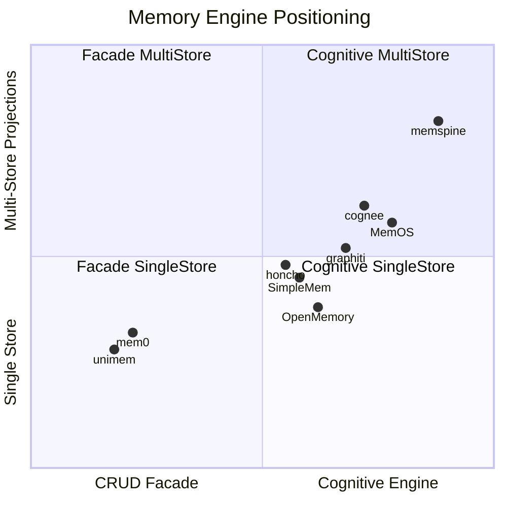

# memspine — Ecosystem Comparison

**Status:** Evidence document · **Last verified:** 2026-07-10 (reviewer **pass #4** — final confirmation, 18 dedicated agents; **pass #5** methodology/prompt/taxonomy deep survey + one-shot repo sync)  
**Prior passes:** 2026-07-09 initial trace · 2026-07-10 pass #2 (architecture) · pass #3 (stages/packages/prompts/I/O) · **pass #4** (final doc confirmation) · **pass #5** (methodology · full prompts · algorithms · taxonomy · package gaps).  
**Purpose:** Verify memspine novelty, position it against peer engines, and supply ADR evidence (D-01…D-54).  
**Companion:** [`ARCHITECTURE_FLOWS.md`](./ARCHITECTURE_FLOWS.md) — code-traced write/read/sleep diagrams. **Pass #5 deep dive:** [`ECOSYSTEM_METHODOLOGY.md`](./ECOSYSTEM_METHODOLOGY.md) · [`ECOSYSTEM_PROMPTS.md`](./ECOSYSTEM_PROMPTS.md) · [`ECOSYSTEM_MEMORY_TAXONOMY.md`](./ECOSYSTEM_MEMORY_TAXONOMY.md) · [`exports/ECOSYSTEM_REPO_SYNC.csv`](./exports/ECOSYSTEM_REPO_SYNC.csv).

**Scope:** memspine + **baseline peers** (cognee, graphiti, mem0, MemOS, honcho, OpenMemory, ReMe, LightMem, powermem, MemoryBear, MemMachine, langmem, A-mem, EverMemOS, hindsight, SimpleMem) + **Pass #5 expanded** (Memori, memU, Second-Me, memobase, telemem, memonto, memory-opensource). **unimem** path missing at sync. See [`exports/ECOSYSTEM_REPO_SYNC.csv`](./exports/ECOSYSTEM_REPO_SYNC.csv).

**Prior art in this repo:** [`DEPENDENCY_ANALYSIS.md`](./DEPENDENCY_ANALYSIS.md) (manifest scan, 2026-07-07) · [`PACKAGE_CATALOG.md`](./PACKAGE_CATALOG.md) · [`UNIMEM_V2_REWORK_PROPOSAL.md`](./UNIMEM_V2_REWORK_PROPOSAL.md).

**Deep comparison (pass #3–#4):** §3.10–§3.14 · **§3.15 memory-type deep dive (memspine × cognee × EverMemOS)** · plus [`ARCHITECTURE_FLOWS.md`](./ARCHITECTURE_FLOWS.md) §3.18 / §8–§9. **Exports:** [`ECOSYSTEM_PEER_TRACE.csv`](./exports/ECOSYSTEM_PEER_TRACE.csv) · [`ECOSYSTEM_WRITE_STAGES.csv`](./exports/ECOSYSTEM_WRITE_STAGES.csv) · [`ECOSYSTEM_PACKAGE_ADOPTION.csv`](./exports/ECOSYSTEM_PACKAGE_ADOPTION.csv) · [`ECOSYSTEM_MEMORY_TYPES_MS_CG_EO.csv`](./exports/ECOSYSTEM_MEMORY_TYPES_MS_CG_EO.csv).

---

## 1. Executive summary

**memspine** is an open-source **cognitive-memory engine** — not a vector CRUD facade. It exposes one async `Engine` over an append-only `memory_events` log, nine opt-in memory types, policy-driven writes (dedup, bitemporal conflict, Memory Firewall), hybrid+graph retrieval, and an ordered sleep cycle. Vector, graph, lexical, and relational read models are **rebuildable projectors**, never a second source of truth.

### Top five genuine differentiators (evidence-backed)

| # | Differentiator | Verdict | Evidence |
|---|----------------|---------|----------|
| 1 | **Event-sourced core** — `memory_events` is sole SoT; all stores rebuild via projectors | **RARE** | memspine: `engine.py:_append_and_project` → `SQLiteStorage.append_event`. Peers: mem0 vector-primary; graphiti graph-primary; EverMemOS markdown-primary (not event log). MemMachine SQL episode log is closest but lacks projector rebuild contract. |
| 2 | **Nine cognitive types** with C1b dependency closure and distinct lifecycles | **UNIQUE** (OSS engines at this granularity) | memspine: `docs/FEATURES.md`, `core/registry.py`. OpenMemory: 5 sectors; MemMachine: 2 enum types; mem0: 3 enum types (mostly flat writes). |
| 3 | **Memory Firewall (E1)** — trust matrix, quarantine, instruction-flag, audit taint | **UNIQUE** | memspine: `core/firewall.py:Firewall.assess`. No peer in scope implements OWASP ASI06-style content governance on the write path. |
| 4 | **Cross-namespace shared grants** — live views, trust-capped, engine-internal bookkeeping | **UNIQUE** | memspine: `memories/shared/grants.py`, `core/namespace.py:grant_allows`, ADR-016/D-50. |
| 5 | **Runner anti-lock-in** — plain idempotent pipelines decorated by inline/DBOS/taskiq | **UNIQUE pattern** | memspine: `workers/pipelines.py` + `workers/runner.py`. Peers use celery (MemoryBear), Redis scheduler (MemOS), deriver queue (honcho) — pipelines coupled to runtime. |

### Top five convergent choices (field-validated)

| Choice | memspine | Peer proof |
|--------|----------|------------|
| LanceDB vector store | **core dep** (`lancedb>=0.13`, ADR-021) | EverMemOS, cognee, SimpleMem |
| fastembed / ONNX CPU embeddings | D-08 default | mem0, cognee |
| Hybrid vector + BM25 + RRF | opt-in `read.hybrid` | graphiti, ReMe (when embeddings on), powermem (OceanBase), SimpleMem (EvolveMem) |
| datasketch MinHash dedup | D-27 write path | MemOS `pref-mem` extra |
| Slim core + extras matrix | D-03 | graphiti, mem0, cognee, hindsight packaging |

### Where memspine is behind (honest gaps)

| Gap | Who leads | Notes |
|-----|-----------|-------|
| **Backend breadth** | mem0 (**24** vector backends) | memspine reserves prod stubs; capability manifest is thinner |
| MCP / agent integrations | cognee, MemOS, honcho, graphiti, hindsight, OpenMemory, MemMachine | memspine REST v0.1 only; MCP layout reserved (peers lead on agent surface) |
| **File-native / Git-diffable memory** | ReMe, EverMemOS | memspine skipped file profile (D-30) |
| **Production authn on REST** | mem0 server, honcho JWT, powermem API keys | memspine v0.1 REST is no-authn by design (ADR-017) |
| **Multimodal ingest** | telemem, SimpleMem Omni, cognee docling | memspine `[ingest]` is text/doc only (markitdown+chonkie) |
| **Inspectability of core algorithms** | graphiti, cognee (full OSS) | EverMemOS ships `everalgo-*` wheels — memspine is fully inspectable |

---

## 2. Methodology & freshness

### Rating legend

| Symbol | Meaning |
|--------|---------|
| ✅ | Built and on the hot path |
| 🔶 | Partial / opt-in / inline-only |
| ❌ | Absent in traced code |
| 🔁 | Prod swap-in stub or external service required |
| ⚠️ | Closed-source or stale; evidence from shell/manifest only |

### Trace method (per repo)

1. Locate public facade (README quickstart → main class/module)
2. Follow write path ≤3 call levels; note dedup, firewall, conflict, graph, event append vs direct store
3. Follow read path: embed → hybrid legs → rerank → filter → reinforcement
4. Grep for background: `consolidat`, `decay`, `reflect`, `sleep`, `reorganiz`, `scheduler`
5. Determine storage SoT (event log, vector row, graph node, markdown file, Postgres row)
6. Count test files under `tests/` (approximate signal)

### Reviewer pass summary (2026-07-10)

| Pass | Scope | Agents | Output |
|------|-------|--------|--------|
| **#1** | Initial code trace | 17 | Flow diagrams, matrix v1 |
| **#2** | Architecture claim re-check | 17 | Gap fixes (Ladybug, mem0 v3, OpenMemory JS, etc.) |
| **#3** | Stage / package / prompt / memory I/O | 17 | §3.10–§3.14 + ARCHITECTURE_FLOWS §8–§9 |
| **#4** | Final doc confirmation | 18 | Pass #4 verdict table below; CSV + trace fixes |

One **reviewer agent per repo** per pass. **18/18 reviewed** in pass #4 (memspine + 17 peers).

### Pass #2 verdict table (architecture)

| Repo | Reviewer verdict | Gap fixed this pass |
|------|------------------|---------------------|
| **memspine** | OK | Test count **705** collected (was 575) |
| **cognee** | OK+FIXED | add→cognify→search, LanceDB, permissions | Graph default **kuzu** (pass #4 reverted Ladybug mislabel); **~150–155** test files |
| **graphiti** | GAPS | `search()` default RRF; **`center_node_uuid` → node-distance**; `search_()` default = **cross-encoder** (MMR optional) |
| **mem0** | OK | OSS decay = **❌** (Platform client only); entity leg = vector collection not graph |
| **MemOS** | OK | `mem_scheduler` **opt-in** (`enable_mem_scheduler` default false) |
| **honcho** | OK | Removed from LanceDB-peer rows; capsule: optional cosine dedup, JWT opt-in self-host |
| **OpenMemory** | OK+FIXED (#4) | **JS server:** decay always scheduled; **reflection opt-in** (`OM_AUTO_REFLECT`, default false); Python batch **unwired**; **9 files / 66** tests |
| **ReMe** | PARTIAL | **Default config: BM25-only** (`embedding_store` off); RRF when vector+keyword both active |
| **unimem** | OK | — |
| **LightMem** | OK | — |
| **powermem** | OK | **~603** test fns; RRF = **OceanBase hybrid** path (graph leg separate) |
| **MemoryBear** | OK | Forgetting bg = **`ForgettingScheduler`**, not `ForgettingEngine` |
| **MemMachine** | GAPS | WAL replay = **`sqlite_vector_store`** (USearch), not sqlite-vec; RRF inside episodic LTM |
| **langmem** | OK | Dual write: **`create_manage_memory_tool`** hot path + **`create_memory_store_manager`** automated |
| **A-mem** | OK | — |
| **EverMemOS** | OK | — |
| **hindsight** | OK | **219 / 157 test files** (not function count) |
| **SimpleMem** | OK+FIXED (#4) | Write = **LLM structured extraction** (keywords/entities/persons/topic/location); read = union merge; RRF **tunable** in EvolveMem only; **262** test fns (core+cross+Omni) |

### Pass #3 verdict table (stages · packages · prompts · memory I/O)

| Repo | Stages traced | Packages mapped | Prompts inventoried | Memory I/O |
|------|---------------|-----------------|---------------------|------------|
| **memspine** | ✅ write/read/sleep 20+ stages | ✅ 19 core + extras | ✅ 10 YAML packs (**2 hot**: extract, summarize) | ✅ 9 types full matrix |
| **cognee** | ✅ add/cognify/search/memify | ✅ lancedb+kuzu+instructor | ✅ 45+ `.txt` templates | ✅ DataPoint family |
| **graphiti** | ✅ add_episode/search/search_ | ✅ neo4j+kuzu extras | ✅ **25** prompt_library versions | ✅ Episode/Entity/Edge I/O |
| **mem0** | ✅ v3 8-phase add + hybrid search | ✅ qdrant+spacy nlp | ✅ ADDITIVE_EXTRACTION hot | ✅ flat + procedural |
| **MemOS** | ✅ tree + scheduler pipelines | ✅ neo4j+datasketch extras | ✅ 30+ template modules | ✅ 4 cubes + pref/act |
| **honcho** | ✅ deriver/dreamer/search | ✅ pgvector+lancedb+turbopuffer | ✅ 8 inline prompts | ✅ **4** document levels |
| **OpenMemory** | ✅ HSG add/query + JS bg | ✅ openai+sqlite/pg | ❌ no prompt packs | ✅ 5 sectors |
| **ReMe** | ✅ auto-memory + dream cron | ✅ frontmatter+zstd; FAISS opt-in `[core]` | ✅ 5 YAML step packs | ✅ filesystem types |
| **unimem** | ✅ flat add/search only | ✅ pydantic + backend extras | ✅ 1 infer prompt | ✅ 1 flat type |
| **LightMem** | ✅ compress→extract→index | ✅ llmlingua+qdrant+torch | ✅ 7+ core prompts | ✅ buffers + FluxMem 3 |
| **powermem** | ✅ intelligent add + Ebbinghaus | ✅ pyobvector+rank-bm25 | ✅ 15+ prompt modules | ✅ 3 tiers + skills |
| **MemoryBear** | ✅ 6-step orchestrator | ✅ neo4j+celery+jinja2 | ✅ 25+ Jinja templates | ✅ 8 analytics types |
| **MemMachine** | ✅ STM/LTM + semantic bg | ✅ neo4j+qdrant+fastmcp | ✅ domain prompt packs | ✅ 2 enum + STM |
| **langmem** | ✅ tool + manager paths | ✅ langgraph+trustcall | ✅ 6 inline prompts | ✅ store-hosted |
| **A-mem** | ✅ add→evolve→consolidate | ✅ chromadb+litellm | ✅ 2 inline JSON prompts | ✅ MemoryNote |
| **EverMemOS** | ✅ memorize→cascade→search | ✅ lancedb+everalgo wheels | 🔶 2 YAML slots + opaque OME | ✅ 8 cascade kinds |
| **hindsight** | ✅ retain/recall/reflect | ✅ pgvector+litellm+fastmcp | ✅ 11 inline builders | ✅ 3 recall + mental models |
| **SimpleMem** | ✅ extract→3-view→union read | ✅ lancedb+sentence-transformers | ✅ 9 core + 6 EvolveMem | ✅ MemoryEntry + Cross |

### Pass #4 verdict table (final confirmation — 2026-07-10)

| Repo | Verdict | Confirmed | Pass #4 corrections merged |
|------|---------|-----------|----------------------------|
| **memspine** | OK+FIXES | Event SoT, firewall, 9 types, LanceDB core, 705 tests | **2** hot prompts; cache = in-process `MemoryKV` + `[lmdb]` extra |
| **cognee** | OK+FIXED | add→cognify→search, LanceDB, kuzu graph | Reverted **Ladybug** mislabel; **~150–155** tests; blocking cognify default |
| **graphiti** | OK+FIXES | bitemporal, search/search_, REST+MCP | **25** prompts; Pydantic (not instructor) |
| **mem0** | OK | v3 ADD-only, hybrid conditional | **73**/74 test files; **24** backends; BM25 needs fastembed |
| **MemOS** | OK+FIXES | 4 cubes, scheduler opt-in, fastmcp | Facade **`MOS`**; transformers core; **~436** fns |
| **honcho** | OK+FIXES | pgvector, RRF, deriver+dreamer | **4** doc levels; **~1111** fns; RRF needs embeddings |
| **OpenMemory** | OK+FIXES | 5 sectors, brute-force default | **66** tests; JS reflect opt-in |
| **ReMe** | OK+FIXES | BM25 default, markdown SoT | Removed faiss-as-default shorthand |
| **unimem** | OK+FIXES | thin facade | Import may fail (Neo4j SyntaxError) |
| **LightMem** | OK | LightMemory, 0 pytest | `add_memory()` facade |
| **powermem** | OK+FIXES | OceanBase RRF | **~608** fns; `FACT_RETRIEVAL_PROMPT` |
| **MemoryBear** | OK+FIXES | weighted hybrid | **~251** workflow tests; Celery task miswired upstream |
| **MemMachine** | OK+FIXES | SQL anchor, RRF LTM | **`EpisodeEntry[]`**; fastmcp MCP |
| **langmem** | OK+FIXES | dual write paths | trustcall on manager path only |
| **A-mem** | OK+FIXES | Chroma, no BM25 hot path | **23** tests; rank_bm25 unused |
| **EverMemOS** | OK+FIXES | md SoT, 8 kinds | `knowledge_document` → SQLite only |
| **hindsight** | OK+FIXED | retain/recall/reflect | **RRF + cross-encoder rerank** (no MMR in code) |
| **SimpleMem** | OK+FIXED | dual facade, 3-view core | **262** test fns |

### Re-verification summary (2026-07-10, pass #1)

One dedicated agent re-traced each repo. **Confirmed:** memspine event-sourced core, firewall, sleep cycle, and most peer positioning. **Corrected highlights:**

| Repo | Key correction |
|------|----------------|
| **memspine** | LanceDB is **sole core vector store** (SQLite brute-force vector removed, ADR-021); E4 rescore is LanceDB-native; `[lance]` extra claim stale |
| **cognee** | ~**150–155** test files; default graph = **kuzu** (pinned 0.11.3); cognify default **blocking** (`run_in_background=False`); Modal = `[distributed]` extra |
| **graphiti** | `search()` = edge hybrid RRF; **`center_node_uuid` → node-distance**; `search_()` default = **cross-encoder** (MMR optional); **REST + MCP** in-repo; **33** core test files |
| **mem0** | **SDK v3 (pkg 2.0.2):** ADD-only infer, hybrid BM25+semantic on search hot path; **Neo4j/graph removed** from OSS (not “broken”) |
| **MemOS** | Hot-path rerank = `RerankerFactory` (not `MemoryReranker`); tree uses Neo4j embeddings; **fastmcp in core**; scheduler defaults to threads |
| **honcho** | Default vector = **pgvector**; **RRF hybrid search implemented**; optional post-deriver cosine dedup; **MCP server** shipped |
| **OpenMemory** | Default vector = **brute-force SQLite**; **JS:** decay scheduled always, reflection **opt-in** (`OM_AUTO_REFLECT`); Python batch **unwired**; **9 files / 66** tests; **MCP-only (Python)** / **REST+MCP (JS)** |
| **ReMe** | Default retrieval = **BM25-only** (`embedding_store` off); RRF when embeddings enabled; ~**457** test functions in 43 files |
| **LightMem** | Facade class = **`LightMemory`** (not `LightMem`); 0 pytest files |
| **powermem** | **RRF in OceanBase hybrid path**; ~**603** test fns / 41 files |
| **MemoryBear** | Write method = **`ExtractionOrchestrator.run`**; forgetting bg = **`ForgettingScheduler`**; hybrid = weighted fusion not RRF |
| **MemMachine** | **MCP + RRF reranker** in episodic LTM; no event-log `rebuild()` — **`sqlite_vector_store`** pending-ops replay (USearch, not sqlite-vec) |
| **A-mem** | Split upstream (**Chroma**, no BM25) vs telemem fork (**VLLM**, no Chroma) |
| **EverMemOS** | Ingest = chat pipeline + optional **everalgo-parser** (not markitdown); **8** cascade kinds |
| **hindsight** | **3** recall fact types (world/experience/observation); **MCP in slim package**; 219 tests repo-wide |
| **SimpleMem** | **LLM structured extraction** on write (keywords/entities/persons/topic/location); core read = **union merge**; RRF **tunable** in EvolveMem; **CrossMemOrchestrator** dual facade; **262** test fns |

Full per-repo flow corrections: [`ARCHITECTURE_FLOWS.md`](./ARCHITECTURE_FLOWS.md) §2 (memspine), §3.0–§3.17 (peers), §8–§9 (stage/prompt detail).

### Repo inventory (local clones under `D:\mem`)

| Repo | Present | Staleness / notes |
|------|---------|-------------------|
| memspine | ✅ | Active; **705** pytest items collected (re-verify with `uv run pytest --collect-only -q`) |
| cognee | ✅ | Active OSS reference |
| graphiti | ✅ | Active (Zep/getzep) |
| mem0 | ✅ | Active; broadest backend matrix |
| MemOS | ✅ | Active; richest ingest toolbox |
| honcho | ✅ | Active; production-shaped server |
| OpenMemory | ✅ | `main` branch; rewrite branch unmerged (see UNIMEM_V2 §3) |
| ReMe | ✅ | Active; file-native trend |
| unimem | ✅ | Rework target; ~2k LOC facade |
| LightMem | ✅ | Research/eval; no pytest CI suite |
| powermem | ✅ | Active; strong test matrix |
| MemoryBear | ✅ | Large product monorepo; verify upstream freshness |
| MemMachine | ✅ | Active uv workspace |
| langmem | ✅ | LangChain-first; thin test suite |
| A-mem | ⚠️ | **Two trees:** upstream `D:\mem\A-mem` (`agentic-memory`, ChromaDB, **23** test definitions) vs telemem baseline `telemem/baselines/A-mem` (**not cloned locally**) |
| EverMemOS | ✅ | Rebranding to **everos**; `everalgo-*` wheels opaque |
| hindsight | ✅ | Active; slim/all packaging |
| SimpleMem | ✅ | Active; Cross + Omni subprojects |

---

## 3. Master comparison matrix

### 3.0 Repository index (full names — use these in prose)

| # | Full name | Local path | PyPI / package | Notes |
|---|-----------|------------|----------------|-------|
| 1 | **memspine** | `D:\mem\memspine` | `memspine` | Reference engine |
| 2 | **cognee** | `D:\mem\cognee` | `cognee` | KG pipeline + MCP |
| 3 | **graphiti** | `D:\mem\graphiti` | `graphiti-core` | Bitemporal fact graph (Zep) |
| 4 | **mem0** | `D:\mem\mem0` | `mem0ai` | Broadest backend matrix |
| 5 | **MemOS** | `D:\mem\MemOS` | `MemoryOS` | Multi-cube + mem_scheduler |
| 6 | **honcho** | `D:\mem\honcho` | `honcho` | Session + deriver + dreamer |
| 7 | **OpenMemory** | `D:\mem\OpenMemory` | `openmemory-js` / py mirror | HSG sectors; JS server primary |
| 8 | **ReMe** | `D:\mem\ReMe` | `reme-ai` | Markdown/Git-native |
| 9 | **unimem** | `D:\mem\unimem` | `unimem` | Thin facade (rework target) |
| 10 | **LightMem** | `D:\mem\LightMem` | `lightmem` | LLMLingua + FluxMem research |
| 11 | **powermem** | `D:\mem\powermem` | `powermem` | OceanBase hybrid |
| 12 | **MemoryBear** | `D:\mem\MemoryBear` | `redbear-mem` | Neo4j + Celery product |
| 13 | **MemMachine** | `D:\mem\MemMachine` | `memmachine-server` | Episodic + profile + MCP |
| 14 | **langmem** | `D:\mem\langmem` | `langmem` | LangGraph store tools |
| 15 | **A-mem** | `D:\mem\A-mem` | `agentic-memory` | Zettelkasten link evolution |
| 16 | **EverMemOS** | `D:\mem\EverMemOS` | `everos` | Markdown SoT + LanceDB projector |
| 17 | **hindsight** | `D:\mem\hindsight` | `hindsight-api-slim` | retain/recall/reflect |
| 18 | **SimpleMem** | `D:\mem\SimpleMem` | (root package) | Multi-view + Cross/Omni |

**Legacy abbreviations** in §3.1–§3.9 tables only: MS=memspine · CG=cognee · GT=graphiti · M0=mem0 · MO=MemOS · HN=honcho · OM=OpenMemory · RM=ReMe · UM=unimem · LM=LightMem · PM=powermem · MB=MemoryBear · MM=MemMachine · LM2=langmem · AM=A-mem · EO=EverMemOS · HS=hindsight · SM=SimpleMem. **§3.10+ use full names.**

### 3.1 Architecture layers

| Row | MS | CG | GT | M0 | MO | HN | OM | RM | UM |
|-----|----|----|----|----|----|----|----|----|-----|
| Facade API | ✅ `Engine` | ✅ `add/cognify/search` | ✅ `Graphiti` | ✅ `Memory` | ✅ `MOS` (`MOSCore` engine) | ✅ FastAPI+SDK | ✅ `Memory` | ✅ `ReMe.run_job` | ✅ `Memory` |
| Event log SoT | ✅ `memory_events` | ❌ SQL `data` | ❌ graph | ❌ vector | ❌ per-cube | ❌ Postgres msgs | ❌ SQLite | ❌ markdown | ❌ backend |
| Projector rebuild | ✅ `rebuild()` | 🔶 pipeline replay | ❌ | ❌ | ❌ | ❌ | ❌ | 🔶 re-index | ❌ |
| Ports & adapters | ✅ `services/*` | ✅ `infrastructure/` | ✅ `driver/*` | ✅ factories | ✅ vec/graph dbs | ✅ crud layers | 🔶 modules | ✅ components | ✅ backends |
| Worker seam | ✅ inline/dbos/taskiq | 🔶 Modal | ❌ external queue | ❌ | ✅ mem_scheduler | ✅ deriver+dreamer | ❌ | ✅ BackgroundJob | ❌ |
| REST / MCP | 🔶 REST `[rest]` | 🔶 | ✅ REST+MCP | ✅ server | ✅ FastAPI+MCP | ✅ FastAPI+MCP | ✅ MCP primary | 🔶 | ❌ |

| Row | LM | PM | MB | MM | LM2 | AM | EO | HS | SM |
|-----|----|----|----|----|-----|----|----|----|-----|
| Facade API | ✅ `LightMemory` | ✅ `Memory` | ✅ LangGraph agent | ✅ `MemMachine` | ✅ LangGraph tools | ✅ `AgenticMemorySystem` | ✅ `memorize/search` | ✅ `retain/recall` | ✅ `SimpleMemSystem` |
| Event log SoT | ❌ Qdrant | ❌ vector row | ❌ Neo4j | 🔶 SQL episodes | ❌ BaseStore | ❌ in-memory | 🔶 markdown | ❌ PostgreSQL | 🔶 SQLite Cross |
| Projector rebuild | 🔶 | ❌ | ❌ | 🔶 | ❌ | ❌ | ✅ md→LanceDB | ❌ | 🔶 |
| Ports & adapters | ✅ layers | ✅ storage adapter | ✅ extraction/search | ✅ packages | ❌ store host | ❌ | ✅ everos infra | ✅ api-slim | ✅ core/cross |
| Worker seam | 🔶 offline_update | 🔶 thread pool | ✅ Celery (API) | 🔶 bg ingestion | 🔶 caller thread | 🔶 threshold | ✅ OME cron | ✅ worker poller | ✅ consolidation worker |
| REST / MCP | 🔶 MCP extra | ✅ FastAPI | ✅ FastAPI product | ✅ FastAPI+MCP | ❌ | ❌ | ✅ FastAPI | ✅ FastAPI+MCP | 🔶 MCP docs |

### 3.2 Memory taxonomy

| Row | MS | CG | GT | M0 | MO | HN | OM | RM | UM | LM | PM | MB | MM | LM2 | AM | EO | HS | SM |
|-----|----|----|----|----|----|----|----|----|-----|----|----|----|----|-----|----|----|----|-----|
| Typed model | ✅ 9 types | 🔶 DataPoint schema (~50) | 🔶 graph nodes | 🔶 3 enum | ✅ 4 cubes | 🔶 msgs+repr | ✅ 5 sectors | 🔶 file graph | ❌ flat | 🔶 layers | 🔶 Ebbinghaus tiers | 🔶 graph labels | ✅ 2 types | 🔶 caller schema | 🔶 MemoryNote | ✅ 8 cascade kinds | ✅ 3 fact types | 🔶 entry/obs |
| Count | **9** | ~50 kinds / ~8 hot | ~5 families | 3 | 4 | — | 5 | — | 1 | adapters | 3 tiers | graph | 2 | — | 1 | **8** | 3 recall types | 2 subsystems |
| Bitemporal facts | ✅ M4 | 🔶 temporal search | ✅ edges | ❌ | 🔶 | ❌ | ❌ | ❌ | ❌ | ❌ | 🔶 decay | 🔶 temporal extract | 🔶 | ❌ | ❌ | 🔶 | ✅ | ❌ |
| Working window | ✅ page-out | ❌ | ❌ | ❌ | 🔶 act_mem | ✅ session | ❌ | ❌ | ❌ | 🔶 full-context layer | ✅ working tier | ❌ | ✅ STM buffer | ✅ summarization | ❌ | ❌ | ❌ | ✅ session buffer |
| Procedural ladder | ✅ draft→active | ❌ | ❌ | 🔶 enum only | 🔶 skill-mem | ❌ | ✅ sector | ❌ | ❌ | 🔶 FluxMem | ❌ | ❌ | ❌ | ❌ | ❌ | ✅ agent_skill | ❌ | ❌ |
| Cross-ns shared | ✅ grants | 🔶 dataset ACL | 🔶 group_id | 🔶 user_id | 🔶 user/cube | ✅ workspace | 🔶 user_id | ❌ | 🔶 scope keys | ❌ | ✅ shared scope | ❌ | 🔶 project | ❌ | ❌ | ❌ | ✅ bank/mission | ✅ tenant_id |

### 3.3 Storage stack

| Row | MS | CG | GT | M0 | MO | HN | OM | RM | UM | LM | PM | MB | MM | LM2 | AM | EO | HS | SM |
|-----|----|----|----|----|----|----|----|----|-----|----|----|----|----|-----|----|----|----|-----|
| Vector default | ✅ **LanceDB core** (sole backend) | ✅ LanceDB | 🔶 embeddings on graph | 🔶 15+ backends | ✅ Qdrant/Milvus/tree Neo4j | 🔶 **pgvector default** | 🔶 brute-force SQLite | 🔶 local numpy (FAISS opt) | backend-specific | ✅ Qdrant | ✅ OceanBase/pgvector | 🔶 Neo4j embed | ✅ Qdrant/**sqlite_vector_store** | host store | ✅ ChromaDB | ✅ LanceDB | ✅ pgvector | ✅ LanceDB |
| Graph default | ✅ sqlite_adjacency; ladybug/kuzu extras | ✅ **kuzu** (embedded default) | ✅ Neo4j/kuzu | ❌ **removed v3** | ✅ neo4j tree | ❌ | 🔶 waypoints | 🔶 neo4j opt | ❌ neo4j extra | 🔶 FluxMem stub | ✅ OceanBase graph | ✅ Neo4j SoT | ✅ Neo4j episodic | ❌ | 🔶 link metadata | 🔶 | ✅ link tables | ❌ |
| Lexical / BM25 | ✅ FTS5 core; Tantivy extra | 🔶 | ✅ fulltext+RRF | 🔶 store-native keyword | ✅ rank-bm25 | 🔶 SQL | 🔶 overlap score | ✅ BM25+RRF | ILIKE/substring | ❌ | ✅ native hybrid | ✅ Lucene | 🔶 | store search | ❌ | ✅ FTS via Lance | ✅ keyword leg | ✅ multi-view |
| Relational SoT | ✅ SQLite events+records | ✅ SQLAlchemy | ❌ | 🔶 SQLite history | ✅ SQLAlchemy | ✅ Postgres | ✅ SQLite | ❌ | 🔶 Postgres | ❌ | ✅ SQLAlchemy | 🔶 PG sidecar | ✅ SQL episodes | ❌ | ❌ | ✅ SQLite index | ✅ PostgreSQL | ✅ SQLite Cross |
| Cache / KV | 🔶 in-process `MemoryKV`; LMDB `[lmdb]` extra | 🔶 diskcache | ❌ | 🔶 Redis extra | 🔶 Redis | ✅ cashews | ❌ | ❌ | Redis extra | ❌ | ❌ | ✅ Redis | ❌ | ❌ | ❌ | ❌ | ❌ | ❌ |
| Rebuild path | ✅ `Engine.rebuild()` | 🔶 re-cognify | ❌ re-ingest | ❌ re-embed | ❌ | ❌ | ❌ | re-index jobs | ❌ | offline scroll | ❌ | re-extract | 🔶 episode replay | ❌ | rebuild index | ✅ md cascade | migrations | consolidation worker |

### 3.4 Write pipeline

| Row | MS | CG | GT | M0 | MO | HN | OM | RM | UM | LM | PM | MB | MM | LM2 | AM | EO | HS | SM |
|-----|----|----|----|----|----|----|----|----|-----|----|----|----|----|-----|----|----|----|-----|
| Firewall / trust | ✅ E1 | ❌ | ❌ | ❌ | ❌ | ❌ | 🔶 classify | ❌ | ❌ | ❌ | ❌ | ❌ | ❌ | ❌ | ❌ | ❌ | ❌ | 🔶 redaction |
| Dedup pre-store | ✅ MinHash+LSH→cosine | 🔶 ingest dedup | ✅ entity resolve | 🔶 infer merge | 🔶 pref-mem | 🔶 cosine dedup | ✅ simhash | ❌ | ❌ | ❌ | ✅ intelligent add | ✅ graph dedup | ❌ | ❌ | 🔶 evolution | ⚠️ everalgo | 🔶 | 🔶 Stage 2 |
| Conflict ladder | ✅ M4 bitemporal | 🔶 graph merge | ✅ invalidate edges | 🔶 ADD-only v3 | 🔶 | ❌ | ❌ | ❌ | ❌ | ❌ | 🔶 | ❌ | ❌ | trustcall patch | ❌ | ⚠️ | ✅ observation invalidation | ❌ |
| Entity extraction | ✅ gliner2/LLM | ✅ cognify extract | ✅ LLM extract | 🔶 spacy extra | ✅ mem_reader | ✅ deriver LLM | 🔶 regex classify | ❌ | ❌ | ❌ | 🔶 | ✅ orchestrator | 🔶 | ❌ | LLM metadata | ⚠️ | ✅ retain NER | ✅ LLM extract |
| Ingest path | ✅ markitdown+chonkie | ✅ multi-format | episode text | messages | ✅ mem_reader | messages | chunk+sector | markdown write | raw string | compress+segment | fact extract | extraction pipeline | episodes | tool invoke | add_note | chat+everalgo-parser | retain batch | dialogue window |
| Idempotent writes | ✅ event seq | 🔶 | 🔶 episode id | 🔶 memory id | 🔶 | ✅ seq_in_session | ✅ id | file path | backend id | entry id | memory id | graph merge | episode id | store key | note id | cell id | unit id | session events |

### 3.5 Read pipeline

| Row | MS | CG | GT | M0 | MO | HN | OM | RM | UM | LM | PM | MB | MM | LM2 | AM | EO | HS | SM |
|-----|----|----|----|----|----|----|----|----|-----|----|----|----|----|-----|----|----|----|-----|
| Hybrid retrieval | 🔶 opt-in RRF | ✅ multi SearchType | ✅ always hybrid | ✅ **BM25+semantic hot path** | ✅ tree hybrid | ✅ **vector+FTS+RRF** | ✅ multi-sector | 🔶 BM25 default | backend | vector only | ✅ OceanBase hybrid | ✅ hybrid | ✅ dual search | store search | vector only | ✅ agentic | ✅ multi-leg recall | ✅ multi-view |
| RRF fusion | ✅ `rrf_fuse` | 🔶 | ✅ | ❌ additive score | 🔶 | ✅ **RRF** | 🔶 weighted | 🔶 when vector on | ❌ | ❌ | ✅ OceanBase | 🔶 weighted | 🔶 episodic LTM | ❌ | ❌ | ⚠️ everalgo | 🔶 | ❌ EvolveMem only |
| Cross-encoder rerank | 🔶 E8 `[rerank]` | 🔶 | ✅ | 🔶 reranker extra | ✅ RerankerFactory | ❌ | ❌ | ❌ | ❌ | ❌ | 🔶 cross-encoder opt | 🔶 | 🔶 agent | ❌ | ❌ | ⚠️ | 🔶 flashrank | LLM plan |
| MMR / assembly | ✅ M12+E2+E5 | 🔶 completion | ✅ MMR | ❌ | 🔶 reasoner | 🔶 chat context | ❌ | ❌ | ❌ | ❌ | ❌ | LangGraph assemble | 🔶 agent | host | ❌ | 🔶 | 🔶 | answer gen |
| Graph recall | ✅ PPR `related()` | ✅ graph completion | ✅ BFS+RRF | ❌ | ✅ tree graph | ❌ | 🔶 waypoint BFS | 🔶 link expand | ❌ | ❌ | ✅ graph leg | ✅ Neo4j | ✅ episodic graph | ❌ | 🔶 links | 🔶 | ✅ graph leg | ❌ |
| Reinforcement on read | ✅ RETRIEVE event | ❌ | ❌ | ❌ | ❌ | ❌ | ✅ salience+0.1 | ❌ | 🔶 recency re-rank | ❌ | ✅ Ebbinghaus on_search | ❌ | ❌ | ❌ | ❌ | ❌ | 🔶 | ❌ |

### 3.6 Learning dynamics

| Row | MS | CG | GT | M0 | MO | HN | OM | RM | UM | LM | PM | MB | MM | LM2 | AM | EO | HS | SM |
|-----|----|----|----|----|----|----|----|----|-----|----|----|----|----|-----|----|----|----|-----|
| Consolidation | ✅ sleep: episodic→semantic | ✅ memify | 🔶 communities | ❌ | ✅ reorganizer | ✅ dreamer | 🔶 py unwired / **JS scheduled** | ✅ auto_dream | ❌ | 🔶 offline_update | ❌ | 🔶 reflection | ✅ semantic bg | ✅ manager | ✅ threshold | ✅ reflect_episodes | ✅ async consolidation | ✅ cross worker |
| Decay / forgetting | ✅ decay_sweep tiers | ❌ | ❌ | ❌ | ❌ | ❌ | 🔶 py unwired / **JS scheduled** | ❌ | 🔶 opt-in scoring | ❌ | ✅ Ebbinghaus | ✅ forgetting_scheduler | ❌ | ❌ | ❌ | 🔶 | 🔶 | ✅ soft-delete obs |
| Compression | ✅ zstd cold + E5 llmlingua | ❌ | ❌ | ❌ | ❌ | ❌ | ❌ | ✅ zstandard files | ❌ | ✅ LLMLingua | ❌ | ❌ | ❌ | ✅ summarization | ❌ | ❌ | ❌ | 🔶 |
| Graph reorganize | ✅ Leiden `[community]` | 🔶 | ✅ build_communities | ❌ | ✅ GraphStructureReorganizer | ❌ | ❌ | ❌ | ❌ | 🔶 FluxMem | ❌ | 🔶 graphrag | ❌ | ❌ | ❌ | 🔶 profile cluster | ❌ | ❌ |
| Watches / triggers | ✅ prospective `due()` | ❌ | ❌ | ❌ | 🔶 schedule | ❌ | ❌ | ❌ | ❌ | ❌ | ❌ | ❌ | ❌ | ❌ | ❌ | 🔶 OME cron | ❌ | ❌ |
| Ordered sleep cycle | ✅ 7-step contract | ❌ split APIs | ❌ | ❌ | 🔶 scheduler handlers | 🔶 deriver+dream | ❌ | 🔶 cron jobs | ❌ | ❌ | ❌ | 🔶 celery cycle | ❌ | ❌ | ❌ | ✅ OME strategies | 🔶 poller | 🔶 worker |

### 3.7 Security & governance

| Row | MS | CG | GT | M0 | MO | HN | OM | RM | UM | LM | PM | MB | MM | LM2 | AM | EO | HS | SM |
|-----|----|----|----|----|----|----|----|----|-----|----|----|----|----|-----|----|----|----|-----|
| Trust / quarantine | ✅ E1 full | ❌ | ❌ | ❌ | ❌ | ❌ | ❌ | ❌ | ❌ | ❌ | ❌ | ❌ | ❌ | ❌ | ❌ | ❌ | ❌ | 🔶 redaction |
| Erasure / M7 | ✅ forget+verify+audit_taint | 🔶 ACL | ❌ | delete | ❌ | ❌ | delete | file delete | delete | ❌ | ❌ | ❌ | ❌ | ❌ | ❌ | ❌ | ❌ | ❌ | soft-delete |
| Namespace isolation | ✅ hierarchical+grants | ✅ dataset ACL | ✅ group_id | 🔶 entity ids | ✅ user/cube | ✅ workspace JWT | 🔶 user_id | path gates | ❌ | ❌ | 🔶 API key | JWT at API | 🔶 session | store ns | ❌ | local-first | ✅ tenant/tags | ✅ tenant_id |
| REST authn | ❌ v0.1 | 🔶 | ❌ | ✅ JWT | 🔶 | ✅ JWT | 🔶 | ❌ | ❌ | ❌ | ✅ API key | ✅ product auth | 🔶 | ❌ | ❌ | ❌ local-first | ✅ API keys | 🔶 |

### 3.8 Packaging & dependencies

| Row | MS | CG | GT | M0 | MO | HN | OM | RM | UM | LM | PM | MB | MM | LM2 | AM | EO | HS | SM |
|-----|----|----|----|----|----|----|----|----|-----|----|----|----|----|-----|----|----|----|-----|
| Python floor | **3.13** | 3.10–3.13 | 3.10–3.x | 3.10–4.0 | ≥3.10 | ≥3.10 | undeclared | ≥3.11 | ≥3.10 | 3.10–3.11 | ≥3.11 | 3.12 | ≥3.12 | ≥3.10 | unpinned | ≥3.12 | ≥3.11 | ≥3.9 |
| torch in core | ❌ | ❌ | ❌ | ❌ | ✅ transformers | ❌ | ❌ | ❌ | ❌ | ✅ | ❌ | ✅ | ❌ | ❌ | ✅ | ❌ | 🔶 optional | 🔶 subproj |
| Extras matrix | ✅ rich | ✅ 30+ | ✅ | ✅ 15+ vector | ✅ poetry extras | 🔶 | minimal | 🔶 | ✅ backends | ✅ | 🔶 | monorepo | workspace | minimal | none | 🔶 | slim/all | none |
| Windows-clean | ✅ guarded | 🔶 platform pins | ✅ | ✅ | 🔶 | ✅ | ✅ | ✅ | ✅ | 🔶 | ✅ | 🔶 | ✅ | ✅ | 🔶 | ✅ | ✅ | ✅ |

### 3.9 Ops & production

| Row | MS | CG | GT | M0 | MO | HN | OM | RM | UM | LM | PM | MB | MM | LM2 | AM | EO | HS | SM |
|-----|----|----|----|----|----|----|----|----|-----|----|----|----|----|-----|----|----|----|-----|
| Test signal | **705** pytest | ~**150–155** files | **33** core | **73** mod / 74 files | **76** files (~**436** fns) | **~1111** fns | **9** files (**66** fns) | **43** files (~457 fns) | **45** fns (import fragile) | 0 pytest | **41** / ~**608** fns | **~251** workflow | **120** files | 3 mod (~62 items) | **23** upstream tests | **194** files | **219** / **157** test files | **262** fns |
| Observability | ✅ structlog M11 | ✅ structlog | 🔶 OTel extra | posthog | prometheus | langfuse | ❌ | loguru | ❌ | ❌ | 🔶 | langfuse | prometheus | langsmith | ❌ | prometheus | OTel | ❌ |
| Durable workers | ✅ DBOS `[dbos]` | Modal | external | ❌ | 🔶 threads default | Postgres queue | ❌ | BackgroundJob | ❌ | ❌ | thread pool | Celery | bg tasks | caller | ❌ | OME | poller | worker |
| ADR / semver discipline | ✅ 21 ADRs | 🔶 | 🔶 | ✅ | 🔶 | 🔶 | ❌ | ❌ | ❌ | ❌ | 🔶 | ❌ | 🔶 | ❌ | ❌ | SECURITY.md | 🔶 | ❌ |
| Combination boots | ✅ C6 matrix | ❌ | ❌ | ❌ | ❌ | ❌ | ❌ | ❌ | ❌ | ❌ | ❌ | ❌ | ❌ | ❌ | ❌ | ❌ | ❌ | ❌ |

### 3.10 Extended comparison parameters (pass #3)

| Parameter | memspine | cognee | graphiti | mem0 | MemOS | honcho | OpenMemory | ReMe |
|-----------|----------|--------|----------|------|-------|--------|------------|------|
| **Prompt packaging** | YAML packs + Jinja (`prompts/defaults/`) | 40+ `.txt` Jinja | Python `prompt_library` | Python constants | 14 Python modules | Inline Python strings | Minimal (embed API only) | YAML step packs |
| **Named prompts (count)** | 10 packs (**2 hot**: extract, summarize) | 40+ templates | **25** registered (8 families) | 8+ (3 v3 hot path) | 30+ templates | 8 inline templates | 0 pipeline packs | 5 YAML step files |
| **LLM calls / write (typical)** | 0–2 (entity extract opt-in) | 2+ per chunk (extract+summarize) | 3–6 per episode | 1 (ADD-only infer) | 1–2 (mem_reader) | 1 (deriver) | 0 (regex classify) | 1+ (agentscope auto-memory) |
| **LLM calls / read (typical)** | 0 (HyDE reserved) | 1 (GRAPH_COMPLETION) | 0 (`search`) / 0+ (`search_` rerank) | 0 / 1 if rerank | 1–3 (reasoner fine mode) | 1+ (dialectic loop) | 0 | 0 (search) / 1+ (dream) |
| **Structured output lib** | json-repair + instructor `[structured]` | instructor | Pydantic response models | JSON object mode | Pydantic / JSON | json-repair | — | agentscope tools |
| **Default embedder** | fastembed ONNX | fastembed | OpenAI (configurable) | OpenAI | transformers / config | OpenAI + multi | OpenAI/Ollama/Bedrock | OpenAI |
| **Default vector store** | LanceDB (sole core) | LanceDB | Embeddings on graph driver | Qdrant | Qdrant/Milvus/Neo4j tree | pgvector / turbopuffer / LanceDB | Brute-force SQLite | BM25 default; numpy vector when embeddings on |
| **Background worker** | inline / DBOS / taskiq | blocking asyncio; optional bg; Modal `[distributed]` | External queue (doc) | — | mem_scheduler (opt-in) | Postgres queue + dream scheduler | JS cron (decay always; reflect opt-in) | watchfiles + croniter |
| **Memory type count (API)** | **9** cognitive types | ~50 DataPoint kinds (no type API) | 4 graph labels + edges | 1 flat (+ procedural enum) | 4 cubes + pref/act | **4** document levels | **5** HSG sectors | Filesystem-typed |
| **Write input shape** | `MemoryRecord` / `Engine.write` | paths / streams → `add()` | `episode_body` str | `messages[]` + filters | messages / doc_path | `MessageCreate` | `content` + tags | markdown + frontmatter |
| **Read output shape** | `(MemoryRecord, score)[]` + `AssembledContext` | answer string / chunks | `EntityEdge[]` or `SearchResults` | `MemoryItem` + score | `MOSSearchResult` | `Message[]` / snippets | `hsg_q_result[]` | `FileChunk[]` |

| Parameter | unimem | LightMem | powermem | MemoryBear | MemMachine | langmem | A-mem | EverMemOS | hindsight | SimpleMem |
|-----------|--------|----------|----------|------------|------------|---------|-------|-----------|-----------|-----------|
| **Prompt packaging** | 1 Python constant | Python constants + em2mem templates | Python modules | Jinja2 (20+ templates) | `.txt` + Python domain | Inline + LangChain | Inline JSON-schema | YAML slots + everalgo wheels | Inline Python builders | Inline f-strings |
| **Named prompts (count)** | 1 | 7+ core + FluxMem 5 | 15+ | 25+ | 6+ domain packs | 6 | 2 inline | 2 OSS slots + opaque OME | 11 | 9 core + 6 EvolveMem |
| **LLM calls / write** | 0–1 (infer opt-in) | 1+ per window | 1–2 (intelligent add) | 5+ (orchestrator) | 0–1 (+ STM summarize bg) | 0 hot / 1+ manager | 2 (analyze+evolve) | 1+ boundary + extract | 1 (fact extract) | 1 (structured extract) |
| **LLM calls / read** | 0 | 0–3 (reflection) | 0–1 (rewrite) | 3+ (LangGraph read) | 0–1 (retrieval agent) | 0–1 | 0 | 0–1 (agentic) | 1+ (reflect agent) | 2–5 (plan+reflect+answer) |
| **Structured output lib** | — | JSON in prompt | JSON prompts | json-repair + Jinja | instructor + json-repair | trustcall | JSON schema | everalgo (opaque) | JSON modes | JSON in prompt |
| **Default embedder** | backend-specific | sentence-transformers | config factory | langchain-openai | config (OpenAI/Cohere) | store host | sentence-transformers | OpenAI via everalgo | litellm + optional local | sentence-transformers |
| **Default vector store** | backend extra | Qdrant | OceanBase (`pyobvector`) | Neo4j embeddings | Neo4j + Qdrant/sqlite | LangGraph store | ChromaDB | LanceDB (projector) | pgvector HNSW | LanceDB + Tantivy FTS |
| **Background worker** | — | offline_update queue | ThreadPool Ebbinghaus | Celery | async semantic bg | ReflectionExecutor | consolidate @100 evo | OME + cascade watcher | hindsight-worker poller | Cross consolidation worker |
| **Memory type count** | 1 flat | 3 FluxMem + buffers | 3 Ebbinghaus tiers | 8 analytics types | 2 enum + STM | 3 conceptual | 1 note | **8** cascade kinds | 3 recall + mental models | 1 core + cross types |
| **Write input** | str / messages | `Dialogue` / messages | messages | LangChain messages | `EpisodeEntry[]` | tool invoke / manager | `add_note(content)` | chat messages | content + bank_id | `Dialogue` window |
| **Read output** | `{results:[]}` | `list[str]` memories | scored results + relations | answer dict | scored episodes + profile | store items | `MemoryNote` | search hierarchy JSON | `RecallResultModel` | JSON answer |

### 3.11 Canonical pipeline stages — technology per stage

Stages are **comparable verbs** across engines. For each: **what runs**, **primary package**, **typical input → output**. Detail per repo: [`ARCHITECTURE_FLOWS.md`](./ARCHITECTURE_FLOWS.md) §8.

#### Write path

| Stage | memspine | cognee | graphiti | mem0 | MemOS |
|-------|----------|--------|----------|------|-------|
| **Ingest / normalize** | markitdown+chonkie `[ingest]` → text | `ingest_data` → SQL `Data` row | episode string | message flatten | mem_reader (chonkie+markitdown extra) |
| **Chunk** | chonkie (ingest only) | `TextChunker` → `DocumentChunk` | — (episode unit) | — | mem_reader doc mode |
| **Firewall / trust** | `Firewall.assess` (regex heuristics) | ❌ | ❌ | ❌ | ❌ |
| **Entity / fact extract** | gliner2 / LLM + `extract` prompt | `extract_content_graph` (instructor) | `extract_nodes` + `extract_edges` LLM | `ADDITIVE_EXTRACTION_PROMPT` | `SimpleStructMemReader` JSON |
| **Dedup** | datasketch MinHash → fastembed cosine | content-hash UUID + graph dedup | MinHash-Jaccard + vector + LLM dedupe | MD5 hash + lemmatize | datasketch (pref-mem extra) |
| **Conflict / merge** | M4 bitemporal ladder | graph merge | edge invalidation (`invalid_at`) | ADD-only (no UPDATE) | MEMORY_MERGE_PROMPT |
| **Embed** | fastembed → LanceDB projector | fastembed → LanceDB collections | driver embed on persist | embed_batch | tree Neo4j / Milvus |
| **Graph project** | sqlite_adjacency / ladybug LINK events | **kuzu** + `add_data_points` | Neo4j/kuzu bulk write | entity store (vector coll.) | Neo4j tree `MemoryManager.add` |
| **Event / SoT append** | `memory_events` SQLite | SQL metadata (not event log) | graph direct write | vector row + SQLite history | per-cube stores |

| Stage | honcho | OpenMemory | ReMe | unimem | LightMem |
|-------|--------|------------|------|--------|----------|
| **Ingest** | API messages → Postgres | regex sector classify + embed | daily_write markdown | string flatten | message normalize |
| **Chunk** | token buffer (implicit) | doc chunk (ingest ops) | file sections | — | SenMemBuffer + topic segment |
| **Extract** | deriver LLM → observations | — | agentscope auto-memory | optional infer prompt | METADATA_GENERATE_PROMPT |
| **Dedup** | cosine on observations | simhash salience | — | — | UPDATE_PROMPT merge |
| **Embed** | pgvector / turbopuffer / LanceDB | brute-force / valkey opt | faiss-cpu | backend embed | Qdrant insert |
| **Graph** | observation levels + links | waypoint co-activation | wikilink / networkx opt | neo4j extra | FluxMem semantic/episodic nodes |
| **SoT** | Postgres messages + documents | SQLite/PG `hsg_mem` | markdown files | backend row | Qdrant entries |

| Stage | powermem | MemoryBear | MemMachine | langmem | A-mem |
|-------|----------|------------|------------|---------|-------|
| **Ingest** | messages | LangGraph write → chunks | episodes batch | tool / manager invoke | `add_note` |
| **Extract** | FACT_RETRIEVAL_PROMPT | 6-step ExtractionOrchestrator | semantic LLM update | trustcall extract | analyze_content JSON |
| **Dedup** | intelligent ADD/UPDATE/DELETE | entity_dedup.jinja2 | — | trustcall patch | evolution strengthen |
| **Embed** | OceanBase / pgvector | Neo4j entity embed | multi-backend LTM | store embeddings | ChromaDB |
| **Graph** | optional OceanBase graph | Neo4j SoT | Neo4j episodic graph | — | note `links[]` |
| **SoT** | vector row + SQLAlchemy | Neo4j graph | SQL episode log | LangGraph BaseStore | Chroma + dict |

| Stage | EverMemOS | hindsight | SimpleMem |
|-------|-----------|-----------|-----------|
| **Ingest** | chat → memcells | retain content + optional markitdown docs | dialogue window buffer |
| **Extract** | everalgo episode + OME strategies | 5-field fact LLM extract | LLM MemoryEntry JSON |
| **Dedup** | everalgo (opaque) | entity resolver pg_trgm | union merge (read-side) |
| **Embed** | LanceDB cascade projector | pgvector HNSW | sentence-transformers → LanceDB |
| **Graph** | markdown links + SQLite index | memory_links (5 edge types) | Cross SQLite sessions |
| **SoT** | markdown files → cascade | PostgreSQL `memory_units` | LanceDB `MemoryEntry` rows |

#### Read path

| Stage | memspine | cognee | graphiti | mem0 | MemOS |
|-------|----------|--------|----------|------|-------|
| **Query rewrite** | reserved (`query_rewrite.yaml`) | SearchType router LLM | eval only | optional rewrite extra | QUERY_REWRITE / COT |
| **Vector search** | LanceDB + fastembed | multi-collection vector | cosine on edges/nodes | Qdrant dense | tree hybrid |
| **Lexical / BM25** | FTS5 / Tantivy `[tantivy]` | Jaccard / CHUNKS_LEXICAL | driver fulltext | Qdrant sparse bm25 | rank-bm25 |
| **RRF fusion** | `rrf_fuse` (opt-in hybrid) | triplet rank (not classic RRF) | `rrf` on edge search | additive score (not RRF) | RerankerFactory |
| **Cross-encoder rerank** | fastembed / flashrank `[rerank]` | — | default on `search_()` | rerank extra | RerankerFactory |
| **Graph recall** | PPR `related()` | GRAPH_COMPLETION triplets | BFS + node_distance | entity boost only | tree graph |
| **MMR / assembly** | `AssemblyPolicy` + E2/E5 | completion context | MMR recipes | ❌ | MEMORY_ASSEMBLY |
| **Reinforce on read** | RETRIEVE event | ❌ | ❌ | ❌ | ❌ |

| Stage | honcho | OpenMemory | ReMe | powermem | MemoryBear |
|-------|--------|------------|------|----------|------------|
| **Hybrid** | RRF vector+FTS | weighted multi-sector | RRF vector+BM25 | OceanBase native hybrid | weighted BM25+embed |
| **Rerank** | ❌ | ❌ | ❌ | cross-encoder opt | Verify node (LLM) |
| **Assembly** | chat context | ❌ | ❌ | Ebbinghaus on_search | LangGraph Summary |

| Stage | MemMachine | langmem | EverMemOS | hindsight | SimpleMem |
|-------|------------|---------|-----------|-----------|-----------|
| **Hybrid** | RRFHybridReranker (episodic LTM) | store.search | RRF hierarchy + everalgo.rank | RRF + cross-encoder rerank | **union** R_sem ∪ R_lex ∪ R_sym |
| **Agentic read** | retrieval agent | reflect tools | AGENTIC search mode | reflect_async tool loop | reflection rounds (LLM) |
| **Output** | scored episodes | store items | ranked md cells | RecallResultModel | JSON answer phrase |

#### Background (sleep / learning)

| Job | memspine | cognee | graphiti | MemOS | honcho | OpenMemory | ReMe |
|-----|----------|--------|----------|-------|--------|------------|------|
| **Consolidation** | episodic→semantic (`consolidate`) | `memify()` | `build_communities` | reorganizer + mem_reader merge | dreamer specialists | reflect clustering (JS) | dream integrate |
| **Decay / forget** | `decay_sweep` tiers | ❌ | ❌ | ❌ | ❌ | decay tiers (JS) | Cross worker decay |
| **Compression** | zstd cold + llmlingua E5 | ❌ | ❌ | ❌ | ❌ | ❌ | zstandard files |
| **Graph reorganize** | Leiden `[community]` | memify rules | label propagation communities | GraphStructureReorganizer | ❌ | ❌ | wikilink graph |
| **Ordered cycle** | 7-step `SLEEP_CYCLE_ORDER` | split APIs | ❌ | scheduler handlers | deriver+dream | ❌ | cron jobs |

| Job | powermem | MemoryBear | MemMachine | EverMemOS | hindsight | SimpleMem |
|-----|----------|------------|------------|-----------|-----------|-----------|
| **Consolidation** | ❌ | reflection timer | semantic bg + STM summarize | OME 8 strategies + reflect_episodes | async observations | inline Stage 2 |
| **Decay** | Ebbinghaus thread pool | ForgettingScheduler | ❌ | 🔶 | ❌ | Cross merge/prune |
| **Compression** | optimize compress | ❌ | ❌ | ❌ | ❌ | llmlingua (pinned) |

### 3.12 Package adoption — what, why, who (complete union)

**Scope:** all **18 engines** (memspine + 17 peers). **Union** = every design-relevant direct dependency that appears in ≥1 engine’s `pyproject.toml` / `requirements*.txt` / OpenMemory `package.json` (py+js counted once). Transitive lockfile noise (§Z in [`PACKAGE_CATALOG.md`](./PACKAGE_CATALOG.md)) is omitted. Full spreadsheet: [`exports/ECOSYSTEM_PACKAGE_ADOPTION.csv`](./exports/ECOSYSTEM_PACKAGE_ADOPTION.csv). Evidence base: [`DEPENDENCY_ANALYSIS.md`](./DEPENDENCY_ANALYSIS.md) + pass #4 manifest re-scan.

**How to read:** *Does what* = capability · *Why* = field rationale · *Adopters* = engines that declare it (core or notable extra) · *memspine* = core / `[extra]` / ❌.

#### 3.12.1 Vector stores / ANN

| Package | Does what | Why engines pick it | Adopters | # | memspine |
|---------|-----------|---------------------|----------|:-:|----------|
| **lancedb** | Disk-native vector + Tantivy FTS | Single-store vector+lexical | memspine, cognee, honcho, EverMemOS, SimpleMem | 5 | **core** (ADR-021) |
| **qdrant-client** | Vector DB client (dense+sparse) | Default OSS vector for mem0-class engines | mem0, LightMem, MemMachine, MemOS, SimpleMem | 5 | ❌ |
| **pgvector** | Postgres vector extension | SQL+vector single stack | honcho, powermem, hindsight, MemMachine, cognee, unimem, mem0, memspine | 8 | `[postgres]` |
| **faiss-cpu** | In-process ANN index | Local/research hybrid without a server | mem0, ReMe, LightMem, SimpleMem | 4 | ❌ |
| **chromadb** | Embedded vector + metadata | Simple agentic note store | A-mem, mem0, cognee | 3 | ❌ |
| **weaviate-client** | Weaviate vector DB | Prod swap-in | mem0, unimem, memspine | 3 | `[weaviate]` |
| **valkey** | Redis-compatible KV/vector | Shared cache / vector | mem0, MemoryBear, memspine | 3 | `[valkey]` |
| **pymilvus** | Milvus client | Scale-out vector | MemOS, mem0 | 2 | ❌ |
| **elasticsearch** / **opensearch-py** | Search engines | Hybrid keyword+vector backends | mem0, MemoryBear / mem0, graphiti | 2+2 | ❌ |
| **pylance** / **pyarrow** | Lance/Arrow substrate | Companion to LanceDB | cognee, SimpleMem / honcho, SimpleMem | 2 | via lancedb |
| **turbopuffer** | Serverless vector | Prod vector alt | honcho | 1 | ❌ |
| **usearch** / **sqlite-vec** / **hnswlib** | Compact ANN / SQLite vec / HNSW | MemMachine backend matrix | MemMachine | 1 each | ❌ |
| **pyobvector** / **pyseekdb** | OceanBase / SeekDB vector | Single-DB hybrid ops | powermem | 1 each | ❌ |
| **pinecone** / **upstash-vector** / **azure-search-documents** / **redisvl** / **vecs** / **pymochow** / **cassandra-driver** / **pymongo** / **databricks-sdk** | Managed / niche vector backends | mem0 breadth matrix | mem0 | 1 each | ❌ |

#### 3.12.2 Graph DBs / graph libs

| Package | Does what | Why | Adopters | # | memspine |
|---------|-----------|-----|----------|:-:|----------|
| **neo4j** | Server Cypher graph | Mature hybrid embed-on-graph | graphiti, MemMachine, MemoryBear, MemOS, ReMe, cognee, unimem, memspine | 8 | `[neo4j]` |
| **networkx** | In-memory graph algorithms | Lightweight traversal / analysis | cognee, ReMe, LightMem, MemoryBear, SimpleMem | 5 | ❌ (math via policies) |
| **kuzu** | Embedded columnar Cypher | No-server graph (Apple closed upstream Kuzu) | cognee, graphiti, memspine | 3 | `[kuzu]` |
| **rdflib** | RDF + SPARQL | Ontology memory | cognee, MemoryBear | 2 | ❌ |
| **graspologic** | Leiden / spectral communities | Graph reorganize in sleep | memspine, MemoryBear | 2 | `[community]` |
| **ladybug** | MIT Kuzu fork (embedded Cypher) | Actively maintained embedded graph | memspine | 1 | `[graph]` |
| **falkordb** | Redis-based graph | graphiti driver alt | graphiti | 1 | ❌ |
| **nebula5-python** | NebulaGraph client | MemMachine graph alt | MemMachine | 1 | ❌ |
| **owlready2** | OWL reasoning | Ontology product path | MemoryBear | 1 | ❌ |
| **graphiti-core** | Bitemporal KG engine | Drop-in temporal graph | cognee `[graphiti]` | 1 | ❌ (pattern ref) |

#### 3.12.3 Lexical / BM25 / FTS / tokenization

| Package | Does what | Why | Adopters | # | memspine |
|---------|-----------|-----|----------|:-:|----------|
| **rank-bm25** | Pure-Python BM25 | Universal hybrid second leg | LightMem, powermem, A-mem, MemMachine, MemOS, SimpleMem | 6 | ❌ (FTS5/Tantivy) |
| **nltk** | Tokenize / stem / stopwords | Classic NLP preprocess | LightMem, A-mem, MemMachine, MemOS, MemoryBear, SimpleMem | 6 | ❌ |
| **jieba** / **rjieba** | Chinese word segmentation | CJK BM25 | MemOS, ReMe, powermem, EverMemOS, MemoryBear / ReMe | 5 / 1 | ❌ (D-34 off) |
| **tantivy** | Rust Lucene-class FTS | Standalone lexical index | memspine, SimpleMem | 2 | `[tantivy]` (+ Lance FTS) |
| **rake-nltk** | Keyword extraction | Pref/skill extract | MemOS | 1 | ❌ |
| **spacy** | Industrial NER pipeline | Entity leg on search | mem0 `[nlp]` | 1 | ❌ (gliner2) |
| *(Neo4j fulltext)* | Graph-native BM25 | No Python BM25 package | graphiti | 1 | — |
| *(SQLite FTS5)* | Built-in FTS | Zero-dep lexical | memspine, OpenMemory | 2 | **core** |

#### 3.12.4 Embeddings / rerankers

| Package | Does what | Why | Adopters | # | memspine |
|---------|-----------|-----|----------|:-:|----------|
| **sentence-transformers** | Torch SBERT + cross-encoder | Research / GPU quality path | LightMem, A-mem, SimpleMem, mem0, MemOS, graphiti, MemMachine, powermem, hindsight | 9 | ❌ (`[st]` reserved) |
| **transformers** | HF model runtime | Local embed/LLM | MemOS, LightMem, A-mem, SimpleMem, cognee, hindsight, MemMachine | 7 | ❌ |
| **torch** | Tensor runtime | Heavy ML substrate | LightMem, MemoryBear, MemOS, SimpleMem, hindsight | 5 | ❌ (never core) |
| **fastembed** | ONNX CPU embeddings | Slim default, no torch | memspine, cognee, mem0 | 3 | **core** (D-08) |
| **onnxruntime** | ONNX inference | Under fastembed / local ML | cognee, MemoryBear | 2 | via fastembed |
| **flashrank** | Tiny ONNX cross-encoder | Cheap rerank | memspine, hindsight | 2 | `[rerank]` |
| **cohere** / **voyageai** | Hosted embed/rerank | API quality | MemMachine, hindsight / graphiti | 2 / 1 | ❌ |
| **model2vec** | Static embedding table | E4 prefilter (no torch) | memspine | 1 | `[static]` |
| **mlx** / **mlx-lm** | Apple Silicon inference | Local ML on Mac | hindsight | 1 | ❌ |
| **accelerate** / **huggingface-hub** / **tokenizers** / **safetensors** | HF stack companions | ST/transformers support | LightMem, SimpleMem, MemoryBear, hindsight | 2–4 | ❌ |

#### 3.12.5 LLM SDKs / gateways

| Package | Does what | Why | Adopters | # | memspine |
|---------|-----------|-----|----------|:-:|----------|
| **openai** | OpenAI-compatible client | Near-universal LLM/embed client | 15 peers (all except memspine, unimem core, langmem) | 15 | ❌ (litellm/httpx) |
| **litellm** | Multi-provider gateway | One adapter for 100+ providers | memspine, cognee, mem0, A-mem, hindsight, MemMachine, SimpleMem | 7 | **core** (ADR-024) |
| **httpx** | Async HTTP client | OpenAI-compatible local + cloud | memspine, honcho, OpenMemory, ReMe, LightMem, powermem, MemoryBear, hindsight, SimpleMem | 9 | **core** |
| **anthropic** / **ollama** / **google-genai** | Provider SDKs | Direct Claude / local / Gemini | 5 each | 5 | via litellm / `[aws]` |
| **boto3** | AWS SDK | Bedrock + Secrets | memspine, mem0, MemMachine, MemoryBear, graphiti, cognee | 6 | `[aws]` |
| **groq** / **together** / **vertexai** / **dashscope** / **mistralai** / **zai-sdk** / **volcengine-python-sdk** / **xinference-client** | Regional / niche LLM APIs | Provider breadth | 1–3 each | — | ❌ |
| **llama-cpp-python** | In-proc GGUF inference | Local open weights | memspine, cognee | 2 | `[llmlocal]` |
| **langchain-openai** / **-anthropic** / **-aws** / **-ollama** | LangChain provider wrappers | Agent framework glue | langmem, MemoryBear, SimpleMem, unimem, MemMachine, graphiti, mem0 | 2–4 | ❌ |

#### 3.12.6 Structured output / JSON repair

| Package | Does what | Why | Adopters | # | memspine |
|---------|-----------|-----|----------|:-:|----------|
| **json-repair** | Fix malformed LLM JSON | Cheapest extract robustness | memspine, honcho, MemMachine, MemoryBear | 4 | **core** (D-31) |
| **instructor** | Pydantic-validated LLM output | Reliable extract/conflict JSON | memspine, cognee, MemMachine | 3 | `[structured]` |
| **trustcall** | Structured memory CRUD patch | LangGraph store reliability | langmem, SimpleMem | 2 | ❌ (pattern via langmem `[promptopt]`) |
| **baml-py** | Structured DSL | Heavy typed extract | cognee | 1 | ❌ (rejected) |
| **demjson3** | JSON repair alt | Product parse path | MemoryBear | 1 | ❌ |

#### 3.12.7 Ingest / chunking / document parse

| Package | Does what | Why | Adopters | # | memspine |
|---------|-----------|-----|----------|:-:|----------|
| **langchain-text-splitters** | Text chunking | Framework-native chunkers | MemOS, cognee, MemMachine, hindsight | 4 | ❌ (chonkie) |
| **markitdown** | Any-format → Markdown | Multi-format ingest without torch | memspine, MemOS, hindsight | 3 | `[ingest]` |
| **chonkie** | Pluggable text chunking | Fast purpose-built chunker | memspine, MemOS, MemoryBear | 3 | `[ingest]` |
| **beautifulsoup4** / **pypdf** | HTML / PDF parse | Common doc paths | cognee, OpenMemory, MemoryBear | 3 each | via markitdown |
| **pdfplumber** / **mammoth** / **markdownify** | PDF tables / docx / HTML→MD | Richer ingest | honcho, MemoryBear / OpenMemory, MemoryBear | 2 | via markitdown |
| **python-frontmatter** / **mistletoe** | MD frontmatter + CommonMark AST | File-native SoT | ReMe | 1 | ❌ (D-30 skipped) |
| **unstructured** / **docling** / **tika** | Advanced doc partitioning | Enterprise ingest | cognee / cognee / MemoryBear | 1 | ❌ |
| **soundfile** / **librosa** | Audio I/O + features | Multimodal Omni | SimpleMem | 1 | ❌ |
| **pillow** | Image processing | Multimodal / OCR support | LightMem, MemoryBear, SimpleMem, hindsight, OpenMemory | 4 | ❌ |
| **notion-client** / **PyGithub** / **google-api-python-client** / **msal** | Connector clients | SaaS ingest | OpenMemory | 1 | ❌ |
| **tavily-python** / **playwright** | Web search / browser | Scraping ingest | cognee | 1 | ❌ |

#### 3.12.8 Storage / SQL / ORM / migrations

| Package | Does what | Why | Adopters | # | memspine |
|---------|-----------|-----|----------|:-:|----------|
| **sqlalchemy** | SQL toolkit | Dominant relational layer | memspine, cognee, mem0, MemOS, honcho, powermem, MemoryBear, MemMachine, hindsight, SimpleMem, EverMemOS | 11 | **core** (Core, not ORM — D-36) |
| **alembic** | Schema migrations | Versioned DDL | memspine, cognee, honcho, MemoryBear, MemMachine, hindsight, EverMemOS | 7 | **core** |
| **greenlet** | Async SA support | Required by async engine | memspine, honcho, MemoryBear, MemMachine, hindsight, EverMemOS, SimpleMem | 7 | **core** |
| **aiosqlite** | Async SQLite driver | Embedded async SoT | memspine, cognee, MemMachine, EverMemOS | 4 | **core** |
| **psycopg2-binary** / **psycopg** / **asyncpg** | Postgres drivers | Prod SQL | 6 / 4 / 3 | — | `[postgres]` (psycopg3) |
| **pymysql** | MySQL driver | Alt SQL | MemOS, mem0 | 2 | ❌ |
| **sqlmodel** | Pydantic-on-SQLAlchemy | Convenience ORM | EverMemOS | 1 | ❌ (rejected) |
| **sqlglot** | SQL transpile | OceanBase dialect help | powermem | 1 | ❌ |

#### 3.12.9 Cache / KV / Redis

| Package | Does what | Why | Adopters | # | memspine |
|---------|-----------|-----|----------|:-:|----------|
| **redis** (+ OpenMemory `ioredis`) | Shared KV / broker | Cache, queues, sessions | honcho, MemOS, mem0, MemoryBear, cognee, unimem, OpenMemory, memspine | 8 | `[redis]` |
| **valkey** | Redis-compatible | Shared cache | mem0, MemoryBear, memspine | 3 | `[valkey]` |
| **portalocker** | File locks | File-native concurrency | EverMemOS, LightMem, SimpleMem | 3 | ❌ |
| **cashews** | Async cache framework | Prod cache abstraction | honcho | 1 | ❌ (E3 ref) |
| **diskcache** | Disk-backed cache | Local cache | cognee | 1 | ❌ |
| **lmdb** | Embedded KV | Hot cache without Redis | memspine | 1 | `[lmdb]` |
| **cachetools** | In-process TTL cache | Simple memoization | MemOS, MemoryBear | 2 | ❌ (MemoryKV) |

#### 3.12.10 Workers / schedulers / queues

| Package | Does what | Why | Adopters | # | memspine |
|---------|-----------|-----|----------|:-:|----------|
| **watchfiles** | FS watch / reload | File-native + config hot-reload | ReMe, EverMemOS, MemoryBear | 3 | ❌ |
| **apscheduler** | In-process cron | Sleep-cycle alt | EverMemOS, cognee | 2 | ❌ |
| **celery** (+ flower) | Distributed task queue | Product-scale async | MemoryBear | 1 | ❌ (D-16) |
| **croniter** / **schedule** | Cron parse / interval | Dream / tree schedule | ReMe / MemOS | 1 | ❌ |
| **pika** | RabbitMQ client | MemOS scheduler broker | MemOS | 1 | ❌ |
| **modal** | Serverless workers | Distributed cognify | cognee | 1 | ❌ |
| **watchdog** | FS daemon | Cascade rebuild | EverMemOS | 1 | ❌ |
| **dbos** | Durable workflows | Crash-resume sleep | memspine | 1 | `[dbos]` |
| **taskiq** / **taskiq-redis** | Brokered workers | Scale-out sleep | memspine | 1 | `[taskiq]` |

#### 3.12.11 Observability / logging / metrics

| Package | Does what | Why | Adopters | # | memspine |
|---------|-----------|-----|----------|:-:|----------|
| **prometheus-client** | Metrics export | Ops dashboards | MemOS, honcho, MemMachine, EverMemOS | 4 | reserved (no pin yet) |
| **structlog** | Structured logging | M11 vocabulary | memspine, cognee, EverMemOS | 3 | **core** |
| **langfuse** | LLM-trace SaaS | Prompt/cost observability | honcho, cognee, MemoryBear | 3 | reserved exporter |
| **posthog** | Product telemetry | Usage analytics | graphiti, mem0, SimpleMem | 3 | ❌ |
| **sentry-sdk** | Error tracking | Prod crash reports | honcho, cognee | 2 | ❌ |
| **opentelemetry-*** | OTel tracing/metrics | Standards-based observability | hindsight, graphiti | 2 | reserved bridge |
| **loguru** | Ergonomic logging | Simple logger | ReMe | 1 | ❌ |

#### 3.12.12 Config / CLI / serialization / hashing / IDs

| Package | Does what | Why | Adopters | # | memspine |
|---------|-----------|-----|----------|:-:|----------|
| **pydantic** | Data models / validation | Universal schema layer | all 18 | 18 | **core** |
| **pydantic-settings** | Env/YAML layered config | D-11 config without magic | memspine, cognee, honcho, powermem, EverMemOS | 5 | **core** |
| **pyyaml** | YAML parse | Config + prompt packs | memspine, ReMe, LightMem, MemMachine, MemoryBear, EverMemOS, SimpleMem, … | 8+ | **core** |
| **python-dotenv** | `.env` loading | Local secrets | 9 peers | 9 | via pydantic-settings |
| **tenacity** | Retries | LLM/network resilience | cognee, graphiti, MemOS, honcho, MemoryBear, SimpleMem | 6 | ❌ |
| **tiktoken** | Token counting | Budget / chunk sizing | cognee, honcho, LightMem, MemoryBear, hindsight, SimpleMem | 6 | ❌ |
| **jinja2** | Prompt templating | Versioned prompt packs | memspine, cognee, MemoryBear, LightMem | 4 | **core** (D-43) |
| **orjson** | Fast JSON | Hot-path serialization | memspine, hindsight, SimpleMem | 3 | **core** (D-38) |
| **xxhash** | Fast non-crypto hash | Content fingerprints | memspine, MemoryBear, SimpleMem | 3 | **core** (D-37) |
| **fastuuid** | Fast UUIDs | Record IDs | memspine, SimpleMem | 2 | **core** (D-37) |
| **typer** | CLI framework | Operator surface | memspine, EverMemOS, hindsight | 3 | **core** |
| **nanoid** | Compact IDs | Short public IDs | honcho | 1 | ❌ |

#### 3.12.13 MCP / agent frameworks

| Package | Does what | Why | Adopters | # | memspine |
|---------|-----------|-----|----------|:-:|----------|
| **fastmcp** | MCP server framework | Agent tool surface | MemOS, ReMe, LightMem, MemMachine, hindsight, MemoryBear | 6 | ❌ (REST only v0.1) |
| **langchain** / **langchain-core** | Agent/memory glue | Framework ecosystem | langmem, MemoryBear, SimpleMem, mem0, cognee, hindsight, unimem | 7 | ❌ |
| **langgraph** (+ checkpoint) | Graph agent state | Store-hosted memory | langmem, SimpleMem | 2 | ❌ |
| **langsmith** | LangChain tracing | Eval/trace SaaS | langmem, cognee, hindsight, SimpleMem | 4 | ❌ |
| **mcp** / `@modelcontextprotocol/sdk` | MCP protocol SDK | Tool servers without fastmcp | MemoryBear, SimpleMem, OpenMemory | 3 | ❌ |
| **claude-agent-sdk** | Anthropic agent hooks | Skills/hooks | ReMe, hindsight | 2 | ❌ |
| **agentscope** | Multi-agent runtime | ReMe auto-memory | ReMe | 1 | ❌ |
| **langmem** | LangChain memory primitives | Prompt-opt / store tools | langmem, SimpleMem, memspine | 3 | `[promptopt]` |

#### 3.12.14 Compression / file-native memory

| Package | Does what | Why | Adopters | # | memspine |
|---------|-----------|-----|----------|:-:|----------|
| **zstandard** | Zstd compression | Cold-tier / sidecar files | memspine, ReMe, SimpleMem | 3 | **core** (D-32) |
| **llmlingua** | Prompt/context compression ~20× | Token budget on assembly | memspine, LightMem, SimpleMem | 3 | `[compress]` (E5) |
| **python-frontmatter** + **mistletoe** + **watchfiles** | Git-diffable MD memory | File-native profile | ReMe | 1 | ❌ (D-30) |
| **portalocker** + **watchdog** | File lock + cascade watch | md→projector rebuild | EverMemOS | 1 | ❌ |

#### 3.12.15 Auth / HTTP / API servers

| Package | Does what | Why | Adopters | # | memspine |
|---------|-----------|-----|----------|:-:|----------|
| **fastapi** / **uvicorn** | ASGI API + server | REST / MCP host | 12 / 11+ engines | 12 | `[rest]` |
| **aiohttp** | Async HTTP | Alt client/server | cognee, hindsight, SimpleMem | 3 | ❌ (httpx) |
| **pyjwt** / **cryptography** / **python-jose** / **passlib** | JWT + crypto | REST authn | honcho, hindsight, SimpleMem, MemoryBear | 2–4 | ❌ (v0.1 no-authn) |
| **authlib** / **google-auth** / **azure-identity** / **msal** | OAuth / cloud auth | Multi-tenant products | hindsight, OpenMemory, powermem, mem0 | 1–4 | ❌ |
| **slowapi** | Rate limiting | API abuse control | powermem | 1 | ❌ |
| **oss2** / **s3fs** / **obstore** | Object storage | Blob backends | MemoryBear, MemOS, cognee, hindsight | 1–4 | ❌ |

#### 3.12.16 Peer-unique / opaque / specialist

| Package | Does what | Why | Adopters | # | memspine |
|---------|-----------|-----|----------|:-:|----------|
| **everalgo-*** | Opaque extract/rank/knowledge wheels | Product differentiation (not inspectable) | EverMemOS | 1 | ❌ |
| **pyobvector** + **pyseekdb** | OceanBase single-stack | Vector+FTS+graph one DB | powermem | 1 | ❌ |
| **datasketch** | MinHash / LSH dedup | O(1) near-dup candidates | memspine, MemOS | 2 | **core** (D-27) |
| **gliner2** | CPU zero-shot NER | Local entity pass | memspine, graphiti | 2 | `[ner]` |
| **turbopuffer** + **cashews** + **nanoid** | Serverless vector + cache + IDs | Prod session memory | honcho | 1 | ❌ |
| **usearch** + **sqlite-vec** + **nebula5-python** | ANN / SQLite vec / Nebula | MemMachine backend matrix | MemMachine | 1 | ❌ |
| **baml-py** | Structured extract DSL | Typed LLM output | cognee | 1 | ❌ |
| **owlready2** + **tika** + **xgboost** + CN NLP (`jieba`/`cn2an`/…) | Ontology + Tika + ML | Product monorepo stack | MemoryBear | 1 | ❌ |
| **pg0-embedded** | Embedded Postgres | Local hindsight tests | hindsight | 1 | ❌ |
| **spacy** | NER pipeline | Entity boost on search | mem0 | 1 | ❌ |

#### 3.12.17 Union summary — memspine vs field

| Bucket | Packages | Implication |
|--------|----------|-------------|
| **memspine-only** (no peer) | `ladybug`, `lmdb`, `dbos`, `taskiq`(+redis), `model2vec` | Differentiating runner/cache/graph/static-prefilter choices |
| **memspine + ≤2 peers** | `datasketch`, `gliner2`, `flashrank`, `graspologic`, `instructor` (extra), `tantivy`, `llmlingua`, `zstandard` | Validated niche — keep as extras/core |
| **≥3 peers, memspine ❌** | `openai` (15), `sentence-transformers` (9), `rank-bm25` (6), `fastmcp` (6), `nltk` (6), `tiktoken` (6), `tenacity` (6), `torch` (5), `qdrant-client` (5), `jieba` (5), `langchain*` (7), `prometheus-client` (4), `faiss-cpu` (4), `chromadb` (3), `langfuse` (3), `posthog` (3) | Conscious gaps: litellm vs openai; FTS5 vs rank-bm25; REST vs MCP; no torch core; no CJK default |
| **Convergent (≥5, memspine ✅)** | `pydantic`, `sqlalchemy`, `lancedb`, `litellm`, `httpx`, `fastapi` (extra), `neo4j`/`pgvector` (extras), `redis` (extra) | Field-validated defaults |

**CSV export:** every row above (flattened) lives in [`exports/ECOSYSTEM_PACKAGE_ADOPTION.csv`](./exports/ECOSYSTEM_PACKAGE_ADOPTION.csv) — columns: `category,package,does_what,why,adopters,count,memspine_slot`.

### 3.13 Prompt inventory — count, packaging, hot-path prompts

| Engine | Packaging | Hot-path write prompts | Hot-path read prompts | Background prompts |
|--------|-----------|------------------------|-------------------------|-------------------|
| **memspine** | YAML `prompts/defaults/*.yaml` | `extract` (entity LLM), `summarize` (consolidate) | — (HyDE `query_rewrite` reserved) | `summarize`, `subcluster` (reserved) |
| **cognee** | `.txt` Jinja in `infrastructure/llm/prompts/` | `generate_graph_prompt.txt`, `summarize_content.txt` | `graph_context_for_question.txt`, `answer_simple_question.txt` | memify coding_rule prompts |
| **graphiti** | Python `prompt_library` | `extract_nodes.*`, `extract_edges.*`, dedupe prompts | — (search is non-LLM default) | `summarize_pair`, community prompts |
| **mem0** | Python `configs/prompts.py` | `ADDITIVE_EXTRACTION_PROMPT` | `MEMORY_ANSWER_PROMPT` (proxy) | — (v2 UPDATE prompt unused) |
| **MemOS** | Python `templates/*.py` | `SIMPLE_STRUCT_MEM_READER_PROMPT` | `SIMPLE_COT_PROMPT`, `MEMORY_RERANKING` | `REORGANIZE_PROMPT`, pref extract |
| **honcho** | Inline Python | `minimal_deriver_prompt` | `agent_system_prompt` (dialectic) | dream specialist system/user |
| **OpenMemory** | None (API strings) | — (regex sectors) | — | reflect heuristic `summ()` |
| **ReMe** | YAML co-located with steps | `auto_memory.yaml` user_message_create | — | `dream/extract.yaml`, `integrate.yaml`, `topics.yaml` |
| **unimem** | 1 Python constant | `DEFAULT_FACT_EXTRACTION_PROMPT` | — | — |
| **LightMem** | Python constants | `METADATA_GENERATE_PROMPT`, event variants | query analysis + reflection prompts | `UPDATE_PROMPT` |
| **powermem** | Python prompt modules | `FACT_RETRIEVAL_PROMPT`, graph tool prompts | `QUERY_REWRITE_TEMPLATE` | `MEMORY_COMPRESSION_PROMPT` |
| **MemoryBear** | Jinja2 (20+ templates) | extract_statement/triplet/temporal/emotion | Retrieve/Summary/Problem_Extension | reflexion.jinja2 |
| **MemMachine** | `.txt` + Python builders | semantic `build_update_prompt` | retrieval agent (inline) | STM summary, semantic consolidate |
| **langmem** | Inline + LangChain | `_MEMORY_INSTRUCTIONS` (manager) | manage/search tool instructions | STM summarization prompts |
| **A-mem** | Inline JSON-schema | content analysis + evolution system | — | — |
| **EverMemOS** | YAML slots + everalgo defaults | `episode_extract.yaml` (fallback everalgo) | everalgo.rank (opaque) | OME reflect (everalgo) |
| **hindsight** | Inline builders | `CONCISE_FACT_EXTRACTION_PROMPT` | reflect `build_system_prompt_for_tools` | `build_batch_consolidation_prompt` |
| **SimpleMem** | Inline f-strings | extraction user prompt (JSON schema) | info requirements + adequacy + answer JSON | EvolveMem META/COVERAGE prompts |

**Pattern convergence:** extract-on-write + answer-on-read LLM is universal; **memspine delta** = versioned YAML registry (D-43) with explicit wired vs reserved prompts; **graphiti/cognee** lead on prompt count; **EverMemOS** splits inspectable slots vs opaque everalgo bundles.

### 3.14 Memory types — write input, stored shape, read output

| Engine | Types (count) | Write input | Stored shape | Read output |
|--------|---------------|-------------|--------------|-------------|
| **memspine** | **9** (`semantic`…`shared`) | `Engine.write(content, memory_type=…)` / `ingest(path)` | `MemoryRecord` in `memory_events` + projectors | `(MemoryRecord, score)[]`, `AssembledContext`, `related()` |
| **cognee** | **No memory-type API** — ~50 `DataPoint` schema kinds; default cognify ≈8 hot kinds | `add()` → `cognify()` | SQL `Data` + graph nodes + LanceDB `{Type}_{field}` | `SearchType` (15 strategies) → chunks / graph completion / temporal |
| **graphiti** | Episode+Entity+Edge+Community | `add_episode(name, body, reference_time)` | Neo4j/kuzu labels + embeddings | `EntityEdge[]` or `SearchResults` |
| **mem0** | 1 flat (+ procedural enum) | `add(messages, filters)` | Qdrant payload `data` + entity collection | `MemoryItem` + hybrid score |
| **MemOS** | 4 cubes + pref/act/para | `MOS.add(messages/doc)` | `TextualMemoryItem` in Neo4j tree | `MOSSearchResult` multi-cube |
| **honcho** | **4** document levels | `MessageCreate` → deriver | Postgres `Document` + embeddings | search snippets, dialectic answer |
| **OpenMemory** | **5** HSG sectors | POST `/memory/add` content | `hsg_mem` row + waypoints | `hsg_q_result[]` + salience |
| **ReMe** | daily / digest / resource | markdown + frontmatter | `daily/*.md`, `digest/*/*.md` | `FileChunk[]` fused scores |
| **unimem** | 1 flat | `Memory.add(content)` | backend-specific row | `{results: [{memory, score}]}` |
| **LightMem** | buffers + FluxMem 3 | `LightMemory.add_memory()` | Qdrant `MemoryEntry`; FluxMem nodes | `retrieve()` strings |
| **powermem** | working/short/long + skills | `Memory.add(messages)` | OceanBase row + optional graph | scored results + relations |
| **MemoryBear** | 8 analytics + episodic/semantic | LangGraph messages | Neo4j `StatementNode`, `MemorySummaryNode` | answer dict + explicit mem lists |
| **MemMachine** | episodic + semantic (+ STM) | `add_episodes(EpisodeEntry[])` | SQL log + Neo4j/Qdrant LTM | scored episodes + profile features |
| **langmem** | semantic/profile/episodic (docs) | LangGraph tool / manager | host `BaseStore` items | `store.search()` items |
| **A-mem** | 1 `MemoryNote` | `add_note(content)` | ChromaDB + in-memory dict | `search()` / `search_agentic()` notes |
| **EverMemOS** | **8** cascade kinds (`KIND_REGISTRY`) | `memorize(chat)` / knowledge API | markdown SoT → cascade → LanceDB (7) / SQLite (knowledge_document) | hierarchy search / get by kind |
| **hindsight** | world/experience/observation + mental models | `retain_async(content, bank_id)` | PostgreSQL `memory_units` + links | `recall_async` / `reflect_async` |
| **SimpleMem** | `MemoryEntry` (+ Cross types) | `add_dialogue(Dialogue)` | LanceDB multi-view row | `ask()` → JSON answer |

**I/O flow comparison (one line each):**

- **memspine:** `text → Firewall → policy gates → event → projectors → search/assemble`
- **cognee:** `file → SQL Data → cognify LLM → graph+vector → search completion`
- **graphiti:** `episode → LLM extract → graph dedupe → hybrid edge search`
- **mem0:** `messages → LLM ADD extract → Qdrant (+ entity coll.) → hybrid search`
- **EverMemOS:** `chat → memcell → md write → cascade → LanceDB search`
- **ReMe:** `conversation → agentscope → daily.md → BM25 (numpy vector when embeddings on)`
- **hindsight:** `text → fact extract → pgvector+links → RRF recall → optional reflect answer`

### 3.15 Deep dive — memory types: memspine × cognee × EverMemOS

Three engines that look similar at a glance (LanceDB, LLM extract, graph/links) but use **fundamentally different type models**. Spreadsheet: [`exports/ECOSYSTEM_MEMORY_TYPES_MS_CG_EO.csv`](./exports/ECOSYSTEM_MEMORY_TYPES_MS_CG_EO.csv). Flow companion: [`ARCHITECTURE_FLOWS.md`](./ARCHITECTURE_FLOWS.md) §3.18.

#### 3.15.1 Taxonomy model (what “type” means)

| Dimension | **memspine** | **cognee** | **EverMemOS** |
|-----------|--------------|------------|---------------|
| **Type abstraction** | **9 cognitive memory types** — first-class API (`memory_type=` on write; enable keys; C1b deps) | **Graph schema kinds** — `DataPoint` subclasses (~50 production); **no** MemoryType enum | **8 cascade kinds** — `KIND_REGISTRY` KindSpecs; product memory surface |
| **SoT** | Append-only `memory_events` → rebuildable projectors | SQL `Data` (ingest) + **graph** (nodes/edges) + vector indexes | **Markdown files** → cascade projectors (LanceDB ± SQLite) |
| **Universal record?** | Yes — one `MemoryRecord` shape for all 9 types | No — each DataPoint class has its own fields | No — per-kind markdown frontmatter + Lance schema |
| **Enable / opt-in** | `memories.<type>.enabled` + dependency_closure | Always-on DataPoints; optional pipelines (temporal, code, scrape, memify) | Always-on kinds; OME strategies (reflect default **off**) |
| **Retrieval axis** | Same search/assemble over typed records (+ type-specific verbs) | Orthogonal **`SearchType`** enum (15 strategies) — not node kinds | Kind-specific recallers (`EpisodeRecaller`, `AgentSkillRecaller`, …) |
| **Firewall / trust** | E1 on every write | ❌ | ❌ (local-first SECURITY.md only) |
| **Conflict / bitemporal** | M4 on **semantic** | 🔶 graph merge / temporal Events | Soft deprecate on reflect (episode/atomic_fact only) |
| **Sleep / dynamics** | Ordered 7-step sleep (consolidate→…→prune) | memify enrichment (not cognitive sleep) | OME cron (reflect, extract, cluster); **no decay** |
| **Inspectability** | Full OSS | Full OSS | Chassis OSS; **everalgo-*** extract/rank opaque |

#### 3.15.2 memspine — nine types (reference)

| Type | Purpose | Write | Stored | Read | Lifecycle |
|------|---------|-------|--------|------|-----------|
| **semantic** | Durable facts + M4 conflict | `write(entity=, attribute=)` | `memory_records` + vector/FTS | `search` / `assemble` | Sleep decay/compress; conflict invalidation |
| **working** | Hot session buffer + persona | `write(working)` / `set_persona` | `memory_records` | `retrieve` / assemble injects persona | Page-out → episodic (not sleep decay) |
| **episodic** | Chronological event stream | `write(episodic)` + working overflow | `memory_records` | `timeline` / `sessions` | Sleep **consolidate** → semantic |
| **resource** | Ingested documents | `ingest(path)` | chunk `WRITE`s | `retrieve` / search | Decay/compress sweep |
| **procedural** | Skills/plans/prompts ladder | `add_skill` / `record_plan` / promote | `skill_stage` on records | `skills` / `recall_plan` | Own ladder (draft→active) |
| **reflective** | Higher-order notes (depth ≤2) | `reflect(source_record_ids=)` | `reflection_depth` + parent ids | retrieve/search | Needs episodic (C1b) |
| **associative** | Explicit LINK graph + PPR | `associate` / A-MEM auto-links | `LINK` events → graph projector | `related()` | Sleep **reorganize** (Leiden) |
| **prospective** | Due-time / fact-invalidation watches | `watch(due_at= \| entity=)` | prospective records | `due` / `acknowledge_watch` | Sleep `check_watches` |
| **shared** | Cross-ns grants + subscriptions | `grant` / `subscribe` (no public write) | grant/sub records | `shared_search` | Bookkeeping only |

**C1b:** reflective→episodic; prospective/associative→semantic; shared→semantic|episodic.

#### 3.15.3 cognee — DataPoint kinds (default cognify hot path)

Cognee does **not** expose cognitive types. Default `cognify` materializes these **hot kinds** (plus ~40 more for code/web/schema/feedback):

| Kind | Purpose | Write | Stored | Read | ≈ memspine |
|------|---------|-------|--------|------|------------|
| **Document** (+ Pdf/Text/…) | Source document | `add` → classify | Graph Document node; SQL `Data` | Nested under chunks | **resource** (ingest) |
| **DocumentChunk** | Text segment | TextChunker | Graph + `DocumentChunk_text` vector | `CHUNKS`, `RAG_COMPLETION`, `CHUNKS_LEXICAL` | resource chunks / episodic units |
| **Entity** / **EntityType** | KG entities | LLM extract → expand | Graph + `Entity_name` / `EntityType_name` | `GRAPH_COMPLETION*` | **semantic** entities (no M4 ladder) |
| **TextSummary** | Chunk summary | `summarize_text` | Graph + `TextSummary_text` | `SUMMARIES` | episodic→semantic **consolidate** output |
| **Event** / **Timestamp** / **Interval** | Temporal facts | Temporal cognify | Graph + `Event_name` | `TEMPORAL` | episodic + semantic validity (partial) |
| **Triplet** | Embeddable edge text | Optional `embed_triplets` | Vector-only `Triplet_text` | `TRIPLET_COMPLETION` | associative edge text (🔶) |
| **Rule** / **RuleSet** | Coding rules | memify `add_rule_associations` | Graph NodeSet | `CODING_RULES` | **procedural** skills (partial) |
| **CogneeUserFeedback** / **FeedbackEnrichment** | QA feedback | feedback API / memify | Graph | Graph filters | **reflective** (partial) |
| *Code / Web / Schema DataPoints* | Domain graphs | specialized pipelines | Graph + vectors | community / graph search | **resource** domain packs |

**SearchType (15)** is orthogonal: `GRAPH_COMPLETION`, `CHUNKS`, `RAG_COMPLETION`, `TEMPORAL`, `FEELING_LUCKY`, … — chooses *how* to retrieve, not *which memory type*.

#### 3.15.4 EverMemOS — eight cascade kinds

| Kind | Purpose | Write | Stored (md → index) | Read | ≈ memspine |
|------|---------|-------|---------------------|------|------------|
| **episode** | Conversation narrative | memorize → EpisodeWriter | daily `episode-*.md` → LanceDB `episode` | `/search` EpisodeRecaller; `/get` episode | **episodic** |
| **atomic_fact** | Atomic sentences from episode | OME extract_atomic_facts | `.atomic_facts/*.md` → LanceDB | Nested under episodes (HYBRID) | **semantic** facts (no M4) |
| **foresight** | Forward-looking inferences | OME extract_foresight | `.foresights/*.md` → LanceDB | **No recaller today** | **prospective** (partial; no due/ack API) |
| **agent_case** | Agent task case (intent/approach) | agent memorize | `.cases/*.md` → LanceDB | AgentCaseRecaller | **episodic** (agent channel) |
| **agent_skill** | Distilled reusable skill | cluster → AgentSkillWriter | `skills/*/SKILL.md` → LanceDB | AgentSkillRecaller | **procedural** |
| **user_profile** | Synthesized user profile | profile cluster → user.md | `user.md` → LanceDB (no embed; KV) | ProfileRecaller | **working** persona + **semantic** profile |
| **knowledge_document** | Doc metadata + summary | knowledge API | `index.md` → **SQLite only** | CRUD list/get | **resource** (metadata) |
| **knowledge_topic** | Topic nodes under a doc | KnowledgeWriter | topic `.md` → LanceDB + SQLite | KnowledgeTopicRecaller | **resource** chunks / semantic topics |

**Lifecycle:** create via md→cascade; **reflect** merges episodes + deprecates (default cron **disabled**); cascade rebuild; **no decay/forget tiers**.

#### 3.15.5 Crosswalk — memspine type → peer equivalents

| memspine type | cognee closest | EverMemOS closest | Gap / delta |
|---------------|----------------|-------------------|-------------|
| **semantic** | Entity + EntityType + TextSummary | atomic_fact (+ knowledge_topic) | Peers lack M4 bitemporal conflict + MinHash dedup on write |
| **working** | ❌ (no hot window) | user_profile (partial) | memspine page-out + pinned persona unique |
| **episodic** | DocumentChunk (+ Event temporal) | **episode** (+ agent_case) | EverMemOS closest; cognee chunks are doc-centric not session-centric |
| **resource** | Document + DocumentChunk (+ code/web) | knowledge_document + knowledge_topic | All three cover docs; memspine firewall-gates chunks |
| **procedural** | Rule / RuleSet (memify) | **agent_skill** (+ agent_case) | EverMemOS strongest peer; memspine has promotion ladder + dry-run |
| **reflective** | FeedbackEnrichment / UserFeedback | reflect_episodes (merge, not depth-capped notes) | memspine depth≤2 parent-guarded reflections unique |
| **associative** | Entity edges + Triplet + graph completion | ❌ (no explicit LINK/PPR) | cognee graph-native; memspine event-sourced LINK + PPR |
| **prospective** | ❌ | foresight (write-only; no search) | memspine `watch`/`due`/`acknowledge` unique |
| **shared** | NodeSet / dataset ACL (🔶) | ❌ multi-owner paths only | memspine live grants + trust-capped shared_search unique |

#### 3.15.6 Capability matrix (type-level)

| Capability | memspine | cognee | EverMemOS |
|------------|:--------:|:------:|:---------:|
| First-class typed write API | ✅ 9 | ❌ schema only | ✅ 8 kinds |
| Session / working window | ✅ | ❌ | 🔶 profile only |
| Episodic timeline / sessions | ✅ | 🔶 chunks/events | ✅ episodes |
| Semantic facts + conflict ladder | ✅ M4 | 🔶 entities | 🔶 atomic_fact deprecate |
| Document ingest | ✅ resource | ✅ Document* | ✅ knowledge_* |
| Procedural skills ladder | ✅ | 🔶 Rule memify | ✅ agent_skill |
| Reflective higher-order | ✅ depth≤2 | 🔶 feedback | 🔶 episode merge |
| Associative graph + PPR | ✅ | ✅ graph-native | ❌ |
| Prospective watches / foresight | ✅ due+invalidate | ❌ | 🔶 foresight no recall |
| Cross-namespace shared grants | ✅ | 🔶 NodeSet/ACL | ❌ |
| Rebuild from SoT | ✅ `Engine.rebuild()` | 🔶 re-cognify | ✅ cascade rebuild |
| Decay / forgetting tiers | ✅ sleep sweep | ❌ | ❌ |
| Opaque algorithm wheels | ❌ | ❌ | ⚠️ everalgo-* |

#### 3.15.7 Verdict (type taxonomy)

1. **memspine** is the only engine of the three with a **cognitive type registry** (enable keys, C1b, type-specific verbs, shared `MemoryRecord`, event SoT).
2. **cognee** is a **knowledge-graph pipeline**: types = DataPoint schema; retrieval = SearchType strategies. Strongest on **associative/graph** and multi-format **resource**-like ingest; weakest on working/prospective/shared/firewall.
3. **EverMemOS** is a **product memory OS** with 8 cascade kinds closest to memspine’s episodic/procedural/resource split, but SoT is **markdown** (not events), extract/rank is partly **opaque**, foresight is write-only, and there is **no decay** or shared grants.

**Positioning one-liner:** cognee = *graph schema kinds* · EverMemOS = *cascade product kinds* · memspine = *cognitive types over an event log*.

---

Verdict labels: **UNIQUE** · **RARE** (≤2 peers partial) · **CONVERGENT** · **GAP** (memspine missing vs field)

| # | Claim | memspine evidence | Peer overlap | Verdict |
|---|-------|-------------------|--------------|---------|
| 1 | Append-only `memory_events` sole SoT; vector/graph/FTS rebuildable | `core/events.py`, `engine.py:_append_and_project`, `Engine.rebuild()` | MemMachine: SQL episode anchor (🔶). EverMemOS: markdown SoT + projector (🔶). cognee: relational+pipeline, not event log. | **RARE** |
| 2 | Nine cognitive types + C1b dependency closure | `docs/FEATURES.md`, `core/registry.py:dependency_closure`; **§3.15** deep compare | OpenMemory 5 sectors; MemOS 4 cubes; EverMemOS 8 cascade kinds; cognee DataPoint schema (not cognitive types). None match nine lifecycles. | **UNIQUE** |
| 3 | Memory Firewall E1: trust, quarantine, instruction-flag, audit taint | `core/firewall.py`, ADR-013, `Engine._assess_write` | ❌ no peer equivalent on write path. | **UNIQUE** |
| 4 | M4 bitemporal conflict ladder (invalidate, preserve history) | `memories/semantic/store.py:_resolve_conflict`, `policies/conflict.py` | graphiti: edge invalidation + bitemporal facts (**RARE**). mem0 v3: ADD-only infer (no UPDATE ladder). powermem: Ebbinghaus not semantic conflict. | **RARE** |
| 5 | Two-stage dedup: MinHash-LSH → cosine confirm | `policies/dedup.py`, `semantic/store.py:_confirm_duplicate` | MemOS: datasketch in pref-mem (**RARE**). OpenMemory: simhash salience boost only (🔶). | **RARE** |
| 6 | Ordered sleep cycle (7 pipelines, fixed order) | `workers/schedule.py:SLEEP_CYCLE_ORDER`, `Engine.sleep` | OpenMemory reflect (🔶). ReMe auto_dream (🔶). MemoryBear forgetting cycle (🔶). MemOS scheduler (🔶). No peer exposes one idempotent contract. | **RARE** |
| 7 | Runner anti-lock-in: plain pipelines + inline/DBOS/taskiq decorators | `workers/pipelines.py`, ADR-005, D-17 | All peers couple runtime to job implementation. | **UNIQUE** |
| 8 | Cross-namespace shared grants (live views, trust-capped) | `memories/shared/`, ADR-016, `Engine.shared_search` | ❌ | **UNIQUE** |
| 9 | Hybrid RRF + E8 rerank + E5 assembly compression (opt-in, profile-safe) | `Engine.search`, `Engine.assemble`, D-51/D-53 | graphiti, ReMe, honcho, SimpleMem, powermem: hybrid/rerank pieces (**CONVERGENT**). memspine delta: staged opt-in + E2 cache-boundary assembly. | **CONVERGENT** (integration pattern **RARE**) |

### Overstated-claim guardrails

| Claim | Safer wording |
|-------|---------------|
| "Only engine with graph memory" | graphiti, cognee, MemoryBear, MemOS all have graph — memspine delta is **event-projected LINK log + PPR + reorganizer** |
| "Only hybrid search" | Hybrid is **convergent**; memspine delta is **opt-in default-off** for backward-compat |
| "LadybugDB default graph" | **Incorrect for v0.1** — default is `sqlite_adjacency` (D-49); ladybug is `[graph]` adapter |

---

## 5. Positioning guide (for adopters)

### Choose memspine when…

- You need a **cognitive engine** (typed memories, consolidation, decay, conflict) not just vector CRUD
- **Auditability and rebuild** matter — event log + projector replay
- **Agent memory safety** is a requirement (Firewall, quarantine, erasure, namespace grants)
- You want **one Python library** with slim core and explicit extras — no torch in core
- You plan **DBOS-durable** or **taskiq-brokered** background learning without pipeline lock-in

### Choose a peer instead when…

| Need | Prefer | Why |
|------|--------|-----|
| Drop-in mem0 API, 15+ vector backends | **mem0** | Broadest backend matrix; hosted option |
| Temporal knowledge graph, Zep ecosystem | **graphiti** | Mature bitemporal KG + hybrid edge search |
| Full KG pipeline + MCP + LangGraph | **cognee** | Richest graph+vector OSS integration surface |
| Production chat memory + dreamer | **honcho** | Postgres session log + deriver/dreamer production path |
| Markdown/Git-native agent memory | **ReMe** or **EverMemOS** | Human-auditable files; EverMemOS adds LanceDB projector |
| Minimal deps, LangChain memory tools | **langmem** | Thin LangGraph store integration |
| OceanBase single-stack hybrid | **powermem** | Native vector+FTS+graph in one DB |
| Research / compression / pluggable layers | **LightMem** | LLMLingua + layer ablation toolkit |
| LoCoMo SOTA compression baseline | **SimpleMem** | Multi-view hybrid + Cross session subsystem |
| Banking/mission-scoped consolidation API | **hindsight** | retain/recall/reflect + many agent integrations |

### Positioning quadrant (evidence-derived scores 0–1)

| Engine | Cognitive depth (x) | Multi-store projections (y) | Notes |
|--------|---------------------|----------------------------|-------|
| memspine | 0.88 | 0.82 | Full taxonomy + event projections |
| MemOS | 0.78 | 0.58 | Multi-cube but no event SoT |
| cognee | 0.72 | 0.62 | KG pipeline, relational ingest |
| graphiti | 0.68 | 0.52 | Graph-native temporal KG |
| OpenMemory | 0.62 | 0.38 | Sectors + SQLite, no rebuild |
| honcho | 0.55 | 0.48 | Session+dreamer, not typed taxonomy |
| SimpleMem | 0.58 | 0.45 | Strong retrieval, weaker governance |
| mem0 | 0.22 | 0.32 | CRUD + infer |
| unimem | 0.18 | 0.28 | Thin facade |

---

## 6. ADR evidence appendix (selected D-register rows)

Full register: [`memspine-structure-plan.md`](./memspine-structure-plan.md). Sample peer-validation rows (memspine ADRs through [ADR-021](./adr/ADR-021-lancedb-core-vector.md)):

| Decision | memspine value | Peer proof | Counter / gap |
|----------|----------------|------------|---------------|
| D-01 Engine facade | async `Engine` | mem0 `Memory`, graphiti `Graphiti`, hindsight retain/recall | — |
| D-03 Slim core + extras | pydantic+structlog+typer core | graphiti 7 core deps; mem0 `[vector_stores]` | — |
| D-08 fastembed default | ONNX CPU | mem0 `[extras:fastembed]`, cognee fastembed+onnxruntime | sentence-transformers heavier (6 repos) |
| D-09 LanceDB vector | **core dep** (`lancedb>=0.13`, [ADR-021](./adr/ADR-021-lancedb-core-vector.md)) | EverMemOS, cognee, SimpleMem | honcho default = pgvector; faiss still common (5 repos) |
| D-16 Workers | inline / DBOS / taskiq | celery MemoryBear; schedule MemOS; deriver honcho | DBOS **unique** — document ops maturity |
| D-26 Graph | sqlite_adjacency default; ladybug/kuzu adapters | kuzu: graphiti, cognee | memspine default is zero-dep, not kuzu |
| D-27 Dedup | datasketch MinHash-LSH | MemOS pref-mem | OpenMemory simhash only |
| D-30 File-native profile | **skipped** | ReMe, EverMemOS prove trend | memspine gap by choice |
| D-34 CJK lexical | **dropped** | jieba: ReMe, powermem, EverMemOS | intentional |
| D-42 MemOS patterns | MemCube-like typed container, reorganizer, hybrid rerank | MemOS, MemoryBear graspologic | KV-cache activation **avoided** |
| D-47 Firewall | full E1 | **no peer** | — |
| D-49 Associative LINK events | graph projector | graphiti episodes; A-mem link evolution | memspine LINK budget + tombstones |
| D-51 Hybrid opt-in | `read.hybrid` default off | graphiti always hybrid | v0.2 default-on flip planned |
| D-52 REST hardening | tenant isolation, body cap | mem0 server auth stronger | v0.1 no authn |
| D-54 Quantization rescore | **LanceDB-native** E4 `search_rescore` | LightMem layers; LanceDB IVF/PQ | SQLite pure-Python rescore **removed** (ADR-021) |

---

## 7. Per-repo capsules

**Pass #4 detail:** §8 appendix · peer quick trace [`ARCHITECTURE_FLOWS.md`](./ARCHITECTURE_FLOWS.md) §3.0 · CSV exports.

### Tier 1

**cognee** — KG pipeline: relational ingest → LLM cognify (classify/chunk/extract) → hybrid graph+vector search. **Memory model:** **no cognitive types** — ~50 `DataPoint` schema kinds; default cognify hot path ≈ Document/Chunk/Entity/TextSummary (+ temporal Event*); retrieval via **15 SearchTypes**. **Strengths:** instructor, **kuzu** + LanceDB, MCP, permissions, ~150–155 test files, richest graph schema. **Limits:** no event SoT, no firewall, no working/prospective/shared; two-phase add→cognify; cognify default **blocking**. **vs memspine:** cognee = graph schema kinds; memspine = 9 cognitive types over event log. **Deep type compare:** §3.15.

**EverMemOS (everos)** — Markdown SoT + SQLite index + LanceDB projector (7/8 cascade kinds) + OME cron; **`everalgo-*` wheels opaque**. **Memory model:** **8 KIND_REGISTRY kinds** — episode, atomic_fact, foresight (no recaller), agent_case, agent_skill, user_profile, knowledge_document (SQLite-only), knowledge_topic. **Strengths:** md→vector rebuild, local-first SECURITY.md, procedural-like agent_skill. **Limits:** no decay; foresight write-only; extract/rank not fully auditable. **vs memspine:** EverMemOS = cascade product kinds; memspine = event-sourced cognitive types + firewall + sleep decay. **Deep type compare:** §3.15.

**graphiti** — Temporal fact graph: episodes → entities/edges with validity windows; `search()` = edge hybrid RRF ( **`center_node_uuid` → node-distance** ); `search_()` default = BFS + **cross-encoder** (MMR optional). **Strengths:** bitemporal model, slim packaging, driver adapters, **REST + MCP servers in-repo**, **33** core test files. **Limits:** no sleep scheduler, no typed cognitive taxonomy, graph is SoT. **vs memspine:** share bitemporal invalidation idea; memspine generalizes to nine types + event log.

**mem0** — Flat semantic memory: vector-primary CRUD with **SDK v3 ADD-only infer** (pkg 2.0.2; explicit `update()`/`delete()` remain) and **hybrid BM25+semantic+entity** search (store-dependent BM25 leg). **Strengths:** 24 vector backends, hosted service, adoption. **Limits:** no consolidation sleep, no conflict ladder, **Neo4j/graph removed from OSS v3** (entity leg = secondary vector collection). **vs memspine:** mem0 is the baseline memspine replaces in `profile="simple"` semantics but not architecture.

**MemOS** — Memory OS: MemCubes (text/act/parametric/pref) + **opt-in** mem_scheduler + tree/graph reorganizer + richest ingest extras. **Strengths:** datasketch, chonkie, markitdown (extras), **fastmcp MCP in core**, exported facade **`MOS`**. **Limits:** **transformers** in core (torch only in `[all]` extra); no event SoT; scheduler default off. **vs memspine:** MemOS is the toolbox memspine mined (D-27, D-29, D-42); memspine integrates patterns under one event contract.

**honcho** — Peer/session memory server: Postgres messages → async deriver → **4-level** document representations + dreamer orchestrator. **Strengths:** **pgvector default**, **RRF hybrid search** (when embeddings enabled), optional post-deriver cosine dedup (default on), json-repair, **MCP server**, JWT when enabled, **~1111** test functions. **Limits:** not a standalone embeddable engine library; no typed conflict ladder. **vs memspine:** honcho excels at multi-user chat memory; memspine at policy-rich agent cognition.

**OpenMemory** — HSG five-sector model; **default** per-sector **brute-force SQLite cosine** (ANN backends optional). **Strengths:** sector taxonomy, waypoint expansion, simhash dedup. **Limits:** **Python SDK:** batch reflect/decay **unwired**, MCP-only CLI; **openmemory-js `opm serve`:** REST+MCP co-deployed — **decay always scheduled**, **reflection opt-in** (`OM_AUTO_REFLECT`); temporal graph unwired to HSG query; **66** tests (9 files). **vs memspine:** OpenMemory inspired sector thinking; memspine formalizes types + firewall + M4/M5.

**ReMe** — Filesystem agent memory: markdown SoT + **local numpy** vector backend (FAISS opt-in). **Shipped default:** BM25-only search (`embedding_store` off); RRF when vector+keyword both active. **Strengths:** human-auditable, watchfiles, zstandard, auto_dream, ~457 test functions. **Limits:** not multi-tenant SQL engine; no graph conflict ladder. **vs memspine:** ReMe proves file-native trend (D-30 skipped).

**unimem** — Universal thin facade: mem0-like API over Postgres/Weaviate/Neo4j/Redis/in-memory. **Strengths:** minimal pydantic-only manifest; LangChain glue. **Limits:** no pipeline, no background; Neo4j backend `IndentationError` may break **whole-package import**; Redis partial-scope bug; **45** test functions. **vs memspine:** unimem v1 is the anti-pattern memspine reworks (see UNIMEM_V2).

### Specialists

**LightMem** — Research framework: compress → segment → extract → Qdrant; optional FluxMem graph evolution; LLMLingua pinned. Facade = **`LightMemory`**. **Strengths:** layer ablation, compression evidence. **Limits:** torch-heavy core, **0 pytest files** (eval only), empty BM25 factory stub. **vs memspine:** LightMem validates E5 llmlingua; memspine keeps it opt-in behind `[compress]`.

**powermem** — mem0-style + OceanBase hybrid vector/FTS + optional graph leg + inline Ebbinghaus lifecycle. **Strengths:** **RRF on OceanBase hybrid path**, ~**608** test functions, API auth, query rewrite. **Limits:** no event log, no typed taxonomy, inline not sleep cycle; graph leg not RRF-fused with vector+FTS. **vs memspine:** powermem leads single-DB hybrid ops; memspine leads governance + learning contract.

**MemoryBear** — Product monorepo: LangGraph write/read agents + Neo4j extraction pipeline + Celery forgetting cycle + ACT-R decay on read. **Strengths:** forgetting lifecycle reference, hybrid search (weighted BM25+embedding, not RRF), **~251** workflow pytest functions. **Limits:** traced `core/memory/` only; write entry = **`ExtractionOrchestrator.run`**; upstream Celery forgetting task **miswired** (`trigger_forgetting` vs `trigger_forgetting_cycle`); reflection stub. **vs memspine:** MemoryBear validates D-40 community/decay patterns; memspine ports them into sleep pipeline.

**MemMachine** — Episodic (graph+vector STM/LTM) + semantic profile features; SQL episode log as write anchor. **Strengths:** uv workspace, **120** test files, retrieval agent, **fastmcp MCP server**, **RRFHybridReranker** inside episodic LTM. **Limits:** two-type taxonomy, no firewall, **no event-log `rebuild()`** — `sqlite_vector_store` pending-ops replay only (not sqlite-vec). **vs memspine:** closest episode-log cousin; memspine adds projector rebuild + nine types.

**langmem** — LangChain-native: manage/search store tools + trustcall-backed manager + reflection executor. **Strengths:** minimal deps, LangGraph idiomatic; **hot-path write** = `create_manage_memory_tool` (direct BaseStore); **automated write** = `create_memory_store_manager` (**trustcall**). **Limits:** no storage opinion, no governance, 3 test modules (~62 collected items). **vs memspine:** langmem is SDK glue; memspine is the engine underneath.

**A-mem** — **Two trees:** upstream `D:\mem\A-mem` (`agentic_memory/memory_system.py`, ChromaDB, **23** test definitions) vs telemem baseline (`telemem/baselines/A-mem`, VLLM embeddings, 1 eval script — **not cloned locally**). **Strengths:** link evolution concept. **Limits:** no BM25 hot path (`rank_bm25` declared but unused); telemem fork is paper reproduction. **vs memspine:** A-mem inspired `_evolve_links`; memspine uses budget-checked LINK events.

**EverMemOS (everos)** — Markdown SoT + SQLite index + LanceDB projector (7/8 cascade kinds) + OME cron; **`everalgo-*` wheels opaque**. **Memory model:** **8 KIND_REGISTRY kinds** — episode, atomic_fact, foresight (**no recaller**), agent_case, agent_skill, user_profile, knowledge_document (**SQLite-only**), knowledge_topic. **Strengths:** md→vector rebuild, local-first SECURITY.md, procedural-like agent_skill. **Limits:** no decay; foresight write-only; extract/rank not fully auditable. **vs memspine:** cascade product kinds vs event-sourced cognitive types + firewall + sleep decay. **Deep type compare:** §3.15.

**hindsight** — Banking/mission memory: retain/recall/reflect on PostgreSQL + pgvector + graph links; async consolidation worker. **Strengths:** many agent integrations, slim/all packaging, **MCP in api-slim**, **3 recall fact types** (world/experience/observation), recall = **RRF + cross-encoder rerank**. **Limits:** server/product shape, not drop-in library for all agents; MMR mentioned in docstrings but **not implemented**. **vs memspine:** hindsight leads consolidation API ergonomics; memspine leads in-process engine + firewall.

**SimpleMem** — Semantic compression + multi-view hybrid retrieval; **CrossMemOrchestrator** + **SimpleMemSystem** dual facade. **Strengths:** LoCoMo-oriented, LLM intent planning, consolidation worker, **262** test functions (core+cross+OmniSimpleMem), **LLM structured extraction on write** (keywords/entities/persons/topic/location). **Limits:** core retrieval = **union merge** (RRF tunable in EvolveMem only); no governance taxonomy. **vs memspine:** SimpleMem validates hybrid multi-view; memspine adds event-sourced policy stack.

---

## 8. Per-repo verification appendix (2026-07-10)

Status per **reviewer agent**. Pass #2 = architecture · pass #3 = stages/packages/prompts/I/O · **pass #4 = final confirmation** (18 agents). See **Pass #4 verdict table** in §2.

| Repo | Status | Verified OK | Pass #4 corrections |
|------|--------|-------------|----------------------|
| **memspine** | OK+FIXED | Event SoT, firewall, 9 types, sleep, LanceDB core | 2 hot prompts; `[lmdb]` cache extra |
| **cognee** | OK+FIXED | add→cognify→search, LanceDB, kuzu default | Ladybug mislabel reverted; ~150–155 tests |
| **graphiti** | OK+FIXED | bitemporal, REST+MCP, 33 tests | 25 prompts; Pydantic structured output |
| **mem0** | OK | v3 ADD-only, hybrid search | 73/74 test files; 24 backends |
| **MemOS** | OK+FIXED | MemCubes, RerankerFactory, fastmcp | MOS facade; ~436 fns |
| **honcho** | OK+FIXED | pgvector, RRF, deriver+dreamer, MCP | 4 doc levels; ~1111 fns |
| **OpenMemory** | OK+FIXED | 5 sectors, brute-force default | 66 tests; JS reflect opt-in |
| **ReMe** | OK+FIXED | BM25 default, markdown SoT, auto_dream | faiss-as-default shorthand removed |
| **unimem** | OK+FIXED | thin facade, no background | import fragility; 45 fns |
| **LightMem** | OK | LightMemory, Qdrant, 0 pytest | add_memory() |
| **powermem** | OK+FIXED | OceanBase hybrid, Ebbinghaus | ~608 fns |
| **MemoryBear** | OK+FIXED | ExtractionOrchestrator, weighted hybrid | ~251 workflow tests |
| **MemMachine** | OK+FIXED | MCP fastmcp, RRF LTM, 120 files | EpisodeEntry[] |
| **langmem** | OK+FIXED | dual write paths, ReflectionExecutor | trustcall on manager only |
| **A-mem** | OK+FIXED | Chroma, link evolution | 23 tests |
| **EverMemOS** | OK+FIXED | md SoT, 8 kinds, 194 files | knowledge_document SQLite-only |
| **hindsight** | OK+FIXED | 3 recall types, MCP slim | no MMR in code |
| **SimpleMem** | OK+FIXED | dual facade, union merge | 262 fns |

---

## 9. Reading order

1. This doc §1 + §4 — positioning and novelty verdicts  
2. This doc §3.10–§3.14 — stages, packages, prompts, memory I/O (pass #3)  
2b. This doc **§3.15** — deep memory-type compare: memspine × cognee × EverMemOS  
3. This doc §8 + §2 Pass #4 table — final reviewer confirmation  
4. [`ARCHITECTURE_FLOWS.md`](./ARCHITECTURE_FLOWS.md) — per-repo flow diagrams + §3.0 quick trace + §8–§9 stage/prompt detail  
5. [`memspine-structure-plan.md`](./memspine-structure-plan.md) — buildable blueprint  
6. [`DEPENDENCY_ANALYSIS.md`](./DEPENDENCY_ANALYSIS.md) — manifest-level adoption counts  

---

*Generated from code traces under `D:\mem`. Initial pass 2026-07-09; pass #2 architecture 2026-07-10; pass #3 stages/packages/prompts/I/O; **pass #4 final confirmation** (18 agents) merged same day. Re-run §11 checklist after major peer releases.*
