# memspine — Ecosystem Methodology Survey (Pass #5)

**Status:** Pass #5 complete (air-gapped after Phase 0 sync)  
**Date:** 2026-07-10  
**Repo sync:** [exports/ECOSYSTEM_REPO_SYNC.csv](exports/ECOSYSTEM_REPO_SYNC.csv)  
**Air-gap:** After Phase 0 (`docs/survey/_staging/_phase0_summary.md` + ECOSYSTEM_REPO_SYNC.csv), analysis used only local trees — no further git/network.

## 0. Method

24 in-scope repos surveyed under `docs/survey/_staging/` (each with META.json).  
- **unimem:** missing (`D:\mem\unimem` not present) — excluded from survey.  
- **memory-opensource:** in-scope but broken (staged mass deletions) — limited survey.  
- **SimpleMem:** pull failed dirty; stayed at `094027ec` (31 behind origin).  
- **cognee / MemOS:** fast-forwarded (~2427 / ~878 commits) on 2026-07-10.  
- **memspine:** local dirty / ahead of origin — surveyed from working tree SHA `019412a3…`.  
- **Shell EPERM:** some survey agents hit shell permission errors; methodology still completed from local trees.

Per-repo sources: full `METHODOLOGY.md` + write/retrieve mermaid from `ALGORITHMS.md`. Implications (§3) synthesize all `PACKAGE_GAP.md` files.

## 1. Cross-cutting patterns

The survey exposes four recurring source-of-truth styles. **Event-log-first** is rare: memspine alone makes an append-only memory event log the sole authority and treats relational, vector, lexical, and graph stores as replayable projectors. SimpleMem Cross has session events and MemMachine has an episode write anchor, but neither offers memspine's general projector high-water-mark and rebuild contract. **Relational-primary** systems are common: hindsight stores facts and observations in PostgreSQL; honcho anchors messages and derived documents there; Memobase stores profile slots, events, gists, and buffers; Memori's BYODB mode stores conversations, facts, and triples; and MemMachine anchors episodes in SQL while semantic and graph stores remain derived operational views. **File-primary** systems form a distinct family: ReMe makes editable Markdown authoritative, while EverMemOS writes memory kinds to Markdown and cascades changes into LanceDB and SQLite ledgers. **Graph- or vector-primary** systems trade replayability for directness: graphiti and MemoryBear use a property graph as the durable memory, MemOS uses per-cube graph/vector stores, OpenMemory uses mutable SQLite rows plus sector vectors and waypoints, mem0 and powermem make vector payload rows authoritative, and core SimpleMem makes LanceDB rows authoritative. A-mem's process-local note dictionary plus Chroma mirror and TeleMem's vector/JSON layouts are the least durable variants.

Write doors range from one governed facade to explicitly staged products. memspine routes all memory kinds through `Engine.write`, so firewall assessment, event append, projection, corroboration, link evolution, and working-memory enforcement share one contract. mem0, powermem, OpenMemory, A-mem, and TeleMem likewise present a single `add`-shaped door, but their internal guarantees differ sharply: mem0 v3 is additive extraction plus exact hash skipping, powermem still uses an LLM ADD/UPDATE/DELETE/NONE judge, OpenMemory classifies into HSG sectors and writes waypoints, A-mem evolves note links, and TeleMem clusters then adds summaries without removing old vectors. Cognee deliberately splits ingestion from construction: `add` records raw data, `cognify` builds graph and vector projections, and `memify` enriches an existing graph. EverMemOS and memU use named `memorize` pipelines; LightMem uses compress → segment → extract → Qdrant; hindsight calls its extraction door `retain`; honcho and MemMachine first append messages or episodes and defer higher-level derivation. ReMe's door is file- and job-oriented, while langmem delegates persistence to agent tools or a `MemoryStoreManager` over caller-owned `BaseStore`.

Update and conflict handling divides into deterministic, similarity-gated, and LLM-mediated approaches. memspine combines MinHash-LSH candidate generation, cosine confirmation, and a deterministic bitemporal conflict ladder. Graphiti is the strongest graph analogue: custom MinHash/LSH and LLM entity/edge dedupe precede explicit `valid_at`, `invalid_at`, and `expired_at` invalidation of contradictory edges. Exact hashes are cheaper but narrower: mem0 uses MD5, Memori and memU use normalized content hashes, cognee uses `content_hash` for incremental ingest, and Second-Me rejects duplicate file name/size. OpenMemory uses simhash Hamming distance; honcho and SimpleMem Cross use high cosine thresholds; MemoryBear performs exact/fuzzy/LLM entity merge. LLM judges dominate mutable profile and fact systems: powermem chooses ADD/UPDATE/DELETE/NONE, MemOS judges preference updates and tree merges, Memobase chooses APPEND/UPDATE/ABORT per profile slot, LightMem reconciles offline queues, langmem uses trustcall patches, and ReMe's dream path chooses CREATE/CORROBORATE/REFINE/CORRECT. A-mem updates neighbor metadata, while graphiti invalidates stale facts rather than overwriting them. Several apparent conflict features are dead or reserved: mem0's old update prompt is no longer on infer-time add, MemOS's datasketch helper is unwired, and memU's `dedupe_merge` stage is a pass-through.

Retrieval converges on dense search, but fusion and graph use vary. Vector-only or vector-dominant paths include A-mem, LightMem core, TeleMem, Second-Me, memU, Memobase event gists, and memonto's Chroma-assisted RDF lookup. True hybrid RRF appears in memspine, graphiti, hindsight, honcho message search, ReMe when embeddings are enabled, MemMachine's common episodic reranker, EverMemOS's hierarchy, and powermem's OceanBase path. The legs differ: hindsight fuses semantic, BM25, graph, and optional temporal rankings before cross-encoder rerank; graphiti fuses graph fulltext and cosine and can add BFS/node-distance/MMR/cross-encoder recipes; memspine fuses vector and BM25 before deterministic scoring and MMR assembly; honcho applies RRF only to messages, not observation documents. Mem0 and Memori use weighted additive dense+BM25 fusion rather than RRF, MemoryBear uses weighted normalized BM25+embedding scores, and OpenMemory uses sector-aware weighted features plus waypoint expansion. Graph completion is central to cognee, graphiti, MemoryBear, and memonto; agentic retrieval is most developed in hindsight's reflect loop, MemMachine's CoQ/split-query router, SimpleMem's intent planning and completeness reflection, cognee's `SearchType` router, and TeleMem's video ReAct tools.

Background work reveals a common progression from inline extraction to delayed abstraction. memspine's explicit sleep cycle—consolidate, graph extract, community reorganize, watches, decay, compress, compute hook, prune—is the broadest ordered engine contract. Honcho's delayed dreamer derives deductive, inductive, and contradiction documents; ReMe's nightly dream promotes daily notes into digest files; MemOS has opt-in scheduler/reorganizer/Dream plugins; EverMemOS's OME runs extraction and optional reflection strategies; hindsight consolidates retained facts into observations; MemMachine asynchronously extracts and consolidates semantic features; MemoryBear runs ACT-R-based forget-and-summarize cycles; and SimpleMem Cross performs decay, merge, and prune. Cognee's `cognify` and `memify` are build/enrichment jobs rather than sleep, while LightMem's offline reconcile and FluxMem Stage III are caller-driven. OpenMemory JS schedules salience decay and optional heuristic reflection; powermem performs Ebbinghaus decisions inline on reads. A-mem's “consolidate” is only an index rebuild, and mem0, langmem, memU, TeleMem, memonto, and core SimpleMem have no general sleep loop. Across the ecosystem, “consolidate” therefore names at least four different operations: projector rebuild, summary creation, fact/profile merge, and cognitive promotion. Any comparison must state which one is meant.

## 2. Per-repo chapters

### 2.1 `memspine`

**Repo:** `D:\mem\memspine` @ `019412a33457d396fc8bee9aa34e4598f252115d`  
**Package:** `memspine` 0.0.1 · Facade: `memspine.Engine`  
**Prior:** `docs/ARCHITECTURE_FLOWS.md` §2; `docs/ECOSYSTEM_COMPARISON.md` — extended below; contradictions cited.

## Mental model

memspine is an **event-sourced cognitive-memory engine**. Callers talk to one async facade (`Engine`). Every mutation becomes a `MemoryEvent` appended to the **`memory_events`** log (the sole source of truth). Relational records, LanceDB vectors, FTS/Tantivy lexical indexes, and the association graph are **rebuildable projectors** — never a second SoT.

Nine opt-in memory types (working · episodic · semantic · resource · procedural · reflective · associative · prospective · shared) share the write door. Semantic writes run MinHash-LSH → cosine dedup and an M4 bitemporal conflict ladder. Every write is gated by a **deterministic Memory Firewall** (trust matrix + instruction-shaped regex + embedding/MINJA anomaly). Retrieval is vector-first with opt-in hybrid BM25+RRF, optional rerank, M1 composite scoring, then MMR assembly. Background work is an ordered **sleep cycle** of plain idempotent pipelines (anti-lock-in D-17) decorated by inline/DBOS/taskiq runners.

## Source of truth

| Store | Role | Evidence |
|-------|------|----------|
| `memory_events` (SQLite via SQLAlchemy Core) | **Sole SoT** — append-only event log | `services/storage/sqlite/engine.py:SQLiteStorage.append_event`; `core/events.py:EventKind` |
| `memory_records` (RecordProjector) | Rebuildable read model | `services/storage/projector.py:RecordProjector` |
| LanceDB (VectorProjector) | Rebuildable dense index (sole vector backend, ADR-021) | `services/vector/lancedb_store.py` |
| FTS5 / Tantivy (LexicalProjector) | Rebuildable BM25 leg | `services/lexical/` |
| Graph (GraphProjector) | Rebuildable adjacency / ladybug / kuzu | `memories/associative/projector.py` |

**Agree** with ARCHITECTURE_FLOWS §2.1 and ECOSYSTEM_COMPARISON (“event-sourced core”).

## Write path (cite file:symbol)

1. `engine.py:Engine.write` — validate namespace; reject public `memory_type="shared"` (`ConflictError`); build `MemoryRecord`.
2. Per-namespace `asyncio.Lock` → `Engine._write_locked`.
3. `Engine._assess_write` → `core/firewall.py:Firewall.assess` (trust × instruction_shaped × anomaly).
4. If quarantined → `WRITE` inert via `_append_and_project` (audit + later corroboration); return early (no dedup/conflict/retrieval surface).
5. If `memory_type == "semantic"` and semantic module enabled → `memories/semantic/store.py:SemanticMemory.write`:
   - annotate MinHash/simhash (`DedupPolicy.annotate`)
   - LSH candidates → cosine confirm → `MERGE` + WRITE kept
   - optional entity extract (`LLMEntityExtractor` / gliner) for fact keys
   - `ConflictPolicy.resolve` R-ladder → CONFLICT audit + verdict WRITEs
   - optional C3 `GraphWritePipeline` (`write_pipeline=graph`) → `extract_edges` → facts through same ladder
6. Else → plain `WRITE` event.
7. `_append_and_project` → append to log → projectors.
8. `_corroborate` (E1 quarantine exit for privileged roles) · `_evolve_links` (A-MEM vector neighbourhood LINKs for semantic/episodic).
9. If working → `WorkingMemory.enforce` page-out via `DECAY_TRANSITION`.

Transcript helpers: `write_messages` / `write_episode` (C4) stamp episodic turns through the same door.

## Update / conflict / patch path

| Path | Behavior | Hot? |
|------|----------|------|
| Semantic same `(entity, attribute)` | Deterministic M4 R-ladder: NOOP / UPDATE / ADD (backfill closes `valid_to`) | **yes** |
| Semantic near-duplicate content | MinHash-LSH → cosine → MERGE (reinforce kept) | **yes** |
| Persona update | Same `record_id`, version bump + `ArchivedVersion` history | **yes** (`set_persona`) |
| LLM `judge` / `dedupe` / `invalidate_edge` prompts | Shipped in `prompts/defaults/`; **not** called on hot path — ladder/dedup are deterministic | **reserved** |
| Explicit patch API | No generic `update(id, text)` — mutations are new WRITEs / CONFLICT / MERGE / FORGET events | N/A |

**Agree** with ARCHITECTURE_FLOWS §2.3. **Diverge** vs any claim that conflict adjudication requires an LLM judge — code is pure `ConflictPolicy.resolve`.

## Delete / forget / erasure

- Soft: `Engine.forget(record_id)` → `FORGET` event → status=DELETED in read model; vector/lexical rows removed; log keeps history.
- Hard: `forget(..., hard=True)` → same FORGET + `storage.redact_event_payloads` (GDPR erasure in append-only design); legal hold via `RetentionPolicy` blocks hard delete.
- `verify_forget` proves absence across record/vector/lexical/log using the same payload walker as redaction.
- Namespace-scoped anti-oracle (SEC-C2/ADR-018): foreign `record_id` raises the same `ConflictError` as missing.
- Per-type `on_forget` hooks (semantic LSH invalidate, graph unlink, …).

## Retrieve / rank / assemble

1. `Engine.search(query)` — embed query (`fastembed`); LanceDB `query` or E4 `search_rescore`.
2. Opt-in `read.hybrid` → lexical BM25 + `rrf_fuse` (normalize by `2/(RRF_K+1)`).
3. Gate: only `ACTIVATED` and not `quarantined`; optional `group_id`/`tags`.
4. Inflate cold-tier zstd content.
5. Opt-in E8 static prefilter / model2vec / cross-encoder rerank.
6. `ScoringPolicy.composite_score` (recency half-life × relevance × importance + utility).
7. Append `RETRIEVE` event (reinforcement / last_accessed).
8. `Engine.assemble` — pin persona; wrap `instruction_flag` content; `AssemblyPolicy` MMR + E2 stable/volatile placement; optional E5 llmlingua compression.

`Engine.retrieve` is the operator listing surface (includes quarantined for audit — must not feed model context).

`Engine.shared_search` — own search + grantor **vector-only** leg + `grant_allows` + trust cap; no RETRIEVE on foreign hits.

## Background / sleep / consolidate / decay

`Engine.sleep` → `workers/schedule.py:run_sleep_cycle` in order:

1. `consolidate` — closed episodic sessions → semantic summary (`summarize` LLM or extractive fallback)
2. `extract_graph` — optional LLM `extract_edges` → asserted LINKs (self-skips without role/policy)
3. `reorganize` — graspologic communities → summary parents + membership LINKs (`[community]`)
4. `check_watches` — read-only prospective fire counts
5. `decay_sweep` — Ebbinghaus-informed hot→warm→cold→dormant `DECAY_TRANSITION` deltas
6. `compress` — zstd cold-tier content snapshots
7. `sleep_compute` — E7 hook (no-op default)
8. `event_log_prune` — rolling-mode retention only (D-45)

**Note:** ARCHITECTURE_FLOWS §2.5 omits `extract_graph` between consolidate and reorganize; **code wins** (`SLEEP_CYCLE_ORDER`).

Pipelines never import runners; all mutations go through `ctx.append_event` (D-17).

## Claims vs code

| Claim | Verdict | Citation |
|-------|---------|----------|
| `memory_events` sole SoT; projectors rebuildable | **agree** | `_append_and_project`, `Engine.rebuild` |
| Nine cognitive types + C1b closure | **agree** | `core/registry.py:MEMORY_TYPES` |
| Memory Firewall on every write | **agree** | `Firewall.assess` before door; deterministic (no LLM) |
| LanceDB sole core vector | **agree** | ADR-021; pyproject core `lancedb` |
| Hybrid BM25+RRF default-on | **diverge** vs some marketing | `read.hybrid` **opt-in** (default off for bit-identical vector path) |
| Sleep order consolidate→reorganize→… | **partial diverge** vs ARCHITECTURE_FLOWS §2.5 | code inserts `extract_graph` after consolidate |
| LLM judge on conflict | **diverge** if claimed hot | `ConflictPolicy` deterministic; `judge*.yaml` reserved |
| `firewall_flag` LLM prompt | **reserved/dead** on hot path | firewall uses `instruction_shaped` regex |
| `reflect` YAML drives Engine.reflect | **diverge** | `reflect()` takes caller `content`; prompt unused |
| `consolidate` YAML used by sleep consolidate | **diverge** | pipeline uses **`summarize`** role / extractive |
| `subcluster` YAML for reorganize | **diverge** | reorganize uses `summarize` or extractive |
| Hot prompts = extract + summarize only | **partial** (pass #3) | also **`extract_edges`** when graph policies on |
| REST authn | **agree** (absent by design) | ADR-017 |

#### Write flow
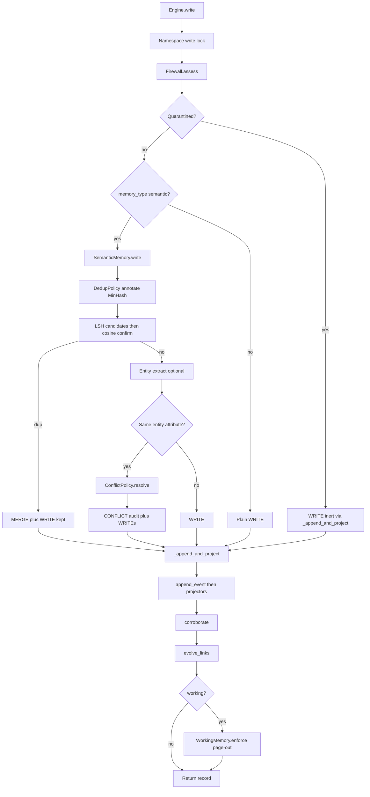
```mermaid
flowchart TD
  W[Engine.write] --> L[Namespace write lock]
  L --> F[Firewall.assess]
  F --> Q{Quarantined?}
  Q -->|yes| WD[WRITE inert via _append_and_project]
  Q -->|no| T{memory_type semantic?}
  T -->|yes| S[SemanticMemory.write]
  S --> S1[DedupPolicy annotate MinHash]
  S1 --> S2[LSH candidates then cosine confirm]
  S2 -->|dup| M[MERGE plus WRITE kept]
  S2 -->|no| S3[Entity extract optional]
  S3 --> S4{Same entity attribute?}
  S4 -->|yes| C[ConflictPolicy.resolve]
  C --> CW[CONFLICT audit plus WRITEs]
  S4 -->|no| SW[WRITE]
  T -->|no| PW[Plain WRITE]
  M & CW & SW & PW & WD --> D[_append_and_project]
  D --> P[append_event then projectors]
  P --> CR[corroborate]
  CR --> EV[evolve_links]
  EV --> WK{working?}
  WK -->|yes| PG[WorkingMemory.enforce page-out]
  WK -->|no| DONE[Return record]
  PG --> DONE
```

#### Retrieve flow
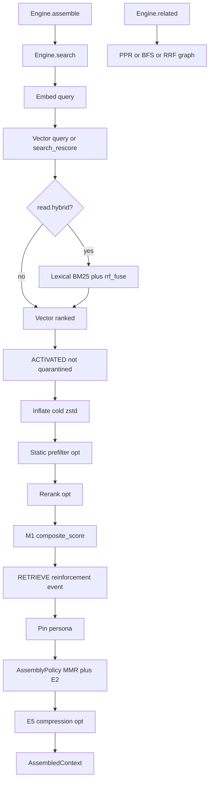
```mermaid
flowchart TD
  A[Engine.assemble] --> S[Engine.search]
  S --> E[Embed query]
  E --> V[Vector query or search_rescore]
  V --> H{read.hybrid?}
  H -->|yes| RRF[Lexical BM25 plus rrf_fuse]
  H -->|no| G[Vector ranked]
  RRF --> G
  G --> GATE[ACTIVATED not quarantined]
  GATE --> INF[Inflate cold zstd]
  INF --> SP[Static prefilter opt]
  SP --> RR[Rerank opt]
  RR --> SC[M1 composite_score]
  SC --> R[RETRIEVE reinforcement event]
  R --> P[Pin persona]
  P --> AP[AssemblyPolicy MMR plus E2]
  AP --> CP[E5 compression opt]
  CP --> OUT[AssembledContext]
  REL[Engine.related] --> PPR[PPR or BFS or RRF graph]
```

### 2.2 `A-mem`

**Repo:** `D:\mem\A-mem` · **SHA:** `ceffb860f0712bbae97b184d440df62bc910ca8d`  
**Package:** `agentic-memory` 0.0.1 · **Facade:** `agentic_memory.memory_system.AgenticMemorySystem`  
**Air-gap:** local tree only. Extends [`ARCHITECTURE_FLOWS.md`](../../ARCHITECTURE_FLOWS.md) §3.14 and [`ECOSYSTEM_COMPARISON.md`](../../ECOSYSTEM_COMPARISON.md) A-mem capsules — no contradictions without citation.

## Mental model

A-mem is a **Zettelkasten-style agentic note store**: each write creates a `MemoryNote`, optionally evolves links/tags/context against nearest neighbors via an LLM JSON decision, and indexes content in **ChromaDB** (SentenceTransformer embeddings). Retrieval is dense similarity, with an optional **link-expand** path (`search_agentic`) that appends neighbor notes from `links[]`.

Two trees exist in the ecosystem (ARCHITECTURE_FLOWS §3.14): this upstream clone (Chroma + litellm/openai/ollama) vs telemem’s `baselines/A-mem` (VLLM, eval-only). This survey covers **upstream only**.

## Source of truth

| Layer | Role | Evidence |
|-------|------|----------|
| **`self.memories: dict[id, MemoryNote]`** | Primary in-process object graph (links, tags, context, evolution_history) | `AgenticMemorySystem.__init__` / `add_note` |
| **ChromaDB collection `memories`** | Dense index + serialized metadata mirror | `retrievers.ChromaRetriever` |
| **Event log?** | **None** | — |

Dual write: mutate dict, then `retriever.add_document`. `consolidate_memories` **resets** the Chroma collection and re-adds from `self.memories` — Chroma is rebuildable from the dict, but the dict itself is process-local (ephemeral Client by default; `PersistentChromaRetriever` / `CopiedChromaRetriever` exist for disk/share).

Agrees with ARCHITECTURE_FLOWS: “ChromaDB collection + in-memory metadata.”

## Write path (cite file:symbol)

1. `AgenticMemorySystem.add_note(content, time=None, **kwargs)` — builds `MemoryNote` (UUID id; kwargs may supply tags/keywords/context/links/…).
2. `process_memory(note)` — if store non-empty:
   - `find_related_memories(note.content, k=5)` → Chroma `query`
   - Format evolution prompt (`_evolution_system_prompt`)
   - `LLMController.llm.get_completion` with JSON schema → `should_evolve` / `strengthen` / `update_neighbor`
   - On `strengthen`: extend `note.links`, replace `note.tags`
   - On `update_neighbor`: patch neighbor notes’ `tags`/`context` in `self.memories` (index mapping is fragile — see Claims)
3. Store `self.memories[note.id] = note`
4. `ChromaRetriever.add_document(content, metadata, id)` — lists/dicts JSON-stringified into Chroma metadata
5. If `should_evolve`: `evo_cnt += 1`; when `evo_cnt % evo_threshold == 0` → `consolidate_memories()`

**Not on hot path:** `analyze_content` (LLM keywords/context/tags) is **never called** by `add_note`. Callers must pass metadata via kwargs, or notes keep defaults (`context="General"`, `keywords=[]`, `tags=[]`).

## Update / conflict / patch path

| API | Behavior |
|-----|----------|
| `update(memory_id, **kwargs)` | setattr on `MemoryNote`; Chroma delete+re-add | `memory_system.py:update` |
| Evolution `update_neighbor` | LLM rewrites neighbor context/tags in-place in dict (Chroma not refreshed until consolidate or explicit update) | `process_memory` |
| Conflict ladder | **None** (no ADD/UPDATE/DELETE fact merge) | — |

## Delete / forget / erasure

- `delete(memory_id)` → `retriever.delete_document` + `del self.memories[id]`
- No soft-delete, quarantine, or decay TTL
- Ephemeral Chroma client: process restart loses both unless using `PersistentChromaRetriever`

## Retrieve / rank / assemble

| Method | Behavior |
|--------|----------|
| `search` / `_search` | Chroma `query` → join `self.memories`; `_search` docstring claims hybrid but **second leg re-calls the same Chroma search** (no BM25) |
| `find_related_memories` | Chroma top-k → formatted string for evolution / callers |
| `find_related_memories_raw` | Chroma hits + expand `links` from metadata/dict |
| `search_agentic` | Chroma top-k + append linked neighbors (`is_neighbor=True`) until `k` |

**No BM25/RRF** on any hot path despite `rank_bm25` / `BM25Okapi` import and `nltk.word_tokenize` helper. Agrees with ECOSYSTEM_COMPARISON: “Chroma, no BM25 hot path”; “rank_bm25 unused.”

No answer-assembly LLM on read — returns note dicts only.

## Background / sleep / consolidate / decay

| Job | Trigger | Behavior |
|-----|---------|----------|
| `consolidate_memories` | Every `evo_threshold` (default **100**) successful evolutions | New `ChromaRetriever`; re-add all notes from `self.memories` |
| Decay / Ebbinghaus | **Absent** | — |
| Sleep / dream | **Absent** | — |

“Consolidate” here is **index rebuild**, not LLM summarization.

## Claims vs code

| Claim | Verdict | Citation |
|-------|---------|----------|
| add_note → analyze + evolve LLM → Chroma | **diverge** | README / example claim auto metadata; `add_note` skips `analyze_content`; only `process_memory` LLM on non-empty store |
| Hybrid search (vector + BM25) | **diverge** | Imports `BM25Okapi`; never constructed; `_search` double-Chroma |
| Zettelkasten link evolution | **agree** | `process_memory` strengthen / update_neighbor |
| consolidate every evo_threshold | **agree** | `add_note` + `consolidate_memories` |
| Production-durable SoT | **diverge** | In-memory dict + default ephemeral Chroma; memspine cites as inspiration for bounded A-MEM links (ADR-015), not durable engine |
| 22–23 tests | **agree** (order) | `tests/` present; ECOSYSTEM says 23 definitions |
| Two trees (upstream vs telemem) | **agree** | ARCHITECTURE_FLOWS §3.14; telemem baseline not in this clone |

#### Write flow
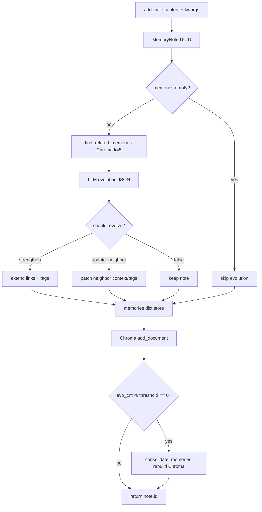
```mermaid
flowchart TD
  A[add_note content + kwargs] --> B[MemoryNote UUID]
  B --> C{memories empty?}
  C -->|yes| D[skip evolution]
  C -->|no| E[find_related_memories Chroma k=5]
  E --> F[LLM evolution JSON]
  F --> G{should_evolve?}
  G -->|strengthen| H[extend links + tags]
  G -->|update_neighbor| I[patch neighbor context/tags]
  G -->|false| J[keep note]
  H --> K[memories dict store]
  I --> K
  J --> K
  D --> K
  K --> L[Chroma add_document]
  L --> M{evo_cnt % threshold == 0?}
  M -->|yes| N[consolidate_memories rebuild Chroma]
  M -->|no| O[return note.id]
  N --> O
```

#### Retrieve flow
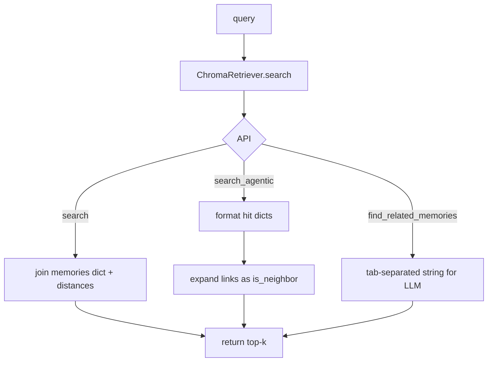
```mermaid
flowchart TD
  A[query] --> B[ChromaRetriever.search]
  B --> C{API}
  C -->|search| D[join memories dict + distances]
  C -->|search_agentic| E[format hit dicts]
  E --> F[expand links as is_neighbor]
  C -->|find_related_memories| G[tab-separated string for LLM]
  D --> H[return top-k]
  F --> H
  G --> H
```

### 2.3 `cognee`

**SHA:** `5b32da7c08237e7274342114a72d82667d97c1f4`  
**Air-gap:** local `D:\mem\cognee` only.  
**Prior:** `docs/ARCHITECTURE_FLOWS.md` §3.1; `docs/ECOSYSTEM_COMPARISON.md` capsules — extended below; **one diverge** called out.

## Mental model

Cognee is a **two-phase knowledge-graph pipeline**, not a cognitive-type memory engine:

1. **`add`** — ingest files/text/URLs into SQL `Data` / `Dataset` (relational SoT for raw content + ACL).
2. **`cognify`** — classify → chunk → LLM graph extract + summarize → persist nodes/edges to **graph** and embeddings to **vector**.
3. **`search`** — pick a `SearchType` retriever → optional LLM completion over retrieved context.
4. **`memify`** — optional post-graph enrichment (default: triplet datapoints + vector index; not memspine-style sleep consolidation).

Public SDK surface: `cognee.add` / `cognify` / `search` / `memify` → `api/v1/*/…`.

## Source of truth

| Layer | Role | Evidence |
|-------|------|----------|
| **SQLAlchemy `Data` / `Dataset`** | Authoritative raw ingest + permissions | `tasks/ingestion/ingest_data.py:ingest_data`; relational config default `sqlite` |
| **Graph (default Ladybug)** | Materialized KG nodes/edges | `infrastructure/databases/graph/config.py:GraphConfig` — `graph_database_provider` default **`"ladybug"`** |
| **LanceDB** | Vector projector (`{Type}_{field}` collections) | `infrastructure/databases/vector/config.py` — `vector_db_provider` default **`"lancedb"`** |

**Not** an append-only event log. Graph+vector are rebuildable via re-cognify / `forget(..., memory_only=True)` then cognify again.

### Claims vs prior docs (graph default)

| Claim | Status |
|-------|--------|
| Pass #4 / user brief: default graph = **kuzu** | **diverge** at this SHA |
| Code + `add` docstring: default = **ladybug** | **agree** — `GraphConfig.graph_database_provider = Field("ladybug")`; core dep `ladybug>=0.16.0,<0.18`; docstring `GRAPH_DATABASE_PROVIDER: "ladybug" (default)` in `api/v1/add/add.py` |
| Ladybug keeps legacy Kuzu file path | **agree** — if `cognee_graph_kuzu` exists, filename stays that path (`config.py:fill_derived`) |
| `kuzu` still selectable | **agree** — provider `"kuzu"` flips `graph_dataset_database_handler` to kuzu |

Ladybug is the MIT Kuzu fork; mental model remains embedded Cypher — but the **provider string and core package are ladybug**, not `kuzu`.

## Write path (cite file:symbol)

```
add → resolve_data_directories → ingest_data (SQL)
cognify → classify_documents → extract_chunks_from_documents
       → extract_graph_and_summarize (parallel graph + summary)
       → add_data_points (graph + LanceDB)
       → extract_dlt_fk_edges
```

| Stage | Symbol |
|-------|--------|
| Ingest facade | `api/v1/add/add.py:add` |
| Pipeline tasks | `Task(resolve_data_directories)`, `Task(ingest_data, …)` |
| Cognify facade | `api/v1/cognify/cognify.py:cognify` |
| Default task list | `cognify.py:get_default_tasks` |
| Classify | `tasks/documents/classify_documents` (uses LLM categories via `extract_categories` → `classify_content.txt`) |
| Chunk | `tasks/documents/extract_chunks_from_documents` + `modules/chunking/TextChunker` |
| Graph+summary | `tasks/graph/extract_graph_and_summarize.py:extract_graph_and_summarize` |
| Graph extract | `tasks/graph/extract_graph_from_data.py:extract_graph_from_data` → `infrastructure/llm/extraction/knowledge_graph/extract_content_graph.py:extract_content_graph` → `LLMGateway.acreate_structured_output` (**instructor** default) |
| Summarize | `tasks/summarization/summarize_text.py:summarize_text` → `extract_summary` + `summarize_content.txt` |
| Persist | `tasks/storage/add_data_points.py:add_data_points` → `upsert_nodes`/`upsert_edges` (SQL ledger) + Ladybug `add_nodes`/`add_edges` + `index_data_points` / `index_graph_edges` (LanceDB) |
| Temporal alt | `cognify.py:get_temporal_tasks` when `temporal_cognify=True` |

Default **`run_in_background=False`** (blocking) — agrees with pass #4.

## Update / conflict / patch path

| Path | Behavior | Evidence |
|------|----------|----------|
| **`update`** | Delete data item → `add` → `cognify` (full replace, not patch merge) | `api/v1/update/update.py:update` |
| **Incremental add** | `content_hash` compare; skip unchanged | `tasks/ingestion/ingest_data.py` (`incremental_loading`) |
| **Entity identity** | Deterministic `Entity` ids via `identity_fields: ["name"]` | `modules/engine/models/Entity.py` |
| **Edge dedup on write** | `deduplicate_nodes_and_edges` before upsert | `add_data_points.py` |
| **Conflict ladder / M4** | **Absent** | No ADD/UPDATE/DELETE infer; no MinHash |
| **Schema custom prompts** | `custom_prompt_generation_*.txt`, `infer_schema_*.txt`, `patch_gen_*.txt` | schema / codegen paths — not hot cognify |

## Delete / forget / erasure

Unified API: `api/v1/forget/forget.py:forget`

- `data_id` + dataset → remove item  
- `dataset` / `dataset_id` → remove dataset  
- `everything=True` → wipe user-owned data  
- `memory_only=True` → drop graph+vector, keep raw SQL files for re-cognify  

Replaces older prune/delete/empty_dataset mental models (docstring).

## Retrieve / rank / assemble

Facade: `api/v1/search/search.py:search` → `modules/search/methods/search.py:search` → `get_search_type_retriever_instance`.

**`SearchType` (17)** — `modules/search/types/SearchType.py`:

`SUMMARIES`, `CHUNKS`, `RAG_COMPLETION`, `HYBRID_COMPLETION`, `TRIPLET_COMPLETION`, `GRAPH_COMPLETION` (default), `GRAPH_COMPLETION_DECOMPOSITION`, `GRAPH_SUMMARY_COMPLETION`, `CYPHER`, `NATURAL_LANGUAGE`, `GRAPH_COMPLETION_COT`, `GRAPH_COMPLETION_CONTEXT_EXTENSION`, `FEELING_LUCKY`, `TEMPORAL`, `CODING_RULES`, `CHUNKS_LEXICAL`, `AGENTIC_COMPLETION`.

Default GRAPH_COMPLETION path:

1. Vector-wide search over DataPoint index collections  
2. Project graph fragment (`brute_force_triplet_search` / `CogneeGraph`)  
3. Rank triplets: sum of (node1, edge, node2) distances × importance, optional feedback blend (`CogneeGraph._calculate_query_top_triplet_importances`)  
4. Render triplets → `graph_context_for_question.txt` + `answer_simple_question.txt` via `generate_completion`

`FEELING_LUCKY` → `select_search_type` + `search_type_selector_prompt.txt` (fallback `RAG_COMPLETION`).

`CHUNKS_LEXICAL` → Okapi BM25 in-process (`BM25ChunksRetriever`).

## Background / sleep / consolidate / decay

| Job | Role | Evidence |
|-----|------|----------|
| **cognify** | Primary “build memory” job; blocking by default; optional background / Modal `[distributed]` | `cognify.py`; `pyproject.toml` extra `distributed` |
| **memify** | Enrichment over existing graph; default = triplet extract + `index_data_points` | `modules/memify/memify.py:memify`; `memify_pipelines/memify_default_tasks.py` |
| **Session distillation** | Persist durable session lessons | `modules/session_distillation/distill.py` + curator/writer prompts |
| **Decay / Ebbinghaus** | **Absent** | No sleep sweep / forgetting tiers |
| **Community detection** | Registry hook for community retrievers; not default cognify | tests mention `registered_community_retrievers` |

**memify ≠ memspine consolidate** — optional enrichment, not episodic→semantic promotion.

## Claims vs code

| Claim (prior / README) | Verdict |
|------------------------|---------|
| add → cognify → search | **agree** |
| LanceDB default vector | **agree** |
| Default graph **kuzu** | **diverge** → **ladybug** at this SHA |
| instructor graph extract | **agree** (`LLMGateway` → litellm_instructor; BAML optional) |
| cognify blocking default | **agree** |
| ~45+ `.txt` prompts | **agree** — **60** `.txt` + `llm_judge_prompts.py` (5) = **65** inventory units |
| SearchType ~15 | **diverge** — **17** enum members |
| No firewall / nine-type API | **agree** |
| memify = enrichment not cognitive sleep | **agree** |

#### Write flow
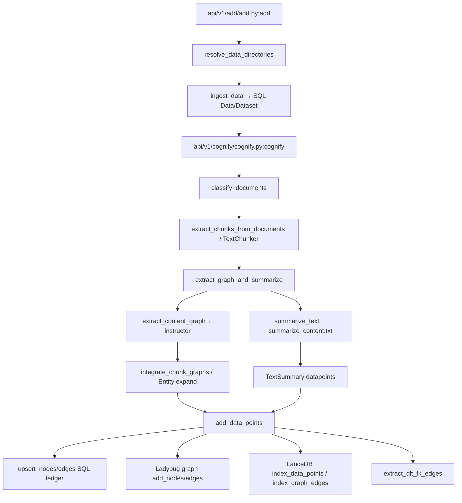
```mermaid
flowchart TD
  A["api/v1/add/add.py:add"] --> B["resolve_data_directories"]
  B --> C["ingest_data → SQL Data/Dataset"]
  C --> D["api/v1/cognify/cognify.py:cognify"]
  D --> E["classify_documents"]
  E --> F["extract_chunks_from_documents / TextChunker"]
  F --> G["extract_graph_and_summarize"]
  G --> H["extract_content_graph + instructor"]
  G --> I["summarize_text + summarize_content.txt"]
  H --> J["integrate_chunk_graphs / Entity expand"]
  I --> K["TextSummary datapoints"]
  J --> L["add_data_points"]
  K --> L
  L --> M["upsert_nodes/edges SQL ledger"]
  L --> N["Ladybug graph add_nodes/edges"]
  L --> O["LanceDB index_data_points / index_graph_edges"]
  L --> P["extract_dlt_fk_edges"]
```

#### Retrieve flow
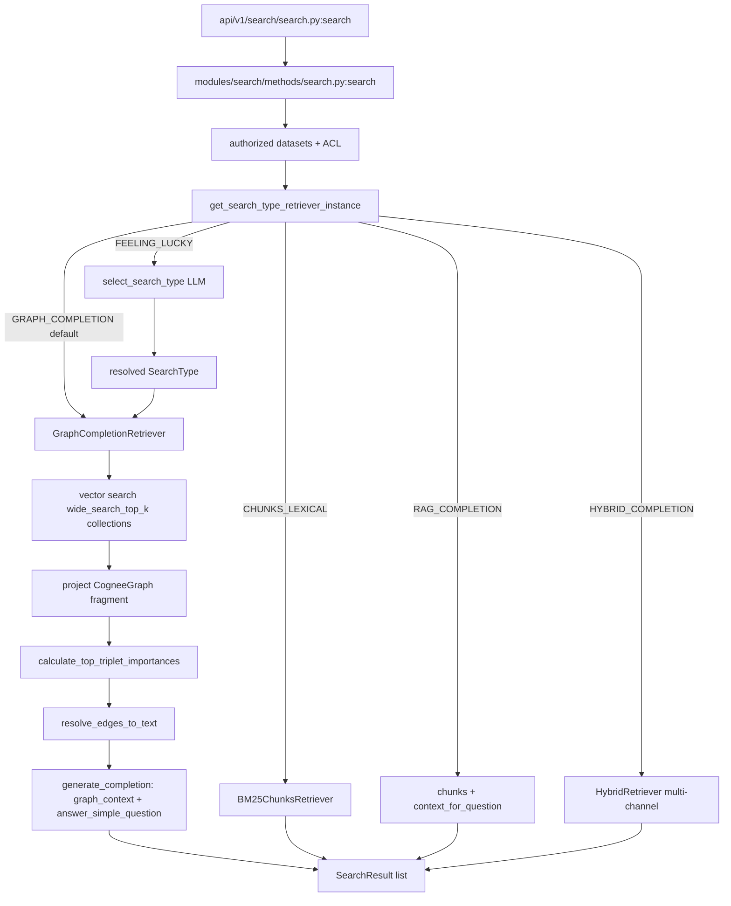
```mermaid
flowchart TD
  S["api/v1/search/search.py:search"] --> M["modules/search/methods/search.py:search"]
  M --> Auth["authorized datasets + ACL"]
  Auth --> R["get_search_type_retriever_instance"]
  R -->|FEELING_LUCKY| FL["select_search_type LLM"]
  FL --> R2["resolved SearchType"]
  R -->|GRAPH_COMPLETION default| GC["GraphCompletionRetriever"]
  R2 --> GC
  GC --> V["vector search wide_search_top_k collections"]
  V --> G["project CogneeGraph fragment"]
  G --> T["calculate_top_triplet_importances"]
  T --> Ctx["resolve_edges_to_text"]
  Ctx --> LLM["generate_completion: graph_context + answer_simple_question"]
  R -->|CHUNKS_LEXICAL| BM["BM25ChunksRetriever"]
  R -->|RAG_COMPLETION| RAG["chunks + context_for_question"]
  R -->|HYBRID_COMPLETION| HY["HybridRetriever multi-channel"]
  LLM --> Out["SearchResult list"]
  BM --> Out
  RAG --> Out
  HY --> Out
```

### 2.4 `EverMemOS`

**Repo:** `D:\mem\EverMemOS` · **SHA:** `66a201e16416c3c628bb71bccba5f2da69ed5653`  
**Package:** `everos` 1.1.0 · **Facades:** `everos.service.memorize.memorize` / `everos.service.search.search` (+ knowledge CRUD)  
**Air-gap:** local tree only. Extends [`ARCHITECTURE_FLOWS.md`](../../ARCHITECTURE_FLOWS.md) §3.15 / §3.18 and [`ECOSYSTEM_COMPARISON.md`](../../ECOSYSTEM_COMPARISON.md) EverMemOS capsules + [`ECOSYSTEM_MEMORY_TYPES_MS_CG_EO.csv`](../../exports/ECOSYSTEM_MEMORY_TYPES_MS_CG_EO.csv).

## Mental model

EverOS is a **markdown-first memory chassis**: chat/agent messages are buffered, cut into **MemCells** by boundary detection, written as daily-log markdown (episodes and OME-derived kinds), then **cascaded** into LanceDB (+ SQLite ledgers). Search is hierarchical hybrid / agentic over Lance projectors.

### everalgo opaque boundary (critical)

| Layer | Location | Inspectability |
|-------|----------|----------------|
| **Chassis (OSS)** | `src/everos/**` | Fully readable — ingest, pipelines, cascade, OME scheduler, Lance/SQLite/md I/O, search orchestration |
| **Algorithm wheels (closed)** | PyPI: `everalgo-user-memory==0.3.1`, `everalgo-agent-memory==0.3.1`, `everalgo-rank==0.4.1`, `everalgo-knowledge==0.1.1` (+ optional `everalgo-parser`) | **Not in this repo**; no source under `D:\mem\EverMemOS` or sibling `D:\mem/everalgo*` in air-gap scan |
| **Prompt defaults** | Bundled inside everalgo packages (paths cited in YAML comments only) | **Opaque** unless wheels are installed and unpacked outside this survey |

EverOS supplies **PromptSlot overrides** (`config/prompt_slots/*.yaml`) that are **disabled by default** (`enabled: false`, empty `template`) → pipelines pass `prompt=None` → algo bundled defaults. OME extractors (atomic facts, foresight, profile, agent case/skill, reflection) call everalgo classes with **no OSS prompt text**.

Agrees with ARCHITECTURE_FLOWS §3.15: “OSS repo is chassis + OME orchestration”; ECOSYSTEM “everalgo-* wheels opaque.”

## Source of truth

| Layer | Role | Evidence |
|-------|------|----------|
| **Markdown files** | **SoT** for memory content (“md is the SoT”) | `EpisodeWriter` / kind writers; cascade handlers |
| **SQLite** | Ledgers: memcell, unprocessed_buffer, md_change_state, clusters, reflection reports, knowledge index, OME jobstore | `infra/persistence/sqlite` |
| **LanceDB** | Rebuildable vector+BM25 projector per kind | `cascade/worker.py` md → Lance |
| **Event log?** | OME domain events (`EpisodeExtracted`, `UserPipelineStarted`, …) drive strategies — **not** an append-only memory SoT | `memory/events.py` + `infra/ome` |

`knowledge_document` is **SQLite-only** (no Lance) — agrees with ECOSYSTEM_COMPARISON pass #4 fix.

## Write path (cite file:symbol)

1. `service/memorize.py:memorize` — per-`session_id` lock + timeout
2. `memory/extract/ingest.process` → `IngestResult` (canonical messages)
3. `service/_boundary.prepare_cells`:
   - merge unprocessed buffer + fresh messages
   - **chat:** `everalgo.boundary.detect_boundaries` (+ optional `PromptLoader.load("boundary_detection")`)
   - **agent:** `everalgo.agent_memory.AgentBoundaryDetector`
   - persist memcell rows + tail buffer
4. `asyncio.gather`:
   - `UserMemoryPipeline.run` → `everalgo.user_memory.EpisodeExtractor.aextract` → `EpisodeWriter.append_entry` → emit `EpisodeExtracted` / `UserPipelineStarted`
   - `AgentMemoryPipeline.run` (mode=agent) → emit `AgentPipelineStarted` only
5. OME strategies (Immediate/Cron) write further md kinds → cascade watcher/scanner → `cascade/worker` projects to Lance

## Update / conflict / patch path

| Path | Behavior |
|------|----------|
| Reflection | Select → Merge → Re-extract → **Deprecate** originals (`deprecated_by`) in md + Lance | `memory/reflection/orchestrator.py` |
| Profile / skill | everalgo extractors INIT/UPDATE existing profile/skill md | `extract_user_profile`, `extract_agent_skill` |
| Knowledge | create/replace/delete document trees | `service/knowledge.py` |
| Fact conflict ladder | **Opaque** inside everalgo extractors; chassis does not implement mem0-style ADD/UPDATE/DELETE | — |

## Delete / forget / erasure

| Mechanism | Scope |
|-----------|-------|
| `delete_document` | Knowledge doc directory; cascade handles SQLite/Lance | `service/knowledge.py:delete_document` |
| Reflection deprecate | Soft: `deprecated_by` on episodes/facts; search filters `deprecated_by IS NULL` for user owner | `filters.py` / orchestrator `_deprecate` |
| Cascade `handle_deleted` | md file removal → Lance row delete | `cascade/worker.py` |
| Hard forget API for chat episodes | **No** general user-facing forget beyond knowledge delete + deprecate | — |

## Retrieve / rank / assemble

`service/search.py:search` → `memory/search/manager.py:SearchManager.search`:

| Method | Path |
|--------|------|
| KEYWORD / VECTOR | Single-route recaller (no fusion) |
| HYBRID (episodes) | Sparse+dense recall → **`hierarchy_retrieve_episodes`**: RRF → MaxSim (atomic facts) → RRF → LR-calibrated fact eviction | `hierarchy.py` uses `everalgo.rank.fusion.rrf`, `amaxsim_retrieve`, `cosine_to_lr_score` |
| AGENTIC | `everalgo.rank` agentic/cluster/hybrid/maxsim stack + cross-encoder rerank | `agentic.py` — **algorithm internals opaque** |
| Profile | KV `ProfileRecaller` (no embed) | |
| Agent case/skill | Hybrid / agentic variants | `skill_hybrid.py` uses `rrf` |

Foresight: written by OME; **no recaller** today (CSV / prior pass).

## Background / sleep / consolidate / decay

| Job | Trigger | Module |
|-----|---------|--------|
| Cascade drain | watchdog + poller | `cascade/worker.py`, `watcher.py` |
| extract_atomic_facts | Immediate on `EpisodeExtracted` | `strategies/extract_atomic_facts.py` → `AtomicFactExtractor` |
| extract_foresight | Immediate on `UserPipelineStarted` | `ForesightExtractor` |
| extract_agent_case / skill | Agent pipeline events + clustering | everalgo agent_memory |
| trigger_*_clustering | Geometry/LLM cluster | `everalgo.clustering` |
| extract_user_profile | After profile clustering | `ProfileExtractor` |
| reflect_episodes | Cron `0 2 * * 1`, **enabled=False** default | `EpisodeReflector` + ReflectionOrchestrator |
| Lance optimize / 12h index rebuild | Worker loops | `cascade/worker.py` |

No Ebbinghaus decay in chassis. “OME” = Offline Memory Evolution (APScheduler jobstore), not memspine sleep cycle.

## Claims vs code

| Claim | Verdict | Citation |
|-------|---------|----------|
| Markdown SoT + Lance projector | **agree** | writers + cascade worker |
| 8 cascade kinds | **agree** | `KIND_REGISTRY` (episode, atomic_fact, foresight, agent_case, agent_skill, user_profile, knowledge_document, knowledge_topic) |
| 2 YAML prompt slots + opaque OME | **agree** | `boundary_detection`, `episode_extract`; both disabled |
| RRF hierarchy + everalgo.rank | **agree** | `hierarchy.py`, `manager.py` |
| everalgo inspectable | **opaque** | wheels only; prompts cited as external paths |
| foresight recall | **agree** (absent) | no ForesightRecaller in `service/search.py` wiring |
| knowledge_document → SQLite only | **agree** | KindSpec `lance_schema=None` |
| Rebrand everos | **agree** | `pyproject.toml` name `everos` |

#### Write flow
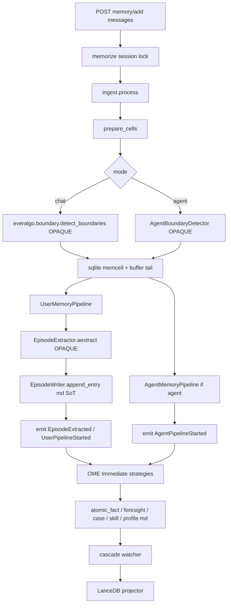
```mermaid
flowchart TD
  A[POST memory/add messages] --> B[memorize session lock]
  B --> C[ingest.process]
  C --> D[prepare_cells]
  D --> E{mode}
  E -->|chat| F[everalgo.boundary.detect_boundaries OPAQUE]
  E -->|agent| G[AgentBoundaryDetector OPAQUE]
  F --> H[sqlite memcell + buffer tail]
  G --> H
  H --> I[UserMemoryPipeline]
  H --> J[AgentMemoryPipeline if agent]
  I --> K[EpisodeExtractor.aextract OPAQUE]
  K --> L[EpisodeWriter.append_entry md SoT]
  L --> M[emit EpisodeExtracted / UserPipelineStarted]
  J --> N[emit AgentPipelineStarted]
  M --> O[OME Immediate strategies]
  N --> O
  O --> P[atomic_fact / foresight / case / skill / profile md]
  P --> Q[cascade watcher]
  Q --> R[LanceDB projector]
```

#### Retrieve flow
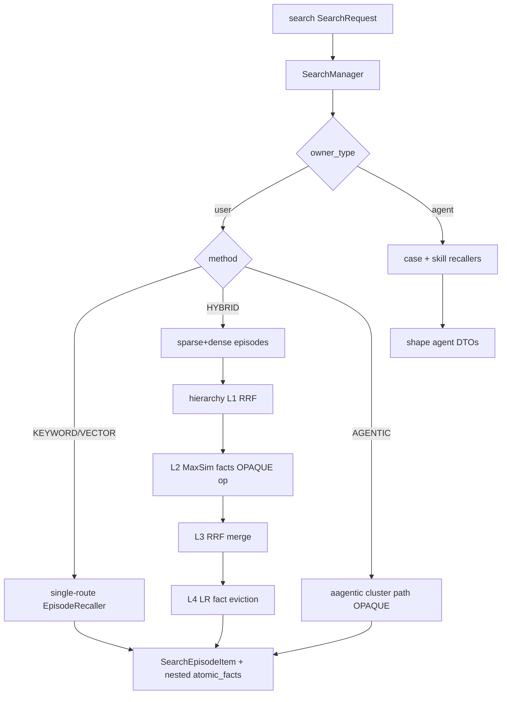
```mermaid
flowchart TD
  A[search SearchRequest] --> B[SearchManager]
  B --> C{owner_type}
  C -->|user| D{method}
  C -->|agent| E[case + skill recallers]
  D -->|KEYWORD/VECTOR| F[single-route EpisodeRecaller]
  D -->|HYBRID| G[sparse+dense episodes]
  G --> H[hierarchy L1 RRF]
  H --> I[L2 MaxSim facts OPAQUE op]
  I --> J[L3 RRF merge]
  J --> K[L4 LR fact eviction]
  D -->|AGENTIC| L[aagentic cluster path OPAQUE]
  K --> M[SearchEpisodeItem + nested atomic_facts]
  L --> M
  F --> M
  E --> N[shape agent DTOs]
```

### 2.5 `graphiti`

**Repo:** `D:\mem\graphiti` · **SHA:** `34f56e65e0fe2096132c8d16f3a1a4ac9300a5f6` · **pkg:** `graphiti-core==0.29.1`  
**Prior:** `ARCHITECTURE_FLOWS.md` §3.2 · `ECOSYSTEM_COMPARISON.md` (GT capsules) — extended, not contradicted.

## Mental model

Graphiti is a **temporal context-graph engine** (Zep). Callers append **episodes** (messages / text / JSON). An LLM extracts **entity nodes** and **fact edges**; deterministic + LLM **dedupe** merges them into a property graph. Facts carry **bi-temporal** fields (`valid_at` / `invalid_at` for world time; `created_at` / `expired_at` for system invalidation). Retrieval is **hybrid BM25 + cosine** over edge facts (and optionally nodes/episodes/communities), fused with **RRF**, with optional **node-distance**, **MMR**, or **cross-encoder** rerank.

It is the *graph*, not an event-log engine: the Neo4j/Kuzu/Falkor/Neptune store **is** the source of truth.

## Source of truth

| Layer | Role |
|-------|------|
| **Property graph** (driver-backed) | Sole SoT — `EpisodicNode`, `EntityNode`, `EntityEdge` (`RELATES_TO`), `CommunityNode`, saga edges |
| Vector / fulltext indexes | Rebuildable projectors **on the same graph** (embeddings + BM25 indexes co-located) |
| Episode content | Stored on `EpisodicNode.content`; facts paraphrase into `EntityEdge.fact` |

**Agree** with prior: graph-primary SoT; no `memory_events` log.

## Write path (cite file:symbol)

Primary: `graphiti_core/graphiti.py:Graphiti.add_episode`

1. `retrieve_episodes` (or caller-supplied `previous_episode_uuids`) — context window `RELEVANT_SCHEMA_LIMIT=10`
2. Build / load `EpisodicNode` (`valid_at=reference_time`)
3. `utils/maintenance/node_operations.py:extract_nodes` → `prompt_library.extract_nodes.{extract_message|extract_text|extract_json}` by `EpisodeType`
4. `resolve_extracted_nodes` → exact name + MinHash/LSH (`dedup_helpers`) then `prompt_library.dedupe_nodes.nodes` for unresolved
5. `_extract_and_resolve_edges` → `edge_operations.extract_edges` (`prompt_library.extract_edges.edge`) → `resolve_extracted_edges` / `resolve_extracted_edge` (`dedupe_edges.resolve_edge` + timestamp/attribute prompts) → contradiction → set `invalid_at`/`expired_at`
6. `extract_attributes_from_nodes` (attributes + batch summaries)
7. `_process_episode_data` — persist nodes/edges/MENTIONS (+ optional saga `HAS_EPISODE` / `NEXT_EPISODE`)
8. Optional `update_communities` per node

Bulk: `add_episode_bulk` → `bulk_utils.extract_nodes_and_edges_bulk` (default **separate** extract; combined path behind `use_combined_extraction`).

**Agree** with prior write chain. **Extend:** saga association + attribute/summary hydration are first-class on the hot path.

## Update / conflict / patch path

- **Conflict = edge contradiction**, not a separate memory-type ladder.
- `resolve_extracted_edge` LLM returns `duplicate_facts` + `contradicted_facts`.
- `resolve_edge_contradictions` expires older edges: sets `invalid_at = resolved.valid_at`, `expired_at = now` when older `valid_at <` new.
- Newer candidate can also expire the **new** edge if candidate `valid_at` is later.
- Duplicate edges: reuse existing edge UUID; append episode UUID to `episodes`.
- Node duplicates: map to canonical UUID; optional `IS_DUPLICATE_OF` edges via filter helpers.
- Direct patch API: `add_triplet` resolves nodes then upserts a hand-built edge.

**Agree** with prior “invalidate stale”. **Extend:** bi-temporal split (`valid_at`/`invalid_at` vs `expired_at`) is explicit in `EntityEdge`.

## Delete / forget / erasure

- `Graphiti.remove_episode(episode_uuid)`:
  - Deletes edges whose **first** `episodes[0]` is this episode
  - Deletes entities mentioned **only** by this episode
  - Deletes the episodic node
- No soft-forget / decay / GDPR erasure API beyond hard delete + temporal invalidation.
- `remove_communities` DETACH DELETE all `Community` nodes before rebuild.

**Opaque vs memspine:** no firewall, quarantine, or trust matrix.

## Retrieve / rank / assemble

| API | Config | Output |
|-----|--------|--------|
| `Graphiti.search` | `EDGE_HYBRID_SEARCH_RRF` or `EDGE_HYBRID_SEARCH_NODE_DISTANCE` if `center_node_uuid` | `list[EntityEdge]` |
| `Graphiti.search_` | default `COMBINED_HYBRID_SEARCH_CROSS_ENCODER` (BM25+cosine+BFS → cross-encoder; MMR via recipes) | `SearchResults` (edges/nodes/episodes/communities) |

Core: `search/search.py:search` → per-scope search → rerankers in `search_utils` (`rrf`, `maximal_marginal_relevance`, `node_distance_reranker`, cross-encoder client).

No answer-synthesis LLM on the default read path (eval `qa_prompt` is eval-only).

**Agree** with prior search/search_ split and center_node_uuid → node-distance.

## Background / sleep / consolidate / decay

- **No internal sleep loop.** Docstring: run `add_episode` as background queue job; await sequentially.
- `build_communities` — label propagation clustering + LLM `summarize_pair` / `summary_description`; clears prior communities.
- Inline `update_communities=True` on `add_episode` updates membership summaries.
- Saga summarization: `prompt_library.summarize_sagas.summarize_saga` from `graphiti.py`.
- **No Ebbinghaus decay.** Invalidation is contradiction/temporal, not salience decay.
- In-repo **REST** (`server/`) + **MCP** (`mcp_server/`) surfaces.

**Agree** with prior “none internal; REST+MCP”.

## Claims vs code

| Claim (docs / prior) | Verdict | Evidence |
|----------------------|---------|----------|
| Bitemporal fact graph | **agree** | `EntityEdge.valid_at/invalid_at/expired_at/created_at` |
| `search()` = edge hybrid RRF | **agree** | `graphiti.py:1527` + `EDGE_HYBRID_SEARCH_RRF` |
| `center_node_uuid` → node-distance | **agree** | `EDGE_HYBRID_SEARCH_NODE_DISTANCE` |
| `search_()` default cross-encoder | **agree** | `COMBINED_HYBRID_SEARCH_CROSS_ENCODER` |
| MMR optional via recipes | **agree** | `COMBINED_HYBRID_SEARCH_MMR`, `EDGE_HYBRID_SEARCH_MMR` |
| 25 prompt_library versions | **agree** | 8+4+1+3+1+3+1+4 = 25 in `prompts/*.py` `versions` dicts |
| Pydantic not instructor | **agree** | `llm_client.generate_response(..., response_model=...)` |
| No sleep / external queue | **agree** | `add_episode` Notes |
| Label-propagation communities | **agree** | `community_operations.label_propagation` |
| Combined extract always on write | **diverge** | Default path is separate extract; combined is bulk opt-in |
| “25 hot prompts” | **diverge / opaque** | 25 registered; ~17 wired on product paths; ~8 dead/eval-only |

#### Write flow
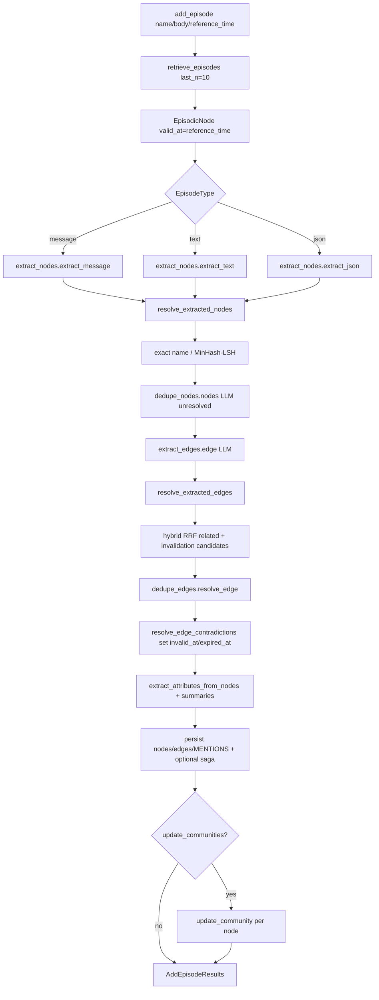
```mermaid
flowchart TD
  A[add_episode name/body/reference_time] --> B[retrieve_episodes last_n=10]
  B --> C[EpisodicNode valid_at=reference_time]
  C --> D{EpisodeType}
  D -->|message| E1[extract_nodes.extract_message]
  D -->|text| E2[extract_nodes.extract_text]
  D -->|json| E3[extract_nodes.extract_json]
  E1 --> F[resolve_extracted_nodes]
  E2 --> F
  E3 --> F
  F --> F1[exact name / MinHash-LSH]
  F1 --> F2[dedupe_nodes.nodes LLM unresolved]
  F2 --> G[extract_edges.edge LLM]
  G --> H[resolve_extracted_edges]
  H --> H1[hybrid RRF related + invalidation candidates]
  H1 --> H2[dedupe_edges.resolve_edge]
  H2 --> H3[resolve_edge_contradictions set invalid_at/expired_at]
  H3 --> I[extract_attributes_from_nodes + summaries]
  I --> J[persist nodes/edges/MENTIONS + optional saga]
  J --> K{update_communities?}
  K -->|yes| L[update_community per node]
  K -->|no| M[AddEpisodeResults]
  L --> M
```

#### Retrieve flow
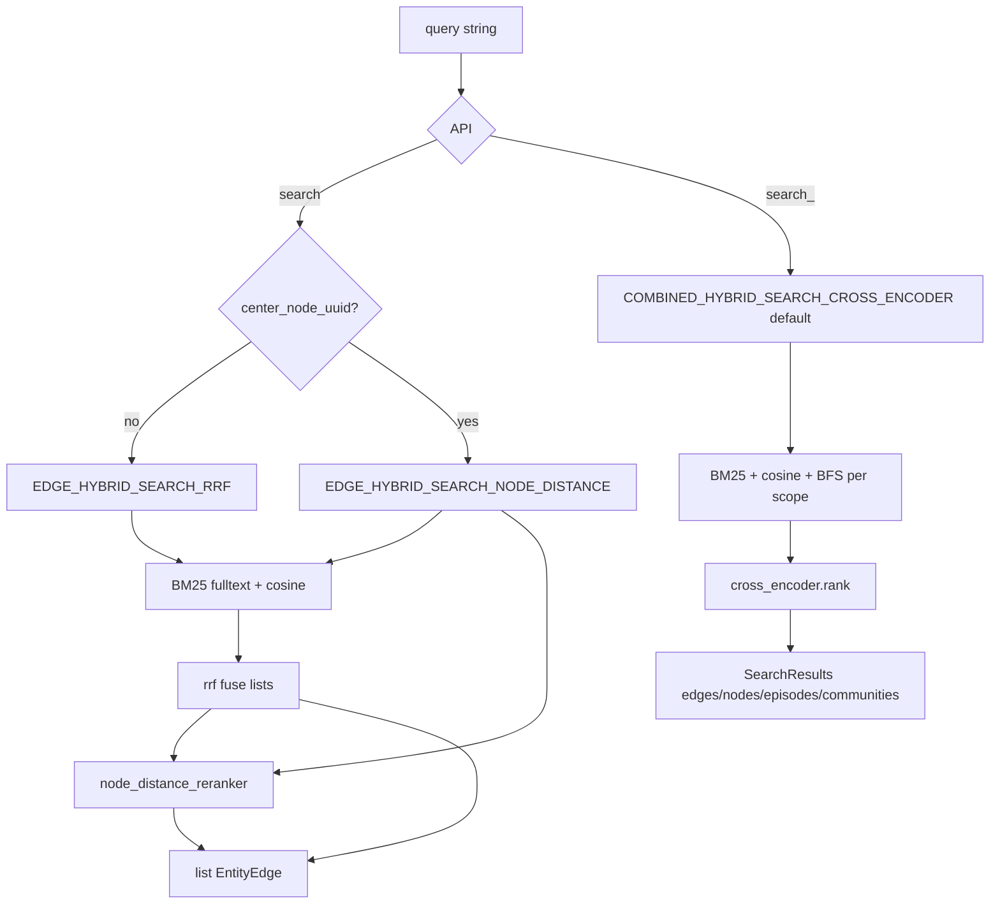
```mermaid
flowchart TD
  Q[query string] --> A{API}
  A -->|search| B{center_node_uuid?}
  B -->|no| C[EDGE_HYBRID_SEARCH_RRF]
  B -->|yes| D[EDGE_HYBRID_SEARCH_NODE_DISTANCE]
  A -->|search_| E[COMBINED_HYBRID_SEARCH_CROSS_ENCODER default]
  C --> F[BM25 fulltext + cosine]
  D --> F
  E --> G[BM25 + cosine + BFS per scope]
  F --> H[rrf fuse lists]
  D --> I[node_distance_reranker]
  H --> I
  G --> J[cross_encoder.rank]
  H --> K[list EntityEdge]
  I --> K
  J --> L[SearchResults edges/nodes/episodes/communities]
```

### 2.6 `hindsight`

**Repo:** `D:\mem\hindsight` @ `00ccf0b218c2ec1a060b0b291a1bbccb02021c72` (hindsight-api-slim **0.4.20**)  
**Prior:** `docs/ARCHITECTURE_FLOWS.md` §3.16 · `docs/ECOSYSTEM_COMPARISON.md` (hindsight capsule) — extended, not contradicted.

## Mental model

Hindsight is a **server-first banking/mission memory** product: content is **retained** into typed **facts** (`world` / `experience`) via LLM extraction, stored in PostgreSQL `memory_units` with pgvector embeddings and multi-type **graph links**; a background **consolidation** worker lifts facts into **observations**; agents **recall** via 4-leg hybrid retrieval (semantic + BM25 + graph + temporal) fused with **RRF** then **cross-encoder** (or pluggable) rerank; **reflect** is an agentic tool loop over mental models → observations → raw recall → expand → markdown synthesis. Banks carry mission, disposition, directives, and tags.

## Source of truth

| Layer | Store | Role |
|-------|-------|------|
| Facts / observations | Postgres `memory_units` (`fact_type` ∈ world, experience, opinion†, observation) + `embedding` (pgvector HNSW) | Primary memory SoT |
| Graph | Postgres `memory_links` (`link_type` ∈ temporal, semantic, entity, causes, caused_by, enables, prevents) | Rebuildable from retain; used by graph/temporal legs |
| Chunks / documents | `chunks` / documents tables | Source text for expand + re-retain |
| Mental models | `mental_models` (+ embeddings) | User-curated / refreshed summaries (not auto-SoT) |
| Directives | `directives` table | Hard rules injected into reflect prompts |
| Banks | `banks` (mission, disposition, config overrides) | Scope / identity |
| Work queue | Postgres async operations + `hindsight-worker` poller (`FOR UPDATE SKIP LOCKED`) | Consolidation / async retain |

† `opinion` remains in DB check constraint but is **silently dropped** from recall (`VALID_RECALL_FACT_TYPES` = world/experience/observation).

Agree with ARCHITECTURE_FLOWS: “PostgreSQL `memory_units` + pgvector HNSW + graph link tables.”

## Write path (cite file:symbol)

1. **Facade** — `memory_engine.py:retain_async` → `retain_batch_async` (token-chunked sub-batches via `retain_batch_tokens`).
2. **Orchestrator** — `retain/orchestrator.py:retain_batch`:
   1. `fact_extraction.extract_facts_from_contents` — LLM structured extract (concise/custom/verbose/verbatim modes).
   2. `embedding_utils` / `embedding_processing` — date-augmented texts → batch embeddings.
   3. DB transaction: document tracking → `chunk_storage.store_chunks_batch` → `fact_storage.insert_facts_batch` → entity resolve + **entity links** → **temporal** → **semantic** → **causal** links (`link_creation.py`).
3. **Post-write** — `submit_async_consolidation` enqueues observation consolidation (when observations enabled).

## Update / conflict / patch path

| Mechanism | Where | Behavior |
|-----------|-------|----------|
| Observation consolidate | `consolidation/consolidator.py:run_consolidation_job` | LLM returns `creates` / `updates` / `deletes` vs pooled existing observations; mission-driven |
| Document re-retain | `fact_storage.handle_document_tracking` | First batch of a document **deletes** prior document units (cascade) then inserts |
| Mental model refresh | MCP / engine refresh → reflect with `exclude_mental_model_ids` | Avoid circular self-reference |
| Bank mission merge | `retain/bank_utils.py:merge_bank_mission` | LLM merge; **new info overwrites conflicts**; first-person ≤500 chars |
| Directives | CRUD on directives | Hard rules for reflect; tag-scoped isolation |
| No general fact-patch API | — | Facts are insert + cascade delete; observation text updated by consolidator |

## Delete / forget / erasure

- **`delete_memory_unit`** — hard delete unit; CASCADE removes links; observations referencing it invalidated → re-consolidation (`memory_engine.py:delete_memory_unit`).
- **`delete_document`** — deletes document + units; invalidates dependent observations.
- **`delete_bank`** — full bank wipe (optional `fact_type` filter); drops per-bank HNSW indexes.
- **File storage** — optional `file_delete_after_retain` for object-store blobs.
- No soft-delete / tombstone / GDPR erasure API beyond hard deletes (unlike honcho `deleted_at`).

## Retrieve / rank / assemble

| Surface | Entry | Ranking |
|---------|-------|---------|
| **Recall** | `memory_engine.py:recall_async` → `_search_with_retries` | Per fact type: parallel **semantic** (pgvector), **BM25**, **graph** activation, optional **temporal** → **RRF** (`fusion.py`, `k=60`) → pre-filter top `reranker_max_candidates` → **cross-encoder** (or TEI/Cohere/Flashrank/RRF-only) → `apply_combined_scoring` (CE × recency × temporal boosts) → truncate `thinking_budget*2` → token budget |
| **Reflect** | `reflect_async` → `reflect/agent.py:run_reflect_agent` | Tool hierarchy: `search_mental_models` → `search_observations` → `recall` → `expand` → `done`; final synthesis with `FINAL_SYSTEM_PROMPT` |
| **Think (legacy)** | `search/think_utils.py:reflect` | Single-shot disposition-conditioned answer over pre-fetched facts (not the agentic path) |

**Diverge:** Docstrings claim “Diversify: Apply MMR” — **no MMR code** on the recall path (Pass #4 confirmed; re-confirmed this pass).

## Background / sleep / consolidate / decay

| Job | Entry | Trigger |
|-----|-------|---------|
| Consolidation | `consolidator.run_consolidation_job` via `submit_async_consolidation` / `hindsight-worker` poller | After retain / deletes; processes `consolidated_at IS NULL` world+experience units |
| Worker poller | `worker/poller.py:WorkerPoller` | `FOR UPDATE SKIP LOCKED`; separate slot caps for consolidation |
| Mental model refresh | MCP `refresh_mental_model` | On-demand reflect write-back |
| Decay | — | **No Ebbinghaus / ACT-R decay**; recency is a **rerank boost** only (`reranking.py`, 365-day linear) |

## Claims vs code

| Claim (prior docs) | Verdict | Evidence |
|--------------------|---------|----------|
| SoT = Postgres `memory_units` + pgvector + links | **agree** | models.py constraints; retain insert; search SQL |
| retain → fact extract → pgvector + links | **agree** | `orchestrator.retain_batch` steps 1–10 |
| recall = RRF + cross-encoder rerank | **agree** | `fusion.reciprocal_rank_fusion` + `CrossEncoderReranker` + `apply_combined_scoring` |
| 3 recall fact types (world/experience/observation) | **agree** | `VALID_RECALL_FACT_TYPES` |
| MCP in api-slim | **agree** | `mcp_tools.py` + `fastmcp` dep |
| MMR in recall | **diverge** | Docstring only (`recall_async`, `_search_with_retries`); no implementation |
| ~11 inline prompt builders | **agree** (extended → **17** catalogued) | See `PROMPTS.md` |
| 5 link types | **agree** (core) | temporal, semantic, entity, causes, caused_by; enables/prevents also in causal/graph SQL |
| Server/product shape, not drop-in library | **agree** | FastAPI + worker + embedded Postgres optional |

#### Write flow
```mermaid
flowchart TB
  A[retain_async / retain_batch_async] --> B[retain/orchestrator.retain_batch]
  B --> C[LLM fact_extraction<br/>concise|custom|verbose|verbatim]
  C --> D[date-augment + embed batch]
  D --> E[DB txn]
  E --> F[documents + chunks]
  F --> G[insert_facts_batch → memory_units]
  G --> H[entity resolve + entity links]
  H --> I[temporal links]
  I --> J[semantic links]
  J --> K[causal links]
  K --> L[submit_async_consolidation]
  L --> M[worker poller → consolidator]
```

#### Retrieve flow
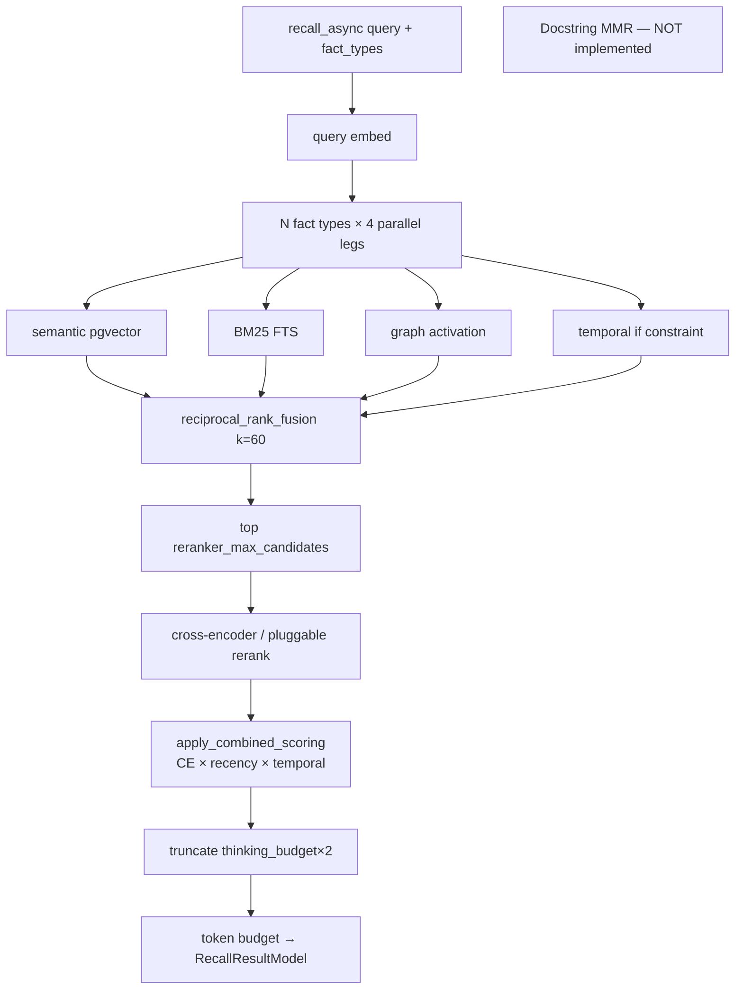
```mermaid
flowchart TB
  Q[recall_async query + fact_types] --> E[query embed]
  E --> P[N fact types × 4 parallel legs]
  P --> S[semantic pgvector]
  P --> B[BM25 FTS]
  P --> G[graph activation]
  P --> T[temporal if constraint]
  S --> RRF[reciprocal_rank_fusion k=60]
  B --> RRF
  G --> RRF
  T --> RRF
  RRF --> PF[top reranker_max_candidates]
  PF --> CE[cross-encoder / pluggable rerank]
  CE --> CS[apply_combined_scoring<br/>CE × recency × temporal]
  CS --> TR[truncate thinking_budget×2]
  TR --> TOK[token budget → RecallResultModel]
  note1[Docstring MMR — NOT implemented]
```

### 2.7 `honcho`

**Repo:** `D:\mem\honcho` @ `7470866d12845ed4b56bf3449d058e65df96b1c1` (v3.0.7)  
**Prior:** `docs/ARCHITECTURE_FLOWS.md` §3.5 · `docs/ECOSYSTEM_COMPARISON.md` (honcho capsule) — extended, not contradicted.

## Mental model

Honcho is a **server-first session memory** product: peers exchange messages in sessions; a background **deriver** extracts **explicit** atomic observations into per-(observer, observed) **collections**; a delayed **dreamer** runs agentic specialists that write higher **document levels** (deductive / inductive / contradiction) and maintain a **peer card**; a **dialectic** agent answers questions by tool-calling over observations + messages. Vectors are projectors (pgvector default); Postgres `Message` rows are the conversational source of truth.

## Source of truth

| Layer | Store | Role |
|-------|-------|------|
| Messages | Postgres `Message` (+ optional `MessageEmbedding`) | Append-only conversation SoT |
| Observations | Postgres `Document` (`level` ∈ explicit/deductive/inductive/contradiction) | Derived memory; soft-delete via `deleted_at` |
| Peer card | Collection / peer metadata (CRUD `get_peer_card` / `update_peer_card`) | Stable identity markers (not a DocumentLevel) |
| Vectors | **pgvector** default; LanceDB / Turbopuffer optional (`VECTOR_STORE.TYPE`) | Rebuildable / syncable projectors |
| Work queue | Postgres `QueueItem` | Deriver/dream/summary/deletion/webhook/reconciler tasks |

Agree with ARCHITECTURE_FLOWS: “PostgreSQL `Message` rows; vectors in pgvector default.”

## Write path (cite file:symbol)

1. **API ingest** — `routers/messages.py:create_messages_for_session` → `crud/message.py:create_messages`
   - Advisory lock on `(workspace, session)`; assign `seq_in_session`; commit messages.
   - If `EMBED_MESSAGES`: `embedding_client.batch_embed` → `MessageEmbedding` (+ external vector upsert when not pgvector-only).
2. **Enqueue** — FastAPI `BackgroundTasks` → `deriver/enqueue.py:enqueue`
   - Cancels pending dreams for affected `observed` peers (`DreamScheduler.cancel_dreams_for_observed`).
   - `handle_session` / `generate_queue_records` → insert `QueueItem` rows (`representation`, optional `summary`).
3. **Deriver worker** — `deriver/queue_manager.py:QueueManager` polls → batches by work-unit + token cap (`REPRESENTATION_BATCH_MAX_TOKENS`, default 1024) → `consumer.process_representation_batch` → `deriver.py:process_representation_tasks_batch`
   - Builds `minimal_deriver_prompt` → `honcho_llm_call(..., response_model=PromptRepresentation)` → `Representation.from_prompt_representation` (**explicit only**).
   - `crud/representation.py:RepresentationManager.save_representation` → documents (+ optional cosine dedup) → `check_and_schedule_dream`.

## Update / conflict / patch path

| Mechanism | Where | Behavior |
|-----------|-------|----------|
| Knowledge updates | Dreamer `DeductionSpecialist` | Creates deductive “update” observations; **deletes** outdated docs via tools |
| Contradictions | Dreamer + dialectic tools | `level=contradiction` docs with ≥2 `source_ids` |
| Cosine dedup (write) | `crud/document.py:is_rejected_duplicate` when `DERIVER.DEDUPLICATE=True` | Cosine distance ≤ 0.05 (~≥0.95 sim); token-set score decides keep/reject; soft-deletes inferior existing |
| Peer card patch | `update_peer_card` tool | Full-list replace; prefix validation (`IDENTITY:` / `ATTRIBUTE:` / `RELATIONSHIP:` / `INSTRUCTION:`) |
| Dialectic novel deductions | `create_observations_deductive` | Optional write during chat |

No general “patch memory by id” API on the hot write path — updates are agentic delete+create or soft-delete.

## Delete / forget / erasure

- **Soft-delete documents** — set `Document.deleted_at`; reconciler `cleanup_soft_deleted_documents` removes vectors + hard-deletes.
- **Queue deletion tasks** — `consumer.process_deletion` / `enqueue_deletion` for session / observation / workspace scopes (`utils/queue_payload.py:DeletionPayload`).
- **Dream cancel on activity** — new messages cancel pending dream timers for that observed peer.

## Retrieve / rank / assemble

| Surface | Entry | Ranking |
|---------|-------|---------|
| Message hybrid search | `utils/search.py:search` | Semantic (pgvector / external) + Postgres FTS/ILIKE → **RRF** (`k=60`) when both legs present |
| Observation search | `crud/document.py:query_documents` / agent `search_memory` | **Semantic only** (cosine); optional `max_distance`, level filters |
| Dialectic | `dialectic/core.py:DialecticAgent` | Tool loop: `search_memory`, `search_messages`, grep, reasoning chains, etc. → LLM synthesis |
| Context / peer chat | Session context + `Peer.chat` (SDK) | Assembles working representation + dialectic |

**Note:** RRF is on **messages**, not observation documents. Observation retrieval is pure vector similarity.

## Background / sleep / consolidate / decay

| Job | Entry | Trigger |
|-----|-------|---------|
| Deriver (explicit extract) | `queue_manager` → `process_representation_tasks_batch` | Message enqueue |
| Summary | `utils/summarizer.py` via queue `summary` | Session message thresholds |
| Dream schedule | `dream_scheduler.check_and_schedule_dream` | After save: explicit doc count Δ ≥ `DREAM.DOCUMENT_THRESHOLD` (50), ≥ `MIN_HOURS_BETWEEN_DREAMS` (8h), then delay `IDLE_TIMEOUT_MINUTES` (60) |
| Dream run | `dreamer/orchestrator.py:run_dream` | Queue `dream` → optional surprisal hints → **deduction** then **induction** specialists |
| Reconciler | `consumer.process_reconciler` | Vector sync / stale queue cleanup |

No Ebbinghaus / ACT-R decay on read. Consolidation = dreamer specialists, not typed episodic→semantic.

## Claims vs code

| Claim (prior docs) | Verdict | Evidence |
|--------------------|---------|----------|
| SoT = Postgres messages; pgvector default | **agree** | `create_messages`, `VECTOR_STORE` / `EMBED_MESSAGES` |
| RRF hybrid search implemented | **agree** | `utils/search.py:reciprocal_rank_fusion` + `search` |
| Deriver → observations; dreamer specialists | **agree** | `deriver.py`, `dreamer/specialists.py` |
| Optional post-deriver cosine dedup | **agree** | `DERIVER.DEDUPLICATE` + `is_rejected_duplicate` |
| 4 document levels | **agree** | `utils/types.py:DocumentLevel` |
| ~8 inline prompts | **agree** (extended) | deriver 1 + dialectic 1 + dreamer 4–6 variants + summarizer 2 → **10** catalogued |
| JWT when `AUTH_USE_AUTH` | **opaque here** | Not re-traced this pass; prior capsule OK |
| MCP server shipped | **agree** (layout) | `mcp/` present; not deep-traced |
| RRF needs embeddings | **agree** | Semantic leg gated on `EMBED_MESSAGES`; FTS-only if embed off |

#### Write flow
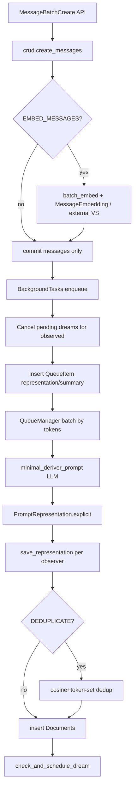
```mermaid
flowchart TD
  A[MessageBatchCreate API] --> B[crud.create_messages]
  B --> C{EMBED_MESSAGES?}
  C -->|yes| D[batch_embed + MessageEmbedding / external VS]
  C -->|no| E[commit messages only]
  D --> E
  E --> F[BackgroundTasks enqueue]
  F --> G[Cancel pending dreams for observed]
  G --> H[Insert QueueItem representation/summary]
  H --> I[QueueManager batch by tokens]
  I --> J[minimal_deriver_prompt LLM]
  J --> K[PromptRepresentation.explicit]
  K --> L[save_representation per observer]
  L --> M{DEDUPLICATE?}
  M -->|yes| N[cosine+token-set dedup]
  M -->|no| O[insert Documents]
  N --> O
  O --> P[check_and_schedule_dream]
```

#### Retrieve flow
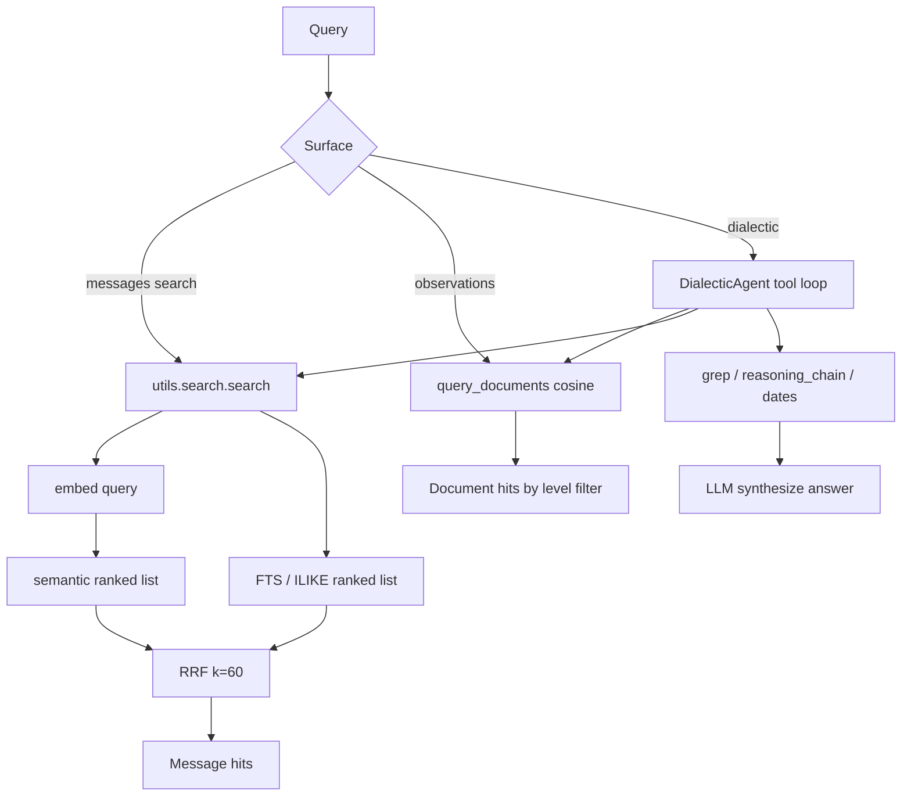
```mermaid
flowchart TD
  Q[Query] --> R{Surface}
  R -->|messages search| S[utils.search.search]
  S --> T[embed query]
  T --> U[semantic ranked list]
  S --> V[FTS / ILIKE ranked list]
  U --> W[RRF k=60]
  V --> W
  W --> X[Message hits]
  R -->|observations| Y[query_documents cosine]
  Y --> Z[Document hits by level filter]
  R -->|dialectic| AA[DialecticAgent tool loop]
  AA --> Y
  AA --> S
  AA --> AB[grep / reasoning_chain / dates]
  AB --> AC[LLM synthesize answer]
```

### 2.8 `langmem`

**Repo:** `D:\mem\langmem` · **SHA:** `dc1f1e1525f0877458730c6e8088c235e017c873` · **Air-gap:** local files only  
**Prior capsules:** `docs/ARCHITECTURE_FLOWS.md` §3.13 · `docs/ECOSYSTEM_COMPARISON.md` (LG / langmem) — extended, not contradicted without citation.

## Mental model

langmem is a **LangChain/LangGraph SDK glue layer**, not a cognitive-memory engine. It exposes:

1. **Hot-path tools** — agent-invoked CRUD + search against a caller-supplied `BaseStore`.
2. **Background / automated managers** — LLM + **trustcall** extractors that search existing store items, propose inserts/updates/deletes, then `put`/`delete`.
3. **Prompt optimizers** — separate subsystem that rewrites system prompts from trajectories (procedural “memory” as prompt text).
4. **Short-term summarization** — token-budget message compression for the active thread (not long-term SoT).

There is no event log, no projector rebuild, no firewall, no hybrid lexical+vector fusion inside langmem. Persistence, embedding, and ANN ranking are **entirely delegated** to LangGraph `BaseStore`.

## Source of truth

**Caller-owned LangGraph `BaseStore`** (docs/README: InMemoryStore for demos; AsyncPostgresStore / LangGraph Platform store in production).

- Hot-path tool writes: `value={"content": ...}` (`knowledge/tools.py:manage_memory`).
- Store-manager writes: `value={"kind": <schema_name>, "content": <dict>}` (`knowledge/extraction.py:MemoryStoreManager`).
- No `memory_events` / WAL / rebuild API in this repo.

## Write path (cite file:symbol)

**Path A — hot path (agent tool, 0 LLM inside langmem):**

1. Host agent binds `create_manage_memory_tool` (`knowledge/tools.py:create_manage_memory_tool`).
2. LLM (host) chooses `action` ∈ {create, update, delete} + optional `content` / `id`.
3. Tool resolves namespace via `utils.NamespaceTemplate` → `store.put` / `store.delete` (`tools.py:manage_memory` / `amanage_memory`).

**Path B — automated store manager (trustcall):**

1. `create_memory_store_manager` → `MemoryStoreManager.ainvoke` (`knowledge/extraction.py:MemoryStoreManager.ainvoke`).
2. Recall candidates: either `query_model.bind_tools(search_tool)` parallel searches, or `utils.get_dialated_windows` → `store.asearch` per window.
3. `_sort_results` keeps top `query_limit` by store `score`.
4. `create_memory_manager` / `MemoryManager` runs trustcall `create_extractor` with schemas + optional multi-step `Done` tool.
5. `_apply_manager_output` merges inserts/patches/`RemoveDoc` → `store.aput` / `store.adelete`.

**Path C — stateless extract (no persist):**

- `create_memory_manager` → `MemoryManager` returns `list[ExtractedMemory]` only (`extraction.py:create_memory_manager`).

## Update / conflict / patch path

- **Hot path:** explicit `action="update"` with memory `id` → overwrite `put` (no merge logic).
- **Manager path:** trustcall patch tools + `enable_updates` / `enable_deletes`; `RemoveDoc` deletes store keys present in the recalled set. Dedup/consolidation is **prompt-instructed** (`_MEMORY_INSTRUCTIONS`), not algorithmic similarity.
- **Conflict resolution:** opaque inside trustcall + LLM judgment; no cosine/MinHash gate in langmem.

## Delete / forget / erasure

- Tool: `action="delete"` → `store.delete(namespace, key)` (`tools.py`).
- Manager: `RemoveDoc` / `enable_deletes` → `adelete` for recalled external IDs (`MemoryStoreManager._apply_manager_output`).
- No soft-delete, tombstone, GDPR export, or decay schedule.

## Retrieve / rank / assemble

- `create_search_memory_tool` → `store.search` / `asearch` (`tools.py:create_search_memory_tool`); returns JSON-serialized items (optional artifact).
- `create_memory_searcher`: LLM generates `search_memory` tool calls → batch search → sort by `item.score` descending (`extraction.py:create_memory_searcher`).
- `MemoryStoreManager.search` / `asearch`: thin wrappers over store + optional `default` / `default_factory` synthetic item.
- **No RRF, BM25, cross-encoder, or context assembler** in-repo. Host injects memories into the agent system prompt (README / docs examples).

## Background / sleep / consolidate / decay

- **`ReflectionExecutor`** (`reflection.py`): local priority queue with `after_seconds` debounce (cancel prior task per `thread_id`) or remote LangGraph Platform run; invokes a reflector runnable (typically `MemoryStoreManager`).
- **Short-term:** `summarize_messages` / `SummarizationNode` (`short_term/summarization.py`) — token-threshold running summary; not LTM consolidation.
- **Prompt “procedural” learning:** `create_prompt_optimizer` / `create_multi_prompt_optimizer` (`prompts/optimization.py`) — offline/online prompt rewrite, not store consolidation.
- **No Ebbinghaus / ACT-R / sleep cycle / community detection.**

## Claims vs code (agree | diverge | opaque)

| Claim (docs / prior memspine capsule) | Verdict | Evidence |
|---------------------------------------|---------|----------|
| Dual write: manage tool + store manager | **agree** | `tools.py:create_manage_memory_tool`; `extraction.py:create_memory_store_manager` |
| SoT = LangGraph BaseStore | **agree** | README; all put/search paths |
| trustcall on manager path only | **agree** | hot path has no trustcall import; manager uses `create_extractor` |
| Semantic / episodic / procedural types | **diverge** | Conceptual guide taxonomy; code stores schema-named blobs — types are prompt/schema conventions, not engine enums |
| “Versioned history of all changes” (store manager docstring) | **diverge** | Only current `put`/`delete`; no history table |
| Importance + strength recall | **diverge** | Conceptual guide; code sorts store `score` only |
| Graph RAG / entity graph | **diverge / dead** | `graph_rag.py` fully commented; no live graph API |
| SDK glue; no engine governance | **agree** | Matches ARCHITECTURE_FLOWS §3.13 delta |
| trustcall patch semantics | **opaque** | External package; langmem consumes `json_doc_id` / `RemoveDoc` |
| Store embedding / ANN quality | **opaque** | Host `index={"embed": ...}` config |

#### Write flow
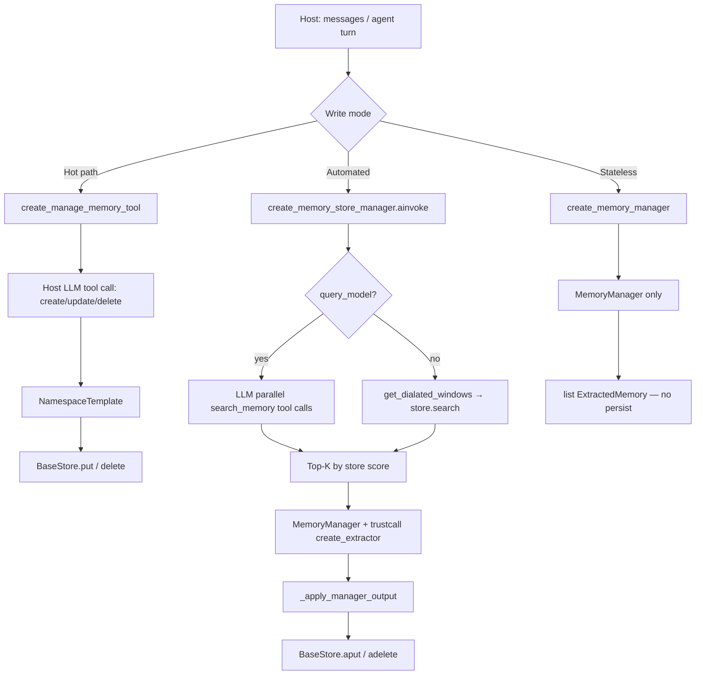
```mermaid
flowchart TD
  A[Host: messages / agent turn] --> B{Write mode}
  B -->|Hot path| C[create_manage_memory_tool]
  C --> D[Host LLM tool call: create/update/delete]
  D --> E[NamespaceTemplate]
  E --> F[BaseStore.put / delete]
  B -->|Automated| G[create_memory_store_manager.ainvoke]
  G --> H{query_model?}
  H -->|yes| I[LLM parallel search_memory tool calls]
  H -->|no| J[get_dialated_windows → store.search]
  I --> K[Top-K by store score]
  J --> K
  K --> L[MemoryManager + trustcall create_extractor]
  L --> M[_apply_manager_output]
  M --> N[BaseStore.aput / adelete]
  B -->|Stateless| O[create_memory_manager]
  O --> L2[MemoryManager only]
  L2 --> P[list ExtractedMemory — no persist]
```

#### Retrieve flow
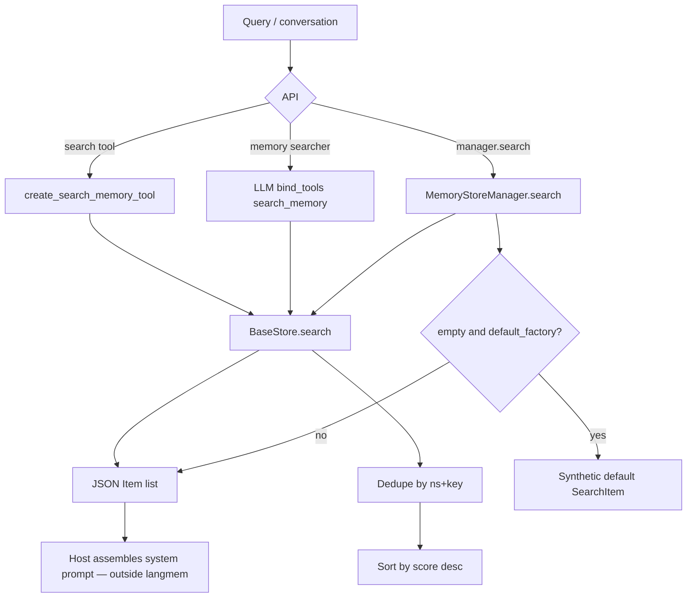
```mermaid
flowchart TD
  Q[Query / conversation] --> R{API}
  R -->|search tool| S[create_search_memory_tool]
  S --> T[BaseStore.search]
  T --> U[JSON Item list]
  R -->|memory searcher| V[LLM bind_tools search_memory]
  V --> T
  T --> W[Dedupe by ns+key]
  W --> X[Sort by score desc]
  R -->|manager.search| Y[MemoryStoreManager.search]
  Y --> T
  Y --> Z{empty and default_factory?}
  Z -->|yes| AA[Synthetic default SearchItem]
  Z -->|no| U
  U --> AB[Host assembles system prompt — outside langmem]
```

### 2.9 `LightMem`

**Repo:** `D:\mem\LightMem` · **SHA:** `4a9f1d6243fa09a11506f06b83ac1c74b5c87451` · **Air-gap:** local files only  
**Prior capsules:** `docs/ARCHITECTURE_FLOWS.md` §3.9 · `docs/ECOSYSTEM_COMPARISON.md` LightMem capsule — extended below; no contradictions without citation.

## Mental model

LightMem is a **research monorepo** of memory methods, not a single production engine:

| Package | Role |
|---------|------|
| `lightmem` | Primary facade **`LightMemory`**: compress → topic-segment → LLM extract → Qdrant index → offline conflict update / summarize |
| `fluxmem` | Optional `[fluxmem]` graph-evolution agent: semantic / episodic / procedural nodes + 3-stage connectivity pipeline |
| `em2mem` | Multimodal / EgoLife track (separate facade; out of primary LightMem write path) |
| `memory_toolkits` | Ablation baselines (vendored mem0 / langmem / A-mem) + eval prompts |

Cognitive metaphor for core LightMem: **sensory buffer** (token-capped message window) → **short-term segment buffer** → **long-term fact vectors in Qdrant**, with optional LLMLingua/entropy pre-compression and batch offline reconcile.

## Source of truth

- **Core LightMem:** Qdrant collection of `MemoryEntry` payloads (vector + metadata). Optional second collection via `summary_retriever` for cross-event summaries. Context/hybrid path can also dump `memory_entries.json` (`save_memory_entries`) — file is a side dump, not a rebuildable event log.
- **FluxMem:** In-process `MemoryGraph` (dicts of nodes/edges) + FAISS vector stores for semantic/episodic; BM25 index rebuilt in `SemanticRetriever`. No durable SoT unless caller persists.
- **Not SoT:** LLM prompts, sensory/short buffers, empty `GraphMem` stub, empty BM25 context-retriever module.

## Write path (cite file:symbol)

1. `LightMemory.add_memory` (`lightmem/memory/lightmem.py:add_memory`)
2. `MessageNormalizer.normalize_messages` — session timestamps → per-message ISO stamps
3. Optional `PreCompressorFactory` → `LlmLingua2Compressor.compress` or `EntropyCompressor.compress`
4. If `topic_segment=False`: early return of emitted messages only (no extract/index)
5. `SenMemBufferManager.add_messages` + topic `segmenter.propose_cut` → segments
6. `ShortMemBufferManager.add_segments` — triggers extraction batches
7. `MemoryManagerFactory` manager `.meta_text_extract` with `EXTRACTION_PROMPTS` / custom prompts
8. `convert_extraction_results_to_memory_entries` → `MemoryEntry` list
9. `config.update == "offline"` → `offline_update` → `text_embedder.embed` + `embedding_retriever.insert` (Qdrant)
10. `config.update == "online"` → `online_update` (**stub: returns `None`**)

FluxMem knowledge write: `FluxMemAgent.add_knowledge` / `add_knowledge_nodes` → `SemanticNode` + FAISS + BM25 rebuild. Task write: `run_task` → `EpisodicNode` + `GroundEdge`.

## Update / conflict / patch path

1. After indexing, caller may set `construct_update_queue_trigger` / `offline_update_trigger` on `offline_update`, or call:
2. `construct_update_queue_all_entries` — for each entry, Qdrant k-NN among **earlier** timestamps (`float_time_stamp lte`), keep top-n in `payload.update_queue`
3. `offline_update_all_entries` — invert queues: entries that appear as high-score candidates become “sources”; target calls `manager._call_update_llm(UPDATE_PROMPT, …)`
4. Actions: `update` (rewrite `memory` text, keep vector), `delete` (`embedding_retriever.delete`), `ignore`

No online incremental patch API. No event-sourced conflict log.

## Delete / forget / erasure

- Conflict path: `action == "delete"` in `offline_update_all_entries`
- Direct: Qdrant `embedding_retriever.delete` / `delete_col` (factory API)
- No TTL / Ebbinghaus decay / GDPR-style forget API on `LightMemory`
- FluxMem: prune StepLink edges / orphan nodes in Stage II; no global forget

## Retrieve / rank / assemble

**Core:** `LightMemory.retrieve` → embed query → `embedding_retriever.search` (Qdrant cosine k-NN) → optional BoundMem tag filter → format `"timestamp weekday memory"` strings. No RRF on the hot path. Context/hybrid retriever config exists, but `factory/retriever/contextretriever/bm25.py` is an **empty stub**; hybrid does not fuse BM25 in core.

**FluxMem Stage I:** hybrid semantic score  
`Score = w_d·norm(cos) + w_b·norm(BM25) + w_l·norm(LLM_verify)`  
+ episodic cosine TopK + procedural inheritance via `DistillEdge` → `Subgraph.to_context_string`.

Eval QA prompts live in `memory_toolkits/inference_utils/prompts.py` (not wired into `LightMemory.retrieve`).

## Background / sleep / consolidate / decay

| Mechanism | Where | Notes |
|-----------|-------|-------|
| Offline update queue + LLM reconcile | `construct_update_queue_all_entries` / `offline_update_all_entries` | Batch, threaded; not a sleep scheduler |
| Cross-event summarize | `LightMemory.summarize` + `LoCoMo_Cross_Event_Consolidation` | Time-window buffer; marks `consolidated=True`; stores summary vectors |
| FluxMem Stage III | `FluxMemAgent.consolidate` → cluster episodes → `extract_skills` → PEMS loop | Offline / periodic by caller |
| Decay / Ebbinghaus | — | **Absent** in core and FluxMem |

## Claims vs code

| Claim (README / prior docs) | Verdict | Evidence |
|----------------------------|---------|----------|
| Compress → segment → extract → Qdrant | **agree** | `add_memory` + `offline_update` |
| Facade `LightMemory` | **agree** | class name (not `LightMem`) |
| LLMLingua pinned | **agree** | `llmlingua==0.2.2` in `pyproject.toml`; `LlmLingua2Compressor` |
| FluxMem 3-stage + 3 node types | **agree** | `fluxmem/agent.py`, `graph/nodes.py` |
| Online update | **diverge** | `online_update` returns `None` |
| Graph memory in LightMem core | **diverge / opaque** | `GraphMem` class body empty (`memory/graph.py`) |
| BM25 / hybrid context retrieve | **diverge** | `bm25.py` empty; FluxMem has real BM25 |
| Lightweight / minimal deps | **diverge** | `torch==2.8.0`, transformers, ST in **core** deps |
| 0 pytest CI suite | **agree** | no project pytest under `tests/`; only VLM2Vec adhoc scripts |
| License MIT (README badge) vs Apache-2.0 (`pyproject`) | **diverge** | badge vs `license = {text = "Apache-2.0"}` |
| memspine E5 llmlingua validation | **agree** (ecosystem) | LightMem uses LLMLingua on **write pre-compress**; memspine `[compress]` is assembly-time |

#### Write flow
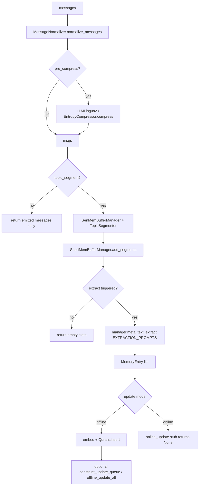
```mermaid
flowchart TD
  A[messages] --> B[MessageNormalizer.normalize_messages]
  B --> C{pre_compress?}
  C -->|yes| D[LLMLingua2 / EntropyCompressor.compress]
  C -->|no| E[msgs]
  D --> E
  E --> F{topic_segment?}
  F -->|no| G[return emitted messages only]
  F -->|yes| H[SenMemBufferManager + TopicSegmenter]
  H --> I[ShortMemBufferManager.add_segments]
  I --> J{extract triggered?}
  J -->|no| K[return empty stats]
  J -->|yes| L[manager.meta_text_extract EXTRACTION_PROMPTS]
  L --> M[MemoryEntry list]
  M --> N{update mode}
  N -->|offline| O[embed + Qdrant.insert]
  N -->|online| P[online_update stub returns None]
  O --> Q[optional construct_update_queue / offline_update_all]
```

#### Retrieve flow
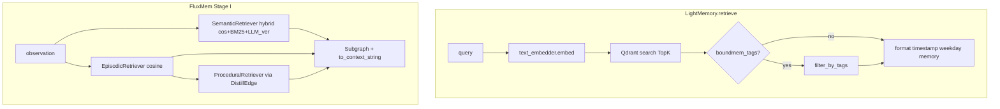
```mermaid
flowchart TD
  subgraph core [LightMemory.retrieve]
    Q[query] --> E[text_embedder.embed]
    E --> S[Qdrant search TopK]
    S --> T{boundmem_tags?}
    T -->|yes| F[filter_by_tags]
    T -->|no| R[format timestamp weekday memory]
    F --> R
  end
  subgraph flux [FluxMem Stage I]
    O[observation] --> H[SemanticRetriever hybrid cos+BM25+LLM_ver]
    O --> EP[EpisodicRetriever cosine]
    EP --> PR[ProceduralRetriever via DistillEdge]
    H --> SG[Subgraph + to_context_string]
    EP --> SG
    PR --> SG
  end
```

### 2.10 `mem0`

**Repo:** `D:\mem\mem0` @ `16a7702d09dd48a9dfbb530a0fa2a51511c7bf26`  
**Package:** `mem0ai` 2.0.2 · Facade: `mem0.Memory` / `AsyncMemory`  
**Prior:** `docs/ARCHITECTURE_FLOWS.md` §3.3; `docs/ECOSYSTEM_COMPARISON.md` mem0 capsule — extended below; contradictions cited.

## Mental model

mem0 OSS is a **vector-primary flat memory CRUD SDK**. Conversations enter via `Memory.add`; with `infer=True` (default) a single LLM call extracts **ADD-only** factual memories (`ADDITIVE_EXTRACTION_PROMPT`), which are MD5-hash-deduped, embedded, and upserted into a pluggable vector store (default **Qdrant**). A sibling **entity collection** (`{collection}_entities`) stores spaCy-extracted entities for search-time boosts. SQLite holds an append-ish **history** audit log and recent **messages** for session context — not the source of truth for memory content.

Search is **hybrid additive fusion**: dense semantic k-NN + optional BM25/keyword leg + entity boost, then optional pluggable reranker. There is **no** OSS consolidation sleep, conflict ladder, or graph DB.

Hosted `MemoryClient` adds Platform features (e.g. project-level `decay`) that are **not** in the OSS `Memory` class.

## Source of truth

| Store | Role | Evidence |
|-------|------|----------|
| `vector_store` payloads (`data`, `hash`, `text_lemmatized`, session ids, …) | **Primary SoT** for memory text | `Memory._add_to_vector_store` → `vector_store.insert` |
| `entity_store` (`{collection}_entities`) | Secondary projector for NER entities → `linked_memory_ids` | `Memory.entity_store` property; Phase 7 batch link |
| SQLite `history` | Audit of ADD/UPDATE/DELETE events | `mem0/memory/storage.py:SQLiteManager` |
| SQLite `messages` | Last-k session context for extraction | `db.get_last_messages` / `save_messages` |

**Agree** with ARCHITECTURE_FLOWS §3.3 (“Vector store payloads; SQLite history audit adjunct”).

## Write path (cite file:symbol)

1. `mem0/memory/main.py:Memory.add` — validate filters/metadata; optional procedural branch; vision parse.
2. `Memory._add_to_vector_store` — if `infer=False`: raw message → embed → `_create_memory` (event ADD).
3. **V3 phased pipeline** (`infer=True`):
   - **P0** `db.get_last_messages(session_scope, limit=10)` + `parse_messages`
   - **P1** embed query → `vector_store.search(..., top_k=10)` → integer-id map for LLM
   - **P2** `ADDITIVE_EXTRACTION_PROMPT` (+ optional `AGENT_CONTEXT_SUFFIX`) + `generate_additive_extraction_prompt` → `llm.generate_response` JSON `{"memory":[...]}`
   - **P3** `embed_batch` on extracted texts
   - **P4–5** MD5 hash dedup vs existing + within-batch; `lemmatize_for_bm25`
   - **P6** `vector_store.insert` + `db.batch_add_history` (event ADD)
   - **P7** `extract_entities_batch` → entity embed/search (≥0.95 match update else insert)
   - **P8** `db.save_messages`; return `[{id, memory, event: "ADD"}]`

Procedural: `Memory._create_procedural_memory` with `PROCEDURAL_MEMORY_SYSTEM_PROMPT` when `memory_type=procedural_memory` + `agent_id`.

## Update / conflict / patch path

| Path | Behavior | Hot? |
|------|----------|------|
| Explicit `Memory.update(memory_id, data)` | Re-embed; `vector_store.update`; history UPDATE; refresh entities | **yes** (API) |
| Explicit `Memory.delete` / `delete_all` | Vector delete + entity unlink + history DELETE | **yes** (API) |
| Infer-time ADD/UPDATE/DELETE/NONE | **Removed from OSS hot path** | **dead** for `add(infer=True)` |
| `DEFAULT_UPDATE_MEMORY_PROMPT` / `get_update_memory_messages` | Still in `configs/prompts.py`; unit-tested only | **reserved/dead** |

**Diverge** vs older docs / `Memory.add` docstring (“decide whether to add, update, or delete”) — code is ADD-only extract + hash skip. **Agree** with ECOSYSTEM_COMPARISON (“SDK v3 ADD-only infer”).

No semantic conflict ladder: contradictions are not resolved by UPDATE/DELETE on infer; new ADDs may coexist with older facts unless the caller uses explicit `update`/`delete`.

## Delete / forget / erasure

- `Memory.delete(memory_id)` → `_delete_memory` → vector delete, history DELETE, `_remove_memory_from_entity_store`
- `Memory.delete_all(user_id|agent_id|run_id)` — filtered list then per-id delete
- `Memory.reset()` — wipe vector + entity collections + history (destructive)
- No soft-forget / GDPR erasure policy beyond hard delete; no decay in OSS

## Retrieve / rank / assemble

1. `Memory.search(query, top_k, filters, threshold, rerank)`
2. `_search_vector_store`:
   - lemmatize query; `extract_entities(query)`
   - dense `vector_store.search` (over-fetch `max(top_k*4, 60)`)
   - `vector_store.keyword_search` (BM25 if implemented; else `None`)
   - `normalize_bm25` + `get_bm25_params` (query-length adaptive sigmoid)
   - `_compute_entity_boosts` (entity store sim ≥ 0.5; spread-attenuated; cap weight 0.5)
   - `score_and_rank` additive fusion with semantic threshold gate
3. Optional `reranker.rerank` if `rerank=True` and configured
4. Return `{results: MemoryItem[]}` — **no** LLM answer assembly in `Memory.search`

Answer assembly lives in `mem0/proxy/main.py` (`MEMORY_ANSWER_PROMPT` for chat proxy) and evaluation harness prompts — not the core search API.

## Background / sleep / consolidate / decay

- **None** in OSS `Memory` — all infer/entity work is inline on `add`/`search`.
- Platform `MemoryClient` / `client/project.py` exposes `decay` project flag — **opaque** to OSS ranking.
- No dream/consolidate/community workers in `mem0/` package.

**Agree** with ARCHITECTURE_FLOWS (“Background: None”).

## Claims vs code

| Claim | Verdict | Citation |
|-------|---------|----------|
| Vector-primary SoT + SQLite history | **agree** | `main.py`, `storage.py` |
| v3 ADD-only infer | **agree** | `_add_to_vector_store` P2 uses `ADDITIVE_EXTRACTION_PROMPT` only |
| Hybrid BM25+semantic+entity | **agree** (store-dependent BM25) | `_search_vector_store`, `utils/scoring.py` |
| Neo4j/graph removed from OSS | **agree** | no graph factory in OSS; entity = vector collection |
| 24 vector backends | **agree** | `VectorStoreFactory.provider_to_class` (24 keys) |
| Infer does UPDATE/DELETE | **diverge** | docstring vs code; UPDATE prompt unused |
| LLM `linked_memory_ids` build a memory graph | **diverge/opaque** | prompt requires links; write path ignores LLM field; entity links only |
| Memory types semantic/episodic/procedural | **opaque/partial** | enum has 3; only `procedural_memory` accepted on add |
| OSS decay | **diverge** vs Platform marketing | decay only on `MemoryClient` project API |
| `add` docstring “add, update, or delete” | **diverge** | stale vs v3 pipeline |

#### Write flow
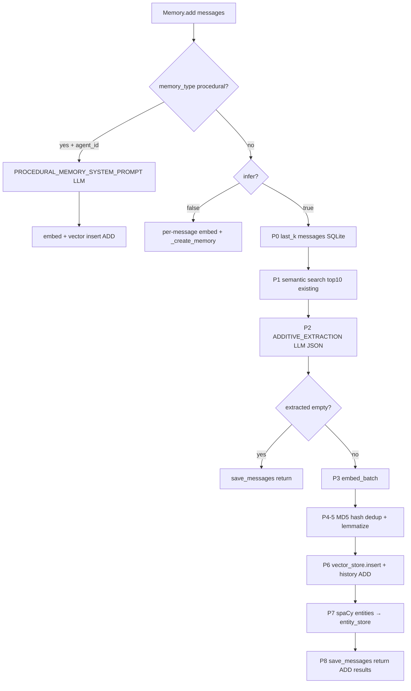
```mermaid
flowchart TD
  A[Memory.add messages] --> B{memory_type procedural?}
  B -->|yes + agent_id| P[PROCEDURAL_MEMORY_SYSTEM_PROMPT LLM]
  P --> P2[embed + vector insert ADD]
  B -->|no| C{infer?}
  C -->|false| D[per-message embed + _create_memory]
  C -->|true| E[P0 last_k messages SQLite]
  E --> F[P1 semantic search top10 existing]
  F --> G[P2 ADDITIVE_EXTRACTION LLM JSON]
  G --> H{extracted empty?}
  H -->|yes| I[save_messages return]
  H -->|no| J[P3 embed_batch]
  J --> K[P4-5 MD5 hash dedup + lemmatize]
  K --> L[P6 vector_store.insert + history ADD]
  L --> M[P7 spaCy entities → entity_store]
  M --> N[P8 save_messages return ADD results]
```

#### Retrieve flow
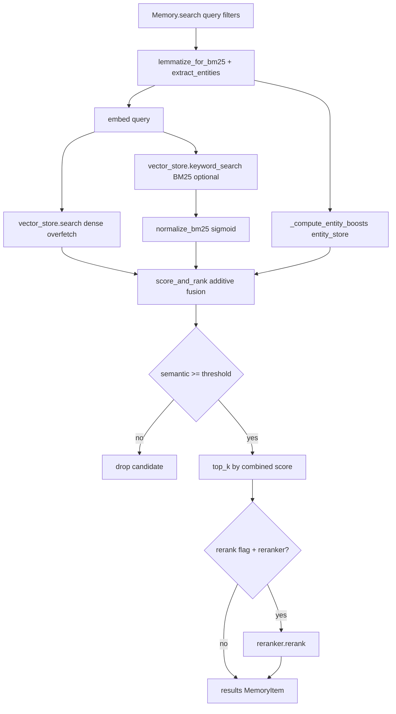
```mermaid
flowchart TD
  S[Memory.search query filters] --> L[lemmatize_for_bm25 + extract_entities]
  L --> E[embed query]
  E --> V[vector_store.search dense overfetch]
  E --> K[vector_store.keyword_search BM25 optional]
  K --> N[normalize_bm25 sigmoid]
  L --> EB[_compute_entity_boosts entity_store]
  V --> R[score_and_rank additive fusion]
  N --> R
  EB --> R
  R --> T{semantic >= threshold}
  T -->|no| Drop[drop candidate]
  T -->|yes| Top[top_k by combined score]
  Top --> RR{rerank flag + reranker?}
  RR -->|yes| R2[reranker.rerank]
  RR -->|no| Out[results MemoryItem]
  R2 --> Out
```

### 2.11 `MemMachine`

**Repo:** `D:\mem\MemMachine` @ `a1ab26e07ea47da99cc9bf5004db99dfbe4a7ea6`  
**Package:** `memmachine-server` (uv workspace with `memmachine-common`, `memmachine-client`)  
**Facade:** `memmachine_server.main.memmachine.MemMachine`  
**Prior:** `docs/ARCHITECTURE_FLOWS.md` §3.12; `docs/ECOSYSTEM_COMPARISON.md` MemMachine capsules — extended below; contradictions cited.

## Mental model

MemMachine is a **dual-memory server**: conversation turns land as **`EpisodeEntry[]`** in a SQL **episode store** (write anchor), then fan out in parallel to:

1. **Episodic** — session **STM** (capacity-bounded deque + LLM rolling summary) and **LTM** (default **declarative** Neo4j/vector-graph with derivative nodes + pluggable **Reranker**, often **RRFHybridReranker**; alternate **event** backend with segmenter/deriver + vector/segment stores).
2. **Semantic** — profile-style **tag/feature/value** features per `set_id`, updated by a **background ingestion** loop that LLM-extracts add/delete commands and optionally consolidates.

Read path runs **parallel** episodic + semantic search. Optional **`agent_mode`** wraps episodic LTM with a retrieval-agent router (tool-select → CoQ / split-query / direct). Surface: FastAPI + **FastMCP**. Closest memspine cousin on episode-log shape; **no** event-sourced projector `rebuild()`, **no** Memory Firewall, **two** API memory types only.

## Source of truth

| Store | Role | Evidence |
|-------|------|----------|
| SQL `episodestore` (`EpisodeStorage` / `episode_sqlalchemy_store`) | **Write-anchor SoT** for raw episodes | `MemMachine.add_episodes` → `episode_storage.add_episodes` |
| Declarative LTM graph (Neo4j / vector-graph) episode + derivative nodes | Episodic LTM projector | `DeclarativeMemory.add_episodes` |
| Event LTM: `VectorStore` + `SegmentStore` | Alternate episodic LTM | `LongTermMemory` event backend |
| Semantic feature storage (pgvector / neo4j / vector adapters) | Semantic projector | `SemanticStorage` + `IngestionService` |
| STM deque + session summary (SessionDataManager) | Working context, not durable SoT | `ShortTermMemory` |
| `sqlite_vector_store` pending-ops table | **Crash replay for USearch index**, not episode rebuild | `sqlite_vector_store._replay_pending_operations` |

**Agree** with ARCHITECTURE_FLOWS §3.12 (“SQL episode storage (write anchor) + Neo4j episodic + semantic/pgvector”).  
**Agree** with ECOSYSTEM_COMPARISON GAPS note: WAL replay ≠ event-log rebuild; USearch not sqlite-vec as SoT.

## Write path (cite file:symbol)

1. `MemMachine.add_episodes(session_data, episode_entries, target_memories=ALL)`  
2. `episode_storage.add_episodes(session_key, episode_entries)` → durable `Episode[]` + ids.  
3. Parallel (`asyncio.gather`):
   - **Episodic** (if `MemoryType.Episodic`): `EpisodicMemoryManager.open_or_create_episodic_memory` → `EpisodicMemory.add_memory_episodes` → STM `add_episodes` + LTM `add_episodes` (declarative: episode nodes + sentence/derivative embed; or event: segment/derive/embed).
   - **Semantic** (if `MemoryType.Semantic`): `SemanticSessionManager.add_message` → per episode resolve `set_id`s from org/project/user metadata → `SemanticService.add_message_to_sets` (history row, **uningested**).
4. Semantic **LLM extraction is not on the hot write path** — deferred to `SemanticService._background_ingestion_task` → `IngestionService.process_set_ids` → `llm_feature_update` (add/delete commands) → embed values → optional consolidation.

Hot-path LLM on write: **none** for episodic content; STM may later summarize on capacity eviction (async).

## Update / conflict / patch path

| Path | Behavior | Hot? |
|------|----------|------|
| Semantic LLM commands `add` / `delete` | Profile patch from message vs existing features | **yes** (bg ingestion) |
| Explicit `MemMachine.update_feature` / `add_feature` / `delete_features` | Direct semantic CRUD | **yes** (API) |
| Semantic consolidation | When feature count ≥ threshold (~20): `llm_consolidate_features` → keep/merge/delete | **yes** (bg) |
| Episodic episode mutate-in-place | No general conflict ladder; append episodes | **n/a** |
| Domain `UPDATE_PROMPT` packs | Drive `SemanticCategory.prompt.update_prompt` when category configured | **yes** if category selected |

No mem0-style ADD/UPDATE/DELETE/NONE enum on episodic text. Semantic “conflict” is LLM-mediated delete+add or consolidation merge.

## Delete / forget / erasure

- `MemMachine.delete_episodes(episode_ids)` — episode store + cascade to episodic/semantic projectors (batched).
- `MemMachine.delete_session` — queued session wipe via `_deletion_queue` worker.
- `MemMachine.delete_features` / `delete_semantic_set_type` / `delete_all`.
- STM `clear` / capacity eviction (summarize then drop raw turns from deque).
- No soft-forget / trust quarantine / GDPR policy layer beyond hard deletes.

## Retrieve / rank / assemble

1. `MemMachine.query_search(..., agent_mode=False|True)` — parallel episodic + semantic tasks.  
2. **Episodic** (`EpisodicMemory.query_memory`):
   - STM: recent deque + rolling summary (filterable).
   - LTM declarative: embed query → similar **derivative** nodes → source episodes → optional context expand → **`reranker.score`** (RRF hybrid default in wizard configs) → unify/cap.
   - LTM event: vector search (+ optional rerank) → hydrate episodes from `EpisodeStorage`.
   - If `agent_mode`: retrieval agent `do_query` for LTM; STM still queried; agent hits scored 1.0 and deduped vs STM uids.
3. **Semantic**: `SemanticSessionManager.search` → embed query → feature vector search (distance/limit/filter) → `SemanticFeature[]`.  
4. Return `SearchResponse{episodic_memory, semantic_memory}` — **no** final LLM answer assembly in core search (caller / MCP / domain apps assemble).

## Background / sleep / consolidate / decay

| Job | Mechanism | Evidence |
|-----|-----------|----------|
| Semantic feature update | `SemanticService._background_ingestion_task` interval (~2s) when uningested count/time thresholds met | `semantic_memory.py` |
| Semantic consolidation | After ingest if features ≥ `consolidation_threshold` (default 20) | `IngestionService._consolidate_set_memories_if_applicable` |
| STM summary | `ShortTermMemoryConsolidator` async worker on eviction | `short_term_memory.py` |
| Session delete worker | `MemMachine._deletion_queue` | `memmachine.py` |
| Vector crash replay | `sqlite_vector_store._replay_pending_operations` on open | USearch pending ops |
| Decay / Ebbinghaus | **Absent** | — |
| Event-log rebuild | **Absent** | — |

## Claims vs code

| Claim (prior docs) | Verdict | Citation |
|--------------------|---------|----------|
| SQL episode SoT + Neo4j/qdrant LTM | **agree** | `add_episodes`, declarative/event LTM |
| `query_search` → RRFHybridReranker episodic LTM | **agree** (when configured; default wizard) | `rrf_hybrid_reranker.py`, reranker manager |
| Semantic bg ingestion | **agree** | `_background_ingestion_task` |
| MCP via fastmcp | **agree** | `mcp_http.py` / `mcp_stdio.py` |
| No event-log `rebuild()`; sqlite pending-ops only | **agree** | `sqlite_vector_store` |
| “2 enum + STM” | **agree** | `MemoryType` = Episodic\|Semantic; STM under episodic |
| Domain prompt packs | **agree** | `server/prompt/*` + `PREDEFINED_SEMANTIC_CATEGORIES` |
| Query-construction prompts on retrieve | **diverge / reserved** | defined in packs; **no** call sites on `query_search` |
| sqlite-vec as SoT | **diverge** (pass #4 already fixed) | dep present; replay path is USearch pending ops |

#### Write flow
```mermaid
flowchart TD
  A[EpisodeEntry list] --> B[MemMachine.add_episodes]
  B --> C[EpisodeStorage.add_episodes SQL episodestore]
  C --> D{target_memories}
  D -->|Episodic| E[EpisodicMemory.add_memory_episodes]
  E --> F[STM deque add]
  E --> G[LTM add_episodes]
  G --> G1[Declarative: episode+derivative nodes Neo4j]
  G --> G2[Event: segment/derive/vector]
  D -->|Semantic| H[SemanticSessionManager.add_message]
  H --> I[Resolve set_ids from metadata]
  I --> J[SemanticService.add_message_to_sets uningested]
  F -->|capacity full| K[ShortTermMemoryConsolidator summarize async]
```

#### Retrieve flow
```mermaid
flowchart TD
  Q[query_search] --> P[Parallel gather]
  P --> E[Episodic branch]
  P --> S[Semantic branch]
  E --> STM[STM: recent + summary]
  E --> AM{agent_mode?}
  AM -->|no| LTM[LTM search_scored]
  AM -->|yes| RA[Retrieval agent do_query]
  LTM --> V[Embed query]
  V --> D[Similar derivative nodes]
  D --> N[Source episode nuclei + context expand]
  N --> R[Reranker.score often RRFHybrid]
  R --> U[Unify / cap]
  RA --> RRF2[Internal LTM searches + CoQ/split]
  S --> SE[Embed query over SemanticFeatures]
  SE --> SF[Feature hits]
  U --> OUT[SearchResponse]
  STM --> OUT
  RRF2 --> OUT
  SF --> OUT
```

### 2.12 `memobase`

**Repo:** `D:\mem\memobase`  
**SHA:** `358c16bbc6d687937d79bc2f984a11c3be8da901`  
**Air-gap:** local tree only. No `ARCHITECTURE_FLOWS.md` / `ECOSYSTEM_COMPARISON.md` capsule for memobase yet — this survey seeds them. Aligns with `PACKAGE_CATALOG.md` “memobase (23) — profile-centric; realtime voice”.

## Mental model

Memobase is a **user-profile memory service**, not an agent-memory graph. For each `(project_id, user_id)` it maintains:

1. **Structured profile slots** — rows of `topic :: sub_topic → content` (controllable schema).
2. **Event timeline** — session memos with optional tags + **event gists** (line-split bullets) for temporal / similarity search.
3. **Chat buffer** — raw chat blobs accumulate until a token threshold, then a fixed ~3-LLM flush pipeline materializes profile + events.

Online read path is intentionally cheap: load cached profiles + (optional) pgvector gist search, pack into a context prompt — README claims &lt;100ms for profile-only SQL, ~500–1000ms when embedding search is on.

**Voice** is not a core memory type: LiveKit tutorial subclasses `Agent.llm_node`, calls `user.insert` / `flush` / `context`, and injects Memobase context as a system message.

## Source of truth

| Layer | Role | Evidence |
|-------|------|----------|
| PostgreSQL `user_profiles` | Durable profile slots | `models/database.py:UserProfile` |
| PostgreSQL `user_events` + `user_event_gists` | Timeline + searchable gist lines (+ optional `embedding` via pgvector) | `UserEvent`, `UserEventGist` |
| PostgreSQL `general_blobs` + `buffer_zones` | Ingest staging; chat blobs may be deleted after flush if `persistent_chat_blobs=false` | `GeneralBlob`, `BufferZone`; `buffer.flush_buffer_by_ids` |
| Redis | Profile cache TTL; per-user flush lock + buffer ID queue | `profile.get_user_profiles`; `buffer_background` |
| LLM outputs | Derived patches only — never a second SoT | chat modal pipeline |

**Not event-sourced:** there is no append-only memory_events log; projectors are the tables themselves. Blobs are ephemeral by default.

## Write path (cite file:symbol)

1. **API** `api_layer/blob.py:insert_blob` → billing check → `controllers.blob.insert_blob` → `buffer.insert_blob_to_buffer`.
2. **Capacity** `buffer.detect_buffer_full_or_not` — if idle buffer token sum &gt; `CONFIG.max_chat_blob_buffer_token_size` (default 1024), collect buffer IDs.
3. **Flush** sync (`flush_buffer_by_ids`) or async (`flush_buffer_by_ids_in_background` + Redis queue/lock).
4. **Modal** `BLOBS_PROCESS[BlobType.chat]` → `controllers.modal.chat.process_blobs`:
   - `truncate_chat_blobs` (reverse token budget, `max_chat_blob_buffer_process_token_size`)
   - **LLM-1** `entry_chat_summary` → memo string
   - parallel: `process_profile_res` + `process_event_res`
   - `handle_session_event` → `append_user_event` (gists + embeddings)
   - `handle_user_profile_db` → `add_update_delete_user_profiles`
5. **Profile branch:** `extract_topics` → `merge_or_valid_new_memos` (yolo) → `organize_profiles` → `re_summary`.
6. **Event branch:** `tag_event` on the same memo string.

`BlobType.summary` skips entry summary and feeds packed summary text straight into profile/event processing (`modal/summary/process_blobs`).

## Update / conflict / patch path

- **Conflict resolution is LLM merge**, not vector dedup: `merge_profile_yolo` batch actions `APPEND | UPDATE | ABORT` per `(topic, sub_topic)` (`merge_yolo.merge_or_valid_new_memos`).
- Per-slot `update_instruction` / `topic_description` from project profile config constrain merges.
- `update_hits` counter incremented on UPDATE/APPEND to existing slots.
- Legacy per-fact `merge_profile` / `merge.py` still present but **commented out** of hot path (`chat/__init__.py` imports `merge_yolo` only) — reserved.
- Manual profile CRUD via `api_layer/profile.py` / `controllers.profile`.

## Delete / forget / erasure

- Delete profile row(s): `profile.delete_user_profile` / `delete_user_profiles`.
- Delete event: `event.delete_user_event`.
- Delete blob: `blob.remove_blob` / `api_layer/blob.delete_blob`.
- Delete user (cascade): `user.delete_user` — ORM cascades profiles, events, gists, blobs, buffers.
- Organize path **deletes** overgrown topic groups and re-adds compacted slots (`organize_profiles`).
- No GDPR-style “forget field” / tombstone / soft-delete lifecycle beyond hard SQL deletes.
- Post-flush: chat `GeneralBlob` rows deleted when `persistent_chat_blobs` is false.

## Retrieve / rank / assemble

1. **Profiles:** Redis cache → Postgres; `truncate_profiles` (prefer/only topics, subtopic caps, topk, tiktoken budget); optional LLM `filter_profiles_with_chats` (`pick_related_profiles`) when chats provided and not `full_profile_and_only_search_event`.
2. **Events:** `search_user_event_gists` if chats + `enable_event_embedding` — cosine similarity `1 - embedding.cosine_distance(query)` with threshold + time window; else recent gists by `created_at`.
3. **Assemble:** `get_user_context` splits token budget by `profile_event_ratio`, truncates gists, packs via `CONTEXT_PROMPT_PACK[language]` or custom template (`context.py`).
4. **No BM25 / RRF / hybrid fusion / cross-encoder rerank** in server code.

## Background / sleep / consolidate / decay

- **Background = buffer flush worker**, not sleep/dream: Redis lock + RPUSH/LPOP queue (`buffer_background.flush_buffer_background_running`), FastAPI `BackgroundTasks`.
- **Consolidate-like:** organize (merge subtopics when &gt; `max_profile_subtopics`) + re_summary (compress oversized slot text).
- **No Ebbinghaus / decay / forget schedule / reflective dream loop.**
- Roleplay proactive topics (`roleplay/proactive_topics`) are optional product surface (interest detect → plot infer), not core memory dynamics.

## Claims vs code

| Claim (README / docs) | Verdict | Notes |
|----------------------|---------|-------|
| User profile + event timeline always available; low online latency | **agree** | Context path is SQL + optional embed search; profiles Redis-cached |
| Batch-process chats to amortize LLM cost; ~3 LLM calls per flush | **agree** | entry_summary + extract + merge_yolo (+ conditional organize/summary/tag) — Changelog 0.0.40 |
| Controllable profile schema | **agree** | `ProfileConfig` / `user_profile_topics` + project YAML |
| SOTA LOCOMO / temporal memory via events | **opaque** (benchmarks in-repo) | Mechanism (gists + cosine) **agree**; score claims not re-run air-gap |
| Voice agent with long-term memory | **agree** (tutorial) | LiveKit not a server dependency; `assets/tutorials/livekit+memobase` |
| “No agents” in system (cost control) | **agree** (core) | Fixed pipeline; roleplay plot is separate optional path |
| Search / RAG-first memory | **diverge** | Explicitly profile-first; vector only on event gists |
| Event-sourced rebuildable projectors | **diverge** vs memspine | Tables are SoT; blobs often discarded |

#### Write flow
```mermaid
flowchart TD
  A[API insert_blob] --> B[blob.insert_blob Postgres]
  B --> C[buffer.insert_blob_to_buffer idle]
  C --> D{sum token_size > max?}
  D -->|no| E[return blob id]
  D -->|yes| F{wait_process?}
  F -->|sync| G[flush_buffer_by_ids]
  F -->|async| H[Redis queue + background lock]
  H --> G
  G --> I[mark processing]
  I --> J[chat.process_blobs]
  J --> K[truncate_chat_blobs]
  K --> L[LLM entry_chat_summary]
  L --> M{memo empty?}
  M -->|yes| N[ChatModalResponse empty]
  M -->|no| O[parallel profile + event]
  O --> P[extract_topics LLM]
  P --> Q[merge_yolo LLM]
  Q --> R[organize if needed]
  R --> S[re_summary if oversized]
  O --> T[tag_event LLM]
  S --> U[append_user_event + gists + embed]
  T --> U
  U --> V[add_update_delete_user_profiles]
  V --> W[buffer done; maybe delete chat blobs]
```

#### Retrieve flow
```mermaid
flowchart TD
  A[get_user_context] --> B[parallel]
  B --> C[get_user_profiles Redis/SQL]
  B --> D[event gists]
  C --> E{chats and not full_profile_only_event?}
  E -->|yes| F[LLM pick_related_profiles]
  E -->|no| G[truncate_profiles]
  F --> G
  D --> H{chats and enable_event_embedding?}
  H -->|yes| I[embed query + cosine search gists]
  H -->|no| J[recent gists by time]
  I --> K[truncate_event_gists by token budget]
  J --> K
  G --> L[profile_section markdown]
  K --> M[event_section join]
  L --> N[CONTEXT_PROMPT_PACK or custom template]
  M --> N
  N --> O[ContextData.context]
```

### 2.13 `memonto`

**Repo:** `D:\mem\memonto` · **SHA:** `65e89eac12f5cefbb875b6c107470c9cf316cc95` · **Air-gap:** local files only  
**Prior capsules:** no dedicated section in `docs/ARCHITECTURE_FLOWS.md`; `docs/DEPENDENCY_ANALYSIS.md` + `docs/PACKAGE_CATALOG.md` flag **ontology/RDF/SPARQL, stale (2024) — reference only**. `docs/ECOSYSTEM_COMPARISON.md` §3.12.2 lists `rdflib` adopters as cognee/MemoryBear only — **extend** (do not contradict): memonto is the dedicated RDF/SPARQL ontology-memory peer; comparison table under-counts it.

## STALENESS FLAGS (read first)

| Signal | Evidence |
|--------|----------|
| **Frozen package** | Poetry `0.2.3`; deps pinned to 2024-era ranges (`openai^1.44`, `anthropic^0.34`, `chromadb^0.5.7`, `tiktoken^0.7`) |
| **Roadmap never landed** | README “Upcoming”: Pinecone, Weaviate, Meta llama — no code adapters |
| **Dead prompts** | `chat.prompt`, `bisect_memory_type.prompt` — zero `prompt_name=` call sites |
| **Deprecated API** | `Memonto.remember` marked `# TODO: no longer needed` (`memonto.py`) |
| **Async gap** | `aretain` omits `auto_update=` (sync `retain` passes it) |
| **Broken retry** | `_run_script` regenerates on error but never re-`exec`s the fixed script (`max_retries=1`, single pass) |
| **Unsafe codegen SoT** | Hot write path = LLM emits Python → `exec(...)` into live `rdflib.Graph` |
| **No dynamics** | No decay, consolidation, sleep, firewall, hybrid BM25/RRF, event log |
| **Docs drift** | README “Python 3.7+”; `pyproject.toml` requires `^3.11` |
| **Dev deps in runtime** | `black`, `pytest` listed under poetry main dependencies |
| **Ecosystem role** | memspine docs: **reference only** — do not adopt as live peer pattern without ADR |

## Mental model

memonto (**memory + ontology**) is a thin facade over a **user-supplied RDF ontology** plus an LLM that **writes Python** to populate an `rdflib` instance graph. Persistence is optional:

1. **Ephemeral** — in-process `data: Graph` only.
2. **Triple store** — Apache Jena Fuseki via SPARQLWrapper (`INSERT DATA` / `CONSTRUCT` / `DROP GRAPH`).
3. **Triple + vector** — Jena + Chroma; Chroma indexes human-readable triple strings for kNN context; Jena remains the structured SoT for triples.

There is no event-sourced log, no projector rebuild, no typed memory taxonomy in code (only a dead procedural/factual bisect prompt).

## Source of truth

| Mode | SoT | Notes |
|------|-----|-------|
| `ephemeral=True` | In-memory `Memonto.data` (`rdflib.Graph`) | `forget` clears all triples; no SPARQL |
| Persistent | Named graphs in Jena: `ontology[-{id}]`, `data[-{id}]` | Vector index is a **rebuildable projector** of triple text, not SoT |
| Ontology schema | Caller-owned `Memonto.ontology` (+ optional `auto_expand` mutation) | Expanded classes/properties written back to Jena on save |

Triple identity for updates: reification blank nodes with `triple:property:uuid` (`utils/namespaces.py:TRIPLE_PROP`) via `hydrate_graph_with_ids`.

## Write path (cite file:symbol)

Facade: `Memonto.retain` / `aretain` → `core/retain.py:_retain`.

1. Serialize ontology Turtle: `ontology.serialize(format="turtle")`.
2. **Optional** `auto_expand` → `expand_ontology` → LLM prompt `expand_ontology` → `exec(script, {"ontology": ontology})`.
3. **Optional** `auto_update` → `update_memory`:
   - Ephemeral: dump all triples → LLM `update_memory` → `ast.literal_eval` → `find_updated_triples_ephemeral` → remove matched from `data`.
   - Persistent: `vector_store.search(message, id, k=3)` → LLM `update_memory` → `find_updated_triples` → `vector_store.delete_by_ids` + `triple_store.delete_by_ids`.
4. `save_memory` → `find_relevant_memories` (full Turtle ephemeral, else Chroma top-3) → LLM `commit_to_memory` → `_run_script` (`exec` into `{"data": data} | namespaces`).
5. If not ephemeral: `hydrate_graph_with_ids(data)` → `triple_store.save` → optional `vector_store.save` → clear in-memory `data`.

Configure: `Memonto.configure` → `core/configure.py:_configure` (providers: `openai`/`anthropic`, `apache_jena`, `chroma`).

## Update / conflict / patch path

- **No merge algebra.** Updates are LLM-proposed replacements of existing triple dicts (`update_memory.prompt`), then set-diff helpers in `utils/rdf.py`.
- Persistent path keys diffs by Chroma document id (= triple UUID); deletes then re-extract via `commit_to_memory` (which receives `updated_memory` as “removed memories”).
- **Conflict:** opaque LLM judgment; no cosine confirm, MinHash, or trust scores.
- `auto_update` defaults **False**; README documents `auto_expand` but not `auto_update` prominently.

## Delete / forget / erasure

- `Memonto.forget` → `core/forget.py:_forget`:
  - Ephemeral: `data.remove((None, None, None))`.
  - Persistent: `vector_store.delete(id)` (drop collection) + `triple_store.delete_all(id)` (`DROP GRAPH` ontology + data).
- Partial delete only on update path: `ApacheJena.delete_by_ids` / `Chroma.delete_by_ids`.
- No soft-delete, tombstones, GDPR export, or selective forget-by-query API on the facade.

## Retrieve / rank / assemble

Three surfaces:

1. **`recall(context?)`** → `core/recall.py:_recall`  
   - Gather Turtle/string memory via `get_contextual_memory` (ephemeral serialize; else Chroma search → `triple_store.get_context` depth-1 neighborhood; else `get_all`).  
   - LLM `summarize_memory` → English paragraph.  
   - Requires `llm` + `triple_store` + `vector_store` when not ephemeral (`@require_config`).

2. **`retrieve(uri=|query=)`** → `core/retrieve.py:_retrieve`  
   - Ephemeral: scan in-memory triples touching `uri` (raw SPARQL unsupported).  
   - Else: raw SPARQL via `triple_store.query` **or** URI filter `triple_store.get`.

3. **Chroma rank** — default embedding space, `n_results=k` (retain/update k=3; recall uses default k=3). No BM25, RRF, or cross-encoder.

## Background / sleep / consolidate / decay

**None.** No workers, schedulers, Ebbinghaus, community detection, dream/reflect loops, or offline consolidation. All work is synchronous (async methods = `asyncio.to_thread` wrappers).

## Claims vs code (agree | diverge | opaque)

| Claim | Verdict | Evidence |
|-------|---------|----------|
| Define ontology → extract → query KG | **agree** | README; `retain` / `retrieve` / Jena SPARQL |
| Ephemeral mode needs no stores | **agree** | `require_config` short-circuits when `ephemeral` |
| Contextual recall uses vector + triple | **agree** | `recall.py:get_contextual_memory` |
| Auto-expand ontology | **agree** | `retain.expand_ontology`; README |
| Raw SPARQL in ephemeral | **diverge** | README says unsupported; code `get_triples_with_uri` only — agrees with README caveat |
| “Forget about it” selective | **diverge** | Facade forgets **entire** graph/collection |
| Upcoming Pinecone/Weaviate/llama | **diverge** | README table only; no modules |
| Robust script repair on extract errors | **diverge** | `_run_script` calls error prompt but does not re-exec fixed script |
| Async parity with sync | **diverge** | `aretain` drops `auto_update` |
| Procedural vs factual memory typing | **opaque/dead** | `bisect_memory_type.prompt` unused |
| Chat-with-memory agent loop | **opaque/dead** | `chat.prompt` unused |
| Chroma embedding model / distance | **opaque** | Default Chroma collection settings; not configured in-repo |
| Jena auth / multi-tenancy | **opaque** | Optional username/password; graph ids are string prefixes only |

#### Write flow

```mermaid
flowchart TD
  A[Memonto.retain message] --> B{auto_expand?}
  B -->|yes| C[LLM expand_ontology]
  C --> D[exec into ontology Graph]
  B -->|no| E{auto_update?}
  D --> E
  E -->|yes ephemeral| F[LLM update_memory on all triples]
  F --> G[find_updated_triples_ephemeral + remove]
  E -->|yes persistent| H[Chroma search k=3]
  H --> I[LLM update_memory]
  I --> J[find_updated_triples]
  J --> K[delete_by_ids vector + Jena]
  E -->|no| L[find_relevant_memories]
  G --> L
  K --> L
  L --> M[LLM commit_to_memory]
  M --> N[exec script into data Graph]
  N --> O{ephemeral?}
  O -->|yes| P[keep data in-memory]
  O -->|no| Q[hydrate_graph_with_ids]
  Q --> R[Jena INSERT DATA ontology+data graphs]
  R --> S{vector_store?}
  S -->|yes| T[Chroma add human-readable triples]
  S -->|no| U[clear in-memory data]
  T --> U
```

#### Retrieve flow

```mermaid
flowchart TD
  A1[recall context?] --> B1{ephemeral?}
  B1 -->|yes| C1[serialize_graph_without_ids data]
  B1 -->|no + context| D1[Chroma search]
  D1 --> E1[Jena _hydrate_triples by uuid]
  E1 --> F1[Jena get_context depth=1 SPARQL CONSTRUCT neighborhood]
  B1 -->|no + no context| G1[Jena get_all CONSTRUCT]
  C1 --> H1[LLM summarize_memory]
  F1 --> H1
  G1 --> H1
  H1 --> I1[English paragraph]

  A2[retrieve uri or query] --> B2{ephemeral?}
  B2 -->|yes| C2[Scan data triples touching uri]
  B2 -->|query set| D2[Jena raw SPARQL query]
  B2 -->|uri only| E2[Jena SELECT FILTER s/p/o = uri]
```

### 2.14 `Memori`

**Focus:** facade / config-driven fabric (LLM wrap → capture → Advanced Augmentation → hybrid recall inject).

Air-gap: local tree `D:\mem\Memori` only. No Memori capsule in `docs/ARCHITECTURE_FLOWS.md` / `docs/ECOSYSTEM_COMPARISON.md` yet — this survey is net-new; do not invent peer contradictions.

## Mental model

Memori is an **SDK fabric**, not an in-process cognitive engine. The public facade `Memori` (`memori/__init__.py:Memori`) is a thin coordinator over:

1. **Config** (`memori/_config.py:Config`) — env-driven knobs (`MEMORI_*`), attribution (`entity_id` / `process_id` / `session_id`), cloud vs BYODB mode, recall limits/thresholds, optional Rust core.
2. **LLM registry wrappers** — monkey-patch / wrap OpenAI, Anthropic, Google, xAI, LangChain, Agno, PydanticAI, Bedrock so every call runs the same pre/post pipelines.
3. **Storage adapters** — BYODB SQL/Mongo drivers + migrations; Cloud posts to Memori API.
4. **Advanced Augmentation (AA)** — background job that POSTs conversation turns to Memori Cloud (`sdk/augmentation` / `cloud/augmentation`); response facts/triples/attributes/summary are written into the customer DB (BYODB) or kept managed (Cloud).
5. **Recall** — embed query → dense candidates → BM25 re-rank → threshold → inject `<memori_context>` into the next LLM system prompt.

Mental picture: **intercept LLM I/O; persist conversations; outsource structured extraction to cloud AA; retrieve with local hybrid search; re-inject.**

## Source of truth

| Mode | SoT | Evidence |
|------|-----|----------|
| **BYODB** | Relational/document tables in user DB (`memori_entity_fact`, `memori_knowledge_graph`, `memori_conversation*`, …) | `memori/storage/migrations/_sqlite.py`; drivers under `memori/storage/drivers/` |
| **Cloud** | Memori Cloud managed store (opaque) | `memori/memory/_manager.py:Manager._handle_cloud` → `cloud/conversation/messages`; recall via `cloud/recall` |
| **Vectors** | Rebuildable projector: `content_embedding` BLOB on `memori_entity_fact` (local fastembed / Rust) | AA `_embed_facts` / Rust `attach_entity_fact_embeddings` |
| **Graph** | Rebuildable projector: `memori_subject` / `predicate` / `object` / `knowledge_graph` | `EntityFact`/`KnowledgeGraph` drivers; AA `knowledge_graph.create` |
| **Event log** | None — not event-sourced | Conversations are append-only messages; facts upsert by content hash |

Docs claim BYODB “all data stays on your infrastructure” for *storage*, but **fact extraction LLM prompts/models live in Memori Cloud** — SDK only ships conversation payloads (`core/src/augmentation/pipeline.rs:run_advanced_augmentation` → `sdk/augmentation`).

## Write path (cite file:symbol)

Hot path (wrapped LLM call):

1. `memori/llm/invoke/invoke.py:Invoke.invoke` (sync; async variants parallel)
2. Pre: `inject_recalled_facts` → `inject_conversation_messages` (`memori/llm/pipelines/recall_injection.py`, `conversation_injection.py`)
3. Provider LLM call
4. Post: `handle_post_response` (`memori/llm/pipelines/post_invoke.py:handle_post_response`)
5. Persist turn: `memori/memory/_manager.py:Manager.execute`
   - Cloud: `Api.post("cloud/conversation/messages")` (+ optional local mirror)
   - BYODB: `memori/memory/_writer.py:Writer.execute` → entity/process/session/conversation + `conversation.message.create`
6. Augment (async): `handle_augmentation` (`memori/memory/augmentation/_handler.py:handle_augmentation`)
   - Cloud: background `cloud/augmentation`
   - BYODB + Rust: `RustCoreAdapter.submit_augmentation` → `run_advanced_augmentation`
   - BYODB Python fallback: `AugmentationManager.enqueue` → `AdvancedAugmentation.process`
7. AA response → scheduled writes: `entity_fact.create`, `knowledge_graph.create`, `process_attribute.create`, `conversation.update` (`memori/memory/augmentation/augmentations/memori/_augmentation.py`)

Agent path (Cloud): `Memori.capture_agent_turn` → `agent.py:Agent.capture_turn` → `agent/conversation/turn` + best-effort `agent/augmentation`.

## Update / conflict / patch path

- **No semantic conflict ladder** (no invalidate/supersede of contradictory facts).
- **Exact-content dedup / reinforce:** `generate_uniq` SHA-256 of normalized alnum-lower text (`memori/_utils.py:generate_uniq`); `EntityFact.create` `ON CONFLICT(entity_id, uniq) DO UPDATE SET num_times = num_times + 1, date_last_time = now` (`memori/storage/drivers/sqlite/_driver.py:EntityFact.create`). Same pattern for process attributes and knowledge-graph edges.
- **Mentions:** `memori_entity_fact_mention` links fact ↔ conversation (idempotent insert).
- **Conversation summary:** AA may `conversation.update` with a new summary string (overwrite, not versioned).
- **Embeddings on conflict:** upsert bumps frequency; embedding column is not refreshed on conflict in the SQLite upsert shown (content hash match ⇒ same text).

## Delete / forget / erasure

- `Memori.delete_entity_memories` — **BYODB only** (`memori/__init__.py:Memori.delete_entity_memories`).
- Implementation: `Recall.delete_entity_memories` → `knowledge_graph.delete_by_entity` + `entity_fact.delete_by_entity` (`memori/memory/recall.py`).
- **Preserves conversations** (messages/summary remain).
- No soft-delete, tombstones, GDPR export, or Cloud delete API in this tree.
- Cascade FK deletes exist for entity→facts when entity row is removed (schema), but public API is fact/graph wipe by entity.

## Retrieve / rank / assemble

1. Query text from last user message (`memori/llm/helpers/query_extraction.py:extract_user_query`).
2. Embed (`memori/embeddings/_api.py:embed_texts` → native fastembed; default model `all-MiniLM-L6-v2` via `Config.embeddings`).
3. Load up to `recall_embeddings_limit` (default 1000) embeddings ordered by `date_last_time DESC, num_times DESC` (`EntityFact.get_embeddings`).
4. Dense similarity:
   - Python path: FAISS `IndexFlatIP` after L2-normalize (`memori/search/_faiss.py:find_similar_embeddings`)
   - Rust path: cosine + partial top-K (`core/src/search/similarity.rs`)
5. Candidate pool size: `max(limit, min(N, max(limit*10, 50)))` (`search/_core.py:_candidate_limit` / Rust `dynamic_candidate_limit`).
6. Hybrid re-rank: `rank = w_cos * cos + w_lex * BM25_norm` (`search/_lexical.py`, `search/_core.py:_rank_candidates`; Rust `search/api.rs:search_facts`).
7. Top `recall_facts_limit` (default 5); filter `rank_score >= recall_relevance_threshold` (default 0.1).
8. Assemble injection string with facts + conversation summaries joined via mentions (`recall_injection.py:format_recalled_*` / `inject_recalled_facts`).
9. Cloud recall: `Api.post("cloud/recall")` then same threshold filter (`Recall._search_with_retries_cloud`).

## Background / sleep / consolidate / decay

| Claim (docs) | Code |
|--------------|------|
| Async AA after each turn | Agree — thread pool / Rust worker / asyncio runtime |
| “Intelligent decay” | **Diverge / opaque** — marketing in FAQ/architecture; local code has **frequency + recency pool ordering** and relevance threshold, **no Ebbinghaus / time-decay score** |
| Consolidation / sleep / dream | **Absent** locally; Cloud agent `compaction` endpoint is opaque HTTP (`agent.py:Agent.compaction`) |
| Community / HSG / link evolution | **Absent** |

Background pieces that *do* exist: AA workers, batched DB writer (`augmentation/_db_writer.py`), optional Rust orchestrator (`core/src/lib.rs`).

## Claims vs code (agree | diverge | opaque)

| Claim | Verdict | Notes |
|-------|---------|-------|
| Transparent LLM wrap + auto capture/recall | **agree** | `Invoke.invoke` pipelines |
| Attribution entity/process/session | **agree** | `Memori.attribution`, schema |
| BYODB multi-dialect storage | **agree** | sqlite/pg/mysql/oracle/tidb/oceanbase/mongo/cockroach |
| Local embeddings (fastembed/ONNX) | **agree** | Rust `fastembed` + Python native bridge |
| Hybrid dense + BM25 recall | **agree** | Python + Rust search modules |
| AA extracts facts/triples/attributes/summary | **agree** (response contract) | `Memories.configure_from_advanced_augmentation` |
| AA runs fully on-prem / no cloud for BYODB | **diverge** | Still calls Memori API `sdk/augmentation` |
| “Intelligent decay” | **diverge** (local) / **opaque** (cloud ranking) | No decay formula in SDK/core |
| Knowledge graph used at recall time | **diverge** | Graph written; recall searches **facts**, not graph traversal |
| LoCoMo 81.95% / paper | **opaque** | Benchmark docs + arxiv link; not reproducible from this tree alone |
| Agent recall/summary/compaction | **opaque** | Cloud HTTP only |

#### Write flow

```mermaid
flowchart TD
  A[Host LLM call via wrapped client] --> B[Invoke.invoke]
  B --> C[inject_recalled_facts]
  C --> D[inject_conversation_messages]
  D --> E[Provider LLM]
  E --> F[handle_post_response]
  F --> G{cloud?}
  G -->|yes| H[POST cloud/conversation/messages]
  G -->|no| I[Writer.execute BYODB messages]
  H --> J[handle_augmentation async]
  I --> J
  J --> K{mode}
  K -->|cloud| L[POST cloud/augmentation]
  K -->|rust BYODB| M[submit_augmentation → sdk/augmentation]
  K -->|python BYODB| N[AdvancedAugmentation.process → API]
  L --> O[Cloud stores structured memory]
  M --> P[Parse AA JSON]
  N --> P
  P --> Q[embed facts locally]
  Q --> R[entity_fact / knowledge_graph / process_attribute / conversation.summary writes]
```

#### Retrieve flow

```mermaid
flowchart TD
  A[Next LLM call] --> B[extract_user_query]
  B --> C{cloud?}
  C -->|yes| D[POST cloud/recall]
  C -->|no| E[embed_texts query]
  E --> F[load entity embeddings pool]
  F --> G[FAISS IP / Rust cosine top cand_limit]
  G --> H[BM25 on candidates]
  H --> I[rank = w_cos*cos + w_lex*bm25]
  I --> J[top recall_facts_limit]
  D --> K[parse facts + optional messages]
  J --> L{rank_score >= threshold?}
  K --> L
  L -->|yes| M[format fact + summary lines]
  L -->|no| N[skip inject]
  M --> O[append memori_context to system prompt]
  O --> P[inject conversation history]
  P --> Q[Provider LLM]
```

### 2.15 `MemoryBear`

**Repo:** `D:\mem\MemoryBear` · **SHA:** `3f87c64e837e9f77921e850dd990f83f097f3525` · **Air-gap**  
**Scope:** `api/app/core/memory/` (+ Celery task / forget service wiring)  
**Prior capsules:** `docs/ARCHITECTURE_FLOWS.md` §3.11 · `docs/ECOSYSTEM_COMPARISON.md` (MB rows) — extend, do not contradict without citation.

## Mental model

MemoryBear is a **product monorepo** (FastAPI + web + sandbox) whose cognitive-memory core is a **Neo4j knowledge graph** built by a multi-step LLM extraction pipeline, queried via **LangGraph read agents** over **weighted hybrid** (Lucene/BM25 + embedding) search, and maintained by an **ACT-R activation / Celery forgetting** loop that merges weak Statement–Entity pairs into `MemorySummary` nodes.

It is **not** an embeddable library facade like memspine `Engine`. Entry points are LangGraph write/read graphs and product services (`write_tools.write`, `SearchService`, `MemoryForgetService`).

## Source of truth

**Neo4j graph** is the durable SoT for long-term memory:

| Layer | Labels / edges | Role |
|-------|----------------|------|
| Dialogue | `Dialogue` | conversation container |
| Chunk | `Chunk` | chunked dialogue span |
| Statement | `Statement` | extracted declarative facts (+ temporal, emotion, embedding) |
| Entity | `ExtractedEntity` | typed entities (+ aliases, embeddings) |
| Relations | `StatementChunk`, `StatementEntity`, `EntityEntity` | provenance + KG edges |
| Summary | `MemorySummary` | forgetting merge product / dialogue summaries |

SQL (Postgres via SQLAlchemy) holds **product config** (`MemoryConfig`, forgetting params, model IDs) — not the memory payload. Redis backs session/window write strategies. Optional RAG path writes to a separate knowledge-base index (`knowledge_retrieval`) when `storage_type == STORAGE_RAG`.

**Agree** with ARCHITECTURE_FLOWS §3.11 SoT claim. No event-log / projector rebuild contract (contrast memspine).

## Write path (cite file:symbol)

1. **LangGraph write graph** — `agent/langgraph_graph/write_graph.py:make_write_graph` → single node `write_nodes.write_node`.
2. **Facade** — `agent/utils/write_tools.py:write` loads/chunks messages (`get_chunked_dialogs`), builds clients from `MemoryConfig`, runs orchestrator, persists Neo4j.
3. **Orchestrator** — `storage_services/extraction_engine/extraction_orchestrator.py:ExtractionOrchestrator.run` (6 steps):
   1. Statement extract (`StatementExtractor` ← `extract_statement.jinja2`)
   2. Parallel: triplets + temporal + emotion + basic embeddings
   3. Entity embeddings
   4. Assign extracted fields onto statements
   5. Materialize Dialogue/Chunk/Statement/Entity nodes + edges
   6. Two-stage dedup (`deduplication/two_stage_dedup.py:dedup_layers_and_merge_and_return`) then Neo4j save (`repositories/neo4j/graph_saver.py` via write_tools)
4. **Post-write** — optional `memory_summary_generation` + summary↔statement edges.
5. **Write triggers** (router) — window chunk / timer / `aggregate_judgment` (`write_aggregate_judgment.jinja2`) before flush.

Optional preprocess: `SemanticPruner` (`extracat_Pruning.jinja2`) + `DialogueChunker` (chonkie strategies).

## Update / conflict / patch path

- **Entity merge on write:** layer-1 exact/fuzzy/LLM (`entity_dedup.jinja2`) + layer-2 merge against existing Neo4j group entities (`second_layer_dedup.py`).
- **Temporal validity:** `valid_at` / `invalid_at` on Statement (graphiti-adapted temporal prompt).
- **Reflection / conflict:** `storage_services/reflection_engine/self_reflexion.py:ReflectionEngine` — TIME/FACT/HYBRID baselines via `evaluate.jinja2` + `reflexion.jinja2`; applies Neo4j updates through `neo4j_update`. Config default `enabled: false` → **partial / reserved** on hot path.
- **No** general ADD/UPDATE/DELETE memory-patch API like mem0/langmem trustcall.

## Delete / forget / erasure

- **Hot path:** forgetting is **not** hard-delete of user data via API-first erasure; it is **merge-to-summary**.
- **ACT-R activation** stored on nodes (`activation_value`, `access_history`, `last_access_time`) via `AccessHistoryManager` + `ACTRCalculator`.
- **Cycle:** `ForgettingScheduler.run_forgetting_cycle` → `ForgettingStrategy.find_forgettable_nodes` (Statement–Entity pairs below threshold, stale access, non-Person entities) → `merge_nodes_to_summary` (LLM or concat) → delete originals, keep provenance IDs.
- **Celery:** `app/tasks.py:run_forgetting_cycle_task` intended Beat entry — **miswired** (calls `MemoryForgetService.trigger_forgetting`, method is `trigger_forgetting_cycle`). Manual/API path uses the correct method name.
- Legacy `ForgettingEngine` (Ebbinghaus-style `R = offset + (1-offset)*exp(...)`) remains for optional search reweight / viz; **scheduler path uses ACT-R**, not `ForgettingEngine` (agree ECOSYSTEM_COMPARISON pass #4).

## Retrieve / rank / assemble

1. **LangGraph read** — `read_graph.py:make_read_graph`: `content_input` → optional split/extend → `Retrieve` → `Verify` → `Summary` (or short-circuit `Input_Summary` / fail summary).
2. **Hybrid search** — `agent/services/search_service.py:execute_hybrid_search` → **`src/search.py:run_hybrid_search`** (live). Parallel Neo4j keyword (`search_graph` Lucene/FTS) + embedding (`search_graph_by_embedding`).
3. **Rerank** — `src/search.py:rerank_with_activation`:
   - Stage 1: `content_score = α·BM25_norm + (1-α)·embed_norm` (default α≈0.6; SearchService passes `rerank_alpha` default 0.4)
   - Take top `limit*3`, then Stage 2 prefer high `activation_score`
   - Optional forgetting weight via `ForgettingEngine` if `use_forgetting_rerank`
4. **Not RRF** — weighted fusion (agree ARCHITECTURE_FLOWS / ECOSYSTEM_COMPARISON).
5. **Dead/opaque:** `storage_services/search/hybrid_search.py` is **fully commented out**; `__init__.py` still imports `HybridSearchStrategy` from it → class-based search package is broken; agent path bypasses via `src/search.py`. Cross-encoder / LLM rerank helpers are commented placeholders.

## Background / sleep / consolidate / decay

| Job | Mechanism | Status |
|-----|-----------|--------|
| Forgetting cycle | Celery Beat → `run_forgetting_cycle_task` → `ForgettingScheduler` | **Miswired** method name upstream |
| Access / activation update | `AccessHistoryManager` on retrieve/touch | Hot when wired |
| Reflection | `ReflectionEngine` + evaluate/reflexion prompts | Config-gated / partial stub in product timers |
| Implicit analytics | preference / interest / habit / dimension Jinja analyzers | Analytics, not core SoT write |
| Ontology extract | `extract_ontology.jinja2` | Scene setup |

No memspine-style sleep consolidate across nine types; consolidation ≈ summary generation + forget-merge.

## Claims vs code

| Claim (docs / README / prior passes) | Verdict | Evidence |
|--------------------------------------|---------|----------|
| SoT = Neo4j dialogue→chunk→statement→entity | **agree** | orchestrator + graph models + saver |
| Write = `ExtractionOrchestrator.run` | **agree** | `write_tools.write` |
| Read = weighted hybrid + LangGraph | **agree** | `src/search.py:rerank_with_activation` + `read_graph` |
| Hybrid ≠ RRF | **agree** | α-weighted content_score |
| Forgetting bg = `ForgettingScheduler` not `ForgettingEngine` | **agree** | `memory_forget_service.py` |
| Celery forgetting miswired | **agree** | `tasks.py` → `trigger_forgetting` vs `trigger_forgetting_cycle` |
| 6-step orchestrator | **agree** | steps 1–6 in `run` |
| 25+ Jinja templates | **agree** | 32 memory-scoped `.jinja2` under `core/memory` |
| ACT-R forgetting reference | **agree** | `actr_calculator.py` cites Anderson 2007 |
| `storage_services/search` HybridSearchStrategy live | **diverge** | entire `hybrid_search.py` commented; live = `src/search.py` |
| Reflection always-on sleep | **diverge / opaque** | `ReflectionConfig.enabled` default false; product timer partial |
| Embeddable OSS engine | **diverge** | product monorepo, DB-bound config |
| Person entities forgotten | **diverge** | Cypher excludes `entity_type = 'Person'` from forgettable pairs |

#### Write flow

```mermaid
flowchart TD
  A[messages / LangGraph write_node] --> B[write_tools.write]
  B --> C[get_chunked_dialogs / DialogueChunker]
  C --> D[ExtractionOrchestrator.run]
  D --> E1[1 Statement extract LLM]
  E1 --> E2[2 parallel: triplet + temporal + emotion + embed]
  E2 --> E3[3 entity embeddings]
  E3 --> E4[4 assign fields]
  E4 --> E5[5 create Dialogue/Chunk/Statement/Entity nodes+edges]
  E5 --> E6[6 two-stage dedup]
  E6 --> F[save_dialog_and_statements_to_neo4j]
  F --> G[optional memory_summary_generation]
  G --> H[(Neo4j SoT)]
```

#### Retrieve flow

```mermaid
flowchart TD
  Q[User query] --> LG[LangGraph read_graph]
  LG --> P[Split_The_Problem / Problem_Extension]
  P --> R[retrieve node]
  R --> H1[search_graph Lucene/BM25]
  R --> H2[search_graph_by_embedding]
  H1 --> RR[rerank_with_activation weighted α]
  H2 --> RR
  RR --> V[Verify LLM]
  V --> S[Summary / Retrieve_Summary]
  S --> A[Answer]
```

### 2.16 `memory-opensource`

> **⚠️ SURVEY LIMITATIONS (Pass #5, air-gap):** The working tree at `D:\mem\memory-opensource` is **empty/broken** — only `.git` remains after staged mass deletions (`failed_dirty`; see `docs/exports/ECOSYSTEM_REPO_SYNC.csv`). This survey is **limited**: assertions come from Git HEAD `a0a816eb00f73b0819ef3fd7115bb6835cd18c39` commit diffs, staged-path inventory via `git status`, and memspine catalog cross-check — **not** from a live code trace. Prompt bodies, numeric relevance weights, embedding defaults, and many internals remain **opaque** where unrecovered. No `ECOSYSTEM_COMPARISON.md` or `ARCHITECTURE_FLOWS.md` capsule exists for this peer.

**Repo:** `D:\mem\memory-opensource` · **SHA:** `a0a816eb00f73b0819ef3fd7115bb6835cd18c39` · **Tag:** `v0.3.0`  
**Remote:** `Papr-ai/memory-opensource` · **Depth:** LIMITED / air-gapped  
**Tree state:** broken checkout: working tree content is gone and staged for mass deletion; only `.git` remained usable.

## Recovery methodology

| Source | What was recovered | Reliability |
|---|---|---|
| `git status` (GitKraken MCP) | Full staged-deletion path inventory (~400+ files: `pyproject.toml`, `memory/memory_graph.py`, `routers/v1/*`, `services/*`, docs) | **high** for module surface |
| `git log HEAD` (GitKraken MCP) | Commit history through `a0a816eb` v0.3.0 OSS launch; feature commit SHAs | **high** |
| Per-commit `git diff` (GitKraken MCP) | Partial file contents for `08486a6`, `0e6a7fb`, `bd2485d`, `cea0543`, `f42ab91`, `7caabdb`, `8baf2b5`, `59040a9` | **partial** — many dumps are one-line JSON over limit |
| `docs/PACKAGE_CATALOG.md` | Stale "(0 Python)" row; cross-ref package classes | **stale** for Python count; useful for gap framing |
| `docs/exports/ECOSYSTEM_REPO_SYNC.csv` | `failed_dirty`, broken-tree note | **high** for survey scope |
| Shell `git show` | Attempted; shell returned no output (broken) | **failed** |

## Mental model

Papr OSS appears to be a **FastAPI memory service** backed by several mutable stores:

- **Parse/Mongo** for users, metadata, organizations, namespaces, workspaces, roles, and ACL validation.
- **Qdrant** for vector recall, metadata filtering, read/write ACL filters, and fallback vector lookup.
- **Neo4j** for generated memory graph schema/nodes/relationships.
- **Temporal** for durable batch memory/document workflows after the later feature commits.
- Optional external rerank / LLM services including **Cohere rerank** and OpenAI-compatible chat calls.

This is not a complete code-trace. The mental model is reconstructed from recovered commit diffs plus staged-path inventory described by the parent task (`pyproject.toml`, `poetry.lock`, `requirements.txt`, FastAPI app/routers, `memory/memory_graph.py`, `api_handlers/chat_gpt_completion.py`, model and service modules). There is no `ECOSYSTEM_COMPARISON.md` or `ARCHITECTURE_FLOWS.md` capsule for this repo.

## Evidence inputs

| Evidence | Scope | Notes |
|---|---|---|
| `59040a9:memory/memory_graph.py` | multi-signal relevance, Qdrant retrieval/fallback, rerank references | Huge JSON-wrapped one-line diff; bounded searches confirm target code but exact hidden formula text was not fully recoverable. |
| `bd2485d:AUTO_SCHEMA_REGISTRATION.md`, service/model diffs | AgentLearning auto-schema and summarization/compression path | Recovered from `f41f1b07...` / GitKraken-generated dump. |
| `08486a6:docs/architecture/API_DESIGN_PRINCIPLES.md`, `models/shared_types.py`, `services/*` | Memory Policy, OMO safety, ACL normalization/validation | Full visible diff includes request/schema/default precedence and ACL prefix rules. |
| `8baf2b5:docs/features/memory_oriented_policies/DX_IMPROVEMENTS_PROPOSAL.md` | lookup/upsert/link-only constraint semantics | Visible diff shows `create="never"`/`link_only` becoming `create="lookup"`. |
| `7caabdb:api_handlers/chat_gpt_completion.py`, `memory/memory_graph.py` | edge constraints and graph schema generation | Visible diff shows `memory_policy` passed into `generate_memory_graph_schema_async`; prompt body is opaque. |
| `f42ab91:pyproject.toml`, `poetry.lock` | dependency changes | Full visible diff shows `tensorlake==0.2.101`, `temporalio`, `pinecone`, `motor`, lock updates. |
| `13e75d9:.env.example` and Temporal files | Temporal workflow configuration | Optional; visible env diff confirms task queue/address/enable flags. |
| staged-path inventory | app/module surface | Parent recovered inventory says Python FastAPI app despite stale memspine package catalog note. |

## Source of truth

**Opaque multi-store, not event-sourced.** The recovered evidence points to mutable Parse/Mongo objects, Qdrant vector payloads, and Neo4j graph nodes as operational stores. I found no evidence for an append-only `memory_events` log or rebuildable projector contract like memspine.

## Write path (reconstructed)

1. FastAPI router receives memory/document/message request (`app_factory.create_app` / `routers.v1` inferred from staged inventory).
2. Request-level identity/scoping (`external_user_id`, `organization_id`, `namespace_id`) and `memory_policy` are resolved.
3. `services/memory_policy_resolver.py` merges request policy over schema policy over system defaults (`08486a6:services/memory_policy_resolver.py`).
4. OMO fields (`consent`, `risk`, `acl`) are extracted from resolved policy and copied into metadata for downstream graph/vector handling (`08486a6:services/memory_service.py`).
5. Content is embedded and written to vector storage (Qdrant/Pinecone inventory; Qdrant confirmed by `59040a9:memory/memory_graph.py`).
6. Graph extraction/generation calls `generate_memory_graph_schema_async(..., memory_policy=...)` and persists generated schema/nodes to Neo4j (`7caabdb:api_handlers/chat_gpt_completion.py`).
7. ACL is propagated to graph nodes and granular vector-filter fields (`external_user_read_access`, `organization_read_access`, etc.) for Qdrant/Pinecone filtering (`08486a6:models/shared_types.py`, `08486a6:services/omo_safety.py`).

## Update / conflict / patch path

- **Manual / hybrid graph policy:** `memory_policy.mode` allows `auto`, `manual`, and `hybrid`; manual mode can provide exact `nodes` and `relationships` (`08486a6:docs/architecture/API_DESIGN_PRINCIPLES.md`).
- **Lookup vs upsert:** recovered MOP docs distinguish property matches, node constraints, create modes, and link-only behavior. The later diff changes `create="never"` / `link_only` examples to `create="lookup"` (`8baf2b5:docs/features/memory_oriented_policies/DX_IMPROVEMENTS_PROPOSAL.md`).
- **Entity merge:** schema node types can define unique identifiers and search thresholds; exact runtime merge code is opaque.
- **Edge constraints:** `generate_memory_graph_schema_async` now accepts `memory_policy`, implying edge/node constraints are threaded into LLM graph generation; full prompt text and enforcement internals are opaque (`7caabdb:api_handlers/chat_gpt_completion.py`).

## Delete / forget / erasure

Limited evidence only. API inventory implies mutable service endpoints and Parse/Qdrant/Neo4j records can be updated/deleted, but no recovered diff demonstrated a full erasure pipeline, tombstone log, decay cycle, or projector rebuild semantics.

## Retrieve / rank / assemble

1. Vector search calls `get_qdrant_related_memories_async(query_qdrant_embedding, final_filter, top_k=vector_top_k)` and falls back only when the main search returns no matches (`59040a9:memory/memory_graph.py`).
2. Multi-signal relevance was added in the same commit, but the exact formula/weights were hidden inside the over-limit one-line diff dump. Treat the precise weighting as **opaque** for this pass.
3. Rerank: OpenAI LLM (default) or Cohere cross-encoder (`cea0543`); LLM scores normalized `/10`; prompt body for `build_msg` still **opaque**. Without rerank, relevance falls back to cosine similarity (`1f650ca`).
4. ACL and metadata filters are stored as granular payload fields for vector filtering (`08486a6:models/shared_types.py`).
5. Chat/message assembly likely flows through `api_handlers/chat_gpt_completion.py`; full prompt bodies are **not recoverable** from available bounded evidence.

## Background / sleep / consolidate / decay

| Mechanism | Evidence | Verdict |
|---|---|---|
| Session summary after threshold | `0e6a7fb:routers/v1/message_routes.py` docstring: "Summaries are automatically generated every 15 messages"; `/sessions/{session_id}/summarize` endpoint | **partial agree**; summarization prompt body opaque. |
| AgentLearning auto-schema | `bd2485d:AUTO_SCHEMA_REGISTRATION.md` says AgentLearning schema is automatically created on first use | **partial agree**. |
| Temporal workflows | `13e75d9:.env.example`, `f42ab91:pyproject.toml` add `TEMPORAL_*` config and `temporalio` | **agree** for durable background workflow support. |
| Decay / forgetting | no recovered code evidence | **opaque/absent** in this pass. |

## Claims vs code

| Claim | Verdict | Evidence |
|---|---|---|
| FastAPI app despite catalog saying "0 Python" | **agree, catalog stale** | staged inventory lists `pyproject.toml`, `poetry.lock`, `requirements.txt`, FastAPI app/routers; `f42ab91:pyproject.toml` is parseable. |
| SoT is Parse/Mongo + Qdrant + Neo4j | **partial agree** | `08486a6` Parse validation URLs/classes; `59040a9` Qdrant calls; `7caabdb` Neo4j session/schema generation. |
| Event-sourced memory log | **no evidence** | no recovered `memory_events`/projector contract. |
| Memory Policy / OMO is a core API concept | **agree** | `08486a6:docs/architecture/API_DESIGN_PRINCIPLES.md`, `models/shared_types.py`, `services/omo_safety.py`. |
| Exact relevance scoring weights | **opaque** | only the commit/theme is visible from `59040a9`; formula text not safely recoverable. |
| Full prompt corpus | **opaque** | prompts appear inline/suspected in `memory_graph.py`, `message_batch_analysis.py`, `llm_memory_generator.py`, `chat_gpt_completion.py`, but no verbatim prompt corpus was recoverable. |

#### Write flow

```mermaid
flowchart TD
  A[FastAPI v1 request] --> B[Resolve identity and scope]
  B --> C[Merge memory_policy]
  C --> D[Extract OMO consent risk ACL]
  D --> E[Embed content]
  E --> F[Write vector payload Qdrant/Pinecone]
  C --> G{policy mode}
  G -->|manual| H[Use supplied nodes/relationships]
  G -->|auto/hybrid| I[LLM graph extraction]
  I --> J[generate_memory_graph_schema_async]
  H --> K[Neo4j graph write]
  J --> K
  D --> L[Propagate ACL to nodes]
  L --> K
```

#### Retrieve flow

```mermaid
flowchart TD
  A[Query] --> B[Embed query]
  B --> C[Build final_filter incl ACL]
  C --> D[Qdrant main search]
  D --> E{matches?}
  E -->|yes| F[Use main candidates]
  E -->|no| G[Fallback Qdrant search]
  F --> H[Multi-signal relevance]
  G --> H
  H --> I{rerank enabled?}
  I -->|Cohere| J[Cohere rerank]
  I -->|LLM| K[LLM rerank]
  I -->|no| L[Sort by recovered scores]
  J --> M[Top-k memories]
  K --> M
  L --> M
```
