# Ecosystem Methodology — deep survey (Pass #6)

> Air-gapped, code-traced per-repo survey of AI-memory engines under `D:\mem`. Freshness ledger: [`exports/ECOSYSTEM_REPO_SYNC.csv`](exports/ECOSYSTEM_REPO_SYNC.csv). Companion docs: [`ECOSYSTEM_MEMORY_TAXONOMY.md`](ECOSYSTEM_MEMORY_TAXONOMY.md), [`ECOSYSTEM_PROMPTS.md`](ECOSYSTEM_PROMPTS.md), [`ECOSYSTEM_COMPARISON.md`](ECOSYSTEM_COMPARISON.md).

**Scope:** 25 in-scope repos. Every claim is code-traced (file:symbol) or explicitly flagged opaque.

## §0 Repo index

| Repo | SHA | Facade | Source of truth | Prompts | Algos | Status |
|------|-----|--------|-----------------|:------:|:----:|:------:|
| [memspine](#memspine) | `c6a9fe344c20` | memspine.Engine (src/memspine/engine.py:Engine) — async-first verbs +  | append-only event log memory_events (core/events.py:EventKind); vector | 18 | 24 | complete |
| [cognee](#cognee) | `5b32da7c0823` | cognee.add / cognee.cognify / cognee.search (+ memify, forget); api/v1 | Relational 'Data' table + raw files on disk (NOT event-sourced); graph | 67 | 14 | complete |
| [graphiti](#graphiti) | `526dcad7a300` | graphiti_core/graphiti.py:Graphiti (add_episode / add_episode_bulk / a | Cypher graph store (Neo4j default; FalkorDB/Kuzu/Neptune drivers) — no | 25 | 15 | complete |
| [mem0](#mem0) | `17836748d7af` | mem0.Memory / mem0.AsyncMemory (mem0/memory/main.py) — add/search/get/ | Vector store (Qdrant default) as source of truth; SQL history DB is au | 10 | 12 | complete |
| [MemOS](#memos) | `13fbd43743b3` | memos.MOS → MOSCore (mem_os/main.py, mem_os/core.py) | Neo4j property graph per MemCube (tree_text); preference=Milvus vector | 118 | 13 | complete |
| [honcho](#honcho) | `73453f892d8a` | FastAPI server (src/main.py + routers/*) with Python SDK Session/Peer  | Postgres (row-of-record): models.Message (src/models.py:206) + models. | 8 | 10 | complete |
| [OpenMemory](#openmemory) | `9af0f95f8ecd` | packages/openmemory-py main.py:Memory (add/search/get/delete/delete_al | SQLite (mutated in place, no event log): memories + vectors + waypoint | 1 | 15 | complete |
| [ReMe](#reme) | `c5eefe4da3a2` | reme.reme:ReMe (Application.run_job(name, **kwargs) -> Response); REST | Markdown files on disk under the workspace (session/, daily/, digest/, | 23 | 11 | complete |
| [unimem](#unimem) | `NO_GIT` | unimem.Memory / unimem.get_memory(backend, infer_extractor=, audit_cal | Pluggable MemoryBackend row (InMemory dict / Postgres table / Weaviate | 1 | 6 | complete |
| [LightMem](#lightmem) | `4a9f1d6243fa` | LightMemory (src/lightmem/memory/lightmem.py) — add_memory / retrieve  | Qdrant vector collection of MemoryEntry payloads (embedding_retriever) | 20 | 11 | complete |
| [powermem](#powermem) | `0139b9782713` | powermem.Memory / AsyncMemory (+ auto_config, create_memory, UserMemor | Single vector/SQL memory row (OceanBase default; pgvector/SQLite/seekd | 20 | 17 | complete |
| [MemoryBear](#memorybear) | `486bb39885f1` | api/app/core/memory/memory_service.py:MemoryService (write/read/pilot_ | Neo4j graph (Dialogue/Chunk/Statement/ExtractedEntity/triplets/MemoryS | 41 | 16 | complete |
| [MemMachine](#memmachine) | `a1ab26e07ea4` | memmachine_server.main.memmachine.MemMachine (async); REST server/api_ | SQL episode store (common/episode_store/episode_sqlalchemy_store.py, E | 26 | 10 | complete |
| [langmem](#langmem) | `c01e273b94aa` | langmem create_* factories (create_manage_memory_tool, create_search_m | caller-supplied LangGraph BaseStore (in-place put/delete); no event lo | 23 | 9 | complete |
| [A-mem](#a-mem) | `ceffb860f071` | agentic_memory.memory_system.AgenticMemorySystem (add_note / read / up | Dual, non-event-sourced: authoritative in-memory dict self.memories[id | 3 | 5 | complete |
| [EverMemOS](#evermemos) | `45656d331e5a` | REST API POST /api/v1/memory/{add,search} → everos.service.memorize.me | Markdown files under the memory root (~/.everos/<app_id>/<project_id>/ | 9 | 19 | complete |
| [hindsight](#hindsight) | `00ccf0b218c2` | MemoryEngine (engine/memory_engine.py; ABC engine/interface.py) via Fa | PostgreSQL (mutable, NOT event-sourced): memory_units (+pgvector HNSW) | 18 | 17 | complete |
| [SimpleMem](#simplemem) | `094027eca4c8` | SimpleMemSystem (main.py:16, pip `simplemem`); secondary CrossMemOrche | Single LanceDB table of extracted MemoryEntry rows (database/vector_st | 19 | 15 | complete |
| [Memori](#memori) | `56600c525ba3` | memori.Memori (memori/__init__.py) — LLM-client-wrapping SDK: .llm.reg | BYODB mode: relational rows (memori_entity_fact / memori_knowledge_gra | 1 | 9 | complete |
| [memU](#memu) | `ff90dac6976b` | memu.Engine / memu.MemUService (alias memu.app.service.MemoryService): | Mutable relational store (inmemory/sqlite/postgres) over 6 record type | 28 | 11 | complete |
| [Second-Me](#second-me) | `d0e40251d9de` | Flask app lpm_kernel/app.py (REST blueprints: memories/documents/kerne | Split, mutable, NOT event-sourced: SQLAlchemy/SQLite is authoritative  | 78 | 11 | complete |
| [memobase](#memobase) | `358c16bbc6d6` | REST server (src/server/api/memobase_server, FastAPI) with thin SDKs ( | PostgreSQL (+pgvector) via SQLAlchemy — mutable user_profiles + append | 17 | 17 | complete |
| [telemem](#telemem) | `cf00b68f3337` | telemem.Memory (== telemem.TeleMemory, subclass of mem0.Memory); also  | mem0 vector store (FAISS default, config/config.yaml) as primary sourc | 8 | 10 | complete |
| [memonto](#memonto) | `65e89eac12f5` | memonto.Memonto (pydantic model): configure / retain / recall / retrie | Apache Jena Fuseki triple store (named graphs ontology-{id} + data-{id | 7 | 8 | complete |
| [memory-opensource](#memory-opensource) | `a0a816eb00f7` | FastAPI /v1 routers (routers/v1/memory_routes_v1.py: add_memory_v1, ad | MongoDB Memory collection via Parse Server (services/memory_management | 20 | 12 | partial |

## §1 Cross-cutting patterns

Across 25 code-traced engines, the design space collapses onto a handful of axes. On every one, most peers cluster and memspine sits at or near an edge. The tables below are drawn from each repo's `META.json` `sot`/`opaque_notes` and `PACKAGE_GAP.md`.

### 1.1 Source-of-truth model

| SoT class | Repos (evidence) |
|---|---|
| **Event-sourced + rebuildable projectors** | **memspine only** — `memory_events` append-only, `RecordProjector`/`VectorProjector`/`LexicalProjector`/`GraphProjector` replayed by `core/replay.py` |
| SQL write-anchor, projectors, **no `rebuild()` contract** | MemMachine (`episode_sqlalchemy_store`, "NO append-only log, NO rebuild() projector contract, physical deletes") |
| Relational row-of-record (mutable) | cognee (`Data` table + files), hindsight (Postgres `memory_units`), honcho (`models.Message`), memobase (Postgres `user_profiles`), Memori (BYODB rows), memU (6 record types), Second-Me (SQLAlchemy authoritative), memory-opensource (MongoDB via Parse) |
| Vector-primary | mem0 (Qdrant is SoT), telemem (mem0 FAISS), LightMem (Qdrant), SimpleMem (LanceDB), A-mem (dict + ephemeral Chroma), unimem (pluggable backend row) |
| Graph-primary | graphiti (Cypher, "graph is primary, not projector-rebuildable"), MemOS (Neo4j per MemCube), MemoryBear (Neo4j) |
| File/RDF-primary | EverMemOS (markdown, SQLite+LanceDB derived), ReMe (markdown, BM25/embeddings as zstd/pkl projectors), memonto (Jena Fuseki triples) |
| Cloud/opaque | Memori (Memori Cloud default), EverMemOS cognition (closed `everalgo-*` wheels) |

memspine's event-sourced-with-rebuildable-projectors design is **unique, not convergent**. The nearest cousins are honest about the gap: MemMachine and OpenMemory/SimpleMem-Cross keep an `events`/episode table but treat it as a *durable write anchor or audit trail*, not a replayable SoT — none expose a `rebuild()` contract, GDPR payload-redaction walker, or `audit_taint`. Every graphiti/MemOS/MemoryBear graph and every mem0/LightMem vector is the primary store, so "rebuild the index" means "re-ingest," not "replay the log." This is memspine's single largest architectural differentiator and should be defended, not diluted.

### 1.2 Write-pipeline shape & ADD/UPDATE/DELETE decision

- **LLM fact-extraction pipelines** (the ecosystem majority): mem0 (`FACT_RETRIEVAL` → decision), cognee (`cognify` extract), graphiti (entity/edge extraction), memobase (`extract_profile → merge_profile_yolo`), MemoryBear, MemOS, hindsight, honcho (deriver), LightMem, SimpleMem, Second-Me, memU, unimem, memonto (LLM writes rdflib Python and **exec's it in-process** — a code-injection surface).
- **Deterministic / heuristic**: OpenMemory ("no internal LLM in memory pipeline: classification/reflection/summary/dedup all regex/heuristic"); memspine's write **gate** (firewall, dedup, conflict) is deterministic with LLM `extract` only as an opt-in enrichment.
- **ADD-only vs ADD/UPDATE/DELETE**: mem0 (`ADD/UPDATE/DELETE/NOOP` — but the V1 decision prompts are **dead in V3**, zero callers), memobase (`APPEND/UPDATE/ABORT` LLM-decided), A-mem (declared but `analyze_content` not called). Vector-primary engines are effectively ADD-only. memspine implements the full set deterministically via the **M4 R-ladder** (`ConflictPolicy.resolve`: NOOP/UPDATE/ADD-backfill/INVALIDATE) with a single-active-fact invariant.

### 1.3 Conflict / update resolution

| Strategy | Repos |
|---|---|
| LLM-arbiter | mem0 (`UPDATE_MEMORY`), memobase (`APPEND/UPDATE/ABORT`), MemoryBear, A-mem |
| Deterministic identity-merge | cognee (`uuid5` identity + edge-existence), Memori (sha256 + `ON CONFLICT` reinforcement), OpenMemory (heuristic) |
| **Bi-temporal invalidation** | **graphiti** (`valid_at`/`invalid_at`/`expired_at`), **memspine** (`valid_from`/`valid_to`/`superseded_at`, R-ladder). SimpleMem-Cross adds a bitemporal lane; memU declares `happened_at` but **no writer populates it** |

Only graphiti and memspine treat time as first-class truth-invalidation. graphiti does it on graph *edges*; memspine does it on typed *facts* but not yet on associative edges — a real parity gap (see implications §2).

### 1.4 Dedup

| Method | Repos |
|---|---|
| **MinHash/LSH → cosine** | **memspine** (`datasketch`, D-27), **graphiti** (MinHash/LSH candidate gen). *MemOS ships `datasketch` but `deduplicate_preferences` has ZERO call sites — dead* |
| Exact content-hash | Memori (sha256), cognee (uuid5) |
| Embedding-cosine | SimpleMem-Cross (O(n²)), LightMem, mem0 (semantic) |
| LLM-decided | memobase, MemMachine (dedupe folded into LLM consolidation) |
| None | A-mem (dead), langmem, memonto, Second-Me (`grep minhash=0`), memU |

memspine's two-stage persisted-sketch dedup is matched in spirit only by graphiti; MinHash as an actual wired stage is rare.

### 1.5 Retrieval fusion & hybrid lexical+dense

| Fusion | Repos |
|---|---|
| **RRF** | graphiti, hindsight, honcho (message search only; observations are pure pgvector), ReMe, MemMachine, EverMemOS (in wheels), powermem (OB-native), **memspine** (`rrf_fuse`, RRF normalized by `2/(k+1)`, D-53) |
| Weighted/additive | mem0, Memori (linear w_lex 0.15/0.30, **explicitly NOT RRF**), MemoryBear, OpenMemory |
| Graph-traversal | graphiti, memonto (1-hop SPARQL BFS), MemOS |
| Cross-encoder rerank (wired hot) | graphiti (default), MemOS (union-by-id + rerank), MemMachine (cohere/bedrock), EverMemOS (only 2 true hot-path prompts, both rerank). *telemem `reranker=None` by default* |
| **No hybrid (dense-only / union)** | cognee (BM25 + dense as *separate* retrievers, no RRF), A-mem (`rank_bm25` imported, never called), langmem (host store), memobase (pgvector only), LightMem (`bm25.py` 1-line stub), memory-opensource (set-union), MemOS (union-by-id, not RRF) |

memspine's RRF hybrid puts it with the strongest tier (graphiti/hindsight/powermem). The recurring anti-pattern — importing `rank_bm25` and never fusing it (A-mem, LightMem) — is a cautionary note about *catalog vs wiring*.

### 1.6 Background dynamics

Scheduler-driven consolidation/decay: memspine (7 ordered pipelines), honcho (dreamer/surprisal), MemOS (Dream + Redis/pika `MemScheduler`), MemoryBear (Celery Beat forget, "can be temporarily disabled"), memobase (buffer-flush), OpenMemory (JS decay scheduled; Python decay **unscheduled**), Second-Me (batch trainprocess). **Manual-invoke:** cognee (`memify`, no auto-scheduler), ReMe (dream present but **decay is design-only, unwired**), EverMemOS (OME trigger). **None:** mem0 (decay Platform-only stub), langmem, A-mem, memonto, unimem, LightMem (`online_update` no-op), telemem, Memori (local). memspine's runner anti-lock-in (inline/DBOS/taskiq decorating pure pipelines, D-16/D-17) has no peer equivalent — MemOS and MemoryBear hard-couple to Redis/pika and Celery.

### 1.7 Graph & community

Providers: Neo4j (MemMachine, MemOS, MemoryBear, memory-opensource), multi-driver Cypher (graphiti: Neo4j/FalkorDB/Kuzu/Neptune), **ladybug** (cognee's *new default* at SHA `5b32da7c` — Kuzu fork, core dep), sqlite_adjacency (memspine default, D-49), RDF/Jena (memonto), flat entity-vector masquerading as graph (mem0 `entity_store`, OpenMemory SQLite `temporal_edges`). No graph at all: honcho, langmem (`graph_rag` commented out), LightMem (`GraphMem` stub), Second-Me, telemem, memU, unimem, A-mem, SimpleMem. Community algorithm: label-propagation (graphiti), custom LPA (MemoryBear — `graspologic` declared but ships custom), **Leiden** (memspine `leidenalg`, D-55/ADR-028, `[community]`), LLM-summary buckets (cognee, MemOS). Most have none.

### 1.8 Firewall / trust / security

Write-path **content-trust + quarantine**: **memspine only** (deterministic trust matrix + instruction-regex + embedding-outlier/MINJA, OWASP ASI06). MemOS has a `REJECT_PROMPT` + 4-step verification but it is **chat-time safety, not a write-path trust gate**. Everyone else is ACL/permission-only (cognee `fastapi-users` dataset ACL, memobase billing/quota, hindsight `authlib`/JWT, memory-opensource Parse) or nothing. This is memspine's second uncontested differentiator.

### 1.9 The ecosystem-wide "shipped-but-unwired" gap

Almost every repo ships prompts/features with **no live call site**, so a README/role-catalog count overstates the traced hot path. This is not a memspine-specific flaw — it is universal, and memspine's own `opaque_notes` disclose it honestly:

| Repo | Shipped-but-unwired (from `opaque_notes`) |
|---|---|
| **memspine** | 13 LLM roles / 18 YAMLs, **only 3 wired** (`extract`/`summarize`/`extract_edges`); `firewall_flag` has an output model but runtime firewall is regex-only; neo4j/opensearch/weaviate adapters raise |
| mem0 | V1 `FACT_RETRIEVAL`/`UPDATE_MEMORY` prompts **zero callers** in V3; Platform decay/graph are error stubs |
| MemOS | 13 scheduler-gated prompts reserved; `datasketch` dedup dead; `MOSCore.update` raises `NotImplementedError`; parametric/activation cubes are storage shells |
| graphiti | 5 prompts reserved (no call site), 4 eval-only; Go summary worker referenced but absent |
| A-mem | `analyze_content` not called; `_search` "hybrid" dead/buggy; `evolution_history` never populated |
| LightMem | `online_update` no-op; `bm25.py` empty stub; `GraphMem` bare stub |
| langmem | `graph_rag` prompts fully commented out; "versioned history" docstring not implemented |
| memU | 5 dead prompts, ~8 reserved; Rust `_core` is a `hello_from_bin` stub; `happened_at` no writer |
| ReMe | decay/archival unwired; `optimize_index` has no caller |
| memobase | `merge_profile`/`zh_merge_profile` dead (replaced by `_yolo`) |
| memonto | 2/7 prompts dead; repaired script never re-executed |
| Second-Me | "Me-Alignment Algorithm" not found as a symbol (standard TRL DPO) |
| EverMemOS | ≥9 default prompts named-but-absent inside closed wheels |

The honest read: memspine is not an outlier for having reserved seams — it is an outlier for *documenting exactly which 3 of 13 are live*. The implications section treats each reserved prompt as a live wire/keep/drop decision rather than pretending it is shipped.


## §2 Per-repo methodology chapters

---

### memspine

- **SHA / freshness:** `c6a9fe344c20` (2026-07-11, pull=skipped_local)
- **Facade:** memspine.Engine (src/memspine/engine.py:Engine) — async-first verbs + thin sync wrappers
- **Source of truth:** append-only event log memory_events (core/events.py:EventKind); vector/lexical/graph/relational/cache are rebuildable projections
- **Opaque / divergence notes:** 18 shipped prompt YAMLs / 13 declared LLM roles but only 3 have live call sites (extract, summarize, extract_edges); judge/dedupe/firewall_flag/query_rewrite(HyDE)/reflect/subcluster/resolve_entity/invalidate_edge/consolidate/chat are reserved-unwired seams. firewall_flag has an LLM output model but the runtime firewall is deterministic regex only. neo4j/opensearch/weaviate adapters are stubs that raise; traced default path is SQLite+LanceDB+Tantivy+sqlite_adjacency. pyproject version=0.0.1 while docs describe v0.2.


Repo: `memspine` · SHA `c6a9fe344c20` · facade `memspine.Engine` (`src/memspine/engine.py:Engine`).
memspine is the ecosystem **baseline**; the sections below are traced from source, not README claims.

#### Mental model

memspine is an **event-sourced cognitive-memory engine**. One append-only log
(`memory_events`) is the sole source of truth; every store (relational read-model,
vector, lexical/BM25, graph, cache) is a **rebuildable projection**. A single
`Engine` facade exposes async-first verbs (thin sync wrappers) over nine memory
types plus a deterministic write-path Memory Firewall. Background "sleep"
pipelines (consolidate/decay/compress/reorganize/extract_graph/check_watches)
are plain idempotent step functions that mutate only through the same write door.

- Facade: `src/memspine/engine.py:Engine` (verbs: `write`, `search`, `assemble`, `retrieve`, `forget`, `sleep`, `rebuild`, `associate`/`related`, `watch`/`due`, `grant`/`shared_search`, `reflect`, `add_skill`/`promote_skill`, `ingest`).
- Write door (the ONE path event→projection): `Engine._append_and_project` (`engine.py:2108`).
- Memory-type packages: `src/memspine/memories/{working,semantic,episodic,resource,procedural,reflective,associative,prospective,shared}`.
- Policies (pure decision logic): `src/memspine/core/policies/*`.
- Background: `src/memspine/workers/pipelines.py` (`PIPELINES` table, line 918).

#### Source of truth

- **Append-only event log** `memory_events` is authoritative. Events: `EventKind` (`src/memspine/core/events.py`) — `WRITE`, `RETRIEVE`, `CONFLICT`, `MERGE`, `FORGET`, `LINK`, `DECAY_TRANSITION`, `CONSOLIDATE` (golden rule in `CLAUDE.md`; enforced by `Engine._append_and_project`).
- Projectors are rebuildable: `RecordProjector` (relational), `VectorProjector` (LanceDB), `LexicalProjector` (Tantivy), `GraphProjector` (adjacency). Registered in `engine.py:435-447`; replayed by `core/replay.py:catch_up`/`rebuild`.
- Records materialize into the universal `MemoryRecord` shape (`src/memspine/core/records.py:MemoryRecord`) — bi-temporal (`valid_from`/`valid_to`/`recorded_at`/`superseded_at`), lifecycle (`status`/`version`/`history`/`evolve_to`), firewall (`trust`/`quarantined`/`instruction_flag`/`corroborations`), dedup sketches (`simhash`/`minhash_sig`), decay (`tier`/`content_zstd`).
- Event-log modes (`EventLogMode`, `config.event_log.mode`): **full** (default) / **rolling** (pruned past retention, `event_log_prune`) / **ephemeral** (not persisted → rebuild + audit-taint unavailable, warned at start, `engine.py:325`).

#### Write path

Entry `Engine.write` (`engine.py:522`) → per-namespace `asyncio.Lock` → `_write_locked` (`engine.py:636`):

1. **Firewall gate** `_assess_write` (`engine.py:1125`) → `Firewall.assess` (`core/firewall.py:88`): deterministic trust (role×channel matrix, `core/policies/trust.py:trust_at_write`), instruction-shaped regex flag (`core/firewall.py:instruction_shaped`), and write-path anomaly (embedding-outlier vs nearest neighbours + MINJA bridge-prefix). Verdict stamped onto record (`FirewallVerdict.apply`).
2. **Quarantine branch**: if `verdict.quarantine`, the record is stored **inert** (WRITE event with `firewall.reasons`, `status=QUARANTINED`) — no dedup/conflict/retrieval — but IS recorded for audit + later corroboration (`engine.py:648-669`).
3. **Semantic writes** run the full pipeline `SemanticMemory.write` (`memories/semantic/store.py:111`): annotate sketches → **M5 two-stage dedup** (MinHash-LSH candidates → cosine confirm → union-preserving merge) → **M13.3 entity extraction** (opt-in `extract` LLM role or gliner) → **M4 conflict ladder** on the active `(entity,attribute)` fact. Optional C3 graphiti pipeline (`write_pipeline.py:GraphWritePipeline`) extracts edges through the same ladder.
4. **Other types**: plain WRITE event through `_append_and_project`.
5. Post-write hooks: `_corroborate` (quarantine promotion, `engine.py:1177`) + `_evolve_links` (bounded A-MEM auto-link to vector neighbourhood, `engine.py:1882`). Working-memory overflow pages out via `WorkingMemory.enforce`.
- `_append_and_project` appends the event, then applies every projector and advances its high-water mark inline (`engine.py:2108-2121`).
- Transcript ingest: `write_messages`/`write_episode` (`engine.py:569`, `611`) → per-turn episodic records sharing a content-derived `session_id`/`group_id`.

#### Update / conflict / patch path

- **M4 conflict R-ladder** `ConflictPolicy.resolve` (`core/policies/conflict.py:44`), pure & deterministic, over two records sharing an `(entity,attribute)` key: R0 identical fingerprint→NOOP; R1 trust-gate (`incoming.trust < existing.trust − trust_margin`)→NOOP; R3 temporal (biased-newer)→UPDATE; R4 older→ADD backfill.
- **Application** `SemanticMemory._resolve_conflict` (`store.py:249`): UPDATE closes the incumbent (`valid_to=incoming.valid_from`, `status=ARCHIVED`, `evolve_to=incoming.id`) and writes the new fact; INVALIDATE archives incumbent with no successor and stores the negation with a closed interval; ADD backfill gets a closed validity interval. State WRITE lands **before** the CONFLICT audit event (crash can only lose audit detail).
- **Single-active-fact invariant**: `storage.find_active_fact(ns, entity, attribute)`; ADD on the same key never creates a second active fact.
- **Persona update** `set_persona` (`engine.py:923`) supersedes in place: same `record_id`, `version+1`, prior text pushed to `history` (keeps the E2 stable prefix stable).
- **Deltas not snapshots**: lifecycle transitions are `{record_id, set}` DECAY_TRANSITION events so concurrent access stats are never clobbered (`workers/pipelines.py:decay_sweep`).
- Optional LLM `judge`/`invalidate_edge` prompts exist as an escalation seam but are **not wired** to any call site (ladder is deterministic).

#### Delete / forget / erasure

`Engine.forget` (`engine.py:969`) under the per-namespace lock → `_forget_locked` (`engine.py:987`):

- **Soft** (default): FORGET event → `status=DELETED` in read model, vector/lexical rows removed; log keeps history.
- **Hard** (`hard=True`, GDPR cascade): FORGET event + `storage.redact_event_payloads(record_id)` redacts every log payload carrying the content; escalated to `_log.error`. **Legal hold** (`RetentionPolicy.on_legal_hold`) blocks hard delete.
- **Anti-oracle scoping** (SEC-C2/ADR-018): a record in another namespace always raises the same "no such record" error; soft-delete of an absent record raises it too; hard-delete of an absent record is an idempotent no-op (retryable erasure).
- **Delete hooks**: every enabled memory calls `on_forget` (e.g. semantic drops its LSH cache).
- **Proof**: `verify_forget` (`engine.py:1051`) walks the SAME `payload_retains_content` walker as the redactor across record/vector/lexical/log; unverifiable vector backend or ephemeral log reported as *unproven*, never silently clean.
- **Blast radius**: `audit_taint` (`engine.py:1108`) → `core/audit.py:trace_taint` reconstructs origin + derivations from the log.

#### Retrieve / rank / assemble

`Engine.search` (`engine.py:722`) pipeline: `[static_prefilter?] → vector/hybrid → [rerank?] → M1 composite score`:

1. Embed query → `VectorStore.query` (or `search_rescore` when E4 quantization active, `engine.py:772`).
2. **Hybrid (D-25, opt-in `read.hybrid`)**: lexical BM25 leg (`services/lexical/tantivy.py`) fused via `rrf_fuse` (`services/lexical/base.py:80`), then normalized by `rrf_max = 2/(RRF_K+1)` so fused relevance composes like cosine (F1, `engine.py:807`).
3. **E1 gate** on candidates: only `RecordStatus.ACTIVATED`, never `quarantined`, group/tag sub-scope filter, cold-tier inflate.
4. Optional **E8 static prefilter** (lexical overlap `_static_prefilter`) + **E4 model2vec prefilter** (`_static_embedding_prefilter`) + **cross-encoder rerank** (`_rerank_provider` → minmax-normalized logits, `engine.py:174`).
5. **M1 composite** `ScoringPolicy.composite_score` (`core/policies/scoring.py:31`): weighted mean of recency(half-life decay)/relevance/importance + `utility_weight·utility`. Sort desc.
6. One RETRIEVE event appended → reinforcement (last_accessed_at + access_count).

`Engine.assemble` (`engine.py:877`) → `AssemblyPolicy.assemble` (`core/policies/assembly.py:68`): θ-abstain gate, greedy **MMR** (jaccard redundancy) under token budget, optional **E5 compression** fit, then **E2 cache-aware placement** (persona→procedural→semantic → boundary → episodic/working); instruction-flagged records wrapped via `constants.INSTRUCTION_FLAG_WRAP`; persona pinned. `shared_search` (`engine.py:1758`) unions own results with grant-scoped foreign live-views, trust-capped.

#### Background / sleep / consolidate / decay

`Engine.sleep` (`engine.py:1963`) → `workers/schedule.py:run_sleep_cycle` over the runner; optional autonomous loop `SleepScheduler` on `workers.sleep_interval_seconds` (disabled for `:memory:`, `engine.py:463`). `PIPELINES` (`workers/pipelines.py:918`):

- **consolidate** (`pipelines.py:179`): closed episodic sessions (`detect_sessions`) → one semantic summary each; deterministic `extractive_summary` fallback, LLM `summarize` role only words it (N6). Idempotent by full-membership fingerprint; drift supersedes stale summaries. Derived `trust=min(member)`, injection framing stays flagged.
- **decay_sweep** (`pipelines.py:351`): `DecayPolicy.tier_for` (Ebbinghaus tiers hot→warm→cold→dormant) → DECAY_TRANSITION deltas on tier change only.
- **compress** (`pipelines.py:404`): dormant-tier `content`→`content_zstd` (zstd, reversible, fingerprint preserved); legal-hold frozen.
- **reorganize** (`pipelines.py:552`): hierarchical-Leiden communities (`[community]`/graspologic) over the link graph → community-parent summaries + `community` LINKs; drift supersedes with weight-0 tombstones.
- **extract_graph** (`pipelines.py:803`): C2 LLM edge extraction (opt-in) → semantic fact records + `asserted` LINKs.
- **check_watches** (`pipelines.py:460`): prospective due/invalidation firing (pull-based).
- **sleep_compute** (E7 no-op hook) + **event_log_prune** (rolling retention).
Runners (D-16): `InlineRunner` (default), `DBOSRunner` (durable), `TaskiqRunner` (brokered) — decorate the same pure pipelines, no runner imports inside `pipelines.py`.

#### Claims vs code (agree | diverge | opaque)

- **AGREE** — Event-sourced single source of truth with rebuildable projectors: enforced in `_append_and_project` and `core/replay.py`.
- **AGREE** — Deterministic (non-LLM) Memory Firewall: `core/firewall.py` + `core/policies/trust.py` use regex + trust matrix + embedding-outlier only; no LLM in the write gate.
- **AGREE** — Two-stage dedup, M4 bi-temporal ladder, MMR/E2 assembly, PPR/Leiden associative: all present and traced.
- **DIVERGE (claims-vs-wiring)** — `prompts/roles.py` advertises 13 LLM roles / 18 shipped prompt YAMLs, but only **3 have live call sites**: `extract` (`entities.py:56`), `summarize` (`engine.py:2185`), `extract_edges` (`engine.py:2197`). `judge`, `dedupe`, `firewall_flag`, `query_rewrite` (HyDE/E8), `reflect`, `subcluster`, `resolve_entity`, `invalidate_edge`, `consolidate`, `chat` ship as data with **no wired invocation** (reserved seams). See PROMPTS.md.
- **DIVERGE** — `search()` docstring lists `query_rewrite`/HyDE as an E8 stage, but `search` never calls the `query_rewrite` prompt — the query is embedded verbatim. HyDE is reserved, not hot.
- **OPAQUE** — `firewall_flag`'s `InstructionFlagOut` output model implies an LLM classifier path, but the runtime firewall uses only the regex `instruction_shaped`; whether an LLM firewall path is intended is undocumented in code (no call site).
- **OPAQUE** — Postgres/pgvector, Kuzu/ladybug, OpenSearch, Neo4j, Weaviate adapters exist but several are stubs that "always raise" (`neo4j`, `opensearch`); only SQLite + LanceDB + Tantivy + sqlite_adjacency form the traced default path.

#### Flows

##### Flow: write

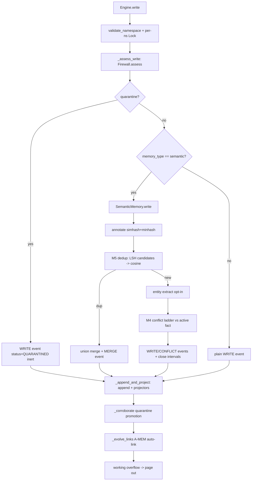

##### Flow: update

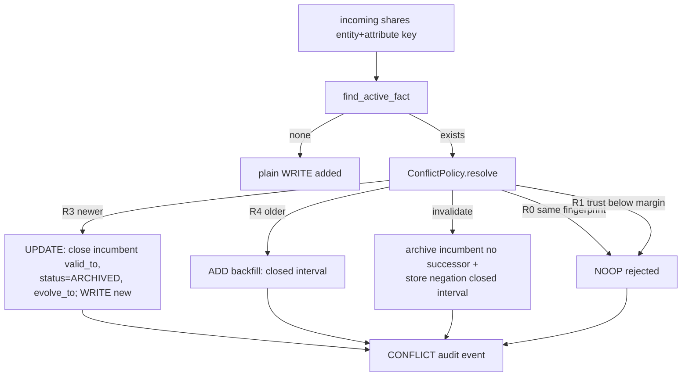

##### Flow: retrieve

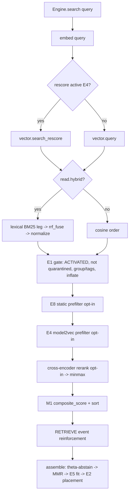

##### Flow: background

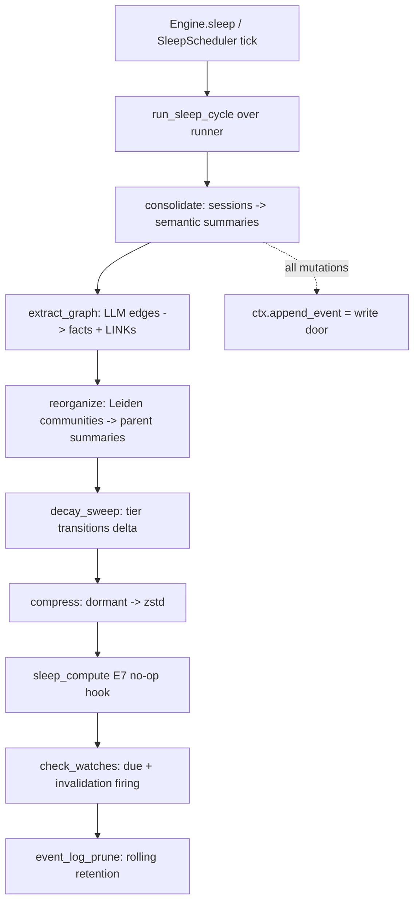

---

### cognee

- **SHA / freshness:** `5b32da7c08237e7274342114a72d82667d97c1f4` (2026-07-08, pull=ok)
- **Facade:** cognee.add / cognee.cognify / cognee.search (+ memify, forget); api/v1/*.py async facade; SearchType-dispatched retrievers
- **Source of truth:** Relational 'Data' table + raw files on disk (NOT event-sourced); graph store (ladybug default) + vector store (lancedb) are rebuildable projections
- **Opaque / divergence notes:** DIVERGENCE from prior passes: at this v1.2.2 SHA the DEFAULT graph provider is 'ladybug' (graph/config.py:graph_database_provider=Field('ladybug'); ladybug is a CORE dep), not kuzu — the pass-#4 'reverted Ladybug mislabel -> kuzu' is stale for this newer checkout (kuzu still bundled but not default). Vector default confirmed lancedb. No LLM conflict/patch resolver (update = deterministic uuid5 identity merge + edge-existence dedup, no MinHash/LSH). No RRF fusion (BM25 and dense are separate retrievers). No time-decay/Ebbinghaus; memify is manually invoked, no auto-scheduler. No content-trust firewall (permission-based ACL only). Test-file count (~150-155) not recounted this air-gapped pass. prompt_count=67 = 60 infra .txt (incl. test.txt fixture and 4 eval benchmark answer prompts) + 6 cascade .txt + llm_judge_prompts.py; 3 eval-dataset-generator prompts under eval_framework/logistics_system_utils listed but not transcribed (domain data, not memory prompts).


Repo: `cognee` · SHA `5b32da7c08237e7274342114a72d82667d97c1f4` (recorded `5b32da7c0823`) ·
version `1.2.2` (pyproject `[project].version`). Path traced: `D:\mem\cognee`.
All citations are `file:symbol`. Air-gapped: local files only.

#### Mental model

cognee is a **DAG task-pipeline** memory engine. Three public verbs form the lifecycle:
`add` (ingest raw data into a relational "Data" table + raw file store) → `cognify` (run an LLM
DAG that turns chunks into a **knowledge graph + vector embeddings**) → `search` (dispatch a query
to one of ~18 `SearchType` retrievers, most of which assemble graph/vector context and call an LLM
to answer). A fourth verb `memify` runs *optional, explicitly-invoked* post-processing pipelines
(entity-description consolidation, feedback/frequency weighting, session distillation, community
summaries) over the already-built graph. Everything is a `Task`
(`cognee/modules/pipelines/tasks/task.py:Task`) composed into a pipeline by `run_pipeline`
(`cognee/modules/pipelines/operations/run_pipeline.py`).

The unit of stored knowledge is the **`DataPoint`** pydantic model
(`cognee/infrastructure/engine/models/DataPoint.py:DataPoint`) — every node type (Entity,
EntityType, DocumentChunk, TextSummary, Event, Timestamp, Interval, Skill, Tool,
GlobalContextSummary, …) subclasses it. A DataPoint declares `metadata.index_fields` (fields that
get embedded) and optional `metadata.identity_fields` (fields that derive a **deterministic
UUIDv5 id**, giving idempotent merge). Nodes+edges go to a graph store; embeddable fields go to a
vector store.

Facade entry points (async-first, `cognee/api/v1/*`):
- `cognee/api/v1/add/add.py:add`
- `cognee/api/v1/cognify/cognify.py:cognify`
- `cognee/api/v1/search/search.py:search`
- `cognee/api/v1/memify/…` → `cognee/modules/memify/memify.py:memify`
- `cognee/api/v1/forget/forget.py:forget` (unified delete)

#### Source of truth

**The relational "Data" table + the raw files on disk are the durable source of truth; the graph
store and vector store are rebuildable projections.** cognee is *not* event-sourced — there is no
append-only event log. Evidence:
- `add` runs `Task(ingest_data, …)` (`cognee/tasks/ingestion/ingest_data.py`) which writes raw
  content + a `Data` row via the SQLAlchemy relational engine
  (`cognee/infrastructure/databases/relational/*`); raw bytes go through the storage backend
  (`cognee/infrastructure/files/storage/*`).
- `cognify` reads those Data rows and *derives* graph nodes/edges + vector embeddings. Re-running
  cognify rebuilds the projection from Data.
- `forget(..., memory_only=True)` "delete[s] only memory (graph nodes/edges and vector
  embeddings) … Raw files and data records are preserved so the dataset can be re-cognified"
  (`cognee/api/v1/forget/forget.py:forget` docstring) — explicit confirmation that graph+vector
  are a rebuildable projection of Data.

Store defaults: **graph = ladybug** (embedded, Apache-2.0 Kuzu-lineage Cypher) —
`cognee/infrastructure/databases/graph/config.py:GraphConfig.graph_database_provider =
Field("ladybug", …)`. **vector = lancedb** —
`cognee/infrastructure/databases/vector/config.py:VectorConfig.vector_db_provider = "lancedb"`.
Relational = SQLite/aiosqlite (core dep). A unified engine can wrap graph+vector when the backend
supports hybrid writes (`cognee/infrastructure/databases/unified/*`,
`EngineCapability.HYBRID_WRITE`).

#### Write path

Two separate pipelines: `add` (ingest) then `cognify` (build graph).

**add pipeline** — `cognee/api/v1/add/add.py:add` builds:
1. `Task(resolve_data_directories, include_subdirectories=True)` — expand dirs/paths.
2. `Task(ingest_data, dataset_name, user, node_set, dataset_id, preferred_loaders,
   importance_weight)` (`cognee/tasks/ingestion/ingest_data.py:ingest_data`) — pick a loader,
   extract text, write the `Data` row + raw file, assign user permissions. Blocking by default
   (`run_in_background=False`). **No LLM call on the add path.**

**cognify pipeline** — `cognee/api/v1/cognify/cognify.py:get_default_tasks`:
1. `Task(classify_documents)` (`cognee/tasks/documents/classify_documents.py`) — map each Data row
   to a typed `Document` (TextDocument, PdfDocument, DltRowDocument, …). Deterministic by
   mime/extension — *not* the LLM classifier.
2. `Task(extract_chunks_from_documents, max_chunk_size=chunk_size or get_max_chunk_tokens(),
   chunker=TextChunker)` (`cognee/tasks/documents/extract_chunks_from_documents.py`) — split into
   `DocumentChunk` DataPoints.
3. `Task(extract_graph_and_summarize, graph_model=KnowledgeGraph, config, custom_prompt, batch)`
   (`cognee/tasks/graph/extract_graph_and_summarize.py:extract_graph_and_summarize`) — **LLM
   core**, runs two coroutines via `asyncio.gather`:
   - `extract_graph_from_data`
     (`cognee/tasks/graph/extract_graph_from_data.py:extract_graph_from_data`) → per chunk
     `extract_content_graph`
     (`cognee/infrastructure/llm/extraction/knowledge_graph/extract_content_graph.py:extract_content_graph`)
     → `LLMGateway.acreate_structured_output(chunk.text, system=generate_graph_prompt.txt,
     KnowledgeGraph)` (instructor-validated). Then `integrate_chunk_graphs` →
     `expand_with_nodes_and_edges` turns the LLM `KnowledgeGraph` (Nodes/Edges) into
     `Entity`/`EntityType` DataPoints + edge dicts, resolving against an ontology resolver;
     `retrieve_existing_edges` dedups edges.
   - `summarize_text` (`cognee/tasks/summarization/summarize_text.py:summarize_text`) → per chunk
     `extract_summary` with `summarize_content.txt` → `TextSummary` DataPoint.
   Only the `TextSummary` list is returned upstream; the Entity graph is attached to chunks
   (`chunk.contains`).
4. `Task(add_data_points, embed_triplets, batch)`
   (`cognee/tasks/storage/add_data_points.py:add_data_points`) — **LOAD/persist**:
   `get_graph_from_model` flattens each DataPoint into nodes+edges,
   `deduplicate_nodes_and_edges` removes dup ids/edge-keys, `upsert_nodes`/`upsert_edges` write to
   the graph store, `index_data_points`/`index_graph_edges` embed `index_fields` into the vector
   store. A rollback ledger is written **before** the graph/vector writes for crash recovery
   (`cognee/modules/cognify/rollback.py:cognify_rollback_handler`).
5. `Task(extract_dlt_fk_edges)` — deterministic FK edges for structured (DLT) sources.

**Temporal variant** (`cognify(temporal_cognify=True)` → `get_temporal_tasks`): replaces step 3
with `Task(extract_events_and_timestamps)`
(`cognee/tasks/temporal_graph/extract_events_and_entities.py`, prompts
`generate_event_graph_prompt.txt` + `generate_event_entity_prompt.txt`) and
`Task(extract_knowledge_graph_from_events)`
(`cognee/tasks/temporal_graph/extract_knowledge_graph_from_events.py`), producing `Event` /
`Timestamp` / `Interval` DataPoints (valid-time nodes).

**Embedder**: fastembed ONNX CPU is the slim default (`[fastembed]` extra); embeddings created in
`index_data_points` via the configured embedding engine
(`cognee/infrastructure/databases/vector/embeddings/*`). LLM calls route through litellm
(`cognee/infrastructure/llm/LLMGateway.py`), structured output via instructor + json-repair.

#### Update / conflict / patch path

cognee has **no LLM-driven fact-conflict resolver** (unlike mem0's ADD/UPDATE/DELETE
reconciliation). Update is **deterministic idempotent id merge** plus optional weight/description
consolidation:

- **Identity merge (upsert)**: `Entity`/`EntityType`/`Skill`/`Tool` declare
  `metadata.identity_fields`, so their id is a deterministic UUIDv5 of those fields
  (`DataPoint._generate_identity_id` / `DataPoint.id_for`). Re-ingesting the same entity name
  yields the same node id → `upsert_nodes` (`cognee/modules/graph/methods/upsert_nodes.py`)
  overwrites/merges instead of duplicating. Nodes without identity_fields get a random uuid4 and
  never merge (documented footgun in DataPoint).
- **Edge dedup**: `retrieve_existing_edges`
  (`cognee/modules/graph/utils/retrieve_existing_edges.py`) queries `graph_engine.has_edges`,
  builds `existing_edges_map` keyed `src+rel+tgt`; `expand_with_nodes_and_edges`
  (`cognee/modules/graph/utils/expand_with_nodes_and_edges.py`) skips edges already present.
  `deduplicate_nodes_and_edges` (`…/utils/deduplicate_nodes_and_edges.py`) dedups within a batch.
- **Description consolidation (memify)**:
  `cognee/memify_pipelines/consolidate_entity_descriptions.py` +
  `consolidate_entity_details.txt` LLM-rewrites an entity's description from its neighbors — a
  merge/summarize, not a truth-conflict resolver.
- **Feedback / frequency re-weighting (memify)**:
  `cognee/tasks/memify/apply_feedback_weights.py:stream_update_weight` EMA-updates a node/edge
  `feedback_weight` from user ratings (1–5 → 0–1); `apply_frequency_weights.py` increments a usage
  counter. These mutate node/edge *properties* in place (an update path), not fact content.
- **Chunk association (memify)**: `chunk_association_system.txt` can add
  topical/causal/temporal edges between chunks — additive link evolution.
- **Patch prompts** (`patch_gen_instructions.txt`, `patch_gen_kg_instructions.txt`) are for the
  SWE-bench code-patch eval flow, not memory patching.

#### Delete / forget / erasure

Single unified verb `cognee/api/v1/forget/forget.py:forget` (replaces old prune/delete/
empty_dataset). Modes:
- `data_id + dataset(_id)` — forget one Data item and its derived graph/vector entries.
- `dataset` — forget an entire dataset (all Data + graph nodes + vector entries).
- `everything=True` — forget all datasets the user owns.
- `memory_only=True` — delete only the graph+vector projection, **keep raw Data/files** so the
  dataset can be re-cognified.

Deletion cascades to the projections via the delete task chain (graph/vector engine `delete_*`).
No tombstones / append-only log — deletes are physical removals (and optionally the relational
Data rows). `cognee/api/v1/delete/delete.py` is a 1-line re-export shim (deprecated for `forget`).

#### Retrieve / rank / assemble

`search.py:search` → `cognee/modules/search/methods/search.py:search` → `get_retriever_output` →
`get_search_type_retriever_instance`
(`cognee/modules/search/methods/get_search_type_retriever_instance.py:search_core_registry`) maps
each `SearchType` (`cognee/modules/search/types/SearchType.py`) → retriever:

| SearchType | Retriever | Prompts |
|---|---|---|
| GRAPH_COMPLETION (default) | `graph_completion_retriever.py:GraphCompletionRetriever` | `graph_context_for_question.txt` + `answer_simple_question.txt` |
| GRAPH_COMPLETION_COT | `graph_completion_cot_retriever.py` | + `cot_validation_*`, `cot_followup_*` |
| GRAPH_COMPLETION_DECOMPOSITION | `graph_completion_decomposition_retriever.py` | + `graph_completion_decomposition_system_prompt.txt` |
| GRAPH_COMPLETION_CONTEXT_EXTENSION | `graph_completion_context_extension_retriever.py` | graph completion loop |
| GRAPH_SUMMARY_COMPLETION | `graph_summary_completion_retriever.py` | + `summarize_search_results.txt` |
| RAG_COMPLETION | `completion_retriever.py:CompletionRetriever` | `context_for_question.txt` + `answer_simple_question.txt` |
| HYBRID_COMPLETION | `hybrid_retriever.py:HybridRetriever` | `hybrid_context_for_question.txt` |
| TRIPLET_COMPLETION | `triplet_retriever.py` | answer prompt |
| CHUNKS | `chunks_retriever.py` | none (vector only) |
| CHUNKS_LEXICAL | `bm25_retriever.py:BM25ChunksRetriever` | none (Okapi BM25) |
| SUMMARIES | `summaries_retriever.py` | none (vector over TextSummary) |
| CYPHER | `cypher_search_retriever.py` | raw Cypher + `answer_simple_question.txt` |
| NATURAL_LANGUAGE | `natural_language_retriever.py` | `natural_language_retriever_system.txt` (NL→Cypher) |
| TEMPORAL | `temporal_retriever.py` | `extract_query_time.txt` + `graph_context_for_question.txt` |
| CODING_RULES | `coding_rules_retriever.py` | none |
| AGENTIC_COMPLETION | `agentic_retriever.py:AgenticRetriever` | `agentic_system.txt` + `agentic_user.txt` (tool/skill loop) |
| FEELING_LUCKY | `select_search_type.py` picks a type | `search_type_selector_prompt.txt` |

**Ranking** (graph completion path): `brute_force_triplet_search`
(`cognee/modules/retrieval/utils/brute_force_triplet_search.py`) runs vector search over node &
edge collections, projects a `CogneeGraph` fragment, maps cosine distances onto nodes/edges, then
`CogneeGraph.calculate_top_triplet_importances`
(`cognee/modules/graph/cognee_graph/CogneeGraph.py:_calculate_query_top_triplet_importances`)
scores each triplet: for node1, node2 and the edge, `distance = (2 − importance_weight) · cosine`,
optionally blended with `feedback_weight` (weight = `feedback_influence`), summed across the three
elements; `heapq.nsmallest(k)` keeps the lowest (best) triplets. `triplet_distance_penalty=6.5` is
the fallback distance for elements with no vector hit. **No RRF fusion**: dense and BM25 lexical
paths are separate retrievers; the hybrid retriever concatenates chunk + entity sectioned context,
not RRF.

**Assemble**: retriever `get_context_from_objects` renders triplets as `node1 -- relation -- node2`
lines (or chunk text) into `graph_context_for_question.txt`, then `get_completion_from_context`
calls the LLM with `answer_simple_question.txt` as system prompt for the final answer
(`cognee/modules/retrieval/utils/completion.py`).

#### Background / sleep / consolidate / decay

**No automatic scheduler / sleep loop / time-decay in core.** Background-style work is the
**`memify`** verb — an *explicitly invoked* second pipeline
(`cognee/modules/memify/memify.py:memify`, defaults `cognee/memify_pipelines/memify_default_tasks.py`):
- `consolidate_entity_descriptions.py` — LLM re-summarize entity descriptions from neighbors.
- `global_context_index.py` + `cognee/tasks/memify/global_context_index/*` — hierarchical
  **community summaries**: bucket entities, summarize each bucket
  (`global_context_bucket_summary.txt`) + the dataset root (`global_context_root_summary.txt`)
  into `GlobalContextSummary` DataPoints (GraphRAG-style community layer).
- `apply_feedback_weights.py` — EMA update of feedback_weight from session Q&A ratings.
- `apply_frequency_weights.py` — increment usage-frequency weight per used element.
- `persist_sessions_in_knowledge_graph.py` + `cognee/modules/session_distillation/distill.py` —
  distill finished chat sessions into durable graph "lessons"
  (`session_distillation_curator_system.txt` proposes, `session_distillation_writer_system.txt`
  accept/write-gates).
- `persist_agent_trace_feedbacks_in_knowledge_graph.py` — turn agent tool traces into lessons
  (`agent_context_extraction_system.txt`, `agent_trace_feedback_summary_system.txt`).
- `create_triplet_embeddings.py` — embed triplets for retrieval.
- `skill_improvement.py` (`cognee/modules/memify/skill_improvement.py`) — evolve procedural Skills.

`feedback_weight`/`frequency_weight` act as a *reinforcement* signal that reranks retrieval;
**no exponential time-decay / Ebbinghaus** is implemented. `APScheduler` appears only under the
`[scraping]` extra, not as a consolidation scheduler.

#### Claims vs code (agree | diverge | opaque)

- **AGREE** — README/CLAUDE.md "add → cognify → search" DAG task pipeline: confirmed
  (`add.py`/`cognify.py`/`search.py` build `Task` lists run by `run_pipeline`).
- **AGREE** — "graph + vector; DataPoint model": confirmed. DataPoint is the universal node model;
  graph = ladybug/kuzu/neo4j, vector = lancedb/pgvector.
- **AGREE** — "instructor + litellm structured extraction": `LLMGateway.acreate_structured_output`,
  `instructor` + `litellm` core deps.
- **AGREE / undercount** — ecosystem doc "45+ `.txt` templates": actually **60** `.txt` in
  `infrastructure/llm/prompts/` + 6 cascade + `llm_judge_prompts.py`.
- **DIVERGE (important)** — ECOSYSTEM_COMPARISON §7/§2 + ARCHITECTURE_FLOWS say **default graph =
  kuzu** ("reverted Ladybug mislabel"). At **this SHA (v1.2.2)** the default is **ladybug**:
  `graph/config.py:graph_database_provider = Field("ladybug", …)` and `ladybug>=0.16.0,<0.18` is a
  **core** dependency in `pyproject.toml`. kuzu is still bundled (`packages=[…,"kuzu"]`, adapter
  imported at `graph/config.py:14`) but is no longer the default. The pass-#4 correction is stale
  for this newer checkout — this is version drift, not a prior mislabel.
- **AGREE** — "cognify default blocking (`run_in_background=False`)": confirmed in `add` and
  `cognify` signatures.
- **DIVERGE (minor)** — "slim core / extras matrix" (ecosystem table lists cognee under slim-core
  peers): cognee's **core** is heavy (lancedb, ladybug, networkx, rdflib, litellm, instructor,
  fastapi, openai, tiktoken all core). fastembed/neo4j/postgres/transformers are extras, but the
  default install is not slim.
- **OPAQUE** — exact test-file count ("~150–155"): not recounted this pass (air-gapped, no
  collect run); prior estimate retained.
- **AGREE** — "no event-sourced log": SoT is the relational Data table + raw files; graph/vector
  are rebuildable projections (differs from memspine's append-only `memory_events`).

#### Flows

##### Flow: write

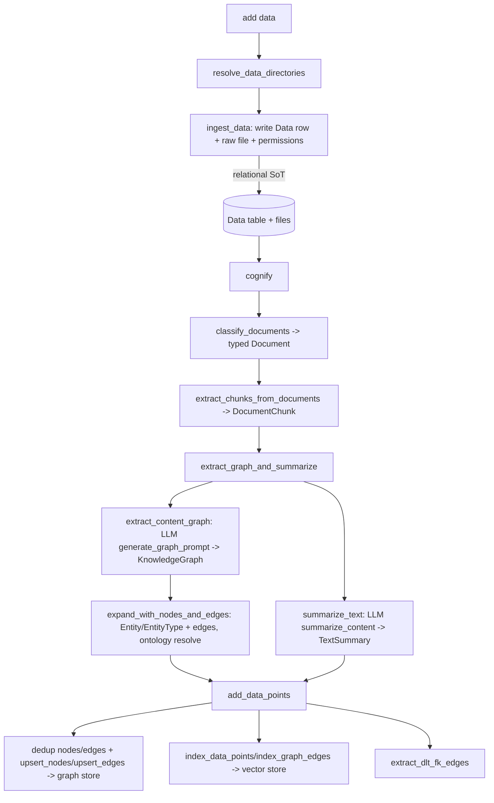

##### Flow: update

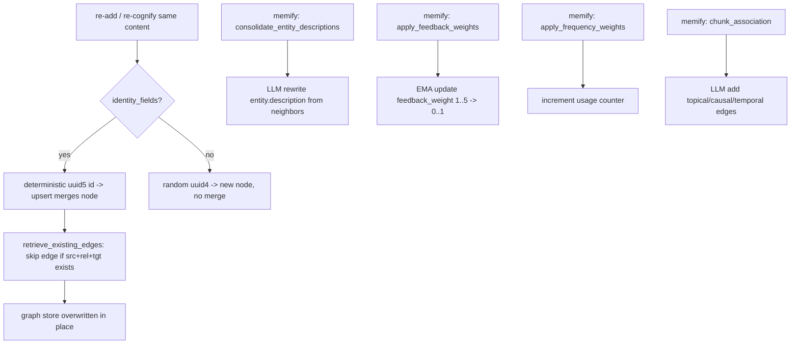

##### Flow: retrieve

```mermaid
flowchart TD
  A[search query_text, query_type] --> B[get_search_type_retriever_instance]
  B --> C{SearchType}
  C -->|GRAPH_COMPLETION| D[brute_force_triplet_search: vector over node+edge collections]
  D --> E[CogneeGraph fragment: map cosine distances]
  E --> F[calculate_top_triplet_importances: (2-imp)*d, feedback blend, nsmallest k]
  F --> G[render node1 -- rel -- node2 into graph_context_for_question]
  G --> H[LLM answer_simple_question -> answer]
  C -->|CHUNKS_LEXICAL| I[BM25 Okapi scorer -> top_k chunks]
  C -->|CHUNKS/SUMMARIES| J[vector search only]
  C -->|NATURAL_LANGUAGE| K[LLM NL->Cypher -> execute]
  C -->|TEMPORAL| L[extract_query_time -> interval filter -> graph answer]
  C -->|AGENTIC_COMPLETION| M[agentic loop: tools + skills + memory]
  C -->|FEELING_LUCKY| N[search_type_selector -> pick a type]
```

##### Flow: background

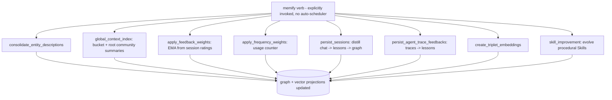
Note: cognee has **no time-decay / Ebbinghaus** loop; the only continuous dynamics are the
feedback/frequency reinforcement weights that rerank retrieval.

---

### graphiti

- **SHA / freshness:** `526dcad7a300` (2026-07-09, pull=ok)
- **Facade:** graphiti_core/graphiti.py:Graphiti (add_episode / add_episode_bulk / add_triplet / search / search_ / build_communities / summarize_saga / remove_episode)
- **Source of truth:** Cypher graph store (Neo4j default; FalkorDB/Kuzu/Neptune drivers) — nodes+edges are primary; NO event log, NO projector-rebuild contract. Episodes are graph nodes.
- **Opaque / divergence notes:** Cross-encoder default rerank quality depends on external provider (OpenAI logprob / BGE / Gemini) — not verifiable air-gapped. Label-propagation community convergence/quality not benchmarked in-repo. FalkorDB/Kuzu/Neptune driver parity with Neo4j asserted but not exercised. Go async summary worker (src/lib/graphsummary/processor.go) referenced in a prompt comment is not present in this repo. 5 prompts reserved (registered, no core call site), 4 eval-harness-only.


Repo: `graphiti` (graphiti-core v0.29.2, Zep Software). SHA `526dcad7a300`.
Path: `D:\mem\graphiti`. Citations are `file:symbol` under `graphiti_core/` unless noted.

#### Mental model

Graphiti is a **bitemporal knowledge-graph memory engine**. The unit of write is an
**episode** (a raw message / text / JSON blob with a `reference_time`). Each episode is run
through an LLM extraction pipeline that produces **entity nodes** and **entity edges (facts)**,
deduped and resolved against the existing graph, then persisted to a Cypher graph store (Neo4j
default; FalkorDB / Kuzu / Neptune drivers). Facts carry a validity window (`valid_at` /
`invalid_at`) plus a transactional window (`created_at` / `expired_at`) — the "bitemporal"
design. Retrieval is hybrid search over edges/nodes/episodes/communities (BM25 fulltext + cosine
+ graph BFS) fused by RRF, optionally reranked by node-distance, cross-encoder, MMR, or
episode-mentions.

Facade: `graphiti.py:Graphiti` — key verbs `add_episode`, `add_episode_bulk`, `add_triplet`,
`search`, `search_`, `build_communities`, `remove_episode`, `summarize_saga`,
`retrieve_episodes`, `get_nodes_and_edges_by_episode`.

#### Source of truth

The **graph store is the source of truth** (nodes + edges in Neo4j/FalkorDB/Kuzu/Neptune).
There is **no separate append-only event log**: episodes (`EpisodicNode`) are themselves graph
nodes, and derived entity/edge state is written directly into the same graph — not projected
from an event log. Contrast memspine's event-sourced core (`memory_events` + rebuildable
projectors): graphiti has **no rebuild-from-log contract**; the graph *is* primary. Embeddings
(`name_embedding` on nodes, `fact_embedding` on edges) and fulltext indexes are graph-native
projections built inline at write time (`graphiti.py:build_indices_and_constraints`,
`edges.py:create_entity_edge_embeddings`, `nodes.py:create_entity_node_embeddings`).

Episode retention: `Graphiti.__init__(store_raw_episode_content=True)` — if false, episode
`content` is cleared after extraction (`graphiti.py:_process_episode_data` sets `ep.content=''`),
so raw text is not retained; extracted facts survive.

Node kinds (labels): `Episodic`, `Entity`, `Community`, `Saga` (`nodes.py`). Edge kinds:
`MENTIONS` (EpisodicEdge), `RELATES_TO` (EntityEdge / fact), `HAS_MEMBER` (CommunityEdge),
`HAS_EPISODE` (HasEpisodeEdge), `NEXT_EPISODE` (NextEpisodeEdge) — `edges.py`.

#### Write path

Entry: `graphiti.py:Graphiti.add_episode` (single) / `add_episode_bulk` (batch). Single-episode
call order:

1. `add_episode` (graphiti.py:980) — `validate_entity_types`, resolve `group_id` (partition →
   database name), `now = utc_now()`.
2. `retrieve_episodes` (graphiti.py:927 → `graph_data_operations.py:retrieve_episodes`) — pull
   last `RELEVANT_SCHEMA_LIMIT` prior episodes for context (or explicit `previous_episode_uuids`).
3. Build `EpisodicNode` (content, `valid_at=reference_time`, `created_at=now`).
4. **Extract nodes**: `node_operations.py:extract_nodes` → prompt by source type:
   `extract_nodes.extract_message` (message), `extract_nodes.extract_text` (text),
   `extract_nodes.extract_json` (json) (node_operations.py:262-272). Excluded-type filter applied.
5. **Resolve nodes** (dedup): `node_operations.py:resolve_extracted_nodes` → deterministic pass
   `dedup_helpers.py:_resolve_with_similarity` (exact normalized-name + MinHash/LSH fuzzy, entropy
   gated), then LLM fallback `dedupe_nodes.nodes` (node_operations.py:553) for unresolved →
   `uuid_map`.
6. **Extract edges**: `edge_operations.py:extract_edges` → prompt `extract_edges.edge`
   (edge_operations.py:203). Validates source/target names against extracted nodes; drops
   self-edges; parses `valid_at`/`invalid_at`; sets `episodes`, `reference_time`.
7. `resolve_edge_pointers(extracted_edges, uuid_map)` remaps endpoints to canonical node UUIDs.
8. **Resolve edges** (dedup + invalidation): `edge_operations.py:resolve_extracted_edges` → for
   each edge, hybrid search for duplicate candidates (`related_edges`, endpoint-scoped) and
   invalidation candidates (`existing_edges`, global), then `resolve_extracted_edge` calls
   `dedupe_edges.resolve_edge` (edge_operations.py:727). Timestamps via
   `extract_edges.extract_timestamps` when absent (edge_operations.py:599).
9. `entity_edges = resolved_edges + invalidated_edges`.
10. **Node attributes / summaries**: `node_operations.py:extract_attributes_from_nodes` →
    `extract_nodes.extract_attributes` (805) + batch summaries `extract_summaries_batch` /
    `extract_entity_summaries_from_episodes` (970-973).
11. **Persist**: `_process_episode_data` → `build_episodic_edges` (MENTIONS) +
    `bulk_utils.py:add_nodes_and_edges_bulk` (single transaction; generates embeddings). Optional
    saga wiring (HAS_EPISODE / NEXT_EPISODE).
12. Optional inline `update_community` per node if `update_communities=True` (graphiti.py:1184).

Bulk path (`add_episode_bulk`) uses `_extract_and_dedupe_nodes_bulk` (in-memory cross-episode
dedupe via `dedupe_nodes_bulk`) then `_resolve_nodes_and_edges_bulk`, and can use a **combined
single-pass extraction** prompt `extract_nodes_and_edges.extract_message`
(`combined_extraction.py:129`, gated by `bulk_utils.py:use_combined_extraction`).

Structured output is **pydantic response_model** via `llm_client.generate_response(...,
response_model=...)` — NOT instructor. Prompts are Python functions returning `list[Message]`.

#### Update / conflict / patch path

Conflict model is **bitemporal edge invalidation**, not in-place mutation. Core:
`edge_operations.py:resolve_extracted_edge` + `resolve_edge_contradictions`.

- **Duplicate detection**: `dedupe_edges.resolve_edge` returns `duplicate_facts` (idx into
  endpoint-matched `related_edges`) and `contradicted_facts` (idx across both lists). A verbatim
  fast-path reuses an identical edge (edge_operations.py:685-695).
- If duplicate: the resolved edge becomes the existing edge; the new episode UUID is appended to
  `resolved_edge.episodes` (edge_operations.py:751). No new edge minted.
- **Contradiction / invalidation**: `resolve_edge_contradictions` (edge_operations.py:538) sets a
  contradicted older edge's `invalid_at = resolved_edge.valid_at` and `expired_at = utc_now()`
  when the older edge's `valid_at < resolved_edge.valid_at`. The new edge can itself be expired if
  a contradiction candidate has a later `valid_at` (edge_operations.py:826-839). Temporal-overlap
  guards prevent invalidating non-overlapping windows.
- Facts are never hard-deleted on update: superseded facts persist via `expired_at`/`invalid_at`
  (transaction-time + valid-time).
- Node updates: `_promote_resolved_node` (dedup_helpers.py:170) upgrades a generic `Entity` label
  to a specific type from a duplicate; attributes replaced via
  `apply_capped_attributes(..., merge_mode='replace')`.
- `add_triplet` (graphiti.py:1645) runs the same invalidation ladder for manually asserted
  triples, minting a new edge UUID on endpoint-mismatch collisions.

#### Delete / forget / erasure

- `graphiti.py:remove_episode` (1765): deletes an episode and **only** edges whose first episode
  is this episode (`edge.episodes[0] == episode.uuid`), plus nodes mentioned solely by it
  (MENTIONS `episode_count == 1`). Then `Edge.delete_by_uuids`, `Node.delete_by_uuids`,
  `episode.delete`. Genuine hard delete, no tombstone.
- `build_communities` first `remove_communities` (community_operations.py:244 — `MATCH (c:Community)
  DETACH DELETE c`) — communities are fully rebuilt each full build, not incrementally merged.
- No TTL/decay forgetting; no firewall/quarantine erasure. Deletion is explicit and manual.

#### Retrieve / rank / assemble

Two facades:

- `Graphiti.search` (graphiti.py:1527) — **edge-only hybrid**. Config `EDGE_HYBRID_SEARCH_RRF`
  (default) or `EDGE_HYBRID_SEARCH_NODE_DISTANCE` when `center_node_uuid` given. Returns
  `list[EntityEdge]` (facts). No LLM in this path.
- `Graphiti.search_` (graphiti.py:1603) — **advanced multi-scope**. Default config
  `COMBINED_HYBRID_SEARCH_CROSS_ENCODER` (search_config_recipes.py) → edges+nodes+episodes with
  **cross-encoder** rerank. Returns `SearchResults`.

Internals: `search/search.py:search` embeds the query only if a cosine/MMR method is configured
(else zero vector, `EMBEDDING_DIM`), then fans out `edge_search`/`node_search`/`episode_search`/
`community_search` concurrently. Per scope:

- Methods: `bm25` (`*_fulltext_search`, graph BM25 index), `cosine_similarity`
  (`*_similarity_search`, `sim_min_score` default 0.6), `bfs` (`*_bfs_search`, `bfs_max_depth`).
  Each pulls `2*limit` candidates.
- Rerankers (`search_utils.py`): `rrf` (RRF, `1/(rank+1)`), `node_distance_reranker` (shortest
  RELATES_TO hops to `center_node_uuid`), `cross_encoder` (`cross_encoder.rank` — OpenAI/BGE/Gemini
  reranker clients), `mmr` (`maximal_marginal_relevance`, λ=0.5), `episode_mentions_reranker`
  (MENTIONS count).

No LLM answer-synthesis/assembly in core retrieval — graphiti returns facts/nodes; answer
generation is the caller's job. QA/answer prompts (`eval.qa_prompt`) live only in the eval
harness `tests/evals/`.

#### Background / sleep / consolidate / decay

Graphiti has **no scheduler/decay/sleep loop**. Background-style work is caller-triggered:

- **Communities**: `graphiti.py:build_communities` → `community_operations.py:build_communities`.
  Clustering is **label propagation** (`label_propagation`, weighted by RELATES_TO edge counts).
  Cluster node summaries are hierarchically pairwise-merged (`build_community` →
  `summarize_nodes.summarize_pair`) into a community summary, named by `summary_description`.
  Incremental single-node updates via `update_community` (`determine_entity_community` mode-vote →
  `summarize_pair`).
- **Sagas** (thread rollups): `graphiti.py:summarize_saga` incrementally summarizes new episodes
  via `summarize_sagas.summarize_saga`, with dual watermarks (`last_summarized_at` wall-clock
  filter, `last_summarized_episode_valid_at` event-time).
- Docstrings recommend running `add_episode` itself as a background task (FastAPI/queue), but the
  library ships no worker/runner. No episodic→semantic consolidation beyond communities/sagas. No
  Ebbinghaus decay, no reflective/dream loop.

#### Claims vs code (agree | diverge | opaque)

- **AGREE** — bitemporal facts: valid_at/invalid_at temporal edges confirmed
  (`extract_edges.py:Edge`, `resolve_edge_contradictions`, `expired_at`/`invalid_at`).
- **AGREE** — hybrid search + RRF default on `search()`; cross-encoder default on `search_()`;
  `center_node_uuid` → node-distance (graphiti.py:1569 + search.py). Matches prior comparison capsule.
- **AGREE** — 25 prompt_library prompts: enumerated exactly 25 across 8 modules (PROMPTS.md).
  16 hot, 6 reserved/dead, 4 eval-harness-only.
- **AGREE** — entity/edge extraction + dedup. Node dedup is deterministic MinHash/LSH + entropy
  gate with LLM fallback — richer than the "numpy dedupe" shorthand in ARCHITECTURE_FLOWS line 687.
- **DIVERGE (sharpen)** — graphiti is graph-primary with **no event log / no projector-rebuild
  contract**; episodes are graph nodes. (ECOSYSTEM_COMPARISON line 24 says "graph-primary"; this
  survey confirms no rebuild contract exists.)
- **DIVERGE (stale docstring)** — `search()` "returns the edges as a string" (graphiti.py:1540) is
  wrong; it returns `list[EntityEdge]` objects (graphiti.py:1586).
- **OPAQUE** — cross-encoder default quality depends on external reranker provider (OpenAI/BGE/
  Gemini); not verifiable air-gapped. Label-propagation convergence/quality not benchmarked in-repo.
  FalkorDB/Kuzu/Neptune driver parity asserted but not exercised here.

#### Flows

##### Flow: write

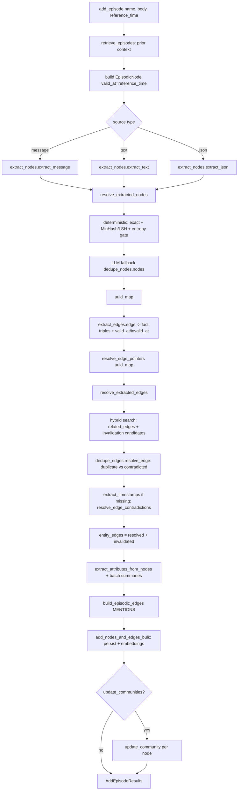

##### Flow: update

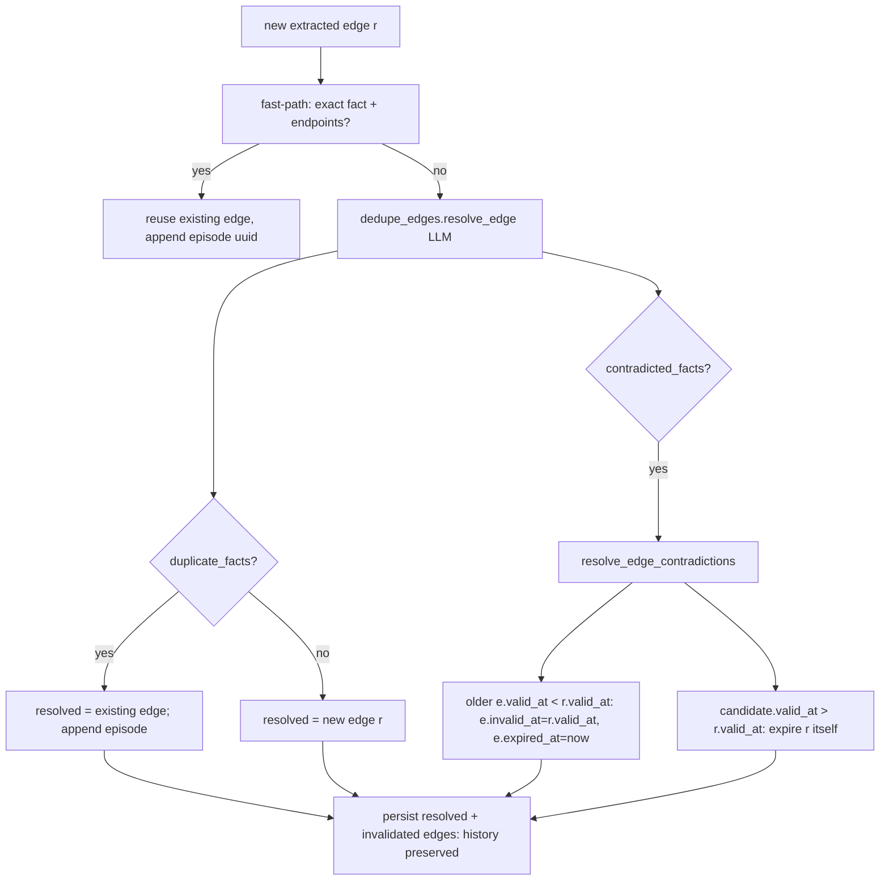

##### Flow: retrieve

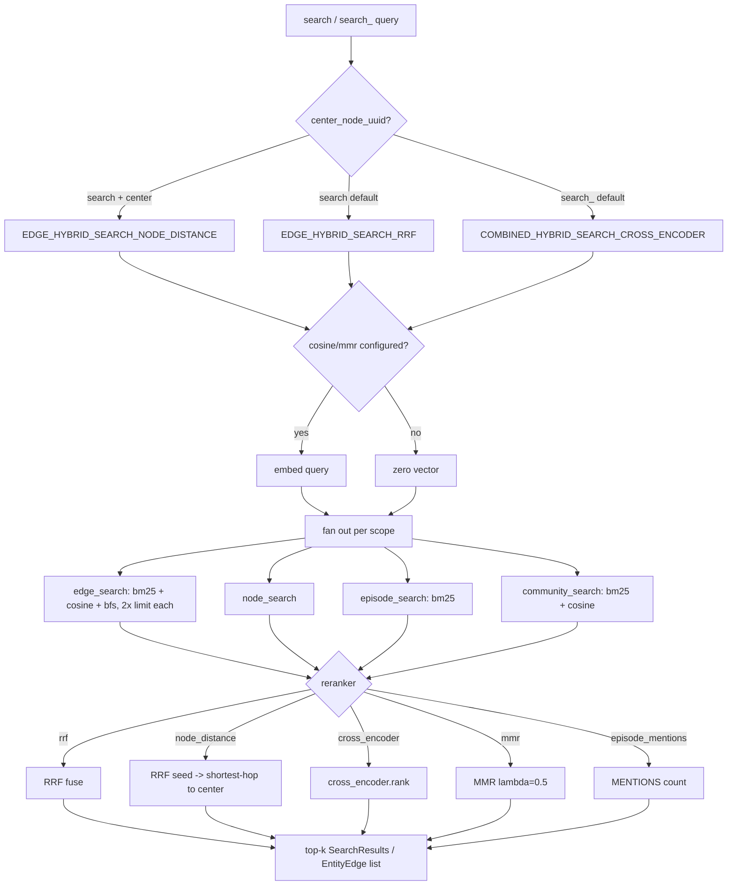

##### Flow: background

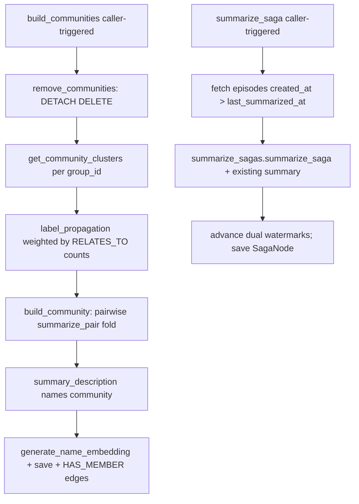

Note: no scheduler/daemon ships in-repo; "background" work is invoked by the caller
(`build_communities`, `summarize_saga`, or `add_episode(update_communities=True)`). No decay loop.

---

### mem0

- **SHA / freshness:** `17836748d7af` (2026-07-11, pull=ok)
- **Facade:** mem0.Memory / mem0.AsyncMemory (mem0/memory/main.py) — add/search/get/get_all/update/delete/delete_all/history/reset
- **Source of truth:** Vector store (Qdrant default) as source of truth; SQL history DB is audit-only, entity store is a retrieval accelerator — no event log, no projector rebuild
- **Opaque / divergence notes:** Hosted Platform behaviors (server-side graph, decay, temporal reference_date, cross-session summaries) exist only as error stubs / HTTP client wrappers — real impl not in this repo. Legacy V1 decision prompts (FACT_RETRIEVAL, USER/AGENT_MEMORY_EXTRACTION, DEFAULT_UPDATE_MEMORY) and builders get_fact_retrieval_messages/get_update_memory_messages ship but have ZERO callers in mem0/ (dead in V3). OSS graph store removed (only a kuzu MissingDependency stub at exceptions.py:396). Survey note's 'ADD/UPDATE/DELETE/NOOP decision prompt' and 'optional graph store' describe the superseded V1/Platform design, not the live OSS code.


Repo: `mem0` (`mem0ai` v2.0.11) · SHA `17836748d7af` · path `D:\mem\mem0`
Scope of this survey: the **OSS SDK** (`mem0/` package). The hosted Platform client (`mem0/client/`), `openmemory/`, `server/`, and `mem0-ts/` are out of scope except where they reveal contracts.

#### Mental model

mem0 is a **vector-primary** memory engine. The canonical store is a single vector collection of short natural-language "fact" strings, each with a metadata payload (`mem0/memory/main.py:Memory._create_memory`, `:_add_to_vector_store`). On write an LLM turns raw conversation turns into self-contained fact statements; on read a hybrid scorer (dense + BM25 + entity-boost) ranks facts. The live code is the **"V3" additive pipeline**: extraction is **ADD-only** — the LLM no longer emits UPDATE/DELETE/NOOP verbs in the hot path.

The classic mem0 "ADD/UPDATE/DELETE/NOOP decision prompt" (`DEFAULT_UPDATE_MEMORY_PROMPT`, `get_update_memory_messages`) and the V1 fact-extraction prompts still ship in `mem0/configs/prompts.py` and `mem0/memory/utils.py`, but **no code path calls them** (dead in OSS — see "Claims vs code"). The repo-specific survey note ("LLM fact-extraction + ADD/UPDATE/DELETE/NOOP decision prompt; optional graph store") describes the *former* design; the live code is single-call ADD-only, and **the OSS graph store has been removed** (`find mem0 -iname '*graph*'` → 0; only a `kuzu`/`graph_store` "not-installed" error stub in `mem0/exceptions.py:396`).

Key structural facts:
- Facade: `mem0.Memory` (sync) / `mem0.AsyncMemory` (async) — `mem0/memory/main.py:Memory`, `:AsyncMemory`.
- Vector default: **Qdrant** (`qdrant-client` is a core dep; `pyproject.toml`). ~24 optional backends behind `[vector-stores]`.
- Auxiliary stores: a SQL **history DB** (`mem0/memory/storage.py`, SQLAlchemy) and a lazily-created **entity store** (a *second vector collection*, `main.py:Memory.entity_store`).
- Entities are extracted with **spaCy** (`mem0/utils/entity_extraction.py`), not an LLM.

#### Source of truth

**The vector store is the source of truth** — there is no event log. `_add_to_vector_store` writes facts directly into `self.vector_store` (Qdrant by default) as the primary record (`main.py:1009 self.vector_store.insert`). Two derived/secondary stores exist, neither authoritative:

1. **History DB** (`mem0/memory/storage.py`, SQLAlchemy via `db.add_history`/`db.batch_add_history`) — append-only audit trail of `ADD`/`UPDATE`/`DELETE` rows per `memory_id`. A change log, **not** a rebuild source: `search`/`get_all` read only the vector store. Contrast memspine's `memory_events` (sole SoT with projector rebuild — `ECOSYSTEM_COMPARISON.md` row 1).
2. **Entity store** — a parallel vector collection mapping entity text → `linked_memory_ids` (`main.py:_add_to_vector_store` Phase 7, `:_compute_entity_boosts`). Pure retrieval accelerator.
3. **Message buffer** — raw turns saved via `db.save_messages(messages, session_scope)` (`main.py:946, 1000`) and read back as `db.get_last_messages` for extraction context (`main.py:878`). A rolling conversational buffer, not authoritative memory.

Divergence from memspine golden rule "event-sourced core": mem0 is **vector-primary** (`ECOSYSTEM_COMPARISON.md` line 24).

#### Write path

Entry: `Memory.add(messages, *, user_id/agent_id/run_id via filters, metadata, infer=True, memory_type, prompt)` (`main.py:723`). Async mirror: `AsyncMemory.add` (`main.py:2386`).

Routing (`main.py:789–836`):
1. `memory_type == "procedural_memory"` **and** `agent_id` set → `_create_procedural_memory` (LLM summarization of the whole transcript into one memory). (`main.py:811, 1935`)
2. Otherwise → `_add_to_vector_store(messages, metadata, filters, infer, prompt)` (`main.py:837`).

`_add_to_vector_store` has two modes:

- **`infer=False`** (`main.py:838–872`): no LLM. Each non-system message `content` string is embedded and stored verbatim as its own memory (`_create_memory`), `event="ADD"`. Raw logging path.

- **`infer=True` — the V3 phased batch pipeline** (`main.py:874–1063`):
  - **Phase 0 Context:** build `session_scope` (`_build_session_scope`), fetch last 10 raw messages (`db.get_last_messages`), `parse_messages(messages)` → flat string (`memory/utils.py:parse_messages`).
  - **Phase 1 Existing retrieval:** embed parsed conversation, `vector_store.search(top_k=10)` filtered by user/agent/run; map results to integer ids `"0".."9"` with `uuid_mapping` (anti-hallucination — the LLM never sees real UUIDs). (`main.py:881–896`)
  - **Phase 2 Extraction (single LLM call):** system = `ADDITIVE_EXTRACTION_PROMPT` (+ `AGENT_CONTEXT_SUFFIX` when agent-scoped); user = `generate_additive_extraction_prompt(existing, new, last_k, custom_instructions)`; `response_format={"type":"json_object"}`. Parsed via `remove_code_blocks` → `json.loads(strict=False)` → `extract_json` fallback. Output `{"memory":[{id,text,attributed_to,linked_memory_ids}]}` — **ADD-only**. On LLM failure it re-raises `LLMError`. (`main.py:898–942`)
  - **Phase 3 Batch embed:** `embedding_model.embed_batch(mem_texts, "add")`. (`main.py:949–961`)
  - **Phase 4/5 CPU + hash dedup:** for each extracted text compute `md5(text)`; skip if hash ∈ existing payload hashes or already seen in-batch. Build payload: `data`, `text_lemmatized` (`lemmatize_for_bm25`), `hash`, `created_at`/`updated_at`, `attributed_to`. (`main.py:963–1001`)
  - **Phase 6 Batch persist:** `vector_store.insert(vectors, ids, payloads)` (fallback per-item), then `db.batch_add_history(event="ADD")`. (`main.py:1003–1042`)
  - **Phase 7 Entity linking:** `extract_entities_batch(texts)` (spaCy), global-dedup entities, batch-embed, `entity_store.search_batch`; existing entity (exact-text match or semantic score ≥ 0.95) → merge `linked_memory_ids`; else insert new entity record. (`main.py:1044–1160`)

In V3 the LLM output is taken as final ADDs; there is **no second LLM "decision" call** reconciling against existing memories — dedup is purely `md5` exact-hash + the prompt's own instruction to skip semantically-equivalent existing memories.

#### Update / conflict / patch path

Two distinct notions, and the historical "conflict-resolution LLM" is no longer wired in:

1. **Programmatic update** — `Memory.update(memory_id, text=..., metadata=..., expiration_date=...)` (`main.py:1773`) → `_update_memory` (`main.py:1974`). Fetches the existing vector by id, replaces `data`/`hash`/`text_lemmatized`/`updated_at`, re-embeds, `vector_store.update`, appends a `UPDATE` history row; if text changed, strips the memory from old entities and re-links new ones (`_remove_memory_from_entity_store` + `_link_entities_for_memory`, `main.py:2031–2036`). `actor_id` is immutable (`main.py:2004`). Direct id-addressed patch, **no LLM**.
2. **Conflict/merge at write time** — in V3 **there is none as an explicit operation.** The old `DEFAULT_UPDATE_MEMORY_PROMPT` (ADD/UPDATE/DELETE/NONE decision over `[{id,text}]`) and its builder `get_update_memory_messages` (`prompts.py:176, 406`) are **not called** by `main.py` (grep: only self-references in `prompts.py`). V3's `ADDITIVE_EXTRACTION_PROMPT` handles overlap by (a) instructing the LLM to skip existing/duplicate facts and (b) `md5` hash dedup. Superseding an old fact with a contradictory new one produces a *new* ADD linked to the old via `linked_memory_ids` — the old memory is **not** deleted or rewritten automatically. mem0 V3 is effectively **append-with-linking**, not update-in-place, for inferred writes.

#### Delete / forget / erasure

- `Memory.delete(memory_id)` (`main.py:1825`) → `_delete_memory` (`main.py:2040`): hard `vector_store.delete(vector_id)`, append `DELETE` history row with `is_deleted=1`, strip the id from linked entity records. **Hard delete** from the vector store; the history DB keeps a tombstone row (audit only).
- `Memory.delete_all(user_id/agent_id/run_id)` (`main.py:1846`): requires ≥1 filter; lists matching vectors and `_delete_memory` each.
- `Memory.reset()` (`main.py:2070`): drops/recreates the vector collection + history DB.
- **Passive expiry (soft forget):** memories may carry `expiration_date`; `_payload_is_expired` (`main.py:403`) compares `date.fromisoformat(expiration_date) < today` and search filters them out unless `show_expired=True` (`_search_vector_store`, `main.py:1628`). Expired memories are **not** physically removed — read-time filter only. No TTL sweeper.
- **Decay** is **not** in OSS: `project.update(decay=True)` raises `get_decay_feature_error_message` (`main.py:429–432`). Decay is Platform-only; the OSS repo carries only "usage notice" nag helpers (`detect_decay_usage_from_delete`).

#### Retrieve / rank / assemble

Entry: `Memory.search(query, *, top_k=20, filters, threshold=0.1, rerank=False, explain=False, show_expired=False)` (`main.py:1337`). Requires ≥1 of user/agent/run in filters. Rich metadata operators supported (`eq/ne/in/nin/gt/gte/lt/lte/contains/icontains/*` + `AND/OR/NOT`, `main.py:1360–1433`). Core work in `_search_vector_store` (`main.py:1586`):

1. Preprocess: `lemmatize_for_bm25(query)`, `extract_entities(query)` (spaCy). (`main.py:1592–1593`)
2. Embed query (`embed(query,"search")`). (`main.py:1596`)
3. **Dense search** over-fetch: `internal_limit = max(top_k*4, 60)`, `vector_store.search`. (`main.py:1598–1602`)
4. **Keyword/BM25 search:** `vector_store.keyword_search(query_lemmatized)` (may be `None` if backend lacks FTS). (`main.py:1604–1607`)
5. **BM25 normalization:** `get_bm25_params(query)` picks query-length-adaptive sigmoid `(midpoint, steepness)`; `normalize_bm25` → [0,1]. (`main.py:1609–1617`, `utils/scoring.py`)
6. **Entity boosts:** `_compute_entity_boosts` embeds query entities, searches the entity store (threshold ≥ 0.5), boosts each entity's `linked_memory_ids` by `similarity * 0.5 * memory_count_weight`, where `memory_count_weight = 1/(1+0.001*(n_linked-1)^2)`. (`main.py:1691–1771`)
7. **Fusion & rank:** `score_and_rank` (`utils/scoring.py:60`): threshold gates the **semantic** score first; `combined = min((semantic + bm25 + entity_boost)/max_possible, 1.0)` with an **adaptive divisor** (`1.0` sem-only, `+1.0` if BM25 present, `+0.5` if entity present). This is **additive normalization, NOT RRF**. Sort desc, take `top_k`. (`main.py:1637–1645`)
8. Assemble `MemoryItem` dicts (id, memory=`data`, hash, timestamps, score) + promoted payload keys (`user_id/agent_id/run_id/actor_id/role/attributed_to/expiration_date`) + `metadata` for the rest; `explain=True` attaches `score_details`. (`main.py:1647–1689`)
9. Optional LLM rerank (`rerank=True`) via `LLMReranker` (score-each-doc 0–1). Off by default.

There is **no LLM "answer synthesis" inside search.** `MEMORY_ANSWER_PROMPT` is only used by the OpenAI-proxy shim (`mem0/proxy/main.py:151`) that prepends retrieved memories to a chat completion — a separate convenience API, not the memory read path.

`get_all` (`main.py:1213`) lists memories by filter with pagination, no scoring.

#### Background / sleep / consolidate / decay

**None in OSS.** grep for `schedul|background|consolidat|cron|celery|apschedul|decay` across `mem0/memory/*.py` finds only: decay/temporal *error-message* helpers (feature-gated to Platform), telemetry's PostHog background thread, and UI "usage notice" nags. There is no consolidation/summarization sweep, no sleep/dream/reflection loop, no decay scheduler, no async projector rebuild.

All memory maintenance is **synchronous and request-scoped**: extraction, dedup, entity-linking, and expiry all happen inline within `add`/`search`. The only true background thread in the package is PostHog telemetry (`mem0/memory/telemetry.py`). Procedural-memory creation is the closest thing to consolidation but it is an explicit, caller-triggered `add(..., memory_type="procedural_memory")`, not a background job.

#### Claims vs code

**Agree:**
- Vector-primary, Qdrant default, broadest backend matrix — `pyproject.toml` (`qdrant-client` core; `[vector-stores]` ~24 backends). Matches `ECOSYSTEM_COMPARISON.md` line 44/138.
- Hybrid BM25 + semantic on the read hot path — `_search_vector_store`, `utils/scoring.py`. Matches `ARCHITECTURE_FLOWS.md:228, 688`.
- V3 ADD-only additive extraction is the live write path — `ADDITIVE_EXTRACTION_PROMPT`, `_add_to_vector_store`. Matches `ECOSYSTEM_COMPARISON.md:115, 163`.
- spaCy `[nlp]` entity leg is a **vector collection, not a graph** — `entity_store`, `utils/entity_extraction.py`. Matches `ECOSYSTEM_COMPARISON.md:92`.
- OSS decay = ❌ (Platform only) — `main.py:429`. Matches `ECOSYSTEM_COMPARISON.md:92`.
- 3 enum memory types, mostly flat writes — `configs/enums.py`. Matches `ECOSYSTEM_COMPARISON.md:25`.

**Diverge (correct the record):**
- **"ADD/UPDATE/DELETE/NOOP decision prompt"** (survey note + classic lore): the decision prompt (`DEFAULT_UPDATE_MEMORY_PROMPT`) and its builder **exist but are DEAD** — no caller in `mem0/`. The live pipeline is single-call **ADD-only**. UPDATE/DELETE happen only via explicit `update()`/`delete()` id-addressed APIs, not LLM decisions.
- **"optional graph store"** (survey note): **removed from OSS.** No graph/Neo4j/kuzu implementation exists; only a `MissingDependency` stub at `exceptions.py:396`. Today's "graph" is the flat entity-vector store with `linked_memory_ids`. Aligns with `ECOSYSTEM_COMPARISON.md:163`.
- **RRF fusion:** not used. Fusion is **additive with adaptive divisor** (`score_and_rank`), not reciprocal-rank.
- Enum `SEMANTIC`/`EPISODIC` are **defined but never written** — only `PROCEDURAL` is tagged (`_create_procedural_memory:1965`). Default inferred facts carry **no `memory_type`** (flat).

**Opaque / cannot verify locally:**
- Hosted **Platform** behaviors (server-side graph, decay, temporal `reference_date`, cross-session summaries) are referenced only via error stubs and the `client/` HTTP wrapper — real implementation not in this repo.
- Whether any downstream deployment re-enables the dead decision prompt via `custom_update_memory_prompt` — the plumbing (`get_update_memory_messages(..., custom_update_memory_prompt)`) exists but is not invoked in-repo.

#### Flows

##### Flow: write

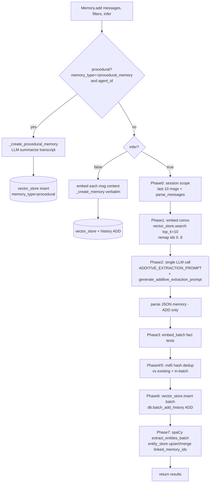

##### Flow: update

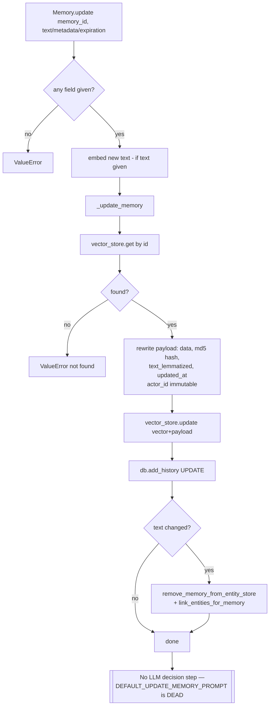

##### Flow: retrieve

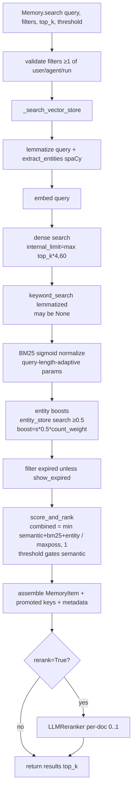

##### Flow: background

**None.** mem0 OSS has no background/scheduled work: no consolidation sweep, no decay job, no sleep/dream/reflection loop, no async projector rebuild. All maintenance (extraction, dedup, entity-linking, expiry filtering) is synchronous within `add`/`search`. The only background thread in the package is PostHog telemetry (`mem0/memory/telemetry.py`), which is not memory logic. Decay is a Platform-only feature that raises an error in OSS (`main.py:429`).

---

### MemOS

- **SHA / freshness:** `13fbd43743b3` (2026-07-09, pull=ok)
- **Facade:** memos.MOS → MOSCore (mem_os/main.py, mem_os/core.py)
- **Source of truth:** Neo4j property graph per MemCube (tree_text); preference=Milvus vectors, activation=in-proc KV dict, parametric=LoRA blob. No event log / no projector rebuild — store-primary.
- **Opaque / divergence notes:** PROMPTS.md is the retained, code-verified full-verbatim dump of all 118 prompt constants (templates/*.py x13, dream/prompts/*.py x4, retrieve/utils.py x2), each with packaging/hot_path/call_sites; spot-verified against independent reads of the resolver, motive, merge, reader and reorganize prompts. CORRECTIONS to prior passes: (1) datasketch deduplicate_preferences has ZERO call sites — MinHash dedup is unwired/dead; (2) MOSCore.update is a no-op warning for tree_text (tree.py:update raises NotImplementedError); (3) retrieval fusion is union-by-id + cross-encoder rerank, NOT RRF. OPAQUE: MemScheduler task-schedule/orm/webservice wiring is Redis/RabbitMQ-gated (13 prompts marked reserved); parametric/activation memory are storage shells with no distillation code path. Package MemoryOS==2.0.23; enable_mem_scheduler default False, thread startup; transformers+fastmcp in core (slim-core divergence).


Repo `D:\mem\MemOS` · package `MemoryOS` v2.0.23 · recorded SHA `13fbd43743b3` (full `13fbd43743b3b04b8c105a485f6c97729d26f776`; working HEAD `87d08434` at survey time).
Paths below are relative to `src/memos/`. Extends/corrects `ECOSYSTEM_COMPARISON.md` §3.4 and `ARCHITECTURE_FLOWS.md` §3.4 — divergences flagged in the last section.

#### Mental model

MemOS is a **Memory Operating System**: a façade (`MOS` / `MOSCore`) owning a registry of **MemCubes**, each MemCube bundling up to four memory kinds — textual, activation (KV-cache), parametric (LoRA), preference. It is **store-primary, not event-sourced**: the authoritative textual store is a **Neo4j property graph** ("the tree"); there is no append-only event log that projectors rebuild from. Prompt/README vocabulary frames a lifecycle *Generated → Activated → Merged → Archived → Frozen* (`templates/mos_prompts.py:MEMOS_PRODUCT_BASE_PROMPT`) managed by MemCube / MemScheduler / MemLifecycle / MemGovernance.

- Façade: `mem_os/main.py:MOS(MOSCore)` + `mem_os/core.py:MOSCore` — sync public API (`add`, `search`, `chat`, `update`, `delete`, `get`, `get_all`, `register_mem_cube`).
- Default rich store: `memories/textual/tree.py:TreeTextMemory` on Neo4j. Non-graph backends: `general.py:GeneralTextMemory`, `naive.py:NaiveTextMemory`.
- Write extraction: `mem_reader/simple_struct.py:SimpleStructMemReader` (sole LLM-heavy write component).
- Background: `MemScheduler` (`mem_scheduler/`, opt-in — `configs/mem_os.py` `enable_mem_scheduler` default **False**) + in-tree `organize/reorganizer.py:GraphStructureReorganizer` + Dream plugin (`dream/`, entry-point `memos.plugins → CommunityDreamPlugin`).

#### Source of truth

**Neo4j graph is the SoT for textual memory — no event log.**
- `organize/manager.py:MemoryManager._add_memories_batch` writes nodes directly via `graph_store.add_nodes_batch`. Embeddings, metadata, edges live only in the graph.
- Backend: `graph_dbs/neo4j.py:Neo4jGraphDB` (`[tree-mem]` → `neo4j>=5.28`). Other backends exist under `graph_dbs/` (nebular, polardb) but Neo4j is documented default.
- Activation SoT = in-process dict of KV tensors: `memories/activation/kv.py:KVCacheMemory.kv_cache_memories: dict[str, KVCacheItem]` (pickle dump/load, not graph).
- Parametric SoT = LoRA blob: `memories/parametric/lora.py:LoRAMemory`, `parametric/item.py:ParametricMemoryItem`.
- Preference SoT = **Milvus** vector rows (`[pref-mem]` → `pymilvus`) via `memories/textual/prefer_text_memory/` adders.
- No `memory_events` table, no projector-rebuild contract (ECOSYSTEM_COMPARISON row 1 confirms: store-primary; diverges from memspine's event-sourced core).

#### Write path

Entry: `mem_os/core.py:MOSCore.add(messages | memory_content | doc_path, mem_cube_id, ...)`.
1. Resolve cube (`get_user_cubes`, defaults to first accessible) and read `text_mem.mode` (`sync`/`async`).
2. Two parallel branches via `ContextThreadPoolExecutor(max_workers=2)`:
   - **textual**: if backend is `tree_text`, `mem_reader.get_memory(messages_list, type="chat", mode="fast" if async else "fine")` → per chat-window LLM extraction (`SIMPLE_STRUCT_MEM_READER_PROMPT`) → `parse_json_result` → `TextualMemoryItem[]` → `text_mem.add` → `TreeTextMemory.add` → `MemoryManager.add`. For non-tree backends, messages wrap directly as `TextualMemoryItem(memory=message["content"])` with **no LLM extraction**.
   - **preference**: if `enable_preference_memory`, `pref_mem.get_memory` (extractor LLM) → `pref_mem.add` (sync) or `PREF_ADD_TASK` scheduler message (async).
3. `MemoryManager.add` (`organize/manager.py:89`):
   - `_add_memories_batch` (default) writes graph nodes; each `LongTerm/User/ToolSchema/ToolTrajectory/RawFile/Skill/Preference` item becomes a graph node with a `working_binding` id linking to a WorkingMemory copy.
   - `fast` mode tags node `is_fast=True` "direct built from raw inputs" (skips heavy reasoning).
   - If `is_reorganize`, enqueues `QueueMessage(op="add")` to `GraphStructureReorganizer`.
   - `sync` mode: `_cleanup_working_memory` → `graph_store.remove_oldest_memory(WorkingMemory, keep_latest=20)` (FIFO cap).
4. `async` mode submits `ScheduleMessageItem` (label `MEM_READ_TASK`/`ADD_TASK`/`PREF_ADD_TASK`) to `MemScheduler`.
5. Fine-mode quality gates in reader: `rewrite_memories` (`SIMPLE_STRUCT_REWRITE_MEMORY_PROMPT`), `filter_hallucination_in_memories` (`SIMPLE_STRUCT_HALLUCINATION_FILTER_PROMPT`), optional `MEMORY_MERGE_PROMPT_EN`.

Default memory caps (`manager.py:75`): WorkingMemory 20 · LongTermMemory 1500 · RawFileMemory 1500 · UserMemory 480.

#### Update / conflict / patch path

There is **no in-place bitemporal patch**. Four mechanisms:
1. **Direct API** — `core.py:MOSCore.update(mem_cube_id, memory_id, item)`: for **tree_text this is a no-op** — it logs `"<backend> does not support update memory"` (`core.py:1028`; `tree.py:update` itself `raise NotImplementedError`). Only `general_text`/`naive` backends update by id.
2. **Conflict/redundancy resolution (background)** — `organize/handler.py:NodeHandler`:
   - `detect(memory, top_k=5)` — embedding neighbours (threshold `EMBEDDING_THRESHOLD=0.8`) → one LLM call per candidate (`MEMORY_RELATION_DETECTOR_PROMPT`) → `contradictory | redundant | independent`.
   - `resolve(a, b, relation)` — LLM fusion (`MEMORY_RELATION_RESOLVER_PROMPT`, `<answer>…</answer>`). `<answer>No</answer>` → `_hard_update` (parse both `updated_at`, **delete older node**, keep newer = last-writer-wins). Else → `_resolve_in_graph` (create merged node, inherit both edges, mark originals `status="archived"`, add `MERGED_TO` edges; `_merge_metadata` unions sources, re-embeds).
   - Driven from `reorganizer.py:handle_add`.
3. **Merge-on-add (reader)** — `MEMORY_MERGE_PROMPT_EN` consolidates new vs similar (`should_merge`/`merged_from`).
4. **Preference / feedback subsystems** — own update-decision prompts: `NAIVE_JUDGE_UPDATE_OR_ADD_PROMPT` family (`prefer_complete_prompt.py`) and `UPDATE_FORMER_MEMORIES` / `OPERATION_UPDATE_JUDGEMENT` (`mem_feedback_prompts.py`) — mem0-style ADD/UPDATE/NOOP over a batch.

#### Delete / forget / erasure

- **Hard delete by id**: `core.py:MOSCore.delete` → `TreeTextMemory.delete([id])` → `graph_store.delete_node`. `delete_all` drops the cube's text memory.
- **Soft delete / archival**: conflict resolution sets `status="archived"` (`handler.py:_resolve_in_graph`); nodes stay in graph, out of active scope. `tree.py:soft_delete` (621) flips status.
- **Working-memory eviction**: `_cleanup_working_memory` / `remove_oldest_memory(keep_latest=20)` — FIFO cap, not decay.
- **Backup pruning**: `tree.py:drop(keep_last_n=30)` + `_cleanup_old_backups` on on-disk dumps.
- No crypto-erasure, no tombstone events, no cascade. No event log to redact.

#### Retrieve / rank / assemble

Entry: `core.py:MOSCore.search(query, mode="fast"|"fine", top_k)` → per-cube parallel `search_textual_memory` + `search_preference_memory` → `TreeTextMemory.search` → `retrieve/searcher.py:Searcher.search`. Documented pipeline (`tree.py:search` docstring): *TaskGoalParser → MemoryPathResolver → GraphMemoryRetriever → MemoryReranker → MemoryReasoner*.
1. **Task parse** (fine only) — `retrieve/task_goal_parser.py:TaskGoalParser` + `TASK_PARSE_PROMPT`: keys, tags, goal_type, rephrased instruction, internet flag, 2–5 semantic expansions. Fast mode uses jieba/keyword split.
2. **Multi-source recall** — `retrieve/recall.py:GraphMemoryRetriever.retrieve` runs **four retrievers in parallel and UNIONS by node id** (no RRF): `_graph_recall` (Cypher), `_vector_recall` (Neo4j embedding), `_bm25_recall` (`bm25_util.py:EnhancedBM25` = `rank_bm25.BM25Okapi` + sklearn `TfidfVectorizer`), `_fulltext_recall`. Merge = `{item.id: item for item in graph+vector+bm25+fulltext}`.
3. **Rerank** — `reranker/factory.py:RerankerFactory` → `http_bge.py:HTTPBGEReranker` (remote cross-encoder) | `cosine_local.py:CosineLocalReranker` (cosine × level weight × usage) | strategy rerankers. Sort desc, trim `top_k` (`searcher.py:_sort_and_trim`). **Union + cross-encoder rerank, NOT reciprocal-rank fusion.**
4. **Reason (fine)** — `retrieve/reasoner.py:MemoryReasoner.reason` + `REASON_PROMPT` selects ids. PRO mode adds `COT_DECOMPOSE_PROMPT` decomposition + `SYNTHESIS_PROMPT` fusion (`mem_os/main.py:_chat_with_cot_enhancement`).
5. **Assemble for chat** — `MEMOS_PRODUCT_BASE_PROMPT` + `MEMOS_PRODUCT_ENHANCE_PROMPT` (citation `[i:memId]`, four-step memory-verification protocol, `REJECT_PROMPT` firewall gate), `MEMORY_ASSEMBLY_TEMPLATE`.

#### Background / sleep / consolidate / decay

**A. Graph reorganizer** (`organize/reorganizer.py:GraphStructureReorganizer`, when `is_reorganize`):
- Consumer thread `_run_message_consumer_loop` → `handle_add` runs conflict detect/resolve.
- Optimizer thread `_run_structure_organizer_loop` → `optimize_structure`: `_partition` LongTerm/User nodes into clusters (recursive, size 10–20) → `_local_subcluster` (`LOCAL_SUBCLUSTER_PROMPT`) → `_summarize_cluster` builds a **parent summary node** (`REORGANIZE_PROMPT`/`DOC_REORGANIZE_PROMPT`) linking children. Hierarchical consolidation, not decay.
- Inference edges: `relation_reason_detector.py` + `PAIRWISE_RELATION_PROMPT`, `INFER_FACT_PROMPT`, `AGGREGATE_PROMPT`, `REDUNDANCY_MERGE_PROMPT`.

**B. MemScheduler** (`mem_scheduler/`, opt-in, Redis/RabbitMQ `[mem-scheduler]`): monitor-driven working-memory management. `mem_scheduler_prompts.py`: `INTENT_RECOGNIZING_PROMPT`, `MEMORY_RERANKING_PROMPT`, `MEMORY_{FILTERING,REDUNDANCY_FILTERING,COMBINED_FILTERING}`, `MEMORY_ANSWER_ABILITY_EVALUATION`, `ENLARGE_RECALL`, `MEMORY_{RECREATE,REWRITE}_ENHANCEMENT`.

**C. Dream** (`dream/`, `CommunityDreamPlugin`): offline reflection. `motive.py:MotiveFormation` (`MOTIVE_FORMATION_PROMPT`) → `reasoning.py:ConsolidationReasoning` (`CONSOLIDATION_REASONING_PROMPT`) → `persistence.py` (CREATE/UPDATE/MERGE/ARCHIVE actions) → `diary.py`. Context nodes via `CONTEXT_BINDING_PROMPT` / `CONTEXT_SUMMARY_PROMPT`.

**Decay**: none. `grep -rniE "ebbinghaus|decay|exp\(-|forget"` over retrieve/reranker/organize returns no decay math. "Forgetting" = FIFO WorkingMemory eviction + archival status flips. Usage counts feed the cosine reranker weight (`cosine_local.py:get_weight`) but do not decay stored nodes.

#### Claims vs code (agree | diverge | opaque)

**AGREE**
- MemCube with activation/parametric/plaintext(+preference) kinds — `mem_cube/`, `memories/{activation,parametric,textual}/`. ✔
- Scheduler opt-in — `configs/mem_os.py` `enable_mem_scheduler` default `False`, threads default startup. ✔
- Façade `MOS`/`MOSCore` — `mem_os/main.py`, `mem_os/core.py`. ✔
- Hot-path rerank = `RerankerFactory` (the docstring "MemoryReranker" is a stage label) — `reranker/factory.py`. ✔
- `transformers` + `fastmcp` in **core** — `pyproject.toml` deps lines 41, 47 (slim-core divergence from memspine). ✔

**DIVERGE (corrections to prior docs)**
- `datasketch` MinHash-LSH is **pref-mem only AND currently unwired** — `prefer_text_memory/utils.py:deduplicate_preferences` has **no callers** at this SHA (`grep` confirms only the definition). Live preference dedup is vector-recall + LLM judge. Prior docs implying an active MinHash write-path are wrong.
- Retrieval fusion is **union-by-id + cross-encoder rerank**, not RRF (`recall.py:GraphMemoryRetriever.retrieve`). No reciprocal-rank-fusion constant exists.
- `MOSCore.update` on tree_text is a **no-op warning**, not a graph patch (`core.py:1028`, `tree.py:update` raises `NotImplementedError`). Tree "update" is effected only by the background conflict resolver.

**OPAQUE**
- MemScheduler task-schedule wiring (`mem_scheduler/task_schedule_modules/`, `orm_modules/`, `webservice_modules/`) is Redis/RabbitMQ-gated; which prompts fire at runtime depends on live monitors not exercised statically — those prompts are marked `reserved` in PROMPTS.md.
- Activation (KV-cache) and parametric (LoRA) memory are storage shells; the prompt-described parametric↔plaintext "distillation" lifecycle has no distillation code path in `memories/parametric/`.

#### Flows

##### Flow: write

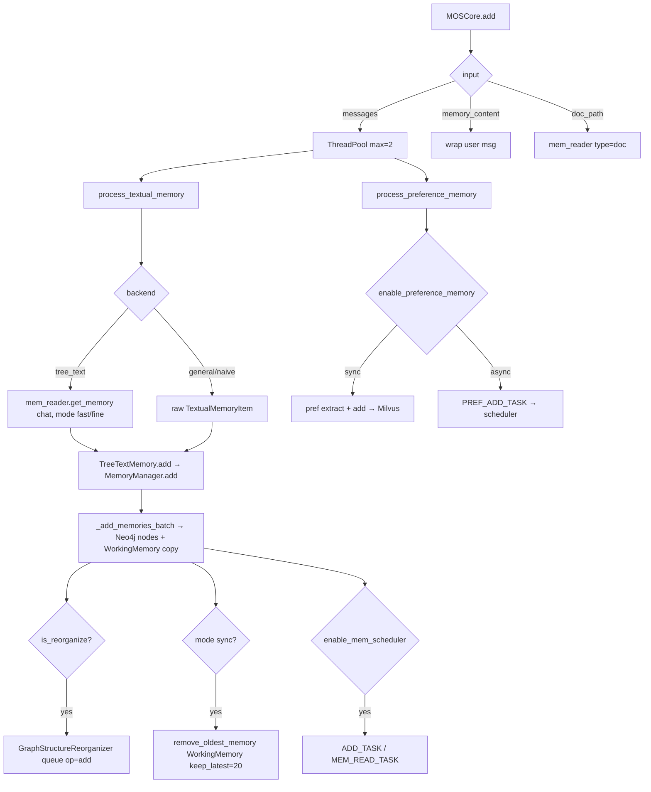

##### Flow: update

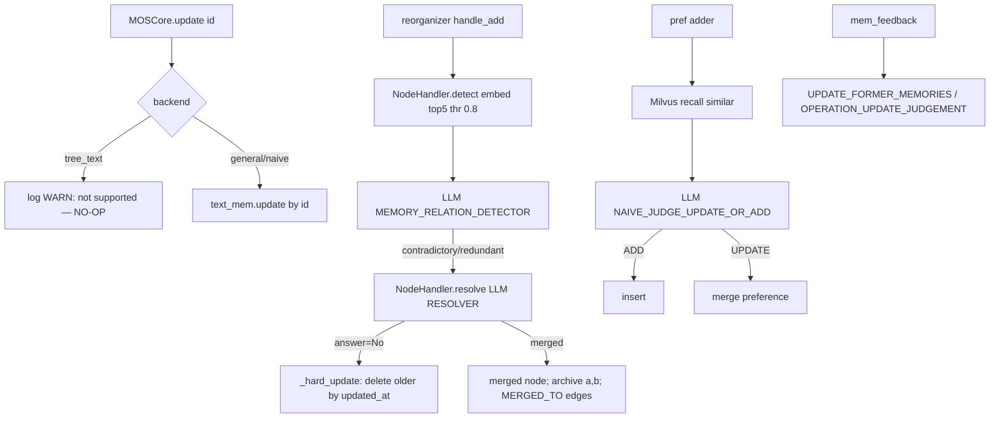

##### Flow: retrieve

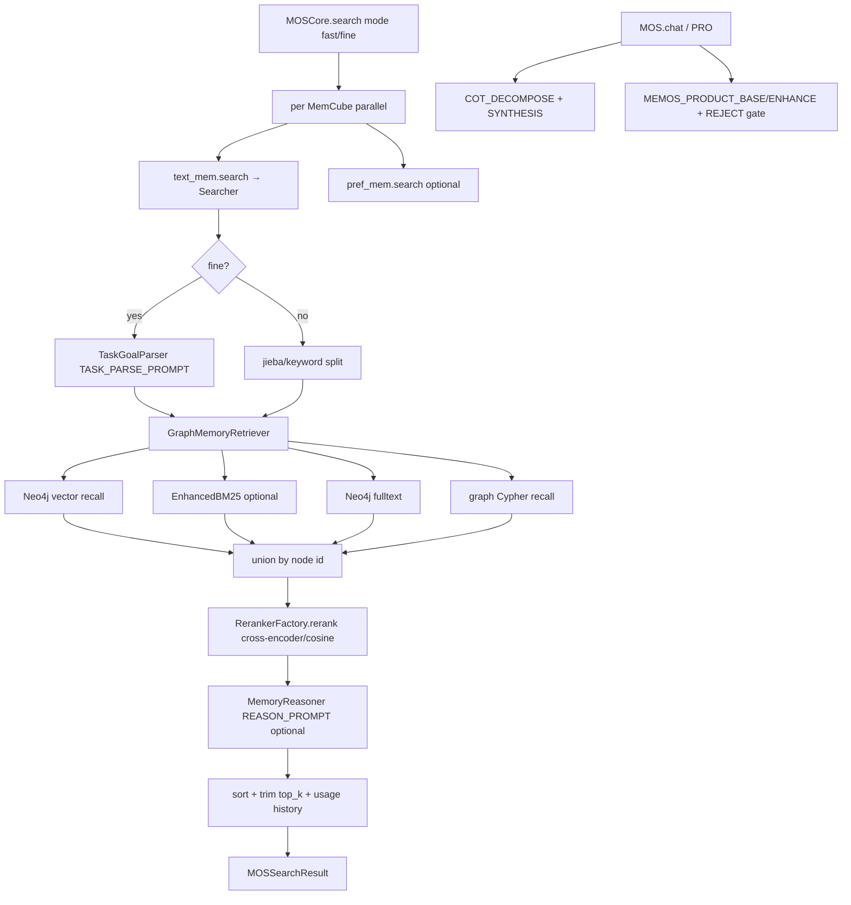

##### Flow: background

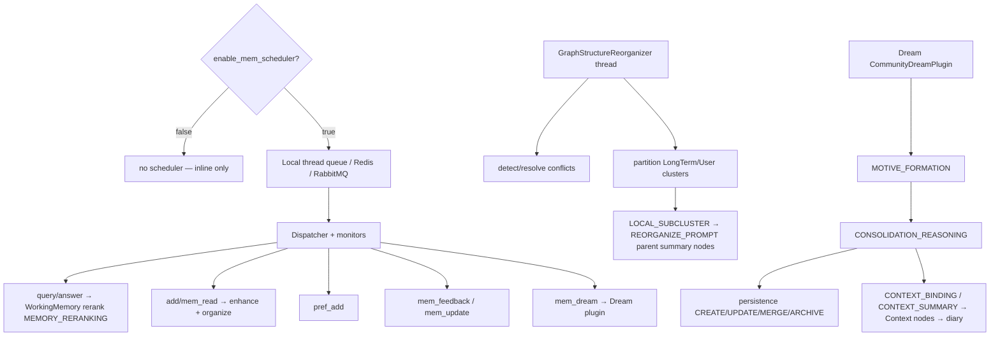

---

### honcho

- **SHA / freshness:** `73453f892d8a` (2026-07-10, pull=ok)
- **Facade:** FastAPI server (src/main.py + routers/*) with Python SDK Session/Peer (sdks/python); dialectic chat via DialecticAgent.answer (src/dialectic/core.py); ingest via crud.message.create_messages
- **Source of truth:** Postgres (row-of-record): models.Message (src/models.py:206) + models.Document observations (src/models.py:379); vector stores (pgvector/LanceDB/Turbopuffer) are rebuildable projectors, NOT event-sourced
- **Opaque / divergence notes:** Dreamer/surprisal default-enablement and production trigger cadence are config-gated (settings.DREAM.*), not verifiable from source. LanceDB-vs-Turbopuffer active adapter depends on settings.VECTOR_STORE.TYPE + MIGRATED at runtime. RRF hybrid applies only to message search; observation search is pure pgvector. No direct anthropic SDK dep (Anthropic backend hand-rolled). Prompt count = 8 discrete builders (deriver + dialectic + 4 dreamer + 2 summary); tool-description strings in agent_tools.py excluded.


Repo: `honcho` (Plastic Labs) · version `3.0.11` · recorded SHA `73453f892d8a`
Path: `D:\mem\honcho`. All citations are `file:symbol` within that tree.

#### Mental model

honcho is a **peer/session memory server** (FastAPI + Postgres), not an embeddable library.
The unit of ingest is a **message** attributed to a **peer** inside a **session** inside a
**workspace**. Messages are the durable log; everything else is derived. An async **deriver**
turns messages into **observations** (typed `Document` rows: `explicit | deductive | inductive
| contradiction`), a background **dreamer** runs agentic LLM specialists that create higher-level
observations and prune duplicates, and a **Dialectic Agent** answers natural-language questions
about a peer using a tool-calling loop over the observation + message stores.

Core loops:
- **Write**: `POST /messages` → `crud.message.create_messages` → `deriver.enqueue.enqueue` → queue
  → `deriver.consumer.process_item` → `deriver.deriver` (LLM extract) → `crud.representation`/`crud.document` (save + dedup).
- **Read**: `POST .../chat` (dialectic) → `dialectic.core.DialecticAgent.answer` → tool loop over
  `search_memory` (observations) + message-search tools; RRF hybrid for message search (`utils/search.py`).
- **Background**: `dreamer.dream_scheduler` schedules a dream per collection after inactivity →
  `dreamer.orchestrator.run_dream_cycle` → `dreamer.specialists` (deduction/induction agents);
  `reconciler.*` syncs embeddings to the external vector store and hard-deletes soft-deleted docs.

Design entry: `src/main.py` (FastAPI app), routers in `src/routers/*`, SDK facade `sdks/python`.

#### Source of truth

**Postgres is the single source of truth.** Two durable tables anchor it:
- `models.Message` (`src/models.py:206`) — append-oriented conversation log (content, peer_name,
  session_name, workspace_name, token_count, created_at). This is the raw episodic record.
- `models.Document` (`src/models.py:379`) — the derived observation store; `level` column
  (`utils/types.py:257` = `explicit|deductive|inductive|contradiction`), `source_ids` (JSONB,
  premise/evidence linkage), `times_derived` (reinforcement count), `embedding` (pgvector),
  `deleted_at` (soft-delete), `sync_state` (vector-store sync tracker).

Vector stores are **projectors, not sources of truth**: pgvector columns live in-row, but the
external store (LanceDB or Turbopuffer) is populated from Postgres by the reconciler
(`reconciler/sync_vectors.py`, `crud/document.py:cleanup_soft_deleted_documents`). Peer cards live
in `Peer.internal_metadata` JSONB (`crud/peer_card.py:get_peer_card`/`set_peer_card`), keyed by
`{observed}_peer_card`. Summaries live in `Session.internal_metadata` under `"summaries"`
(`utils/summarizer.py:SUMMARIES_KEY`). There is **no event-sourced append-only log** in the
memspine sense — Postgres rows are mutated/soft-deleted in place.

#### Write path

1. `crud.message.create_messages` (`src/crud/message.py`) inserts `Message` rows, computes
   token_count, and (if `settings.EMBED_MESSAGES`) queues message embeddings.
2. `deriver.enqueue.enqueue` (`src/deriver/enqueue.py:enqueue`) writes `QueueItem` rows
   (`models.QueueItem`, table `queue`) and **cancels any pending dreams** for the affected
   observed peers (`dream_scheduler.cancel_dreams_for_observed`) since the peer is active again.
3. `deriver.queue_manager` polls the queue; `deriver.consumer.process_item`
   (`src/deriver/consumer.py:38`) dispatches by `task_type`: `representation` →
   `process_representation_batch`, `summary`, `dream`, `deletion`, `reconciler`.
4. `deriver.deriver` (`src/deriver/deriver.py`, LLM call at line 149) builds
   `minimal_deriver_prompt` (`deriver/prompts.py:40`), calls `honcho_llm_call` with
   `response_model=PromptRepresentation`, `json_mode=True`, `retry_attempts=3`, and json-repair.
   Output is coerced via `Representation.from_prompt_representation` (`utils/representation.py`).
5. Observations are saved per-observer by `RepresentationManager.save_representation`
   (`crud/representation.py:60`): batch-embed via `embedding_client.simple_batch_embed`, then
   `crud.document.create_documents` (`crud/document.py:451`) with `deduplicate=settings.DERIVER.DEDUPLICATE`.
6. Summaries: after enough messages, `utils/summarizer.create_short_summary`/`create_long_summary`
   run their own LLM calls and store results in session metadata.

Only `explicit` observations come from the deriver; `deductive`/`inductive`/`contradiction` are
created later by the dreamer or by the dialectic agent's optional save-deduction tools.

#### Update / conflict / patch path

honcho has **no typed conflict ladder**; updates are handled two ways:

1. **Dedup-on-write (semantic supersession)** — `crud.document.is_rejected_duplicate`
   (`src/crud/document.py:1056`). New observation is compared to the nearest existing doc via cosine
   (`query_documents` with `max_distance=0.05`, i.e. cosine similarity ≥ 0.95). Whichever has more
   information (token-set score `len(tokens) + 10*unique_tokens`) wins: if new ≥ existing, the
   existing doc is **soft-deleted** and the new one inherits `times_derived+1`; else the new one is
   rejected and the existing doc's `times_derived` is incremented (`func.greatest`, concurrency-safe).
   Exact-content dedup is always on (`crud/document.py` ~line 432/524); semantic dedup is gated by
   `settings.DERIVER.DEDUPLICATE` (default on per capsule).
2. **Knowledge-update as new observation** — the dreamer's `DeductionSpecialist`
   (`dreamer/specialists.py:451`, system prompt line 549) is instructed to detect "same fact,
   different value over time", create a deductive update observation with `source_ids` linking old
   + new, and **delete the outdated observation** via the `delete_observations` tool. The dialectic
   agent's system prompt (`dialectic/prompts.py`, "HANDLING UPDATED INFORMATION" §) instructs the
   answer-time LLM to search for update language ("changed","rescheduled","now") and prefer the most
   recent statement — conflict resolution is thus **prompt-driven at read time**, not a stored patch.

There is no bitemporal validity model; recency is inferred from `created_at` and message timestamps.

#### Delete / forget / erasure

- **Soft delete** on `Document.deleted_at` (`src/models.py:406`). Duplicate supersession and
  dreamer/dialectic `delete_observations` set `deleted_at`; the row survives briefly.
- **Reconciled hard delete** — `crud.document.cleanup_soft_deleted_documents`
  (`src/crud/document.py:1144`): for docs soft-deleted > 5 min ago, delete vectors from the external
  store per-namespace, then `DELETE` the Postgres rows (only where vector deletion succeeded).
  Uses `FOR UPDATE SKIP LOCKED` for multi-worker safety.
- **Cascade deletes** via a queued `deletion` task (`deriver/consumer.py:200 process_deletion`):
  `deletion_type ∈ {session, observation, workspace}` → `crud.delete_session`/`delete_document_by_id`/
  `delete_workspace`, emitting a `DeletionCompletedEvent` with counts. Session/workspace deletes
  cascade to messages + conclusions (documents).
- No user-facing "forget by content" beyond deleting the observation/session/workspace resource.

#### Retrieve / rank / assemble

Two distinct retrieval surfaces:

1. **Message search (hybrid RRF)** — `utils/search.py:search` (`src/utils/search.py:314`).
   Runs semantic search (pgvector cosine via `_semantic_search_pgvector`, or external-store IDs via
   `query_external_vector_message_ids`) **and** Postgres full-text search
   (`_fulltext_search`: `to_tsvector('english')` + `plainto_tsquery` ranked by `ts_rank`, with an
   ILIKE fallback for special-char queries). The two ranked lists are fused by
   `reciprocal_rank_fusion` (`utils/search.py:36`, `RRF = Σ 1/(k+rank)`, `k=60`). If embeddings are
   disabled, FTS-only. `peer_perspective` filter restricts to sessions the peer was a member of
   within `[joined_at, left_at]` windows (`_filter_by_peer_perspective`).
2. **Observation search (semantic)** — `crud.representation.query`/`crud.document.query_documents`
   (`src/crud/document.py:336`): pgvector cosine (`_pgvector_similarity_search`, HNSW index,
   `max_distance` cutoff) or external-store lookup. No FTS/RRF on observations — pure vector.

**Assembly** happens inside the **Dialectic Agent** (`dialectic/core.py:DialecticAgent`):
- System prompt = `dialectic.prompts.agent_system_prompt` (peer-card-aware, directional vs global).
- `_prefetch_relevant_observations` (`core.py:154`) does two `search_memory` calls (explicit vs
  deductive/inductive/contradiction, 10 or 25 each by reasoning level) and injects results as
  markdown into the user turn.
- Optional `SESSION HISTORY` block appended to the system prompt (`_initialize_session_history`).
- The agent then runs a tool loop (`honcho_llm_call` with `DIALECTIC_TOOLS`) — `search_memory`,
  `get_reasoning_chain`, `search_messages`, `grep_messages`, `get_messages_by_date_range`,
  `search_messages_temporal`, etc. (`utils/agent_tools.py`) — and synthesizes an answer, streaming
  optionally (`answer_stream`). Reasoning level (`minimal|low|…`) picks model, tool set, token caps.

#### Background / sleep / consolidate / decay

- **Dreamer (the "sleep" cycle)** — `dreamer.dream_scheduler.DreamScheduler`
  (`src/dreamer/dream_scheduler.py`) schedules a dream per collection (work-unit key) after an
  inactivity delay / document threshold; new activity cancels pending dreams (`enqueue`).
  `dreamer.orchestrator.run_dream_cycle` (`src/dreamer/orchestrator.py:80`) optionally runs
  **surprisal sampling** (§below) to pick high-surprisal observations as exploration *hints*, then
  runs the `SPECIALISTS` (`dreamer/specialists.py:769`): `DeductionSpecialist` (logical implications,
  knowledge updates, contradictions, peer-card writes, dedup deletes) and `InductionSpecialist`
  (behavioral patterns/preferences/traits, ≥2 sources). Each is a bounded tool-calling agent
  (`BaseSpecialist.run`, max 10–12 iterations).
- **Surprisal sampling** — `dreamer.surprisal.sample_observations_with_surprisal`
  (`src/dreamer/surprisal.py:46`): builds a spatial tree (`rptree|covertree|lsh`,
  `dreamer/trees/*`) over observation embeddings, computes geometric surprisal per observation
  (`tree.surprisal`), normalizes to [0,1] (min-max), keeps the top-percent. Purely for *targeting*
  the dreamer — not a decay mechanism.
- **Reconciler** — `reconciler/scheduler.py` periodically enqueues `sync_vectors` (push pending
  `Document`/`MessageEmbedding` rows to the external vector store, clean up soft-deletes) and
  `cleanup_queue` (prune old queue items). `reconciler/embed_now.py` for on-demand embedding.
- **No Ebbinghaus/time-decay of memory strength.** `times_derived` is a monotonic *reinforcement*
  counter (grows on re-derivation), the inverse of decay. There is no scheduled forgetting; the only
  removal is dedup supersession + explicit deletion.

#### Claims vs code (agree | diverge | opaque)

- **AGREE — "Dialectic API; theory-of-mind deriver; peer/session representation"** (task note):
  confirmed. Dialectic Agent = `dialectic/core.py`; deriver extracts peer observations
  (`deriver/prompts.py`, "target peer" / observer-vs-observed framing = theory-of-mind);
  peer/session are first-class (`models.Peer`, `models.Session`, `SessionPeer`).
- **AGREE — "4 document levels"** (ECOSYSTEM_COMPARISON.md:117): confirmed exactly —
  `explicit | deductive | inductive | contradiction` (`utils/types.py:257`).
- **AGREE — "pgvector default + RRF hybrid search + optional post-deriver cosine dedup"**
  (ECOSYSTEM_COMPARISON.md:165,978): confirmed. Default `VECTOR_STORE.TYPE` is pgvector;
  RRF in `utils/search.py:reciprocal_rank_fusion`; cosine dedup in `is_rejected_duplicate`
  (≥0.95). **Nuance to record:** RRF is **message search only**; observation search is pure vector.
- **AGREE — "deriver + dreamer + MCP; JWT when enabled"**: deriver/dreamer confirmed; JWT in
  `src/security.py` (`pyjwt` dep); MCP server lives under top-level `mcp/`.
- **DIVERGE — memspine "event-sourced core / rebuildable projectors"**: honcho is **not
  event-sourced**. Postgres rows are the SoT and are mutated/soft-deleted in place; vector stores
  are projectors but there is no append-only `memory_events` log. Record honcho as
  "row-of-record + projector", not "event log + projector".
- **AGREE — "8 inline prompts"** (ECOSYSTEM_COMPARISON.md:117): confirmed —
  1 deriver + 1 dialectic + 4 dreamer (2 system + 2 user) + 2 summary = 8 discrete prompt builders
  (see PROMPTS.md). All are Python f-string/`cleandoc` inline constants; none externalized to YAML.
- **OPAQUE — surprisal effectiveness / whether dreamer runs by default in production**: code is
  present and gated by `settings.DREAM.*` / `settings.DREAM.SURPRISAL.ENABLED`; default enablement
  and real-world trigger cadence are config-driven, not verifiable from source alone.
- **OPAQUE — LanceDB vs Turbopuffer selection at runtime**: both adapters exist
  (`vector_store/lancedb.py`, `vector_store/turbopuffer.py`); which is active depends on
  `settings.VECTOR_STORE.TYPE` + `MIGRATED`, not determinable statically.

#### Flows

##### Flow: write

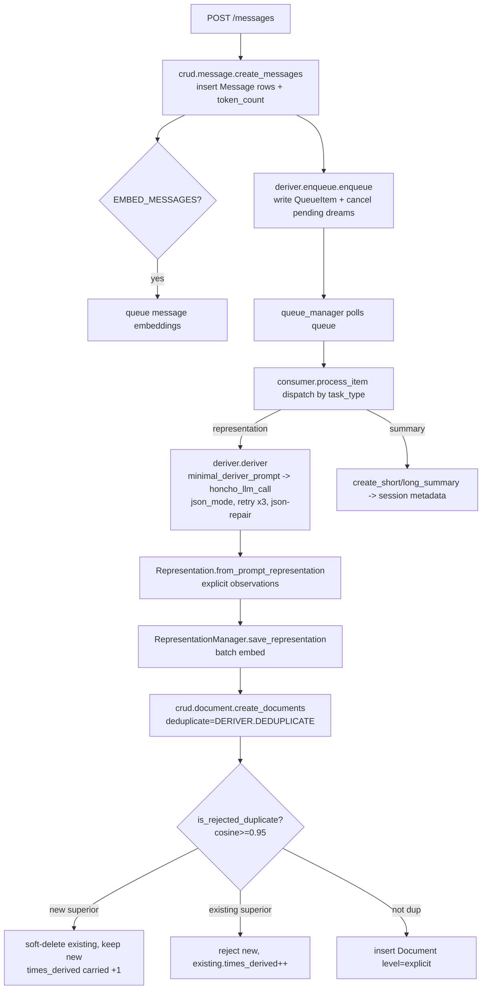

##### Flow: update

```mermaid
flowchart TD
  A[New explicit observation] --> B[create_documents dedup]
  B --> C{cosine dist <= 0.05?}
  C -->|no| D[stored as new fact]
  C -->|yes| E[token-set info score compare]
  E -->|new >= existing| F[existing.deleted_at set<br/>new inherits times_derived+1]
  E -->|existing > new| G[new rejected<br/>existing reinforced]
  H[Dreamer DeductionSpecialist] --> I{same fact, new value over time?}
  I -->|yes| J[create deductive update obs<br/>source_ids link old+new]
  J --> K[delete_observations old obs -> soft-delete]
  L[Dialectic read-time] --> M[prompt: search 'changed/now/rescheduled'<br/>prefer most recent, flag contradictions]
```

##### Flow: retrieve

```mermaid
flowchart TD
  A[POST .../chat query] --> B[DialecticAgent.__init__<br/>agent_system_prompt observer/observed + peer cards]
  B --> C[_initialize_session_history<br/>append SESSION HISTORY block]
  C --> D[_prefetch_relevant_observations<br/>2x search_memory: explicit vs derived]
  D --> E[inject prefetched obs as markdown into user turn]
  E --> F[honcho_llm_call tool loop DIALECTIC_TOOLS]
  F --> G[search_memory<br/>pgvector cosine on documents]
  F --> H[search_messages / search_messages_temporal<br/>utils.search RRF: semantic + FTS, k=60]
  F --> I[grep_messages exact ILIKE]
  F --> J[get_reasoning_chain<br/>traverse source_ids graph]
  G --> K[synthesize answer]
  H --> K
  I --> K
  J --> K
  K --> L[answer / answer_stream to client]
```

##### Flow: background

```mermaid
flowchart TD
  A[DreamScheduler: inactivity delay / doc threshold per collection] --> B{new activity?}
  B -->|yes| C[cancel_dreams_for_observed -> abort]
  B -->|no| D[enqueue dream task]
  D --> E[consumer.process_dream -> orchestrator.run_dream_cycle]
  E --> F{SURPRISAL.ENABLED?}
  F -->|yes| G[sample_observations_with_surprisal<br/>tree S=-logP, normalize, top-percent]
  G --> H[high-surprisal obs -> exploration hints]
  F -->|no| I[specialists explore freely]
  H --> J[DeductionSpecialist agent loop<br/>create_observations_deductive, delete dups, update_peer_card]
  I --> J
  J --> K[InductionSpecialist agent loop<br/>create_observations_inductive >=2 sources]
  L[reconciler.scheduler] --> M[sync_vectors: push pending docs/embeddings to external store]
  M --> N[cleanup_soft_deleted_documents: hard-delete >5min old + vectors]
  L --> O[cleanup_queue: prune old queue items]
```

---

### OpenMemory

- **SHA / freshness:** `9af0f95f8ecd` (2026-06-27, pull=ok)
- **Facade:** packages/openmemory-py main.py:Memory (add/search/get/delete/delete_all/history/source); JS production = opm serve REST+MCP (server/index.ts); MCP tools ai/mcp.py
- **Source of truth:** SQLite (mutated in place, no event log): memories + vectors + waypoints + temporal_facts + temporal_edges + users (migrations/001_initial.sql). Default vector backend = brute-force SQLite cosine; Postgres/pgvector or Valkey/Redis optional.
- **Opaque / divergence notes:** No internal LLM in memory pipeline: classification/reflection/summary/dedup all regex/heuristic (grep evidence in PROMPTS.md). Only LLM prompt is the OpenAI-proxy memory-context injection (openai_handler.py:34/69); Bedrock message-scaffold and MCP tool descriptions annotated but not counted. Default embeddings = synthetic hash vectors, not OpenAI (corrects ARCHITECTURE_FLOWS 'openai+sqlite' note). Temporal facts NOT fused into hsg_query except via MCP 'unified' tool; apply_confidence_decay unscheduled in Python. JS decay always scheduled, reflection opt-in (OM_AUTO_REFLECT default false); Python reflection default-on. Some copy-paste artifacts (dup imports, on_query_hit double salience assign) noted, non-load-bearing. Dual-language monorepo: py v1.3.2 (MCP-first SDK) + js v1.3.3 (production server), structural mirrors.


- **Repo:** OpenMemory (owner `nullure`)
- **SHA:** 9af0f95f8ecd
- **Language split:** dual monorepo. **`packages/openmemory-py`** (v1.3.2, Python SDK — MCP-first; a FastAPI `server/` exists but `main.py:Memory` is the shipped facade and `main.py:__main__` prints *"Server mode removed. Use 'mcp'"*). **`packages/openmemory-js`** (v1.3.3, TypeScript — the production **`opm serve`** REST+MCP server; near-1:1 port of the Python module tree). Plus `dashboard/` (Next.js UI) and `apps/vscode-extension`. The two engine trees are structural mirrors: `memory/hsg`, `ops/dynamics`, `memory/decay`, `memory/reflect`, `memory/embed`, `temporal_graph/*` exist in both. Citations below are Python unless prefixed `[JS]`; JS divergences are called out.

---

#### Mental model

OpenMemory is a **Hyper-Sonic-Graph (HSG)** engine: every memory is one SQLite row tagged with a **primary cognitive sector** plus additional sectors, embedded **once per sector**, and linked to other memories by weighted **waypoints** (an associative graph). Retrieval is a hybrid score (per-sector cosine + token overlap + waypoint weight + recency + tag match, squashed through a sigmoid) with **waypoint BFS expansion** when confidence is low. A parallel, independent **bitemporal fact graph** (`temporal_facts` / `temporal_edges`, subject-predicate-object with `valid_from`/`valid_to`/`confidence`) stores structured facts. Background dynamics — **Ebbinghaus decay**, **retrieval reinforcement**, **heuristic reflection/consolidation**, **user-summary generation**, **waypoint pruning** — mutate salience and links over time.

Crucially, **there is no internal LLM in the memory pipeline.** Sector classification, essence extraction, reflection clustering, and user summaries are **regex/heuristic**. LLMs appear only as (a) pluggable *embedding* providers (default `synthetic` = deterministic hash vectors) and (b) an optional OpenAI-client *proxy* that injects retrieved memories into the user's own chat call. See `## Claims vs code`.

- HSG core: `memory/hsg.py:add_hsg_memory`, `memory/hsg.py:hsg_query`
- Sector definitions (5): `core/constants.py:SECTOR_CONFIGS` — `episodic, semantic, procedural, emotional, reflective`
- Facade: `main.py:Memory` (`add/search/get/delete/delete_all/history/source`)

#### Source of truth

**SQLite** is the sole durable store (no event log; state is mutated in place). Schema: `migrations/001_initial.sql`.

- **`memories`** — one row per memory: `id, content, primary_sector, sectors, tags, meta, user_id, segment, created_at, updated_at, last_seen_at, salience, decay_lambda, version, mean_dim, mean_vec (BLOB), compressed_vec (BLOB), simhash, feedback_score`. Written by `core/db.py:Queries.ins_mem`.
- **`vectors`** — `(id, sector, user_id, v BLOB, dim)`, PK `(id, sector)`. One vector per sector plus a synthetic `_mean` sector row. Written by `core/vector_store.py:SQLiteVectorStore.storeVector`.
- **`waypoints`** — `(src_id, dst_id, dst_sector, user_id, weight, created_at, updated_at)`, PK `(src_id, dst_id)`. The associative graph.
- **`temporal_facts`** — bitemporal SVO: `(id, subject, predicate, obj, valid_from, valid_to, confidence, metadata)`. `temporal_graph/store.py:insert_fact`.
- **`temporal_edges`** — fact-to-fact relations `(source_id, target_id, relation, valid_from, valid_to, weight)`.
- **`users`** — `(user_id, summary, reflection_count, ...)`; **`embed_logs`**, **`stats`** — telemetry.

Default vector backend is **brute-force SQLite cosine** over all rows in a sector (`core/vector_store.py:SQLiteVectorStore.search`, L67-89: loads every `v` for the sector, numpy dot/norm, sorts). `core/vector_store.py:get_vector_store` switches to Postgres (pgvector) or Valkey/Redis via `OPENMEMORY_VECTOR_STORE` env. `[JS]` mirrors: `core/vector_store.ts`, `core/vector/postgres.ts`, `core/vector/valkey.ts`.

#### Write path

`main.py:Memory.add` → `ops/ingest.py:ingest_document` → (per section) `memory/hsg.py:add_hsg_memory`.

1. **Ingest & extract** (`ops/ingest.py:ingest_document`): `ops/extract.py:extract_text` normalizes input (pdf/docx/html/audio/video/plain). If `estimated_tokens > 8000` (`LG`), a **root-child split** runs (`ingest.py:split_text` on `\n\n`, ~3000-char sections `SEC`): a root summary memory (`mk_root`, `primary_sector="reflective"`, `salience=1.0`) plus child memories (`mk_child`→`add_hsg_memory`), each linked root→child via a weight-1.0 waypoint (`ingest.py:link`). Otherwise a single `add_hsg_memory`.
2. **Dedup gate** (`hsg.py:add_hsg_memory` L390-403): `compute_simhash(content)` → look up existing row with same simhash → if `hamming_dist ≤ 3`, **no new row**; bump existing `salience += 0.15` (cap 1.0), refresh `last_seen_at`, return `{deduplicated: True}`.
3. **Classify sectors** (`hsg.py:classify_content`): regex pattern hit-count × sector weight over `SECTOR_CONFIGS`; picks `primary` + `additional` sectors (those ≥ 30% of primary score). `metadata.sector` short-circuits with confidence 1.0.
4. **Segment rotation**: rows bucketed into `segment` groups of `env.seg_size`; new segment when full (L419-426).
5. **Store row**: `extract_essence` (extractive summary if `use_summary_only`) → `q.ins_mem` with `init_sal = 0.4 + 0.1·len(additional)` (cap 1.0) and `decay_lambda` from the primary sector.
6. **Embed** (`memory/embed.py:embed_multi_sector`): one vector per sector via `emb_dispatch(env.emb_kind, ...)` — **default `synthetic`** (`ai/synthetic.py`, hash-based), optional `openai/ollama/gemini/aws/minimax`. Each stored via `store.storeVector`.
7. **Mean vector**: `embed.py:calc_mean_vec` averages sector vectors → written to `memories.mean_vec` and stored as a `_mean` sector vector for ANN (Issue #141). If dim > 128, an avg-pooled `compressed_vec` is also stored.
8. **Waypoint bootstrap**: `hsg.py:create_single_waypoint` links the new memory to its nearest existing `_mean` neighbor (ANN search, DB-exhaustive fallback), or a self-loop if none.
9. **User summary**: if `user_id`, `memory/user_summary.py:update_user_summary` regenerates a heuristic profile string.

**Temporal facts** take a separate write path: `temporal_graph/store.py:insert_fact` (invoked from `ai/mcp.py` "store" tool with `type in {factual, both}`), which also auto-closes prior open facts for the same `(subject, predicate)` — see Update path.

#### Update / conflict / patch path

There is **no content-patch/replace API** for HSG memories. "Updates" are:

- **Dedup-merge** (write path step 2): a near-duplicate write mutates the existing row's salience instead of inserting (`hsg.py:add_hsg_memory` L393-403). Closest thing to an update.
- **Salience reinforcement**: retrieval hits raise salience (`ops/dynamics.py:applyRetrievalTraceReinforcementToMemory`: `sal + 0.18·(1−sal)`) and propagate to waypoint neighbors (`propagateAssociativeReinforcementToLinkedNodes`); decay lowers it over time.
- **Waypoint reweighting**: `create_contextual_waypoints` (+0.1 on re-observation), `reinforce_waypoints` (+0.05 along traversed paths).
- **Temporal-fact conflict resolution (the real update/conflict engine)**: `temporal_graph/store.py:insert_fact` L24-26 — inserting a new fact for an existing `(subject, predicate)` whose `valid_to IS NULL` **closes the old fact** by setting `valid_to = new.valid_from − 1`. `update_fact` patches confidence/metadata; `invalidate_fact` sets `valid_to`; `query.py:find_conflicting_facts` surfaces overlapping-validity facts. Standard bitemporal supersession, not LLM-mediated.

#### Delete / forget / erasure

- **Hard delete by id**: `main.py:Memory.delete` → `core/db.py:Queries.del_mem` — deletes the `memories` row **and** all `waypoints` where it is `src_id`/`dst_id` (L125-128), then `clear_cache()`. (`del_mem` does not delete `vectors` rows; `del_mem_by_user` does.)
- **Delete all for a user**: `Memory.delete_all` → `del_mem_by_user` — cascades `vectors`, `waypoints`, `memories` for that `user_id` (L131-134).
- **Soft forgetting via decay**: `memory/decay.py:apply_decay` shrinks salience; below tiers it **compresses / fingerprints** vectors (collapse to 32-dim hash, `fingerprint_mem`) — lossy erasure of the embedding rather than row deletion.
- **Waypoint pruning**: `hsg.py:prune_weak_waypoints` deletes waypoints with `weight < 0.05` (background, weekly in `[JS]`).
- **Temporal**: `store.py:delete_fact` (hard), `invalidate_fact` (tombstone via `valid_to`).

#### Retrieve / rank / assemble

`main.py:Memory.search` → `memory/hsg.py:hsg_query`.

1. **Cache**: 60 s in-memory cache keyed by `query:k:filters` (L527-530).
2. **Classify query** (`classify_content`) → primary sector drives per-dimension weights `w` (L540-546).
3. **Embed query per sector** (`embed_query_for_all_sectors`) and per-sector **vector search** `store.search(qv, sector, k·3, {user_id})` (brute-force cosine).
4. **Adaptive expansion**: `avg_top` similarity → `adapt_exp = ceil(0.3·k·(1−avg_top))`; `high_conf = avg_top ≥ 0.55`. If **not** high-confidence, **waypoint BFS expansion** `expand_via_waypoints(ids, k·2)` pulls in graph neighbors (weight decay 0.8/hop, cutoff 0.1).
5. **Per-candidate scoring** (L578-634): `calc_multi_vec_fusion_score` (weighted per-sector cosine) → `calculateCrossSectorResonanceScore` (5×5 `SECTORAL_INTERDEPENDENCE_MATRIX` in `ops/dynamics.py`) → cross-sector **penalty** from `SECTOR_RELATIONSHIPS` if memory sector ≠ query sector → `calc_decay`-adjusted salience → token overlap, keyword overlap (`utils/keyword.py`), recency (`decay.py:calc_recency_score`), tag match → **`compute_hybrid_score`** = `sigmoid(0.35·boostedSim + 0.20·overlap + 0.15·waypoint + 0.10·recency + 0.20·tagMatch + kw)` where `boostedSim = 1 − e^(−3·sim)`.
6. **Sort by score, take top-k** (L636-637).
7. **Reinforce on read** (L638-656): raise salience of returned rows (`applyRetrievalTraceReinforcementToMemory`), propagate to waypoint neighbors (`propagateAssociativeReinforcementToLinkedNodes` + a γ-weighted context boost), and `on_query_hit` re-embeds cold (dim≤64) vectors and bumps salience again.
8. **Assemble**: returns `{id, content, score, primary_sector, path, salience, tags, metadata}`. No LLM answer synthesis inside the engine.

**Memory-injected answering** (SDK convenience, not engine core): `openai_handler.py:OpenAIRegistrar.register` monkey-patches a user's OpenAI client so each `chat.completions.create` first `search()`es (limit 3) and prepends `"relevant context from memory:\n- …"` to the system message, then stores the `user:/assistant:` turn back via `Memory.add`.

#### Background / sleep / consolidate / decay

No unified "sleep cycle" contract; independent timers.

- **Decay** (`memory/decay.py:apply_decay`): tiered Ebbinghaus. Skips if queries active or within 60 s cooldown. Per segment, samples `decay_ratio` (~3%) of rows, tiers them `hot/warm/cold` (`pick_tier`), applies `f = e^(−λ·dt/(sal+0.1))`; if `f<0.7` compresses the vector, if `f<max(0.3, cold_threshold)` **fingerprints** (32-dim hash summary). `[JS]` `server/index.ts` L101-132: decay **always** scheduled (`setInterval` + 3 s initial run); **weekly** waypoint prune (L112-123).
- **Reflection / consolidation** (`memory/reflect.py:run_reflection`): fetch ≤100 memories (needs ≥ `reflect_min`≈20), **cluster** non-reflective same-sector memories by Jaccard token similarity > 0.8 (`cluster`), and for clusters of ≥2 write a heuristic `auto_reflect` memory (`summ` = `"N sector pattern: …"`), mark sources `consolidated`, boost their salience ×1.1. **No LLM.** Loop gated by `env.auto_reflect` (`start_reflection`; **default `True` in Python** L140, but `[JS] reflect.ts:start_reflection` is **opt-in** — `if (!env.auto_reflect) return`, default false, aligns with `OM_AUTO_REFLECT`).
- **User summary** (`memory/user_summary.py:user_summary_loop`): every ~30 min, regenerate heuristic profile strings for all users.
- **Confidence decay (temporal)**: `temporal_graph/store.py:apply_confidence_decay` — `confidence·(1 − rate·age_days)`, floor 0.1. Present but not wired into any scheduler in the Python tree.

#### Claims vs code

**AGREE**
- README/ARCHITECTURE "HSG five-sector" — confirmed `core/constants.py:SECTOR_CONFIGS` (episodic, semantic, procedural, emotional, reflective).
- Bitemporal temporal graph with conflict/supersession — confirmed `temporal_graph/store.py:insert_fact` + `query.py:find_conflicting_facts`.
- Waypoint associative graph + salience decay/reinforcement — confirmed `ops/dynamics.py`, `memory/hsg.py`, `memory/decay.py`.
- Continuity-doc claim "default vector = brute-force SQLite" — confirmed `core/vector_store.py:SQLiteVectorStore.search`.
- Continuity-doc claim "JS decay always scheduled, reflection opt-in; Python reflect wired, batch/confidence-decay unwired" — confirmed.

**DIVERGE / nuance**
- **ARCHITECTURE_FLOWS "openai + sqlite"**: embedding default is **`synthetic`** (deterministic hash), *not* OpenAI. OpenAI only if `env.emb_kind == "openai"`. `memory/embed.py:emb_dispatch` default branch → `SyntheticAdapter`.
- **"MCP-only (Python)"**: accurate for the *shipped* entrypoint (`main.py` disables serve), though a full FastAPI `server/` tree exists in the Python package (dormant).
- **Any "LLM extraction/summarization"** implied by an AI-memory engine: **absent.** Reflection, classification, essence, user-summary all regex/heuristic (see PROMPTS.md grep evidence). Only LLM in loop = embeddings + optional OpenAI proxy injection.

**OPAQUE**
- Whether temporal facts surface inside `hsg_query`: code shows they do **not** — HSG and temporal are queried independently; only `ai/mcp.py` "search" tool with `type=unified` fuses them at the tool layer. No auto-extraction populates `temporal_facts`; facts must be supplied explicitly via the MCP "store" tool.
- Duplicated statements in `hsg.py` (repeated import L23-24, `"salience": sal` twice L617-618) and `decay.py:on_query_hit` overwriting `new_sal` (+0.15 then +0.5, L206-207) look like copy-paste artifacts; last assignment wins. Noted, not load-bearing.

#### Flows

##### Flow: write

```mermaid
flowchart TD
  A[Memory.add content] --> B[ingest_document: extract_text]
  B --> C{est_tokens > 8000?}
  C -- yes --> D[split_text into sections]
  D --> E[mk_root reflective salience=1.0]
  E --> F[mk_child -> add_hsg_memory per section]
  F --> G[link root->child waypoint w=1.0]
  C -- no --> H[add_hsg_memory single]
  H --> I[compute_simhash]
  I --> J{hamming<=3 dup?}
  J -- yes --> K[bump existing salience +0.15, return deduplicated]
  J -- no --> L[classify_content regex sectors]
  L --> M[extract_essence + q.ins_mem row init_sal]
  M --> N[embed_multi_sector per sector - default synthetic]
  N --> O[store per-sector vectors + _mean + compressed_vec]
  O --> P[create_single_waypoint nearest _mean]
  P --> Q[update_user_summary heuristic]
```

##### Flow: update

```mermaid
flowchart TD
  subgraph HSG memories - no patch API
    A[re-add near-duplicate] --> B[simhash+hamming match]
    B --> C[salience += 0.15, refresh last_seen]
    D[retrieval hit] --> E[applyRetrievalTraceReinforcement sal += 0.18*(1-sal)]
    E --> F[propagate to waypoint neighbors + gamma boost]
    G[re-observe pair] --> H[create_contextual_waypoints weight += 0.1]
  end
  subgraph Temporal facts - real conflict engine
    I[insert_fact subject,predicate,obj] --> J{open fact for same s,p?}
    J -- yes and older --> K[close old: valid_to = new.valid_from - 1]
    J -- no --> L[insert with valid_to NULL]
    M[update_fact] --> N[patch confidence/metadata]
    O[invalidate_fact] --> P[set valid_to tombstone]
  end
```

##### Flow: retrieve

```mermaid
flowchart TD
  A[Memory.search query] --> B[hsg_query]
  B --> C{cache hit < 60s?}
  C -- yes --> Z[return cached]
  C -- no --> D[classify_content query -> sector weights]
  D --> E[embed query per sector]
  E --> F[store.search per sector brute-force cosine k*3]
  F --> G{avg_top_sim >= 0.55?}
  G -- no --> H[expand_via_waypoints BFS neighbors]
  G -- yes --> I[skip expansion]
  H --> J[score candidates]
  I --> J
  J --> K[multi_vec_fusion + cross-sector resonance matrix]
  K --> L[cross-sector penalty + decay-adj salience]
  L --> M[compute_hybrid_score sigmoid weighted]
  M --> N[sort desc, take top-k]
  N --> O[reinforce salience + propagate + on_query_hit re-embed cold]
  O --> P[return id,content,score,sector,path,salience,tags]
```

##### Flow: background

```mermaid
flowchart TD
  subgraph Decay JS always / PY on-demand
    A[timer setInterval] --> B{active queries or 60s cooldown?}
    B -- yes --> C[skip]
    B -- no --> D[sample ~3% per segment, tier hot/warm/cold]
    D --> E[f = exp -lambda*dt/(sal+0.1); new_sal = sal*f]
    E --> F{f<0.7?}
    F -- yes --> G[compress vector]
    E --> H{f<cold_threshold?}
    H -- yes --> I[fingerprint -> 32-dim hash summary]
  end
  subgraph Reflection PY default-on / JS opt-in OM_AUTO_REFLECT
    J[reflection_loop every ~10m] --> K{>= reflect_min ~20 memories?}
    K -- yes --> L[cluster same-sector Jaccard>0.8]
    L --> M[write auto_reflect memory, mark consolidated, boost 1.1x]
  end
  subgraph Other timers
    N[user_summary_loop ~30m] --> O[regenerate heuristic profile strings]
    P[weekly JS] --> Q[prune_weak_waypoints weight<0.05]
    R[apply_confidence_decay temporal - unscheduled] --> S[confidence *= 1-rate*age, floor 0.1]
  end
```

---

### ReMe

- **SHA / freshness:** `c5eefe4da3a2` (2026-07-08, pull=ok)
- **Facade:** reme.reme:ReMe (Application.run_job(name, **kwargs) -> Response); REST/MCP/CLI services over a component+step+job registry
- **Source of truth:** Markdown files on disk under the workspace (session/, daily/, digest/, resource/, interests.yaml); BM25 index + embeddings + wikilink graph + file_chunks are rebuildable zstd/pkl projectors (reindex job rebuilds them)
- **Opaque / divergence notes:** Decay/forgetting is design-only: delete.py docstring + auto_memory prompts reserve frontmatter status=archived for a 'Decay algorithm' (docs/old/), but NO decay/archival step is wired in this SHA. BM25 optimize_index compaction is implemented but has no automatic caller (tests only). mem_session/ workspace dir is created (application.py) but its consumer was not traced. prompt_count=23 = 21 memory/dream/benchmark prompt ids (each memory/dream prompt also ships a semantically-identical _zh mirror, not double-counted) + 2 demo/default python constants (llm_demo DEFAULT_SYS_PROMPT [==stream_llm_demo], as_agent_wrapper fallback), both hot_path=dead. Divergence from continuity docs recorded in METHODOLOGY 'Claims vs code': rearchitected registry engine; vector = embedding_store:local numpy cosine with FAISS as alt backend (file_store default embedding_store:'' => BM25-only); chunk ids are SHA-256 not xxhash; 543 test funcs across 47 files; cloud DashScope defaults.


Repo: `D:\mem\ReMe` (`reme-ai`, "Remember Me, Refine Me.") · SHA `c5eefe4da3a2`
Owner: EconML team, Alibaba Tongyi Lab. AgentScope-based. Apache-2.0. Python ≥3.11.

> DIVERGENCE FROM CONTINUITY DOCS: the `ECOSYSTEM_COMPARISON.md` / `ARCHITECTURE_FLOWS.md` capsules
> describe an older ReMe (`WriteStep`, `SearchStep`, agentscope→daily.md, "numpy vector backend,
> FAISS opt-in"). This SHA is a **rearchitected** component/step/job registry engine. The high-level
> shape survives (**markdown SoT · BM25-default · RRF hybrid when embeddings on · auto_dream cron ·
> frontmatter+zstd · file-native**) but internals differ. Key factual updates traced below:
> vector backend is `embedding_store: local` (numpy `batch_cosine_similarity`); FAISS is an alt
> `file_store` backend, NOT the default; the shipped `file_store` default is `embedding_store: ""`
> → **BM25-only**. Chunk IDs are **SHA-256** (`hash_text`), not xxhash. **543** test functions across
> **47** `test_*.py` files.

#### Mental model

A **filesystem agent-memory engine**: conversations and resource files become human-readable,
editable, wikilink-connected **Markdown notes on disk**, then are continuously indexed (chunks +
BM25 + optional embeddings + a wikilink graph) and periodically **consolidated** ("dreamed") into an
abstract `digest/` layer. No database — the workspace directory *is* the memory.

Small DI runtime:
- **Facade / entry:** `reme/reme.py:ReMe` (subclass of `reme/application.py:Application`). Public
  async API `Application.run_job(name, **kwargs) -> Response` (+ `run_stream_job`,
  `application.py:236/242`). Served over REST (`http_service`), MCP (`mcp_service`), CLI
  (`cli_service`); CLI `reme <action>` proxies to a running server (`application.py:call_server`).
- **Registry:** `reme/components/component_registry.py:R`; `@R.register(...)` self-registration;
  `Application._instantiate` (`application.py:96`) resolves `backend`→class.
- **Jobs = ordered step pipelines** (`reme/config/default.yaml` `jobs:`). Steps
  (`reme/steps/base_step.py:BaseStep`) talk to capability components: `file_store`, `file_catalog`,
  `file_graph`, `keyword_index`, `embedding_store`, `as_llm`, `agent_wrapper`, `file_chunker`
  (resolved lazily via `base_step.py:Ref`).
- **Store:** `LocalFileStore` composes `embedding_store` + `keyword_index`(BM25) + `file_graph`
  (`components/file_store/local_file_store.py:22`).

#### Source of truth

**Markdown files on disk under the workspace** are the single source of truth; everything else is a
rebuildable projector.

- Boot creates `metadata/ session/ mem_session/ resource/ daily/ digest/`
  (`application.py:_setup_workspace_directories`; keys in `schema/application_config.py`).
- Layers: `session/dialog/<id>.jsonl` (raw transcript) · `daily/<date>/<name>.md` (daily cards) ·
  `digest/{procedure,personal,wiki}/<slug>.md` (long-term abstractions) · `resource/<date>/…`
  (ingested files) · `daily/<date>.md` (day-index) · `daily/<date>/interests.yaml` (proactive topics).
- **Projectors** (rebuildable): in-memory chunk map + BM25 index + embedding vectors + wikilink graph,
  persisted as `*.jsonl.zst` / BM25 `*.pkl` sidecars under `metadata/`. Job `reindex`
  (`default.yaml:253`) `clear_store_step`→`init_changes_step` rebuilds from files. Self-heal on load:
  `local_file_store.py:_sync_keyword_index_from_chunks`, `_backfill_missing_embeddings`,
  `file_graph/local_file_graph.py:rebuild_links` (`_start` calls it every boot).
- Persistence deferred+atomic: `LocalFileStore.dump` → zstd JSONL, cascade BM25 `dump`
  (temp+rename, `bm25_index.py:dump`) + graph `dump`.

#### Write path

Two producers; both end as Markdown that the watcher re-indexes.

1. **Conversation → memory** — job `auto_memory` (`default.yaml:116`) →
   `steps/evolve/auto_memory.py:AutoMemoryStep`:
   - Persist raw transcript first: `_save_session_messages` appends/rewrites `session/dialog/<id>.jsonl`
     (dedup by `Msg.id`, sort by `created_at`). `_sanitize_msg_for_save` **strips `tool_result` blocks**
     so recalled memory can't masquerade as user context next run (injection guard).
   - Find existing session note (`_list_session_note`→`daily_list`); `created` = no prior note.
   - Drive an **AgentScope ReAct agent** (`agent_wrapper.reply`,
     `components/agent_wrapper/as_agent_wrapper.py`) with system `auto_memory.yaml:system_prompt` +
     `user_message_create` (tools `[daily_write]`) or `user_message_update`
     (tools `[read, edit, frontmatter_update, write]`). **The LLM decides what to record** and calls
     file-IO tool-jobs.
   - Post: rename from frontmatter `name` (`move` job), ensure session frontmatter,
     `refresh_day_index` rebuilds `daily/<date>.md`.
   - `auto_memory_cc` (`auto_memory_cc.py`) = same, resolving a Claude-Code transcript by `session_id`.
2. **Resource file → memory** — job `auto_resource` → `steps/evolve/auto_resource.py:AutoResourceStep`
   (system `auto_resource.yaml`), writes source-linked `daily/<date>/<card>.md` with
   `source_resource:: [[…]]`.

`write`/`daily_write` (`steps/file_io/write.py:WriteStep`, `daily_write.py:DailyWriteStep`) write
frontmatter + body then `refresh_day_index`. **Indexing is decoupled**: the file lands on disk, then
the background `index_update_loop` (watchfiles) → `steps/index/update_changes.py:UpdateIndexStep.chunk_file`
→ `file_store.upsert` (chunk → BM25 `add_docs` + optional embeddings + graph links).

#### Update / conflict / patch path

No mechanical conflict/versioning ladder. Updates are LLM-mediated Markdown edits + idempotent
projector re-sync.

- **Daily-note update** (`auto_memory.yaml:user_message_update`): agent `read`s, applies explicit
  **merge rules** — timelines *append-only*, current-state sections *rewritten*, else *merge+dedup* —
  via `edit` (find/replace) with `write` full-rewrite fallback; `frontmatter_update` refreshes meta.
- **Resource-note update** (`auto_resource.yaml:user_message_update`): reconcile added/removed/modified
  /unchanged sections vs new file version.
- **Digest consolidation / conflict** (dream): `steps/evolve/dream/integrate.py:DreamIntegrateStep`.
  Per unit, bucket agent (`integrate_system_prompt_{procedure,personal,wiki}`) first **recalls** via
  `node_search` (RRF), labels candidates `same_abstraction`/`related`/`unrelated`, then chooses exactly
  one action **CREATE | CORROBORATE | REFINE | CORRECT** (`schema:IntegrateOutcome`). CORRECT resolves
  contradictions by tightening or inline `> note: contradicted by [[path]]`. Unit→node is **1:1, no
  SKIP** (extract is the gate). Updates are **additive** (never delete existing wikilinks/`derived_from`).
  Conflict handling is LLM judgment, not a rule engine.
- **Projector update idempotent**: `LocalFileStore.upsert` (`local_file_store.py:194`) evicts prior
  chunks, reuses unchanged embeddings, deletes old BM25 docs then adds new (`_stage_upsert`); BM25
  `add_docs` overwrites doc_ids. Chunk id = SHA-256(path+range+text) (`schema/file_chunk.py:set_hash_id`)
  → identical content is a no-op.
- **Move/rename**: `steps/file_io/move.py:MoveStep` rewrites inbound `[[wikilinks]]`
  (`retarget=true` default) via `utils/wikilink_handler.py`.

#### Delete / forget / erasure

- **Hard delete**: job `delete` → `steps/file_io/delete.py:DeleteStep`. Unlinks file (or
  `shutil.rmtree` folder); watcher prunes chunks from **all projections** (`file_store.delete` →
  drop chunks + BM25 `delete_docs` + `file_graph.delete_nodes`, `local_file_store.py:277`). **Reports**
  surviving inbound wikilinks but does **not** auto-rewrite (no canonical new target).
- **BM25 deletion lazy**: `_deleted` mask retires slots; physical reclaim only in
  `bm25_index.py:optimize_index`. **No automatic caller** for `optimize_index` (grep: tests only) —
  compaction manual/opaque.
- **Graph delete** demotes real inbound edges to `_pending` (virtual) so a later re-add re-promotes
  (`local_file_graph.py:delete_nodes`).
- **Soft delete / decay**: `delete.py` docstring: soft delete = `frontmatter status=archived`
  ("structure.md's Decay algorithm is designed around" it); prompts reserve `status` "for downstream
  processing." **No decay/archival step is wired in this SHA** — Decay is design-doc only
  (`docs/old/…`), OPAQUE in code. No crypto-erasure/tombstones/redaction beyond file deletion.

#### Retrieve / rank / assemble

Job `search` (`default.yaml:268`) → `steps/index/search.py:SearchStep`:

1. Parse `query`, `limit`(5, env `REME_SEARCH_LIMIT`), `min_score`, `vector_weight`(0.7),
   `candidate_multiplier`(5.0), `start_date`/`end_date` (normalized to `YYYY-MM-DD`).
2. **Parallel** `file_store.vector_search` + `file_store.keyword_search` over
   `candidates=min(200, limit*5)` (`search.py:198`, `asyncio.gather`):
   - `vector_search` (`local_file_store.py:320`) returns `[]` when `embedding_store is None`
     (**shipped default** `embedding_store: ""`) → default retrieval **BM25-only**. When enabled it is
     numpy `batch_cosine_similarity` over in-memory vectors (FAISS alt backend exists, not default).
   - `keyword_search` (`local_file_store.py:355`) = BM25 (`bm25_index.py:retrieve`).
3. **Fusion**: both branches non-empty → **RRF** (`SearchStep._rrf_merge`, k=60,
   `contrib=weight/(60+rank)`, vector 0.7 / keyword 0.3); one branch → use directly (`search.py:208`).
4. `min_score` filter → optional **tool-context dedup** (`_dedupe_tool_context`, 24h TTL, skips chunk
   ids already served to same `tool_context_id`) → truncate to `limit`.
5. **Assemble**: per hit `========== path:start-end [score…] ==========\n<text>` + **wikilink
   expansion** (`utils/link_expansion.py:expand_links` — out/in links w/ neighbor name+description +
   predicate/anchor, ≤10/direction). Structured `results` in `response.metadata`.

`node_search` (`steps/index/node_search.py`) = digest-only, node-level RRF variant (chunks→node
aggregate, attach frontmatter, no link expansion) for dream dedup+synapse recall. `traverse`
(`steps/index/traverse.py`) = BFS over wikilink graph. **No cross-encoder rerank / MMR / LLMLingua
assembly compression.** Benchmark answer prompt (`steps/benchmark/lme/context_answer.py`) is eval-only.

#### Background / sleep / consolidate / decay

Jobs started by `Application._start` base→stream→background→cron (`application.py:178`).

- **3 watchfiles BackgroundJobs** (`components/job/background_job.py`, backoff+reset):
  - `index_update_loop` — watch `daily/ digest/ resource/` (`md,jsonl`); `init_changes_step` seed then
    `watch_changes_step`→`update_index_step` (chunk+upsert into file_store).
  - `resource_watch_loop` — watch `resource/` (md/txt/json/jsonl/csv/yaml/html) → `update_catalog_step`
    + `auto_resource_step` (LLM interpret new/changed resources into daily cards).
  - `digest_watch_loop` — watch `daily/ digest/` → `update_catalog_step` + `log_changes_step`.
- **CronJob `dream_cron`** (`components/job/cron_job.py`, cron `"0 23 * * *"`, croniter) — the **sleep/
  consolidation cycle**; also on-demand as job `auto_dream`. Four fixed steps:
  1. `dream_extract_step` — scan last `scan_days`(2) daily files, LLM globally extracts ≤`max_units`(5)
     reusable **units** (bucket procedure/personal/wiki) + interest **topic candidates**.
  2. `dream_integrate_step` — per unit recall+CREATE/CORROBORATE/REFINE/CORRECT into `digest/**`.
  3. `dream_topics_step` — pick `topic_count`(3) topics, de-dup vs same-day + last
     `topic_diversity_days`(7), write `daily/<date>/interests.yaml`.
  4. `dream_finish_step` — checkpoint changed paths into the dream `file_catalog`, dump.
- `proactive` reads `interests.yaml` back for the host agent.
- **No decay/forgetting/Ebbinghaus** implemented (design-only). BM25 `optimize_index` never auto-run.

#### Claims vs code (agree | diverge | opaque)

**AGREE**
- Markdown-on-disk = SoT; indexes are rebuildable projectors (`reindex`, `_sync_keyword_index_from_chunks`,
  `rebuild_links`). ✔
- Default retrieval BM25-only; RRF hybrid only when embeddings enabled (`vector_search`→`[]` when off;
  config default `embedding_store: ""`). ✔ (matches capsule)
- `auto_dream` cron consolidation + frontmatter + zstd sidecars + wikilink graph. ✔
- File-native / Git-diffable memory (proves memspine D-30 trend). ✔

**DIVERGE (correct the continuity docs)**
- Facade `ReMe.run_job` still true, but over a component/step/job **registry** (`reme/reme.py:ReMe` /
  `application.py:Application`), not the old module layout. Write entry = `AutoMemoryStep`/`DailyWriteStep`
  /`WriteStep`; search entry = `SearchStep` (new file `steps/index/search.py`).
- Vector backend: default `embedding_store: local` (numpy cosine) but **file_store default disables it**
  (`embedding_store: ""`); FAISS is a registered alt `file_store` backend, not "opt-in on the numpy one".
- Chunk IDs are **SHA-256** (`utils/common_utils.py:hash_text`), not xxhash.
- Tests: **543 funcs / 47 files** (was ~457/43).
- Defaults are cloud OpenAI-compatible: embed `text-embedding-v4`(1024d, DashScope), LLM `qwen3.7-plus`.

**OPAQUE**
- **Decay** (`status=archived`) referenced by `delete.py` docstring + `docs/old/` — no code path in this
  SHA. Unverifiable.
- BM25 `optimize_index` compaction: implemented, no auto caller.
- `mem_session/` dir created; consumer not traced here.

#### Flows

##### Flow: write

```mermaid
flowchart TD
  A[conversation messages] --> B[job: auto_memory]
  B --> C[AutoMemoryStep._save_session_messages]
  C -->|strip tool_result blocks| D[session/dialog/&lt;id&gt;.jsonl]
  B --> E{existing session note?}
  E -->|no| F[agent + system_prompt + user_message_create<br/>tools: daily_write]
  E -->|yes| G[agent + user_message_update<br/>tools: read/edit/frontmatter_update/write]
  F --> H[daily_write -> WriteStep writes daily/&lt;date&gt;/&lt;name&gt;.md frontmatter+body]
  G --> H
  H --> I[rename from frontmatter name via move job]
  I --> J[refresh_day_index -> daily/&lt;date&gt;.md]
  H -. file lands on disk .-> K[[bg watcher: index_update_loop]]
  K --> L[UpdateIndexStep.chunk_file -> file_store.upsert]
  L --> M[BM25 add_docs + optional embeddings + file_graph links]
```

##### Flow: update

```mermaid
flowchart TD
  A[new conversation for same session] --> B[job: auto_memory update branch]
  B --> C[read existing note]
  C --> D{merge rules}
  D -->|timeline| E[append only]
  D -->|current-state| F[rewrite section]
  D -->|other| G[merge + dedup via edit]
  G -->|edit repeatedly fails| H[write full-rewrite fallback]
  E --> I[frontmatter_update name/description]
  F --> I
  G --> I
  I --> J[watcher re-chunks -> file_store.upsert idempotent<br/>SHA-256 chunk id -> unchanged = no-op]

  subgraph DIGEST[dream integrate: conflict ladder]
    K[unit] --> L[node_search RRF recall]
    L --> M{classify candidates}
    M --> N[CREATE / CORROBORATE / REFINE / CORRECT]
    N --> O[additive edit: keep existing wikilinks + derived_from]
  end
```

##### Flow: retrieve

```mermaid
flowchart TD
  A[query] --> B[job: search -> SearchStep]
  B --> C[candidates = min 200, limit*5]
  C --> D[vector_search]
  C --> E[keyword_search BM25]
  D -->|embedding_store off by default| D0[returns empty]
  E --> F{both branches non-empty?}
  D0 --> F
  F -->|yes| G[RRF merge k=60, vec 0.7 / kw 0.3]
  F -->|no| H[use single non-empty branch]
  G --> I[min_score filter]
  H --> I
  I --> J[tool_context dedup 24h TTL]
  J --> K[truncate to limit]
  K --> L[wikilink expand_links: out/in + neighbor meta]
  L --> M[answer text + metadata.results]
```

##### Flow: background

```mermaid
flowchart TD
  subgraph WATCH[watchfiles BackgroundJobs]
    A[index_update_loop] --> A1[update_index_step: chunk + upsert into file_store]
    B[resource_watch_loop] --> B1[update_catalog_step + auto_resource_step LLM]
    C[digest_watch_loop] --> C1[update_catalog_step + log_changes_step]
  end
  subgraph DREAM[CronJob dream_cron 0 23 * * * / job auto_dream]
    D[dream_extract_step<br/>scan_days=2, max_units=5] --> E[dream_integrate_step<br/>CREATE/CORROBORATE/REFINE/CORRECT]
    E --> F[dream_topics_step<br/>topic_count=3, diversity=7 -> interests.yaml]
    F --> G[dream_finish_step<br/>checkpoint changed paths -> dream catalog + dump]
  end
  G -.-> H[job: proactive reads interests.yaml back]
```

---

### unimem

- **SHA / freshness:** `NO_GIT` (, pull=no_git)
- **Facade:** unimem.Memory / unimem.get_memory(backend, infer_extractor=, audit_callback=)
- **Source of truth:** Pluggable MemoryBackend row (InMemory dict / Postgres table / Weaviate object / Neo4j node / Redis string). No event log; optional audit.py history is best-effort and non-authoritative.
- **Opaque / divergence notes:** No .git in repo path -> sha=NO_GIT; pyproject version 0.1.0 but exact commit unverifiable. README references review/DESIGN_UNIVERSAL_LIBRARY.md 'in the parent workspace' which is outside the repo path and was not read (air-gap/out-of-scope), so design-vs-code not cross-checked against it. ECOSYSTEM_COMPARISON historically flagged a Neo4j import IndentationError/SyntaxError breaking whole-package import and a Redis partial-scope bug: in this snapshot backends/__init__.py guards Neo4j/Weaviate imports with try/except ImportError and neo4j_backend.py head is valid syntax, so the import-break appears fixed/not reproducible (marked OK+FIXED upstream); Redis scope-index correctness not re-audited in depth this pass. algorithm_count includes 2 core re-rank scorers (recency decay, combined score), pgvector cosine k-NN, substring/ILIKE fallback, LLM-delegated fact-split, and append-only audit; embedding itself is injected, not implemented. prompt_count=1 counts only the engine-authored LLM prompt (DEFAULT_FACT_EXTRACTION_PROMPT); two LangChain StructuredTool description strings are tool metadata, not LLM prompts, and are excluded. No background/scheduler/consolidation anywhere (grep-confirmed).


Repo: `D:\mem\unimem` · SHA: **NO_GIT** (no `.git`; survey from files only) · Facade: `unimem.Memory` / `unimem.get_memory`

Scope of the whole engine: ~1.5k LOC. `unimem/` = `memory.py` (facade) · `infer.py` (fact extraction) · `scoring.py` (recency/combined re-rank) · `audit.py` (append-only history) · `backends/{base,in_memory,postgres_backend,redis_backend,weaviate_backend,neo4j_backend}.py` · `integrations/{langchain,langchain_memory,langchain_tools}.py`.

#### Mental model

unimem is a **thin, mem0-shaped CRUD facade over a pluggable key/row store**. There is no pipeline, no event log, no background loop, no graph reasoning. `Memory` (`unimem/memory.py:Memory`) delegates every operation to a single `MemoryBackend` (`unimem/backends/base.py:MemoryBackend`). Intelligence is entirely *optional and injected by the caller*: an `infer_extractor` callable (LLM fact-splitting), an `audit_callback` (history), and per-backend `embedder` callables (vector search). Out of the box with `InMemoryBackend` it is a substring-matched dict. This is the "v1 anti-pattern" memspine's `UNIMEM_V2_REWORK_PROPOSAL.md` reworks — confirmed by code: no `workers/`, no scheduler, no consolidation.

#### Source of truth

The **backend row is the sole source of truth** — there is no separate append-only event log driving projectors. `unimem/backends/base.py:MemoryBackend` defines the contract (`add/get/search/get_all/update/delete/delete_all`). Concrete stores:
- `unimem/backends/in_memory.py:InMemoryBackend` — a `Dict[str, {id,content,metadata}]` (`self._store`), substring search.
- `unimem/backends/postgres_backend.py:PostgresBackend` — one SQL table (default `unimem_memories`), optional `embedding vector(dim)` column (pgvector). SoT = the row.
- `unimem/backends/redis_backend.py:RedisBackend` — one Redis string per memory (`unimem:memory:<id>`) + a scope set (`unimem:scope:...`).
- `unimem/backends/weaviate_backend.py:WeaviateBackend` — one object per memory, optional vector.
- `unimem/backends/neo4j_backend.py:Neo4jBackend` — one node (label `UnimemMemory`) per memory.

The optional `audit.py` log is a **secondary, best-effort** append-only history (in-memory list or SQLite table), NOT a rebuild source: projectors are never rebuilt from it (`unimem/audit.py:create_audit_log`, `create_sqlite_audit_callback`). Divergence from an event-sourced core is total and intentional.

#### Write path

`unimem/memory.py:Memory.add` (call order):
1. Normalize `messages` → `content`: if `str`, use as-is; if `list[{role,content}]`, join contents with `\n` (`Memory.add` lines 50–56).
2. Stamp `meta["_ts"] = time.time()` (line 58) — the only timestamp unimem writes itself.
3. **If `infer=True` and an `infer_extractor` was injected and content non-empty** → `facts = self._infer_extractor(content)` (line 61); for each fact call `self._backend.add(fact, ...)` and fire `audit("add", mid, content=fact)`; return `{"results": [{"id","memory"} per fact]}` (lines 60–83). This is the only "extract → split into N memories" behavior, and it is entirely delegated to the injected callable.
4. **Else** single write: `self._backend.add(content, ...)` + `audit("add", ...)` → `{"results":[{"id","memory"}]}` (lines 84–102).

Backend `add` (e.g. `in_memory.py:InMemoryBackend.add`) mints a `uuid4` id, folds `user_id/agent_id/run_id` into `metadata`, stores the row. Postgres additionally embeds via `self._embedder(content)` and writes the vector (`postgres_backend.py` lines 120–124). **No dedup, no conflict check, no similarity gate on write** — every add is unconditional insert.

#### Update / conflict / patch path

`unimem/memory.py:Memory.update(memory_id, data)` → `self._backend.update(memory_id, data)`; on success fires `audit("update", memory_id, data=data)` (lines 158–163). Backend update is a **blind overwrite/merge**: `in_memory.py:InMemoryBackend.update` replaces `content` if present and shallow-merges `metadata` (lines 98–106). **There is no conflict detection, no contradiction resolution, no versioning, no patch/merge LLM step.** Postgres/Redis/etc. mirror this: last-write-wins field replacement. No bitemporal validity, no supersession.

#### Delete / forget / erasure

Hard delete only. `unimem/memory.py:Memory.delete(memory_id)` → `backend.delete` (True/False), audits `"delete"` (lines 165–170). `Memory.delete_all(user_id/agent_id/run_id)` → `backend.delete_all` returns count, audits `"delete_all"` with count (lines 172–195). `in_memory.py:InMemoryBackend.delete` pops the key; `delete_all` scans scope via `_matches_scope` and deletes matches (lines 108–128). No soft-delete/tombstone, no decay-to-forget, no retention policy — erasure is physical row removal. The audit log retains the delete *event* but not the content.

#### Retrieve / rank / assemble

`unimem/memory.py:Memory.search` (lines 104–136):
1. `items = backend.search(query, user_id, agent_id, run_id, limit, metadata_filter=filters)`. Backend ranking varies:
   - `InMemoryBackend.search`: substring `query_lower in content.lower()`, score fixed `1.0` (in_memory.py lines 57–79).
   - `PostgresBackend.search`: **if embedder** → pgvector cosine `1 - (embedding <=> q::vector) AS score`, `ORDER BY embedding <=> q::vector LIMIT` (postgres_backend.py lines 193–205); **else** `content ILIKE %q%` (lines 206+).
   - Redis/Neo4j/Weaviate: vector `near_vector` if embedder else substring/ILIKE scope scan.
2. **Optional re-rank** (all in-process, post-fetch):
   - If `score_weights=(α,β,γ)` → `scoring.apply_combined_score(items, halflife, α, β, γ)` — OpenMemory-style `α·sim + β·recency + γ·importance` (memory.py lines 130–133).
   - Elif `recency_halflife_seconds>0` → `scoring.apply_recency_decay(items, halflife)` — multiply score by Ebbinghaus factor (lines 134–135).
3. Return `{"results": items[:limit]}`. **No cross-encoder rerank, no RRF/BM25 fusion, no hybrid, no context assembly / prompt packing.** Assembly is left to the caller (or the `integrations/langchain.py:UnimemRetriever`, which just wraps results into `Document`s).

#### Background / sleep / consolidate / decay

**None.** grep for scheduler/sleep/consolidate/cron/worker over `unimem/` returns nothing (verified: no `workers/`, no `asyncio` loop, no thread, no `apscheduler`). "Decay" exists only as a **synchronous read-time re-scoring** in `scoring.py` — it never mutates or forgets stored memories, only re-weights the current result list in place. There is no consolidation, no reflection, no dream/evolve, no community detection, no link evolution. This matches `ARCHITECTURE_FLOWS.md §3.8` ("Background: None").

#### Claims vs code (agree | diverge | opaque)

- **AGREE** — README "one API, multiple backends": `Memory` over `MemoryBackend`, 5 backends present (`backends/__init__.py`).
- **AGREE** — README "infer (fact extraction) optional, returns JSON {facts:[...]}": `infer.py:DEFAULT_FACT_EXTRACTION_PROMPT` + `create_extractor` parse exactly that shape; `Memory.add(infer=True)` splits.
- **AGREE** — README "recency decay optional / OpenMemory-style combined score": `scoring.py:apply_recency_decay` + `apply_combined_score` match the documented `α·sim+β·recency+γ·importance`.
- **AGREE** — README "History/audit append-only": `audit.py` in-memory list + SQLite callback, fired from `Memory.add/update/delete/delete_all`.
- **AGREE** — `ECOSYSTEM_COMPARISON.md`: "flat add/search only, 1 infer prompt, 1 flat type, no background" — all confirmed by code.
- **DIVERGE (import fragility, ECOSYSTEM claim)** — `ECOSYSTEM_COMPARISON.md §L143/L984` flags a Neo4j `IndentationError/SyntaxError` breaking whole-package import. In the current tree `backends/__init__.py` wraps `Neo4jBackend` and `WeaviateBackend` imports in `try/except ImportError` (lines 6–14), so a *missing dependency* degrades gracefully to `None`. A genuine syntax error inside `neo4j_backend.py` would raise `SyntaxError` (not `ImportError`) and still break import — but reading `neo4j_backend.py` head shows valid syntax. **Assessed: the recorded import-break is fixed/not reproducible in this snapshot** (noted as "OK+FIXED" in `ECOSYSTEM_COMPARISON.md §L1022`).
- **OPAQUE** — README links `review/DESIGN_UNIVERSAL_LIBRARY.md` "in the parent workspace"; that file is outside the repo path and was not read (air-gap / out-of-scope). Design-vs-code cannot be checked against it.
- **OPAQUE** — provenance: no `.git`, so the exact commit/version behind `pyproject.toml version="0.1.0"` cannot be verified; SHA recorded as NO_GIT.
- **OPAQUE (not a prompt)** — `integrations/langchain_tools.py` `description=` strings for `add_memory`/`search_memory` StructuredTools are agent-tool metadata consumed by an external LangChain agent, not prompts unimem itself sends to an LLM; excluded from the prompt count (noted in PROMPTS.md).

#### Flows

##### Flow: write
```mermaid
flowchart TD
    A["Memory.add(messages, user_id/agent_id/run_id, metadata, infer)"] --> B{messages type}
    B -->|str| C[content = messages]
    B -->|list of role/content| D["content = join contents with newline"]
    C --> E["meta._ts = time.time()"]
    D --> E
    E --> F{infer=True AND infer_extractor set AND content non-empty}
    F -->|no| G["backend.add(content) -> uuid4 id"]
    G --> H["audit('add', id, content)"]
    H --> I["return results: [id, memory]"]
    F -->|yes| J["facts = infer_extractor(content)  (LLM + JSON parse)"]
    J --> K{facts non-empty}
    K -->|no| G
    K -->|yes| L["for each fact: backend.add(fact); audit('add')"]
    L --> M["return results: one per fact"]
```

##### Flow: update
```mermaid
flowchart TD
    A["Memory.update(memory_id, data)"] --> B["backend.update(memory_id, data)"]
    B --> C{found}
    C -->|no| D["return False (no conflict check, no versioning)"]
    C -->|yes| E["overwrite content if present; shallow-merge metadata"]
    E --> F["audit('update', memory_id, data)"]
    F --> G["return True"]
```

##### Flow: retrieve
```mermaid
flowchart TD
    A["Memory.search(query, scope, limit, filters, recency_halflife, score_weights)"] --> B["backend.search(query, scope, metadata_filter)"]
    B --> C{backend has embedder}
    C -->|yes| D["vector k-NN: score = 1 - cosine_distance"]
    C -->|no| E["substring / ILIKE match, score=1.0"]
    D --> F{re-rank mode}
    E --> F
    F -->|score_weights set| G["apply_combined_score: a*sim + b*recency + g*importance; sort"]
    F -->|recency_halflife>0| H["apply_recency_decay: score *= exp(-ln2*dt/halflife); sort"]
    F -->|neither| I[keep backend order]
    G --> J["return results[:limit]"]
    H --> J
    I --> J
```

##### Flow: background
**Omitted — the repo has no background work.** No scheduler, worker, thread, async loop, consolidation, decay-mutation, reflection, or cron anywhere in `unimem/` (grep-confirmed). "Decay" is synchronous read-time re-scoring only (see Algorithm 1). Matches `ARCHITECTURE_FLOWS.md §3.8`: "Background: None".

---

### LightMem

- **SHA / freshness:** `4a9f1d6243fa` (2026-06-30, pull=ok)
- **Facade:** LightMemory (src/lightmem/memory/lightmem.py) — add_memory / retrieve / summarize / offline_update; from_config(dict)
- **Source of truth:** Qdrant vector collection of MemoryEntry payloads (embedding_retriever) + optional second Qdrant summary collection; NOT event-sourced, no rebuildable log
- **Opaque / divergence notes:** prompt_count=20 first-party fully-documented (6 engine constants + 1 inline summary system in prompts.py/utils.py; 5 FluxMem inline in interfaces/llm.py; 8 em2mem templates). LoCoMo_Event_Binding_factual is a byte-identical duplicate of METADATA_GENERATE_PROMPT_locomo. NOT pasted in full (appendix, with grep evidence): vendored third-party baseline prompts under memory_toolkits/.../baselines/ (mem0: 7, langmem: ~6) and experiment/eval prompts under experiments/egolife/preprocess/ (5+) and inference_utils/prompts.py + examples get_anscheck_prompt — these are eval baselines/scripts, not engine methodology. Engine gaps confirmed by code: online_update is a no-op; contextretriever/bm25.py is a 1-line empty stub (hybrid retrieval is embedding-only); memory/graph.py GraphMem is a bare stub; update action reuses old vector (no re-embed). No decay/dedup/firewall/event-log in engine. FluxMem and em2mem are separate subsystems with their own facades, not wired to LightMemory. 0 first-party pytest files.


Repo: `D:\mem\LightMem` · SHA `4a9f1d6243fa` · package `lightmem` (v0.1.0, `pyproject.toml`)
Facade class: **`LightMemory`** (`src/lightmem/memory/lightmem.py:LightMemory`).

> Scope note: the repo bundles three separable code trees under `src/`:
> 1. **`lightmem/`** — the shipped engine (compress → segment → extract → Qdrant, offline update, summarize). Primary subject of this survey.
> 2. **`fluxmem/`** — a research prototype ("FluxMem: memory as continuously evolving connectivity"), a 3-stage graph-evolution pipeline (`src/fluxmem/`). Wired to its own `FluxMemAgent`, not to `LightMemory`.
> 3. **`em2mem/`** — a multimodal (EgoLife) memory subproject with its own LLM prompt templates (`src/em2mem/llm/templates/`).
> Plus `src/lightmem/memory_toolkits/…/baselines/` = **vendored third-party** copies of mem0, langmem, A-mem used only as eval baselines (not first-party methodology).

#### Mental model

LightMem is a **token-frugal offline memory builder** for long multi-session dialogue (LoCoMo / LongMemEval benchmarks). Thesis: don't run an LLM extraction call per turn. Instead **compress raw turns (LLMLingua-2), buffer them, segment them into topics by a training-free attention signal, then batch-extract facts with one LLM call per topic-batch**; consolidation/conflict-resolution runs **offline** ("sleep-time"), not on the write path.

The write path is **not event-sourced**. There is no append-only log. The durable store is a **Qdrant collection of `MemoryEntry` payloads** (one vector per extracted fact) plus an optional second Qdrant collection of summaries. Buffers (sensory, short-term) are in-memory and transient. Module sizes: `lightmem/memory/lightmem.py` 877 LOC, `utils.py` 966 LOC, `prompts.py` 415 LOC. **0 first-party pytest files** (eval lives in `experiments/`).

#### Source of truth

- **Primary SoT = the Qdrant vector store**, written by `LightMemory.offline_update` (`lightmem.py:397`) via `self.embedding_retriever.insert(...)` (`lightmem.py:436`). Each point = one extracted fact with a rich payload (`lightmem.py:418-433`: `time_stamp, float_time_stamp, weekday, topic_id, topic_summary, category, subcategory, memory_class, memory, original_memory, compressed_memory, speaker_id, speaker_name, consolidated`, optional `bam_tags`).
- For **context/hybrid index strategy**, entries are *also* dumped to a flat JSON file `memory_entries.json` via `save_memory_entries` (`lightmem.py:405`) — but the BM25 context retriever is an **empty stub**, so this leg is effectively dead.
- Optional **summary collection** (`self.summary_retriever`) is a second Qdrant collection holding consolidated summaries (`utils.py:store_summary` at `utils.py:547`).
- **No event log, no bitemporal validity table, no rebuildable-projector design.** The vector store is the only durable projection; nothing exists to rebuild it from. (`grep -rniE "ebbinghaus|decay|minhash|datasketch|lsh|forget" src/lightmem` → 0 hits.)
- `MemoryEntry` is an in-memory dataclass (`utils.py:14`), not persisted as such; it is flattened into the Qdrant payload dict.

#### Write path

Entry point `LightMemory.add_memory(messages, …)` (`lightmem.py:204`):

1. **Normalize** — `MessageNormalizer.normalize_messages` (`lightmem.py:59`) parses session timestamps (`_parse_session_timestamp`, regex `_SESSION_RE` at `lightmem.py:30`), assigns monotonic per-session timestamps with a 500 ms offset, adds `weekday`/`session_time`. Requires `time_stamp` per message; raw `str` input is rejected.
2. **Pre-compress (optional)** — if `config.pre_compress`, `self.compressor.compress(msgs, tokenizer)` (`lightmem.py:286`) → `LlmLingua2Compressor.compress` (`factory/pre_compressor/llmlingua_2.py:37`) rewrites each message `content` to its LLMLingua-2 compressed form (looped until `<512` tokens).
3. **Topic segmentation** — if `config.topic_segment` is off, `add_memory` returns early with raw emitted messages (`lightmem.py:300-309`, no extraction). Otherwise messages enter `SenMemBufferManager.add_messages(...)` (`lightmem.py:311`) which calls `LlmLingua2Segmenter.propose_cut` (`factory/topic_segmenter/llmlingua_2.py:107`) — a **training-free attention-based boundary detector** (see ALGORITHMS). `force_segment=True` flushes the buffer.
4. **Short-term buffer / extraction trigger** — segments go to `ShortMemBufferManager.add_segments(...)` (`lightmem.py:323`, `factory/memory_buffer/short_term_memory.py:36`). A **token-budget threshold** (`max_tokens=512`) decides when enough topic segments have accumulated to trigger a batched extraction; returns `(extract_trigger_num, extract_list)`. If `0`, returns without extraction.
5. **Sequence/topic assignment** — global `GLOBAL_TOPIC_IDX` assigns topic ids (`lightmem.py:329-338`); `assign_sequence_numbers_with_timestamps` (`utils.py:60`) attaches sequence numbers, timestamps, weekdays, speakers.
6. **LLM extraction** — if `config.metadata_generate and config.text_summary`, `self.manager.meta_text_extract(...)` (`lightmem.py:346`, `factory/memory_manager/openai.py:143`). One system prompt + one user prompt (the concatenated `--- Topic N ---` blocks) per batch, run in a `ThreadPoolExecutor` (≤5 workers, `openai.py:315`). `extraction_mode="flat"` → single `factual` prompt; `="event"` → two passes (`factual` + `relational`) merged by `_merge_dual_perspective_results` (`openai.py:208`). Output parsed by `clean_response` (`utils.py:34`).
7. **Materialize** — `convert_extraction_results_to_memory_entries` (`utils.py:206`) builds `MemoryEntry` objects. Optional **BAM/BoundMem tagging** (`lightmem.py:373-378`): `resolve_tags` + `tag_text` wrap the memory string with tags.
8. **Persist** — `config.update=="online"` → `online_update` which **returns None (no-op)** (`lightmem.py:394`). `=="offline"` → `offline_update` (`lightmem.py:397`): embed each `mem.memory` via `text_embedder.embed` (`lightmem.py:413`), collision-check id, `embedding_retriever.insert`.

The true write path is **offline-only**; the "online" mode is unimplemented.

#### Update / conflict / patch path

Conflict resolution is a **deferred, offline, similarity-gated LLM pass** — not applied at insert time. Two phases, both triggered by flags on `offline_update` (`lightmem.py:397`, params `construct_update_queue_trigger`, `offline_update_trigger`):

1. **`construct_update_queue_all_entries`** (`lightmem.py:457`): for every stored entry, cosine k-NN search (`top_k=20`) **filtered to `float_time_stamp <= self`** (`lightmem.py:496-500`), keep top-N earlier neighbors (`keep_top_n=10`) as candidate "sources", write them into the entry payload's `update_queue`. Parallel `ThreadPoolExecutor`. This builds a **causal/temporal candidate graph**: newer memories point back at older similar ones.
2. **`offline_update_all_entries`** (`lightmem.py:539`): for each target entry, gather sources whose `update_queue` references it with `score >= score_threshold` (0.9 default in signature / 0.8 passed at `lightmem.py:454`), then `self.manager._call_update_llm(UPDATE_PROMPT, entry, candidate_sources)` (`lightmem.py:592`, `openai.py:379`). `UPDATE_PROMPT` (`prompts.py:334`) returns `action ∈ {update, delete, ignore}`:
   - `update` → overwrite payload `memory` with `new_memory`, re-`update` the Qdrant point, **vector unchanged** (`lightmem.py:616-624`).
   - `delete` → `embedding_retriever.delete(eid)` (`lightmem.py:612`).
   - `ignore` → no change.

Rule semantics: overlapping-but-refining ⇒ update (merge details into target); direct conflict ⇒ **delete the older target** (candidates are more recent and win); unrelated ⇒ ignore. **No LWW field, no version chain, no re-embedding on update** (merged text keeps the old vector — latent staleness bug).

#### Delete / forget / erasure

- **Hard delete only**, via `EmbeddingRetriever.delete(id)` from the offline `delete` action (`lightmem.py:612`). No tombstones, no soft-delete flag, no TTL/decay, no Ebbinghaus curve.
- No user-facing `delete()`/`forget()` on `LightMemory`. Erasure is a *side effect* of conflict resolution only.
- `MemoryEntry.hit_time` and `consolidated` fields exist (`utils.py:29,31`) but no code ages/decrements them for eviction.

#### Retrieve / rank / assemble

`LightMemory.retrieve(query, limit=10, filters=None, boundmem_tags=None, …)` (`lightmem.py:644`):

1. Embed the query (`text_embedder.embed`, `lightmem.py:672`).
2. **Single-leg cosine k-NN** over Qdrant: `embedding_retriever.search(query_vector, limit, filters, return_full=True)` (`lightmem.py:675`, `qdrant.py:126` → `client.query_points`, cosine). Optional payload `filters` (e.g., `float_time_stamp` ranges via `_create_filter`).
3. Optional **BAM/BoundMem tag filter** — `filter_by_tags(query, results, environment_tags, drop_untagged_on_tag_filter)` (`lightmem.py:683`, `utils.py:905`).
4. **Assemble** — each hit rendered as `"{time_stamp} {weekday} {memory}"` (`lightmem.py:701`); returns `list[str]`. No reranker, cross-encoder, RRF, or fusion.

**Hybrid retrieval is configurable but not real.** `retrieve_strategy ∈ {context, embedding, hybrid}` builds a `context_retriever` for context/hybrid (`lightmem.py:179`), but `ContextRetrieverFactory` maps `"BM25"` → `…contextretriever.bm25.BM25`, and `bm25.py` is a **1-line empty file** (`wc -l`=1). `retrieve()` never touches the context leg — retrieval is embedding-only in code.

#### Background / sleep / consolidate / decay

Two distinct offline/"sleep-time" mechanisms:

1. **Offline update (conflict consolidation)** — two-phase `construct_update_queue_all_entries` → `offline_update_all_entries` (above). LightMem's headline "offline compression + consolidation."
2. **Cross-event summarization** — `LightMemory.summarize(...)` (`lightmem.py:750`): sweeps stored entries in **time windows** (`time_window=3600 s`), tracked by module-global `GLOBAL_LAST_SUMMARY_TIME`. For each window buffer `Cbuf`, optionally retrieves **supplementary cross-event seeds** `Sk` (`retrieve_supplementary_entries`, top-k=15, scope `global`/`historical`), then `call_summary_llm` (`utils.py:495`) with `LoCoMo_Cross_Event_Consolidation` (`prompts.py:299`) to produce a 200–350-word narrative, stored via `store_summary` (`utils.py:547`); source entries marked `consolidated`. `process_all=True` loops all windows.

**FluxMem (separate prototype)** adds a richer background pipeline (`src/fluxmem/stages/`): Stage I formation, Stage II feedback-driven refinement (link expand/prune/reshape), **Stage III offline consolidation** = KMeans clustering of episodic nodes → LLM skill induction → PEMS-guided iterative refinement (`stage3_consolidation.py:1`). Not invoked by `LightMemory`.

**No decay / no Ebbinghaus / no dedup (MinHash/LSH).** Consolidation is purely LLM-judged similarity, gated by a cosine threshold.

#### Claims vs code (agree | diverge | opaque)

- **AGREE — "lightweight sleep-time / offline compression + consolidation" (repo note):** confirmed. LLMLingua-2 pre-compression, attention segmentation, offline conflict update (`lightmem.py:539`), windowed summarization (`lightmem.py:750`) are all real and offline.
- **AGREE — README "compress → segment → extract → index" & facade `LightMemory`:** matches `add_memory` and ECOSYSTEM_COMPARISON row.
- **AGREE — "0 pytest files, eval only":** confirmed (0 first-party `test_*.py`; benchmarks in `experiments/`).
- **DIVERGE — hybrid/BM25 retrieval:** README/config advertise `hybrid` + a BM25 context retriever, but `contextretriever/bm25.py` is empty and `retrieve()` uses only the vector leg. Effectively embedding-only.
- **DIVERGE — "online" update mode:** `config.update="online"` selects `online_update`, a no-op returning `None` (`lightmem.py:394`). Only `offline` persists.
- **DIVERGE — engine graph memory:** `config.graph_mem` imports `GraphMem` from `memory/graph.py`, a **bare `class GraphMem:` stub** (21 bytes). Graph memory in the engine is unimplemented; real graph work lives in `fluxmem/` and `em2mem/`.
- **OPAQUE — event-sourcing / rebuildability:** none exists; Qdrant is the sole SoT with no log to rebuild from (not a repo claim, flagged vs memspine's model).
- **OPAQUE — update re-embedding:** after `update`, payload text changes but the stored vector is not re-embedded (`lightmem.py:619-621` reuses `entry["vector"]`); intent unverifiable — likely a latent bug.

#### Flows

##### Flow: write

```mermaid
flowchart TD
  A[add_memory messages] --> B[MessageNormalizer.normalize_messages]
  B --> C{pre_compress?}
  C -->|yes| D[LlmLingua2Compressor.compress]
  C -->|no| E[msgs unchanged]
  D --> F
  E --> F{topic_segment?}
  F -->|no| Z[return emitted messages - no extraction]
  F -->|yes| G[SenMemBufferManager.add_messages -> LlmLingua2Segmenter.propose_cut]
  G --> H[ShortMemBufferManager.add_segments - token-budget trigger]
  H --> I{trigger_num > 0?}
  I -->|no| Z2[return - buffered]
  I -->|yes| J[assign topic ids + sequence numbers]
  J --> K[manager.meta_text_extract - flat: factual / event: factual+relational]
  K --> L[convert_extraction_results_to_memory_entries]
  L --> M{boundmem_tags?}
  M -->|yes| N[tag_text + bam_tags]
  M -->|no| O
  N --> O{update mode}
  O -->|online| P[online_update - NO-OP]
  O -->|offline| Q[offline_update: embed + Qdrant insert]
```

##### Flow: update

```mermaid
flowchart TD
  A[offline_update flags] --> B{construct_update_queue_trigger?}
  B -->|yes| C[construct_update_queue_all_entries]
  C --> C1[per entry: kNN top_k=20 filter float_time_stamp<=self]
  C1 --> C2[keep_top_n=10 earlier neighbors -> payload.update_queue]
  A --> D{offline_update_trigger?}
  D -->|yes| E[offline_update_all_entries]
  E --> E1[gather sources referencing target with score>=theta]
  E1 --> F[_call_update_llm UPDATE_PROMPT]
  F --> G{action}
  G -->|update| H[payload.memory := new_memory; re-upsert same vector]
  G -->|delete| I[embedding_retriever.delete - older target loses conflict]
  G -->|ignore| J[no-op]
```

##### Flow: retrieve

```mermaid
flowchart TD
  A[retrieve query] --> B[text_embedder.embed]
  B --> C[embedding_retriever.search - cosine kNN + payload filters]
  C --> D{boundmem_tags?}
  D -->|yes| E[filter_by_tags - tag intersection]
  D -->|no| F
  E --> F[format each hit: timestamp weekday memory]
  F --> G[return list of strings]
  H[context/BM25 leg] -.->|stub - never called| C
```

##### Flow: background

```mermaid
flowchart TD
  subgraph Offline update
    U1[construct_update_queue_all_entries] --> U2[offline_update_all_entries -> UPDATE_PROMPT]
  end
  subgraph Summarization
    S1[summarize: window sweep GLOBAL_LAST_SUMMARY_TIME] --> S2[get_window_entries Cbuf]
    S2 --> S3[retrieve_supplementary_entries seeds Sk]
    S3 --> S4[call_summary_llm LoCoMo_Cross_Event_Consolidation]
    S4 --> S5[store_summary -> summary collection; mark consolidated]
    S5 --> S6{has_more?}
    S6 -->|yes| S2
  end
  subgraph FluxMem prototype - separate facade
    F1[Stage I formation] --> F2[Stage II refine: expand/prune/reshape]
    F2 --> F3[Stage III: KMeans clusters -> extract_skills -> PEMS refine]
  end
```

---

### powermem

- **SHA / freshness:** `0139b9782713` (2026-07-10, pull=ok)
- **Facade:** powermem.Memory / AsyncMemory (+ auto_config, create_memory, UserMemory); FastAPI server (src/server) + pmem CLI + MCP
- **Source of truth:** Single vector/SQL memory row (OceanBase default; pgvector/SQLite/seekdb alt). NO event log. Projectors: OceanBase graph relations, skill_store table, source_store (provenance), user_profile store, FTS/sparse indexes.
- **Opaque / divergence notes:** OceanBase native vector-index type/ANN params and native RRF SQL delegate to pyobvector/OB (not verifiable in-repo). Importance-eval LLM call is default-on via IntelligentMemoryConfig.enabled=True but degrades to rule-based when LLM is noop. LOCOMO 87.79% is external harness. rank-bm25 declared but default lexical leg is OB SQL MATCH..AGAINST + jieba; rank-bm25 used in SQLite/fallback. Dead prompts: importance_detailed_breakdown, PromptTemplates base trio. Graph prompts + 6 tool schemas reserved (enable_graph opt-in). No cron/APScheduler; decay is lazy read-time + 3-thread ThreadPoolExecutor write-back. Version bumped v1.1.1->v1.1.7 since Pass #5.


Repo: `powermem` (OceanBase) · SHA `0139b9782713` · pkg version `1.1.7`
Facade: `powermem.Memory` / `powermem.AsyncMemory` (+ `auto_config`/`create_memory`), REST server under `src/server`, MCP under `src/powermem/mcp`.

All citations are `file:symbol` (or `file:Lnn`) relative to the repo root `D:\mem\powermem`.

#### Mental model

PowerMem is a **mem0-lineage fact-memory engine** re-hosted on OceanBase (a distributed MySQL-compatible SQL+vector DB). One row per memory "fact"; an LLM extracts atomic facts from a conversation and a second LLM call reconciles them (ADD/UPDATE/DELETE/NONE) against the top-k most-similar existing rows. On top of that mem0 core it bolts three PowerMem-original subsystems:

- **Ebbinghaus intelligence layer** (`intelligence/`): per-memory importance score + forgetting-curve retention + working/short_term/long_term tiering, applied as a plugin on add/get/search (`intelligence/plugin.py:EbbinghausIntelligencePlugin`).
- **Two-layer Experience + Skill distillation** (`intelligence/skill_manager.py:SkillManager` + `storage/skill_store/`): LLM extracts reusable procedural skills (steps + pitfalls) into a separate table.
- **Native hybrid retrieval** (`storage/oceanbase/oceanbase.py`): vector + full-text (MySQL `MATCH ... AGAINST`) + optional sparse vector, fused by Reciprocal Rank Fusion, optional cross-encoder rerank.

Also: user-profile memory (`user_memory/`), multi-agent/multi-user isolation (`agent/`), optional LLM knowledge graph (`storage/oceanbase/oceanbase_graph.py`), and a raw source/provenance store (`storage/source_store/`).

Storage backends: OceanBase (default, `storage/oceanbase/`), pgvector (`storage/pgvector/`), SQLite + a hand-rolled vector store (`storage/sqlite/`), and embedded seekdb (via `pyobvector[pyseekdb]`). Adapter: `storage/adapter.py:StorageAdapter`.

#### Source of truth

The **single vector/SQL row is the source of truth** — there is no append-only event log. Rows live in the memory table written through `storage/adapter.py:StorageAdapter.add_memory` → backend `add_memory` (`storage/oceanbase/oceanbase.py`). Each row carries `content`, `embedding`, `hash` (MD5), `category`, `metadata` (JSON, holds the whole Ebbinghaus `intelligence` block), `user_id/agent_id/run_id`, `created_at/updated_at` (`core/memory.py:_simple_add` L1277, `core/memory.py:_create_memory` L1654).

Projector-style secondary stores that are **not** authoritative:
- Graph relations (OceanBase graph tables) — rebuilt from text, `storage/oceanbase/oceanbase_graph.py`.
- Skill store table — `storage/skill_store/oceanbase.py`.
- Source store (raw inputs, provenance) — `storage/source_store/oceanbase.py`; written *before* extraction so raw material survives even if extraction yields nothing (`core/memory.py:add` docstring L1100, `_maybe_create_source`).
- FTS / sparse indexes — DB-native, rebuildable.

No `memory_events` log, no zstd payload compression, no bitemporal validity columns exist. Deletes are physical (see below), so history is not preserved. Opaque: OceanBase server-side index rebuild is not in this repo.

#### Write path

Entry `core/memory.py:Memory.add` (async twin `core/async_memory.py:AsyncMemory.add`).

1. Normalize `messages` (str/dict/list) → list; vision/audio preprocessing via `parse_vision_messages` (`core/memory.py:add` L1136).
2. If `source_store` enabled, persist raw input first: `_maybe_create_source` (L1154).
3. Branch on `infer` (default `True`) and LLM availability:
   - **`infer=False` or LLM disabled → `_simple_add`** (L1185): embed the concatenated content, MD5 `hash`, optional Ebbinghaus `on_add` annotation, store one row verbatim. No fact extraction.
   - **`infer=True` → `_intelligent_add`** (L1326) — the default mem0 pipeline:
     1. `_extract_facts` (L931) — LLM call with `FACT_RETRIEVAL_PROMPT` (system) → list of atomic facts. JSON parsed via `parse_fact_extraction_json`, with a no-`response_format` retry.
     2. For each fact: embed, hybrid-search top-5 similar rows (`storage.search_memories(..., query=fact)` L1384); dedupe by id keeping best distance; cap at 10 candidates (L1410).
     3. Remap candidate ids to string indices `"0".."n"` to defend against LLM id hallucination (L1417).
     4. `_decide_memory_actions` (L995) — LLM call with `get_memory_update_prompt` (wraps `DEFAULT_UPDATE_MEMORY_PROMPT`) → list of `{id,text,event,old_memory}`.
     5. Execute per action: `ADD`→`_create_memory`, `UPDATE`→`_update_memory` (id via `temp_uuid_mapping`), `DELETE`→`self.delete`, `NONE`→skip (L1440-1511).
4. **Ebbinghaus `on_add`** (default-on, `IntelligentMemoryConfig.enabled=True` in `configs.py:IntelligentMemoryConfig` L179): `plugin.py:EbbinghausIntelligencePlugin.on_add` → `ImportanceEvaluator.evaluate_importance` (LLM or rule-based fallback) → classify tier → `EbbinghausAlgorithm.process_memory_metadata` writes `importance_score`, `memory_type`, `intelligence{retention,decay_rate,review_schedule,...}` into the row's `metadata` JSON.
5. **Graph** (only if `enable_graph`): `_add_to_graph` (L1549) → `graph_store.add(text, filters)` — LLM entity extraction + relationship establishment (see conflict path).
6. Note: the classic LLM `ImportanceEvaluator` inside `_simple_add`/`_create_memory` is commented out ("Disabled ... to save tokens", L1237/L1619); importance now flows only through the plugin `on_add`.

Async path mirrors sync: `core/async_memory.py:_extract_facts` (L340 uses `FACT_RETRIEVAL_PROMPT`), `_decide_memory_actions` (L428 uses `get_memory_update_prompt`).

#### Update / conflict / patch path

Fact-level conflict resolution is **LLM-arbitrated**, not rule-based:
- `_decide_memory_actions` (`core/memory.py` L995) sends existing candidate memories + new facts to the LLM under `DEFAULT_UPDATE_MEMORY_PROMPT` (`prompts/intelligent_memory_prompts.py` L63). The prompt encodes the ADD/UPDATE/DELETE/NONE contract with explicit **temporal rules** (prefer more-specific/recent time; UPDATE over DELETE for time conflicts; preserve relative refs).
- `UPDATE` keeps the same row id and rewrites `content` + re-embeds (`_update_memory` L1672). `old_memory` is surfaced as `previous_memory` in the result (L1489).
- No CRDT, no vector-clock, no bitemporal validity — the winning text simply overwrites.

Graph conflict path (`storage/oceanbase/oceanbase_graph.py`, opt-in): on `add`, `_retrieve_nodes_from_data` (L886) extracts entities via the `extract_entities` tool; `_get_entities` (L~960) establishes relationships via `establish_relationships` tool + `EXTRACT_RELATIONS_PROMPT` system; `_add_entities`→`_create_or_update_relationship` (L1661) updates existing edges. Edge conflict/deletion uses `UPDATE_GRAPH_PROMPT` and `DELETE_RELATIONS_SYSTEM_PROMPT` (`get_delete_relations_prompt` at L1291).

User-profile update: `user_memory/user_memory.py` L395 calls `get_user_profile_extraction_prompt` which returns `{"changed":true,"profile":...}` or `{"changed":false}` — the LLM merges new info into the existing profile text (natural-language overwrite, ≤1000 chars).

#### Delete / forget / erasure

Two distinct mechanisms:

1. **Hard delete** — `core/memory.py:Memory.delete` (L2137) → `storage.delete_memory` physically removes the row; `delete_all` (L2168) → `storage.clear_memories` + `graph_store.delete_all`. LLM-decided `DELETE` events during intelligent add call the same hard `self.delete` (L1499).
2. **Soft forget (marker)** — the Ebbinghaus lifecycle. `plugin.py:on_get` returns `delete_flag=True` when `EbbinghausAlgorithm.should_forget` (retention < `working_threshold`, default 0.3, `ebbinghaus_algorithm.py` L252). On **search**, this soft-forget is deliberately suppressed — `on_search` ignores `delete_flag` (L254, "searching should not soft-forget"); instead the search flow writes `_forget_marker_updates()` into metadata (`core/memory.py:search` L1841-1856) rather than deleting. Single-`get` access *can* trigger a real delete via `on_get`'s delete flag.

There is no GDPR-style erasure log, no tombstone event, no crypto-shred. Forgotten-marked rows remain physically present until a hard delete.

#### Retrieve / rank / assemble

Entry `core/memory.py:Memory.search` (L1718). Params: `retrieval_mode` (`auto`/`fts`/vector), `fusion` (`rrf` default / `weighted`), `vector_weight`, `fts_weight`, `rrf_k=60`, `limit=30`, `threshold`.

1. Embed query (skipped for `fts` mode) — `_get_embedding_service(filters).embed(query, "search")` (L1787).
2. `storage.search_memories(...)` (adapter L313 → backend). OceanBase native hybrid: `storage/oceanbase/oceanbase.py:hybrid_search` (L1390):
   - Vector search + FTS (`MATCH(field) AGAINST(:query IN NATURAL LANGUAGE MODE)`, L1039) + optional sparse vector.
   - If reranker present, coarse candidate limit = `limit*3` (L1446); else `limit`.
   - Fuse with `_combine_search_results` → `_rrf_fusion` (L1755) or `_weighted_fusion`. RRF: `score = Σ_path weight_path · 1/(k+rank)` (L1788/1799/1824), then **adaptive weight renormalization** across the paths that actually returned each doc (`_normalize_weights_adaptively` L1719/1749). `_quality_score` (weighted avg of raw per-path similarities) is stored separately for threshold filtering (L1870).
   - Optional cross-encoder rerank `_apply_rerank` (L1553) → `reranker.rerank(query, docs, top_n=limit)`, overwriting `score` with rerank score.
3. Post-processing in `Memory.search`:
   - `intelligence.process_search_results` if `IntelligenceManager.enabled` (L1818).
   - **Ebbinghaus `on_search`** (L1824): bumps `access_count`, may promote tier, writes back via `_BACKGROUND_EXECUTOR` (ThreadPoolExecutor, 3 workers, `core/memory.py` L53) — synchronous for embedded seekdb (not thread-safe).
   - Threshold filter by `_quality_score` (L1877).
   - Access-count analytics write-back (L1911).
4. Graph leg (separate, only if `enable_graph`): `graph_store.search(query, filters, limit)` (L1944) returned as `relations` alongside `results`. **The graph results are NOT RRF-fused with the vector results** — they are a parallel channel.

Query rewrite (opt-in, UserMemory): `user_memory/query_rewrite/rewriter.py` L90 uses `build_query_rewrite_prompt` to expand ambiguous queries from the user profile before search.

#### Background / sleep / consolidate / decay

There is **no daemon / cron / APScheduler / event loop worker** — grep for `apscheduler|BackgroundScheduler|periodic` in `src/powermem` returns nothing. "Background" work is (a) opportunistic on the read/access path and (b) explicit maintenance verbs:

- **Decay is lazy / read-time**, not swept. Retention is recomputed on demand: `EbbinghausAlgorithm.calculate_current_retention` (`ebbinghaus_algorithm.py` L340) applies `R = current_retention · e^(−t/(24·S))` where `t` = hours since anchor, `S` = per-tier decay strength (`calculate_decay` L173, `_get_decay_rate_for_type` L424 with multipliers working:1 / short_term:7 / long_term:60). Reinforcement on review: `new = current + factor·(1−current)` (`reinforce` L320). Promotion at access_count≥3 or importance≥short_term_threshold (`should_promote` L213); archive at age>30d or importance<working_threshold (`should_archive` L271).
- Search/get write-backs are dispatched to `_BACKGROUND_EXECUTOR` (a 3-thread pool) — not a scheduler, just async DB updates (L1839/1849).
- **Explicit maintenance**: `Memory.optimize(strategy=...)` (L2322) → `MemoryOptimizer.deduplicate` (exact MD5-hash or semantic cosine, `intelligence/memory_optimizer.py`) or `compress` (LLM `MEMORY_COMPRESSION_PROMPT` merges related rows, L238). Triggered by CLI (`cli/commands/memory.py:782 optimize`), never automatically.
- **Skill distillation** is opt-in via `Memory.distill_skills` / `add_skill` (L3087/3111), not a background loop.

So: consolidation/compression/dedup exist but are **manual verbs**; decay is **computed at read time**; no autonomous sleep/dream cycle.

#### Claims vs code (agree | diverge | opaque)

**AGREE**
- README "hybrid vector + full-text + graph + recency": confirmed — RRF fusion (`_rrf_fusion`), FTS `MATCH...AGAINST`, graph leg, Ebbinghaus recency. (ARCHITECTURE_FLOWS.md §3.10 also correct.)
- README "Ebbinghaus-style time decay": confirmed `R=e^(−t/S)` (`ebbinghaus_algorithm.py:calculate_decay`).
- README "LLM-driven extraction, update, merge": confirmed (`FACT_RETRIEVAL_PROMPT` + `DEFAULT_UPDATE_MEMORY_PROMPT`).
- README "two-layer Experience + Skill distillation": Skill layer confirmed (`SkillManager` + skill_store + `SKILL_DISTILL_PROMPT`). ("Experience" ≈ the fact-memory layer; no separate "experience store" class beyond source_store.)
- ECOSYSTEM_COMPARISON "RRF = OceanBase hybrid path (graph leg separate)": confirmed — graph results returned as separate `relations`, not RRF-fused.
- Continuity docs cite `FACT_RETRIEVAL_PROMPT`, `pyobvector`, `rank-bm25`: all present in `pyproject.toml` and code.

**DIVERGE / refine vs continuity docs**
- ARCHITECTURE_FLOWS §3.10 says "inline Ebbinghaus": refine — decay is **lazy read-time**, and importance evaluation is **plugin-gated but default-on** (`IntelligentMemoryConfig.enabled=True`), *not* the commented-out `_simple_add` importance path.
- ECOSYSTEM_COMPARISON "SoT: Vector row (+ OceanBase hybrid indexes)": correct; add that raw provenance also lives in an optional **source_store** and there is explicitly **no event log** (so PowerMem is *not* event-sourced, unlike memspine's golden rule).
- `rank-bm25` is a **declared dependency** but the default OceanBase lexical leg uses SQL `MATCH...AGAINST` (native FTS), not python `rank-bm25`; `jieba` handles CJK tokenization. rank-bm25 is used in SQLite/fallback paths.
- Version bumped since Pass #5 (824e7ec/v1.1.1 → 0139b97/v1.1.7); rebrand to "PowerMem / oceanbase/powermem" is complete in README/pyproject.

**OPAQUE**
- OceanBase server-side vector index type/ANN params and native RRF SQL (`storage/oceanbase/oceanbase.py:_hybrid_search_native` around L1256) delegate to `pyobvector`/OB SQL — cannot verify index internals from this repo.
- Whether the LLM importance call actually fires depends on runtime LLM config (noop → rule-based fallback); default provider/model not fixed in repo.
- LOCOMO benchmark numbers (README 87.79%) are external harness results (`benchmark/locomo/`), not verifiable here.

#### Flows

##### Flow: write

```mermaid
flowchart TD
    A[Memory.add messages] --> B{source_store enabled?}
    B -->|yes| C[_maybe_create_source: persist raw]
    B -->|no| D
    C --> D{infer=True and LLM enabled?}
    D -->|no| S[_simple_add: embed + md5 + store 1 row]
    D -->|yes| E[_extract_facts<br/>FACT_RETRIEVAL_PROMPT]
    E --> F{facts?}
    F -->|none| G[fallback_to_simple? -> _simple_add / empty]
    F -->|yes| H[per fact: embed + hybrid search top-5]
    H --> I[dedupe by id, cap 10, remap ids 0..n]
    I --> J[_decide_memory_actions<br/>DEFAULT_UPDATE_MEMORY_PROMPT]
    J --> K{event}
    K -->|ADD| L[_create_memory]
    K -->|UPDATE| M[_update_memory same id, re-embed]
    K -->|DELETE| N[self.delete hard]
    K -->|NONE| O[skip]
    L --> P[Ebbinghaus on_add: importance + tier + retention -> metadata]
    S --> P
    M --> P
    P --> Q{enable_graph?}
    Q -->|yes| R[_add_to_graph: entities + relations LLM]
    Q -->|no| Z[return results + relations?]
    R --> Z
```

##### Flow: update

```mermaid
flowchart TD
    A[new fact vs candidates] --> B[_decide_memory_actions LLM]
    B --> C{event == UPDATE}
    C -->|yes| D[map temp id -> real Snowflake id]
    D --> E[_update_memory: rewrite content]
    E --> F[re-embed new content]
    F --> G[storage.update_memory row in place]
    G --> H[result.previous_memory = old_memory]
    C -->|DELETE| I[self.delete hard remove]
    C -->|NONE| J[no-op]
    subgraph graph[opt-in graph edges]
      K[UPDATE_GRAPH_PROMPT / DELETE_RELATIONS_SYSTEM_PROMPT] --> L[_create_or_update_relationship]
    end
```

##### Flow: retrieve

```mermaid
flowchart TD
    A[Memory.search query] --> B{UserMemory query rewrite?}
    B -->|opt-in| C[build_query_rewrite_prompt -> refined query]
    B -->|no| D
    C --> D[embed query unless fts mode]
    D --> E[storage.search_memories hybrid]
    E --> F[vector search]
    E --> G[FTS MATCH..AGAINST]
    E --> H[sparse vector optional]
    F --> I[_rrf_fusion Σ w·1/k+rank]
    G --> I
    H --> I
    I --> J[adaptive weight renormalize]
    J --> K{reranker?}
    K -->|yes| L[_apply_rerank cross-encoder top_n=limit]
    K -->|no| M
    L --> M[_calculate_quality_score]
    M --> N[Ebbinghaus on_search: bump access_count, maybe promote -> bg write]
    N --> O[threshold filter by quality_score]
    O --> P{enable_graph?}
    P -->|yes| Q[graph_store.search -> relations parallel channel]
    P -->|no| R[return results]
    Q --> R
```

##### Flow: background

No autonomous scheduler exists (no cron/APScheduler/loop — grep-confirmed). "Background" = lazy read-time decay + a 3-thread write-back pool + explicit maintenance verbs.

```mermaid
flowchart TD
    subgraph readtime[Lazy read-time]
      A[search/get access] --> B[on_get/on_search]
      B --> C[calculate_current_retention R=R0·e^-t/24S]
      C --> D{now >= next_review?}
      D -->|yes| E[reinforce: R += f·1-R]
      D -->|no| F[access_count += 1]
      E --> G[_BACKGROUND_EXECUTOR 3-thread write-back]
      F --> G
      B --> H{should_promote?}
      H -->|yes| I[tier working->short->long, clear forget marker]
    end
    subgraph verbs[Explicit maintenance verbs]
      J[Memory.optimize CLI] --> K[dedup exact-md5 / semantic-cosine]
      J --> L[compress MEMORY_COMPRESSION_PROMPT]
      M[Memory.distill_skills / add_skill] --> N[SKILL_DISTILL + SKILL_MERGE -> skill_store]
    end
```

---

### MemoryBear

- **SHA / freshness:** `486bb39885f1` (2026-07-10, pull=ok)
- **Facade:** api/app/core/memory/memory_service.py:MemoryService (write/read/pilot_write/forget/reflection); write -> WritePipeline.run -> ExtractionPipelineOrchestrator.run; read -> ReadPipeLine.run
- **Source of truth:** Neo4j graph (Dialogue/Chunk/Statement/ExtractedEntity/triplets/MemorySummary/Community/Perceptual); Postgres for raw messages/short-term/config/implicit/emotion. Not event-sourced; graph mutated in place.
- **Opaque / divergence notes:** Exact Neo4j Cypher for BM25/vector queries in repositories/neo4j/* not fully traced. graspologic declared but clustering ships custom LPA. Forgetting Celery Beat entry carries 'can be temporarily disabled' comment -> runtime default unverifiable without deploy config. RAG/workflow/service-layer prompts out of memory-engine scope (enumerated in PROMPTS.md appendix, not counted). extract_temporal.jinja2 referenced by dead renderer, file absent.


Repo: `MemoryBear` (`redbear-mem`, RedBear AI) · recorded SHA `486bb39885f1` · scope: `api/app/core/memory/`.
Product monorepo (Dify-lineage FastAPI app: controllers/, services/, core/rag/, core/workflow/, web/). This survey covers the **memory engine** only.

#### Mental model

MemoryBear is a **graph-native cognitive-memory engine** built on Neo4j, wrapped by a large product API. Its slogan is *perceive → extract → associate → forget*. A conversation is decomposed into a typed knowledge graph: `Dialogue → Chunk → Statement → (ExtractedEntity, triplets)`, with affect (`extract_emotion`), temporal validity, and community structure layered on top. Reads are a multi-stage pipeline: query-split → hybrid (BM25+embedding) search over Neo4j + agentic relation traversal → ACT-R activation rerank → LLM compression/summary. Background Celery Beat jobs run **forgetting** (ACT-R activation decay → fuse low-value nodes into `MemorySummary`), **layer-2 reflection** (LLM entity dedup/alias/description merge), and **community clustering** (custom label-propagation, ZEP-style).

- Facade: `core/memory/memory_service.py:MemoryService` — the single entry all controllers/Celery tasks depend on. Instance methods `write` / `read` / `pilot_write` / `forget` / `reflection`; static ingest/dispatch methods route to `pipelines/dispatcher.py`.
- Two storage backends selected by `StorageType` (`enums.py`): `NEO4J` (the real memory engine) and `RAG` (falls through to the product's RAG store). This survey traces the `neo4j` path.
- Layered pipelines (`pipelines/`): `WritePipeline`, `ReadPipeLine`, `PilotWritePipeline`, `ForgettingPipeline`, `ReflectionPipeline`, `ClusteringPipeline`, `PruningPipeline`, `dispatcher`.

#### Source of truth

**Neo4j graph is the SoT** for extracted memory (`ARCHITECTURE_FLOWS.md §3.11` agrees). Node labels (`enums.py:Neo4jNodeType`): `Dialogue, Chunk, Statement, ExtractedEntity, MemorySummary, Community, Perceptual`. Edges: `StatementChunkEdge, StatementEntityEdge, EntityEntityEdge, PerceptualEdge` (`models/graph_models.py`).

Supporting relational stores (Postgres via SQLAlchemy 2.0, `psycopg2`): `memory_messages` (raw ingested turns — the append buffer, written by `dispatcher.ingest_*`), `memory_short_term` (`repositories/memory_short_repository.py` — cached read results), `memory_working`, episodic/implicit/emotion tables, and `memory_config`. Redis/Valkey = Celery broker + caches (`cache/memory/*`). Elasticsearch = RAG path only.

**Not event-sourced.** There is no append-only immutable `memory_events` log projecting into rebuildable indexes (contrast the memspine golden rule). `memory_messages` is a raw-turn buffer; the graph is mutated in place (Neo4j `MERGE`/`SET`/`DETACH DELETE`). Deterministic node IDs (e.g. `pair_id = f"{conversation_id}_{message_seq}"`, `write_pipeline.py:_convert_pruning_records`) give idempotent `MERGE`, but there is no replay/rebuild-from-log capability — the graph is the primary, not a projector.

#### Write path

Entry: `MemoryService.write` (`memory_service.py:236`) → `WritePipeline.run` (`pipelines/write_pipeline.py:230`). Dispatch is async via Celery (`app.tasks.write_message_task`), triggered by sliding-window ingest (`dispatcher.ingest_agent_message` / `ingest_workflow_messages` / `dispatch_api_service_async` / `dispatch_mcp_write`).

`WritePipeline.run` step order (`write_pipeline.py` ~line 277–477):
1. **Preprocess / prune** — strip file-summary tags; `_build_pruned_context` + `_prune_target_message_user_side` → `PruningPipeline.prune` runs the `extract_pruning` LLM (or cache) to reduce each turn to `{assistant_memory_hint, assistant_memory_type}` or `NULL`. File attachments → `_preprocess_files` builds `Perceptual` records (multimodal).
2. **Chunk** — `chonkie`-based `data_chunker.py` produces `chunked_dialogs` (`DialogData` list).
3. **Extract** — `_extract` → `ExtractionPipelineOrchestrator.run` (`storage_services/extraction_engine/extraction_pipeline_orchestrator.py:274`). Four concurrent phases (full mode, `_run_full` line 363):
   - Phase 1: statement extraction (`StatementTemporalExtractionStep`, prompt `extract_statement_temporal`) + chunk/dialogue embedding (`EmbeddingStep`).
   - Phase 2: triplet extraction (`TripletExtractionStep`, prompt `extract_triplet`) + after-statement sidecars + statement embedding.
   - Phase 3: entity embedding + after-triplet sidecars.
   - Phase 4: assign results; inline emotion extraction (`EmotionExtractionStep`, prompt `extract_emotion`) gated by `config.emotion_enabled`; metadata (`MetadataExtractionStep`, prompt `extract_user_metadata`).
   Pilot mode (`_run_pilot`) = statement + triplet only, no embeddings/sidecars.
4. **Store** — `_store` → `graph_build_step.py` (build `Dialogue/Chunk/Statement/ExtractedEntity` nodes + edges) then `dedup_step.py` → **first-layer dedup** `deduplicate_entities_and_edges` (`deduplication/deduped_and_disamb.py:414`): exact match on `(end_user_id, name, entity_type)` (`accurate_match:363`), edge redirect/dedup keeping `strong` over weak. Fuzzy/alias/LLM dedup is **deferred to the reflection engine**. Writes to Neo4j via `repositories/neo4j/*`.
5. **Summarize** — `_summarize` → `memory_summary` prompt → `MemorySummary`/summary text.
6. **Cluster** — `_cluster` → `ClusteringPipeline` incremental label propagation (community assignment).
7. **Stats** — `_update_stats_cache` → `cache/memory/activity_stats_cache.py`; then `_cleanup` closes clients.

Extraction embeddings are OpenAI-compatible vectors stored **on Neo4j nodes** (`name_embedding`, statement/chunk embeddings) and queried via a Neo4j vector index — there is no separate vector DB.

#### Update / conflict / patch path

There is **no single-message ADD/UPDATE/DELETE reconciliation** (unlike mem0). Conflict/patch is handled in two places:

- **Write-time (deterministic):** exact-match entity merge + edge dedup (`accurate_match`, `deduped_and_disamb.py`). `MERGE` on deterministic IDs makes re-writes idempotent. Temporal validity (`valid_at`/`invalid_at` from `extract_statement_temporal`) encodes bitemporal supersession at the statement level rather than deleting old facts.
- **Background reflection (LLM):** the layer-2 reflection engine (`storage_services/reflection_engine/`) does the real conflict/patch work. Celery `scan_layer2_reflection` / `do_layer2_reflection` and `scan_layer2_dedup_full_scan` invoke:
  - `llm/entity_dedup_judge.py` (`entity_dedup`, `entity_dedup_reflection`) + `llm/entity_dedup_batch_judge.py` (`entity_dedup_batch`) — merge duplicate entities.
  - `llm/alias_belongs_judge.py` (`alias_belongs_judge`) — attach aliases to canonical entity.
  - `llm/description_synthesizer.py` (`description_merge`, `reflection_summary_timeline`) — merge/synthesize entity descriptions and timelines.
  - `llm/unresolved_resolver.py` (`resolve_unresolved_triplet`) — resolve coref/pronoun triplets flagged `has_unsolved_reference`.
  - deterministic helpers: `deterministic/cypher_merger.py`, `alias_merger.py`, `entity_similarity.py` (cosine over `name_embedding`), `full_scan_dedup.py`, `unresolved_scanner.py`, `description_checker.py`.
  Merges are applied in Neo4j via `cypher_merger.py`. `self_reflexion.py` (`reflexion`/`evaluate` prompts) critiques extraction quality.

#### Delete / forget / erasure

Two mechanisms:

- **Hard delete (user-driven):** `MemoryService.delete_node_by_element_id` / `delete_all_nodes_by_end_user_id` (`memory_service.py:207/219`) → `ForgettingPipeline` → Neo4j `DETACH DELETE`. GDPR-style per-user erasure.
- **Soft forgetting (background, cognitive):** Celery Beat `run-forgetting-cycle` → `app.tasks.run_forgetting_cycle_task` → `ForgettingScheduler.run_forgetting_cycle` (`storage_services/forgetting_engine/forgetting_scheduler.py:69`). Steps: `ForgettingStrategy.find_forgettable_nodes` identifies low-activation Statement–Entity pairs (ACT-R activation below threshold + long idle), sorts by `avg_activation`, then `merge_nodes_to_summary` **fuses** them into a `MemorySummary` node (inheriting higher activation/importance, retaining source IDs for traceability) and deletes originals. Activation from `actr_calculator.py:ACTRCalculator` / `memory_strength.py`. Access history feeds `access_history_manager.py`. This is *consolidation-by-forgetting*, not pure deletion.

Note (`ECOSYSTEM_COMPARISON.md` + `celery_app.py:132`): the forgetting Beat entry carries a comment "定时任务，跑遗忘 可以暂时关闭" (can be temporarily disabled). Verify freshness before assuming it runs by default.

#### Retrieve / rank / assemble

Entry: `MemoryService.read` → `ReadPipeLine.run` (`pipelines/memory_read.py:45`). `QueryPreprocessor.process` normalizes; strategy switch (`SearchStrategy`): `DEEP(0)`, `NORMAL(1)`, `QUICK(2)`, `EXPRESS(5)`, `RECENT(3)`, `META(4)`.

DEEP/NORMAL flow (`memory_read.py:108/153`):
1. `_user_meta` fetches L0 user metadata (`MetaSearchService`).
2. `QueryPreprocessor.split` (`generate_engine/query_preprocessor.py`, prompt `problem_split`) → sub-questions; if L0 memory already answers, returns `memory_evidence` short-circuit (no search).
3. Per sub-question: `search_service.hybrid_search` + (DEEP only) `search_service.relation_search` in parallel (`Neo4jSearchService`, `read_services/search_engine/content_search.py`).
   - `hybrid_search`: BM25/keyword (Neo4j full-text / Lucene) + embedding (Neo4j vector) → `src/search.py:rerank_with_activation`.
   - `relation_search`: agentic graph traversal — LLM (prompt `relation_search`) calls `relation_search_tool`/`entity_search_tool` (`search_engine/tools.py`) to walk the 13-predicate graph and collect entity-id pairs.
4. **Two-stage rank** (`src/search.py:rerank_with_activation:192`): Stage 1 `content_score = alpha*bm25_norm + (1-alpha)*emb_norm` (alpha=0.6 default → **weighted fusion, NOT RRF**), take top `limit*3`; Stage 2 sort by normalized ACT-R `activation_score`, backfill nodes without activation by content score. Optional forgetting-curve weight multiplies `base_score`.
5. **Assemble** — `RetrievalSummaryProcessor.summary` (`generate_engine/retrieval_summary.py`, prompt `retrieval_summary`) compresses retrieved content into query-relevant context. Result merged with L0 meta.
6. `_save_short_term` writes the result to `memory_short_term` (skipped if empty/"信息不足").

QUICK = hybrid only (no split/summary). EXPRESS = keyword-only (no embed/LLM). RECENT = conversation history. META = user metadata.

#### Background / sleep / consolidate / decay

Celery Beat (`celery_app.py:beat_schedule_config`, queues `periodic_tasks`/`reflection_tasks`/`memory_heavy_tasks`):
- **Forgetting/decay** — `run-forgetting-cycle` → ACT-R activation decay → fuse to `MemorySummary` (see Delete/Forget).
- **Reflection/consolidation** — `run-layer2-reflection` (`scan_layer2_reflection` → `do_layer2_reflection`) + `run-layer2-dedup-full-scan` (`scan_layer2_dedup_full_scan`): LLM entity dedup, alias merge, description synthesis, unresolved-triplet resolution (reflection_engine). `workspace_reflection_task` exists but is **commented out** in the schedule.
- **Community clustering** — `init_community_clustering_for_users` / `run_incremental_clustering` → `ClusteringPipeline` → `clustering_engine/label_propagation.py` (ZEP-style dynamic LPA over `ExtractedEntity`; full + incremental modes; `Community` nodes with LLM-generated metadata). `graspologic` is a declared dep but the shipped clustering is the custom LPA.
- **Implicit-memory analytics** — `update-implicit-emotions-storage`, `refresh-hot-memory-tags-cache`, `regenerate-memory-cache` (`scan_refresh_insight_summary_cache`): run `analytics/implicit_memory/analyzers/*` (preference/dimension/interest/habit prompts) + `memory_insight`/`user_summary`/`interest_filter` to build derived user profiles.
- **Batch write** — `write-all-workspaces-memory` (`write_all_workspaces_memory_task`) periodic memory increment.
- **Cleanup** — `draft_data_clean` cron.

#### Claims vs code (agree | diverge | opaque)

- **agree** — README "perceive→extract→associate→forget": all four map to code (Perceptual nodes; ExtractionOrchestrator; triplet graph + clustering; ACT-R forgetting cycle).
- **agree** — `ARCHITECTURE_FLOWS.md §3.11`: SoT=Neo4j; write via extraction orchestrator; read weighted-fusion (not RRF); background `ForgettingScheduler`. Confirmed. **Correction:** the write entry the continuity doc cites as `extraction_orchestrator.py:ExtractionOrchestrator.run` is now `extraction_pipeline_orchestrator.py:ExtractionPipelineOrchestrator.run`, driven by `WritePipeline.run`; the true facade is `MemoryService`. Search entry is `Neo4jSearchService.hybrid_search` + `src/search.py:rerank_with_activation`, not a single `execute_hybrid_search`.
- **agree** — ACT-R forgetting: `actr_calculator.py` implements `R(i)=offset+(1-offset)*exp(-λt/Σ(I·t_k^-d))` citing Anderson 2007; BLA in `memory_strength.py`.
- **agree** — hybrid = weighted (alpha) BM25+embedding, not RRF (`src/search.py:300`).
- **diverge / caveat** — README claims heavy affective/multimodal ("A-MBER", multimodal affective intelligence); the affect path is real but narrow (`extract_emotion`, `generate_emotion_suggestions`, emotion tables). "Cognitive consolidation" = LLM-reflection + node fusion, not a neuroscience mechanism beyond ACT-R math. No event-log rebuild.
- **diverge** — vector store: no dedicated vector DB (no lancedb/qdrant/faiss in deps); embeddings live on Neo4j nodes + Neo4j vector index. Elasticsearch is RAG-path only.
- **opaque** — exact Neo4j Cypher for full-text/vector queries lives in `repositories/neo4j/*` (not fully traced here). `graspologic` declared but clustering ships as custom LPA. Forgetting Beat default on/off ("可以暂时关闭" comment) — cannot verify runtime default without deployment config.

#### Flows

##### Flow: write

```mermaid
flowchart TD
  A[MemoryService.write / Celery write_message_task] --> B[WritePipeline.run]
  B --> C[Prune turns: extract_pruning LLM -> memory_hint or NULL]
  C --> D[Preprocess files -> Perceptual nodes]
  D --> E[Chunk: chonkie -> DialogData]
  E --> F[ExtractionPipelineOrchestrator.run]
  F --> F1[Statement+temporal: extract_statement_temporal]
  F --> F2[Triplet+entities: extract_triplet]
  F --> F3[Emotion sidecar: extract_emotion]
  F --> F4[Metadata: extract_user_metadata]
  F --> F5[Embeddings on nodes]
  F1 & F2 & F3 & F4 & F5 --> G[graph_build_step -> Neo4j nodes/edges]
  G --> H[dedup_step: accurate_match exact merge + edge dedup]
  H --> I[_summarize: memory_summary -> MemorySummary]
  I --> J[_cluster: incremental LPA -> Community]
  J --> K[_update_stats_cache + cleanup]
  K --> L[(Neo4j graph SoT)]
```

##### Flow: update

```mermaid
flowchart TD
  A[Write-time] --> B[accurate_match: exact entity merge]
  B --> C[Edge redirect + dedup keep strong]
  C --> D[Temporal valid_at/invalid_at supersede facts]
  E[Celery Beat: scan_layer2_reflection / dedup_full_scan] --> F[entity_similarity cosine candidates]
  F --> G[LLM judge: entity_dedup / entity_dedup_batch / alias_belongs_judge]
  G --> H[description_merge + reflection_summary_timeline]
  H --> I[resolve_unresolved_triplet coref]
  I --> J[cypher_merger applies merges to Neo4j]
  D --> K[(Neo4j graph SoT)]
  J --> K
```

##### Flow: retrieve

```mermaid
flowchart TD
  A[MemoryService.read -> ReadPipeLine.run] --> B[QueryPreprocessor.process]
  B --> C{SearchStrategy}
  C -->|DEEP/NORMAL| D[_user_meta L0]
  D --> E[QueryPreprocessor.split: problem_split LLM]
  E -->|memory_evidence hit| Z[return L0 short-circuit]
  E -->|sub-questions| F[per-question parallel]
  F --> G[hybrid_search: Neo4j BM25 + vector]
  F --> H[relation_search: LLM graph tool-loop]
  G --> I[rerank_with_activation: alpha*bm25+(1-alpha)*emb -> ACT-R activation rerank]
  H --> I
  I --> J[RetrievalSummaryProcessor.summary: retrieval_summary LLM compress]
  J --> K[merge with L0 + _save_short_term]
  C -->|QUICK| G
  C -->|EXPRESS| L[keyword_search only]
  C -->|RECENT| M[conversation history]
  C -->|META| D
```

##### Flow: background

```mermaid
flowchart TD
  S[Celery Beat] --> F[run-forgetting-cycle]
  F --> F1[ForgettingStrategy.find_forgettable_nodes: ACT-R activation < threshold]
  F1 --> F2[merge_nodes_to_summary -> MemorySummary, DETACH DELETE originals]
  S --> R[run-layer2-reflection / dedup-full-scan]
  R --> R1[LLM entity dedup + alias + description merge + coref]
  S --> C[init/run community clustering]
  C --> C1[label_propagation LPA -> Community + LLM metadata]
  S --> I[implicit analytics + hot tags + insight cache]
  I --> I1[preference/dimension/interest/habit + memory_insight/user_summary]
  S --> W[write-all-workspaces-memory batch]
  S --> D[draft_data_clean cron]
```

---

### MemMachine

- **SHA / freshness:** `a1ab26e07ea4` (2026-06-05, pull=ok)
- **Facade:** memmachine_server.main.memmachine.MemMachine (async); REST server/api_v2/*; FastMCP server/api_v2/mcp.py
- **Source of truth:** SQL episode store (common/episode_store/episode_sqlalchemy_store.py, EpisodeStorage) as durable write anchor; episodic LTM vector+graph (Neo4j/Nebula + qdrant/sqlite_vec/usearch) and semantic feature stores are derived projectors; NO append-only memory_events log and NO rebuild() projector contract (physical deletes, in-place mutation)
- **Opaque / divergence notes:** Retrieval-agent COQ/split/tool-select prompts cite 'Agent Lightning' (Luo et al. 2025 arXiv:2508.03680) as optimization source — cannot verify RL-tuned vs hand-written from local code (only final strings present). hnswlib_engine.py and nebula_graph_vector_graph_store.py exist in source but hnswlib/nebula5-python are NOT pinned in packages/server/pyproject.toml (optional import-guarded backends, presence-only). Both sqlite-vec and usearch are pinned; sqlite_vector_store.py drives USearch/HNSW WAL replay, sqlite_vec_vector_store.py is a separate backend. QUERY_CONSTRUCTION / DEFAULT_QUERY_CONSTRUCT / writing SYSTEM+SUBMIT / health CREATE prompts are defined in domain packs but have no production call site (reserved/dead) — only update_prompt + consolidation_prompt of each RawSemanticPrompt/StructuredSemanticPrompt are wired. MemoryType enum is only Episodic|Semantic; STM is an episodic sub-lane, not a third API type. Graph store is a VectorGraphStore of episode/derivative nodes (no LLM NER/entity extraction, no graph_extract prompt). This pass independently re-traced call paths and confirms the Pass #5 staged files; refreshed to Pass #6.


Repo: `D:\mem\MemMachine` @ `a1ab26e07ea4` · uv workspace (`packages/{client,common,server,meta}`).
Facade entry: `memmachine_server.main.memmachine.MemMachine` (async orchestrator). REST: `server/api_v2/*` (FastAPI). Agent surface: `server/api_v2/mcp.py` (`FastMCP("MemMachine")`).

All citations are `file:symbol`, files under `packages/server/src/memmachine_server/` unless noted. This pass independently re-traced the call paths and confirms the Pass #5 deliverables; divergences are noted where found.

#### Mental model

MemMachine is a **two-lane memory server** behind one facade `MemMachine`:

- **Episodic memory** (`episodic_memory/episodic_memory.py:EpisodicMemory`) — per-session, with two sub-lanes:
  - **Short-Term Memory** (`short_term_memory/short_term_memory.py`) — bounded in-memory deque of recent episodes + a rolling LLM summary of evicted turns.
  - **Long-Term Memory** (`long_term_memory/long_term_memory.py:LongTermMemory`) — vector + graph store of episodes/segments/derivatives, searched via embedder + reranker. Two backends: *declarative* (`declarative_memory/declarative_memory.py`) and *event/segment* (`event_memory/event_memory.py`).
- **Semantic memory** (`semantic_memory/semantic_memory.py:SemanticMemory`) — per-`set_id` **profile** of `(category, tag, feature, value)` rows, embedded, LLM-extracted and LLM-consolidated in a background loop.

A raw **SQL episode store** underlies both lanes and is the durable write anchor. Retrieval fans out and merges. An optional **retrieval agent** (`retrieval_agent/`) adds LLM query rewrite/split/route over long-term episodic search. There is **no unified event log with projector-rebuild semantics** (contrast memspine): the episode SQL table is a write anchor, but downstream stores are mutated in place, not replayed.

Public verbs in `main/memmachine.py`: `add_episodes`, `query_search`, `list_search`, `delete_episodes`, `add_feature`/`get_feature`/`update_feature`/`delete_features`, session CRUD, `delete_all`.

#### Source of truth

**Primary anchor = SQL episode store**: `common/episode_store/episode_sqlalchemy_store.py` (contract `episode_storage.py:EpisodeStorage`; model `episode_model.py:Episode`/`EpisodeEntry`). `add_episodes` writes here **first** (`main/memmachine.py:MemMachine.add_episodes` → `episode_storage.add_episodes`) then fans out.

Everything else is a **derived projection**:
- Episodic LTM vector/graph re-encoded from episodes (`LongTermMemory.add_memory_episodes` → segment → derive → embed → `VectorGraphStore`/`VectorStore`).
- Semantic features LLM-extracted from episode content in background (`semantic_ingestion.py:IngestionService`).
- STM summary is a derived rolling summary of evicted episodes.

Caveat vs. an event-sourced core: MemMachine has **no append-only `memory_events` log and no `rebuild()` projector contract**. Deletes are physical; semantic/STM state is mutated in place. The only WAL-like mechanism is in `common/vector_store/sqlite_vector_store.py` — a *pending-operations* table (per-op `applied` flag) replayed on startup and flushed to a USearch/HNSW index (module docstring lines 6, 110, 147, 250). That replay rebuilds the **vector index** from pending ops, not memories from an event log. Note both `sqlite-vec` and `usearch` are pinned; `sqlite_vector_store.py` drives USearch/HNSW, `sqlite_vec_vector_store.py` is a separate sqlite-vec backend.

Registry/session state: `common/session_manager/session_data_manager_sql_impl.py`; `semantic_memory/config_store/config_store_sqlalchemy.py`; `semantic_memory/cluster_store/cluster_store_sqlalchemy.py`. Production stores are Postgres/pgvector + Neo4j (`deployments/helm/`); embedded path is SQLite + sqlite_vec/usearch.

#### Write path

`MemMachine.add_episodes(session_data, episode_entries, target_memories=[Episodic,Semantic])` (`main/memmachine.py:680`):

1. **Persist raw episodes** → `episode_storage.add_episodes(session_key, episode_entries)` → `Episode[]` with uids (SQL SoT).
2. **Episodic fan-out** (if targeted): open/create the session `EpisodicMemory`; `episodic_session.add_memory_episodes(episodes)`.
   - STM: append to deque; on message-length capacity overflow, evict oldest and asynchronously summarize (`short_term_memory.py:_create_summary`).
   - LTM: `LongTermMemory.add_memory_episodes` → **segment** (`event_memory/segmenter/*`) → **derive** (`deriver/text_deriver.py:WholeTextDeriver`/`SentenceTextDeriver` — pure text formatting, **no LLM, no NER**) → **embed** (`common/embedder/*`) → write `VectorGraphStore` (Neo4j/Nebula) + `VectorStore` (qdrant / sqlite_vec / sqlite_vector_store).
3. **Semantic fan-out** (if targeted): `semantic_session_manager.add_message(episodes, session_data)` → records episodes as *un-ingested history rows* (`semantic_session_manager.py:add_message` → `_add_single_episode`). **No LLM at write time.**
4. Steps 2 & 3 run concurrently (`asyncio.gather`). Returns `episode_ids`.

Synchronous write = **SQL episode insert + embed-into-vector/graph + enqueue-for-semantic**. Costly LLM extraction/consolidation is entirely background.

#### Update / conflict / patch path

**No in-place "patch an episode" path** — episodes are immutable (insert/delete only). Update/conflict resolution lives entirely in **semantic memory** as an LLM-emitted command stream:

- **Feature update (write-extract → diff)**: `semantic_ingestion.py:IngestionService._process_single_set` pulls un-ingested messages (batch 5), loads the current feature set for `(set_id, category)`, calls `semantic_llm.py:llm_feature_update` with the category `update_prompt`. LLM returns `SemanticCommand{command: add|delete, tag, feature, value}[]` (`semantic_model.py:SemanticCommand`). `_apply_commands`: `ADD` → embed value + `add_feature` + `add_citations`; `DELETE` → `delete_feature_set` by `(set_id, category, feature, tag)`. Single-valued fields update via LLM-emitted **delete-then-add** pairs (prompt convention in CRM/financial packs).
- **Consolidation / dedupe (merge)**: after updates, `_consolidate_set_memories_if_applicable` groups features **by tag**; any tag-group with size ≥ `consolidated_threshold` (default 20) → `llm_consolidate_features` with `consolidation_prompt`. LLM returns `SemanticConsolidateMemoryRes{consolidated_memories, keep_memories}`; non-kept features deleted, merged citations transferred, new consolidated features re-embedded/inserted (`semantic_ingestion.py:_deduplicate_features`). Tag force-reverted if LLM changed it.
- Direct CRUD: `MemMachine.update_feature`/`add_feature`/`delete_features` (`main/memmachine.py:1180–1295`).

Conflict handling is **LLM-mediated** (model decides overwrite/merge), not rule-based (no MinHash/LSH). **No bitemporal validity**; recency encoded as EDTF date text in CRM/financial packs, not validity intervals.

#### Delete / forget / erasure

Deletes are **physical (hard) deletes** fanned across all stores:

- `delete_episodes(episode_ids, session_data)` (`main/memmachine.py:1132`): concurrently `episodic_session.delete_episodes` (LTM vector/graph + STM), `episode_storage.delete_episodes` (SQL), `semantic_service.delete_history(episode_ids)` (history + citation links).
- `delete_features(feature_ids)` (`main/memmachine.py:1180`) → `semantic_session.delete_features`.
- `delete_session(session_data)` (`main/memmachine.py:580`) — worker-driven (`_delete_session_worker`, `_delete_queued_session`) deletes episode store + episodic + semantic for the session.
- `delete_all()` (`main/memmachine.py:1646`).
- Background purge: `semantic_memory.py:_background_ingestion_task` → `purge_ingested_rows` drops fully-ingested history rows.

No tombstones, no soft-delete, no event-log compaction. Consolidation is delete-by-default ("memories are deleted by default" — consolidation prompt), so forgetting also happens implicitly during dedupe.

#### Retrieve / rank / assemble

`query_search(session_data, query, target_memories, ..., agent_mode)` (`main/memmachine.py:948`) fans out concurrently:

- **Episodic** (`_search_episodic_memory`, `main/memmachine.py:743`):
  - Non-agent → `episodic_session.query_memory(query, limit, expand_context, score_threshold, property_filter)` over STM (deque similarity + rolling summary) and LTM.
  - LTM (`long_term_memory.py:LongTermMemory.search_scored`): embed query → ANN search → optional `expand_context` neighbours → **rerank**. Default production reranker is `RRFHybridReranker` fusing dense/embedder + BM25 legs (`common/reranker/rrf_hybrid_reranker.py`, `bm25_reranker.py`); pluggable cross-encoder / cohere / bedrock / identity (`common/configuration/reranker_conf.py`). Threshold respects metric direction (`_meets_threshold`, `_score_higher_is_better`).
  - **Agent path** (`agent_mode=True`, `_query_episodic_with_retrieval_agent`, `main/memmachine.py:801`): top-level agent (`retrieval_agent/create_retrieval_agent`). `ToolSelectAgent` routes to `ChainOfQueryAgent` (multi-hop iterative sufficiency + rewrite), `SplitQueryAgent` (independent sub-queries), or `MemMachineAgent` (plain retrieval). Results deduped vs STM (`_dedupe_and_score_agent_long_term_episodes`).
- **Semantic** (`query_search` → `semantic_session.search`, `main/memmachine.py:998`): embed query → similarity over feature-value embeddings for resolved set_ids (`semantic_memory.py:SemanticMemory.search`) → `SemanticFeature[]`.

Assembly: `MemMachine.SearchResponse{episodic_memory: EpisodicMemory.QueryResponse, semantic_memory: list[SemanticFeature]}`. `list_search` (`main/memmachine.py:1025`) is the non-query listing variant. **No LLM answer-synthesis in the engine** — it returns ranked episodes + profile features; answer generation is caller/agent responsibility. The COQ sufficiency prompt judges evidence sufficiency but does not author a final answer.

#### Background / sleep / consolidate / decay

One long-lived task per `SemanticMemory`: `semantic_memory.py:_background_ingestion_task` (created at `SemanticMemory.__init__` line 156, `_shutdown_event`-guarded). Loop:

1. Poll `get_history_set_ids(min_uningested_messages=feature_update_message_limit, older_than=now - feature_time_limit)` → "dirty" sets.
2. If none → reset backoff, `_interruptible_sleep(background_ingestion_interval_sec)`.
3. Else `IngestionService.process_set_ids(dirty_sets)` → per set: **feature-update LLM** then **consolidation LLM** (tag-groups ≥ threshold). Errors → exponential backoff; context-length errors skip gracefully.
4. `purge_ingested_rows(dirty_sets)` reclaims fully-ingested rows.

STM summarization is **event-triggered** (not periodic): on capacity eviction, `short_term_memory.py:_create_summary` recursively summarizes evicted episodes into the rolling summary (splitting on context-window overflow), persisted via `SessionDataManager`.

**No Ebbinghaus/decay curve, no scored forgetting, no dream/reflection/link-evolution jobs.** "Consolidation" = LLM memory-merge to reduce interference ("cognitive load" framing in the consolidation prompt), not time-decay. Vector-index flush (`sqlite_vector_store.py`, threshold on applied ops) is the only other periodic-ish mechanism.

#### Claims vs code (agree | diverge | opaque)

- **AGREE** — "Episodic (graph-based) + Profile (SQL) + Working memory" (README lines 32–35). `EpisodicMemory` (STM deque + LTM vector/graph), semantic profile in SQL, STM = working. Three-lane taxonomy confirmed.
- **AGREE** — "memory survives restarts/model changes." SQL episodes + persisted STM summary + persisted semantic features back this.
- **AGREE (continuity docs)** — RRFHybridReranker inside episodic LTM; SQL episode anchor; no event-log `rebuild()`; sqlite_vector_store pending-ops replay (USearch). Confirmed.
- **DIVERGE (vs memspine golden rule)** — **not event-sourced**. No append-only `memory_events`, no projector rebuild contract, physical deletes, in-place semantic/STM mutation.
- **DIVERGE (nine cognitive types)** — effectively **2 enum types** (`memmachine_common.api.MemoryType.Episodic|Semantic`) + STM sub-lane. No procedural/reflective/prospective/firewall types (domain packs are *categories* within semantic, not first-class types).
- **DIVERGE (graph = entity KG)** — the "graph" is a `VectorGraphStore` of episode/derivative nodes+edges (`neo4j_vector_graph_store.py`), **not** an LLM-extracted entity/relation KG. `EntityType.NODE/EDGE` are storage roles. No NER, no `graph_extract` prompt.
- **DIVERGE (firewall/trust)** — none.
- **OPAQUE** — retrieval-agent COQ/split/tool-select prompts cite "Agent Lightning (Luo et al. 2025, arXiv:2508.03680)" as their optimization source; whether RL-tuned or hand-written cannot be verified locally (only final strings present).
- **OPAQUE** — `hnswlib_engine.py` and `nebula_graph_vector_graph_store.py` exist but `hnswlib`/`nebula5-python` are **not** pinned in `packages/server/pyproject.toml`; optional/unpinned import-guarded backends (presence-only).

#### Flows

##### Flow: write (mermaid)

```mermaid
flowchart TD
  A[EpisodeEntry list] --> B[MemMachine.add_episodes]
  B --> C[EpisodeStorage.add_episodes SQL episodestore]
  C --> D{target_memories}
  D -->|Episodic| E[EpisodicMemory.add_memory_episodes]
  E --> F[STM deque add]
  E --> G[LTM add_episodes]
  G --> G1[Declarative: episode+derivative nodes Neo4j]
  G --> G2[Event: segment/derive/vector]
  D -->|Semantic| H[SemanticSessionManager.add_message]
  H --> I[Resolve set_ids from metadata]
  I --> J[SemanticService.add_message_to_sets uningested]
  F -->|capacity full| K[ShortTermMemoryConsolidator summarize async]
```

##### Flow: update (mermaid)

```mermaid
flowchart TD
  A[Background ingestion tick] --> B[Find sets with uningested history]
  B --> C[IngestionService.process_set_ids]
  C --> D[Load episodes + existing features]
  D --> E[llm_feature_update update_prompt]
  E --> F{commands}
  F -->|add| G[Embed value + SemanticStorage.add_feature + citations]
  F -->|delete| H[delete_feature_set by tag/feature]
  G --> I[mark_messages_ingested]
  H --> I
  I --> J{feature count >= threshold?}
  J -->|yes| K[llm_consolidate_features]
  K --> L[Apply consolidate_memories / keep_memories]
  J -->|no| M[Done]
  L --> M
```

##### Flow: retrieve (mermaid)

```mermaid
flowchart TD
  Q[query_search] --> P[Parallel gather]
  P --> E[Episodic branch]
  P --> S[Semantic branch]
  E --> STM[STM: recent + summary]
  E --> AM{agent_mode?}
  AM -->|no| LTM[LTM search_scored]
  AM -->|yes| RA[Retrieval agent do_query]
  LTM --> V[Embed query]
  V --> D[Similar derivative nodes]
  D --> N[Source episode nuclei + context expand]
  N --> R[Reranker.score often RRFHybrid]
  R --> U[Unify / cap]
  RA --> RRF2[Internal LTM searches + CoQ/split]
  S --> SE[Embed query over SemanticFeatures]
  SE --> SF[Feature hits]
  U --> OUT[SearchResponse]
  STM --> OUT
  RRF2 --> OUT
  SF --> OUT
```

##### Flow: background (mermaid)

```mermaid
flowchart TD
  Start[SemanticService.start] --> Loop[_background_ingestion_task]
  Loop --> Sleep[interruptible sleep ~2s]
  Sleep --> Check{uningested >= limit OR age >= time_limit?}
  Check -->|no| Sleep
  Check -->|yes| Proc[IngestionService.process_set_ids]
  Proc --> Upd[Feature update LLM]
  Upd --> Cons[Optional consolidation]
  Cons --> Sleep
  STM2[STM eviction] --> Sum[ShortTermMemoryConsolidator worker]
  DelQ[delete_session queue] --> DelW[Session delete worker]
  OpenVS[Open sqlite_vector_store] --> Replay[Replay pending USearch ops]
```

---

### langmem

- **SHA / freshness:** `c01e273b94aa` (2026-06-27, pull=ok)
- **Facade:** langmem create_* factories (create_manage_memory_tool, create_search_memory_tool, create_memory_manager, create_memory_store_manager, create_memory_searcher, create_thread_extractor, create_prompt_optimizer, create_multi_prompt_optimizer, ReflectionExecutor) — src/langmem/__init__.py
- **Source of truth:** caller-supplied LangGraph BaseStore (in-place put/delete); no event log; RunningSummary lives in checkpointer state
- **Opaque / divergence notes:** graph_rag.py entity/edge GraphRAG prompts fully commented out (dead); prompts/_layers.py imported nowhere (dead). Retrieval ranking (vector vs lexical) depends entirely on host BaseStore index config — not verifiable from langmem code. Docstring 'versioned history of all changes' (extraction.py:1685) not implemented; writes are in place. No decay/dedup(MinHash)/RRF/NER/embedding/compression/firewall/community/rerank/bitemporal in code (grep-confirmed absent).


Repo: `D:\mem\langmem` · SHA `c01e273b94aa` · package `langmem` v0.0.30 (`pyproject.toml`).
Deps: `langchain`, `langchain-core`, `langchain-openai`, `langchain-anthropic`, `langgraph`, `langgraph-checkpoint`, `trustcall`, `langsmith` (`pyproject.toml:8-17`). No storage/vector/embedding deps of its own.

#### Mental model

langmem is an **SDK / glue layer**, not a storage engine. It is a set of factory functions that return LangChain `Runnable`s / `StructuredTool`s operating over a caller-supplied LangGraph `BaseStore`. There is no database, no event log, no embedder, and no vector index inside langmem — all persistence and semantic search are delegated to whatever `BaseStore` the host graph provides (`langgraph.store.memory.InMemoryStore`, `AsyncPostgresStore`, etc.).

Three product surfaces (`src/langmem/__init__.py`):
1. **Memory management** (`knowledge/`) — tools + managers that extract/consolidate structured memories into a `BaseStore`.
2. **Prompt optimization** (`prompts/`) — "procedural memory" = learn better *system prompts* from annotated trajectories.
3. **Short-term memory** (`short_term/summarization.py`) — running-summary compaction of a message thread.
Plus `reflection.py:ReflectionExecutor` — a debounced background scheduler that runs a manager Runnable off the hot path.

Entry API (facade): the `create_*` factories exported by `langmem/__init__.py:1-27` (`create_manage_memory_tool`, `create_search_memory_tool`, `create_memory_manager`, `create_memory_store_manager`, `create_memory_searcher`, `create_thread_extractor`, `create_prompt_optimizer`, `create_multi_prompt_optimizer`, `ReflectionExecutor`, `Prompt`).

#### Source of truth

The caller's LangGraph **`BaseStore`** is the sole source of truth. Store items are keyed `(namespace, key)` and hold `value={"content": ...}` (tool path, `knowledge/tools.py:298-302`) or `value={"kind": <schema_name>, "content": <dict>}` (manager path, `knowledge/extraction.py:1104-1124`). Namespaces are templated at runtime from `configurable` (`utils.py:NamespaceTemplate`), default `("memories", "{langgraph_user_id}")`.

- **No event-sourcing / no append-only log.** Writes are in-place `store.put` / `store.delete` (`extraction.py:1132-1135`, `tools.py:298,332`).
- Semantic search is only available if the host store was built with an `index={"dims","embed"}` config; otherwise `store.search(query=...)` degrades to non-vector behavior. langmem never embeds text itself.
- Prompt-optimization has **no persistence of its own**: `create_prompt_optimizer` returns a new prompt *string*; only `graphs/stateful.py:general_reflection_graph` writes optimized prompts back into a store (`stateful.py:47`).

#### Write path

Two distinct write paths (README "dual write"):

**A. Hot-path / agent-controlled** — `create_manage_memory_tool` (`knowledge/tools.py:25`). The LLM agent calls the `manage_memory` tool with `content`, `action∈{create,update,delete}`, optional `id`. `create` → `uuid4` key + `store.put`; `update` → `store.put` at given id; `delete` → `store.adelete` (`tools.py:271-337`). No extraction, no dedup — the agent decides.

**B. Automated / background** — `create_memory_store_manager` (`extraction.py:1666`) → `MemoryStoreManager.ainvoke` (`extraction.py:1006`):
1. Retrieve candidate existing memories (query-model tool-call search, else dilated-window search) → `_sort_results` top-k (`extraction.py:1015-1039, 991-1004`).
2. Run `MemoryManager` (`extraction.py:217`) — a **trustcall** `create_extractor` (`extraction.py:253-260`) that emits insert/update/delete patches over the `existing` memories using `_MEMORY_INSTRUCTIONS` (`extraction.py:185`).
3. Reconcile via `_apply_manager_output` (`extraction.py:940-975`): manager outputs carry `json_doc_id` (update) or `RemoveDoc` (delete) or are new; split into `store_based` vs `ephemeral`.
4. Optional extra `phases` re-run the manager for consolidation (`extraction.py:1087-1100`).
5. Diff against `store_map` and issue `store.aput` for changed/new + `store.adelete` for removed (`extraction.py:1102-1135`).

`create_memory_manager` (`extraction.py:536`) is path B without persistence — returns `list[ExtractedMemory]` for the caller to store.

#### Update / conflict / patch path

Conflict resolution is **LLM-driven JSON patching via trustcall**, not rule-based. `MemoryManager.ainvoke` (`extraction.py:237-339`):
- Passes `existing` memories to `create_extractor(..., enable_inserts, enable_updates, enable_deletes, existing_schema_policy=False)`.
- trustcall returns responses tagged with `response_metadata["json_doc_id"]` (→ patch/update of that id) or a `RemoveDoc` object with `json_doc_id` (→ delete), else a new insert (`extraction.py:279-289`).
- Multi-step refinement: `max_steps` loop; after step 0 a `Done` tool is added so the LLM can signal completion (`extraction.py:266-297`). Tool-result messages ("Memory {id} updated/inserted/deleted") are fed back for the next step (`extraction.py:298-327`).
- `_MEMORY_INSTRUCTIONS` explicitly directs "Compare & Update … Consolidate and compress redundant memories … Remove incorrect or redundant memories" (`extraction.py:194-198`).
- Defaults: `enable_updates=True`, `enable_deletes=False` for `create_memory_manager`; store-manager defaults `enable_deletes=False` too (`extraction.py:544,1675`).

The docstring claim of a "versioned history of all changes" (`extraction.py:1685`) is **not implemented in langmem** — writes are in-place; any versioning would come from the host store.

#### Delete / forget / erasure

- Hot path: `manage_memory(action="delete", id=…)` → `store.adelete(namespace, key=str(id))` (`tools.py:293-295, 327-329`).
- Manager path: a trustcall `RemoveDoc` whose `json_doc_id` matches an external/store id → collected into `removed_ids` → `store.adelete` (`extraction.py:956-964, 1126-1135`). Removals of purely-ephemeral (never-persisted) memories are dropped, not stored (`extraction.py:509-533`).
- No soft-delete, tombstone, or crypto-erasure inside langmem. `ttl` is passed through to the store if it supports it (`tools.py`/`extraction.py:aput ttl=`), but langmem implements no expiry logic itself.

#### Retrieve / rank / assemble

**Read tool** — `create_search_memory_tool` (`tools.py:362`): `store.search(namespace, query, filter, limit, offset)` → serialized dicts (+ raw artifacts if `response_format="content_and_artifact"`). Ranking is whatever the host store returns (vector score or lexical).

**Query-generating searcher** — `create_memory_searcher` (`extraction.py:695`): LLM generates `search_memory` tool calls from the conversation (`bind_tools([search_tool], tool_choice="search_memory")`), batches them, then `return_sorted` dedups by `(*namespace,key)` and sorts by `item.score` desc (`extraction.py:786-799`).

**Manager retrieval** (path B): if `query_model` set → LLM parallel tool-call queries; else `get_dialated_windows` produces exponentially-sized recency windows (sizes 1,2,4,8… of the tail, `utils.py:103-119`) as queries. Results merged by `(namespace,key)`, sorted by score, truncated to `query_limit` (`extraction.py:991-1004`).

No RRF, no BM25 fusion, no cross-encoder rerank inside langmem — single-signal ranking delegated to the store.

#### Background / sleep / consolidate / decay

- **`ReflectionExecutor`** (`reflection.py:110`): dispatches a reflector Runnable (typically a `MemoryStoreManager`) off the hot path.
  - `LocalReflectionExecutor` (`reflection.py:254`) runs a daemon thread with a `PriorityQueue`; `submit(payload, after_seconds=…, thread_id=…)` **debounces** by cancelling any pending task with the same `thread_id` (`reflection.py:308-329`) — so rapid turns collapse into one delayed consolidation. `_process_queue` executes at `submit_time+after_seconds` (`reflection.py:401-471`).
  - `RemoteReflectionExecutor` (`reflection.py:143`) submits a run to a named LangGraph deployment with `multitask_strategy="rollback"` (`reflection.py:182-195`).
- **Consolidation** = the `phases` loop + `_MEMORY_INSTRUCTIONS` "Consolidate and compress redundant memories … strengthen based on reliability and recency" (`extraction.py:196`). This is LLM-prompted, not a decay function.
- **No Ebbinghaus / time-decay math, no sleep-cycle scheduler, no numeric importance scoring** in code. "Recency/reliability" strengthening is a prompt instruction only.
- Short-term compaction: `summarize_messages` / `SummarizationNode` (`short_term/summarization.py`) — token-budget-triggered running summary, separate from long-term memory.

#### Claims vs code (agree | diverge | opaque)

- **AGREE** — "works with any storage system" + "native LangGraph Store integration": all persistence via `BaseStore` (`tools.py`, `extraction.py`).
- **AGREE** — "hot path" tool write + "background" automated manager: `create_manage_memory_tool` vs `create_memory_store_manager` + `ReflectionExecutor` (README:14-16).
- **AGREE** — "extract, consolidate, and update" via `_MEMORY_INSTRUCTIONS` + trustcall multi-step loop (`extraction.py:185,266-327`).
- **DIVERGE** — "maintains a versioned history of all changes" (`extraction.py:1685`): no versioning/history is written by langmem; puts are in-place. Opaque whether host store versions.
- **DIVERGE** — semantic/procedural/episodic "types" (`_MEMORY_INSTRUCTIONS`) are **not enforced type tags**; storage is schema-agnostic (`value={"kind":<schema name>,"content":...}`). Types are conceptual, chosen by the caller's `schemas`/`namespace`.
- **OPAQUE** — actual retrieval quality (vector vs lexical) depends entirely on host-store `index` config; not verifiable from langmem code.
- **DEAD/RESERVED CODE** — `graph_rag.py` (entire GraphRAG entity/edge pipeline is commented out), `prompts/_layers.py` (imported nowhere in `src/`). Do not attribute graph memory to langmem.

#### Flows

##### Flow: write
```mermaid
flowchart TD
  A[messages] --> B{write path}
  B -->|A: agent tool| C[manage_memory create/update/delete]
  C --> C1[store.put / store.adelete]
  B -->|B: store manager| D[retrieve existing:\nquery-LLM or dilated windows]
  D --> E[_sort_results top-k]
  E --> F[MemoryManager trustcall\n_MEMORY_INSTRUCTIONS]
  F --> G{trustcall output}
  G -->|json_doc_id| H[update]
  G -->|RemoveDoc| I[delete]
  G -->|new| J[insert]
  H --> K[_apply_manager_output\nstore_based vs ephemeral]
  I --> K
  J --> K
  K --> L{extra phases?}
  L -->|yes| F
  L -->|no| M[diff vs store_map]
  M --> N[store.aput changed/new + store.adelete removed]
```

##### Flow: update
```mermaid
flowchart TD
  A[existing memories + new messages] --> B[create_extractor\nenable_inserts/updates/deletes]
  B --> C[LLM emits patches]
  C --> D{tag}
  D -->|response_metadata.json_doc_id| E[UPDATE that doc in place]
  D -->|RemoveDoc.json_doc_id| F[DELETE doc]
  D -->|none| G[INSERT new uuid]
  E --> H{max_steps loop\nDone tool?}
  F --> H
  G --> H
  H -->|not done| I[feed 'Memory id updated' tool msgs back] --> B
  H -->|done / no tool_calls| J[_filter_response -> ExtractedMemory list]
```

##### Flow: retrieve
```mermaid
flowchart TD
  A[conversation] --> B{query gen?}
  B -->|query_model set| C[LLM parallel search_memory tool calls\n'hypothetical memories']
  B -->|no| D[get_dialated_windows\nsizes 1,2,4,8...]
  C --> E[store.asearch per query]
  D --> E
  E --> F[merge by namespace,key]
  F --> G[sort by score desc]
  G --> H[top query_limit]
  H --> I[serialize -> agent context]
```

##### Flow: background
```mermaid
flowchart TD
  A[agent turn ends] --> B[ReflectionExecutor.submit\npayload, after_seconds, thread_id]
  B --> C{pending task\nsame thread_id?}
  C -->|yes| D[cancel prior task] --> E[PriorityQueue push]
  C -->|no| E
  E --> F[daemon worker waits until\nsubmit_time+after_seconds]
  F --> G{cancelled?}
  G -->|yes| H[skip]
  G -->|no| I[reflector.invoke = MemoryStoreManager\n-> write path B]
```

---

### A-mem

- **SHA / freshness:** `ceffb860f071` (2025-12-12, pull=ok)
- **Facade:** agentic_memory.memory_system.AgenticMemorySystem (add_note / read / update / delete / search / search_agentic)
- **Source of truth:** Dual, non-event-sourced: authoritative in-memory dict self.memories[id]->MemoryNote + ephemeral ChromaDB collection 'memories' as rebuildable index (both reset on init; no append-only log)
- **Opaque / divergence notes:** Upstream ChromaDB tree only; telemem VLLM baseline fork is a separate repo, not cloned locally. add_note does NOT call analyze_content in this tree (metadata stays default unless caller supplies it) despite README implying auto-analysis. rank_bm25/cosine_similarity/transformers/numpy/nltk imported but never called -> no BM25/hybrid/RRF (single-leg vector only). _search 'hybrid' method is dead/buggy. update_neighbor targets neighbours by positional Chroma-result index into dict order (likely latent bug) and writes only to the dict, staling Chroma until next consolidate. No decay/dedup/firewall/community/NER/compression. evolution_history field declared but never populated. Paper eval claims unverifiable (no eval harness in tree).


Repo: `D:\mem\A-mem` · SHA `ceffb860f071` · package `agentic-memory` v0.0.1 · paper: A-MEM (arXiv 2502.12110).
Scope: this is the **upstream** tree (`agiresearch/A-mem`, ChromaDB). The telemem baseline fork (VLLM embeddings, eval harness) is a *separate repo* and is **not present locally** — every citation below is to the upstream code only.

The entire engine is 3 source files: `agentic_memory/memory_system.py`, `agentic_memory/retrievers.py`, `agentic_memory/llm_controller.py` (`__init__.py` is empty).

#### Mental model

Zettelkasten-style agentic note network. Each unit is a `MemoryNote` (`memory_system.py:MemoryNote`) holding `content` plus LLM-generated `keywords`/`context`/`tags`, plus `links` (ids of related notes), `timestamp`/`last_accessed`, `retrieval_count`, and `evolution_history`. The system (`memory_system.py:AgenticMemorySystem`) keeps notes in an in-process dict `self.memories` and mirrors each note into a ChromaDB collection for semantic search. On every write, an LLM "evolution agent" inspects the new note against its nearest neighbours and may (a) *strengthen* — add links + rewrite the new note's tags, or (b) *update_neighbor* — rewrite neighbours' `context`/`tags`. This is the paper's core novelty: memories are not static; adding one can mutate existing ones ("link evolution").

#### Source of truth

Dual, non-event-sourced:
- **Authoritative object store:** `self.memories: Dict[id -> MemoryNote]` (`memory_system.py:AgenticMemorySystem.__init__` line 108, populated at `add_note` line 242). `read()` (line 346) reads only from this dict; `search()` reconstructs notes from it.
- **Projector / index:** ChromaDB collection `"memories"` (`retrievers.py:ChromaRetriever`). Metadata is duplicated into Chroma (lists JSON-encoded, `retrievers.py:add_document` lines 72-83).

There is **no append-only log**. Both stores are ephemeral by default: `ChromaRetriever.__init__` uses an in-memory `chromadb.Client(Settings(allow_reset=True))` (`retrievers.py:55`), and `AgenticMemorySystem.__init__` calls `temp_retriever.client.reset()` on startup (`memory_system.py:114`), wiping any prior collection. `self.memories` is a plain dict with no persistence. `PersistentChromaRetriever` / `CopiedChromaRetriever` (`retrievers.py:147,210`) exist for on-disk / shared collections but are **never instantiated** by `AgenticMemorySystem` — the system hardwires the ephemeral `ChromaRetriever` (lines 113, 119, 269).

#### Write path

`memory_system.py:AgenticMemorySystem.add_note` (line 233):
1. Build `MemoryNote(content, **kwargs)` (optional `time`→`timestamp`). Note: `add_note` does **not** call `analyze_content` — keywords/context/tags stay at their `MemoryNote` defaults (`[]`, `"General"`, `"Uncategorized"`) unless the caller passed them. `analyze_content` (line 159) is defined and unit-tested but is **not wired into `add_note`** in this upstream tree.
2. `evo_label, note = self.process_memory(note)` (line 241) — the LLM evolution step (see below).
3. `self.memories[note.id] = note` (line 242).
4. Serialize full metadata dict and `self.retriever.add_document(...)` into Chroma (lines 245-258).
5. If `evo_label` is True, increment `self.evo_cnt`; every `evo_threshold` (default 100) evolutions, call `consolidate_memories()` (lines 260-263).
6. Return `note.id`.

Embedding is implicit: Chroma's `SentenceTransformerEmbeddingFunction(model_name="all-MiniLM-L6-v2")` (`retrievers.py:56`) embeds `document` text at `collection.add`. The direct `SentenceTransformer` import in `memory_system.py:10` is **unused**.

#### Update / conflict / patch path

Two mechanisms:

**Explicit update** — `memory_system.py:update` (line 357): `setattr` each kwarg onto the note, then delete + re-add the document in Chroma (lines 393-394). No conflict detection, no versioning, no merge — last write wins.

**Implicit LLM evolution (the conflict/patch engine)** — `memory_system.py:process_memory` (line 590):
1. If `self.memories` empty → return `(False, note)` (first memory never evolves, line 600).
2. `find_related_memories(note.content, k=5)` (line 605) → formatted neighbour text + integer `indices`.
3. Fill `_evolution_system_prompt` (defined line 127) and call the LLM with a strict JSON schema (`should_evolve`, `actions`, `suggested_connections`, `tags_to_update`, `new_context_neighborhood`, `new_tags_neighborhood`) (lines 612-671).
4. If `should_evolve`: for each action —
   - `"strengthen"` (line 679): `note.links.extend(suggested_connections)` and `note.tags = tags_to_update` — mutates the **new** note.
   - `"update_neighbor"` (line 684): rewrite existing neighbours' `.tags` and `.context` from the LLM's per-neighbour arrays, keyed by the returned `indices` (lines 690-716). This is where an add silently **patches other notes**.
5. Return `(should_evolve, note)`.

Caveat (latent bug): `indices` returned by `find_related_memories` are the *positional* loop indices `0..k-1` of the Chroma result set (line 308 `indices.append(i)`), **not** ids into `self.memories`. `process_memory` then indexes `noteslist = list(self.memories.values())` with those positions (lines 687, 710-711). So "neighbour" targeting is by dict-insertion order, not by which notes Chroma actually returned. Neighbour mutations are written back to `self.memories` only (lines 715-716); they are **not** re-pushed to Chroma until the next `consolidate_memories()`, so the index goes stale between consolidations.

#### Delete / forget / erasure

`memory_system.py:delete` (line 398): if id present, `self.retriever.delete_document(memory_id)` (Chroma `collection.delete`, `retrievers.py:85`) then `del self.memories[memory_id]`. Hard delete from both stores, no tombstone, no cascade — dangling `links` pointing at the deleted id are left in other notes (never cleaned). No soft-delete, decay-to-forget, TTL, or quarantine anywhere.

#### Retrieve / rank / assemble

All retrieval is single-leg ChromaDB vector search (`retrievers.py:search` → `collection.query(query_texts=[query], n_results=k)`, line 103). Distance is Chroma's default (L2 on the MiniLM embeddings). There is **no BM25, no RRF, no reranker** — `rank_bm25.BM25Okapi` and `sklearn.cosine_similarity` are imported (`memory_system.py:9,12`) but **never called** anywhere in the package. Public read surfaces:
- `search` (line 432): Chroma top-k → reconstruct `{id, content, context, keywords, score=distance}` from `self.memories`.
- `search_agentic` (line 509): Chroma top-k from **Chroma metadata** (not the dict), then expands one hop of `links` as `is_neighbor` results, capped at `k` total (lines 554-585). This is the README's recommended entry point.
- `find_related_memories` (line 288) / `find_related_memories_raw` (line 315): produce the tab-delimited neighbour strings fed to the evolution prompt; `_raw` also inlines linked notes.
- `_search` (line 452) and `_search_raw` (line 415): internal. `_search` is **buggy/dead** — it calls `self.retriever.search(...)` a second time expecting a list and iterates it as dicts (lines 489-505), but `search` returns a Chroma result dict; nothing calls `_search`.

Assembly is plain string concatenation of `content/context/keywords/tags/timestamp`; no LLM answer-synthesis or query-rewrite prompt exists.

#### Background / sleep / consolidate / decay

One consolidation routine, run **inline** (no scheduler, no async worker):
`memory_system.py:consolidate_memories` (line 266) — triggered from `add_note` every `evo_threshold` successful evolutions (line 262). It throws away the current retriever, builds a fresh `ChromaRetriever` (line 269), and re-adds every note in `self.memories` with current metadata (lines 272-286). Purpose: flush neighbour mutations (which only touched the dict) back into the index. It is a full index rebuild, not summarization/compression. There is **no decay, no Ebbinghaus curve, no sleep/dream cycle, no community detection, no firewall/trust** logic anywhere in the repo.

#### Claims vs code (agree | diverge | opaque)

**Agree**
- "Zettelkasten dynamic organization / link evolution" (README §Key Features) — real: `process_memory` strengthen/update_neighbor (lines 676-716).
- "ChromaDB indexing and semantic search" — real (`retrievers.py`).
- "Multiple LLM backends OpenAI/Ollama" — real (`llm_controller.py:LLMController`).
- "Continuous memory evolution and refinement" — real via evolution + periodic consolidation.

**Diverge**
- README §How-It-Works step 1-2 ("Generates comprehensive notes… contextual descriptions and tags") implies auto-analysis on add. In this tree `add_note` never calls `analyze_content`; keywords/context/tags default to empty/`General`/`Uncategorized` unless the caller supplies them. (The `examples/sovereign_memory.py` comment "A-mem automatically generates tags/context via LLM here" is therefore inaccurate for the shipped `add_note`.)
- ECOSYSTEM_COMPARISON / prior flows say "hybrid, no BM25 hot path": confirmed — `rank_bm25` is declared in `requirements.txt`/`pyproject.toml` and imported but **entirely unused**. `search`/`_search` docstrings claim "hybrid retrieval approach" but both are pure single-leg Chroma vector search; `_search`'s second leg is dead/buggy code.
- "Persistent memory storage" (README Advanced Features) — the *class* `AgenticMemorySystem` is hardwired to the ephemeral in-memory Chroma client and resets on init (lines 114, 119); persistence only exists in the unused `PersistentChromaRetriever`.
- Prior ARCHITECTURE_FLOWS §3.14 lists "22 pytest"; actual test defs number 23 across `tests/` (per ECOSYSTEM_COMPARISON). Minor count drift only.

**Opaque / cannot verify**
- Paper performance claims ("superior vs SOTA on six models") — no eval harness in this tree (that lives in the telemem/AgenticMemory reproduction repo, not cloned).
- Neighbour-index correctness in `update_neighbor` (positional `indices` vs dict order) looks like a latent bug but cannot be exercised without a live LLM; behaviour depends on runtime insertion order.

#### Flows

##### Flow: write

```mermaid
flowchart TD
  A[add_note content, kwargs] --> B[MemoryNote content, defaults]
  B --> C{process_memory}
  C -->|self.memories empty| D[return False, note]
  C -->|has neighbours| E[find_related_memories k=5<br/>Chroma vector search]
  E --> F[LLM evolution_system_prompt<br/>strict JSON]
  F --> G{should_evolve?}
  G -->|no| H[evo_label=False]
  G -->|strengthen| I[note.links += connections<br/>note.tags = tags_to_update]
  G -->|update_neighbor| J[rewrite neighbours tags+context<br/>in self.memories dict only]
  I --> K[evo_label=True]
  J --> K
  D --> L[self.memories id = note]
  H --> L
  K --> L
  L --> M[retriever.add_document<br/>Chroma add + embed]
  M --> N{evo_cnt %% threshold == 0?}
  N -->|yes| O[consolidate_memories<br/>rebuild Chroma collection]
  N -->|no| P[return note.id]
  O --> P
```

##### Flow: update

```mermaid
flowchart TD
  A[update memory_id, kwargs] --> B{id in self.memories?}
  B -->|no| C[return False]
  B -->|yes| D[setattr each kwarg on note]
  D --> E[build metadata dict]
  E --> F[retriever.delete_document id]
  F --> G[retriever.add_document id<br/>re-embed]
  G --> H[return True]
```

##### Flow: retrieve

```mermaid
flowchart TD
  A[search_agentic query, k] --> B{self.memories empty?}
  B -->|yes| C[return empty list]
  B -->|no| D[retriever.search query, k<br/>Chroma vector top-k]
  D --> E[build result dicts from Chroma metadata]
  E --> F[for each result: expand one hop of links<br/>as is_neighbor=True, cap total at k]
  F --> G[return memories first k]
```

##### Flow: background

```mermaid
flowchart TD
  A[add_note evolves successfully] --> B[evo_cnt += 1]
  B --> C{evo_cnt %% evo_threshold == 0?}
  C -->|no| D[nothing]
  C -->|yes| E[consolidate_memories]
  E --> F[new ChromaRetriever<br/>fresh empty collection]
  F --> G[re-add every note in self.memories<br/>with current metadata + re-embed]
```

Note: there is **no scheduler, async worker, or sleep cycle** — "background" consolidation runs inline inside `add_note`. No decay job exists.

---

### EverMemOS

- **SHA / freshness:** `45656d331e5a` (2026-07-10, pull=ok)
- **Facade:** REST API POST /api/v1/memory/{add,search} → everos.service.memorize.memorize / everos.service.search.search; CLI `everos`; no importable Engine class
- **Source of truth:** Markdown files under the memory root (~/.everos/<app_id>/<project_id>/…); SQLite + LanceDB are derived, rebuildable indexes (docs/how-memory-works.md:24-40; storage_layout.md:1-8)
- **Opaque / divergence notes:** SPLIT: inspectable OSS chassis vs closed-source everalgo-* wheels. Wheels NOT installed in checkout (find /-path *everalgo* → empty). Opaque = all cognition: everalgo-user-memory / everalgo-agent-memory / everalgo-rank / everalgo-knowledge (0.3.1/0.3.1/0.4.1/0.1.1) + optional everalgo-parser. Inside them: boundary detection, episode/atomic-fact/foresight/profile/agent-case/agent-skill/knowledge extraction, reflection merge (EpisodeReflector.areflect), RRF/LR fusion, MaxSim + agentic sufficiency+multi-query retrieve, cluster_by_geometry, and ALL default LLM prompts (≥9 named-but-absent prompt constants, e.g. CHAT_BOUNDARY_DETECT_PROMPT_EN, EPISODE_GENERATION_PROMPT). Of 9 inspectable prompts only 2 (cross-encoder rerank instructions) are true engine hot-path; 2 are empty override slots; 3 benchmark eval; 2 demo-plugin JS. Inspectable OSS algorithms: buffer merge, heap_expand HYBRID hierarchy, cascade reconcile, reflection Select/Deprecate control, OME trigger dispatch, concurrency guards. Absent in OSS (vs memspine): event-sourced core, MinHash dedup, firewall/trust, time-decay/Ebbinghaus, graph store, local embedder.


**Repo:** `D:\mem\EverMemOS` · **SHA:** `45656d331e5a` · **Distribution name:** `everos` v1.1.2
**Facade:** REST API (`POST /api/v1/memory/add`, `/search`) → `everos.service.memorize.memorize` / `everos.service.search.search`; CLI `everos`; no importable `Engine` class.

> **OPAQUE BOUNDARY (hard).** EverOS is deliberately split. The **inspectable OSS repo** is a *chassis + orchestration* layer: ingest, boundary staging, markdown persistence, the cascade projector, the Offline Memory Engine (OME) scheduler, and search wiring. Every **memory algorithm** — boundary cut, episode/fact/foresight/profile/case/skill/knowledge extraction, reflection merge, RRF/LR fusion, MaxSim, agentic sufficiency + multi-query, geometry clustering — lives inside four **closed-source PyPI wheels** declared in `pyproject.toml`:
> `everalgo-user-memory==0.3.1`, `everalgo-agent-memory==0.3.1`, `everalgo-rank==0.4.1`, `everalgo-knowledge==0.1.1` (+ optional `everalgo-parser` for `[multimodal]`).
> These wheels are **not installed in this checkout** (`find / -path "*everalgo*"` → empty) and are not source-shipped. Anything computed inside `everalgo.*` is marked **opaque — cannot verify**. All default LLM prompts also live inside these wheels (the OSS repo only ships two *override* slots, both empty/disabled). Evidence: `pyproject.toml:dependencies`; `src/everos/service/_boundary.py:9-11` docstring ("`everalgo.boundary.detect_boundaries`"); `src/everos/config/prompt_slots/boundary_detection.yaml` header ("`~/everalgo/packages/everalgo-boundary/...CHAT_BOUNDARY_DETECT_PROMPT_EN`").

#### Mental model

EverOS is a **local-first, markdown-native** memory framework. The organising idea (verbatim, `docs/how-memory-works.md:24-40`): **markdown files are the source of truth**; SQLite and LanceDB are **derived, rebuildable indexes** ("Delete the entire `.index/` directory and no memory is lost — it rebuilds from the `.md` tree").

The pipeline is two-phase plus a projector:
1. **Synchronous write** (`service/memorize.py`): messages → ingest → boundary-cut into `MemCell`s → per-sender Episode markdown, plus OME domain events emitted for async work.
2. **Asynchronous evolution** — the **OME** (*Offline Memory Engine*, `infra/ome/`): event-/idle-/cron-triggered "strategies" that derive atomic facts, foresights, agent cases/skills, cluster memberships, user profiles, and nightly reflection — each writing more markdown.
3. **Projection** — the **cascade daemon** (`memory/cascade/`): a `watchdog` watcher + periodic scanner rebuilds LanceDB (vector + BM25) and SQLite index rows from the `.md` tree so search sees fresh data. Evidence: `memory/cascade/orchestrator.py:CascadeOrchestrator`.

Layers enforced by import-linter (`pyproject.toml [tool.importlinter]`): `entrypoints → service → memory → infra`; OME may not import memory/service/persistence.

#### Source of truth

**Markdown files under the memory root** (`~/.everos/<app_id>/<project_id>/…`). Confirmed:
- `docs/how-memory-works.md:24-40` table: Markdown = "it *is* the truth"; SQLite / LanceDB = "✅ from markdown".
- `docs/storage_layout.md:1-8`: "The contents are the source of truth; SQLite and LanceDB are derived indexes that can be rebuilt from markdown alone."
- Writers: `infra/persistence/markdown/writers/*` (episode / atomic_fact / foresight / profile / agent_case / agent_skill / knowledge). Daily-log append entries carry a chassis `entry_id` (`core/persistence/markdown/writer.py`).

**Divergence from memspine:** memspine's SoT is an append-only `memory_events` log with projectors. EverOS's `memory/events.py` is **not** an event-sourcing log — it defines *OME domain events* (`EpisodeExtracted`, `UserPipelineStarted`, `ProfileClusterUpdated`, …) that are transient triggers for async strategies. The durable SoT is the markdown tree; SQLite holds *system state* (cascade queue `md_change_state`, boundary buffer, memcell ledger, cluster snapshots, OME jobstore), not memory content-of-record. Evidence: `memory/events.py`; `docs/how-memory-works.md` storage-stack table.

#### Write path

`POST /api/v1/memory/add` → `routes/memorize.py` → `service.memorize.memorize(payload)` (`service/memorize.py:148`).

1. **Session lock** — serialise per `session_id` under an outer `asyncio.timeout` so a stuck LLM can't hold the lock. `service/memorize.py:174-181`, `service/_session_lock.py`.
2. **Ingest** — `memory/extract/ingest/service.py:process` → `IngestResult` (canonical messages; optional multimodal `everalgo.parser` enrichment, `memory/extract/parser/`). `service/memorize.py:192`.
3. **Boundary staging** — `service/_boundary.py:prepare_cells` (`:480`):
   - merge fresh messages with the persisted `unprocessed_buffer` (dedupe by `message_id`, sort by `(timestamp, message_id)`) — `_merge_dedupe_sort:803`.
   - require a `role="user"` anchor, else accumulate — `:507`.
   - **[OPAQUE]** cut into `MemCell`s: chat mode → `everalgo.boundary.detect_boundaries`; agent mode → `everalgo.agent_memory.AgentBoundaryDetector.adetect`. ×3 retry on `ValueError`. `_detect:603`.
   - mint one SQLite `memcell` ledger row per cell (`payload_json` = full cell, `message_ids_json`, `sender_ids_json`) — `_build_memcell_row:858`; `memcell_repo.insert_many`.
   - persist trailing `tail` back to `unprocessed_buffer` — `:572`.
4. **Dual pipeline dispatch** (`asyncio.gather`) — `service/memorize.py:210-222`:
   - **UserMemoryPipeline.run** (`memory/extract/pipeline/user_memory.py:955`): emit `UserPipelineStarted` per cell (fans out async fact/foresight/cluster strategies); then **[OPAQUE]** one `everalgo.user_memory.EpisodeExtractor.aextract(cell, sender_id=None, prompt=episode_prompt)` per cell; copy narrative per user sender into `episode-<date>.md` via `EpisodeWriter.append_entry`; emit `EpisodeExtracted` per episode. `:999-1040`.
   - **AgentMemoryPipeline.run** (`agent_memory.py:1180`, only `mode="agent"`): emit `AgentPipelineStarted` per cell — fire-and-forget to OME; writes no markdown itself.
5. **OME async strategies** (triggered by emitted events) then write the derived kinds — see §Background.
6. **Cascade** later projects all new/changed `.md` into LanceDB + SQLite index rows.

Returns `MemorizeResult(message_count, status ∈ {accumulated, extracted})`.

#### Update / conflict / patch path

No in-place fact-merge / contradiction-resolution on the write path. Update semantics are two-fold:

1. **Daily-log append + frontmatter merge.** Episodes/facts/foresights/cases are append-only daily-log entries; markdown writers merge dict-type frontmatter fields (`core/persistence/markdown/writer.py:184` — "For dict-type fields (e.g. `deprecated_entries`) the merge is …"). Profiles are **single-file rewrite** (INIT vs UPDATE): `extract_user_profile` reads existing `user.md`, passes `old_profile` to **[OPAQUE]** `everalgo.user_memory.ProfileExtractor.aextract(...)`, and overwrites. `memory/strategies/extract_user_profile.py:_persist_profile`.
2. **Deprecation / supersede (soft-update).** Reflection consolidation marks superseded entries with a `deprecated_by` pointer instead of editing them:
   - LanceDB columns `deprecated_by: str | None` on `episode` and `atomic_fact` (`infra/persistence/lancedb/tables/episode.py:78`, `atomic_fact.py:62`; `NULL` = active).
   - Markdown frontmatter `deprecated_entries: dict[str,str]` (`mds/episode.py:36`, `mds/atomic_fact.py:41`), propagated to LanceDB by cascade handler `_daily_log_base.py:_propagate_deprecations:223`.
   - Search filters scope out superseded rows (`git log 56ee9c8`; `memory/search/filters.py`).

**Conflict detection is opaque** — any dedup/contradiction logic is inside `everalgo`. The OSS repo has no MinHash/simhash/cosine-confirm dedup (`grep -ni "minhash\|simhash\|lsh"` → none).

#### Delete / forget / erasure

- **Index rebuild ≡ non-destructive reset:** deleting `.index/` loses nothing; markdown is replayed. `docs/how-memory-works.md:36-40`.
- **Cascade delete propagation:** when a `.md` file disappears, the reconciler emits a `deleted` decision (`memory/cascade/reconciler.py:11-25`) and the handler wipes orphaned LanceDB rows next sweep; a `status='done'` add/modify row with a missing file is re-emitted so a missed unlink still cleans the index.
- **Knowledge document delete:** `DELETE /api/v1/…/documents/{doc_id}` → `service/knowledge.py:delete_document` removes the document dir; cascade drops the SQLite/LanceDB rows. `routes/knowledge.py:504`.
- **Soft-delete via deprecation** — reflection supersedes originals rather than erasing them.
- No hard "forget user" / GDPR erasure endpoint for user memory; erasure = delete the owner's markdown directory + rebuild index.

#### Retrieve / rank / assemble

`POST /api/v1/memory/search` → `routes/search.py` → `service.search.search(req)` → `memory/search/manager.py:SearchManager.search`.

Four methods (`SearchMethod`): **KEYWORD**, **VECTOR**, **HYBRID**, **AGENTIC** (`manager.py:9-20`). Clients (embedding/rerank/LLM) are lazy/optional; `KEYWORD` works with none (`service/search.py:_get_embedding/_get_reranker/_get_llm_client`).

Per kind a **Recaller** (`memory/search/recall/*`: episode, atomic_fact, agent_case, agent_skill, profile) exposes `sparse_recall` (BM25 over LanceDB/Tantivy) and `dense_recall` (vector ANN). Fusion:
- **KEYWORD / VECTOR** — single-route recall, no fusion.
- **HYBRID** — sparse + dense → **heap-expand hierarchy** (`memory/search/hierarchy.py:heap_expand`, **OSS/inspectable**): dual fusion (RRF + LR-calibrated scores via **[OPAQUE]** `everalgo.rank.fusion.rrf/lr/cosine_to_lr_score`), then a heap-driven episode→atomic-fact expansion with global top-N competition. Optional cross-encoder LLM rerank when `enable_llm_rerank` (`manager.py:701-705`). Agent-skill HYBRID uses `skill_hybrid.py` (`rrf` → cross-encoder rerank via `_SKILL_RERANK_INSTRUCTION`).
- **AGENTIC** — `memory/search/agentic.py:search_episodes_agentic`: fact-level child retrieve (dense+sparse over both atomic_fact and episode-subject tables) → **[OPAQUE]** `everalgo.rank` `amaxsim_retrieve` (max-pool facts→parent episode) → `ahybrid_retrieve` (RRF) → `acluster_retrieve` (cluster-scoped top-K) → `aagentic_retrieve` (LLM sufficiency check + multi-query round-2 + cross-encoder rerank). OSS wires callbacks + hyperparameters (`_DENSE_CANDIDATES=50`, `_HYBRID_RRF_K=40`, `_MULTI_QUERY_COUNT=3`, `agentic.py:52-62`) and a Qwen3-reranker instruction `_RERANK_INSTRUCTION` (`agentic.py:72`). The sufficiency/multi-query **prompts are opaque** (rendered inside `everalgo.rank.agentic._format_docs`).

Assembly: candidates → DTO shaping (`memory/search/shaper.py`, `dto.py`); episodes may carry child `atomic_facts` (HYBRID only). Non-search direct read: `memory/get/manager.py` (`service/get.py`).

#### Background / sleep / consolidate / decay

**A. Cascade daemon** (`memory/cascade/`) — md→index projector. `CascadeOrchestrator` wires a `watchdog` watcher (realtime fs events) + periodic scanner (`scanner.py`, default 30s) → pure reconciler (`reconciler.py`, add/modify/delete) → SQLite queue `md_change_state` → worker (`worker.py`) running per-kind handlers (`handlers/*`) that embed + upsert LanceDB/SQLite. One-shot via CLI `everos cascade sync` (`drain_once`).

**B. OME — Offline Memory Engine** (`infra/ome/`) — async learning scheduler, an **APScheduler** chassis (`pyproject.toml apscheduler`; jobstore `ome.aps.db`; single-engine guard via `portalocker` `ome.db.lock`). Strategies (`memory/strategies/`) registered in `service/memorize.py:_get_engine:133-140`, fired by triggers (`infra/ome/triggers.py`):
- **Immediate** (event-driven): `extract_atomic_facts` (on `EpisodeExtracted`), `extract_foresight` (on `UserPipelineStarted`), `extract_agent_case` (on `AgentPipelineStarted`), `trigger_profile_clustering` / `trigger_skill_clustering` (geometry merge via **[OPAQUE]** `everalgo.clustering.cluster_by_geometry`), `extract_user_profile` (on `ProfileClusterUpdated`), `extract_agent_skill` (on `SkillClusterUpdated`).
- **Idle** (`_background/idle_scanner.py`): emits `IdleTick` for overdue buckets.
- **Cron**: `reflect_episodes` (default `0 2 * * 1`, weekly) → `ReflectionOrchestrator.run` (`memory/reflection/orchestrator.py`): **Select** clusters → **[OPAQUE]** **Merge** via `everalgo.user_memory.EpisodeReflector.areflect` → write merged episode md → **Re-extract** atomic facts (re-emits `EpisodeExtracted`) → **Deprecate** originals. Cluster centroids recomputed with `numpy`.
- Also `_background/config_reloader.py` (hot config reload via `watchfiles`) and `_background/crash_recovery.py`.

**Decay:** **no Ebbinghaus / time-decay / half-life scoring** in the OSS repo (`grep -ni "ebbinghaus\|half.life\|decay"` → only unrelated hits + config-reload names). The only forgetting dynamic is **reflection-driven deprecation/supersede** (soft-delete of consolidated originals). Any decay inside `everalgo` is opaque.

#### Claims vs code (agree | diverge | opaque)

| Claim (README / docs) | Verdict | Evidence |
|---|---|---|
| Markdown is the source of truth; SQLite/LanceDB rebuildable | **agree** | `docs/how-memory-works.md:24-40`; `storage_layout.md:1-8`; cascade `memory/cascade/*` |
| Delete `.index/` → no memory lost, rebuilds from md | **agree (by design)** | `scanner.py` full-tree walk + reconciler + handlers |
| Zero external services (embedded LanceDB+SQLite+md) | **agree** | `pyproject.toml` deps; `.index/` layout |
| Local-first / lightweight | **agree, caveat** | core thin, but LLM+embedder+reranker are remote (OpenAI-compatible) `component/*` |
| 8 markdown memory kinds via cascade | **agree** | `memory/cascade/registry.py` KIND_REGISTRY (episode, atomic_fact, foresight, agent_case, agent_skill, knowledge_document, knowledge_topic, user_profile) |
| Hybrid retrieval with RRF fusion | **agree (orchestration OSS, math opaque)** | `hierarchy.py:heap_expand` → `everalgo.rank.fusion.rrf/lr` |
| Boundary / episode / fact / profile / reflection **algorithms** | **opaque** | inside `everalgo-*` wheels (not installed); OSS only wires them |
| Default LLM prompts | **opaque** | slots ship empty; defaults inside `everalgo` (`prompt_slots/*.yaml` headers point to wheel paths) |
| Dedup (MinHash/LSH/cosine) on write | **opaque / not-in-OSS** | no dedup code in repo; possibly inside `everalgo` |
| Event-sourced core (like memspine) | **diverge** | `memory/events.py` are OME triggers, not an SoT log; md is SoT |
| Time-decay / Ebbinghaus | **diverge (absent)** | no decay code; only deprecation-on-consolidation |
| Memory Firewall / trust / quarantine / anomaly | **diverge (absent)** | `grep` finds no trust/firewall/quarantine engine |

#### Flows

##### Flow: write

```mermaid
flowchart TD
  A[POST /api/v1/memory/add] --> B[service.memorize.memorize]
  B --> C[session lock + asyncio.timeout]
  C --> D[ingest.process → IngestResult]
  D --> E[_boundary.prepare_cells]
  E --> F[merge+dedupe+sort with unprocessed_buffer]
  F --> G{role=user anchor?}
  G -- no --> H[accumulate: replace buffer, return]
  G -- yes --> I[[everalgo boundary detect_boundaries / AgentBoundaryDetector]]
  I --> J[mint memcell rows in SQLite ledger]
  J --> K[persist tail → buffer]
  K --> L[asyncio.gather]
  L --> M[UserMemoryPipeline: emit UserPipelineStarted]
  M --> N[[everalgo EpisodeExtractor.aextract]]
  N --> O[write episode-DATE.md per user sender]
  O --> P[emit EpisodeExtracted → OME]
  L --> Q[AgentMemoryPipeline: emit AgentPipelineStarted → OME]
  O --> R[cascade later projects md → LanceDB + SQLite]
```

##### Flow: update

```mermaid
flowchart TD
  A[EpisodeExtracted event] --> B[extract_atomic_facts strategy]
  A --> C[trigger_profile_clustering → cluster_by_geometry]
  C --> D[ProfileClusterUpdated]
  D --> E[extract_user_profile: read user.md]
  E --> F[[everalgo ProfileExtractor.aextract old_profile=...]]
  F --> G[overwrite user.md single-file rewrite]
  H[weekly Cron 0 2 * * 1] --> I[reflect_episodes → ReflectionOrchestrator]
  I --> J[Select clusters]
  J --> K[[everalgo EpisodeReflector.areflect merge]]
  K --> L[write merged episode md]
  L --> M[re-emit EpisodeExtracted → re-extract facts]
  L --> N[deprecate originals: deprecated_by + deprecated_entries]
  N --> O[cascade propagates deprecation to LanceDB]
```

##### Flow: retrieve

```mermaid
flowchart TD
  A[POST /search] --> B[SearchManager.search]
  B --> C{SearchMethod}
  C -- KEYWORD --> D[BM25 sparse_recall single route]
  C -- VECTOR --> E[dense_recall single route]
  C -- HYBRID --> F[sparse + dense recall]
  F --> G[heap_expand: rrf + lr + heap episode→fact competition]
  G --> H{enable_llm_rerank?}
  H -- yes --> I[cross-encoder rerank]
  H -- no --> J[shape DTO]
  C -- AGENTIC --> K[fact child retrieve dense+sparse]
  K --> L[[everalgo amaxsim → ahybrid RRF → acluster → aagentic]]
  L --> M[LLM sufficiency check]
  M -- insufficient --> N[multi-query round-2 + rerank]
  M -- sufficient --> O[shape DTO]
  I --> P[response]
  J --> P
  N --> P
  O --> P
```

##### Flow: background

```mermaid
flowchart TD
  subgraph Cascade[Cascade daemon — md→index projector]
    W[watchdog watcher realtime] --> Q[md_change_state queue]
    S[scanner every 30s] --> RC[reconcile add/modify/delete]
    RC --> Q
    Q --> WK[worker → per-kind handlers embed+upsert]
    WK --> LX[(LanceDB vector+BM25)]
    WK --> SQ[(SQLite index rows)]
  end
  subgraph OME[Offline Memory Engine — APScheduler]
    EV[domain events] --> IM[Immediate strategies: facts, foresight, cases, clustering, profile, skills]
    ID[IdleScanner → IdleTick] --> IS[idle strategies]
    CR[Cron 0 2 * * 1] --> RF[reflect_episodes consolidation]
    IM --> MD[write derived .md]
    RF --> MD
    MD --> W
  end
```

---

### hindsight

- **SHA / freshness:** `00ccf0b218c2` (2026-03-09, pull=failed_dirty)
- **Facade:** MemoryEngine (engine/memory_engine.py; ABC engine/interface.py) via FastAPI api/http.py [/retain,/recall,/reflect] + MCP api/mcp.py
- **Source of truth:** PostgreSQL (mutable, NOT event-sourced): memory_units (+pgvector HNSW), memory_links, entities, documents/chunks, mental_models, directives, observations(fact_type='observation'); async_operations queue
- **Opaque / divergence notes:** Recorded SHA 00ccf0b218c2 is STALE; working tree is dirty and ~1465 commits behind origin, packages reorganized under hindsight-* prefixes (engine now in hindsight-api-slim/ v0.4.20). Surveyed working tree as-is. Grep via rtk proxy mangled some output (rg missing on PATH); verified findings with direct Read. think_utils (scope memory_think) and delta_ops/structured_doc are present but not wired into the live engine (0 call sites / tests-only) — counted as dead/reserved. opinion fact_type deprecated (extraction removed by migrations). MPFP vs BFS graph retriever default is config-gated at runtime (get_default_graph_retriever). prompt_count=18 counts distinct prompt objects incl. dead think.persona and reserved T5/structured-output; hot/live subset is smaller.


Repo: `D:\mem\hindsight` · recorded SHA `00ccf0b218c2` (STALE — working tree is v0.4.x, package `hindsight-api-slim` v0.4.20; survey targets the working tree as instructed).

The shippable engine lives entirely in **`hindsight-api-slim/hindsight_api/`**. Other top-level dirs (`hindsight-all`, `hindsight-cli`, `hindsight-clients`, `hindsight-integrations`, `hindsight-embed`, `hindsight-control-plane`) are packaging shells, generated SDKs, and framework adapters wrapping the same HTTP API. Citations below are relative to `hindsight-api-slim/hindsight_api/` unless noted.

#### Mental model

hindsight is a **Postgres-native agent-memory server** ("memory that works like human memory"). It is NOT event-sourced. Postgres (with `pgvector`, optionally BM25 extensions) is the live, mutable source of truth. Three verbs — **retain** (write), **recall** (raw hybrid retrieval), **reflect** (agentic answer synthesis over a store hierarchy) — plus CRUD for banks/entities/documents/mental-models/directives.

- Facade class: `engine/memory_engine.py:MemoryEngine` (implements ABC `engine/interface.py:MemoryEngineInterface`). Public surface = FastAPI app in `api/http.py` (`/banks/{id}/retain`, `/recall`, `/reflect`, …) + MCP server (`api/mcp.py`, `mcp_tools.py`).
- A **memory bank** is the tenant/agent scope: `name`, `mission`, `disposition` (3 int traits skepticism/literalism/empathy) — `models.py:307` (`banks`), migration `e0a1b2c3d4e5_disposition_to_3_traits.py`.
- Human-memory framing: raw facts (`world`/`experience`) = ground truth; `observation`s = auto-consolidated summaries; `mental_models` = user-pinned refresh-on-demand syntheses; `directives` = hard behavioral rules injected into reflect prompts.
- Retrieval is a **hybrid graph**: memories are nodes (`memory_units`) linked by `temporal`/`semantic`/`entity`/`causal` edges (`memory_links`), with entities as a second node type. Recall fuses vector + BM25 + graph spreading-activation via RRF, then cross-encoder reranks.

#### Source of truth

**PostgreSQL, mutable, not event-sourced.** Core tables (`models.py` + Alembic `alembic/versions/`):

- `memory_units` (`models.py:81`) — atomic fact/observation store: `text`, `embedding vector`, `context`, `event_date`, `occurred_start/end`, `mentioned_at`, `fact_type`, `confidence_score`, `metadata jsonb`, `tags`. `CHECK (fact_type IN ('world','experience','opinion','observation'))` (`models.py:124`). HNSW index on `embedding` (`models.py:166`) + partial per-fact_type HNSW indexes.
- `memory_links` (`models.py:264`) — directed edges `(from_unit_id, to_unit_id, link_type, weight, entity_id)`.
- `entities` (`models.py:178`), `unit_entities` (`models.py:216`), `entity_cooccurrences` (`models.py:238`) — entity graph.
- `documents` (`models.py:59`), `chunks` (migration `b7c4d8e9f1a2_add_chunks_table.py`) — raw source text.
- `mental_models`, `directives`, `observation_sources`, `async_operations`, `webhooks`, `audit_log`, `file_storage` — evolved across migrations (`p1k2l3m4n5o6_new_knowledge_architecture.py`, `c2d3e4f5g6h7_add_audit_log_table.py`, …).

No append-only log. Updates mutate rows in place; deletes are hard `DELETE`. `embedding`, BM25 `search_vector`, and `memory_links` are derived-from-`text` and rebuildable, but live in the same DB as the truth — not behind a log.

#### Write path

`MemoryEngine.retain_batch_async` (`interface.py:46`) → enqueue async `batch_retain` op → worker `MemoryEngine._handle_batch_retain` → `engine/retain/orchestrator.py:retain_batch` (`72`–`526`):

1. **Chunk + extract facts** — `retain/fact_extraction.py:extract_facts_from_contents` → `chunk_text` (`fact_extraction.py:372`; `RecursiveCharacterTextSplitter` or turn-aware `_chunk_conversation`) → per-chunk LLM `_extract_facts_from_chunk` (`fact_extraction.py:961`, scope `retain_extract_facts`, `temp=0.1`, JSON-schema output). Prompt selected by `retain_extraction_mode` ∈ {concise(default), custom, verbose, verbatim} (`_build_extraction_prompt_and_schema`, `fact_extraction.py:790`). LLM emits `what/when/where/who/why + fact_type + fact_kind + entities + causal_relations`; lenient-parsed into `Fact` (`fact_extraction.py:80`), combined text `"what | When: … | Involving: … | why"`. `fact_type=assistant→experience`, else `world` (`fact_extraction.py:1088`). Auto-splits on `OutputTooLongError` by recursive halving (`_extract_facts_with_auto_split`, `1297`).
2. **Embed** — `retain/embedding_processing.py:augment_texts_with_dates` + `generate_embeddings_batch` (`orchestrator.py:262`). Embedder `engine/embeddings.py` (default local SentenceTransformer `BAAI/bge-small-en-v1.5`; alt TEI/OpenAI).
3. **Persist (single deadlock-retried transaction)** — `_run_db_work` (`orchestrator.py:285`): document tracking → chunks (`chunk_storage.store_chunks_batch`) → `fact_storage.insert_facts_batch` (`456`) → entity resolution + `unit_entities` (`entity_processing.process_entities_batch`) → **temporal links** → **semantic links** → **entity links** → **causal links** → transactional-outbox callback (webhooks) (`477`–`509`).
4. **Trigger consolidation** — separate `consolidation` async op scheduled per bank (see Background).

No dedup gate in retain: `non_duplicate_facts = processed_facts` (`orchestrator.py:452`) is pass-through (vestigial name). Idempotency only at link level via `ON CONFLICT … DO NOTHING`.

#### Update / conflict / patch path

Three mechanisms:

1. **Observation consolidation (main conflict resolver).** `consolidation/consolidator.py:_process_memory_batch` (`632`) recalls existing observations per new fact, unions them, one LLM call (`build_batch_consolidation_prompt`, `consolidation/prompts.py:69`) → `{creates, updates, deletes}`. `_execute_update_action` (`818`) rewrites `memory_units.text`, bumps `proof_count`, appends to `history jsonb`, re-embeds. Contradictions handled *in prose* ("used to X, now Y") per prompt PROCESSING RULES — no validity-interval/bitemporal model. Security: update rejected unless target observation was recalled for a source fact (`754`).
2. **Mission merge.** `retain/bank_utils.py:_llm_merge_mission` (`236`, scope `bank_mission`) LLM-merges new info into a bank's mission ("NEW overwrites old"), writes `banks.mission`.
3. **Mental-model refresh.** `MemoryEngine.refresh_mental_model` (`memory_engine.py:6467`) re-runs stored `source_query` through `reflect_async`, overwrites `mental_models.content` + `last_refreshed_at`. Cascaded post-consolidation via `consolidator.py:_trigger_mental_model_refreshes` (`538`).

A structured block-diff engine (`reflect/delta_ops.py:apply_operations` + `reflect/structured_doc.py`) — LLM emits append/insert/replace ops against a sectioned doc so unchanged prose is copied verbatim (drift-proof) — exists but is **NOT wired** into the live path (only `tests/test_structured_doc.py` references it; no import in `agent.py`/`memory_engine.py`). Reserved.

#### Delete / forget / erasure

Hard `DELETE`, no tombstones/soft-delete. `memory_engine.py`:

- `delete_memory_unit` (`3687`) → `DELETE FROM memory_units WHERE id=$1` (`3733`); FK `ON DELETE CASCADE` removes `unit_entities`, `memory_links` (`models.py:110`–115, 122).
- `delete_document` (`3494`), `delete_mental_model` (`6691`), `delete_directive` (`7009`), `delete_bank` (`3749`, cascades units/documents/entities/bank).
- Consolidation deletes observations via `_execute_delete_action` (`consolidator.py:941`) when superseded/contradicted.
- No GDPR forget-by-content, no crypto-erase, no decay-driven deletion.

#### Retrieve / rank / assemble

**recall** (`MemoryEngine.recall_async`, `memory_engine.py:2326`) — raw hybrid retrieval:
1. Optional temporal-constraint extraction (`query_analyzer.py:DateparserQueryAnalyzer`, default; regex+dateparser, no LLM).
2. Embed query; `search/retrieval.py:retrieve_all_fact_types_parallel` (`memory_engine.py:2728`) combines: `retrieve_semantic_bm25_combined` (`retrieval.py:98` — per-fact_type UNION-ALL of HNSW-vector arms `(1-cosine) ≥ 0.3` + BM25 arms; backend ∈ native `tsvector`/`vchord`/`pg_textsearch`) + `retrieve_temporal_combined` + graph.
3. **Graph** — default `search/graph_retrieval.py:BFSGraphRetriever` (spreading activation, `decay=0.8`, `min_activation=0.1`, causal boost ×2.0) or `search/mpfp_retrieval.py` (Meta-Path Forward Push, patterns fused via RRF).
4. **Fuse** — `search/fusion.py:reciprocal_rank_fusion([semantic, bm25, graph], k=60)` (`memory_engine.py:2945`).
5. **Rerank** — `search/reranking.py:CrossEncoderReranker.rerank` (`memory_engine.py:2992`; default `cross-encoder/ms-marco-MiniLM-L-6-v2`, sigmoid-normalized logits).
6. **Combined score** — `apply_combined_scoring` (`reranking.py:18`): `combined = ce_norm · recency_boost · temporal_boost`, each boost `1 + α·(signal-0.5)`, `α=0.2`. RRF dropped from final scoring (batch-relative, redundant post-rerank). No MMR.
7. Trim to `max_tokens`; optional trace (`search/tracer.py`).

**reflect** (`MemoryEngine.reflect_async` → `reflect/agent.py:run_reflect_agent`) — **agentic tool-calling loop**. System prompt `reflect/prompts.py:build_system_prompt_for_tools` prescribes a 3-tier hierarchy: `search_mental_models` (curated) → `search_observations` (consolidated, freshness `is_stale`) → `recall` (raw ground truth), + `expand` (chunk/document) + `done` (final answer). Tools `reflect/tools_schema.py:get_reflect_tools`; handlers `reflect/tools.py`. On tool-budget exhaustion → forced text answer with `FINAL_SYSTEM_PROMPT` + `build_final_prompt`. Optional structured output via `_generate_structured_output` (`agent.py:134`, scope `reflect_structured`). Directives injected as MANDATORY rules, re-asserted at prompt end + as required `directive_compliance` field on `done`.

#### Background / sleep / consolidate / decay

Durable Postgres task queue (`async_operations`), polled by `worker/poller.py:WorkerPoller` via `FOR UPDATE SKIP LOCKED`. Dispatch `MemoryEngine.execute_task` (`memory_engine.py:987`): `batch_retain`, `file_convert_retain`, `consolidation`, `refresh_mental_model`, `webhook_delivery`.

- **Consolidation** (`consolidation/consolidator.py:run_consolidation_job`, `161`): post-retain, batches new memories, parallel-recalls related observations per fact, unions, one LLM call → create/update/delete observations (`fact_type='observation'`, `proof_count`, `source_memory_ids`, `history`). The "sleep/dream" analogue.
- **Mental-model refresh** cascades from consolidation (`_trigger_mental_model_refreshes`, `538`).
- **Decay**: no Ebbinghaus/half-life store. Recency computed *at query time only* as linear 365-day decay applied as a rerank boost (`reranking.py:50`: `recency = max(0.1, min(1.0, 1 - days_ago/365))`). Memories never expire or lose stored weight.

#### Claims vs code

**Agree**
- README/CLAUDE.md "retain / recall / reflect" — matches `interface.py`, `api/http.py`.
- Ecosystem doc "pgvector + litellm + fastmcp", "RRF + cross-encoder rerank (no MMR)", "3 recall fact types (world/experience/observation)", "hindsight-worker poller" — confirmed (`retrieval.py`, `fusion.py`, `reranking.py`, `models.py:124`, `worker/poller.py`).
- "MCP in slim package" — confirmed (`api/mcp.py`, `fastmcp` dep).
- Ecosystem doc lists `flashrank`, `mlx`/`mlx-lm`, `cohere`, `sentence-transformers`, `markitdown`, `opentelemetry-*`, `claude-agent-sdk`, `langchain-text-splitters` — all in `hindsight-api-slim/pyproject.toml`.

**Diverge**
- Ecosystem doc "11 inline builders" — the actual distinct prompt objects are ~13 (see PROMPTS.md); prompt-builder *functions* are ~5. "11" is an approximation, not a code-exact count.
- "Memory that works like human memory" implies decay/forgetting — there is **no storage-side decay/forgetting**; recency is a query-time rerank boost only.
- `opinion` fact_type is in the CHECK constraint but its extraction was removed (`g2h3i4j5k6l7_remove_opinion_fact_type.py`, `i4d5e6f7g8h9_delete_opinions.py`); effectively dead.

**Opaque / cannot verify without running**
- Whether `mpfp_retrieval` or `BFSGraphRetriever` is the runtime default depends on `get_default_graph_retriever()` config (`memory_engine.py:2820`); both present.
- `search/think_utils.py` (scope `memory_think`, `build_think_prompt`) is imported but never called (`think_utils.` = 0 call sites) — dead/legacy, superseded by the tool-calling agent.
- `delta_ops`/`structured_doc` structured-refresh: present + tested, unreachable from the live engine — reserved.

#### Flows

##### Flow: write

```mermaid
flowchart TD
  A[retain_batch_async] --> B[enqueue batch_retain op]
  B --> C[worker: _handle_batch_retain -> retain_batch]
  C --> D[chunk_text: recursive / conversation-aware]
  D --> E[LLM extract facts per chunk<br/>scope=retain_extract_facts]
  E --> F[embed augmented texts<br/>bge-small / TEI / OpenAI]
  F --> G[[DB txn: deadlock-retried]]
  G --> H[store documents + chunks]
  H --> I[insert memory_units]
  I --> J[resolve entities pg_trgm -> unit_entities]
  J --> K[temporal links 24h window]
  K --> L[semantic links ANN cos>=0.7 top5]
  L --> M[entity links + causal links]
  M --> N[outbox: webhook deliveries]
  N --> O[commit; flush entity stats]
  O --> P[schedule consolidation op per bank]
```

##### Flow: update

```mermaid
flowchart TD
  subgraph Consolidation[Observation consolidation - main conflict path]
    A1[new memories batch] --> A2[parallel recall observations per fact]
    A2 --> A3[union dedup by id]
    A3 --> A4[LLM build_batch_consolidation_prompt]
    A4 --> A5{action}
    A5 -->|create| A6[new observation unit]
    A5 -->|update| A7[rewrite text + proof_count++ + history + re-embed]
    A5 -->|delete| A8[remove superseded observation]
    A7 --> A9[security: obs recalled for a source fact?]
  end
  subgraph MM[Mental-model refresh]
    B1[refresh_mental_model] --> B2[re-run source_query via reflect_async]
    B2 --> B3[overwrite content + last_refreshed_at]
  end
  subgraph Mission[Mission merge]
    C1[update mission] --> C2[LLM merge new overwrites old] --> C3[write banks.mission]
  end
  A6 -.cascade.-> B1
```

##### Flow: retrieve

```mermaid
flowchart TD
  Q[query] --> T[temporal extract: dateparser regex]
  Q --> EMB[embed query]
  EMB --> R[retrieve_all_fact_types_parallel]
  T --> R
  R --> S1[semantic HNSW arms cos>=0.3]
  R --> S2[BM25 arms tsvector/vchord/pg_textsearch]
  R --> S3[graph: BFS spreading-activation OR MPFP]
  S1 --> F[RRF fuse k=60]
  S2 --> F
  S3 --> F
  F --> CE[cross-encoder rerank -> sigmoid]
  CE --> CS[combined = ce_norm * recency_boost * temporal_boost]
  CS --> TR[trim to max_tokens]
  TR --> OUT[recall result]
  OUT -. reflect agent tool loop .-> AG[search_mental_models -> search_observations -> recall -> expand -> done]
```

##### Flow: background

```mermaid
flowchart TD
  P[WorkerPoller: FOR UPDATE SKIP LOCKED] --> D{operation_type}
  D -->|batch_retain| R[retain pipeline]
  D -->|file_convert_retain| FC[markitdown convert -> retain]
  D -->|consolidation| C[facts -> observations create/update/delete]
  D -->|refresh_mental_model| M[re-run source_query -> overwrite content]
  D -->|webhook_delivery| W[HTTP POST webhook]
  C --> M
  C --> CB[mark completed + fire webhook in one txn]
```

---

### SimpleMem

- **SHA / freshness:** `094027eca4c8` (2026-05-14, pull=failed_dirty)
- **Facade:** SimpleMemSystem (main.py:16, pip `simplemem`); secondary CrossMemOrchestrator (cross/orchestrator.py:51); research EvolutionEngine (EvolveMem) + OmniOrchestrator (OmniSimpleMem)
- **Source of truth:** Single LanceDB table of extracted MemoryEntry rows (database/vector_store.py); NO event log. Cross subsystem adds SQLite events + LanceDB CrossMemoryEntry (bitemporal).
- **Opaque / divergence notes:** prompt_count=19 fully-verbatim engine prompts (10 core, incl. 4 dead + 9 EvolveMem); OmniSimpleMem multimodal subproject adds ~9 more prompts (inventoried, 1 transcribed) not counted. LLM provider is OpenAI SDK with base_url override (default gpt-4.1-mini); anthropic/langchain/langmem/trustcall/qdrant/llmlingua pinned but not imported by any core path. EvolveMem MemoryType enum (6 kinds) declared but extraction prompt emits no type field — classification unverified. Cross has ZERO LLM prompts (template summaries + O(n^2) cosine consolidation). No dedup/decay/delete/conflict in core; supersession+decay live only in Cross's offline worker. No firewall/trust, no event-sourcing, no compression on assembly (llmlingua unused).


Repo: `D:\mem\SimpleMem` · Recorded SHA `094027eca4c8` = local HEAD `094027eca4c890dc9912be8cee1da04428de8076` ("feat: add EvolveMem (v3.0)"). Working tree is clean; the "behind ~31" note refers to upstream, not local edits.

This is a **monorepo of four sibling engines**, not one package:

| Subproject | Facade | Role | Status |
|---|---|---|---|
| **SimpleMem core** (root `main.py` + `core/`) | `SimpleMemSystem` (`main.py:16`) | Shipped pip engine `simplemem`; 3-stage multi-view QA memory | primary / hot |
| **Cross** (`cross/`) | `CrossMemOrchestrator` (`cross/orchestrator.py:51`) | Cross-session agent memory (SQLite events + LanceDB) | secondary |
| **EvolveMem** (`EvolveMem/evolvemem/`) | `EvolutionEngine` / `run_evolution.py` | Self-evolving retrieval-policy research harness | research |
| **OmniSimpleMem** (`OmniSimpleMem/omni_memory/`) | `OmniOrchestrator` | Multimodal (text/image/audio/video) memory, KG + pyramid retrieval | research |

Duplicate copies of `core/` exist under `MCP/reference/`, `MCP/server/core/`, `SKILL/simplemem-skill/src/core/` — treated as copies, not re-traced. This doc primarily traces **SimpleMem core**, noting Cross/EvolveMem divergence.

#### Mental model

Read-optimized **QA memory over LLM-extracted atomic facts**, not an event-sourced store. Docstrings cite a paper ("Section 3.1/3.2/3.3"); the 3 stages are:

1. **Semantic Structured Compression** (`core/memory_builder.py:MemoryBuilder`): sliding window over dialogues → LLM extracts a JSON array of self-contained `MemoryEntry` facts with resolved coreferences + absolute timestamps.
2. **Online Semantic Synthesis** (claimed intra-session consolidation): in code this is only "show up to 3 previous-window restatements to the extractor prompt to avoid duplication" (`memory_builder.py:181-184`) — **no merge/dedup on write**.
3. **Intent-Aware Retrieval Planning** (`core/hybrid_retriever.py:HybridRetriever`): LLM analyzes query → targeted sub-queries → three views (semantic/lexical/symbolic) → union merge → optional reflection loop → `AnswerGenerator` emits a concise JSON answer.

Each `MemoryEntry` (`models/memory_entry.py:MemoryEntry`) carries three "views": dense text (`lossless_restatement`), sparse (`keywords`), symbolic metadata (`timestamp`/`location`/`persons`/`entities`/`topic`), all in one LanceDB table.

#### Source of truth

**A single LanceDB table** (`database/vector_store.py:VectorStore._init_table`, name `config.MEMORY_TABLE_NAME`). **No append-only event log** in core — the LanceDB rows of extracted `MemoryEntry` are the sole durable store. Raw dialogue (`MemoryBuilder.dialogue_buffer`) is transient and discarded after windows process.

Schema (`vector_store.py:53-65`): `entry_id, lossless_restatement, keywords[], timestamp, location, persons[], entities[], topic, vector[float32×dim]`. Dense vector from `utils/embedding.py:EmbeddingModel` (default `Qwen/Qwen3-Embedding-0.6B` via sentence-transformers, `config.py.example:32`). FTS index (Tantivy `en_stem`, or native for cloud) built lazily on first insert over `lossless_restatement` (`vector_store.py:_init_fts_index`).

Cross's SoT differs: **SQLite** (`cross/storage_sqlite.py`) holds session records, raw `SessionEvent`s, `CrossObservation`s, `SessionSummary`s; **LanceDB** (`cross/storage_lancedb.py:CrossSessionVectorStore`) holds bitemporal `CrossMemoryEntry` rows. This is the nearest thing to an event log in the repo, but not the core SoT.

#### Write path

`SimpleMemSystem.add_dialogue(speaker, content, timestamp)` (`main.py:111`) → `Dialogue` (`models/memory_entry.py:Dialogue`) → `MemoryBuilder.add_dialogue` (`memory_builder.py:58`).

1. Dialogue appended to `dialogue_buffer`; when `len ≥ window_size` (default 40, `config.py.example:60`), `process_window()` fires (`memory_builder.py:132`).
2. `process_window` slices `window = buffer[:window_size]`, advances buffer by `step_size = window_size − overlap_size` (`memory_builder.py:45,142`) so windows may overlap.
3. `_generate_memory_entries` (`memory_builder.py:170`): builds `dialogue_text`, prepends ≤3 prior restatements as anti-dup context, calls `_build_extraction_prompt`, sends system+user at `temperature=0.1` (optional `response_format=json_object`), retries ≤3×.
4. `_parse_llm_response` (`memory_builder.py:308`) → `llm_client.extract_json` → constructs `MemoryEntry` (fresh `uuid4` id).
5. `vector_store.add_entries` (`vector_store.py:121`): embeds `lossless_restatement` via `encode_documents`, writes rows, lazily builds FTS. **No dedup, no fingerprint, no upsert** — every extraction is an insert.
6. Parallel path: `add_dialogues_parallel` + `_process_windows_parallel` (`memory_builder.py:85,338`) fan windows across a `ThreadPoolExecutor` (3-4 workers), then batch-insert.

Cross write path: `record_message`/`record_tool_use` (`orchestrator.py:196,233`) buffer `SessionEvent`s; `stop_session` (`orchestrator.py:274`) → `SessionManager.finalize_session` extracts observations, optionally runs the injected `SimpleMemSystem` pipeline, then makes a **template-based** summary (`cross/session_manager.py:178` — no LLM). `CrossMemoryEntry` carries `importance`, bitemporal `valid_from`/`valid_to`, `superseded_by`.

#### Update / conflict / patch path

**Core: none.** No update/patch/version/conflict logic in `core/`. `MemoryEntry` rows are write-once; `VectorStore` exposes only `add_entries`, three searches, `get_all_entries`, `optimize`, `clear`. Re-ingesting the same dialogue creates duplicates. The extractor's "avoid duplication" context (`memory_builder.py:182`) is advisory prompt text, not enforcement.

**Cross: soft supersession, no LLM patch.** `CrossSessionVectorStore.mark_superseded(loser_id, winner_id)` sets `superseded_by` (`cross/consolidation.py:294`). Merge is driven by the consolidation worker (below), not an update API. Bitemporal fields are set at write, not patched.

**EvolveMem: config evolves, not memories** (see Background).

#### Delete / forget / erasure

**Core:** only bulk `VectorStore.clear()` (`vector_store.py:245`, drops+recreates table). No per-entry delete, no TTL, no soft-delete.

**Cross:** soft-delete only. `ConsolidationWorker._prune_low_importance` (`cross/consolidation.py:321`) calls `mark_superseded(entry_id, "__pruned__")` for entries below `min_importance` (0.05). Nothing physically removed; sentinel `"__pruned__"` distinguishes prune from merge. Docstring: "All deletions are soft" (`consolidation.py:17`).

#### Retrieve / rank / assemble

`SimpleMemSystem.ask(question)` (`main.py:145`) → `HybridRetriever.retrieve` → `AnswerGenerator.generate_answer`.

`retrieve` (`hybrid_retriever.py:58`): if `enable_planning` → `_retrieve_with_planning` (`hybrid_retriever.py:75`):

1. **Plan** — `_analyze_information_requirements` (LLM, prompt `information_requirements`) → `required_info`, `key_entities`, `minimal_queries_needed`.
2. **Generate queries** — `_generate_targeted_queries` (LLM, prompt `targeted_queries`) → ≤4 sub-queries, original always included.
3. **Semantic view** — each sub-query → `vector_store.semantic_search` (dense cosine, top-k=25), parallel via `ThreadPoolExecutor` (`_execute_parallel_searches`).
4. **Lexical view** — `_analyze_query` (LLM, prompt `query_analyze`) extracts keywords/persons/etc → `vector_store.keyword_search` (LanceDB FTS/BM25, top-k=5).
5. **Symbolic view** — `_structured_search` builds a SQL `WHERE` over persons/location/entities/timestamp (`vector_store.structured_search`, `array_has_any`, `LIKE`, range; top-k=5). Time via `dateparser` (`_parse_time_range`).
6. **Merge** — `_merge_and_deduplicate_entries` (`hybrid_retriever.py:409`): **plain union, dedup by `entry_id`, NO score fusion, NO RRF, NO rerank.** Order = insertion order (semantic first, then keyword, then structured).
7. **Reflect** — if `enable_reflection`, `_retrieve_with_intelligent_reflection` (`hybrid_retriever.py:794`): ≤2 rounds; `_analyze_information_completeness` (LLM, prompt `information_completeness`) judges complete/incomplete; if incomplete `_generate_missing_info_queries` (LLM, prompt `missing_info_queries`) → extra semantic searches merged.

**Assembly**: `AnswerGenerator._format_contexts` (`answer_generator.py:85`) renders `[Context i] Content/Time/Location/Persons/Entities/Topic`; `_build_answer_prompt` asks for concise JSON `{reasoning, answer}` at `temperature=0.1`. No token-budget compression, no cross-encoder rerank in core (`llmlingua` pinned but unused by core).

**EvolveMem retrieval is where real fusion lives** (`EvolveMem/evolvemem/multi_retriever.py`): `retrieve_multiview` runs semantic (sentence-transformers) + BM25 (`rank_bm25.BM25Okapi`) + structured → `_fuse` with `fusion_mode ∈ {first_found, weighted_sum, rrf, *_only}` (RRF k=60, `_fuse:597`), optional time-decay (`_apply_time_decay`, `exp(-age/half_life)`), optional MMR (`_mmr_rerank`), plus KG seed-and-expand over entity indices (`kg.py:KGIndex`, `evolution.py:_kg_expand_result`). EvolveMem adds LLM query decomposition + intent planning + coverage reflection.

#### Background / sleep / consolidate / decay

**Core: none.** No scheduler, decay, or consolidation job. "Intra-session consolidation" is prompt-time only.

**Cross: offline consolidation worker** (`cross/consolidation.py:ConsolidationWorker.run`), invoked manually/host-driven, three algorithmic phases per tenant:
- **Decay** (`_decay_old_entries`): entries older than `max_age_days` (90) get `importance *= decay_factor` (0.9). Flat multiply per run, not Ebbinghaus.
- **Merge** (`_merge_similar_entries`): O(n²) pairwise cosine over re-embedded restatements; pairs ≥ `merge_similarity_threshold` (0.95) → lower-importance `mark_superseded` by higher.
- **Prune** (`_prune_low_importance`): importance below `min_importance` (0.05) → soft-delete via `mark_superseded(id, "__pruned__")`.
No LLM in consolidation. Runs recorded to SQLite (`record_consolidation_run`).

**EvolveMem: closed-loop self-evolution** (offline harness). `run_evolution.py` → evaluate on benchmark → `MemoryDiagnostics` (DIAGNOSIS_PROMPT) proposes ≤2 `RetrievalConfig` changes → `MetaEvolutionAnalyzer` (META_PROMPT) cross-round strategy (revert/explore/propose-new-dim) → re-evaluate; elitist hill-climb with a 0.003–0.005 F1 acceptance threshold. Evolves *config*, never stored memories.

#### Claims vs code (agree | diverge | opaque)

- **AGREE**: LanceDB multi-view (dense + Tantivy FTS + SQL metadata) — `vector_store.py`. Three retrieval views + union merge — `hybrid_retriever.py`. LLM structured extraction with coref/time disambiguation — `memory_builder.py`. Concise JSON answer — `answer_generator.py`. `SimpleMemSystem` + `CrossMemOrchestrator` dual facade — matches ECOSYSTEM_COMPARISON §7.
- **AGREE**: EvolveMem RRF is real and tunable (k=60); MMR, time-decay, KG-expand, intent-planning, coverage-reflection present — confirms continuity note "RRF tunable in EvolveMem only." Core merge is a **plain union**.
- **DIVERGE**: Docstrings claim "Online Semantic Synthesis: Intra-session consolidation during write" (`main.py:22`, `memory_builder.py:29`). No consolidation on write — only a 3-entry anti-dup hint in the prompt. Real merge/dedup lives only in Cross's offline worker.
- **DIVERGE**: Docstrings imply event-sourced/"lossless." No event log; extracted facts in LanceDB are the sole SoT and are lossy relative to discarded raw dialogue.
- **DIVERGE (dead code)**: core reflection uses `_retrieve_with_intelligent_reflection` (completeness/missing-info prompts). The older `_retrieve_with_reflection` + `_check_answer_adequacy` + `_generate_additional_queries` + `_generate_search_queries` are **defined but never reached from `retrieve()`**.
- **OPAQUE**: EvolveMem `MemoryType` enum (`models.py:12`: episodic/semantic/preference/project_state/working_summary/procedural_observation) is declared, but EXTRACTION_PROMPT emits no `type` field — cannot verify whether classification is populated/used.
- **OPAQUE**: LLM provider — core uses OpenAI SDK with `base_url` override (`utils/llm_client.py:6,38`), default `gpt-4.1-mini`. `anthropic`/`langchain-anthropic`/`langmem`/`trustcall` pinned in `requirements.txt` but not imported by any core module; any Claude/Anthropic use is in unsurveyed agent glue.

#### Flows

##### Flow: write

```mermaid
flowchart TD
  A["SimpleMemSystem.add_dialogue(speaker, content, ts)"] --> B["MemoryBuilder.dialogue_buffer.append"]
  B --> C{"len(buffer) >= window_size (40)?"}
  C -- no --> Z["wait for more turns"]
  C -- yes --> D["process_window: window = buffer[:40]; buffer = buffer[step_size:]"]
  D --> E["_generate_memory_entries: build prompt + <=3 prior restatements (anti-dup)"]
  E --> F["LLM extract (temp 0.1, <=3 retries) -> JSON array"]
  F --> G["_parse_llm_response -> MemoryEntry[] (uuid4 ids)"]
  G --> H["embedding_model.encode_documents(lossless_restatement)"]
  H --> I["VectorStore.add_entries -> LanceDB row (dense+meta)"]
  I --> J["lazy _init_fts_index (Tantivy en_stem) on first insert"]
  I --> K["previous_entries = entries (context for next window)"]
```

##### Flow: update

```mermaid
flowchart TD
  A["core update / patch / conflict"] --> B["NONE in core/ (write-once, no upsert)"]
  B --> C["re-ingest same dialogue => duplicate rows"]
  A2["Cross supersession (offline consolidation only)"] --> D["merge: sim >= 0.95 -> mark_superseded(loser, winner)"]
  A2 --> E["prune: importance < 0.05 -> mark_superseded(id, '__pruned__')"]
  D --> F["superseded_by set; row physically retained"]
  E --> F
  A3["EvolveMem 'update' = RetrievalConfig evolves"] --> G["diagnosis+meta LLM -> new config; memories untouched"]
```

##### Flow: retrieve

```mermaid
flowchart TD
  A["SimpleMemSystem.ask(question)"] --> B["HybridRetriever.retrieve"]
  B --> C{"enable_planning?"}
  C -- no --> S0["_semantic_search only"] --> M
  C -- yes --> P1["LLM: _analyze_information_requirements"]
  P1 --> P2["LLM: _generate_targeted_queries (<=4, orig included)"]
  P2 --> V1["semantic_search per sub-query (top-25, parallel)"]
  P2 --> V2["LLM: _analyze_query -> keyword_search FTS/BM25 (top-5)"]
  P2 --> V3["_structured_search: SQL persons/loc/entities/time (top-5)"]
  V1 --> M["_merge_and_deduplicate_entries: UNION by entry_id (no fusion)"]
  V2 --> M
  V3 --> M
  M --> R{"enable_reflection?"}
  R -- yes --> R1["<=2 rounds: LLM completeness -> LLM missing-info queries -> semantic search -> union"]
  R -- no --> AN
  R1 --> AN["AnswerGenerator: _format_contexts + LLM answer (JSON {reasoning, answer})"]
  AN --> OUT["concise answer string"]
```

##### Flow: background

```mermaid
flowchart TD
  subgraph core["SimpleMem core"]
    X["No background worker / scheduler / decay"]
  end
  subgraph cross["Cross ConsolidationWorker.run(tenant) - manual/host-triggered"]
    A["fetch active (non-superseded) entries, cap max_entries_per_run(1000)"]
    A --> B["decay: age>90d => importance *= 0.9"]
    B --> C["merge: O(n^2) cosine; sim>=0.95 => supersede lower-importance"]
    C --> D["prune: importance<0.05 => mark_superseded(id,'__pruned__')"]
    D --> E["record_consolidation_run -> SQLite"]
  end
  subgraph evolve["EvolveMem self-evolution (offline)"]
    F["evaluate on benchmark"] --> G["LLM DIAGNOSIS_PROMPT -> <=2 RetrievalConfig changes"]
    G --> H["LLM META_PROMPT -> tune/revert/explore/propose_new_dim"]
    H --> I["elitist accept if F1 gain >= ~0.003"] --> F
  end
```

---

### Memori

- **SHA / freshness:** `56600c525ba3` (2026-06-15, pull=ok)
- **Facade:** memori.Memori (memori/__init__.py) — LLM-client-wrapping SDK: .llm.register(client) auto-injects recall + captures turns; .attribution(entity_id, process_id); .recall(query, limit); .provision(...); agent_* cloud endpoints. Package version 3.3.7.
- **Source of truth:** BYODB mode: relational rows (memori_entity_fact / memori_knowledge_graph / memori_process_attribute / memori_conversation(_message)) in SQLite/Postgres/MySQL/TiDB/CockroachDB/Oracle/OceanBase/MongoDB. Cloud mode (default): Memori Cloud, remote/opaque. No event log; rows are mutable upserts.
- **Opaque / divergence notes:** Core cognition is OFFLOADED to the remote Memori Cloud API (POST /v1/sdk/augmentation for fact/triple/attribute/summary extraction; POST /v1/cloud/recall for cloud-mode ranking; GET /v1/agent/* for agent recall/compaction). No local LLM prompts exist in-tree (grep-verified); prompt_count=1 counts only the <memori_context> injection wrapper added to the CALLER's LLM request. Server-side extraction quality, any semantic conflict/contradiction resolution, and cloud-mode ranking are unverifiable from this repo. Local (BYODB) path is fully traced: sha256 content-hash dedup + ON CONFLICT reinforcement (num_times/date_last_time), FAISS IndexFlatIP cosine + BM25(k1=1.2,b=0.75) weighted-linear fusion (w_lex 0.15/0.30, clamp 0.05-0.40, NOT RRF), threshold 0.1. No decay/consolidation/reflection/firewall/community locally; only a batched async DB-writer thread. Rust core (core/) mirrors the same remote-augmentation + local-search design.


Repo: `D:\mem\Memori` · SHA `56600c525ba3` (HEAD `56600c5`, PyPI version `3.3.7`)
Tagline (README): *"Memory from what agents do, not just what they say."*

> **Central architectural fact.** Memori is a **client-wrapping memory fabric**, not a self-contained engine. The cognitive work — extracting facts, triples, agent-capability attributes, and conversation summaries from a chat turn — is **offloaded to the Memori Cloud API** (`POST /v1/sdk/augmentation`). The open-source package is the *plumbing*: it wraps your LLM client, injects recalled context before the call, ships the completed turn to the augmentation API, and persists whatever the API returns into a relational store (SQLite / Postgres / MySQL / TiDB / CockroachDB / Oracle / MongoDB / OceanBase). There are **no local LLM extraction prompts** in this tree.

#### Mental model

Two deployment modes selected in `memori/__init__.py:Memori.__init__` / `Memori._get_default_connection`:

- **Cloud mode** (default; `config.cloud = True`) — set `MEMORI_API_KEY`, pass no `conn`. Both *augmentation* (write extraction) and *recall* (read) are remote HTTP calls to `*.memorilabs.ai`. The local repo holds no memories; the store is opaque server-side.
- **BYODB mode** (`config.cloud = False`, `config.byodb = True`) — pass a DB connection factory (`conn`) or set `MEMORI_COCKROACHDB_CONNECTION_STRING`. Memories live in your relational DB. Extraction *still* goes to the cloud augmentation endpoint; only storage + search + embeddings are local. An optional **Rust core** (`memori/native/`, flag `use_rust_core`, env `MEMORI_USE_RUST_CORE`) runs the same augmentation-API call + local search in-process (`core/src/`).

Primary usage is *transparent interception*: `Memori().llm.register(openai_client)` patches the client so every `chat.completions.create` gets (a) recalled facts injected into the system prompt and (b) the finished turn captured for augmentation. Attribution is `(entity_id, process_id)` — "entity" = the user/subject, "process" = the agent/role (`Memori.attribution`).

Citations: `memori/__init__.py:Memori.__init__`, `Memori._get_default_connection`, `Memori.attribution`, `Memori.recall`; `memori/llm/_registry.py:register_llm`.

#### Source of truth

- **Cloud mode:** Memori Cloud (remote, opaque). `memori/_network.py:Api` (`api.memorilabs.ai/v1/...`), `memori/memory/recall.py:Recall._cloud_recall` (`cloud/recall`), `memori/agent.py:Agent` (`agent/recall`, `agent/compaction`, ...).
- **BYODB mode:** relational tables from `memori/storage/migrations/_sqlite.py:migrations` (mirrors for mysql/postgresql/tidb/oracle/oceanbase/mongodb). Durable records:
  - `memori_entity_fact` — semantic facts about the entity (`content` + `content_embedding` BLOB + `num_times` + `date_last_time` + `uniq`).
  - `memori_knowledge_graph` + `memori_subject` / `memori_predicate` / `memori_object` — SPO triples.
  - `memori_process_attribute` — agent behavioral/capability attributes.
  - `memori_conversation` (has `summary`) + `memori_conversation_message` (role/content).
  - `memori_entity_fact_mention` — provenance link fact→conversation (migration v2).

There is **no append-only event log**; relational rows are the source of truth (writes are `INSERT ... ON CONFLICT ... DO UPDATE`, i.e. mutable). Vector search is over the same `content_embedding` column — not a separate rebuildable projector.

#### Write path

Triggered by `memori/llm/pipelines/post_invoke.py:handle_post_response` after the wrapped LLM call returns:

1. `format_payload` builds a turn payload (attribution + query + response + parsed `messages`).
2. `MemoryManager(config).execute(payload)` (`memori/memory/_manager.py` → `memori/memory/_writer.py:Writer._execute_transaction`) persists the **raw conversation messages** into `memori_conversation_message` (ensures entity/process/session/conversation rows first, all id-cached).
3. `handle_augmentation(...)` (`memori/memory/augmentation/_handler.py`) dispatches to the default `AdvancedAugmentation` (`memori/memory/augmentation/augmentations/memori/_augmentation.py:AdvancedAugmentation.process`):
   - Selects the last user+assistant pair (or all when no prior summary), normalizes, builds `AugmentationPayload` (`_build_api_payload`).
   - `await api.augmentation_async(payload)` → `POST /v1/sdk/augmentation` (`memori/_network.py:Api.augmentation_async`). **This is the extraction step — remote, opaque.**
   - `_process_api_response`: reads `entity.facts` / `entity.triples`, derives fact text from triples if needed (`memori/memory/_struct.py:build_fact_text_from_triple_entry`), **embeds facts locally** (`_embed_facts` → `memori/embeddings/_api.py:embed_texts`, default model `all-MiniLM-L6-v2`, native Rust fastembed / ONNX).
   - Schedules writes: `_schedule_entity_writes` (`entity_fact.create`, `knowledge_graph.create`), `_schedule_process_writes` (`process_attribute.create`), `_schedule_conversation_writes` (`conversation.update` summary).
4. Scheduled writes run on a **batched background thread** `memori/memory/augmentation/_db_writer.py:DbWriterRuntime._run_loop` (`_collect_batch` → `_drain_batches`, batch size 100 / timeout 0.1s), which opens its own connection and commits.
5. Row inserts: `memori/storage/drivers/sqlite/_driver.py:EntityFact.create`, `KnowledgeGraph.create`, `ProcessAttribute.create`.

Cloud-mode write path: `post_invoke.format_payload` returns a slim `{attribution, messages, session}`; the agent path posts `agent/conversation/turn` + `agent/augmentation` (`memori/agent.py:Agent.capture_turn`).

#### Update / conflict / patch path

**Purely deterministic; no LLM, no semantic reconciliation locally.**

- Dedup key: `memori/_utils.py:generate_uniq` = `sha256(re.sub(r"[^a-z0-9]","",content.lower()))` — a normalized content hash.
- On repeat write, `EntityFact.create` / `ProcessAttribute.create` use `INSERT ... ON CONFLICT(entity_id, uniq) DO UPDATE SET num_times = num_times + 1, date_last_time = datetime('now')` (`memori/storage/drivers/sqlite/_driver.py:258-298`, `:641-653`). An identical fact is **reinforced** (frequency `num_times` ↑, recency refreshed), never duplicated.
- Triples: subject/predicate/object rows are `INSERT OR IGNORE` by their own `uniq`; the `memori_knowledge_graph` join row carries `num_times` / `date_last_time` reinforcement (`KnowledgeGraph.create`).
- **No contradiction/invalidation ladder** (no bitemporal `valid_to`, no supersession). Semantically conflicting facts persist as distinct `uniq` rows. Any reconciliation, if it exists, is server-side in the opaque augmentation API — not observable here.
- `memori_entity_fact_mention` records each (fact, conversation) occurrence (`INSERT OR IGNORE`) — evidence/provenance, not a patch history.

#### Delete / forget / erasure

- `Memori.delete_entity_memories(entity_id)` (`memori/__init__.py`) — **BYODB-only** (raises otherwise) → `memori/memory/recall.py:Recall.delete_entity_memories` → `knowledge_graph.delete_by_entity` + `entity_fact.delete_by_entity`. Hard delete; **conversations/messages preserved** by design.
- No soft-delete, tombstones, TTL/expiry, or per-fact delete API in the OSS tree. `ON DELETE CASCADE` FKs cascade when an entity/session/conversation row is deleted, but there is no scheduled forgetting.
- Cloud mode exposes no local delete path.

#### Retrieve / rank / assemble

Read is normally **auto-injected** before the wrapped LLM call: `memori/llm/pipelines/recall_injection.py:inject_recalled_facts`.

1. `extract_user_query(kwargs)` (`memori/llm/helpers/query_extraction.py`) pulls the latest user text from `messages`/`input`/`contents`.
2. Fetch facts:
   - Rust core → `rust_core.retrieve_facts(query, entity_id, limit, dense_limit)`.
   - Cloud → `Recall.search_facts` → `POST /v1/cloud/recall` (opaque ranking).
   - Local Python → `Recall.search_facts` → `memori/search/_api.py:search_facts` → `memori/search/_core.py:search_entity_facts_core`.
3. Local ranking (`search_entity_facts_core`):
   - Candidate pool from `memori_entity_fact` ordered `date_last_time DESC, num_times DESC, id DESC` (`EntityFact.get_embeddings`, up to `recall_embeddings_limit`=1000).
   - **Dense:** FAISS `IndexFlatIP` over L2-normalized vectors = cosine (`memori/search/_faiss.py:find_similar_embeddings`).
   - **Lexical:** BM25 over the candidate pool, k1=1.2, b=0.75, min-max normalized to [0,1] (`memori/search/_lexical.py:lexical_scores_for_ids`).
   - **Fusion:** weighted linear `rank = w_cos·cosine + w_lex·bm25` (`_core.py:_rank_candidates`); weights from `dense_lexical_weights`: `w_lex=0.15` (0.30 for ≤2-token queries), clamped [0.05, 0.40]. **Not RRF.**
4. Threshold + assemble: keep facts with `rank_score ≥ recall_relevance_threshold` (default 0.1), format as bullet lines with `Stated at <ts>`, append cloud "Summaries", wrap in `<memori_context>…</memori_context>` prepended to the system prompt/instructions (provider-specific: Anthropic `system`, Google system-instruction, OpenAI/others system message).
5. Prior messages are replayed via `memori/llm/pipelines/conversation_injection.py:inject_conversation_messages` (sanitized history prepended).

Direct read API: `Memori.recall(query, limit)` returns ranked facts / `CloudRecallResponse` without injecting.

#### Background / sleep / consolidate / decay

- The **only** background worker is the batched DB writer thread (`memori/memory/augmentation/_db_writer.py:DbWriterRuntime`) — an async persistence queue, not a cognitive process.
- **No decay** (no Ebbinghaus/half-life), **no consolidation/sleep pass**, **no reflection/dream/evolve loop**, **no community detection** in the OSS tree. `num_times` + `date_last_time` are the sole "dynamics" and only act as recency/frequency *ranking priors* at read time (candidate ordering); nothing decays or is merged/forgotten in the background.
- Any consolidation/summarization that produces `conversation.summary` or cloud "summaries" is computed **server-side** (opaque).

#### Claims vs code

| Claim (README / package) | Verdict | Evidence |
|---|---|---|
| "Memory from what agents do, not just what they say" — captures agent *process attributes* | **agree** | `memori_process_attribute` + `ProcessAttribute.create`; augmentation returns `process.attributes`. |
| "LLM, datastore and framework agnostic" | **agree** | Adapters `memori/llm/adapters/{openai,anthropic,google,xai,bedrock}`; drivers sqlite/mysql/postgresql/tidb/oracle/oceanbase/mongodb/cockroachdb; frameworks Agno/LangChain/PydanticAi. |
| "Plugs into infrastructure you already use" (auto recall + persist) | **agree** | `register_llm` patching + `inject_recalled_facts` + `handle_post_response`. |
| Hybrid (dense + lexical) retrieval | **agree** | `_core._rank_candidates` linear fusion of FAISS cosine + BM25. |
| Knowledge-graph memory | **agree (structural), diverge (use)** | `memori_knowledge_graph` SPO tables exist, but graph is **write-only** — recall searches only `entity_fact`, no graph traversal. |
| "Choose memory that performs" / benchmarks | **opaque** | Extraction quality lives in the remote augmentation API; not verifiable here. |
| Fact / triple / summary extraction | **diverge (from "engine" framing)** | No local LLM/prompts — all extraction is `POST /v1/sdk/augmentation`. Package cannot extract memory offline. |
| Conflict / contradiction handling | **opaque / diverge** | Local path only dedups by content hash + reinforces; no invalidation. |
| Decay / consolidation / forgetting | **diverge** | None present; only `num_times` / `date_last_time` reinforcement counters. |

#### Flows

##### Flow: write

```mermaid
flowchart TD
  A[Wrapped LLM call returns] --> B[post_invoke.handle_post_response]
  B --> C[MemoryManager.execute<br/>persist conversation_message rows]
  B --> D[handle_augmentation]
  D --> E[AdvancedAugmentation.process<br/>select last user+assistant]
  E --> F[POST /v1/sdk/augmentation<br/>REMOTE / opaque extraction]
  F --> G[_process_api_response<br/>facts, triples, attributes, summary]
  G --> H[embed facts locally<br/>all-MiniLM-L6-v2]
  H --> I[schedule writes]
  I --> J1[entity_fact.create<br/>ON CONFLICT num_times+1]
  I --> J2[knowledge_graph.create<br/>SPO INSERT OR IGNORE]
  I --> J3[process_attribute.create<br/>ON CONFLICT num_times+1]
  I --> J4[conversation.update summary]
  J1 & J2 & J3 & J4 --> K[DbWriterRuntime<br/>batched background thread commit]
```

##### Flow: update

```mermaid
flowchart TD
  A[Fact/attribute to write] --> B["uniq = sha256(normalize(content))"]
  B --> C{row with entity_id+uniq exists?}
  C -- no --> D[INSERT new row<br/>num_times=1, date_last_time=now]
  C -- yes --> E[UPDATE num_times += 1<br/>date_last_time = now]
  E --> F[(reinforced; no new row)]
  A --> G[entity_fact_mention<br/>INSERT OR IGNORE fact→conversation]
  note[No semantic conflict / invalidation locally<br/>contradictions coexist as distinct uniq rows]
```

##### Flow: retrieve

```mermaid
flowchart TD
  A[User query in wrapped call] --> B[extract_user_query]
  B --> C{mode}
  C -- cloud --> D[POST /v1/cloud/recall<br/>opaque ranking]
  C -- rust core --> E[rust_core.retrieve_facts]
  C -- local --> F[embed query]
  F --> G[get_embeddings pool<br/>ORDER BY date_last_time, num_times]
  G --> H[FAISS IndexFlatIP cosine]
  H --> I[BM25 over candidate pool]
  I --> J["rank = w_cos·cos + w_lex·bm25"]
  D & E & J --> K[threshold rank_score >= 0.1]
  K --> L[format bullets + summaries]
  L --> M[wrap in memori_context<br/>inject into system prompt]
  M --> N[caller LLM completion]
```

##### Flow: background

```mermaid
flowchart TD
  A[scheduled WriteTasks] --> B[Queue maxsize=db_writer_queue_size]
  B --> C[DbWriterRuntime._run_loop]
  C --> D[collect batch<br/>max 100 / 0.1s]
  D --> E[group by conn_factory]
  E --> F[execute tasks + commit per batch]
  F --> C
  note[Only background work is persistence.<br/>No decay / consolidation / reflection / community jobs.]
```

---

### memU

- **SHA / freshness:** `ff90dac6976b` (2026-07-07, pull=ok)
- **Facade:** memu.Engine / memu.MemUService (alias memu.app.service.MemoryService): async memorize / memorize_workspace / retrieve / retrieve_workspace / create|update|delete_recall_entry / clear_memory, each built as WorkflowStep lists run by LocalWorkflowRunner
- **Source of truth:** Mutable relational store (inmemory/sqlite/postgres) over 6 record types (Resource, RecallEntry, RecallFile, RecallFileSegment, RecallFileEntry, RecallFileResource); NOT event-sourced. Exported INDEX/MEMORY/SKILL Markdown tree is a rebuildable projection.
- **Opaque / divergence notes:** Postgres/pgvector vector_search_* native SQL not read line-by-line (in-memory/sqlite use numpy cosine in vector.py). Rust _core module is a stub (hello_from_bin) with no evidence of accelerating any hot path despite maturin build. RecallEntry.happened_at bitemporal field exists but no writer populates it. 5 prompts are dead (judger, query_rewriter, query_rewriter_judger, preprocess.conversation, memory_fs single-shot skill synthesis) and ~8 reserved (knowledge/behavior/skill/tool memory types, category_summary_with_refs, 3 LLM rankers) behind non-default config; DEFAULT_MEMORY_TYPES=['profile','event'] contradicts the settings docstring.


Repo: `memU` (`memu-py` v1.5.1, package `memu`) · SHA `ff90dac6976b` · pyproject `D:\mem\memU\pyproject.toml`
Tagline: **"Personal memory, stored as files. Fast retrieval. Higher accuracy. Lower cost."**
This is the post-rework v1.x codebase (README: "under heavy construction, stabilizing ~2026-07-15"), a full rewrite from the older client/server memU. A vestigial Rust core (`src/lib.rs` → `memu._core.hello_from_bin`, exercised only by `memu/__init__.py:_rust_entry`) exists; all real logic is Python.

Continuity note: `docs/ECOSYSTEM_COMPARISON.md` lists memU only in the Pass #5 scope line (§8) with no capsule; `docs/ARCHITECTURE_FLOWS.md` has no memU section. This survey is code-traced against the reworked tree and does not contradict prior text (there is none to contradict).

#### Mental model

memU compiles heterogeneous sources (conversations, documents, images, video, audio, tool traces) into a **navigable memory tree** in three human-readable layers, backed by a relational store:

- **Index** — raw `Resource` rows (one per ingested file, caption + embedding). Rendered as `INDEX.md`.
- **Memory** — `RecallFile` rows on `track="memory"`: themed topic documents (Profile, Preferences, Goals…) whose `content` is an LLM-synthesized Markdown body. Rendered as `MEMORY.md` + `memory/<slug>.md`.
- **Skill** — `RecallFile` rows on `track="skill"`: auto-extracted repeatable how-tos. Rendered as `SKILL.md` + `skill/<name>.md`.

There are **two parallel pipelines**, both writing the same store, chosen by entry point:

1. **Single-file entry plane** (`Engine.memorize`, `crud.create/update/delete_recall_entry`): `resource → RecallEntry (typed memory items) → RecallFile summary`. Items are individually-embedded declarative facts linked to category files via a `RecallFileEntry` join. Classic "extract atomic facts, then summarize the category."
2. **Workspace file-synthesis plane** (`memorize_workspace` / `retrieve_workspace`, ADR-0006/0007): `resource → RecallFile body (synthesized) → RecallFileSegment slices`. Creates **no `RecallEntry`**. The top-level folder decides treatment — `chat/`→memory files, `agent/`→skill files, everything else→indexed `workspace` resources only.

Facade: `memu.Engine` / `memu.MemUService` (both alias `memu.app.service.MemoryService`), a mixin composition (`MemorizeMixin`, `MemorizeWorkspaceMixin`, `RetrieveMixin`, `RetrieveWorkspaceMixin`, `CRUDMixin`). Each public method builds a list of `WorkflowStep`s and runs them via a pluggable `WorkflowRunner` (default `LocalWorkflowRunner`, sequential; `sync` alias registered; no durable runner shipped). Evidence: `src/memu/app/service.py`, `src/memu/workflow/runner.py:LocalWorkflowRunner`, `src/memu/__init__.py`.

Everything is **user-scoped**: a configurable `user_model` (Pydantic) is merged into every record via `merge_scope_model` (`database/models.py:merge_scope_model`); every repo query takes a `where` filter validated against that scope (`retrieve.py:_normalize_where`).

#### Source of truth

The **relational store is the sole source of truth** — this is NOT an event-sourced engine. No append-only event log; records are mutated in place.

Backends are pluggable behind repository Protocols (`database/interfaces.py`, `database/factory.py`): `inmemory` (dict-backed, `database/inmemory/`), `sqlite` (`database/sqlite/`), `postgres`+pgvector (`database/postgres/`). Six record types (`database/models.py`):

- `Resource` — raw source (url, modality, local_path, caption, embedding, `track`).
- `RecallEntry` — typed memory item (memory_type, summary, embedding, `extra` dict: content_hash / reinforcement_count / ref_id / tool fields).
- `RecallFile` — category/topic OR skill document (name, `track` ∈ {memory, skill}, description, embedding, content).
- `RecallFileEntry` — item↔category link (associative edge).
- `RecallFileResource` — resource↔file provenance link.
- `RecallFileSegment` — searchable slice of a `RecallFile` (recall_file_id, track, text, embedding).

The **exported Markdown tree** (`INDEX.md`/`MEMORY.md`/`SKILL.md` + `memory/*.md` + `skill/*.md`) is a **rebuildable projection** of the store: `memory_fs/exporter.py:MemoryFileExporter` (deterministic per-file payloads) + `memory_fs/synthesizer.py:MemorySynthesizer` (LLM overview pages). Opt-in (`memory_files_config.enabled`) and never read back as authority. Evidence: `app/memory_files.py:MemoryFilesBuilder.build` ("`memory/` and `skill/` trees are always rendered deterministically from the DB (ADR 0006)").

A second sidecar, `.memu_manifest.json` (`blob/folder.py`), records last-scanned folder state and drives incremental workspace diffing — input-tracking metadata, not a memory SoT.

#### Write path

##### A. Single-file `memorize` (entry plane) — `app/memorize.py:MemorizeMixin.memorize` → workflow `"memorize"` (`_build_memorize_workflow`)

7 steps:
1. `ingest_resource` (`_memorize_ingest_resource`) — `fs.fetch(url, modality)` → local_path + raw_text.
2. `preprocess_multimodal` (`_memorize_preprocess_multimodal`) — dispatch to `preprocess/*` per modality; image/video route to the VLM client. Produces `[{text, caption}]` segments (LLM/VLM caption calls). Prompts: `preprocess/{document,image,video,audio}.py`.
3. `extract_entries` (`_memorize_extract_entries` → `_generate_structured_entries` → `_generate_entries_from_text`) — for each configured `memory_type`, format its prompt (`prompts/memory_type/<type>.py:PROMPT`) and `client.chat()` **in parallel** (`asyncio.gather`), then parse XML (`_parse_memory_type_response_xml`) into `(type, content, [category names])`. Default types = **profile, event only** (`prompts/memory_type/__init__.py:DEFAULT_MEMORY_TYPES`).
4. `dedupe_merge` (`_memorize_dedupe_merge`) — **placeholder, no-op** (`# Placeholder for future dedup/merge logic`).
5. `categorize_entries` (`_memorize_categorize_entries` → `_persist_recall_entries`) — embed each summary, `create_item` per entry (optional reinforcement dedup, below), resolve category names→`RecallFile` ids (`_resolve_category_ids`; adaptive taxonomy grows here when `allow_new_categories`), link via `RecallFileEntry`.
6. `persist_index` (`_memorize_persist_and_index` → `_update_file_summaries`) — for each touched category, `client.chat` the **category-summary prompt** (`prompts/category_summary`) to re-synthesize `RecallFile.content`; optionally persist `[ref:xxx]` back-links (`_persist_entry_references`).
7. `build_response` — emit legacy `{resource, items, categories, relations}`.

##### B. Workspace `memorize_workspace` — `app/memorize_workspace.py:MemorizeWorkspaceMixin.memorize_workspace`

Directory-oriented incremental sync built on `memorize`:
1. `scan_folder` + `load_manifest` + `diff_folder` (`blob/folder.py`) → added / modified / deleted.
2. Cascade-delete memory for modified+deleted files (`_cascade_delete_by_urls`), recomputing affected category summaries.
3. For each added/modified file, run the **`memorize_workspace` workflow** (`_build_memorize_workspace_workflow`), track chosen by `_classify_track(rel_path)`: `chat`→memory, `agent`→skill, else `workspace`. Steps: ingest → preprocess → `create_resource` (one file = one `Resource`, caption embedded) → `synthesize_files` → build_response. `synthesize_files` (`_memorize_ws_synthesize_files`) runs two LLM stages: (a) **route** the source to files to update/create (`prompts/memory_fs:ROUTE_PROMPTS[track]`); (b) **synthesize** each target file's Markdown body in parallel (`SYNTHESIS_PROMPTS[track]`), upsert `RecallFile`, link `RecallFileResource`, then reconcile `RecallFileSegment`s (`_sync_file_segments`, drop-and-add embedding diff). `workspace` track stops after `create_resource` (resource-only). **No `RecallEntry` on this plane.**
4. `_update_memory_files` — refresh exported Markdown tree (LLM overview synthesis when `synthesize=True`).
5. `save_manifest`.

#### Update / conflict / patch path

memU has **no dedicated conflict-detection or delta-event mechanism**; conflict resolution is delegated to the LLM inside the summary/patch prompts ("Resolve contradictions by keeping the latest / most certain item"; "Validity priority: retain information that is more specific… Overwrite/supplement: replace outdated entries").

Three concrete update mechanisms:

1. **Entry CRUD with category propagation** — `crud.py:CRUDMixin.create/update/delete_recall_entry` → workflows `patch_create/update/delete`. On create/update/delete the handler diffs old vs new category links (`_reconcile_update_categories`) into `category_memory_updates: {cid → (content_before, content_after)}`. Then `_patch_persist_and_index` → `_patch_category_summaries` calls the **category-patch prompt** (`prompts/category_patch/category.py:PROMPT`) per affected file: LLM receives current file content + a diff description (added / variant / discarded) and returns `{"need_update": bool, "updated_content": str}` (`_parse_category_patch_response`; `"empty"` sentinel → clears content). Gated by `propagate=True`.
2. **Reinforcement dedup** (opt-in, `enable_item_reinforcement`, default **False**) — `recall_entry_repo.create_item(reinforce=True)` → `create_item_reinforce`. `compute_content_hash(summary, memory_type)` = sha256 of `type:normalized-summary`, first 16 hex. Same-hash item in same scope (`_find_by_hash`) → **increments `reinforcement_count`** + updates `last_reinforced_at` instead of inserting; the memorize loop then skips re-linking (`_persist_recall_entries`: `if reinforce and reinforcement_count > 1: continue`). Exact-hash only — no fuzzy/MinHash.
3. **File re-synthesis on every workspace sync** — a workspace file is fully rewritten by `SYNTHESIS_PROMPTS[track]`, merging new content into the current body. Segments reconciled by text-diff drop-and-add so unchanged lines keep embeddings (`_sync_file_segments`).

No bitemporal validity, no version chain, no tombstone. `RecallEntry.happened_at` exists in the model but is never populated by any write path.

#### Delete / forget / erasure

Deletion is **hard delete**, cascading through relation tables:

- **`clear_memory`** (`crud.py` → `crud_clear_memory`) — scoped by `where`; deletes `RecallFileEntry` relations → `RecallFileSegment`s + `RecallFile`s → `RecallEntry`s → `Resource`s. Returns deleted rows.
- **Single entry delete** (`_patch_delete_recall_entry`) — unlinks the item's `RecallFileEntry` edges first (no orphan edges), deletes the `RecallEntry`, propagates a `(summary, None)` "discarded" update into affected category summaries via the patch prompt.
- **Workspace cascade** (`_cascade_delete_by_urls`) — modified/deleted source files → remove all matching `Resource`s + their `RecallEntry`s / `RecallFileEntry` / `RecallFileResource` links; recompute affected category summaries. Known gap (`memorize_workspace.py`, "ADR 0007 phase 1 open issue"): synthesized `RecallFile` bodies are **not** rebuilt from remaining resources, so a chat/skill file body can go stale after a source delete until re-synced.

No soft-delete, quarantine, redaction, or RTBF primitive beyond scoped hard delete.

#### Retrieve / rank / assemble

Two retrieval entry points, matching the two write planes.

##### A. `retrieve(queries, where)` — entry plane, `app/retrieve.py:RetrieveMixin.retrieve`

`retrieve_config.method` selects workflow: `"rag"` (default, embedding) → `retrieve_rag`, or `"llm"` → `retrieve_llm`. Both are a **hierarchical 3-tier cascade** (categories → items → resources) with an LLM sufficiency gate between tiers:

1. `route_intention` (`_rag/_llm_route_intention`) — if `route_intention` (default True) the LLM decides RETRIEVE vs NO_RETRIEVE and rewrites the query with conversation context (`prompts/retrieve/pre_retrieval_decision.py`, parsed via `_extract_decision`/`_extract_rewritten_query`). Multi-turn: `queries[:-1]` = history, `queries[-1]` = active query.
2. `route_file` — rank `track="memory"` categories. RAG: embed query, embed each category `content`, `cosine_topk` (`vector.py:cosine_topk`). LLM: `LLM_CATEGORY_RANKER_PROMPT` returns an ordered id list.
3. `sufficiency_after_file` — if `sufficiency_check` (default True), format retrieved category content and re-ask the pre-retrieval prompt (proceed vs stop) + re-rewrite the query.
4. `recall_entries` — rank `RecallEntry`s. RAG: `recall_entry_repo.vector_search_items(qvec, top_k, ranking, recency_decay_days)` — `ranking="similarity"` (default) = pure cosine; `ranking="salience"` = `cosine_topk_salience` (similarity × log(reinforcement+1) × exp recency decay, `vector.py:salience_score`). LLM: `LLM_ITEM_RANKER_PROMPT`, optionally filtered by `[ref:xxx]` ids extracted from ranked category summaries.
5. `sufficiency_after_entries` — same gate.
6. `recall_resources` — rank `Resource`s by caption embedding (`vector_search_resources`) or `LLM_RESOURCE_RANKER_PROMPT`.
7. `build_context` — assemble `{needs_retrieval, original_query, rewritten_query, next_step_query, categories, items, resources}`; each hit materialized with a `score`, embeddings stripped (`_materialize_hits`). **memU returns structured hits — it does not generate a final answer.**

**No RRF/BM25/hybrid fusion, no lexical index** — ranking is pure single-vector cosine (or LLM). No cross-encoder rerank.

##### B. `retrieve_workspace(query, where)` — file plane, `app/retrieve_workspace.py`

**LLM-free, single-shot** vector retrieval. Embed query once, then:
- `recall_segments` — `cosine_topk` over all `RecallFileSegment` embeddings (optionally scoped by `track__in`), top `file.top_k`.
- `collect_files` — roll ranked segments up to their `RecallFile`s; a file's score = **max** score of its hitting segments (`_ws_collect_files`); attach `resource_urls` provenance.
- `recall_resources` — `cosine_topk` over `track="workspace"` resource caption embeddings.
- `build_response` — `{segments, files, resources}` each with score. No routing, no sufficiency, no summarization.

#### Background / sleep / consolidate / decay

memU has **no background workers, no scheduler, no async decay/sleep/dream**. No taskiq/DBOS/cron/celery; the `WorkflowRunner` registry ships only `local`/`sync` (both synchronous, in-request).

"Consolidation" is **synchronous & inline** at write time:
- Category-summary re-synthesis (`_update_file_summaries`) and category-patch (`_patch_category_summaries`) run as memorize/CRUD steps.
- Workspace file synthesis + `MEMORY.md`/`SKILL.md` overview synthesis (`memory_fs/synthesizer.py`) run inside `memorize_workspace`.

"Decay" is a **read-time ranking factor only**, never stored/pruned: `salience_score` applies exponential recency decay (half-life = `recency_decay_days`, default 30d) + logarithmic reinforcement weighting when `ranking="salience"` (default `"similarity"` = decay off). Nothing writes decayed scores back or prunes by age.

#### Claims vs code (agree | diverge | opaque)

**Agree**
- "Personal memory as files" / three layers (Index/Memory/Skill) — `Resource` + `RecallFile(memory)` + `RecallFile(skill)` + exporter tree. ✓
- "Incremental workspace sync, deletions cascade" — `diff_folder` + `_cascade_delete_by_urls`. ✓
- "LLM-free `retrieve_workspace()`" — confirmed vector-only, no `chat` in that workflow. ✓
- "Pluggable storage (inmemory/sqlite/postgres)" — three backends behind repo Protocols. ✓
- "Self-evolving skills from agent traces, refined every sync" — `agent/`→skill route+synthesis prompts, merged per source. ✓
- "Typed extraction (profile/event/knowledge/behavior/skill/tool)" — six memory_type prompts exist. ✓ (see diverge)

**Diverge**
- Default extraction is **profile+event only** (`DEFAULT_MEMORY_TYPES`), though `settings.py` docstring still claims "profile/event/knowledge/behavior by default" — stale. knowledge/behavior/skill/tool memory_type prompts are **reserved** (fire only if `memorize_config.memory_types` overridden).
- Workspace skill extraction does **not** use `prompts/memory_type/skill.py` (the 300-word skill-profile extractor); it uses the leaner `memory_fs` skill route/synthesis prompts. `memory_type/skill.py` + `tool.py` are entry-plane-only and off by default — effectively dormant.
- The `memorize` `dedupe_merge` step is a **no-op placeholder**. Dedup only via opt-in reinforcement hashing, **off by default**.
- Salience/recency-decay ranking exists but is **off by default** (`ranking="similarity"`).

**Opaque / cannot verify**
- Postgres/pgvector `vector_search_*` native SQL path not read line-by-line; in-memory/sqlite use `vector.py` numpy cosine. Parity assumed.
- The Rust `_core` module is a stub (`hello_from_bin`); no evidence any hot path is Rust-accelerated despite the maturin build.
- Whether `happened_at`/bitemporal fields are ever populated — only the model field found, no writer; treated as unused.

#### Flows

##### Flow: write (single-file `memorize`, entry plane)

```mermaid
flowchart TD
  A[Engine.memorize resource_url, modality, user] --> B[ensure categories ready]
  B --> C[ingest_resource: fs.fetch -> local_path, raw_text]
  C --> D[preprocess_multimodal: doc/image/video/audio prompt -> text+caption]
  D --> E[extract_entries: per memory_type LLM chat in parallel]
  E --> F[parse XML -> type, content, category-names]
  F --> G[dedupe_merge: NO-OP placeholder]
  G --> H[categorize_entries: embed summaries, create_item]
  H --> I{enable_item_reinforcement?}
  I -- yes --> I1[content_hash dedup -> reinforce or insert]
  I -- no --> I2[insert item]
  I1 --> J[resolve category names -> RecallFile ids adaptive]
  I2 --> J
  J --> K[link RecallFileEntry item<->category]
  K --> L[persist_index: category_summary LLM re-synthesis per touched file]
  L --> M{enable_item_references?}
  M -- yes --> M1[persist [ref:xxx] back-links]
  M -- no --> N[build_response items/categories/relations]
  M1 --> N
```

##### Flow: update (CRUD patch + reinforcement)

```mermaid
flowchart TD
  A[create/update/delete_recall_entry propagate=true] --> B{operation}
  B -- create --> C[embed content, create_item, link categories]
  B -- update --> D[get_item; embed new; update_item; reconcile category links add/remove]
  B -- delete --> E[get_item; unlink RecallFileEntry edges; delete_item]
  C --> F[build category_updates cid -> before, after]
  D --> F
  E --> F
  F --> G[patch_persist: per file category_patch prompt]
  G --> H{need_update?}
  H -- yes --> I[update RecallFile.content updated_content; empty -> clear]
  H -- no --> J[skip]
  I --> K[build_response recall_entry + category_updates]
  J --> K
  subgraph reinforce [reinforcement dedup - opt-in, write time]
    R1[compute_content_hash] --> R2{same-hash item in scope?}
    R2 -- yes --> R3[reinforcement_count++ , last_reinforced_at=now]
    R2 -- no --> R4[insert count=1]
  end
```

##### Flow: retrieve (RAG 3-tier cascade + workspace)

```mermaid
flowchart TD
  A[retrieve queries, where] --> B{method}
  B -- rag --> C[route_intention: pre_retrieval LLM -> needs_retrieval, rewritten_query]
  B -- llm --> C
  C --> D{needs_retrieval?}
  D -- no --> Z[empty context]
  D -- yes --> E[tier1 route_file: cosine_topk over category.content  or LLM_CATEGORY_RANKER]
  E --> F[sufficiency_after_file: LLM MORE? + rewrite]
  F -- enough --> Y[build_context]
  F -- more --> G[tier2 recall_entries: vector_search_items similarity/salience  or LLM_ITEM_RANKER]
  G --> H[sufficiency_after_entries]
  H -- enough --> Y
  H -- more --> I[tier3 recall_resources: caption cosine  or LLM_RESOURCE_RANKER]
  I --> Y[build_context: categories/items/resources + scores]

  subgraph ws [retrieve_workspace - LLM-free]
    W1[embed query once] --> W2[cosine_topk over RecallFileSegment]
    W2 --> W3[roll up to files: score = max segment score]
    W3 --> W4[cosine_topk over workspace resources]
    W4 --> W5[return segments, files+resource_urls, resources]
  end
```

##### Flow: background

memU has **no background / sleep / consolidate / decay worker**. No scheduler, no async task runner (the `WorkflowRunner` registry ships only synchronous `local`/`sync`). All "consolidation" (category summary re-synthesis, category patch, workspace file synthesis, MEMORY.md/SKILL.md overview synthesis) runs **inline within the write request**. Recency "decay" exists only as a read-time scoring factor (`salience_score`), never as a stored/pruned mutation. Nothing to diagram.

---

### Second-Me

- **SHA / freshness:** `d0e40251d9de61b3340b8d0d7d83150669f1885a` (2025-09-19, pull=ok)
- **Facade:** Flask app lpm_kernel/app.py (REST blueprints: memories/documents/kernel2 talk/L2/space/trainprocess); ingest via api/domains/memories/routes.py; chat via api/domains/kernel2; batch consolidation via api/domains/trainprocess/trainprocess_service.py
- **Source of truth:** Split, mutable, NOT event-sourced: SQLAlchemy/SQLite is authoritative (document.raw_content+insight+summary JSON, memories table, versioned l1_versions/l1_bios/l1_shades, StatusBiography) + ChromaDB cosine-HNSW collections 'documents'/'document_chunks' as rebuildable vector projector + fine-tuned L2 model weights (parametric memory). No memory_events log; global/status bio overwrite on regenerate; Chroma drop-and-recreate on dim mismatch.
- **Opaque / divergence notes:** SHA verified from local git HEAD (d0e40251d9de...). No Second-Me capsule pre-existed in ECOSYSTEM_COMPARISON.md (scope line only) or ARCHITECTURE_FLOWS.md (0 hits) — this is the first code-traced survey. prompt_count 78 = full inventory; ~67 rendered verbatim as ### subsections, remainder (preference CH/CoT twins, diversity question-type config entries, dpo Second-Me-branded role twins near-identical to L2.training) inventoried by path pointer in PROMPTS.md index. 'Me-Alignment Algorithm' (README) not found as a named symbol — code is standard trl DPO + SFT over synthetic self/preference/context data (L2/dpo/dpo_train.py); treated as OPAQUE. grep(minhash|Ebbinghaus|RRF|bm25|decay)=0 hits: no dedup-LSH, no forgetting curve, no lexical fusion, no firewall/trust — genuinely absent. Second Me Network remote peer protocol (upload/client, MCP mcp_local/mcp_public) not runtime-auditable under air-gap. File headers in the 5 substantive deliverables read 'Pass #5' (authored in that pass); content verified accurate for this Pass #6 re-survey and left intact; META regenerated to required schema.


**Repo:** `D:\mem\Second-Me` · **SHA:** `d0e40251d9de61b3340b8d0d7d83150669f1885a` · **Branch:** `master` · **Air-gap:** local files only  
**Prior capsules:** none in `docs/ARCHITECTURE_FLOWS.md` / `docs/ECOSYSTEM_COMPARISON.md` for this expanded peer — extend from `docs/PACKAGE_CATALOG.md` §Second-Me and README claims (HMM / Me-Alignment / GraphRAG).

#### Mental model

Second-Me (`lpm_kernel`) is a **personal AI self / LPM (Large Personal Model)** stack, not a general agent memory CRUD engine. It implements **Hierarchical Memory Modeling (HMM)** claimed in README / arXiv 2503.08102:

| Layer | Role | Persistence |
|-------|------|-------------|
| **L0** | Raw uploads → extract → insight/summary/keywords → chunks → embeddings | SQLAlchemy `memories` + `documents` (+ chunks); ChromaDB `documents` / `document_chunks` |
| **L1** | Hierarchical clustering of doc embeddings → **shades** (interest domains) → **global bio** + **status bio** + chunk topics | SQLAlchemy `l1_*` versioned tables; status biography |
| **L2** | Offline data synth (GraphRAG entities, preference/diversity/selfQA/context QA) → SFT/DPO fine-tune → GGUF/MLX deploy | Files under `resources/`; trained weights; llama.cpp / MLX inference |

Runtime chat is a **Flask** app (`lpm_kernel/app.py`) with OpenAI-compatible talk routes. Retrieval injects L0 chunks and/or L1 shades into the system prompt; the “memory” that *is* the user is increasingly the **fine-tuned weights**, not only retrieved text.

#### Source of truth

**Split SoT (not event-sourced):**

1. **Operational SoT (L0):** relational rows for files/documents/chunks (`models/memory.py:Memory`, document tables) + disk under `USER_RAW_CONTENT_DIR`.
2. **Derived identity SoT (L1):** versioned bios/shades/clusters (`models/l1.py`, `kernel/l1/l1_manager.py:generate_l1_from_l0`) — rebuildable from L0 embeddings + LLM shade prompts, but stored as first-class product state.
3. **Behavioral SoT (L2):** fine-tuned model weights (Me-Alignment). GraphRAG outputs and synth QA are **training corpora**, not a live queryable memory log.
4. **Vector projector:** ChromaDB cosine HNSW (`file_data/embedding_service.py:EmbeddingService`) — rebuildable from documents/chunks; not the identity SoT.

No append-only `memory_events` WAL; no projector high-water marks.

#### Write path (cite file:symbol)

1. **Upload / file write:** `file_data/memory_service.py:StorageService.save_file` → disk + `Memory` row; dedupe by `(name, size)` via `check_file_exists`.
2. **Document extract:** `ProcessorFactory.auto_detect_and_process` (PDF/MD/text/image via pdfplumber/pymupdf/pytesseract) → `DocumentService` create.
3. **L0 insight + summary (LLM):** `L0/l0_generator.py:L0Generator.insighter` / `summarizer` using prompts in `L0/prompt.py` (image/audio/doc paths + `NOTE_SUMMARY_PROMPT`).
4. **Chunk:** `file_data/chunker.py:DocumentChunker` (train step `ProcessStep.CHUNK_DOCUMENT`).
5. **Embed:** `EmbeddingService.generate_document_embedding` / `generate_chunk_embeddings` → ChromaDB collections (`hnsw:space=cosine`).
6. **L1 generate (batch / train):** `kernel/l1/l1_manager.py:generate_l1_from_l0` → extract notes → `TopicsGenerator` hierarchical clustering → `gen_shade_for_cluster` → merge shades → global bio + status bio → `store_l1_data`.
7. **L2 train pipeline:** `api/domains/trainprocess/trainprocess_service.py:TrainProcessService` ordered by `ProcessStep.get_ordered_steps` (embed → topics → biography → GraphRAG entity map → preference/diversity/selfQA/context synth → train → merge → convert).

#### Update / conflict / patch path

- **File dedupe:** hard reject duplicate filename+size (`StorageService.check_file_exists`) — not semantic dedup.
- **L1 shade improve:** `L1/prompt.py:SHADE_IMPROVE_PROMPT` + `shade_generator` — LLM decides relevance of new memories and patches desc/content/timeline; not cosine-gated merge of facts.
- **Shade merge:** `SHADE_MERGE_DEFAULT_SYSTEM_PROMPT` groups similar shade IDs; `SHADE_MERGE_PROMPT` merges content — LLM clustering of identity facets.
- **Chroma dimension change:** wipe/recreate collections (`EmbeddingService._handle_dimension_mismatch`) — destructive projector reset.
- **No mem0-style ADD/UPDATE/DELETE/NONE** fact conflict resolver; no trustcall patch tools.

#### Delete / forget / erasure

- Soft status on memories: `Memory.status` enum `active|deleted` (`models/memory.py`).
- API deletes: `api/domains/memories/routes.py:delete_file`, load delete (`loads/load_service.py:delete_load`), space delete, role delete, L1 cluster/shade delete via repos.
- Chroma `VectorRepository.delete` / collection wipe on dimension mismatch.
- **No** GDPR export, decay schedule, or weight unlearning path in-repo (forgetting a fact after L2 train requires retrain — opaque/product gap).

#### Retrieve / rank / assemble

1. **L0:** `api/domains/kernel2/services/knowledge_service.py:L0KnowledgeRetriever.retrieve` → `EmbeddingService.search_similar_chunks` (Chroma query, `similarity = 1 - distance`, threshold default **0.7**, `max_chunks=3`) → concatenate chunk texts.
2. **L1:** `L1KnowledgeRetriever.retrieve` → embed query; cosine vs shade title+description embeddings from latest global bio; threshold **0.7**, `max_shades=3`.
3. **Assemble:** `prompt_builder.py:KnowledgeEnhancedStrategy.build_prompt` appends `Reference knowledge:` / `Reference shades:` (or role-gated sections) onto role/base system prompt.
4. **Chat:** `message_builder.py` prepends system message; inference via user LLM config or local L2 (llama.cpp / routes_l2).
5. **No BM25, RRF, cross-encoder rerank, or hybrid fusion** in-repo.

#### Background / sleep / consolidate / decay

- **Train process** is the consolidation engine: L0→L1 biography + L2 data prep + fine-tune (`TrainProcessService` / `ProcessStep`).
- **Status bio:** time-bucketed recent vs earlier memories (`L1/bio.py:TimeType`, `TIME_RANGE` 1d / 7d) via `STATUS_BIO_SYSTEM_PROMPT` — activity overview, not Ebbinghaus decay.
- **GraphRAG indexing:** Microsoft GraphRAG prompts under `L2/data_pipeline/graphrag_indexing/` for entity network used in L2 synth (`MAP_ENTITY_NETWORK`).
- **No** sleep cycle, ACT-R, Ebbinghaus strength, community detection (graspologic), or continuous online consolidator — README “Continuous Training Pipelines” listed as future (May 2025 roadmap).

#### Claims vs code (agree | diverge | opaque)

| Claim | Verdict | Evidence |
|-------|---------|----------|
| Hierarchical Memory Modeling L0/L1/L2 | **agree** | `L0/`, `L1/`, `L2/` packages; `generate_l1_from_l0`; train steps |
| Me-Alignment / local fine-tune of AI self | **agree** | `L2/` SFT/DPO/MLX/GGUF; `training_prompt.py` MEMORY/CONTEXT/JUDGE roles |
| GraphRAG for data synthesis | **agree** | `graphrag_indexing/`; README acknowledgements |
| 100% privacy / local host | **agree** (architecture) | local Flask + optional local LLM; **opaque** network upload client exists (`api/domains/upload/`) |
| AI-native Memory papers as product memory API | **diverge** | Papers describe HMM; runtime “memory API” is file+bio+RAG+weights, not a unified Engine CRUD |
| Globally connected Second Me Network | **opaque** | Upload/role client code present; network protocol not fully auditable air-gap without external services |
| Continuous training / version control of identity | **diverge** | README roadmap; L1 versions exist (`L1Version`) but continuous pipeline not default |
| Vector memory like mem0/chroma-agent stores | **partial agree** | Chroma used; primary product differentiator is L1 bio + L2 weights |

#### Flows

##### Flow: write (mermaid)

```mermaid
flowchart TD
  U[Upload file] --> Dedupe{name+size exists?}
  Dedupe -->|yes| Reject[ValueError duplicate]
  Dedupe -->|no| Disk[Save to USER_RAW_CONTENT_DIR]
  Disk --> MemRow[Insert Memory row]
  MemRow --> Proc[ProcessorFactory extract]
  Proc --> Doc[Document row raw_content]
  Doc --> Insight[L0Generator.insighter]
  Insight --> Sum[L0Generator.summarizer]
  Sum --> Chunk[DocumentChunker]
  Chunk --> EmbDoc[EmbeddingService document embed]
  Chunk --> EmbChunk[chunk embeds]
  EmbDoc --> ChromaD[(Chroma documents)]
  EmbChunk --> ChromaC[(Chroma document_chunks)]
  EmbDoc --> L1opt[Optional generate_l1_from_l0]
  L1opt --> Cluster[TopicsGenerator linkage/fcluster]
  Cluster --> Shade[ShadeGenerator LLM]
  Shade --> Bio[Global + Status bio]
  Bio --> L1DB[(l1_* tables)]
```

##### Flow: update (mermaid)

```mermaid
flowchart TD
  NewMem[New L0 notes / memories] --> Rel{SHADE_IMPROVE: relevant to shade?}
  Rel -->|no| Skip[improve* = None / empty]
  Rel -->|yes| Patch[Patch desc/content + append timelines]
  Patch --> Shift[Optional 2nd-person perspective shift]
  Shades[Multiple shades] --> Group[SHADE_MERGE_DEFAULT JSON groups]
  Group --> Merge[SHADE_MERGE_PROMPT newInterest*]
  Merge --> Global[Regenerate GLOBAL_BIO]
  Dim[Embed model dimension change] --> Wipe[Drop/recreate Chroma collections]
```

##### Flow: retrieve (mermaid)

```mermaid
flowchart TD
  Q[User message] --> Meta{metadata / role flags}
  Meta -->|enable_l0| L0[L0KnowledgeRetriever]
  Meta -->|enable_l1| L1[L1KnowledgeRetriever]
  L0 --> E1[get_embedding query]
  E1 --> C[Chroma chunk_collection.query]
  C --> F1[keep sim>=0.7 top 3]
  L1 --> Bio[get_latest_global_bio shades]
  Bio --> E2[embed shade title+desc]
  E2 --> Cos[cosine vs query]
  Cos --> F2[keep sim>=0.7 top 3]
  F1 --> Asm[KnowledgeEnhancedStrategy]
  F2 --> Asm
  Asm --> Sys[system prompt + Reference knowledge/shades]
  Sys --> LLM[Chat / local L2 model]
```

##### Flow: background (mermaid)

```mermaid
flowchart TD
  Train[TrainProcessService] --> S0[MODEL_DOWNLOAD]
  S0 --> S1[LIST_DOCUMENTS]
  S1 --> S2[GENERATE_DOCUMENT_EMBEDDINGS]
  S2 --> S3[CHUNK_DOCUMENT]
  S3 --> S4[CHUNK_EMBEDDING]
  S4 --> S5[EXTRACT_DIMENSIONAL_TOPICS]
  S5 --> S6[GENERATE_BIOGRAPHY L1]
  S6 --> S7[MAP_ENTITY_NETWORK GraphRAG]
  S7 --> S8[DECODE_PREFERENCE_PATTERNS]
  S8 --> S9[REINFORCE_IDENTITY diversity/selfQA]
  S9 --> S10[AUGMENT_CONTENT_RETENTION context data]
  S10 --> S11[TRAIN SFT/DPO]
  S11 --> S12[MERGE_WEIGHTS]
  S12 --> S13[CONVERT_MODEL GGUF/MLX]
  Status[generate_status_bio] -.-> S6
```

---

### memobase

- **SHA / freshness:** `358c16bbc6d6` (2026-01-11, pull=ok)
- **Facade:** REST server (src/server/api/memobase_server, FastAPI) with thin SDKs (Python/TS/Go MemoBaseClient+User) and an MCP server; write=POST /blobs/insert, read=GET /users/context
- **Source of truth:** PostgreSQL (+pgvector) via SQLAlchemy — mutable user_profiles + append-only user_events/user_event_gists; raw general_blobs dropped post-flush. NOT event-sourced. Redis = cache/lock only.
- **Opaque / divergence notes:** Expanded peer, NOT a thin client: shipped pip/npm/go SDKs and the MCP server are thin REST passthroughs, but the actual engine (src/server/api/memobase_server, ~50 modules, real batched write pipeline) is substantial. Core design = per-user token-threshold buffer that batches chats, then an LLM pipeline (summary_entry_chats -> extract_profile -> merge_profile_yolo -> organize_profile -> summary_profile) that maintains (topic,sub_topic) profile slots + an episodic event/gist timeline with pgvector cosine search. NO graph, NO RRF/BM25/hybrid, NO reranker, NO MinHash dedup, NO decay math (update_hits written-but-unused; retention is a created_at read-window), NO firewall/trust, NO bitemporal validity (time is free-text [mention/occurred] annotations). Conflict resolution and dedup are LLM-decided (APPEND/UPDATE/ABORT). LLM outputs are prompt-and-parse via hand-rolled regex/brace-stack parsers (no instructor/json-repair). merge_profile/zh_merge_profile prompts are dead (commented out, replaced by merge_yolo). Roleplay subsystem (interest detection + plot prediction, UserStatus) is hard-coded zh. Hard dep on volcengine-python-sdk[ark] (Doubao) prompt-cache LLM adapter -- offline-unverifiable. prompt_count=17 includes 2 dead merge prompts and 2 injected topic-taxonomy consts and the chat_context_pack assembly template.


Repo: `memobase` (memodb-io/memobase) · SHA `358c16bbc6d6` · surveyed air-gapped from local tree.

Memobase is a **user-profile + event memory server**, not a thin client. The
published pip/npm/go/jsr packages under `src/client/*` are thin REST clients, but
the actual engine lives in `src/server/api/memobase_server/` (~50 Python modules,
17 LLM prompts, a real batched write pipeline). The MCP server (`src/mcp/`) is
also a thin wrapper over the REST API. So the thin-client risk flagged in the
task note applies **only to the shipped SDKs** — the server is the substance and
that is what this survey traces.

#### Mental model

The unit of memory is a **user**. Everything is scoped by `(project_id, user_id)`.
Two derived memory artifacts are maintained per user:

1. **Profile** — a set of `(topic, sub_topic) -> memo` slots (e.g.
   `basic_info::name`, `interest::movie`). Mutable, LLM-maintained, compacted.
   This is the "who is this user" state. `models/database.py:UserProfile`.
2. **Events** — an append-only timeline of session summaries, each with tags, an
   embedding, and a profile-delta. Each event is further split into **gists**
   (single-line facts), individually embedded for vector search.
   `models/database.py:UserEvent`, `:UserEventGist`.

Raw chat is buffered per user and **batch-processed** only when the buffer
crosses a token threshold (`controllers/buffer.py:detect_buffer_full_or_not`).
This batching is memobase's central cost lever (README: "built-in buffer for
each user to batch-process their chats"). There is **no graph, no RRF/BM25, no
reranker, no MinHash** — dedup and conflict resolution are done by an LLM over
the small candidate set.

#### Source of truth

**PostgreSQL** (+ `pgvector`), via SQLAlchemy ORM `mapped_as_dataclass`
(`models/database.py`). Redis is a cache/lock only (`connectors.py`;
`controllers/profile.py:get_user_profiles` caches the profile JSON with TTL).

Tables (`models/database.py`):
- `general_blobs` — raw chat/doc blobs (`GeneralBlob`, JSONB `blob_data`).
- `buffer_zones` — pending-processing pointers (`BufferZone`, status idle/processing/done/failed).
- `user_profiles` — the profile slots (`UserProfile`, `content` + JSONB `attributes`).
- `user_events` — episodic log (`UserEvent`, JSONB `event_data`, `Vector` embedding).
- `user_event_gists` — per-line searchable gists (`UserEventGist`, `Vector` embedding).
- `user_statuses` — roleplay plot state (`UserStatus`).
- `projects`/`billings` — tenancy/quota.

**Not event-sourced.** `general_blobs` are raw input and are *deleted* after
processing unless `CONFIG.persistent_chat_blobs`
(`controllers/buffer.py:flush_buffer_by_ids`, ~lines 211-215). The authoritative
derived state is the mutable `user_profiles` rows plus the append-only
`user_events`. Projections are not rebuildable from a retained log — once a chat
blob is dropped, the profile/event rows are the only record. The `projects` table
is guarded read-only by SQLAlchemy `before_insert/update/delete` listeners
(`models/database.py:prevent_insert/prevent_update/prevent_delete`), but user
data tables are freely mutable.

#### Write path

Entry: `POST /blobs/insert/{user_id}` → `api_layer/blob.py:insert_blob`.

1. **Insert + buffer.** Blob persisted to `general_blobs`
   (`controllers/blob.py:insert_blob`), then a `BufferZone` row is added
   (`controllers/buffer.py:insert_blob_to_buffer`).
2. **Flush trigger.** `detect_buffer_full_or_not` sums idle buffer `token_size`;
   if `> CONFIG.max_chat_blob_buffer_token_size` it returns the ids to flush.
   Flush runs sync if `wait_process`, else as a FastAPI `BackgroundTasks`
   (`buffer_background.flush_buffer_by_ids_in_background`, guarded by a Redis lua
   lock in `controllers/buffer_background.py`). It can also be forced via
   `POST /users/buffer/{user_id}/{blob_type}` (`api_layer/buffer.py`) or lazily
   before a profile/context read (`api_layer/profile.py` calls `flush_buffer`).
3. **Flush → process.** `flush_buffer_by_ids` marks buffers `processing`, joins
   `BufferZone`+`GeneralBlob`, dispatches to `BLOBS_PROCESS[blob_type]` =
   `controllers/modal/chat/__init__.py:process_blobs`.
4. **`process_blobs` pipeline** (`controllers/modal/chat/__init__.py`):
   - `truncate_chat_blobs` keeps the most recent blobs within
     `max_chat_blob_buffer_process_token_size`.
   - **entry summary** — `entry_chat_summary` (prompt `summary_entry_chats`) turns
     the raw chats into a Markdown "memo" of info/events/schedule with time tags.
   - then, in parallel (`asyncio.gather`):
     - **profile branch** `process_profile_res`:
       `extract_topics` (prompt `extract_profile`) → `merge_or_valid_new_memos`
       (prompt `merge_profile_yolo`) → `organize_profiles`
       (prompt `organize_profile`) → `re_summary` (prompt `summary_profile`).
     - **event branch** `process_event_res`: `tag_event` (prompt `event_tagging`).
   - `handle_session_event` → `append_user_event`: writes one `UserEvent` (memo,
     tags, `profile_delta`) plus one `UserEventGist` per "-" line of the memo, each
     embedded (`controllers/event.py:append_user_event`).
   - `handle_user_profile_db` → `add_update_delete_user_profiles` commits the
     profile add/update/delete set (`controllers/profile.py`).
5. **Cache bust.** `refresh_user_profile_cache` deletes the Redis profile key.

`controllers/modal/summary/__init__.py:process_blobs` is the doc/summary-blob
variant: identical, minus the entry-summary LLM step (it uses the blob text as the
memo directly via `pack_summary`).

#### Update / conflict / patch path

Conflict resolution is **LLM-decided per extracted fact**, not rule-based.
`controllers/modal/chat/merge_yolo.py:merge_or_valid_new_memos`:

- Builds `RUNTIME_MAPS[(topic,sub_topic)] -> existing UserProfile`.
- Fast-path: if not in strict/validate mode and the sub_topic has no
  `validate_value` and there is no existing slot, the fact is added directly (no
  LLM) — "Skip validation".
- Otherwise all candidate memos are packed into ONE `merge_profile_yolo` call
  with `{new_info, current_memo, topic, subtopic, topic_description,
  update_instruction}`. The LLM returns per-memo `APPEND` / `UPDATE` / `ABORT`
  (`prompts/utils.py:parse_string_into_merge_yolo_action`).
  - `UPDATE` + existing slot → replace `content` with the rewritten memo; bump
    `attributes["update_hits"]`.
  - `APPEND` + existing slot → `content = f"{old};{new}"`; bump `update_hits`.
  - `APPEND`/`UPDATE` + no slot → new add.
  - `ABORT` → discarded.
- The single-memo variant `merge_profile` / `zh_merge_profile`
  (`controllers/modal/chat/merge.py`) is the older per-fact path; it is
  **commented out** in `chat/__init__.py` (`# from .merge import ...`) and
  replaced by the batched `merge_yolo`. So `merge_profile*` prompts are reserved/dead.

Manual patch: `PUT /users/profile/{user_id}/{profile_id}`
(`api_layer/profile.py` → `controllers/profile.py:update_user_profiles`).
Events can be patched via `update_user_event` (`controllers/event.py`).

#### Delete / forget / erasure

- **Profile delete** — `controllers/profile.py:delete_user_profile` /
  `delete_user_profiles` (hard `DELETE`), and the merge/organize pipeline emits
  `delete` ids that `add_update_delete_user_profiles` hard-deletes. Organize
  deletes the old fine-grained slots after compacting them
  (`organize.py:organize_profiles`).
- **Event delete** — `controllers/event.py:delete_user_event`.
- **Raw blob forget** — after a successful flush, chat blobs are hard-deleted
  unless `persistent_chat_blobs` (`buffer.py:flush_buffer_by_ids`).
- **Cascade** — `ON DELETE CASCADE` FKs mean deleting a user removes blobs,
  buffers, profiles, events, gists, statuses (`models/database.py` relationships).
- No soft-delete / tombstone / bitemporal validity anywhere. Erasure is physical.
  Time is captured only as free-text `[mention .../occurred ...]` annotations
  inside memos, plus `created_at` recency windows — no valid-time/transaction-time
  columns.

#### Retrieve / rank / assemble

Entry: `GET /users/context/{user_id}` → `api_layer/context.py` →
`controllers/context.py:get_user_context`. Runs profile and event retrieval in
parallel (`asyncio.gather`).

- **Token budget split** — `max_profile_token_size = max_token_size *
  profile_event_ratio`; events get the remainder.
- **Profiles** (`get_user_profiles_data`):
  - load all profiles (Redis cache → Postgres).
  - if `chats` given and not `full_profile_and_only_search_event`, **LLM filter**
    `post_process/profile.py:filter_profiles_with_chats` (prompt
    `pick_related_profiles`): the LLM picks which profile ids are relevant to the
    last few chat turns.
  - `truncate_profiles` (`controllers/profile.py`): sort by `updated_at` desc,
    then reorder by `prefer_topics` priority, apply `only_topics`,
    `max_subtopic_size`/`topic_limits` per-topic caps, `topk`, and finally a
    token-budget cut. **No semantic ranking of profiles** — recency + configured
    priority only.
- **Events** (`get_user_event_gists_data`): if `chats` and
  `enable_event_embedding`, embed the last chats and **vector-search gists**
  (`event_gist.py:search_user_event_gists`, pgvector `cosine_distance`, threshold,
  topk=60, `created_at` time window); else fall back to most-recent gists.
  Then `truncate_event_gists` to the event token budget.
- **Assemble** — `prompts/chat_context_pack.py` (`en`/`zh`) wraps the profile
  section and event section into a `# Memory` block. Optional
  `customize_context_prompt`.

Single-shot ranking (recency for profiles, cosine for event gists). **No RRF, no
BM25, no hybrid fusion, no cross-encoder rerank.**

#### Background / sleep / consolidate / decay

No cron/scheduler/decay daemon. "Background" work is:

- **Buffer flush** as a FastAPI `BackgroundTasks` job with a Redis lua lock
  (`controllers/buffer_background.py`). This is the async write pipeline above.
- **Consolidation is inline**, part of every write flush, not a sleep cycle:
  - `organize.py:organize_profiles` — when a topic exceeds
    `CONFIG.max_profile_subtopics`, an LLM (prompt `organize_profile`) re-buckets
    its sub_topics into `max_profile_subtopics//2+1`; old slots deleted, merged
    slots added.
  - `summary.py:re_summary` — when a single slot's memo exceeds
    `max_pre_profile_token_size`, an LLM (prompt `summary_profile`) compresses it
    to a high-level preference, truncated to half the budget.
- **Retention** is a read-time window: events/gists are queried with
  `created_at > now() - time_range_in_days` (default 21) — old memories silently
  fall out of retrieval but are not deleted. This is the closest thing to decay;
  it is a query filter, not a scoring function. No Ebbinghaus, no reinforcement,
  no half-life. `update_hits` is incremented but never read.
- **Roleplay proactivity** (`controllers/modal/roleplay/`) predicts new plot
  topics on demand and writes `UserStatus` rows, but is request-triggered, not a
  background loop.

#### Claims vs code (agree | diverge | opaque)

- **agree** — "user profile-based memory system" (README): profiles are the core
  artifact (`UserProfile`, `extract_profile`+`merge_profile_yolo`). ✔
- **agree** — "built-in buffer to batch-process chats" (README): exactly
  `buffer.py:detect_buffer_full_or_not` token-threshold batching. ✔
- **agree** — "no agents in the system that could lead to excessive costs"
  (README): the pipeline is a fixed sequence of LLM calls, no tool-loop/agent. ✔
- **opaque** — LOCOMO search-performance number is untestable air-gapped; the
  mechanism (event-gist embeddings + cosine search) exists
  (`event_gist.py:search_user_event_gists`). Mechanism agree, number opaque.
- **diverge (framing)** — memobase markets memory that "evolves"; in code the
  only evolution is LLM merge/organize/summary at write time plus a 21-day read
  window. There is **no decay/reinforcement math** and `update_hits` is dead
  (written, never read). Do not describe it as adaptive-forgetting.
- **thin-client caveat** — the pip/npm/go SDKs and MCP server are pure REST
  passthroughs (`src/client/*`, `src/mcp/src/main.py`); algorithm lives only in
  `memobase_server`. Anyone surveying only the published package would see a thin
  client; the server is where the work is.
- **opaque** — `volcengine-python-sdk[ark]` (Doubao) is a hard server dependency
  (`pyproject.toml`, `llms/doubao_cache_llm.py`); prompt-caching behavior there is
  provider-specific and not verifiable offline.

#### Flows

##### Flow: write
```mermaid
flowchart TD
    A[POST /blobs/insert] --> B[insert GeneralBlob]
    B --> C[insert BufferZone idle]
    C --> D{sum idle tokens > max?}
    D -- no --> Z[return, wait]
    D -- yes --> E[flush_buffer_by_ids: mark processing]
    E --> F[truncate_chat_blobs]
    F --> G[entry_chat_summary LLM -> memo]
    G --> H{memo empty?}
    H -- yes --> Z2[return empty ChatModalResponse]
    H -- no --> I[[parallel]]
    I --> J[profile: extract_topics LLM]
    J --> K[merge_or_valid_new_memos LLM APPEND/UPDATE/ABORT]
    K --> L[organize_profiles LLM if topic overfull]
    L --> M[re_summary LLM if slot too big]
    I --> N[event: tag_event LLM]
    M --> O[append_user_event: UserEvent + gists + embeddings]
    N --> O
    O --> P[add_update_delete_user_profiles -> user_profiles]
    P --> Q[refresh_user_profile_cache Redis del]
    Q --> R[mark buffers done; drop chat blobs unless persistent]
```

##### Flow: update
```mermaid
flowchart TD
    A[extracted facts topic/subtopic/memo] --> B[normalize attribute_unify]
    B --> C[group by key; concat memos]
    C --> D{existing slot for key?}
    D -- no & not strict & no validate_value --> E[add directly - skip LLM]
    D -- else --> F[pack into merge_yolo batch]
    F --> G[LLM per-memo action]
    G --> H{action}
    H -- UPDATE+slot --> I[replace content; update_hits++]
    H -- APPEND+slot --> J[content = old;new; update_hits++]
    H -- APPEND/UPDATE no slot --> K[new add]
    H -- ABORT --> L[discard]
    I --> M[commit add/update/delete to user_profiles]
    J --> M
    K --> M
    E --> M
    M --> N[Redis cache invalidate]
```

##### Flow: retrieve
```mermaid
flowchart TD
    A[GET /users/context] --> B[flush pending buffer]
    B --> C[split token budget by profile_event_ratio]
    C --> D[[parallel]]
    D --> E[load profiles Redis/PG]
    E --> F{chats & not full-profile?}
    F -- yes --> G[filter_profiles_with_chats LLM pick ids]
    F -- no --> H[all profiles]
    G --> I[truncate_profiles: recency+prefer+limits+tokens]
    H --> I
    D --> J{chats & event embedding?}
    J -- yes --> K[embed last chats -> cosine search gists]
    J -- no --> L[recent gists by created_at]
    K --> M[truncate_event_gists to budget]
    L --> M
    I --> N[assemble chat_context_pack Memory block]
    M --> N
    N --> O[return context string]
```

##### Flow: background
```mermaid
flowchart TD
    A[insert blob, wait_process=false] --> B[BackgroundTasks.add_task]
    B --> C[flush_buffer_by_ids_in_background]
    C --> D[acquire Redis lua lock]
    D --> E[flush_buffer_by_ids = same write pipeline]
    E --> F[release lock lua compare-del]
    G[consolidation/compression] -.inline in write.-> E
    H[no cron / no decay daemon] -.->|retention = created_at read-window| I[queries filter last N days]
```

---

### telemem

- **SHA / freshness:** `cf00b68f3337` (2026-07-11, pull=ok)
- **Facade:** telemem.Memory (== telemem.TeleMemory, subclass of mem0.Memory); also telemem/mcp/server.py:create_server (MCP tools) and add_mm/search_mm video path
- **Source of truth:** mem0 vector store (FAISS default, config/config.yaml) as primary source of truth; SQLite history.db is an audit trail only; per-video NanoVectorDB JSON for multimodal. NOT event-sourced.
- **Opaque / divergence notes:** Storage/embedder/LLM/history/procedural/update/delete are inherited mem0ai base internals (self._create_memory, _search_vector_store, _create_procedural_memory, self.reranker, self.llm, self.embedding_model) — mem0ai is a pip dependency, not vendored, so verified only at the call boundary. self.reranker is None by default (no cross-encoder ships). baselines/ dir (mem0, memobase, A-mem) is benchmarking-only, not the engine; memspine continuity docs conflate 'telemem' with the telemem/baselines/A-mem fork.


Repo: `telemem` (TeleAI-UAGI/telemem) · SHA `cf00b68f3337` · License Apache-2.0
Package: `telemem` v1.8.0 (`telemem/__init__.py:18`). Python >=3.10.

> Scope note: the repo root also contains `baselines/` (vendored copies of
> `mem0`, `memobase`, `A-mem` used only for benchmark comparison). Those are NOT
> the engine. The engine is the `telemem/` package. The continuity docs
> (`ECOSYSTEM_COMPARISON.md:172/197/998`, `ARCHITECTURE_FLOWS.md:41/468`) conflate
> "telemem" with the `telemem/baselines/A-mem` fork — that is a benchmarking
> artifact, not TeleMem's own memory model. **Divergence recorded below.**

#### Mental model

TeleMem is a **thin subclass of mem0** (`mem0ai>=2.0,<2.1`) that overrides the
write and read pipelines to add two things mem0 lacks:

1. **Character-isolated memory scopes** — every write is fanned out to a
   per-character scope (`user_id`) *and* a shared `"events"` pseudo-user scope;
   search always merges the caller's `user_id` scope with `"events"`
   (`telemem/mem0.py:TeleMemory.search`).
2. **A separate multimodal (video) pipeline** — `add_mm`/`search_mm`
   (`telemem/mem0.py:691,798`) that decodes video → captions → a per-video
   `NanoVectorDB` and answers questions with a ReAct agent
   (`telemem/mm_utils/core.py:MMCoreAgent`). This pipeline shares nothing with
   the text memory store.

Entry API: `telemem.Memory` == `telemem.TeleMemory` (aliased in
`telemem/__init__.py:16`). It is a drop-in for `mem0.Memory`
(`import telemem as mem0`). Also shipped: an MCP server
(`telemem/mcp/server.py:create_server`) exposing add/search/get/update/delete.

The text pipeline is **LLM-heavy**: summarize-per-turn → embed → similarity
search → LLM dedupe → write. There is **no event log, no graph store, no decay,
no consolidation daemon** in the text path.

#### Source of truth

**mem0's stores — the vector store is the primary SoT (not event-sourced).**

- **Vector store**: FAISS by default (`config/config.yaml:16` `provider: faiss`,
  `path: db/faiss_db`; `pyproject.toml` dep `faiss-cpu`). Writes go through the
  inherited `self._create_memory(...)` (`telemem/mem0.py:163,208,358,582`),
  which mem0 implements as embed+upsert into the vector store.
- **History DB**: SQLite `db/history.db` (`config/config.yaml:22`
  `history_db_path`) — mem0's `SQLiteManager` audit log of ADD/UPDATE/DELETE
  events, surfaced via `memory.history(memory_id)` (MCP `memory_history`,
  `telemem/mcp/server.py:309`). This is an **audit trail**, not a rebuildable
  projector — the vector store is authoritative for retrieval.
- **Multimodal**: per-video `NanoVectorDB` JSON file `<video>_vdb.json`
  (`telemem/mm_utils/build_database.py:init_single_video_db`), plus a
  `captions.json` and a merged `subject_registry` blob. Independent of the text
  vector store.

There is **no `memory_events` append-only log** (unlike memspine). TeleMem
inherits mem0's model: the vector DB is the store of record.

#### Write path

`TeleMemory.add(...)` (`telemem/mem0.py:218`):

1. Normalize `messages` to `list[dict]`; require at least one of
   `user_id`/`agent_id`/`run_id` (`mem0.py:296`).
2. Set scope: if `user_id` given → `metadata["user_id"]=user_id`; else the
   shared `"events"` scope (`mem0.py:315-323`).
3. Branches:
   - `memory_type="procedural_memory"` → delegate unchanged to mem0's
     `self._create_procedural_memory(...)` (`mem0.py:333-335`).
   - `infer=False` → `_add_raw_memories(...)` (`mem0.py:344`): each non-system
     message content stored verbatim via `_create_memory`, event=`ADD`. No LLM.
   - default (`infer=True`) → `_extract_summary_from_messages` then
     `_sync_memory_to_vector_store` (`mem0.py:340-342`).
4. `_extract_summary_from_messages` (`mem0.py:479`):
   - Split last turn vs prior context (`parse_messages`, `utils.py:20`).
   - Choose the extraction prompt: caller `prompt` override, else
     `get_recent_messages_prompt` (events scope) or `get_person_prompt`
     (character scope) — all in `telemem/utils.py`.
   - One LLM call `self.llm.generate_response(...)` (`mem0.py:494`).
   - Parse summaries with `extract_events_from_text` (`utils.py:112`) — a robust
     regex/JSON/bullet fallback parser for the Chinese "摘要" summary format.
   - For each extracted summary, `_search_vector_store(query, filters, limit=5,
     threshold=self.similarity_threshold)` to gather up-to-5 similar existing
     memories; build a `mem_buffer` of `{new_memory, similar_memories, metadata}`.
5. `_sync_memory_to_vector_store` (`mem0.py:553`): per buffered item, build the
   `get_update_memory_prompt` (new vs similar), LLM returns
   `{"stored_memories":[{"summary":...}]}`, and each kept summary is written with
   `_create_memory` → event=`ADD`.

**Batch write** `add_batch` (`mem0.py:362`): fans `user_id_list = [uid..., None]`
(every character plus `"events"`), runs `_extract_summary_from_messages` across a
16-worker `ThreadPoolExecutor`, appends results into a per-`buffer_key` list
(`_get_buffer_key` = `run_id + "events"|"person_<uid>"`), and when a buffer
reaches `buffer_size` (default 64, `configs.py:8`) calls `_flush_buffer`.

#### Update / conflict / patch path

**There is no in-place UPDATE in the custom text pipeline.** The "update" prompt
is a **dedupe/keep-drop filter**, not a patch:

- `get_update_memory_prompt(new, similar)` (`utils.py:87`) instructs the LLM:
  *"新记忆不用做任何改动 / 如果新记忆包含已有记忆中没有的新信息，应保留 / 如果新记忆是重复或无价值的，则去除"*
  ("do not modify new memories; keep new info; drop duplicates/worthless"),
  returning `{"stored_memories":[{"summary":...}]}`.
- The result is only ever written as **new ADD events** (`mem0.py:208-209`,
  `581-587`). Existing memories are **never updated or deleted** by this pipeline
  — duplicates are simply not re-added.
- `_flush_buffer` (`mem0.py:119`) does the batch variant: it clusters all new +
  existing similar memories by embedding (`_cluster_memories_by_embedding`,
  threshold `similarity_threshold` default 0.95), and for multi-member clusters
  runs the same fusion prompt, again emitting only `ADD` events.

**Real UPDATE/DELETE exist only via inherited mem0 methods**, exposed by the MCP
server: `update_memory` → `memory.update(id, text)` (`mcp/server.py:261`),
`delete_memory` → `memory.delete(id)` (`mcp/server.py:274`). These call mem0's
base implementation (not overridden in TeleMem).

Conflict detection = embedding-cosine similarity only (threshold 0.95). No
bitemporal validity, no contradiction reasoning, no LLM ADD/UPDATE/DELETE
decisioning like mem0's own default fact pipeline — TeleMem **replaces** mem0's
fact-extraction/update prompts with its summarize + keep-drop pair.

#### Delete / forget / erasure

- **No custom delete path.** Deletion is entirely mem0-inherited:
  `memory.delete(memory_id)`, `memory.delete_all(user_id/agent_id/run_id)`
  (MCP `delete_memory` / `delete_all_memories`, `mcp/server.py:274,289`).
- `delete_all_memories` guards against wiping without an explicit scope
  (`mcp/server.py:294-303`).
- No TTL, no decay-driven forgetting, no tombstones beyond mem0's history log.

#### Retrieve / rank / assemble

`TeleMemory.search(query, user_id, ...)` (`telemem/mem0.py:591`):

1. Build `user_ids_to_search`: `[user_id, "events"]` (or `["events"]` if no
   user; or `list(user_id)+["events"]`) — **character scope always merged with
   shared events** (`mem0.py:646-653`).
2. Per scope, call inherited `self._search_vector_store(query, filters,
   limit, threshold)` and tag `mem["source"]=uid` (`mem0.py:657-669`).
3. **Optional global rerank**: if `rerank and self.reranker` (a mem0-inherited
   attribute, `None` unless configured) → `self.reranker.rerank(query,
   all_memories, limit)` (`mem0.py:672-676`). Falls back to raw on error.
4. Drop empty memories; if `len(results)>limit`, sort by `score` desc and cap
   (`mem0.py:679-686`).
5. Return mem0-compatible `{"results":[{id, memory, score, ...}]}`.

No RRF, no BM25/lexical fusion, no cross-encoder shipped (reranker is
pluggable/opaque). Assembly for MCP: `_fuse_search_results` joins `memory`
fields into one text passage (`mcp/server.py:110`).

**Multimodal retrieve** `search_mm(question, output_dir, max_iterations=15)`
(`mem0.py:798`): locates the single `captions.json` + `<video>_vdb.json`, builds
`MMCoreAgent`, runs a ReAct THINK→ACT→OBSERVE loop over tools
`global_browse_tool`, `clip_search_tool`, `frame_inspect_tool`, `finish`
(`mm_utils/core.py:MMCoreAgent.run`). Retrieval = NanoVectorDB top-k cosine over
caption embeddings (`build_database.py:clip_search_tool/global_browse_tool`).

#### Background / sleep / consolidate / decay

**None.** There is no scheduler, cron, daemon, decay function, or sleep-time
consolidation anywhere in `telemem/`. The only "batching" is the synchronous
`add_batch` buffer that is flushed inline when it fills or at end of the call
(`mem0.py:462-475`). Grep confirms: no `apscheduler`, `celery`, `dbos`, `taskiq`,
`cron`, `decay`, `ebbinghaus`, `consolidat*` in the package. The
`merge_subject_registries` hierarchical merge (`frame_caption.py:330`) runs only
during offline `add_mm` video ingestion, not as a background job.

#### Claims vs code (agree | diverge | opaque)

**AGREE**
- "mem0-compatible drop-in" — `telemem/__init__.py` re-exports mem0's API and
  aliases `Memory=TeleMemory`; `add`/`search` return `{"results":[...]}`.
- "isolated per-character memory profiles" — real: dual scope
  (`user_id` + `"events"`) fan-out on write and merge on read
  (`mem0.py:add`, `search`).
- "video → frames → captions → vector DB pipeline + ReAct multi-step video QA" —
  real: `add_mm`/`search_mm` + `MMCoreAgent` (`mm_utils/core.py`).
- "fully local by default (Qwen + FAISS)" — matches `config/config.yaml`
  (local vLLM base URLs, faiss).
- "telemetry disabled by default" — `__init__.py:9` sets `MEM0_TELEMETRY=False`.
- "`infer=False` / `prompt` / `memory_type` honored" — verified in `add`
  (`mem0.py:337,482,333`).

**DIVERGE**
- memspine continuity docs treat "telemem" as an A-mem/VLLM fork. That refers to
  `telemem/baselines/A-mem` (a benchmark baseline), **not** the TeleMem engine.
  TeleMem's own model is a mem0 subclass with FAISS + character scopes + video —
  no link-evolution, no ChromaDB, no rank_bm25.
- README implies memory "fusion/consolidation." In code, fusion is a
  **write-time dedupe filter that only ADDs** — it never merges into or edits
  existing rows. Existing memories are immutable in the custom pipeline.
- README/MCP says search returns "one consolidated passage"
  (`mcp/server.py:110` joins results), but the core `search` returns ranked rows.

**OPAQUE**
- `self._create_memory`, `self._search_vector_store`,
  `self._create_procedural_memory`, `self.reranker`, `self.llm`,
  `self.embedding_model` are **mem0-base internals** (dependency `mem0ai`, not
  vendored in the engine package) — behavior verified only at the call boundary.
- Whether a reranker is ever active depends on mem0 config; default is `None`
  (rerank path a no-op). Cannot verify a shipped cross-encoder.
- Procedural memory content/shape is entirely mem0's; not inspectable here.

#### Flows

##### Flow: write

```mermaid
flowchart TD
  A[add messages, user_id?] --> B{validate: one of user_id/agent_id/run_id}
  B -->|memory_type=procedural| P[mem0 _create_procedural_memory]
  B -->|infer=False| R[_add_raw_memories: verbatim _create_memory ADD]
  B -->|infer=True| C[_extract_summary_from_messages]
  C --> D{scope}
  D -->|user_id None| E[get_recent_messages_prompt -> events]
  D -->|user_id set| F[get_person_prompt -> character]
  D -->|custom prompt| G[caller prompt]
  E & F & G --> H[LLM generate_response]
  H --> I[extract_events_from_text -> summaries]
  I --> J[_search_vector_store limit=5, thr=0.95 -> similar]
  J --> K[_sync_memory_to_vector_store]
  K --> L[get_update_memory_prompt new vs similar]
  L --> M[LLM -> stored_memories JSON]
  M --> N[_create_memory ADD each kept summary]
  N --> Z[return results ADD events]
```

##### Flow: update

```mermaid
flowchart TD
  A[new summary + <=5 similar existing] --> B[get_update_memory_prompt]
  B --> C[LLM keep-drop]
  C --> D{JSON stored_memories}
  D -->|kept| E[_create_memory NEW ADD row]
  D -->|dropped duplicate| F[no write]
  E --> G[existing rows unchanged - no UPDATE/DELETE]
  H[MCP update_memory id,text] --> I[mem0.update in-place] 
  J[MCP delete_memory id] --> K[mem0.delete]
  note1[custom pipeline never patches; only mem0 base methods mutate/delete]
```

##### Flow: retrieve

```mermaid
flowchart TD
  A[search query, user_id] --> B[scopes = user_id + 'events']
  B --> C[per scope: _search_vector_store query, filters, limit, threshold]
  C --> D[tag mem.source = scope; concat all]
  D --> E{rerank and self.reranker?}
  E -->|yes| F[reranker.rerank -> top limit]
  E -->|no/None| G[keep raw]
  F & G --> H[drop empty memory]
  H --> I{len > limit?}
  I -->|yes| J[sort by score desc, cap limit]
  I -->|no| K[as-is]
  J & K --> L[return results]
```

##### Flow: background

**No text-path background work exists** (no scheduler/decay/consolidation daemon).
The nearest analog is the offline **video ingest** pipeline (`add_mm`), shown
here for completeness — it runs synchronously on demand, not on a timer.

```mermaid
flowchart TD
  A[add_mm video_path] --> B[decode_video_to_frames]
  B --> C[process_video: parallel _caption_clip per clip]
  C --> D[mm_caption prompt -> per-clip JSON + subject_registry]
  D --> E[merge_subject_registries: hierarchical batch LLM merge]
  E --> F[init_single_video_db: embed captions -> NanoVectorDB + registry blob]
  F --> G[artifacts: frames/ captions.json vdb.json]
```

---

### memonto

- **SHA / freshness:** `65e89eac12f5` (2024-10-16, pull=ok)
- **Facade:** memonto.Memonto (pydantic model): configure / retain / recall / retrieve / forget / remember (+ async a* asyncio.to_thread wrappers)
- **Source of truth:** Apache Jena Fuseki triple store (named graphs ontology-{id} + data-{id}) in persistent mode; in-memory rdflib Graph 'data' in ephemeral mode. Chroma vector store is a rebuildable projector. NOT event-sourced.
- **Opaque / divergence notes:** Chroma default embedding function (no embedder configured; historically all-MiniLM-L6-v2) — exact model depends on installed chromadb version. 2 of 7 prompts (bisect_memory_type, chat) are dead — never referenced by prompt_name. Extraction execs LLM-generated Python in-process (code-injection surface, undisclosed in README). _run_script default max_retries=1 generates a repaired script but never re-executes it. aretain omits auto_update forwarding.


Repo: `memonto` (pypi `memonto` 0.2.3) · SHA `65e89eac12f5` · **STALE (2024)**. Ontology/RDF knowledge-graph memory for agents. Small (~11 source modules). All citations are `file:symbol`.

#### Mental model

memonto is a **user-defined-ontology → RDF knowledge-graph** memory. The user hands memonto an `rdflib.Graph` ontology (classes + properties) plus a namespace map; memonto uses an LLM to **extract triples from unstructured text that fit that ontology**, stores them in an Apache Jena Fuseki triple store (named graphs), and answers queries either as raw triples or as an LLM-summarized paragraph. A Chroma vector store is an optional *index over triples* for context-scoped recall. Facade is the pydantic model `Memonto` with 6 verbs: `configure / retain / recall / retrieve / forget / remember` (+ async `a*` variants). Evidence: `memonto/memonto.py:Memonto`.

Three storage modes gate every path (`memonto/memonto.py:Memonto` fields `ephemeral`, `triple_store`, `vector_store`):
- **ephemeral** — no stores; the in-memory `data: Graph` is everything.
- **triple-only** — Jena persists; no semantic recall.
- **triple+vector** — Jena + Chroma; enables context-scoped recall.

Notable/unusual: extraction is done by having the LLM **write a Python script that mutates the rdflib graph**, which memonto `exec()`s (`memonto/core/retain.py:_run_script`, `:save_memory`). There is no NER model, no embedding model configured explicitly, no background processing, no decay, no dedup.

#### Source of truth

- **Persistent modes:** the **Apache Jena Fuseki triple store** is the source of truth, holding two named graphs per session id: `ontology-{id}` and `data-{id}` (or `ontology`/`data` when no id). Evidence: `memonto/stores/triple/jena.py:ApacheJena.save`, `:load`.
- **Ephemeral mode:** the in-memory `rdflib.Graph` `data` on the `Memonto` instance is the sole source of truth. Evidence: `memonto/memonto.py:Memonto.data`, `memonto/core/forget.py:_forget` (ephemeral branch clears `data`).
- **Chroma** is a **projector/index**, not a source of truth: it stores one document per triple (`"{s} {p} {o}"`) with the triple JSON in metadata and the reification uuid as the Chroma id, used only for semantic search. Evidence: `memonto/stores/vector/chroma.py:Chroma.save`, `:search`.
- **NOT event-sourced.** There is no append-only event log; writes mutate the graphs directly via SPARQL `INSERT DATA` / `DROP GRAPH` / `DELETE`. Evidence: `memonto/stores/triple/jena.py:save`, `:delete_all`, `:delete_by_ids`.

#### Write path

Entry `Memonto.retain(message)` → `memonto/core/retain.py:_retain`:
1. `str_ontology = ontology.serialize("turtle")`. (`_retain`)
2. **Optional `auto_expand`** → `expand_ontology` (`retain.py:expand_ontology`): LLM prompt `expand_ontology` returns Python code; `exec(script, {"ontology": ontology})` mutates the ontology graph in place. No retry wrapper (explicit `# TODO` in code).
3. **Optional `auto_update`** → `update_memory` (see Update path below).
4. `save_memory` (`retain.py:save_memory`):
   a. `find_relevant_memories` — ephemeral: serialize whole `data` graph; else `vector_store.search(message, id, k=3)` (`chroma.py:Chroma.search`).
   b. LLM prompt `commit_to_memory` with `{ontology, user_message, updated_memory, relevant_memory}` → returns a **Python script** of rdflib `data.add(...)` calls.
   c. `_run_script` (`retain.py:_run_script`) `exec()`s the script against `exec_ctx = {"data": data} | namespaces`; on exception, re-prompts `commit_to_memory_error_handling` with the error and script, temperature backoff `0.2 * 2**attempt` capped at 1.0. Default `max_retries=1`.
   d. If persistent: `hydrate_graph_with_ids(data)` reifies every triple into a BNode with `rdf:subject/predicate/object` + a `triple:property:uuid` literal (`memonto/utils/rdf.py:hydrate_graph_with_ids`); `triple_store.save(ontology, data, id)` SPARQL-`INSERT DATA`s both named graphs (`jena.py:save`); if vector store, `vector_store.save(data, ns, id)` (`chroma.py:save`); then `data.remove((None,None,None))` clears the in-memory buffer.

#### Update / conflict / patch path

Gated by the `auto_update` flag; `memonto/core/retain.py:update_memory`:
- **Ephemeral:** flatten `data` into list-of-dicts, LLM prompt `update_memory` returns a stringified list, `ast.literal_eval` parses it, `find_updated_triples_ephemeral` (`utils/rdf.py`) diffs to find changed triples, and matching triples are `data.remove(...)`'d. The removed set is returned and later fed as `updated_memory` into the `commit_to_memory` prompt so the extractor re-adds corrected values.
- **Persistent:** `vector_store.search(message, id, k=3)` finds candidate triples; LLM prompt `update_memory` returns updated dict; `find_updated_triples(original, updated)` (`utils/rdf.py`) keeps ids whose `["triple"]` value changed; then `vector_store.delete_by_ids` and `triple_store.delete_by_ids` remove the stale triples from both stores. The returned diff string is passed to `commit_to_memory` for re-extraction.

This is a **delete-then-recommit** conflict model: no versioning, no bitemporal validity, no merge — an "update" deletes the old triple and the write path re-adds a corrected one. Diff granularity is per-reified-triple keyed by uuid. Evidence: `retain.py:update_memory`, `utils/rdf.py:find_updated_triples`, `jena.py:delete_by_ids`, `chroma.py:delete_by_ids`.

#### Delete / forget / erasure

- `Memonto.forget()` → `memonto/core/forget.py:_forget`: ephemeral → `data.remove((None,None,None))` (clear all); persistent → `vector_store.delete(id)` drops the Chroma collection (`chroma.py:delete` → `client.delete_collection`) and `triple_store.delete_all(id)` issues SPARQL `DROP GRAPH <ontology-{id}> ; DROP GRAPH <data-{id}>` (`jena.py:delete_all`). Errors caught and logged — best-effort, non-transactional.
- Targeted erasure: `delete_by_ids` on both stores (used only by the update path), removing the reified BNode + its triple by uuid. Evidence: `jena.py:delete_by_ids`, `chroma.py:delete_by_ids`.
- No soft-delete, no tombstones, no forget-audit. Deletion is physical.

#### Retrieve / rank / assemble

Two distinct read verbs:

**`recall(context=None)` → summarized NL paragraph** (`memonto/core/recall.py:_recall`):
- `get_contextual_memory` (`recall.py:get_contextual_memory`):
  - ephemeral → `serialize_graph_without_ids(data)` (whole graph, minus reification nodes).
  - `context` given → `vector_store.search(context, id)` gets matched triple ids, then `triple_store.get_context(matched, graph_id, depth=1)` (`jena.py:get_context`) does a **1-hop graph-neighborhood expansion** around the matched triples (BFS over SPARQL CONSTRUCT).
  - no context → `triple_store.get_all(graph_id)` returns the entire data graph (excluding reification nodes).
- Then LLM prompt `summarize_memory` with `{context, memory}` → returns a plain-English paragraph. This is the only "answer" assembly. Evidence: `recall.py:_recall`.

**`retrieve(uri=None, query=None)` → raw triples** (`memonto/core/retrieve.py:_retrieve`):
- ephemeral → `get_triples_with_uri(data, uri)` scans in-memory graph for triples touching the uri.
- `query` given → `triple_store.query(query)` passes SPARQL straight through (`jena.py:query`).
- else → `triple_store.get(ontology, uri, id)` SPARQL SELECT filtering triples where s/p/o == uri (`jena.py:get`).

**Ranking:** none beyond Chroma's default nearest-neighbor over `query_texts` (k=3 default). **No RRF, no BM25, no hybrid fusion, no cross-encoder rerank, no MMR.** The only "structural" boost is the 1-hop SPARQL neighborhood expansion in `get_context`. Evidence: `chroma.py:search`, `jena.py:get_context`.

#### Background / sleep / consolidate / decay

**None.** Grep of `memonto/` for `schedul|worker|decay|cron|consolidat|thread|minhash|rerank|ebbinghaus` returns only `asyncio.to_thread` in `memonto.py` (the `a*` async wrappers — they run the *same* sync functions in a thread, not background jobs). No scheduler, no worker queue, no decay/forgetting-curve, no consolidation/sleep, no community detection, no periodic reindex. All work is synchronous and request-driven. Evidence: grep over `memonto/` (only `memonto.py:aretain/arecall/aretrieve/aforget` match); no `workers/`, no scheduler module in the tree.

#### Claims vs code (agree | diverge | opaque)

- **AGREE** — "long-term memory through a knowledge graph" (README:19): triples persisted in Jena named graphs. `jena.py:save`.
- **AGREE** — "Extract information from unstructured text to a knowledge graph" (README:21): `commit_to_memory` prompt + `exec` of LLM script. `retain.py:save_memory`.
- **AGREE** — "Query for intelligent summaries or raw data for RAG" (README:22): `recall` (summary) vs `retrieve` (raw). `recall.py`, `retrieve.py`.
- **AGREE** — ephemeral mode returns all memories even with a context (README:147): `get_contextual_memory` ephemeral branch ignores `context`. `recall.py:get_contextual_memory`.
- **AGREE** — vector store requires triple store (README:119): `recall` requires all three via `@require_config("llm","triple_store","vector_store")`. `memonto.py:recall`.
- **DIVERGE (safety)** — Extraction executes **LLM-generated Python via `exec()`** with the process namespace (`retain.py:_run_script`, `:expand_ontology`). The README markets "Extract" without disclosing arbitrary-code execution of model output — a code-injection surface.
- **DIVERGE (retry)** — `_run_script` default `max_retries=1`: the error-handler prompt generates a fixed script but the `while` loop then increments `attempt` and exits **without re-executing the fix** (`retain.py:_run_script` lines 28–50). Self-heal is effectively a no-op at the default. `expand_ontology` has no retry at all.
- **DIVERGE (async)** — README frames async usage as first-class (README:199) but `a*` methods are `asyncio.to_thread` shims over the sync path (`memonto.py`); no true async I/O to Jena/Chroma/LLM. Also `aretain` does not forward `auto_update` (bug: `memonto.py:aretain` omits it).
- **DIVERGE (config annotation)** — `_configure` returns `(triple_store, vector_store, llm)` but its type hint says `Tuple[TripleStore, LLM, VectorStore]`; `Memonto.configure` unpacks `self.triple_store, self.vector_store, self.llm`. Runtime order matches; the annotation is wrong/misleading. `core/configure.py:_configure` vs `memonto.py:configure`.
- **OPAQUE** — embedding model: Chroma is used with its **default embedding function** (no embedder configured anywhere; `chroma.py` never sets one), so embeddings default to Chroma's built-in (historically `all-MiniLM-L6-v2`). Exact model depends on installed chromadb version; cannot verify from repo files. `chroma.py:save/search`.
- **OPAQUE / DEAD** — `bisect_memory_type.prompt` and `chat.prompt` exist but are **never referenced** in code (grep: no `prompt_name="bisect_memory_type"` / `"chat"`). Reserved/dead procedural-vs-factual classification and chat features not wired into any path.

#### Flows

##### Flow: write
```mermaid
flowchart TD
  A[retain message] --> B[serialize ontology to turtle]
  B --> C{auto_expand?}
  C -->|yes| D[LLM expand_ontology -> exec into ontology graph]
  C -->|no| E
  D --> E{auto_update?}
  E -->|yes| F[vector.search k3 / flatten data]
  F --> G[LLM update_memory -> diff]
  G --> H[delete_by_ids: vector + triple stores]
  E -->|no| I
  H --> I[find_relevant_memories: vector.search or serialize graph]
  I --> J[LLM commit_to_memory -> python script]
  J --> K[_run_script: exec into data graph; retry commit_to_memory_error_handling]
  K --> L{ephemeral?}
  L -->|yes| M[keep triples in in-memory data graph]
  L -->|no| N[hydrate_graph_with_ids reify+uuid]
  N --> O[jena.save INSERT DATA ontology-id + data-id]
  O --> P[chroma.save one doc per triple]
  P --> Q[clear in-memory data buffer]
```

##### Flow: update
```mermaid
flowchart TD
  A[auto_update branch of retain] --> B{ephemeral?}
  B -->|yes| C[flatten data to list of dicts]
  C --> D[LLM update_memory -> ast.literal_eval]
  D --> E[find_updated_triples_ephemeral diff]
  E --> F[data.remove changed triples]
  F --> G[return removed set as updated_memory]
  B -->|no| H[vector.search message k3]
  H --> I{matched empty?}
  I -->|yes| J[return empty]
  I -->|no| K[LLM update_memory -> dict]
  K --> L[find_updated_triples: changed ids]
  L --> M[vector.delete_by_ids + triple.delete_by_ids]
  M --> G
  G --> N[feed updated_memory into commit_to_memory re-extraction]
```

##### Flow: retrieve
```mermaid
flowchart TD
  subgraph recall[recall -> NL summary]
    A[recall context] --> B{ephemeral?}
    B -->|yes| C[serialize_graph_without_ids all]
    B -->|no + context| D[vector.search context]
    D --> E[jena.get_context 1-hop BFS expansion]
    B -->|no + no context| F[jena.get_all]
    C --> G[LLM summarize_memory -> paragraph]
    E --> G
    F --> G
  end
  subgraph retrieve[retrieve -> raw triples]
    H[retrieve uri/query] --> I{ephemeral?}
    I -->|yes| J[get_triples_with_uri in-memory]
    I -->|no + query| K[jena.query SPARQL passthrough]
    I -->|no + uri| L[jena.get SELECT filter s/p/o = uri]
  end
```

##### Flow: background
**Omitted — the repo has NO background work.** No scheduler, worker, decay, consolidation, or cron. The `a*` methods are `asyncio.to_thread` wrappers around the same synchronous functions (`memonto/memonto.py:aretain/arecall/aretrieve/aforget`); grep of `memonto/` for `schedul|worker|decay|cron|consolidat|minhash|rerank|ebbinghaus` yields no matches.

---

### memory-opensource

- **SHA / freshness:** `a0a816eb00f7` (2026-02-10, pull=ok)
- **Facade:** FastAPI /v1 routers (routers/v1/memory_routes_v1.py: add_memory_v1, add_memory_batch_v1, update_memory_v1, delete_memory_v1, search_v1) over MemoryGraph (memory/memory_graph.py); MCP server via fastmcp; Flask legacy
- **Source of truth:** MongoDB Memory collection via Parse Server (services/memory_management.py:store_memory_item) — mutable, in-place; Qdrant vectors + Neo4j graph are rebuildable projections; NO append-only event log
- **Opaque / divergence notes:** Pass #6 code-trace supersedes the Pass #5 diff-only survey. Working tree was empty: all 583 tracked files staged for deletion (git status = 583 D), disk had only .git/. Reconstructed the full committed tree at a0a816eb00f7 via 'git -c core.protectNTFS=false archive HEAD | tar -x' (protectNTFS disabled because tests/'paper title: Photonic Generation of Phas.sty' has a colon, invalid on NTFS; that single test asset skipped). All 325 .py source files read directly. Status=partial ONLY because the working tree is broken (files exist solely in git objects) per remit, not because code was unreadable — the code WAS fully traced. 21 prompts documented verbatim (memory pipeline); Appendix lists ~9 peripheral/dead product prompts (DALL-E, doc-review agents, writing-assistant, legacy sync variants) not re-quoted. Divergences from README claims: no on-device predictor (Cloud-only per README table), 'hybrid' retrieval is set-union not RRF/BM25, no event-sourcing. Cohere rerank called via raw HTTP (not a declared dep). Temporal/cloud paths present but not exercisable air-gapped. License AGPL-3.0. Prior META.json (pass=5) claimed prompt_count=0 and '0 Python' — both were artifacts of the broken tree and are corrected here.


Repo: `memory-opensource` (Papr Memory OSS), SHA `a0a816eb00f7`, license AGPL-3.0.
`pyproject.toml:name = "memory"`, `version = "0.2.2"`, author Papr (`shawkat@papr.it`).

> **Survey conditions (partial, but code-traced).** The git working tree was empty: all 583
> tracked files were staged deletions (`git status` = 583 × `D`), and `find` on disk returned only
> `.git/`. Pass #5 could therefore only read commit diffs. **This Pass #6 reconstructs the full
> committed tree** at `a0a816eb00f7` via `git -c core.protectNTFS=false archive HEAD | tar -x` and
> traces the actual source. One test file (`tests/paper title: Photonic Generation of Phas.sty`)
> has a colon in its name and is unreadable on NTFS; skipped (test asset only). All 325 `.py`
> source files are readable. No prior `ARCHITECTURE_FLOWS.md` section existed for this repo;
> `ECOSYSTEM_COMPARISON.md` lists it only in the Pass-#5 repo roster. Capsule authored fresh.

#### Mental model

Papr Memory is a **product-grade multi-store memory server**, not a slim engine. It is a FastAPI
(v1) + Flask (legacy) application over four datastores:

- **MongoDB via Parse Server** — canonical document store for the `Memory` object + user/ACL data
  (`services/memory_management.py:store_memory_item` 792, `models/parse_server.py`).
- **Qdrant** — vector store for chunk embeddings (`memory/memory_graph.py:add_memory_item_without_relationships`
  2102, `get_qdrant_related_memories_async`). Legacy Pinecone paths remain (`legacy_route`).
- **Neo4j** — knowledge graph of `Memory` nodes + LLM-extracted entity nodes/relationships
  (`memory/memory_graph.py:add_memory_item_to_neo4j` 5255, class `MemoryGraph`).
- **Redis / cachetools** — embedding cache, search cache, multi-tier caching.

Public surface = REST API. Facade = `routers/v1/memory_routes_v1.py` (`add_memory_v1`,
`add_memory_batch_v1`, `update_memory_v1`, `delete_memory_v1`, `search_v1`). The engine object is
`MemoryGraph` (`memory/memory_graph.py`, ~14k lines) owning write/graph/retrieve orchestration.
An MCP server is shipped (`fastmcp` dep, `main.py`). Durable batch/document ingestion runs on
**Temporal** (`cloud_plugins/temporal/*`).

Embeddings: local **Qwen3-Embedding-0.6B** (1024-d, default, privacy-first) or cloud
**Qwen3-Embedding-4B** (2560-d) (`scripts/opensource/init_qdrant_collections_opensource.py:7`).
A legacy multi-vector route also computes sentence + "bigbird" embeddings
(`memory/memory_graph.py:find_related_memory_items_async` ~6070).

#### Source of truth

**MongoDB `Memory` collection, accessed through Parse Server, is the source of truth.**
`services/memory_management.py:store_memory_item` (792) writes the canonical `ParseStoredMemory`;
Qdrant vectors and Neo4j nodes are **projections** derived from it. Evidence: deletion
(`memory/memory_graph.py:delete_memory_item` 9200) removes the item from Parse/Mongo **and** Qdrant
**and** Neo4j (+Pinecone on `legacy_route`), treating other stores as rebuildable copies. There is
**no append-only event log** — updates mutate the Parse object in place (`update_memory_item_parse`
658), so unlike memspine there is no event-sourced core. `MemoryGraph` also keeps an in-process
`self.memory_items` dict as a transient cache (13380), not a store of record.

#### Write path

Entry `memory_routes_v1.py:add_memory_v1` (251) → `services/memory_service.py` →
`MemoryGraph.add_memory_item_async` (`memory/memory_graph.py:13341`):

1. **Resolve workspace/policy** (13383) — `workspace_id` from metadata or Parse; resolve optional
   `memory_policy` (`services/memory_policy_resolver.py`).
2. **Fast store (synchronous)** — `add_memory_item_without_relationships` (2102): chunk content,
   compute Qwen embeddings, upsert vectors to **Qdrant**, persist canonical `Memory` doc to
   **Parse/Mongo** (`store_memory_item`). Returns `ParseStoredMemory` immediately.
3. **Background processing** via `_add_monitored_memory_task` (13509) → `process_memory_item_async`
   (4171) → `_index_memories_and_process` (4227), the LLM graph pipeline:
   - `chat_gpt.generate_usecase_memory_item_async` (4337) — extract goals/use-cases (LLM).
   - `chat_gpt.generate_related_memories_async` (4381) — generate linking queries (LLM), then
     vector-search to find neighbours to build Neo4j relationships with.
   - `chat_gpt.generate_memory_graph_schema_async` (4842) — graph-extraction LLM call (system
     prompt "graph node and relationship identifier", `api_handlers/chat_gpt_completion.py:4490`)
     → `generate_node_ids` (3981) emits nodes+relationships against a selected user schema. Schema
     chosen by `services/llm_schema_selector.py` (LLM) unless a `schema_id` override.
   - **OMO safety pipeline** — `services/omo_safety.py:process_memory_with_omo` (240): consent gate,
     risk annotation, ACL propagation, audit trail, applied to extracted nodes before write.
   - Write nodes/edges to **Neo4j** (`add_memory_item_to_neo4j` 5255), then
     `update_memory_item_with_relationships` (2731) links related memories.
4. **Chat ingest variant** — `services/message_analysis.py` (single) /
   `services/message_batch_analysis.py` (batch) classify chat messages for memory-worthiness and
   generate rolling summaries + learnings before the add path.

Manual override (`graph_generation.mode == "manual"`) skips LLM extraction, using caller-supplied
nodes/edges (`_index_memories_and_process` `graph_override` branch, ~4800).

#### Update / conflict / patch path

Entry `memory_routes_v1.py:update_memory_v1` (574) → `services/memory_management.py:update_memory_item`
(4592) and `MemoryGraph.update_memory_item` (`memory/memory_graph.py:9684`).

- **Full-object mutation, not delta/patch.** `update_memory_item_parse` (658) overwrites the
  Parse/Mongo record; `update_memory_item_in_neo4j` (5501) and Qdrant/local
  (`update_memory_item_in_embeddinglocal` 3776) re-project. No versioned patch log, **no automatic
  semantic conflict resolution / merge**. "Conflict" appears only as storage-level "already
  exists / duplicate" handling (`memory/memory_graph.py:1476`).
- **Reinforcement counters** are the closest update-on-use:
  `update_memory_counters_from_retrieval_async` (3192) and `update_memory_counters_from_feedback_async`
  (3369) bump `cacheHitEma30d` / `citationHitEma30d` EMAs with exponential time decay
  (`_apply_time_decay` 3177). These mutate the Parse doc as a retrieval/feedback side effect.
- **Dedup at write** uses schema `unique_identifiers` (`_index_memories_and_process` ~4712) and
  semantic node matching (`find_node_by_semantic_match` 3049, cosine ≥ threshold) to reuse existing
  graph nodes rather than merge memory records. No MinHash/LSH.

#### Delete / forget / erasure

Entry `memory_routes_v1.py:delete_memory_v1` (1651) → `MemoryGraph.delete_memory_item`
(`memory/memory_graph.py:9200`). **Hard delete, fan-out across all stores:** resolve chunk ids,
then remove from Parse/Mongo, Qdrant (+Pinecone on `legacy_route`), and Neo4j nodes/relationships,
tracking per-store `DeletionStatus`. No tombstone, no soft-delete flag, no TTL/expiry sweep. OMO
`consent="none"` prevents graph nodes from ever being created
(`services/omo_safety.py:enforce_consent_standard` 44) — preventive erasure, not a forget job.

#### Retrieve / rank / assemble

Entry `memory_routes_v1.py:search_v1` (2301) → `MemoryGraph.find_related_memory_items_async`
(`memory/memory_graph.py:5721`):

1. **Embed query** (6070) — default "qwen-only" route embeds with Qwen-4B; legacy route also builds
   sentence + bigbird vectors.
2. **Vector search** — `get_qdrant_related_memories_async` (6252) with an ACL/metadata
   `final_filter`; empty → `get_qdrant_related_memories_async_fallback` (6261).
3. **Optional graph retrieval** — `chat_gpt.generate_neo4j_cipher_query_async` (8834) uses an LLM
   "graph pattern selector" (Groq GPT-OSS-20B, tool-calling, `api_handlers/chat_gpt_completion.py:1598`)
   to pick a relationship pattern; a template system (`_generate_cypher_from_structure` 2289) builds
   the Cypher, run against Neo4j.
4. **Fuse** — vector + graph candidate ids are unioned + deduplicated
   (`combined_memory_item_ids_unsorted = list(set(...))` 6651/6726). Per-source score dicts kept
   (`qdrant_similarity_scores`, `bigbird_similarity_scores` 6328-6339). **No RRF / BM25 /
   weighted-fusion formula** — set-union with score carry-through.
5. **Hydrate** — full docs from Parse/Mongo (`retrieve_memories_by_object_ids_async` 3784),
   chunk-dedup by content (`content_map` 7169).
6. **Optional rerank** (`reranking_config.reranking_enabled`, 6935): **Cohere** `/v2/rerank` (6949)
   or **OpenAI-LLM pointwise scorer** (`score_one` 7027; prompt `build_msg` 7009 → returns
   `{"score":1-10,"confidence":0-1}`). Reranker score overwrites `confidence_scores`.
7. **Side effect** — `update_memory_counters_from_retrieval_async` records cache/citation EMAs.

Assembly returns a ranked `MemoryItem` JSON list; **no LLM answer-generation** in core search (that
lives in the product's writing-assistant endpoints, not the memory API).

#### Background / sleep / consolidate / decay

- **No autonomous sleep/dream/decay sweep.** Decay is **lazy**: `_apply_time_decay`
  (`services/memory_management.py:3177`) recomputes the EMA baseline at each retrieval/feedback
  event from elapsed wall-clock time; no scheduled decay worker.
- **Consolidation = rolling conversation summaries**, request-driven on chat ingest:
  `services/message_batch_analysis.py` (578) produces `short_term`/`medium_term`/`long_term`
  summaries + `session_intent`, `key_decisions`, `current_state`, `next_steps`, learnings, every
  batch (~15 messages). Only "consolidate" behaviour; synchronous to ingest, not a background dreamer.
- **Durable async** — `cloud_plugins/temporal/*` runs document parsing + batch-memory ingestion as
  Temporal workflows/activities (`activities/memory_activities.py:process_memory_batch` 649,
  `activities/document_activities.py`). Ingestion pipelines, not learning dynamics.
- **Graph enrichment** — related-memory linking (`generate_related_memories_async`) in the add-time
  background task is effectively an associative-graph builder.

#### Claims vs code (agree | diverge | opaque)

- **AGREE — "MongoDB + Qdrant + Neo4j with multi-tier caching"** (README): all four stores wired
  (`memory/memory_graph.py`, `services/memory_management.py`, Redis/cachetools caches).
- **AGREE — "Local embeddings Qwen3-0.6B"**: `init_qdrant_collections_opensource.py:7` (1024-d local
  / 2560-d cloud). torch/transformers in deps.
- **AGREE — "Graph relationships automatically discovered"**: LLM graph extraction
  (`generate_memory_graph_schema_async`) + related-memory linking are real.
- **AGREE — custom schema/ontology + reranking**: `services/schema_service.py`, `llm_schema_selector.py`,
  Cohere/OpenAI rerank all present.
- **DIVERGE — "Predictive memory layer" / "On-Device Predictions (<100ms retrieval)"**: README's
  OSS-vs-Cloud table marks on-device prediction as **Cloud-only**; no on-device predictor model in
  the OSS tree. `predictionMethod="cosine_similarity"` (`memory_management.py:4582`) is the only
  "prediction" — a similarity heuristic. "91% STARK accuracy" is a marketing claim with no benchmark
  harness in-repo.
- **DIVERGE — event-sourced / append-only**: none. Source of truth is a mutable Parse/Mongo doc;
  projections are rebuilt by re-projection, not by replaying an event log (contrast memspine D-45).
- **DIVERGE — RRF/hybrid fusion**: README says "hybrid"; code fuses vector+graph by **set union**,
  not reciprocal-rank or weighted score fusion.
- **OPAQUE — exact cache tiering**: Redis + several in-process `cachetools` caches exist but a
  documented tier hierarchy can't be verified from code alone.
- **OPAQUE — Temporal/cloud paths at runtime**: `cloud_plugins/temporal/*` present but cloud-gated;
  not exercisable in an air-gapped read-only survey.

#### Flows

##### Flow: write

```mermaid
flowchart TD
    A[POST /v1/memory add_memory_v1] --> B[MemoryGraph.add_memory_item_async]
    B --> C[add_memory_item_without_relationships]
    C --> C1[chunk + Qwen embed]
    C1 --> C2[(Qdrant upsert vectors)]
    C1 --> C3[(Parse/Mongo store_memory_item = SoT)]
    C3 --> R[return ParseStoredMemory to caller]
    B --> D[background: process_memory_item_async]
    D --> E[_index_memories_and_process]
    E --> F[generate_usecase_memory_item_async LLM]
    E --> G[generate_related_memories_async LLM + vector search]
    E --> H{graph_generation.mode}
    H -- manual --> I[use graph_override nodes/edges]
    H -- auto --> J[llm_schema_selector pick schema]
    J --> K[generate_memory_graph_schema_async LLM extract nodes+edges]
    I --> L[OMO safety: consent/risk/ACL/audit]
    K --> L
    L --> M[(Neo4j add_memory_item_to_neo4j)]
    M --> N[update_memory_item_with_relationships link related]
```

##### Flow: update

```mermaid
flowchart TD
    A[PUT /v1/memory update_memory_v1] --> B[update_memory_item / MemoryGraph.update_memory_item]
    B --> C[(Parse/Mongo update_memory_item_parse overwrite)]
    B --> D[(Qdrant / local re-embed + upsert)]
    B --> E[(Neo4j update_memory_item_in_neo4j)]
    F[retrieval or feedback event] --> G[update_memory_counters_from_* ]
    G --> H[_apply_time_decay half_life=30d]
    H --> I[(Parse: cacheHitEma30d / citationHitEma30d)]
    note[No delta/patch log · no semantic merge · full-object mutation]
```

##### Flow: retrieve

```mermaid
flowchart TD
    A[POST /v1/memory/search search_v1] --> B[find_related_memory_items_async]
    B --> C[embed query Qwen-4B]
    C --> D[(Qdrant ANN + ACL filter)]
    D -->|empty| D2[(Qdrant metadata fallback)]
    B --> E{graph enabled?}
    E -- yes --> F[generate_neo4j_cipher_query_async LLM pattern select]
    F --> G[template build Cypher -> Neo4j]
    D --> H[union + set-dedup ids]
    G --> H
    H --> I[(Parse/Mongo hydrate full docs)]
    I --> J{reranking_enabled?}
    J -- Cohere --> K[Cohere v2/rerank]
    J -- LLM --> L[pointwise score_one 1-10]
    J -- no --> M[keep vector order]
    K --> N[ranked MemoryItem list JSON]
    L --> N
    M --> N
    N --> O[update_memory_counters_from_retrieval EMA side-effect]
```

##### Flow: background

```mermaid
flowchart TD
    A[chat messages endpoint] --> B{single or batch}
    B -- single --> C[message_analysis: memory-worthiness LLM]
    B -- batch ~15 --> D[message_batch_analysis LLM]
    D --> D1[short/medium/long summaries]
    D --> D2[user-preference + agent-performance + failed-approach learnings]
    D --> D3[project_context + files_accessed]
    C --> E[add_memory path]
    D --> E
    F[Temporal workers] --> F1[document_activities parse+chunk+metadata LLM]
    F --> F2[memory_activities process_memory_batch]
    F2 --> E
    G[decay] -.lazy, no worker.-> H[_apply_time_decay at retrieval/feedback time]
```

---

## §N Implications for memspine

Synthesis over all 24 peer `PACKAGE_GAP.md`/`METHODOLOGY.md` files plus memspine's own trace. Peer convergence validates memspine's retrieval and lifecycle direction; the event log, Firewall, and typed contracts remain unusual and must not be traded for dependency breadth or feature parity.

### 1. Convergent — methods memspine already matches (with peer proof)

- **LanceDB + lexical retrieval (ADR-021, D-25).** cognee (`lancedb` default vector), EverMemOS and SimpleMem (LanceDB tables), honcho (LanceDB adapter) all validate LanceDB; graphiti/hindsight/powermem validate the lexical leg. memspine's LanceDB-core + Tantivy-core is mainstream, not eccentric.
- **RRF hybrid fusion (D-25/D-53/ADR-019).** graphiti, hindsight, honcho, ReMe, MemMachine, EverMemOS, powermem all use RRF; Memori/mem0/MemoryBear/OpenMemory use weighted-additive. memspine's normalized RRF sits with the strongest tier. Notably, cognee/LightMem/A-mem ship BM25 but **never fuse** it — memspine's default-on hybrid (v0.2) is ahead of them.
- **Structured LLM extraction (D-31).** Nearly every LLM-backed peer emits typed facts/entities/summaries/profiles/edges. `instructor` + always-on `json-repair` is the right slim-core boundary; memonto's exec-of-LLM-Python is the cautionary counter-example.
- **Embedded Cypher graph family (D-26/D-49).** cognee now defaults to **ladybug** and keeps kuzu as alternate — exactly memspine's `[graph]=ladybug` / `[kuzu]` shape. Convergent.
- **Deterministic dedup via MinHash/LSH (D-27).** graphiti independently validates MinHash/LSH candidate generation; MemOS *wanted* `datasketch` but left it dead. memspine's wired two-stage dedup is a differentiator against exact-hash-only (Memori/cognee) peers.
- **Ordered background-learning surface (D-16/D-42).** honcho dream, ReMe dream, EverMemOS OME, MemOS Dream, hindsight observations, MemoryBear forget-merge, SimpleMem-Cross all validate a scheduled consolidation/decay stage. memspine's 7-pipeline sleep cycle over pluggable runners is the most complete and the only anti-lock-in one.
- **Local ONNX embeddings, torch-free core (D-08).** Memori (fastembed), and the fact that mem0/cognee gate fastembed behind extras while defaulting to network OpenAI, prove D-08 is a genuine slim-core advantage.

### 2. Gaps worth an ADR — ranked

Golden-rule filter applied: anything requiring a second SoT, a heavy core dep, or runner-coupled pipelines is a **non-goal (§5)**, not a gap. The survivors:

| # | Gap | Peer proof | D/ADR hook | Effort |
|---|---|---|---|---|
| 1 | **Bi-temporal invalidation on associative *edges*** (parity with typed facts) | graphiti `valid_at`/`invalid_at`/`expired_at` on edges (`graphiti/PACKAGE_GAP.md`); memspine has M4 on facts but not edges | Extend D-49/ADR-015 (LINK events) + M4 R-ladder to `EventKind.LINK`; wire reserved `invalidate_edge` | M |
| 2 | **Wire the cross-encoder rerank stage** (E8 reserved but never invoked) | graphiti ships 3 rerank clients as default; MemOS union-by-id+rerank; EverMemOS's only 2 hot prompts are rerank; MemMachine cohere/bedrock | Activate D-51/ADR-017 E8; `[rerank]=flashrank` already declared | S–M |
| 3 | **Optional graph + temporal legs into RRF** (four-leg recall) | hindsight fuses vector+BM25+graph+temporal; graphiti fuses full-text+cosine+distance+MMR | ADR-019/D-25: define how optional legs enter `rrf_fuse` and degrade when a service is absent | M |
| 4 | **Bounded multi-query / intent-planned retrieval** (wire `query_rewrite`/HyDE) | SimpleMem plans targeted queries + completeness check; MemMachine retrieval agent (CoQ/split); hindsight reflect-over-evidence | Wire the reserved `query_rewrite` prompt behind a config flag; bound rounds/cost; deterministic single-shot stays default | M |
| 5 | **Buffer-then-flush write amortization** | memobase per-user token-threshold buffer; honcho async deriver; telemem batched/clustered writes | Decide: working-memory policy vs `[ingest]` batching vs runner config — **not** a new SoT | M |
| 6 | **Re-evaluate graph default after cognee's ladybug switch** | cognee default flipped kuzu→**ladybug** at `5b32da7c` (core dep) | D-49: doc/test-priority decision only; do **not** silently promote a heavier backend over `sqlite_adjacency` | S |
| 7 | **ACT-R access×importance decay as an alternate policy** | MemoryBear combines access history + importance, merges weak Statement–Entity pairs | New `DecayPolicy` alongside Ebbinghaus (already pluggable); evaluate beside, not instead of | S |

### 3. Prompt-pack gaps

memspine's `opaque_notes` list 10 reserved/unwired prompts. Per-prompt verdict, with which peers wire them hot:

| Prompt | Peers wiring it hot | Verdict |
|---|---|---|
| **judge / arbiter** | mem0 `UPDATE_MEMORY`, memobase `APPEND/UPDATE/ABORT`, MemoryBear | **Keep reserved.** memspine's deterministic M4 ladder is the differentiator; keep as an escalation seam only (ADR-013/D-47 already frames this) |
| **dedupe** | memobase (LLM), MemMachine (LLM consolidation) | **Keep reserved.** MinHash→cosine (D-27) is wired and deterministic; LLM dedup is a downgrade |
| **firewall_flag** | *nobody* — MemOS `REJECT_PROMPT` is chat-time only | **Keep reserved / deterministic.** Optional 2nd-stage LLM classifier per ADR-013, but the write gate stays regex+trust-matrix (OWASP ASI06). Fix the stale output model that implies an LLM path |
| **query_rewrite / HyDE** | SimpleMem, MemMachine, hindsight | **Wire (optional, bounded).** Real gap — see §2 #4. `search()` docstring already claims HyDE it doesn't do; close the claims-vs-code divergence |
| **reflect** | honcho dreamer, hindsight observations, MemOS Dream, ReMe dream, MemoryBear | **Wire** into the reflective memory type + sleep cycle. The type exists (P5) but the `reflect` prompt is unwired — highest-value prompt gap |
| **subcluster** | cognee, graphiti, MemoryBear (community naming) | **Keep reserved / behind `[community]`.** Leiden `reorganize` already builds communities; LLM only *names* them — optional label pass |
| **resolve_entity** | graphiti (node dedupe), cognee (entity resolution), MemMachine | **Wire** into the `extract_graph`/entity path; plausible quality win for the graph projector |
| **invalidate_edge** | graphiti (bi-temporal edge invalidation) | **Wire** together with §2 #1 (edge bitemporality) |
| **consolidate** | honcho, MemOS Dream, memobase `summary_profile`, hindsight | **Keep reserved.** The `consolidate` pipeline already works deterministically (extractive summary + the *wired* `summarize` role does the wording, N6); a dedicated `consolidate` prompt is redundant |
| **chat** | honcho dialectic, MemOS, Memori | **Drop from core.** A dialectic/chat surface is a product concern (§5), not an engine memory prompt |

Cross-cutting: classify every shipped YAML as **wired / experimental / dormant** so this inventory cannot drift (memspine is already the only repo that discloses "3 of 13"); keep langmem-style prompt self-optimization behind `[promptopt]` (installed defaults must never mutate invisibly); reject opaque prompt deps (EverMemOS `everalgo`, Memori Cloud). Domain packs (MemMachine CRM/finance/health/writing) belong in **optional D-43 layering**, never as core defaults.

### 4. Package gaps — adopt / reject / defer

**Adopt / keep (decisions already exist, peer-validated):** LanceDB + Tantivy (ADR-021/D-25), SQLAlchemy-Core+Alembic+aiosqlite (D-36/D-44), fastembed (D-08), instructor + json-repair (D-31), markitdown + chonkie (D-29), datasketch (D-27), leidenalg (D-55/ADR-028), inline/DBOS/taskiq runners (D-16). **Newly actionable:** wire `[rerank]=flashrank` (E8) — shared choice with hindsight; 4+ peers reranking is strong signal.

**Defer behind an extra / ADR:**
- **`fastmcp` (`[mcp]`).** hindsight, MemMachine, MemOS, memobase, memory-opensource all ship MCP servers; memspine reserves MCP (D-06). Strongest deferred signal — worth an ADR for an optional `[mcp]` surface over the existing REST/Engine.
- **Postgres/pgvector server profile** — already covered by **ADR-025/`[postgres]`**; hindsight/honcho/memobase validate demand. Keep as extra.
- **rdflib/SPARQL ontology (`[ontology]`, defer or reject).** memonto, cognee, MemoryBear use it; but D-30 skipped file-native and ontology-bound extraction is not a goal — reject for core, defer optional extra at most.
- **`obstore` object-store** (hindsight) and **OpenTelemetry stack** (graphiti, hindsight) — memspine reserves an OTel bridge and has no blob layer; defer.

**Reject for core (cite register):** torch / transformers / sentence-transformers (D-03/D-08 — MemOS/mem0 pull these; never in core); vector-backend breadth qdrant/FAISS/Chroma/Milvus/Pinecone (mem0's ~24 backends) per **ADR-021**; `posthog` product telemetry (mem0, graphiti — privacy stance); Celery/APScheduler/`pika`/`modal` (D-16 — MemoryBear/MemOS/cognee); `volcengine-python-sdk[ark]` Doubao adapter (memobase — offline-unverifiable); `everalgo-*` wheels (EverMemOS) and Memori Cloud AA (opaque, violates inspectable-prompts); langchain / llama-index (cognee — chonkie per D-29); `spaCy` (mem0 — gliner2 per D-28); `fastapi-users`/`authlib`/JWT auth servers (cognee/hindsight — memspine is a library, D-06 no-authn); `datamodel-code-generator` (cognee runtime model-gen). These conflict with ADR-021, D-03, D-17, or the inspectable-prompt rule.

### 5. Non-goals

memspine will deliberately **not** follow:

1. **Product/hosted-service surfaces.** memobase billing/quota, Second-Me app + network protocol, Memori Cloud, honcho companion/roleplay, MemOS product FastAPI. memspine is the engine (D-21 posture), not a product.
2. **Opaque algorithm wheels / cloud-only cognition.** EverMemOS `everalgo-user/agent/rank/knowledge` closed wheels and Memori Cloud augmentation hide all cognition (extraction, fusion, ranking) off-repo. Inspectable local packs are a memspine feature, not a deficiency.
3. **Vector-backend sprawl.** mem0's ~24 backends and MemMachine's Neo4j/Qdrant/USearch/sqlite-vec/hnswlib/Nebula matrix. LanceDB stays the hot path (ADR-021); server backends only as opt-in stubs/extras.
4. **Heavy-core designs.** cognee's core pulls `lancedb+ladybug+networkx+rdflib+fastapi+litellm+instructor`; MemOS puts `transformers+fastmcp` in core. D-03 slim-core forbids this — torch/transformers reach memspine only via `[compress]`/`[st]`.
5. **Replacing the event log as SoT** with vectors (mem0/LightMem), a graph (graphiti/MemOS/MemoryBear), markdown (EverMemOS/ReMe), or RDF (memonto). The append-only `memory_events` log + rebuildable projectors is the invariant (golden rule / ADR-001).
6. **LLM code-execution extraction.** memonto's exec-of-LLM-generated-Python is a code-injection surface; instructor + json-repair (D-31) is the safe boundary.
7. **Weight-level / parametric memory.** Second-Me's L2 DPO fine-tuning and MemOS's parametric/activation KV-cache cubes are training/inference concerns outside engine scope (D-42 explicitly avoids KV-cache activation memory).
8. **Domain persona packs as core defaults.** MemMachine CRM/finance/health/writing and memobase roleplay — offered only through optional D-43 layering.
9. **Absorbing caller-owned stores.** langmem builds on a caller's LangGraph `BaseStore`; memspine owns its projectors and offers interop at most, never a hijacked host store.
10. **CJK tokenizer breadth** (D-34, reversed to skip) and **multimodal video/audio** (telemem, SimpleMem-Omni, memU) — the latter deferred to a future `[audio]` extra per recorded anti-decisions, not core.
11. **Chat-time-only safety as a substitute for a write-path firewall** (MemOS `REJECT_PROMPT`). memspine's deterministic gate runs at write, before content ever enters the store.

**Bottom line:** peers overwhelmingly validate *LanceDB + RRF hybrid + structured extraction + scheduled consolidation* — memspine already ships all four. The event-sourced SoT, deterministic Memory Firewall, nine-type registry, bi-temporal deterministic conflict/dedup, and slim-core extras remain genuinely unusual across all 24 peers and are the assets to protect while borrowing bounded methods (rerank wiring, edge bitemporality, four-leg recall, bounded query-planning) through explicit ADRs.

