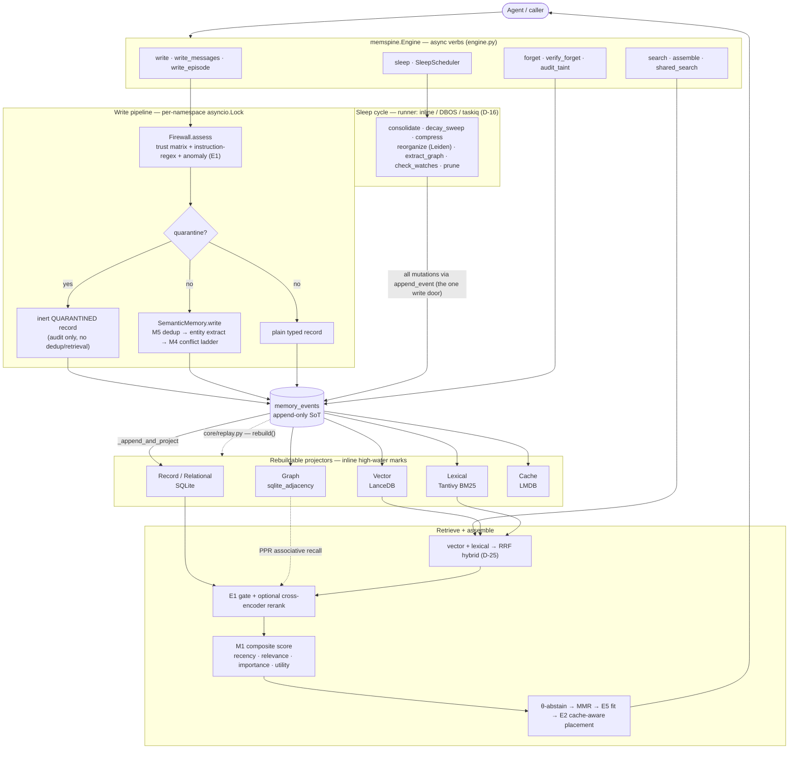
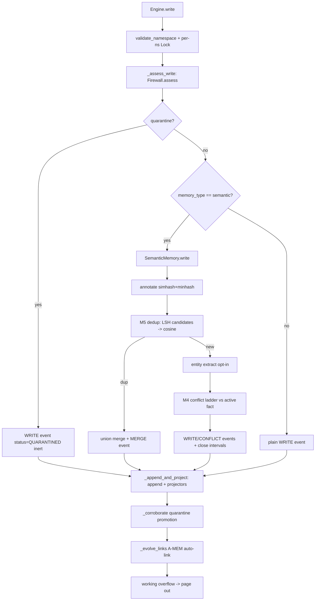
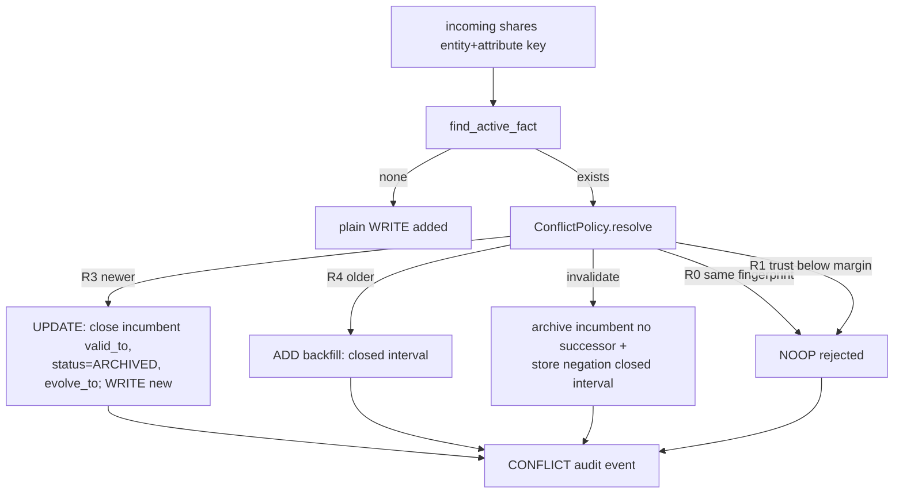
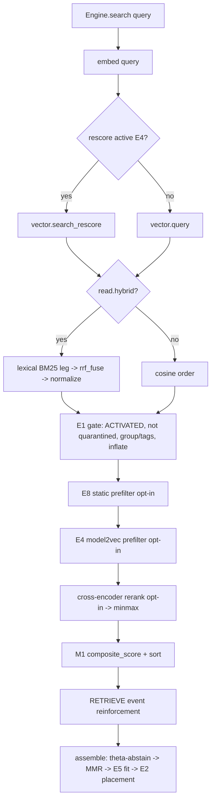
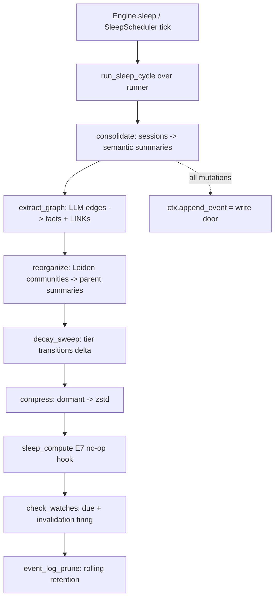

# memspine — Flow Graph

**Code-traced** (Pass #6, SHA `c6a9fe3`). One canonical top-level graph + the four sub-flows.
Source of truth: append-only `memory_events` (`core/events.py`); vector/lexical/graph/relational/cache are **rebuildable projectors** (`core/replay.py`), never a second SoT.

Companion: [`ARCHITECTURE_FLOWS.md`](./ARCHITECTURE_FLOWS.md) · [`ECOSYSTEM_METHODOLOGY.md`](./ECOSYSTEM_METHODOLOGY.md) §2 (memspine chapter).

---

## 1. Top-level engine flow graph

**Reading it:** every verb funnels writes through one door (`_append_and_project`) into the event log; projectors are replayed from that log and are the only things reads touch; the sleep cycle mutates only by appending more events. Nothing writes a read model directly — that is the event-sourced invariant (golden rule / ADR-001).

---

## 2. Write path

`Engine.write` (`engine.py:522`) → per-namespace lock → `_write_locked` (`engine.py:636`).

---

## 3. Update / conflict — M4 bi-temporal R-ladder

`ConflictPolicy.resolve` (`core/policies/conflict.py:44`), pure & deterministic, over records sharing an `(entity, attribute)` key. Single-active-fact invariant via `find_active_fact`.

---

## 4. Retrieve / rank / assemble

`Engine.search` (`engine.py:722`) → `Engine.assemble` (`engine.py:877`).

---

## 5. Sleep / background dynamics

`Engine.sleep` (`engine.py:1963`) → `workers/schedule.py:run_sleep_cycle` over the runner. Pipelines are pure idempotent step functions (`workers/pipelines.py`); runners decorate them (D-16/D-17).

---

## Legend

- **Solid arrow** = data/control flow. **Dashed arrow** = rebuild/recall path or "goes through the write door."
- **Cylinder** = the append-only event log (single source of truth).
- `Mn` = methodology algorithm ids; `En` = enhancement-program features (see [`ECOSYSTEM_METHODOLOGY.md`](./ECOSYSTEM_METHODOLOGY.md) §2 memspine, and `docs/exports/ECOSYSTEM_ALGORITHMS.csv`).
